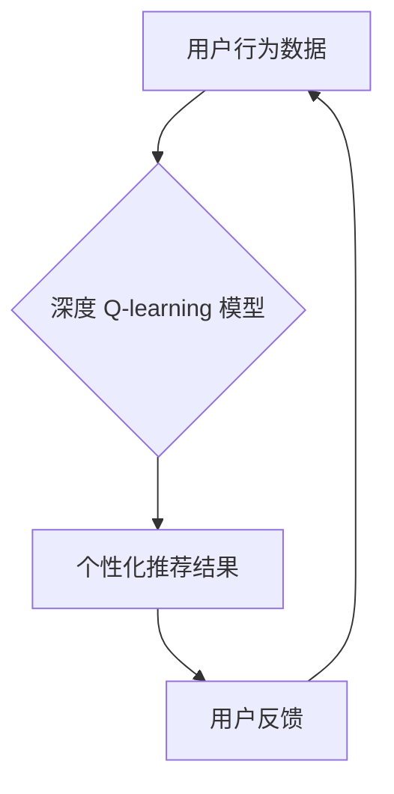

> 深度 Q-learning, 媒体行业, 强化学习, 推荐系统, 个性化内容, 算法优化

## 1. 背景介绍

在当今数据爆炸的时代，媒体行业面临着巨大的挑战和机遇。用户数量的激增和内容的多样化使得传统的内容推荐方式难以满足用户的个性化需求。如何精准推荐用户感兴趣的内容，提升用户体验，成为媒体行业亟待解决的关键问题。

强化学习 (Reinforcement Learning, RL) 作为一种机器学习范式，在解决复杂决策问题方面展现出强大的潜力。其中，深度 Q-learning 作为一种基于深度神经网络的强化学习算法，能够学习复杂的决策策略，并有效地解决推荐系统中的个性化问题。

## 2. 核心概念与联系

**2.1 强化学习 (Reinforcement Learning)**

强化学习是一种基于交互学习的机器学习方法。在强化学习中，一个智能体 (Agent) 与一个环境 (Environment) 进行交互。智能体通过与环境的交互，获得奖励 (Reward) 或惩罚 (Penalty)。智能体的目标是学习一个策略 (Policy)，使得在与环境交互的过程中获得最大的总奖励。

**2.2 Q-learning**

Q-learning 是一种经典的强化学习算法，它通过学习一个 Q-表 (Q-table) 来表示智能体在不同状态下采取不同动作的期望回报。Q-表是一个表格，其中每一行代表一个状态，每一列代表一个动作，每个单元格的值代表智能体在该状态下采取该动作的期望回报。

**2.3 深度 Q-learning**

深度 Q-learning 将深度神经网络引入 Q-learning 算法中，用于学习 Q-表。深度神经网络能够学习更复杂的决策策略，并处理高维度的输入数据。

**2.4 媒体行业应用场景**

在媒体行业，深度 Q-learning 可以应用于以下场景：

* **个性化内容推荐:** 根据用户的历史浏览记录、点赞行为等数据，学习用户的兴趣偏好，并推荐个性化的内容。
* **广告精准投放:** 根据用户的兴趣和行为特征，精准投放广告，提高广告点击率和转化率。
* **内容创作优化:** 分析用户对不同类型内容的反馈，优化内容创作策略，提高内容质量和用户粘性。

**2.5 Mermaid 流程图**



## 3. 核心算法原理 & 具体操作步骤

### 3.1 算法原理概述

深度 Q-learning 算法的核心思想是通过深度神经网络学习一个 Q-函数，该 Q-函数能够估计在给定状态下采取特定动作的期望回报。

算法的目标是最大化总的期望回报，即找到一个最优的策略，使得在与环境交互的过程中获得最大的总奖励。

### 3.2 算法步骤详解

1. **初始化:** 初始化深度神经网络，并设置学习率、折扣因子等超参数。
2. **环境交互:** 智能体与环境交互，获取当前状态和可能的动作。
3. **选择动作:** 根据当前状态和 Q-网络的输出，选择一个动作。
4. **执行动作:** 智能体执行选择的动作，并获得下一个状态和奖励。
5. **更新 Q-网络:** 使用 Bellman 方程更新 Q-网络的参数，使得 Q-网络能够更好地估计期望回报。
6. **重复步骤 2-5:** 重复上述步骤，直到达到预设的训练目标。

### 3.3 算法优缺点

**优点:**

* 能够学习复杂的决策策略。
* 可以处理高维度的输入数据。
* 能够在线学习，并随着时间的推移不断改进。

**缺点:**

* 训练过程可能需要大量的计算资源和时间。
* 需要精心设计奖励函数，否则可能会导致算法收敛到次优解。

### 3.4 算法应用领域

深度 Q-learning 算法在以下领域具有广泛的应用前景：

* **机器人控制:** 训练机器人执行复杂的任务，例如导航、抓取等。
* **游戏 AI:** 开发更智能的游戏 AI，能够与人类玩家进行更具挑战性的对抗。
* **金融交易:** 优化投资策略，提高投资收益。
* **医疗诊断:** 辅助医生进行疾病诊断，提高诊断准确率。

## 4. 数学模型和公式 & 详细讲解 & 举例说明

### 4.1 数学模型构建

深度 Q-learning 的核心是 Q-函数，它表示在给定状态 s 和动作 a 下，智能体获得的期望回报。

$$
Q(s, a) = E[R_{t+1} + \gamma \max_{a'} Q(s', a')]
$$

其中：

* $Q(s, a)$ 表示在状态 s 下执行动作 a 的期望回报。
* $R_{t+1}$ 表示在时间步 t+1 获得的奖励。
* $\gamma$ 表示折扣因子，控制未来奖励的权重。
* $s'$ 表示下一个状态。
* $a'$ 表示在下一个状态 s' 中可执行的动作。

### 4.2 公式推导过程

Bellman 方程是深度 Q-learning 算法的核心公式，它描述了 Q-函数的更新规则。

$$
Q(s, a) \leftarrow Q(s, a) + \alpha [R_{t+1} + \gamma \max_{a'} Q(s', a') - Q(s, a)]
$$

其中：

* $\alpha$ 表示学习率，控制学习速率。

### 4.3 案例分析与讲解

假设一个智能体在玩一个简单的游戏，游戏中有两种状态： "开始" 和 "结束"，两种动作： "前进" 和 "后退"。

* 在 "开始" 状态下，执行 "前进" 动作，获得奖励 1，进入 "结束" 状态。
* 在 "开始" 状态下，执行 "后退" 动作，获得奖励 0，保持在 "开始" 状态。
* 在 "结束" 状态下，无论执行何种动作，都获得奖励 0。

使用深度 Q-learning 算法，智能体可以学习到以下策略：

* 在 "开始" 状态下，选择 "前进" 动作。

## 5. 项目实践：代码实例和详细解释说明

### 5.1 开发环境搭建

* Python 3.x
* TensorFlow 或 PyTorch 深度学习框架
* NumPy 科学计算库
* Matplotlib 数据可视化库

### 5.2 源代码详细实现

```python
import tensorflow as tf

# 定义深度 Q-网络
class DeepQNetwork(tf.keras.Model):
    def __init__(self, state_size, action_size):
        super(DeepQNetwork, self).__init__()
        self.dense1 = tf.keras.layers.Dense(64, activation='relu')
        self.dense2 = tf.keras.layers.Dense(32, activation='relu')
        self.output = tf.keras.layers.Dense(action_size)

    def call(self, state):
        x = self.dense1(state)
        x = self.dense2(x)
        return self.output(x)

# 定义训练函数
def train(q_network, state, action, reward, next_state, done):
    with tf.GradientTape() as tape:
        q_values = q_network(state)
        target_q = reward + gamma * tf.reduce_max(q_network(next_state), axis=1)
        loss = tf.keras.losses.MeanSquaredError()(target_q, q_values[0, action])
    gradients = tape.gradient(loss, q_network.trainable_variables)
    optimizer.apply_gradients(zip(gradients, q_network.trainable_variables))

# ... 其他代码 ...
```

### 5.3 代码解读与分析

* `DeepQNetwork` 类定义了深度 Q-网络的结构，包括两个全连接层和一个输出层。
* `train` 函数定义了训练过程，包括计算损失函数、反向传播和更新网络参数。
* 其他代码负责数据预处理、环境交互、策略更新等操作。

### 5.4 运行结果展示

训练完成后，可以评估 Q-网络的性能，例如计算平均奖励或准确率。

## 6. 实际应用场景

### 6.1 个性化内容推荐

深度 Q-learning 可以用于构建个性化内容推荐系统，根据用户的历史浏览记录、点赞行为等数据，学习用户的兴趣偏好，并推荐个性化的内容。

### 6.2 广告精准投放

深度 Q-learning 可以用于优化广告投放策略，根据用户的兴趣和行为特征，精准投放广告，提高广告点击率和转化率。

### 6.3 内容创作优化

深度 Q-learning 可以用于分析用户对不同类型内容的反馈，优化内容创作策略，提高内容质量和用户粘性。

### 6.4 未来应用展望

随着深度学习技术的不断发展，深度 Q-learning 在媒体行业将有更广泛的应用前景，例如：

* **智能内容生成:** 利用深度 Q-learning 训练模型，自动生成个性化的内容，例如新闻报道、视频脚本等。
* **虚拟现实 (VR) 和增强现实 (AR) 体验:** 利用深度 Q-learning 优化 VR 和 AR 体验，提供更沉浸式的互动体验。
* **跨平台内容推荐:** 利用深度 Q-learning 建立跨平台的内容推荐系统，为用户提供更全面的内容体验。

## 7. 工具和资源推荐

### 7.1 学习资源推荐

* **书籍:**
    * Reinforcement Learning: An Introduction by Richard S. Sutton and Andrew G. Barto
    * Deep Reinforcement Learning Hands-On by Maxim Lapan
* **在线课程:**
    * Deep Reinforcement Learning Specialization by DeepLearning.AI
    * Reinforcement Learning by David Silver (University of DeepMind)

### 7.2 开发工具推荐

* **TensorFlow:** https://www.tensorflow.org/
* **PyTorch:** https://pytorch.org/
* **OpenAI Gym:** https://gym.openai.com/

### 7.3 相关论文推荐

* Deep Q-Network (DQN) by Volodymyr Mnih et al. (2015)
* Dueling Network Architectures for Deep Reinforcement Learning by Hado van Hasselt et al. (2016)
* Double Q-Learning by  Hasselt et al. (2015)

## 8. 总结：未来发展趋势与挑战

### 8.1 研究成果总结

深度 Q-learning 算法取得了显著的成果，在游戏、机器人控制、金融交易等领域取得了突破性的进展。

### 8.2 未来发展趋势

* **模型效率提升:** 研究更轻量级、更高效的深度 Q-learning 模型，降低训练成本和时间。
* **样本效率提升:** 研究更有效的样本利用策略，减少训练数据需求。
* **多智能体强化学习:** 研究多智能体协作的深度 Q-learning 算法，解决复杂多智能体交互问题。
* **迁移学习:** 研究深度 Q-learning 的迁移学习方法，将已训练好的模型应用于新的任务和领域。

### 8.3 面临的挑战

* **奖励函数设计:** 设计合适的奖励函数仍然是深度 Q-learning 算法面临的挑战。
* **探索与利用的平衡:** 在探索新策略和利用已知策略之间找到平衡点也是一个关键问题。
* **可解释性:** 深度 Q-learning 模型的决策过程难以解释，缺乏可解释性。

### 8.4 研究展望

未来，深度 Q-learning 算法将继续朝着更智能、更高效、更可解释的方向发展，在媒体行业和其他领域发挥更大的作用。

## 9. 附录：常见问题与解答

**Q1: 深度 Q-learning 和 Q-learning 的区别是什么？**

**A1:** 深度 Q-learning 使用深度神经网络来逼近 Q-函数，而传统的 Q-learning 使用表格或函数逼近。深度 Q-learning 可以处理高维度的输入数据，而传统的 Q-