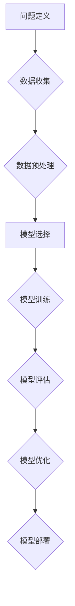

> 清华大学, 人工智能, 研究历程, 深度学习, 自然语言处理, 计算机视觉, 算法, 应用

## 1. 背景介绍

人工智能 (Artificial Intelligence, AI) 作为一门跨学科领域，近年来发展迅速，在各个领域都取得了突破性的进展。清华大学作为中国顶尖的学府，在人工智能研究方面也积累了丰富的经验和成果。本文将回顾清华大学人工智能研究的历程，探讨其发展轨迹、核心技术、重要成果以及未来展望。

## 2. 核心概念与联系

人工智能的核心概念是模拟和实现人类智能的行为。这包括学习、推理、决策、感知、语言理解等能力。

**人工智能研究的各个分支:**

* **机器学习 (Machine Learning):** 算法从数据中学习，不断改进其性能。
* **深度学习 (Deep Learning):** 使用多层神经网络进行特征提取和学习，取得了显著的成果。
* **自然语言处理 (Natural Language Processing, NLP):** 使计算机能够理解和处理人类语言。
* **计算机视觉 (Computer Vision):** 使计算机能够“看”图像和视频，并从中提取信息。
* **机器人学 (Robotics):** 设计和构建能够执行复杂任务的机器人。

**人工智能研究的流程:**



## 3. 核心算法原理 & 具体操作步骤

### 3.1  算法原理概述

**深度学习算法**是人工智能领域的核心算法之一，其原理是通过多层神经网络模拟人类大脑的结构和功能，学习数据中的复杂模式和关系。

**神经网络结构:**

* **输入层:**接收原始数据。
* **隐藏层:**进行特征提取和学习。
* **输出层:**输出最终结果。

**学习过程:**

* **前向传播:**将输入数据通过神经网络传递，得到输出结果。
* **反向传播:**计算输出结果与真实值的误差，并根据误差调整神经网络的权重和偏置，使模型的预测结果越来越准确。

### 3.2  算法步骤详解

1. **数据准备:**收集和预处理训练数据，将其转换为神经网络可以理解的格式。
2. **网络结构设计:**根据任务需求设计神经网络的结构，包括层数、节点数、激活函数等。
3. **参数初始化:**随机初始化神经网络的权重和偏置。
4. **前向传播:**将输入数据通过神经网络传递，得到输出结果。
5. **损失函数计算:**计算输出结果与真实值的误差，使用损失函数衡量误差的大小。
6. **反向传播:**根据误差反向传播，更新神经网络的权重和偏置。
7. **迭代训练:**重复步骤4-6，直到模型的性能达到预期的水平。

### 3.3  算法优缺点

**优点:**

* 能够学习复杂的数据模式。
* 性能优于传统机器学习算法。
* 在图像识别、语音识别、自然语言处理等领域取得了突破性进展。

**缺点:**

* 需要大量的训练数据。
* 训练过程耗时和耗能。
* 模型解释性较差。

### 3.4  算法应用领域

深度学习算法广泛应用于各个领域，例如：

* **图像识别:**人脸识别、物体检测、图像分类。
* **语音识别:**语音转文本、语音助手。
* **自然语言处理:**机器翻译、文本摘要、情感分析。
* **推荐系统:**商品推荐、内容推荐。
* **医疗诊断:**疾病预测、图像分析。

## 4. 数学模型和公式 & 详细讲解 & 举例说明

### 4.1  数学模型构建

深度学习模型的核心是神经网络，其数学模型可以表示为一系列的矩阵运算。

**神经网络层:**

* **输入层:** $x = [x_1, x_2, ..., x_n]$

* **隐藏层:** $h = f(W_1x + b_1)$

* **输出层:** $y = f(W_2h + b_2)$

其中:

* $x$ 是输入向量。
* $h$ 是隐藏层激活值。
* $y$ 是输出向量。
* $W_1$, $W_2$ 是权重矩阵。
* $b_1$, $b_2$ 是偏置向量。
* $f$ 是激活函数。

### 4.2  公式推导过程

**损失函数:**

常用的损失函数包括均方误差 (MSE) 和交叉熵 (Cross-Entropy)。

* **MSE:** $L = \frac{1}{n}\sum_{i=1}^{n}(y_i - \hat{y}_i)^2$

* **Cross-Entropy:** $L = -\frac{1}{n}\sum_{i=1}^{n}y_i \log(\hat{y}_i)$

**梯度下降:**

梯度下降算法用于更新神经网络的权重和偏置，使其朝着最小化损失函数的方向更新。

* $\Delta W = -\alpha \frac{\partial L}{\partial W}$

* $\Delta b = -\alpha \frac{\partial L}{\partial b}$

其中:

* $\alpha$ 是学习率。

### 4.3  案例分析与讲解

**图像分类:**

使用深度学习算法进行图像分类，例如识别猫和狗的图片。

* **数据:**收集大量猫和狗的图片，并进行标记。
* **模型:**设计一个卷积神经网络 (CNN) 模型，用于提取图像特征。
* **训练:**使用训练数据训练CNN模型，使其能够准确地识别猫和狗的图片。
* **测试:**使用测试数据评估模型的性能。

## 5. 项目实践：代码实例和详细解释说明

### 5.1  开发环境搭建

使用Python语言和深度学习框架TensorFlow或PyTorch进行开发。

### 5.2  源代码详细实现

```python
import tensorflow as tf

# 定义模型结构
model = tf.keras.models.Sequential([
    tf.keras.layers.Conv2D(32, (3, 3), activation='relu', input_shape=(28, 28, 1)),
    tf.keras.layers.MaxPooling2D((2, 2)),
    tf.keras.layers.Conv2D(64, (3, 3), activation='relu'),
    tf.keras.layers.MaxPooling2D((2, 2)),
    tf.keras.layers.Flatten(),
    tf.keras.layers.Dense(10, activation='softmax')
])

# 编译模型
model.compile(optimizer='adam',
              loss='sparse_categorical_crossentropy',
              metrics=['accuracy'])

# 训练模型
model.fit(x_train, y_train, epochs=5)

# 评估模型
loss, accuracy = model.evaluate(x_test, y_test)
print('Test loss:', loss)
print('Test accuracy:', accuracy)
```

### 5.3  代码解读与分析

* **模型结构:** 使用了卷积神经网络 (CNN) 模型，包含卷积层、池化层和全连接层。
* **激活函数:** 使用了ReLU激活函数，可以提高模型的学习能力。
* **损失函数:** 使用了交叉熵损失函数，适合分类任务。
* **优化器:** 使用了Adam优化器，可以加速模型训练。

### 5.4  运行结果展示

训练完成后，可以评估模型的性能，例如准确率。

## 6. 实际应用场景

### 6.1  医疗诊断

* **疾病预测:** 使用深度学习算法分析患者的医疗影像和病历数据，预测疾病的风险。
* **图像分析:** 使用深度学习算法分析医学影像，例如X光片、CT扫描和MRI扫描，辅助医生诊断疾病。

### 6.2  金融风险管理

* **欺诈检测:** 使用深度学习算法分析交易数据，识别欺诈行为。
* **信用评分:** 使用深度学习算法分析客户的财务数据，评估其信用风险。

### 6.3  智能客服

* **聊天机器人:** 使用深度学习算法训练聊天机器人，能够与用户进行自然语言对话，提供服务和帮助。

## 7. 工具和资源推荐

### 7.1  学习资源推荐

* **在线课程:** Coursera, edX, Udacity
* **书籍:** 深度学习，机器学习，人工智能

### 7.2  开发工具推荐

* **深度学习框架:** TensorFlow, PyTorch, Keras
* **编程语言:** Python

### 7.3  相关论文推荐

* **ImageNet Classification with Deep Convolutional Neural Networks**
* **Attention Is All You Need**
* **BERT: Pre-training of Deep Bidirectional Transformers for Language Understanding**

## 8. 总结：未来发展趋势与挑战

### 8.1  研究成果总结

清华大学在人工智能研究方面取得了丰硕的成果，在多个领域都处于国际领先水平。

### 8.2  未来发展趋势

* **更强大的模型:** 研究更深、更广的深度学习模型，提高模型的性能和泛化能力。
* **更有效的算法:** 研究更有效的训练算法，降低训练成本和时间。
* **更广泛的应用:** 将人工智能技术应用于更多领域，解决更多实际问题。

### 8.3  面临的挑战

* **数据获取和隐私保护:** 训练深度学习模型需要大量的训练数据，如何获取高质量的数据并保护用户隐私是一个挑战。
* **模型解释性和可信度:** 深度学习模型的决策过程往往难以解释，如何提高模型的解释性和可信度是一个重要问题。
* **伦理和社会影响:** 人工智能技术的发展可能带来伦理和社会问题，需要认真思考和应对。

### 8.4  研究展望

清华大学将继续致力于人工智能研究，探索人工智能的未来发展方向，为人类社会创造更多价值。

## 9. 附录：常见问题与解答

* **什么是深度学习？**

深度学习是一种机器学习的子领域，它使用多层神经网络来学习数据中的复杂模式和关系。

* **深度学习有哪些应用？**

深度学习应用广泛，包括图像识别、语音识别、自然语言处理、推荐系统等。

* **如何学习深度学习？**

可以通过在线课程、书籍和实践项目学习深度学习。

作者：禅与计算机程序设计艺术 / Zen and the Art of Computer Programming


<end_of_turn>