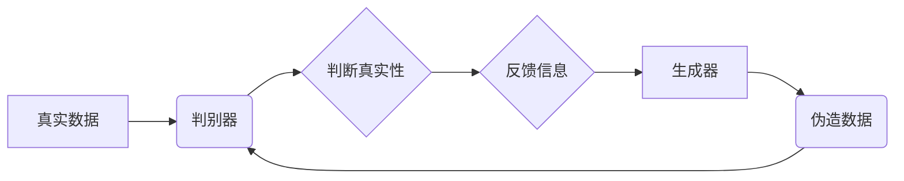

> 生成对抗网络 (GAN)，深度学习，生成模型，对抗训练，图像生成，代码生成

## 1. 背景介绍

在深度学习领域，生成模型一直是研究的热点之一。传统的生成模型，例如变分自编码器 (VAE)，通常需要对数据进行概率建模，并通过采样生成新的数据。然而，这些模型生成的样本往往缺乏真实数据的多样性和质量。

生成对抗网络 (GAN) 是一种新颖的生成模型，由两个神经网络构成：生成器 (Generator) 和判别器 (Discriminator)。生成器试图生成逼真的样本，而判别器则试图区分真实样本和生成样本。这两个网络在对抗训练中相互竞争，最终使得生成器能够生成与真实数据几乎 indistinguishable 的样本。

GAN 的提出极大地推动了生成模型的发展，在图像生成、文本生成、语音合成等领域取得了显著的成果。

## 2. 核心概念与联系

GAN 的核心概念是“对抗训练”。生成器和判别器之间形成了一种博弈关系，互相学习和提升。

**Mermaid 流程图:**



**核心概念:**

* **生成器 (Generator):** 负责生成新的样本，输入随机噪声，输出与真实数据相似的样本。
* **判别器 (Discriminator):** 负责判断样本的真实性，输入样本，输出一个概率值，表示样本是真实数据还是生成数据。
* **对抗训练:** 生成器和判别器在对抗训练中相互学习。生成器试图生成更逼真的样本，而判别器试图更好地区分真实样本和生成样本。

## 3. 核心算法原理 & 具体操作步骤

### 3.1  算法原理概述

GAN 的训练过程可以看作是一个最小化-最大化的博弈过程。

* **判别器的目标:** 最大化正确分类真实样本和生成样本的概率。
* **生成器的目标:** 最小化判别器对生成样本的识别概率。

通过不断地训练和更新，生成器最终能够生成与真实数据几乎 indistinguishable 的样本。

### 3.2  算法步骤详解

1. **初始化:** 初始化生成器和判别器的参数。
2. **生成样本:** 生成器从随机噪声中生成样本。
3. **判别样本:** 判别器对真实样本和生成样本进行分类。
4. **更新判别器:** 根据判别器的分类结果，更新判别器的参数。
5. **更新生成器:** 根据判别器对生成样本的识别概率，更新生成器的参数。
6. **重复步骤 2-5:** 重复上述步骤，直到生成器能够生成逼真的样本。

### 3.3  算法优缺点

**优点:**

* 可以生成高质量、逼真的样本。
* 不需要对数据进行概率建模。
* 可以应用于各种类型的生成任务。

**缺点:**

* 训练过程比较复杂，容易陷入局部最优解。
* 需要大量的训练数据。
* 评估生成样本的质量比较困难。

### 3.4  算法应用领域

GAN 在图像生成、文本生成、语音合成、视频生成、药物设计、数据增强等领域都有广泛的应用。

## 4. 数学模型和公式 & 详细讲解 & 举例说明

### 4.1  数学模型构建

GAN 的数学模型主要由两个部分组成：生成器 G 和判别器 D。

* **生成器 G:**

$$
G(z)
$$

其中，$z$ 是随机噪声向量，$G(z)$ 是生成器生成的样本。

* **判别器 D:**

$$
D(x)
$$

其中，$x$ 是输入样本，$D(x)$ 是判别器输出的概率值，表示样本是真实数据还是生成数据。

### 4.2  公式推导过程

GAN 的训练目标是最大化判别器的准确率，同时最小化生成器的损失函数。

* **判别器损失函数:**

$$
L_D(D,G) = E_{x \sim p_{data}(x)}[log D(x)] + E_{z \sim p_z(z)}[log(1 - D(G(z)))]
$$

* **生成器损失函数:**

$$
L_G(D,G) = E_{z \sim p_z(z)}[log(D(G(z)))]
$$

### 4.3  案例分析与讲解

假设我们想要使用 GAN 生成图像。

* **真实数据:** 我们使用真实图像数据集作为训练数据。
* **生成器:** 我们使用一个卷积神经网络作为生成器，输入随机噪声，输出图像。
* **判别器:** 我们使用另一个卷积神经网络作为判别器，输入图像，输出一个概率值，表示图像是真实图像还是生成图像。

通过对抗训练，生成器逐渐能够生成与真实图像相似的图像。

## 5. 项目实践：代码实例和详细解释说明

### 5.1  开发环境搭建

* Python 3.6+
* TensorFlow 或 PyTorch
* CUDA 和 cuDNN (可选)

### 5.2  源代码详细实现

```python
import tensorflow as tf

# 定义生成器网络
def generator(z):
    # ...

# 定义判别器网络
def discriminator(x):
    # ...

# 定义损失函数和优化器
optimizer_G = tf.keras.optimizers.Adam(learning_rate=0.0002, beta_1=0.5)
optimizer_D = tf.keras.optimizers.Adam(learning_rate=0.0002, beta_1=0.5)
loss_fn = tf.keras.losses.BinaryCrossentropy()

# 定义训练循环
def train_step(real_images, z):
    # ...

# 训练模型
for epoch in range(num_epochs):
    for batch in dataset:
        real_images, z = batch
        train_step(real_images, z)

```

### 5.3  代码解读与分析

* **生成器网络:** 生成器网络负责从随机噪声中生成图像。
* **判别器网络:** 判别器网络负责判断图像是否为真实图像。
* **损失函数:** 损失函数用于衡量生成器和判别器的性能。
* **优化器:** 优化器用于更新生成器和判别器的参数。
* **训练循环:** 训练循环用于迭代训练生成器和判别器。

### 5.4  运行结果展示

训练完成后，我们可以使用生成器生成新的图像。

## 6. 实际应用场景

### 6.1  图像生成

GAN 可以用于生成各种类型的图像，例如人脸、风景、物体等。

### 6.2  文本生成

GAN 可以用于生成文本，例如诗歌、小说、代码等。

### 6.3  语音合成

GAN 可以用于生成语音，例如人声、音乐等。

### 6.4  未来应用展望

GAN 的应用前景广阔，未来可能在以下领域得到更广泛的应用：

* **医疗保健:** 生成医学图像、预测疾病风险。
* **金融:** 检测欺诈交易、预测股票价格。
* **教育:** 生成个性化学习内容。

## 7. 工具和资源推荐

### 7.1  学习资源推荐

* **论文:**

* Goodfellow, I., Pouget-Abadie, J., Mirza, M., Xu, B., Warde-Farley, D., Ozair, S., ... & Bengio, Y. (2014). Generative adversarial nets. In Advances in neural information processing systems (pp. 2672-2680).

* **博客:**

* https://blog.openai.com/generative-adversarial-nets/

### 7.2  开发工具推荐

* **TensorFlow:** https://www.tensorflow.org/
* **PyTorch:** https://pytorch.org/

### 7.3  相关论文推荐

* https://arxiv.org/abs/1701.04862
* https://arxiv.org/abs/1609.04837

## 8. 总结：未来发展趋势与挑战

### 8.1  研究成果总结

GAN 作为一种新颖的生成模型，取得了显著的成果，在图像生成、文本生成、语音合成等领域取得了突破。

### 8.2  未来发展趋势

* **模型架构:** 研究更强大的 GAN 架构，例如 StyleGAN、BigGAN 等。
* **训练方法:** 研究更有效的训练方法，例如 Progressive Growing of GANs、Wasserstein GAN 等。
* **应用领域:** 将 GAN 应用于更多领域，例如医疗保健、金融、教育等。

### 8.3  面临的挑战

* **训练稳定性:** GAN 的训练过程比较复杂，容易陷入局部最优解。
* **样本质量:** 生成样本的质量仍然存在提升空间。
* **伦理问题:** GAN 可以生成逼真的虚假内容，可能带来伦理问题。

### 8.4  研究展望

未来，GAN 研究将继续朝着更强大、更稳定、更安全的方向发展。


## 9. 附录：常见问题与解答

**Q1: GAN 的训练过程为什么容易陷入局部最优解？**

**A1:** GAN 的训练过程是一个非凸优化问题，存在多个局部最优解。生成器和判别器之间的博弈关系也可能导致训练过程不稳定。

**Q2: 如何评估 GAN 生成的样本质量？**

**A2:** 评估 GAN 生成的样本质量是一个复杂的问题，通常需要结合多种指标，例如图像质量、多样性、真实性等。

**Q3: GAN 的应用有哪些伦理问题？**

**A3:** GAN 可以生成逼真的虚假内容，可能被用于造假、传播虚假信息等恶意目的。因此，在使用 GAN 时需要考虑伦理问题，并采取相应的措施进行监管。


作者：禅与计算机程序设计艺术 / Zen and the Art of Computer Programming 
<end_of_turn>