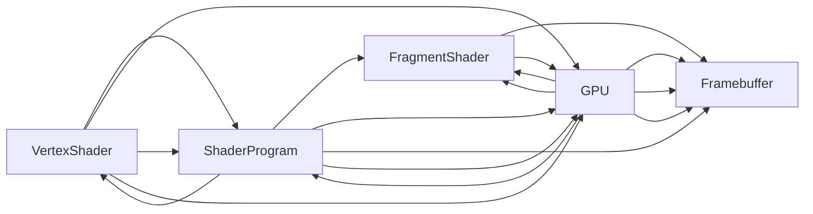

                 

# WebGL：浏览器中的3D图形渲染

> 关键词：WebGL, 3D图形渲染, 浏览器, GPU加速, 着色器语言, 光照, 透明, 反射, 阴影, 性能优化

## 1. 背景介绍

随着Web技术的不断发展，网页不再仅仅是静态内容的展示平台，而是越来越向着交互、动态、沉浸式体验的方向发展。3D图形渲染技术，作为创建沉浸式虚拟现实（VR）、增强现实（AR）等场景的关键技术，对Web开发提出了新的要求。WebGL正是在这一背景下诞生的，作为Web浏览器中3D图形渲染的标准。

WebGL是一个基于OpenGL ES 2.0的JavaScript API，可以实现在浏览器中渲染高质量的3D图形。它不仅可以让开发者将复杂的3D图形渲染逻辑封装在网页中，实现交互式3D场景，而且还可以通过GPU加速，大幅提高渲染效率，减少带宽和资源消耗。

WebGL的出现，为Web开发注入了全新的活力，为Web应用程序的图形化展示提供了全新的可能性。无论是游戏开发、动画制作、虚拟旅游、医疗可视化等，WebGL都展现了其强大的潜力。

## 2. 核心概念与联系

### 2.1 核心概念概述

为了更好地理解WebGL，首先需要了解以下核心概念：

- **WebGL**：WebGL是一种基于OpenGL ES 2.0标准的API，用于在Web浏览器中渲染3D图形。WebGL使用JavaScript作为编程语言，但底层是由GPU进行计算和渲染的。

- **OpenGL ES**：OpenGL ES是OpenGL的移动设备版本，专门为嵌入式设备和移动平台设计。OpenGL ES 2.0是WebGL的基础，提供了基本的2D和3D图形渲染功能。

- **着色器（Shader）**：着色器是WebGL渲染管道中最核心的组件。每个着色器负责处理输入数据，并将其转换为输出图像。常见的着色器有顶点着色器和片段着色器。

- **顶点着色器（Vertex Shader）**：负责处理顶点坐标、颜色、法线等数据，将其转换为GPU可识别的数据格式。

- **片段着色器（Fragment Shader）**：负责处理像素颜色、透明度、光照等数据，生成最终的像素颜色。

- **GPU加速**：WebGL的渲染过程全部由GPU完成，通过并行计算和高效的算法实现，显著提高了渲染效率。

### 2.2 核心概念原理和架构的 Mermaid 流程图



这个流程图展示了WebGL渲染管道的基本流程：

1. 顶点着色器（Vertex Shader）处理输入的顶点数据，并将其转换为GPU可识别的格式。
2. 顶点数据传递给GPU，由GPU进行顶点变换和投影。
3. GPU根据顶点着色器处理后的数据，生成像素数据，并由片段着色器（Fragment Shader）处理像素颜色、透明度、光照等数据。
4. 片段着色器生成最终的像素颜色，并存储在帧缓存（Framebuffer）中。
5. 最终生成的图像在屏幕上显示。

## 3. 核心算法原理 & 具体操作步骤

### 3.1 算法原理概述

WebGL的渲染过程主要依赖于以下几个关键算法：

- **顶点着色器**：将顶点坐标和颜色数据转换为GPU可识别的格式，并进行顶点变换、投影等操作。
- **片段着色器**：处理像素颜色、透明度、光照等数据，生成最终的像素颜色。
- **光照算法**：模拟光源对物体的光照效果，增强图像的真实感。
- **透明处理**：处理场景中的透明物体，实现复杂的深度缓冲和混合效果。
- **阴影算法**：实现物体的阴影效果，增强场景的真实感和立体感。

### 3.2 算法步骤详解

WebGL的渲染流程可以大致分为以下几个步骤：

1. **初始化WebGL上下文**：
   ```javascript
   const canvas = document.getElementById('webgl-canvas');
   const gl = canvas.getContext('webgl') || canvas.getContext('experimental-webgl');
   ```

2. **加载着色器程序**：
   ```javascript
   const vertexShaderSource = `
    attribute vec3 a_position;
    uniform mat4 u_matrix;
    void main() {
        gl_Position = u_matrix * vec4(a_position, 1.0);
    }
   `;
   const fragmentShaderSource = `
    void main() {
        gl_FragColor = vec4(1.0, 0.0, 0.0, 1.0);
    }
   `;
   const vertexShader = gl.createShader(gl.VERTEX_SHADER);
   gl.shaderSource(vertexShader, vertexShaderSource);
   gl.compileShader(vertexShader);
   const fragmentShader = gl.createShader(gl.FRAGMENT_SHADER);
   gl.shaderSource(fragmentShader, fragmentShaderSource);
   gl.compileShader(fragmentShader);
   const shaderProgram = gl.createProgram();
   gl.attachShader(shaderProgram, vertexShader);
   gl.attachShader(shaderProgram, fragmentShader);
   gl.linkProgram(shaderProgram);
   gl.useProgram(shaderProgram);
   ```

3. **创建缓冲区和顶点数据**：
   ```javascript
   const positionBuffer = gl.createBuffer();
   gl.bindBuffer(gl.ARRAY_BUFFER, positionBuffer);
   const positions = [
     -1.0, -1.0, 0.0,
     1.0, -1.0, 0.0,
     -1.0, 1.0, 0.0,
     1.0, 1.0, 0.0
   ];
   gl.bufferData(gl.ARRAY_BUFFER, new Float32Array(positions), gl.STATIC_DRAW);
   const positionAttributeLocation = gl.getAttribLocation(shaderProgram, 'a_position');
   gl.vertexAttribPointer(positionAttributeLocation, 3, gl.FLOAT, false, 0, 0);
   gl.enableVertexAttribArray(positionAttributeLocation);
   ```

4. **设置模型视图投影矩阵**：
   ```javascript
   const matrix = mat4.create();
   mat4.translate(matrix, matrix, [0.0, 0.0, -6.0]);
   mat4.scale(matrix, matrix, [2.0, 2.0, 2.0]);
   const matrixLocation = gl.getUniformLocation(shaderProgram, 'u_matrix');
   gl.uniformMatrix4fv(matrixLocation, false, matrix);
   ```

5. **渲染场景**：
   ```javascript
   gl.viewport(0, 0, canvas.width, canvas.height);
   gl.clearColor(0.0, 0.0, 0.0, 1.0);
   gl.clear(gl.COLOR_BUFFER_BIT | gl.DEPTH_BUFFER_BIT);
   gl.drawArrays(gl.TRIANGLE_STRIP, 0, 4);
   ```

### 3.3 算法优缺点

WebGL的优点包括：

- **跨平台性**：WebGL可以在任何支持HTML5的浏览器中运行，无需插件，非常方便。
- **高性能**：WebGL利用GPU加速，可以处理复杂的3D渲染，渲染效率高。
- **简洁易学**：WebGL的API设计简洁，易于学习和使用。

WebGL的缺点包括：

- **兼容性问题**：不同浏览器对WebGL的支持程度不同，一些老版本浏览器可能不支持。
- **性能瓶颈**：WebGL渲染大规模场景时，可能会遇到性能瓶颈，需要优化。
- **调试困难**：WebGL渲染管道涉及多层次的抽象，调试较为困难。

### 3.4 算法应用领域

WebGL在以下几个领域有着广泛的应用：

- **游戏开发**：WebGL可以用于开发高性能的3D游戏，如《WebGL光辉》、《WebGL高手》等。
- **虚拟现实**：WebGL可以实现虚拟现实场景的渲染，如Google的Daydream平台。
- **数据可视化**：WebGL可以用于绘制复杂的数据可视化图表，如地图、地球仪等。
- **交互式动画**：WebGL可以用于制作交互式的动画，如粒子效果、流体模拟等。

## 4. 数学模型和公式 & 详细讲解 & 举例说明

### 4.1 数学模型构建

WebGL的渲染过程涉及到多个数学模型，包括投影模型、光照模型等。以下是几个常用的数学模型：

- **投影模型**：
  $$
  \text{Projection} = \text{PerspectiveProjection} * \text{OrthographicProjection}
  $$

- **光照模型**：
  $$
  I = \text{Diffuse} + \text{Specular} + \text{Ambient}
  $$

### 4.2 公式推导过程

以下是光照模型的公式推导过程：

- **漫反射（Diffuse）**：
  $$
  I_D = \frac{L_D \cdot N \cdot F}{\pi}
  $$
  其中，$L_D$ 为入射光线强度，$N$ 为法线方向，$F$ 为反射率。

- **镜面反射（Specular）**：
  $$
  I_S = \frac{L_S \cdot N \cdot V \cdot F}{4 \cdot \cos(\theta)^2}
  $$
  其中，$L_S$ 为镜面光线强度，$V$ 为视点方向，$\theta$ 为镜面光线与法线的夹角。

- **环境光（Ambient）**：
  $$
  I_A = I_A \cdot F
  $$
  其中，$I_A$ 为环境光强度。

### 4.3 案例分析与讲解

以下是一个简单的WebGL渲染示例，展示了一个红色的正方形在三维空间中的旋转：

```html
<!DOCTYPE html>
<html>
<head>
    <meta charset="UTF-8">
    <title>WebGL 3D Rendering</title>
    <style>
        canvas {
            width: 100%;
            height: 100%;
        }
    </style>
</head>
<body>
    <canvas id="webgl-canvas"></canvas>
    <script>
        const canvas = document.getElementById('webgl-canvas');
        const gl = canvas.getContext('webgl') || canvas.getContext('experimental-webgl');

        const vertexShaderSource = `
            attribute vec3 a_position;
            uniform mat4 u_matrix;
            void main() {
                gl_Position = u_matrix * vec4(a_position, 1.0);
            }
        `;
        const fragmentShaderSource = `
            void main() {
                gl_FragColor = vec4(1.0, 0.0, 0.0, 1.0);
            }
        `;

        const vertexShader = gl.createShader(gl.VERTEX_SHADER);
        gl.shaderSource(vertexShader, vertexShaderSource);
        gl.compileShader(vertexShader);

        const fragmentShader = gl.createShader(gl.FRAGMENT_SHADER);
        gl.shaderSource(fragmentShader, fragmentShaderSource);
        gl.compileShader(fragmentShader);

        const shaderProgram = gl.createProgram();
        gl.attachShader(shaderProgram, vertexShader);
        gl.attachShader(shaderProgram, fragmentShader);
        gl.linkProgram(shaderProgram);
        gl.useProgram(shaderProgram);

        const positionBuffer = gl.createBuffer();
        gl.bindBuffer(gl.ARRAY_BUFFER, positionBuffer);
        const positions = [
            -1.0, -1.0, 0.0,
            1.0, -1.0, 0.0,
            -1.0, 1.0, 0.0,
            1.0, 1.0, 0.0
        ];
        gl.bufferData(gl.ARRAY_BUFFER, new Float32Array(positions), gl.STATIC_DRAW);

        const positionAttributeLocation = gl.getAttribLocation(shaderProgram, 'a_position');
        gl.vertexAttribPointer(positionAttributeLocation, 3, gl.FLOAT, false, 0, 0);
        gl.enableVertexAttribArray(positionAttributeLocation);

        const matrix = mat4.create();
        mat4.translate(matrix, matrix, [0.0, 0.0, -6.0]);
        mat4.scale(matrix, matrix, [2.0, 2.0, 2.0]);
        const matrixLocation = gl.getUniformLocation(shaderProgram, 'u_matrix');
        gl.uniformMatrix4fv(matrixLocation, false, matrix);

        gl.viewport(0, 0, canvas.width, canvas.height);
        gl.clearColor(0.0, 0.0, 0.0, 1.0);
        gl.clear(gl.COLOR_BUFFER_BIT | gl.DEPTH_BUFFER_BIT);
        gl.drawArrays(gl.TRIANGLE_STRIP, 0, 4);

        function update() {
            const time = Date.now() / 1000;
            const rotationY = time * 0.5;
            const rotationX = time * 0.3;
            mat4.rotateY(matrix, matrix, rotationY);
            mat4.rotateX(matrix, matrix, rotationX);
            gl.uniformMatrix4fv(matrixLocation, false, matrix);
            requestAnimationFrame(update);
        }
        update();
    </script>
</body>
</html>
```

这个示例展示了如何创建一个旋转的红色正方形。通过不断旋转矩阵，可以改变正方形在三维空间中的位置和姿态。

## 5. 项目实践：代码实例和详细解释说明

### 5.1 开发环境搭建

WebGL开发环境非常简单，只需要一个支持HTML5的浏览器即可。建议使用Chrome或Firefox等现代浏览器，以确保WebGL的最佳兼容性。

### 5.2 源代码详细实现

以下是使用WebGL实现一个简单的三维场景的代码示例：

```html
<!DOCTYPE html>
<html>
<head>
    <meta charset="UTF-8">
    <title>WebGL 3D Rendering</title>
    <style>
        canvas {
            width: 100%;
            height: 100%;
        }
    </style>
</head>
<body>
    <canvas id="webgl-canvas"></canvas>
    <script>
        const canvas = document.getElementById('webgl-canvas');
        const gl = canvas.getContext('webgl') || canvas.getContext('experimental-webgl');

        const vertexShaderSource = `
            attribute vec3 a_position;
            uniform mat4 u_matrix;
            void main() {
                gl_Position = u_matrix * vec4(a_position, 1.0);
            }
        `;
        const fragmentShaderSource = `
            void main() {
                gl_FragColor = vec4(1.0, 0.0, 0.0, 1.0);
            }
        `;

        const vertexShader = gl.createShader(gl.VERTEX_SHADER);
        gl.shaderSource(vertexShader, vertexShaderSource);
        gl.compileShader(vertexShader);

        const fragmentShader = gl.createShader(gl.FRAGMENT_SHADER);
        gl.shaderSource(fragmentShader, fragmentShaderSource);
        gl.compileShader(fragmentShader);

        const shaderProgram = gl.createProgram();
        gl.attachShader(shaderProgram, vertexShader);
        gl.attachShader(shaderProgram, fragmentShader);
        gl.linkProgram(shaderProgram);
        gl.useProgram(shaderProgram);

        const positionBuffer = gl.createBuffer();
        gl.bindBuffer(gl.ARRAY_BUFFER, positionBuffer);
        const positions = [
            -1.0, -1.0, 0.0,
            1.0, -1.0, 0.0,
            -1.0, 1.0, 0.0,
            1.0, 1.0, 0.0
        ];
        gl.bufferData(gl.ARRAY_BUFFER, new Float32Array(positions), gl.STATIC_DRAW);

        const positionAttributeLocation = gl.getAttribLocation(shaderProgram, 'a_position');
        gl.vertexAttribPointer(positionAttributeLocation, 3, gl.FLOAT, false, 0, 0);
        gl.enableVertexAttribArray(positionAttributeLocation);

        const matrix = mat4.create();
        mat4.translate(matrix, matrix, [0.0, 0.0, -6.0]);
        mat4.scale(matrix, matrix, [2.0, 2.0, 2.0]);
        const matrixLocation = gl.getUniformLocation(shaderProgram, 'u_matrix');
        gl.uniformMatrix4fv(matrixLocation, false, matrix);

        gl.viewport(0, 0, canvas.width, canvas.height);
        gl.clearColor(0.0, 0.0, 0.0, 1.0);
        gl.clear(gl.COLOR_BUFFER_BIT | gl.DEPTH_BUFFER_BIT);
        gl.drawArrays(gl.TRIANGLE_STRIP, 0, 4);

        function update() {
            const time = Date.now() / 1000;
            const rotationY = time * 0.5;
            const rotationX = time * 0.3;
            mat4.rotateY(matrix, matrix, rotationY);
            mat4.rotateX(matrix, matrix, rotationX);
            gl.uniformMatrix4fv(matrixLocation, false, matrix);
            requestAnimationFrame(update);
        }
        update();
    </script>
</body>
</html>
```

### 5.3 代码解读与分析

这个示例展示了如何创建一个简单的三维场景，其中包含一个红色的正方形。通过不断旋转矩阵，可以改变正方形在三维空间中的位置和姿态。代码的详细解释如下：

1. **初始化WebGL上下文**：
   ```javascript
   const canvas = document.getElementById('webgl-canvas');
   const gl = canvas.getContext('webgl') || canvas.getContext('experimental-webgl');
   ```

2. **加载着色器程序**：
   ```javascript
   const vertexShaderSource = `
    attribute vec3 a_position;
    uniform mat4 u_matrix;
    void main() {
        gl_Position = u_matrix * vec4(a_position, 1.0);
    }
   `;
   const fragmentShaderSource = `
    void main() {
        gl_FragColor = vec4(1.0, 0.0, 0.0, 1.0);
    }
   `;
   // 着色器编译和链接
   ```

3. **创建缓冲区和顶点数据**：
   ```javascript
   const positionBuffer = gl.createBuffer();
   gl.bindBuffer(gl.ARRAY_BUFFER, positionBuffer);
   const positions = [
     -1.0, -1.0, 0.0,
     1.0, -1.0, 0.0,
     -1.0, 1.0, 0.0,
     1.0, 1.0, 0.0
   ];
   gl.bufferData(gl.ARRAY_BUFFER, new Float32Array(positions), gl.STATIC_DRAW);
   // 设置顶点属性
   ```

4. **设置模型视图投影矩阵**：
   ```javascript
   const matrix = mat4.create();
   mat4.translate(matrix, matrix, [0.0, 0.0, -6.0]);
   mat4.scale(matrix, matrix, [2.0, 2.0, 2.0]);
   const matrixLocation = gl.getUniformLocation(shaderProgram, 'u_matrix');
   gl.uniformMatrix4fv(matrixLocation, false, matrix);
   ```

5. **渲染场景**：
   ```javascript
   gl.viewport(0, 0, canvas.width, canvas.height);
   gl.clearColor(0.0, 0.0, 0.0, 1.0);
   gl.clear(gl.COLOR_BUFFER_BIT | gl.DEPTH_BUFFER_BIT);
   gl.drawArrays(gl.TRIANGLE_STRIP, 0, 4);
   ```

6. **更新场景**：
   ```javascript
   function update() {
       const time = Date.now() / 1000;
       const rotationY = time * 0.5;
       const rotationX = time * 0.3;
       mat4.rotateY(matrix, matrix, rotationY);
       mat4.rotateX(matrix, matrix, rotationX);
       gl.uniformMatrix4fv(matrixLocation, false, matrix);
       requestAnimationFrame(update);
   }
   update();
   ```

## 6. 实际应用场景

WebGL在实际应用中已经展现出了强大的潜力，以下是几个典型应用场景：

### 6.1 游戏开发

WebGL被广泛应用于网页游戏开发，如《WebGL光辉》、《WebGL高手》等。WebGL游戏以其高性能、跨平台性强、开发便捷等特点，受到了游戏开发者的广泛青睐。

### 6.2 虚拟现实

WebGL在虚拟现实（VR）领域也有广泛应用，如Google的Daydream平台。通过WebGL，开发者可以在浏览器中渲染复杂的3D场景，为用户提供沉浸式的虚拟现实体验。

### 6.3 数据可视化

WebGL可以用于绘制复杂的数据可视化图表，如地图、地球仪等。WebGL的强大渲染能力，使得数据可视化更加生动、直观。

### 6.4 交互式动画

WebGL可以用于制作交互式的动画，如粒子效果、流体模拟等。WebGL的灵活性和高效性，使得交互式动画的开发更加便捷。

## 7. 工具和资源推荐

### 7.1 学习资源推荐

为了帮助开发者系统掌握WebGL技术，以下是一些优质的学习资源：

1. **《WebGL Fundamentals》**：这是一本由Mozilla维护的WebGL教程，从基础到高级，全面介绍了WebGL的核心概念和使用方法。

2. **《WebGL Programming Guide》**：这是一本由WebGL官方维护的编程指南，详细介绍了WebGL的API和最佳实践。

3. **《WebGL 3D Graphics Programming with JavaScript》**：这是一本由Packt出版社出版的WebGL书籍，全面介绍了WebGL的渲染管道和常见技术。

### 7.2 开发工具推荐

WebGL开发工具包括：

1. **Three.js**：这是一个基于WebGL的3D渲染引擎，提供了丰富的API和工具，可以方便地创建3D场景和动画。

2. **Babylon.js**：这是另一个基于WebGL的3D渲染引擎，支持复杂的物理模拟和粒子效果。

3. **WebGL Viewer**：这是一个用于展示WebGL场景的浏览器插件，可以帮助开发者快速验证WebGL渲染效果。

### 7.3 相关论文推荐

WebGL技术的进步离不开学界的持续研究。以下是几篇奠基性的相关论文，推荐阅读：

1. **《WebGL: Web Graphics Programming on HTML5 Canvas with WebGL》**：这是一篇介绍WebGL的基本概念和使用方法的论文。

2. **《WebGL for the Web is the Future of Graphics》**：这是一篇关于WebGL未来发展趋势的论文，探讨了WebGL在Web开发中的重要性和应用前景。

3. **《WebGL Programming: The Web Graphics API》**：这是一篇介绍WebGL编程基础和常见技术的论文。

## 8. 总结：未来发展趋势与挑战

### 8.1 研究成果总结

WebGL技术自诞生以来，已经取得了显著的进展，被广泛应用于网页游戏、虚拟现实、数据可视化等领域。WebGL的成功离不开跨平台性、高性能、易于学习等特点，这些优势使得WebGL成为Web开发中不可或缺的技术。

### 8.2 未来发展趋势

WebGL的未来发展趋势包括：

1. **WebGL 2.0**：随着WebGL 2.0标准的推出，WebGL的性能和功能将进一步提升，支持更多的高级功能。

2. **WebXR**：WebXR是WebXR的缩写，是一个用于增强现实和虚拟现实的标准。WebXR结合了WebGL和WebVR，提供了更好的跨平台支持和更好的用户体验。

3. **WebGPU**：WebGPU是一个新的Web图形API，提供更好的性能和更好的跨平台支持。WebGPU将取代WebGL，成为Web图形渲染的新标准。

### 8.3 面临的挑战

WebGL技术在发展过程中也面临一些挑战：

1. **浏览器兼容性**：不同浏览器对WebGL的支持程度不同，部分老版本浏览器可能不支持WebGL。

2. **性能瓶颈**：WebGL渲染大规模场景时，可能会遇到性能瓶颈，需要优化。

3. **调试困难**：WebGL渲染管道涉及多层次的抽象，调试较为困难。

### 8.4 研究展望

WebGL技术未来的研究展望包括：

1. **WebXR**：WebXR将带来更强大的增强现实和虚拟现实体验，成为WebGL的重要发展方向。

2. **WebGPU**：WebGPU将取代WebGL，成为Web图形渲染的新标准，提供更好的性能和更好的跨平台支持。

3. **WebGL 2.0**：WebGL 2.0标准的推出，将进一步提升WebGL的性能和功能，支持更多的高级功能。

## 9. 附录：常见问题与解答

**Q1：WebGL和WebVR是什么关系？**

A: WebGL和WebVR是Web开发中的两个重要概念。WebGL是一个基于OpenGL ES 2.0的JavaScript API，用于在Web浏览器中渲染3D图形。WebVR则是一个用于增强现实和虚拟现实的标准，利用WebGL渲染3D场景，提供沉浸式的虚拟现实体验。WebVR是WebGL的一种应用，两者密不可分。

**Q2：WebGL如何实现光照效果？**

A: WebGL实现光照效果，主要通过顶点着色器和片段着色器来实现。在顶点着色器中，计算物体的法线方向和光源位置，得到每个顶点的光照强度。在片段着色器中，根据顶点的光照强度和光源颜色，计算每个像素的光照效果，生成最终的颜色。

**Q3：WebGL渲染性能受哪些因素影响？**

A: WebGL渲染性能受多个因素影响，包括：

1. 图形复杂度：图形的复杂度越高，渲染的计算量越大，性能越差。

2. 硬件配置：GPU的计算能力、显存大小等硬件配置对WebGL渲染性能有很大影响。

3. 浏览器性能：不同浏览器对WebGL的支持程度不同，性能也有差异。

4. 优化措施：如纹理压缩、深度缓存、混合精度计算等优化措施，可以有效提升WebGL的渲染性能。

通过合理设计模型、优化渲染管道、选择合适的硬件配置等措施，可以提升WebGL的渲染性能，满足实际应用需求。

**Q4：WebGL是否支持3D物理模拟？**

A: WebGL本身并不支持3D物理模拟，但通过结合物理引擎（如Three.js中的Cannon.js），可以实现复杂的物理模拟效果，如碰撞检测、刚体模拟等。

**Q5：WebGL是否支持大规模渲染？**

A: WebGL渲染大规模场景时，可能会遇到性能瓶颈，需要优化。可以通过以下措施来提升WebGL的大规模渲染性能：

1. 纹理压缩：使用纹理压缩技术，减少纹理数据的大小。

2. 混合精度计算：使用混合精度计算，减少浮点数的存储和计算量。

3. 分块渲染：将场景分成多个块，分块渲染，减少渲染数据的总量。

4. 级联缓冲区：使用级联缓冲区，将渲染数据分阶段加载，减少内存占用。

通过这些措施，可以有效提升WebGL的大规模渲染性能，满足实际应用需求。

