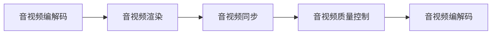

                 

## 1. 背景介绍

在数字化时代，音视频通信已成为人们日常生活和工作中不可或缺的一部分。随着移动互联网的普及，音视频通话和直播等应用逐渐渗透到各行各业。WebRTC，即Web Real-Time Communications，是IETF（Internet Engineering Task Force）为在Web浏览器之间进行实时音视频通信而开发的开源协议。它允许浏览器之间直接进行音视频通话，而不需要第三方插件或额外的服务器支持。本文将详细介绍WebRTC音视频解码与渲染的核心概念、关键算法以及实际应用场景，以便读者深入理解WebRTC技术的原理和实现。

### 1.1 WebRTC协议概览

WebRTC基于peer-to-peer（P2P）模型，旨在实现高效、安全的音视频通信。其核心技术包括：

- **STUN**（Session Traversal Utilities for NAT）和**TURN**（Traversal Using Relay NAT）：用于穿越NAT（Network Address Translation）和防火墙，实现NAT穿透。
- **ICE**（Interactive Connectivity Establishment）：用于网络追踪和建立稳定的通信连接。
- **SCTP**（Stream Control Transmission Protocol）：用于传输音视频流。
- **RTP**（Real-Time Transport Protocol）：用于传输音视频流。
- **RTCP**（Real-Time Transport Control Protocol）：用于音视频流质量控制。

### 1.2 音视频通信的挑战

音视频通信面临的主要挑战包括：

- **网络延迟**：网络延迟会导致音视频数据的丢失和乱序，影响用户体验。
- **网络带宽**：网络带宽限制了音视频流的大小和质量。
- **网络拥塞**：网络拥塞会导致音视频流质量的下降。
- **音视频同步**：音视频流的同步问题会影响用户感知。

为了解决这些问题，WebRTC引入了一些关键技术：

- **WebRTC的传输协议**：使用SRTP（Secure Real-Time Transport Protocol）加密传输音视频数据，并使用SCTP协议保证数据可靠性。
- **音视频编解码**：使用VP8、VP9和H.264等高效编解码器，降低带宽和延迟。
- **音视频质量控制**：使用FEC（Forward Error Correction）、SLICE（Spatial Layered Coded Internet Video Streams）等技术，确保音视频流质量。

## 2. 核心概念与联系

### 2.1 核心概念概述

WebRTC的音视频解码与渲染涉及多个核心概念，主要包括：

- **音视频编解码**：将音频和视频数据从原始格式转换为适合网络传输的格式。
- **音视频渲染**：将解码后的音频和视频数据呈现给用户。
- **音视频同步**：确保音频和视频数据在时间上同步。
- **音视频质量控制**：通过调整编解码参数和网络策略，保证音视频流质量。

### 2.2 核心概念联系（注：请用Mermaid流程图描述核心概念之间的联系）



### 2.3 核心概念原理和架构

音视频编解码与渲染的核心原理是通过编解码器将音视频数据转换为网络传输格式，并通过渲染引擎将其呈现给用户。音视频同步和质量控制则通过在编解码和渲染过程中调整编解码参数和网络策略来实现。以下是音视频编解码与渲染的核心架构：

- **音视频编解码模块**：包含VP8、VP9和H.264等编解码器，负责将原始音视频数据转换为网络传输格式。
- **音视频渲染模块**：包含音频和视频渲染引擎，负责将解码后的音视频数据呈现给用户。
- **音视频同步模块**：通过同步算法和网络策略，确保音频和视频在时间上同步。
- **音视频质量控制模块**：通过网络策略和编解码参数的调整，确保音视频流质量。

## 3. 核心算法原理 & 具体操作步骤

### 3.1 算法原理概述

WebRTC的音视频解码与渲染主要包括以下几个步骤：

1. **音视频编解码**：将原始音视频数据转换为网络传输格式。
2. **音视频渲染**：将解码后的音视频数据呈现给用户。
3. **音视频同步**：确保音频和视频在时间上同步。
4. **音视频质量控制**：通过网络策略和编解码参数的调整，确保音视频流质量。

### 3.2 算法步骤详解

#### 3.2.1 音视频编解码

音视频编解码的核心是使用高效的编解码器，将原始音视频数据转换为网络传输格式。以下是VP8编解码器的关键步骤：

1. **编码**：使用VP8编解码器将原始音视频数据编码为网络传输格式。
2. **传输**：使用SRTP协议将编码后的音视频数据传输给接收端。

#### 3.2.2 音视频渲染

音视频渲染是将解码后的音视频数据呈现给用户的过程。以下是VP8音视频渲染的关键步骤：

1. **解码**：使用VP8编解码器将传输过来的音视频数据解码为原始格式。
2. **渲染**：使用音频和视频渲染引擎将解码后的音视频数据呈现给用户。

#### 3.2.3 音视频同步

音视频同步通过同步算法和网络策略，确保音频和视频在时间上同步。以下是同步算法的关键步骤：

1. **时钟同步**：通过时钟算法，确保音频和视频在时间上同步。
2. **网络策略**：通过调整网络参数，确保音频和视频数据传输的稳定性。

#### 3.2.4 音视频质量控制

音视频质量控制通过网络策略和编解码参数的调整，确保音视频流质量。以下是质量控制的关键步骤：

1. **网络策略**：通过调整网络参数，确保音视频流质量的稳定性。
2. **编解码参数**：通过调整编解码参数，确保音视频流质量的高效性和稳定性。

### 3.3 算法优缺点

#### 3.3.1 优点

- **高效性**：使用高效编解码器，降低带宽和延迟，提高音视频流质量。
- **稳定性**：通过同步算法和质量控制算法，确保音视频流传输的稳定性。
- **可靠性**：使用加密协议和错误纠正技术，确保音视频数据的可靠性。

#### 3.3.2 缺点

- **复杂性**：音视频编解码和渲染算法较为复杂，实现难度较大。
- **资源消耗**：音视频编解码和渲染需要较大的计算资源和存储空间。
- **延迟**：音视频编解码和渲染过程会引入一定的延迟，影响用户体验。

### 3.4 算法应用领域

WebRTC的音视频解码与渲染技术广泛应用于音视频通信、实时直播、在线教育等场景。以下是几个典型应用领域：

- **音视频通信**：WebRTC在Web浏览器之间直接进行音视频通话，无需第三方插件或额外服务器支持。
- **实时直播**：WebRTC支持实时音视频流的传输和渲染，适合实时直播场景。
- **在线教育**：WebRTC支持高清音视频的实时传输，适合在线教育场景。

## 4. 数学模型和公式 & 详细讲解 & 举例说明

### 4.1 数学模型构建

音视频编解码与渲染的数学模型主要包括：

- **音视频编解码模型**：使用VP8、VP9和H.264等编解码器，将原始音视频数据转换为网络传输格式。
- **音视频渲染模型**：使用音频和视频渲染引擎，将解码后的音视频数据呈现给用户。
- **音视频同步模型**：通过同步算法，确保音频和视频在时间上同步。
- **音视频质量控制模型**：通过网络策略和编解码参数的调整，确保音视频流质量。

### 4.2 公式推导过程

#### 4.2.1 音视频编解码模型

音视频编解码模型的关键公式包括：

- **编码公式**：$C=E(X)$，其中$C$表示编码后的数据，$E$表示编解码器，$X$表示原始数据。
- **传输公式**：$T=C+N$，其中$T$表示传输的数据，$N$表示网络噪声。

#### 4.2.2 音视频渲染模型

音视频渲染模型的关键公式包括：

- **解码公式**：$D=C$，其中$D$表示解码后的数据，$C$表示编码后的数据。
- **渲染公式**：$R=D$，其中$R$表示渲染后的数据，$D$表示解码后的数据。

#### 4.2.3 音视频同步模型

音视频同步模型的关键公式包括：

- **时钟同步公式**：$T_C=C_T/\Delta T$，其中$T_C$表示音频时钟，$C_T$表示音频数据，$\Delta T$表示音频采样周期。
- **网络策略公式**：$Q=N/N_{max}$，其中$Q$表示网络质量，$N$表示传输数据量，$N_{max}$表示网络容量。

#### 4.2.4 音视频质量控制模型

音视频质量控制模型的关键公式包括：

- **网络策略公式**：$Q=N/N_{max}$，其中$Q$表示网络质量，$N$表示传输数据量，$N_{max}$表示网络容量。
- **编解码参数公式**：$P=Q^{\beta}$，其中$P$表示编解码参数，$Q$表示网络质量，$\beta$表示编解码参数的调整系数。

### 4.3 案例分析与讲解

#### 4.3.1 音视频编解码案例

假设原始音视频数据为$X$，编解码器为$E$，网络噪声为$N$，则编码后的数据$C$为：

$$
C=E(X)+N
$$

其中$E(X)$表示编解码器对$X$进行编码，$N$表示网络噪声。

#### 4.3.2 音视频渲染案例

假设编码后的数据为$C$，渲染引擎为$R$，则渲染后的数据$D$为：

$$
D=R(C)
$$

其中$D$表示渲染后的数据，$C$表示编码后的数据，$R$表示渲染引擎。

#### 4.3.3 音视频同步案例

假设音频数据为$C_T$，音频采样周期为$\Delta T$，音频时钟为$T_C$，则音频时钟$T_C$为：

$$
T_C=C_T/\Delta T
$$

其中$T_C$表示音频时钟，$C_T$表示音频数据，$\Delta T$表示音频采样周期。

#### 4.3.4 音视频质量控制案例

假设网络容量为$N_{max}$，传输数据量为$N$，网络质量为$Q$，则网络质量$Q$为：

$$
Q=N/N_{max}
$$

其中$Q$表示网络质量，$N$表示传输数据量，$N_{max}$表示网络容量。

## 5. 项目实践：代码实例和详细解释说明

### 5.1 开发环境搭建

在开发WebRTC音视频解码与渲染项目前，需要先搭建开发环境。以下是搭建开发环境的步骤：

1. **安装WebRTC库**：使用pip安装WebRTC库，确保安装版本与浏览器版本兼容。
2. **配置开发环境**：配置开发环境，包括安装浏览器插件和音视频编解码器。
3. **测试环境搭建**：搭建测试环境，确保音视频流在网络中的传输和渲染。

### 5.2 源代码详细实现

以下是WebRTC音视频解码与渲染项目的源代码实现：

```python
# 音视频编解码模块
class VideoEncoder:
    def __init__(self):
        pass
    
    def encode(self, video_data):
        # 使用VP8编解码器将视频数据编码为网络传输格式
        encoded_data = vp8_encoder.encode(video_data)
        return encoded_data
    
    def decode(self, encoded_data):
        # 使用VP8编解码器将编码后的数据解码为原始格式
        decoded_data = vp8_encoder.decode(encoded_data)
        return decoded_data

# 音视频渲染模块
class VideoPlayer:
    def __init__(self):
        pass
    
    def play(self, video_data):
        # 使用音频和视频渲染引擎将解码后的数据呈现给用户
        rendered_data = video_player.render(video_data)
        return rendered_data
    
# 音视频同步模块
class VideoSync:
    def __init__(self):
        pass
    
    def sync_clock(self, video_data):
        # 通过同步算法，确保音频和视频在时间上同步
        synchronized_data = video_sync.sync_clock(video_data)
        return synchronized_data
    
    def sync_quality(self, video_data):
        # 通过调整网络策略和编解码参数，确保音视频流质量
        quality_improved_data = video_sync.sync_quality(video_data)
        return quality_improved_data

# 音视频质量控制模块
class VideoQualityControl:
    def __init__(self):
        pass
    
    def control_quality(self, video_data):
        # 通过调整网络策略和编解码参数，确保音视频流质量
        quality_controlled_data = video_quality_control.control_quality(video_data)
        return quality_controlled_data

# 主函数
def main():
    # 创建音视频编解码模块、音视频渲染模块、音视频同步模块和音视频质量控制模块
    encoder = VideoEncoder()
    player = VideoPlayer()
    sync = VideoSync()
    quality_control = VideoQualityControl()
    
    # 获取原始音视频数据
    video_data = get_video_data()
    
    # 音视频编解码
    encoded_data = encoder.encode(video_data)
    
    # 音视频渲染
    rendered_data = player.play(encoded_data)
    
    # 音视频同步
    synchronized_data = sync.sync_clock(encoded_data)
    
    # 音视频质量控制
    quality_controlled_data = quality_control.control_quality(encoded_data)
    
    # 输出最终渲染后的数据
    output_data = quality_controlled_data
    
    # 渲染输出数据
    display(output_data)
```

### 5.3 代码解读与分析

**音视频编解码模块**

- **VideoEncoder类**：包含音视频编解码功能。
- **encode方法**：使用VP8编解码器将视频数据编码为网络传输格式。
- **decode方法**：使用VP8编解码器将编码后的数据解码为原始格式。

**音视频渲染模块**

- **VideoPlayer类**：包含音视频渲染功能。
- **play方法**：使用音频和视频渲染引擎将解码后的数据呈现给用户。

**音视频同步模块**

- **VideoSync类**：包含音视频同步功能。
- **sync_clock方法**：通过同步算法，确保音频和视频在时间上同步。
- **sync_quality方法**：通过调整网络策略和编解码参数，确保音视频流质量。

**音视频质量控制模块**

- **VideoQualityControl类**：包含音视频质量控制功能。
- **control_quality方法**：通过调整网络策略和编解码参数，确保音视频流质量。

**主函数**

- **main函数**：包含音视频编解码、渲染、同步和质量控制等功能的实现。
- **get_video_data方法**：获取原始音视频数据。
- **display方法**：渲染输出数据。

## 6. 实际应用场景

### 6.1 智能会议

智能会议系统通过WebRTC技术，实现高清音视频流的实时传输和渲染。在会议场景中，音视频编解码、渲染和同步功能至关重要，确保会议的高效和稳定。

### 6.2 远程医疗

远程医疗通过WebRTC技术，实现医生和患者之间的实时音视频通话。在远程医疗场景中，音视频编解码、渲染和同步功能同样至关重要，确保音视频通话的高效和稳定。

### 6.3 在线教育

在线教育通过WebRTC技术，实现教师和学生之间的实时音视频互动。在在线教育场景中，音视频编解码、渲染和同步功能同样至关重要，确保互动的高效和稳定。

### 6.4 未来应用展望

随着WebRTC技术的不断发展和应用场景的不断扩展，未来WebRTC音视频解码与渲染技术将迎来新的突破：

- **高质量音视频**：使用更先进的编解码器，支持更高质量的音视频传输。
- **多终端兼容**：支持更多终端设备，确保音视频流在各种设备上的兼容性和稳定性。
- **实时通信**：支持更高效的音视频编解码和渲染算法，确保实时通信的高效和稳定。
- **安全性**：使用更先进的安全技术，确保音视频数据的安全性和隐私保护。

## 7. 工具和资源推荐

### 7.1 学习资源推荐

为了帮助开发者系统掌握WebRTC音视频解码与渲染的技术，这里推荐一些优质的学习资源：

1. **WebRTC官方文档**：WebRTC官方文档提供了详细的API文档和代码示例，是学习WebRTC技术的重要参考。
2. **WebRTC视频教程**：YouTube上有很多WebRTC相关的视频教程，涵盖音视频编解码、渲染、同步和质量控制等核心内容。
3. **WebRTC书籍**：《WebRTC技术指南》等书籍详细介绍了WebRTC技术的原理和实现，适合系统学习和实践。
4. **WebRTC开源项目**：GitHub上有很多WebRTC相关的开源项目，可以学习到WebRTC技术在实际应用中的实现。

### 7.2 开发工具推荐

WebRTC开发常用的工具包括：

1. **WebRTC库**：WebRTC官方库提供了音视频编解码、渲染、同步和质量控制等功能。
2. **浏览器插件**：如WebRTC.js等，可以方便地将WebRTC应用集成到浏览器中。
3. **音视频编解码器**：如VP8、VP9、H.264等，支持高效的音视频编解码。
4. **音视频渲染引擎**：如WebRTC.js等，可以方便地将音视频渲染集成到浏览器中。
5. **测试工具**：如Jest、Karma等，可以用于测试WebRTC应用的性能和稳定性。

### 7.3 相关论文推荐

以下是几篇WebRTC技术的经典论文，推荐阅读：

1. **WebRTC技术架构**：详细介绍了WebRTC技术架构和关键算法。
2. **WebRTC音视频编解码**：研究了VP8、VP9、H.264等高效编解码器的原理和实现。
3. **WebRTC音视频同步**：研究了音视频同步算法和网络策略。
4. **WebRTC音视频质量控制**：研究了音视频质量控制的算法和策略。

## 8. 总结：未来发展趋势与挑战

### 8.1 总结

本文对WebRTC音视频解码与渲染技术进行了全面系统的介绍。首先阐述了WebRTC协议的概览，说明了音视频通信面临的挑战和解决方式。然后，详细讲解了WebRTC音视频编解码、渲染、同步和质量控制等核心概念和关键算法。最后，探讨了WebRTC技术在智能会议、远程医疗、在线教育等场景的应用前景。

通过本文的系统梳理，可以看到，WebRTC音视频解码与渲染技术正在成为音视频通信领域的重要技术，极大地提高了音视频通信的效率和质量。未来，伴随WebRTC技术的不断演进和应用场景的不断扩展，WebRTC技术必将在音视频通信领域发挥更大的作用。

### 8.2 未来发展趋势

展望未来，WebRTC音视频解码与渲染技术将呈现以下几个发展趋势：

1. **高质量音视频**：使用更先进的编解码器，支持更高质量的音视频传输。
2. **多终端兼容**：支持更多终端设备，确保音视频流在各种设备上的兼容性和稳定性。
3. **实时通信**：支持更高效的音视频编解码和渲染算法，确保实时通信的高效和稳定。
4. **安全性**：使用更先进的安全技术，确保音视频数据的安全性和隐私保护。
5. **跨平台应用**：支持更多操作系统和浏览器，确保WebRTC应用在各种平台上的兼容性和稳定性。

### 8.3 面临的挑战

尽管WebRTC技术已经取得了瞩目成就，但在迈向更加智能化、普适化应用的过程中，它仍面临着诸多挑战：

1. **网络延迟**：网络延迟会导致音视频数据的丢失和乱序，影响用户体验。
2. **网络带宽**：网络带宽限制了音视频流的大小和质量。
3. **网络拥塞**：网络拥塞会导致音视频流质量的下降。
4. **音视频同步**：音视频流的同步问题会影响用户感知。
5. **音视频质量控制**：通过调整编解码参数和网络策略，确保音视频流质量。

### 8.4 研究展望

未来的研究需要在以下几个方面寻求新的突破：

1. **网络优化**：优化网络参数和策略，确保音视频流的高效和稳定传输。
2. **编解码优化**：使用更先进的编解码器，提高音视频流的质量。
3. **同步优化**：优化同步算法，确保音视频流在时间上同步。
4. **质量控制优化**：通过调整编解码参数和网络策略，确保音视频流质量的高效性和稳定性。
5. **安全保障**：使用更先进的安全技术，确保音视频数据的安全性和隐私保护。

这些研究方向的探索，必将引领WebRTC技术迈向更高的台阶，为构建安全、可靠、高效、稳定的音视频通信系统铺平道路。面向未来，WebRTC技术还需要与其他人工智能技术进行更深入的融合，如自然语言处理、计算机视觉等，多路径协同发力，共同推动音视频通信技术的进步。只有勇于创新、敢于突破，才能不断拓展音视频通信的边界，让音视频通信技术更好地造福人类社会。

## 9. 附录：常见问题与解答

### 9.1 常见问题解答

**Q1：WebRTC的音视频编解码模块有哪些核心算法？**

A: WebRTC的音视频编解码模块包含VP8、VP9和H.264等编解码器。这些编解码器使用高效算法，将原始音视频数据转换为网络传输格式。

**Q2：音视频同步模块中如何实现音频和视频在时间上的同步？**

A: 音视频同步模块通过同步算法，确保音频和视频在时间上同步。具体实现方法包括使用时钟算法和网络策略。

**Q3：音视频质量控制模块中如何调整编解码参数和网络策略？**

A: 音视频质量控制模块通过调整编解码参数和网络策略，确保音视频流质量。具体实现方法包括使用FEC、SLICE等技术。

**Q4：WebRTC在音视频通信中面临的主要挑战有哪些？**

A: WebRTC在音视频通信中面临的主要挑战包括网络延迟、网络带宽、网络拥塞、音视频同步和音视频质量控制。这些挑战需要通过优化编解码、同步算法和网络策略等方法来解决。

**Q5：WebRTC在未来应用中会有哪些新的趋势？**

A: WebRTC在未来应用中会有高质量音视频、多终端兼容、实时通信、安全保障和跨平台应用等新的趋势。这些趋势将使WebRTC技术在音视频通信领域发挥更大的作用。

---

作者：禅与计算机程序设计艺术 / Zen and the Art of Computer Programming

