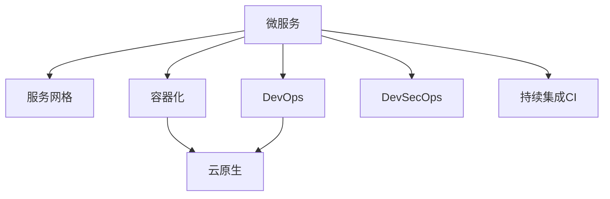

                 

# Web后端微服务架构设计

> 关键词：微服务,后端架构,系统设计,分布式,容器化,DevOps,云原生,服务网格,自动化,DevSecOps,持续集成

## 1. 背景介绍

### 1.1 问题由来
随着互联网应用的不断扩展和复杂度增加，传统的单层应用结构已经难以满足快速迭代和高效扩展的需求。为了应对这些挑战，微服务架构应运而生。微服务将一个大型系统拆分为多个小而自治的服务模块，每个服务模块负责独立的功能模块，服务之间通过接口进行通信，具备高内聚、低耦合的特点，从而大大提高了系统的灵活性和可扩展性。

微服务架构在大型互联网公司（如Netflix、Amazon、Google）中得到了广泛应用，并逐渐成为构建Web后端系统的标准架构。然而，随着微服务系统的规模不断扩大，传统的微服务架构也面临着诸多挑战，如服务间通信复杂、依赖关系混乱、版本管理困难、性能瓶颈、监控难度大等问题。

为解决这些问题，本文将介绍一种基于微服务的Web后端架构设计，并通过分析实际案例，展示其具体的实现思路和优化策略。

## 2. 核心概念与联系

### 2.1 核心概念概述

为更好地理解基于微服务的Web后端架构设计，本节将介绍几个密切相关的核心概念：

- 微服务(Microservices)：将一个大型系统拆分为多个独立、自治的服务模块，每个服务模块专注于单一的功能，具备松耦合、高内聚的特点。

- 服务网格(Service Mesh)：一种网络层抽象，用于统一管理和优化服务间的通信和数据传输。通过在网络层实现负载均衡、流量控制、故障恢复等功能，极大提升了微服务架构的稳定性和可扩展性。

- 容器化(Docker, Kubernetes)：一种轻量级的应用运行环境，通过容器封装应用及其依赖，实现快速部署、灵活扩展和高效管理。

- DevOps：一种软件开发模式，强调协作、沟通、自动化和持续交付，通过构建自动化工具链，提升软件开发效率和质量。

- 云原生(Cloud-Native)：一种架构和开发范式，强调构建与云环境相适应的应用和系统，如微服务、容器化、自动化、可伸缩性等。

这些核心概念之间的逻辑关系可以通过以下Mermaid流程图来展示：



这个流程图展示了大规模微服务系统中的核心组件及其相互作用：

1. 微服务架构：拆分系统为多个独立服务。
2. 服务网格：管理和优化服务间的通信。
3. 容器化：封装应用，实现灵活扩展。
4. DevOps：自动化和持续交付，提升开发效率。
5. 云原生：构建适应云环境的系统。
6. DevSecOps：实现安全、自动化、持续集成等。

这些概念共同构成了现代Web后端系统的基本框架，为系统设计提供了清晰的指导和优化方向。

## 3. 核心算法原理 & 具体操作步骤
### 3.1 算法原理概述

基于微服务的Web后端架构设计，本质上是一个系统设计和优化的过程。其核心思想是：将一个大型系统拆分为多个小型、自治的服务模块，每个服务模块独立运行，通过接口和网络层进行通信，以实现系统的灵活、高效、可扩展和易维护。

形式化地，假设一个大型系统由N个微服务组成，每个微服务独立运行，但需要通过API网关(Api Gateway)和服务网格(Service Mesh)进行通信。设计者需要选择合适的API网关和服务网格，并确保其满足以下要求：

1. 高可用性：确保服务间通信的稳定性和可靠性。
2. 高性能：降低服务间通信的延迟和带宽消耗。
3. 高可扩展性：适应系统规模的变化，快速应对流量激增。
4. 高可维护性：便于服务的开发、部署和监控管理。

### 3.2 算法步骤详解

基于微服务的Web后端架构设计一般包括以下几个关键步骤：

**Step 1: 系统拆分和规划**
- 分析系统需求，确定功能模块的拆分策略。
- 确定每个微服务的边界，划分服务功能模块。
- 设计服务间的通信协议和接口，定义服务交互的规范。

**Step 2: 选择API网关和服务网格**
- 选择合适的API网关，如Kong、Kineto等，用于管理和路由服务间请求。
- 选择合适的服务网格，如Istio、Linkerd等，用于优化服务间的通信和数据传输。

**Step 3: 设计API网关和服务网格**
- 设计API网关的路由规则、限流策略、负载均衡算法等。
- 配置服务网格的流量控制、故障恢复、安全认证等。

**Step 4: 实现和部署微服务**
- 使用Docker、Kubernetes等工具容器化服务，实现服务的独立部署。
- 设计服务的自动部署、自动扩展和故障恢复策略。
- 在Kubernetes上配置服务的自动重启、自动扩展和资源管理。

**Step 5: 实施持续集成和持续交付**
- 构建自动化测试、部署和监控工具链，实现持续集成和持续交付。
- 实施DevOps最佳实践，如代码审查、自动化测试、自动化部署等。

**Step 6: 实施监控和日志管理**
- 使用Prometheus、Grafana等工具监控系统性能和流量。
- 实现集中化的日志管理，如ElasticSearch、Logstash等。

**Step 7: 实施安全和认证**
- 使用OAuth2、JWT等机制实现服务间的身份认证和授权。
- 实现数据传输加密和安全通信，防止敏感数据的泄露。

**Step 8: 优化和调优**
- 根据监控数据和性能指标，持续优化和调优系统。
- 实施负载均衡、缓存策略、压缩传输等性能优化手段。

以上是基于微服务的Web后端架构设计的一般流程。在实际应用中，还需要根据具体系统的特点和需求，对各个环节进行优化设计和调整。

### 3.3 算法优缺点

基于微服务的Web后端架构设计具有以下优点：
1. 灵活可扩展：服务间相互独立，易于进行扩展和更新。
2. 高可用性：通过服务网格实现故障恢复和负载均衡，提升系统的稳定性和可靠性。
3. 高可维护性：服务间独立运行，便于维护和监控。
4. 高可复用性：服务模块独立开发，易于复用和共享。

同时，该方法也存在一定的局限性：
1. 服务间通信复杂：服务间通信通过网络层进行，网络延迟和带宽消耗可能影响系统性能。
2. 依赖管理困难：服务间的依赖关系复杂，版本管理和更新可能存在问题。
3. 性能瓶颈：服务间通信和数据传输可能带来性能瓶颈，需要通过优化和调优来缓解。
4. 开发复杂度高：服务拆分和架构设计需要较高的专业技能和经验。

尽管存在这些局限性，但就目前而言，基于微服务的架构设计仍是Web后端系统的主流范式。未来相关研究的重点在于如何进一步简化微服务架构，降低微服务管理的复杂度，同时提高系统的稳定性和可扩展性。

### 3.4 算法应用领域

基于微服务的Web后端架构设计在许多行业领域中得到了广泛应用，例如：

- 电子商务：如淘宝、亚马逊等，通过微服务架构实现交易、库存、支付、物流等模块的独立运行，提升系统的高可用性和可扩展性。
- 金融服务：如蚂蚁金服、PayPal等，通过微服务架构实现银行账户、支付、风险控制等功能模块的独立运行，提升系统的灵活性和安全性。
- 物流配送：如DHL、UPS等，通过微服务架构实现订单处理、运输跟踪、配送管理等功能模块的独立运行，提升系统的可维护性和可扩展性。
- 医疗健康：如IBM Watson Health、Zebra Medical Vision等，通过微服务架构实现医疗影像分析、诊断、药物研发等功能模块的独立运行，提升系统的精准性和可靠性。
- 媒体娱乐：如Netflix、Hulu等，通过微服务架构实现内容分发、推荐系统、广告投放等功能模块的独立运行，提升系统的个性化和实时性。

除了上述这些行业，微服务架构还在许多新兴行业和创新应用中得到广泛应用，如智能交通、智能制造、智能家居等，为各行各业带来了新的技术变革和业务机会。

## 4. 数学模型和公式 & 详细讲解 & 举例说明

### 4.1 数学模型构建

为了更好地理解微服务架构的优化和调优过程，本节将使用数学语言对微服务架构中的关键概念进行更加严格的刻画。

记系统由N个微服务组成，每个微服务的功能表示为 $f_i: \mathcal{X}_i \rightarrow \mathcal{Y}_i$，其中 $\mathcal{X}_i$ 为输入空间，$\mathcal{Y}_i$ 为输出空间。服务间的通信协议表示为 $P$，API网关表示为 $G$，服务网格表示为 $M$。系统的整体性能指标表示为 $P_{sys} = P + G + M$。

假设系统在t时刻的状态为 $\mathbf{x}(t)$，经过微服务 $f_i$ 的更新后，状态更新为 $\mathbf{x}'(t) = f_i(\mathbf{x}(t))$。API网关和服务网格的更新过程可以表示为：

$$
\mathbf{x}'(t) = G(\mathbf{x}(t), P, M)
$$

其中 $G$ 表示API网关和服务网格对系统状态的影响，$P$ 和 $M$ 为常量，表示服务间的通信协议和服务网格的配置。

定义系统的性能指标为 $P_{sys} = \frac{1}{N} \sum_{i=1}^N P_i$，其中 $P_i$ 为第i个微服务的性能指标。系统的稳定性和可靠性可以通过监控性能指标 $P_{sys}$ 来评估。

### 4.2 公式推导过程

以下我们以系统稳定性和可靠性为目标，推导基于微服务架构的性能优化公式。

假设系统在t时刻的状态为 $\mathbf{x}(t)$，经过微服务 $f_i$ 的更新后，状态更新为 $\mathbf{x}'(t) = f_i(\mathbf{x}(t))$。API网关和服务网格的更新过程可以表示为：

$$
\mathbf{x}'(t) = G(\mathbf{x}(t), P, M)
$$

定义系统的性能指标为 $P_{sys} = \frac{1}{N} \sum_{i=1}^N P_i$，其中 $P_i$ 为第i个微服务的性能指标。系统的稳定性和可靠性可以通过监控性能指标 $P_{sys}$ 来评估。

在理想情况下，如果每个微服务 $f_i$ 都能独立稳定运行，并且API网关和服务网格也能稳定可靠地进行通信和数据传输，那么系统的整体性能 $P_{sys}$ 应达到最优值。因此，微服务架构的优化目标是：

$$
\mathop{\arg\min}_{P_i, P, M} P_{sys}
$$

由于系统状态的更新涉及多个微服务、API网关和服务网格，因此需要考虑多服务间的协同优化。一个可行的方法是将系统拆分为多个子系统，对每个子系统分别进行优化，然后综合考虑各个子系统的影响，实现整体系统的优化。

假设有K个子系统，每个子系统的性能指标为 $P_k = \frac{1}{N_k} \sum_{i=1}^{N_k} P_{ik}$，其中 $N_k$ 为第k个子系统的微服务数量。系统的整体性能指标可以表示为：

$$
P_{sys} = \frac{1}{K} \sum_{k=1}^K P_k
$$

通过将系统拆分为多个子系统，可以分别优化每个子系统的性能指标 $P_k$。假设每个子系统使用 $\mathbf{x}_k(t)$ 和 $\mathbf{x}'_k(t)$ 表示状态更新前后的状态，对应的性能指标为 $P_k$。系统的整体性能优化目标为：

$$
\mathop{\arg\min}_{\mathbf{x}_k(t), \mathbf{x}'_k(t), P_k} P_{sys}
$$

其中 $P_k$ 为第k个子系统的性能指标，$\mathbf{x}_k(t)$ 和 $\mathbf{x}'_k(t)$ 表示子系统状态更新前后的状态。

通过求解上述优化问题，可以找到最优的服务状态和性能指标，从而实现系统的整体优化。

### 4.3 案例分析与讲解

以电子商务系统为例，展示基于微服务架构的性能优化过程。

假设系统由订单处理、库存管理、支付处理、物流配送等四个子系统组成，每个子系统的功能和服务接口如下：

- 订单处理：接收订单请求，处理订单状态，发送通知给库存管理系统。
- 库存管理：更新库存信息，向订单处理系统发送库存状态通知。
- 支付处理：处理支付请求，通知订单处理系统支付状态。
- 物流配送：处理配送请求，更新配送状态，通知订单处理系统配送信息。

定义每个子系统的性能指标如下：

- 订单处理：响应时间、吞吐量、成功率。
- 库存管理：响应时间、吞吐量、成功率。
- 支付处理：响应时间、吞吐量、成功率。
- 物流配送：响应时间、吞吐量、成功率。

通过将系统拆分为四个子系统，可以分别优化每个子系统的性能指标。假设每个子系统的性能指标表示为 $P_k = \frac{1}{N_k} \sum_{i=1}^{N_k} P_{ik}$，其中 $N_k$ 为第k个子系统的微服务数量。系统的整体性能指标可以表示为：

$$
P_{sys} = \frac{1}{4} (P_{订单处理} + P_{库存管理} + P_{支付处理} + P_{物流配送})
$$

通过优化每个子系统的性能指标，可以实现系统的整体性能提升。

## 5. 项目实践：代码实例和详细解释说明

### 5.1 开发环境搭建

在进行微服务架构的实现和优化过程中，首先需要准备好开发环境。以下是使用Docker和Kubernetes进行微服务架构开发的环境配置流程：

1. 安装Docker：从官网下载并安装Docker，用于容器化应用。

2. 安装Kubernetes：从官网下载并安装Kubernetes，用于容器编排和调度。

3. 安装Docker Compose：从官网下载并安装Docker Compose，用于定义和运行多容器应用。

4. 安装Minikube：从官网下载并安装Minikube，用于在本地构建Kubernetes集群。

5. 配置环境变量：设置必要的Docker和Kubernetes环境变量，如Docker服务、Kubernetes配置文件等。

完成上述步骤后，即可在本地搭建微服务架构的开发环境。

### 5.2 源代码详细实现

下面我们以一个电子商务订单处理系统为例，展示微服务架构的实现过程。

首先，定义微服务及其接口：

```python
from flask import Flask, request, jsonify

app = Flask(__name__)

@app.route('/order', methods=['POST'])
def order_handling():
    order_id = request.json['order_id']
    # 调用库存管理系统API，更新库存信息
    inventory_response = requests.post('http://inventory-api:8000/inventory/update', json={'order_id': order_id})
    # 处理订单状态，向用户发送通知
    order_status = process_order(order_id, inventory_response.json())
    return jsonify({'order_status': order_status})

@app.route('/inventory', methods=['POST'])
def inventory_handling():
    order_id = request.json['order_id']
    # 更新库存信息，向订单处理系统发送通知
    inventory_status = update_inventory(order_id)
    return jsonify({'inventory_status': inventory_status})

@app.route('/payment', methods=['POST'])
def payment_handling():
    order_id = request.json['order_id']
    # 处理支付请求，向订单处理系统发送通知
    payment_response = process_payment(order_id)
    return jsonify({'payment_response': payment_response})

@app.route('/logistics', methods=['POST'])
def logistics_handling():
    order_id = request.json['order_id']
    # 处理配送请求，向订单处理系统发送通知
    logistics_status = update_logistics(order_id)
    return jsonify({'logistics_status': logistics_status})
```

然后，使用Docker Compose定义容器和应用：

```yaml
version: '3.8'
services:
  order-handling:
    build: ./src/order_handling
    ports:
      - "8000:8000"
    depends_on:
      - inventory-handling
      - payment-handling
      - logistics-handling
  inventory-handling:
    build: ./src/inventory_handling
    ports:
      - "8000:8000"
    depends_on:
      - order-handling
      - payment-handling
      - logistics-handling
  payment-handling:
    build: ./src/payment_handling
    ports:
      - "8000:8000"
    depends_on:
      - order-handling
      - inventory-handling
      - logistics-handling
  logistics-handling:
    build: ./src/logistics_handling
    ports:
      - "8000:8000"
    depends_on:
      - order-handling
      - inventory-handling
      - payment-handling
```

最后，使用Kubernetes部署微服务：

```bash
kubectl create deployment order-handling --image=your-docker-image:latest
kubectl create deployment inventory-handling --image=your-docker-image:latest
kubectl create deployment payment-handling --image=your-docker-image:latest
kubectl create deployment logistics-handling --image=your-docker-image:latest
```

通过上述步骤，即可实现微服务架构的部署和运行。开发者可以进一步使用Kubernetes的资源管理和扩展功能，如服务发现、负载均衡、自动化部署等，实现系统的可扩展性和稳定性。

### 5.3 代码解读与分析

让我们再详细解读一下关键代码的实现细节：

**微服务接口定义**：
- 定义四个微服务的接口，接收订单、库存、支付和物流请求，并进行相应的处理。
- 每个微服务通过调用其他微服务的API接口来实现业务逻辑。

**Docker Compose配置文件**：
- 定义四个微服务的Docker镜像和端口映射，并设置相互之间的依赖关系。
- 使用 `depends_on` 字段指定每个微服务的启动依赖关系，确保所有微服务都能正确启动。

**Kubernetes部署配置**：
- 使用 `kubectl create deployment` 命令创建微服务的Kubernetes部署，并指定Docker镜像。
- 可以使用 `kubectl expose deployment` 命令将微服务暴露为外部可访问的服务，实现服务的对外连接。
- 可以使用 `kubectl rollout restart deployment` 命令进行微服务的重启和更新，确保服务的稳定性和可靠性。

通过Docker和Kubernetes的结合使用，微服务架构的实现和部署变得更加灵活、高效和可扩展。开发者可以轻松管理多个微服务的生命周期，实现应用的快速迭代和优化。

## 6. 实际应用场景

### 6.1 智能医疗系统

基于微服务的Web后端架构设计，可以应用于智能医疗系统的构建。传统医疗系统存在数据孤岛、信息共享困难等问题，通过微服务架构可以实现不同系统间的协同工作，提升医疗服务的智能化水平。

具体而言，可以构建由患者管理、医疗记录、诊断分析、药物推荐等多个微服务组成的系统，每个微服务负责独立的功能模块，通过API网关和服务网格进行通信，实现数据的共享和协同处理。例如，通过微服务架构可以实现病历数据的存储、分析、共享和应用，提升医疗服务的精准性和可维护性。

### 6.2 智慧金融平台

基于微服务的Web后端架构设计，可以应用于智慧金融平台的构建。传统金融系统存在业务流程复杂、数据量大、系统耦合度高等问题，通过微服务架构可以实现服务的独立运行和灵活扩展，提升金融服务的智能化和可扩展性。

具体而言，可以构建由用户管理、交易处理、风险控制、资产管理等多个微服务组成的系统，每个微服务负责独立的功能模块，通过API网关和服务网格进行通信，实现数据的共享和协同处理。例如，通过微服务架构可以实现交易的实时处理、风险的精准控制、资产的灵活管理，提升金融服务的效率和安全性。

### 6.3 智能物流系统

基于微服务的Web后端架构设计，可以应用于智能物流系统的构建。传统物流系统存在流程复杂、信息孤岛、系统耦合度高等问题，通过微服务架构可以实现服务的独立运行和灵活扩展，提升物流服务的智能化和可扩展性。

具体而言，可以构建由订单处理、仓储管理、配送管理、运输管理等多个微服务组成的系统，每个微服务负责独立的功能模块，通过API网关和服务网格进行通信，实现数据的共享和协同处理。例如，通过微服务架构可以实现订单的实时处理、仓储的精准管理、配送的灵活调度、运输的高效管理，提升物流服务的效率和可靠性。

### 6.4 未来应用展望

随着微服务架构的不断发展，基于微服务的Web后端系统将在更多领域得到应用，为各行各业带来变革性影响。

在智慧城市治理中，基于微服务架构的系统可以实现城市事件的监测、舆情分析、应急指挥等功能，提高城市管理的自动化和智能化水平，构建更安全、高效的未来城市。

在智慧教育领域，基于微服务架构的系统可以实现课程管理、学习推荐、作业批改等功能，提升教育服务的智能化和个性化水平，促进教育公平。

在智能制造领域，基于微服务架构的系统可以实现生产管理、设备监控、质量检测等功能，提升制造业的智能化和自动化水平，降低生产成本。

此外，在医疗健康、智能交通、智能家居等众多领域，基于微服务架构的系统也将不断涌现，为各行各业带来新的技术变革和业务机会。

## 7. 工具和资源推荐
### 7.1 学习资源推荐

为了帮助开发者系统掌握微服务架构的理论基础和实践技巧，这里推荐一些优质的学习资源：

1. 《微服务架构：构建可扩展的应用》书籍：深入浅出地介绍了微服务架构的理论基础和设计原则，并结合实际案例展示了微服务的实现和优化方法。

2. 《分布式系统原理与设计》课程：清华大学开设的分布式系统课程，深入讲解了微服务架构、分布式系统、容错机制等核心概念。

3. 《云原生技术权威指南》书籍：全面介绍了云原生技术的核心概念和最佳实践，涵盖微服务、容器化、自动化、可伸缩性等方向。

4. 《Kubernetes: Up and Running》书籍：Kubernetes的官方文档和实践指南，介绍了Kubernetes的快速部署、灵活扩展、安全管理等核心功能。

5. 《Flask Web Development》书籍：介绍使用Flask构建微服务的开发实践，提供了丰富的案例和代码示例。

通过对这些资源的学习实践，相信你一定能够快速掌握微服务架构的理论基础和实践技巧，并用于解决实际的业务问题。

### 7.2 开发工具推荐

高效的开发离不开优秀的工具支持。以下是几款用于微服务架构开发的常用工具：

1. Docker：轻量级的应用运行环境，通过容器封装应用及其依赖，实现快速部署、灵活扩展和高效管理。

2. Kubernetes：容器编排和调度工具，实现服务的自动化部署、扩展和监控管理，提升系统的稳定性和可扩展性。

3. GitLab CI/CD：构建持续集成和持续交付工具链，实现代码的自动化测试、部署和监控，提升开发效率和系统质量。

4. Prometheus：监控系统，用于实时监测系统性能和流量，提供丰富的指标和图表展示功能。

5. Grafana：数据可视化工具，将Prometheus等监控系统数据以图表形式展示，便于监控和分析。

6. ELK Stack：日志管理工具，实现集中化的日志收集、存储和分析，便于系统的故障诊断和性能优化。

通过这些工具，可以显著提升微服务架构的开发效率和系统性能，加速应用的迭代和优化。

### 7.3 相关论文推荐

微服务架构的研究源于学界的持续研究。以下是几篇奠基性的相关论文，推荐阅读：

1. Sam Newman, "Microservices: A lightweight, generic architecture for developing complex, reliable systems"：介绍微服务架构的基本概念和设计原则，强调微服务的独立性、高内聚、低耦合等特点。

2. Martin Fowler, "Microservices are not a silver bullet"：探讨微服务架构的优缺点，强调微服务的设计和实现需要权衡利弊，避免陷入过度设计的误区。

3. Jonathan Liu, "The Future of Microservices"：展望微服务架构的未来发展，探讨微服务架构的演化方向和趋势。

4. Brendan Burns, "Microservices Patterns: An evolve-by-reasoning approach to microservices architecture"：提出微服务架构的设计模式和最佳实践，强调微服务的灵活性和可扩展性。

5. Henning Reddy, "Cloud-Native Development Patterns for Microservices"：探讨云原生技术在微服务架构中的应用，提出微服务架构的云原生设计模式和最佳实践。

这些论文代表了大规模微服务系统的发展脉络。通过学习这些前沿成果，可以帮助研究者把握学科前进方向，激发更多的创新灵感。

## 8. 总结：未来发展趋势与挑战

### 8.1 研究成果总结

本文对基于微服务的Web后端架构设计进行了全面系统的介绍。首先阐述了微服务架构的背景和意义，明确了微服务在现代Web后端系统中的重要地位。其次，从原理到实践，详细讲解了微服务架构的数学模型和优化方法，并通过实际案例展示了其具体的实现思路和优化策略。同时，本文还广泛探讨了微服务架构在智能医疗、智慧金融、智能物流等领域的实际应用，展示了微服务架构的强大功能和应用前景。

通过本文的系统梳理，可以看到，基于微服务的Web后端架构设计已经成为现代Web后端系统的主流范式，极大地提升了系统的灵活性、可扩展性和可维护性。未来，随着微服务架构的不断演进和优化，相信其在更多领域的应用将会更加广泛，为各行各业带来更多的技术变革和业务机会。

### 8.2 未来发展趋势

展望未来，基于微服务的Web后端架构设计将呈现以下几个发展趋势：

1. 微服务网格的普及：随着微服务系统的不断扩展，微服务网格的应用将越来越广泛，帮助解决微服务间的通信和数据传输问题，提升系统的稳定性和可扩展性。

2. 服务网格的标准化：微服务网格将逐步成为微服务架构的标配，逐步形成行业标准和最佳实践。

3. 云原生与微服务的融合：云原生技术（如Kubernetes、Istio等）与微服务架构的深度融合，将进一步提升微服务系统的稳定性和可扩展性。

4. 容器化和分布式系统的深度结合：容器化技术（如Docker、Kubernetes等）与分布式系统的深度结合，将提升系统的灵活性和可扩展性。

5. DevOps的自动化和智能化：DevOps工具和自动化流程将进一步优化微服务架构的开发和运维过程，提升系统效率和质量。

6. 服务网格的安全和隐私保护：微服务网格将引入更多的安全和隐私保护机制，确保微服务系统的安全性和隐私性。

以上趋势凸显了微服务架构的广阔前景。这些方向的探索发展，必将进一步提升Web后端系统的性能和应用范围，为数字化转型提供新的技术支持。

### 8.3 面临的挑战

尽管微服务架构已经取得了瞩目成就，但在迈向更加智能化、普适化应用的过程中，它仍面临着诸多挑战：

1. 微服务间的通信复杂：微服务间的通信通过网络层进行，网络延迟和带宽消耗可能影响系统性能。

2. 微服务的依赖管理困难：微服务的依赖关系复杂，版本管理和更新可能存在问题。

3. 微服务系统的稳定性和可靠性：微服务系统需要考虑服务的故障恢复、负载均衡等问题。

4. 微服务系统的性能瓶颈：微服务系统需要考虑服务的性能瓶颈，避免系统瓶颈对业务造成影响。

5. 微服务系统的开发复杂度高：微服务系统的开发和维护需要较高的专业技能和经验。

尽管存在这些挑战，但就目前而言，基于微服务的架构设计仍是Web后端系统的主流范式。未来相关研究的重点在于如何进一步简化微服务架构，降低微服务管理的复杂度，同时提高系统的稳定性和可扩展性。

### 8.4 研究展望

面对微服务架构所面临的种种挑战，未来的研究需要在以下几个方面寻求新的突破：

1. 探索更高效的微服务架构：研究更灵活、更高效的微服务架构，降低微服务间的通信复杂度和依赖管理难度。

2. 引入更多的服务和中间件：引入更多的服务和中间件，实现微服务系统的灵活扩展和优化。

3. 实施更加智能化和自动化的DevOps：实施更加智能化和自动化的DevOps工具和流程，提升微服务系统的开发效率和质量。

4. 实施更加安全、可靠的服务网格：实施更加安全、可靠的服务网格，确保微服务系统的稳定性和可扩展性。

5. 引入更多的安全和隐私保护机制：引入更多的安全和隐私保护机制，确保微服务系统的安全性和隐私性。

这些研究方向的探索，必将引领微服务架构迈向更高的台阶，为数字化转型提供更可靠、更高效的技术支持。总之，微服务架构需要从系统设计、开发、运维等多个维度进行全面优化，方能实现其真正的价值。

