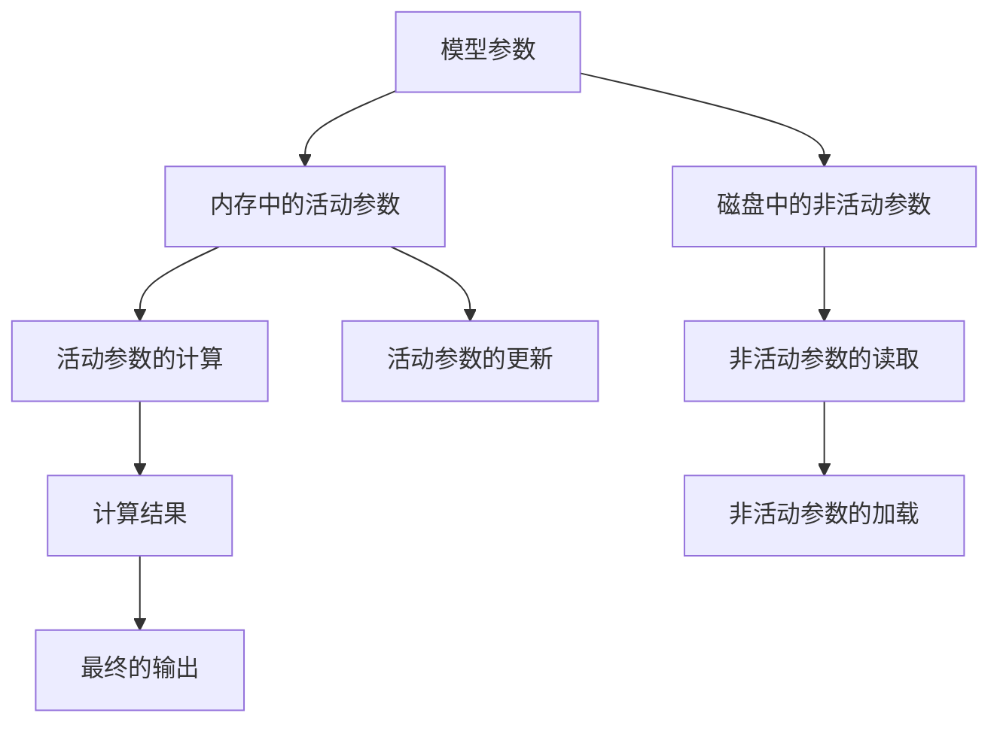

                 

## 1. 背景介绍

在大数据时代，深度学习模型的规模和复杂度不断增大，传统的单机训练模式已难以适应日益增长的模型需求。分布式训练作为一种高效的模型训练方法，能够将大规模模型并行化地运行在多台机器上，大大提升训练速度。然而，随着模型参数量的增加，分布式训练的内存开销也急剧上升，导致训练时间和成本的显著增加。

为了解决这一问题，Google提出了一种名为ZeRO（Zeroing Optimization for Distributed Training）的技术，通过零拷贝（Zero-Copy）优化，大幅降低了内存使用，使得大规模模型能够在有限的内存资源下进行高效的分布式训练。

## 2. 核心概念与联系

### 2.1 核心概念概述

ZeRO技术通过将模型的部分参数“卸载”到本地磁盘中，使得模型可以在有限的内存资源下进行分布式训练。这一技术基于两个关键假设：

- 模型的大部分参数很少被使用。
- 参数的高频访问是局部化的，不同部分之间的参数访问常常间隔较长时间。

基于以上假设，ZeRO技术通过将“非活动”参数存储在磁盘上，减少内存占用，同时保证高频访问的参数能够快速从内存中加载和更新，从而实现内存优化。

### 2.2 核心概念原理和架构的 Mermaid 流程图



## 3. 核心算法原理 & 具体操作步骤

### 3.1 算法原理概述

ZeRO技术的核心思想是分阶段管理模型参数，将大部分参数存储在本地磁盘中，同时保证高效访问的参数能够快速从内存中加载和更新。其主要分为以下几个步骤：

1. **参数分块**：将模型参数按大小和访问频率进行分块，将频繁访问的参数块存储在内存中，不常用的参数块存储在磁盘中。
2. **参数锁定**：对内存中的活动参数进行锁定，保证它们不会被“卸载”到磁盘中。
3. **参数更新**：只有被锁定的活动参数才能进行更新，其他参数保持不变。
4. **参数加载**：当内存中的活动参数不够使用时，ZeRO技术会将一部分非活动参数“卸载”到磁盘中，释放内存空间，同时将活动参数的指针重新指向磁盘上的副本。
5. **参数恢复**：当内存中的活动参数足够使用时，ZeRO技术会将被“卸载”的参数重新加载到内存中，保证下一次训练时能够快速恢复。

### 3.2 算法步骤详解

#### 3.2.1 参数分块

ZeRO技术首先对模型参数进行分块，将经常访问的参数块存储在内存中，不常用的参数块存储在磁盘中。这一过程称为参数分块（Parameter Sharding）。

具体而言，我们可以将模型参数 $P$ 分为多个块 $P_1, P_2, \ldots, P_k$，其中 $P_1, P_2, \ldots, P_l$ 为频繁访问的块，存储在内存中，$P_{l+1}, P_{l+2}, \ldots, P_k$ 为不常用的块，存储在磁盘中。假设每个块的大小为 $B$，则总参数大小 $P$ 可表示为：

$$
P = \sum_{i=1}^k B_i
$$

其中 $B_i$ 为第 $i$ 个参数块的大小。

#### 3.2.2 参数锁定

在分布式训练中，每个工作节点需要同时访问多个参数块。为了保证高频率访问的参数块能够快速加载和更新，ZeRO技术对内存中的活动参数进行锁定，防止它们被“卸载”到磁盘中。

具体而言，我们可以对每个参数块 $P_i$ 设置一个状态标志 $S_i$，表示该参数块当前是否被锁定。初始时，所有参数块的状态标志 $S_i$ 都为“未锁定”，当某个参数块被频繁访问时，其状态标志被设置为“已锁定”。

#### 3.2.3 参数更新

ZeRO技术的更新过程分为两步：参数加载和参数更新。

1. **参数加载**：当内存中的活动参数不够使用时，ZeRO技术会将一部分非活动参数“卸载”到磁盘中，释放内存空间，同时将活动参数的指针重新指向磁盘上的副本。

   具体而言，假设当前内存中可用的空间大小为 $M$，当 $M$ 小于当前活动参数占用的空间大小时，ZeRO技术会将不常用的参数块 $P_{l+1}, P_{l+2}, \ldots, P_k$ 从内存中卸载到磁盘中，释放内存空间。同时，将活动参数的指针重新指向磁盘上的副本，以保证下一次训练时能够快速恢复。

2. **参数更新**：只有被锁定的活动参数才能进行更新。更新过程中，ZeRO技术会对活动参数进行“原址更新”（即直接在内存中进行更新），以保证更新操作的高效性。

   具体而言，当某个参数块 $P_i$ 被频繁访问时，其状态标志 $S_i$ 被设置为“已锁定”。此时， ZeRO技术会将该参数块存储在内存中，并对其中的活动参数进行“原址更新”。当更新完成后，ZeRO技术会将参数块重新加载到内存中，以保证下一次训练时能够快速恢复。

#### 3.2.4 参数恢复

ZeRO技术的恢复过程分为两步：参数卸载和参数加载。

1. **参数卸载**：当内存中的活动参数足够使用时，ZeRO技术会将被“卸载”的参数重新加载到内存中。

   具体而言，假设当前内存中可用的空间大小为 $M$，当 $M$ 大于当前活动参数占用的空间大小时，ZeRO技术会将部分参数块 $P_{l+1}, P_{l+2}, \ldots, P_k$ 从磁盘中加载到内存中，恢复其状态标志 $S_i$ 为“已锁定”。

2. **参数加载**：ZeRO技术会将活动参数的指针重新指向内存中的副本，以保证下一次训练时能够快速恢复。

### 3.3 算法优缺点

#### 3.3.1 优点

1. **内存优化**：ZeRO技术通过将大部分参数存储在磁盘中，显著减少了内存使用，使得大规模模型能够在有限的内存资源下进行高效的分布式训练。

2. **高效的参数更新**：ZeRO技术通过“原址更新”和“锁定活动参数”的方式，使得参数更新操作高效，避免了频繁的内存交换，提升了训练速度。

3. **灵活的资源管理**：ZeRO技术可以动态调整内存使用，根据不同节点的工作负载和资源情况，灵活分配内存资源，提升了系统的资源利用率。

#### 3.3.2 缺点

1. **磁盘IO开销**：ZeRO技术虽然减少了内存使用，但频繁的磁盘IO操作可能会成为性能瓶颈。

2. **参数更新延迟**：当内存中的活动参数不够使用时，ZeRO技术需要将非活动参数“卸载”到磁盘中，这一过程会导致参数更新的延迟。

3. **实现复杂性**：ZeRO技术的实现需要复杂的参数管理机制，增加了系统实现的复杂性。

## 4. 数学模型和公式 & 详细讲解 & 举例说明

### 4.1 数学模型构建

ZeRO技术的数学模型主要涉及参数分块、参数锁定、参数更新和参数恢复四个方面。

1. **参数分块**：假设模型参数 $P$ 可以分为 $k$ 个块 $P_1, P_2, \ldots, P_k$，其中 $P_1, P_2, \ldots, P_l$ 为频繁访问的块，存储在内存中，$P_{l+1}, P_{l+2}, \ldots, P_k$ 为不常用的块，存储在磁盘中。

2. **参数锁定**：假设每个参数块 $P_i$ 的状态标志为 $S_i$，初始时 $S_i = 0$，表示该参数块未被锁定。当某个参数块被频繁访问时，其状态标志被设置为 $S_i = 1$，表示该参数块已被锁定。

3. **参数更新**：假设当前内存中可用的空间大小为 $M$，当 $M$ 小于当前活动参数占用的空间大小时，ZeRO技术会将不常用的参数块从内存中卸载到磁盘中，释放内存空间。同时，将活动参数的指针重新指向磁盘上的副本。

4. **参数恢复**：假设当前内存中可用的空间大小为 $M$，当 $M$ 大于当前活动参数占用的空间大小时，ZeRO技术会将部分参数块从磁盘中加载到内存中，恢复其状态标志 $S_i = 1$。同时，将活动参数的指针重新指向内存中的副本。

### 4.2 公式推导过程

以一个简单的线性回归模型为例，推导ZeRO技术的具体实现过程。

假设线性回归模型的参数为 $W$，训练数据集为 $(x, y)$，目标是最小化均方误差损失函数：

$$
\mathcal{L} = \frac{1}{2m} \sum_{i=1}^m (y_i - W^T x_i)^2
$$

其中 $m$ 为样本数量。

在ZeRO技术中，我们将模型参数 $W$ 分为多个块 $W_1, W_2, \ldots, W_k$，其中 $W_1, W_2, \ldots, W_l$ 为频繁访问的块，存储在内存中，$W_{l+1}, W_{l+2}, \ldots, W_k$ 为不常用的块，存储在磁盘中。假设每个块的大小为 $B$，则总参数大小 $W$ 可表示为：

$$
W = \sum_{i=1}^k W_i
$$

假设当前内存中可用的空间大小为 $M$，当 $M$ 小于当前活动参数占用的空间大小时，ZeRO技术会将部分参数块从内存中卸载到磁盘中，释放内存空间。同时，将活动参数的指针重新指向磁盘上的副本。具体而言，假设当前内存中可用的空间大小为 $M$，当 $M$ 小于 $B_1 + B_2 + \ldots + B_l$ 时，ZeRO技术会将 $W_{l+1}, W_{l+2}, \ldots, W_k$ 从内存中卸载到磁盘中，释放内存空间。同时，将活动参数的指针重新指向磁盘上的副本。

### 4.3 案例分析与讲解

假设我们有一个深度学习模型，参数量为10亿，需要在分布式训练中运行。使用传统的内存管理方式，即使使用10个TPU卡，每个卡内存大小为32GB，也难以存储全部参数。此时，我们可以使用ZeRO技术进行内存优化。

1. **参数分块**：将模型参数 $P$ 分为多个块 $P_1, P_2, \ldots, P_k$，其中 $P_1, P_2, \ldots, P_l$ 为频繁访问的块，存储在内存中，$P_{l+1}, P_{l+2}, \ldots, P_k$ 为不常用的块，存储在磁盘中。

2. **参数锁定**：对内存中的活动参数进行锁定，防止它们被“卸载”到磁盘中。

3. **参数更新**：只有被锁定的活动参数才能进行更新。更新过程中，ZeRO技术会对活动参数进行“原址更新”，以保证更新操作高效。

4. **参数恢复**：当内存中的活动参数足够使用时，ZeRO技术会将被“卸载”的参数重新加载到内存中，保证下一次训练时能够快速恢复。

## 5. 项目实践：代码实例和详细解释说明

### 5.1 开发环境搭建

在使用ZeRO技术进行分布式训练前，我们需要准备好开发环境。以下是使用Python进行TensorFlow开发的环境配置流程：

1. 安装Anaconda：从官网下载并安装Anaconda，用于创建独立的Python环境。

2. 创建并激活虚拟环境：
```bash
conda create -n tf-env python=3.8 
conda activate tf-env
```

3. 安装TensorFlow：根据CUDA版本，从官网获取对应的安装命令。例如：
```bash
conda install tensorflow -c conda-forge -c pytorch
```

4. 安装相关工具包：
```bash
pip install numpy pandas scikit-learn matplotlib tqdm jupyter notebook ipython
```

完成上述步骤后，即可在`tf-env`环境中开始分布式训练实践。

### 5.2 源代码详细实现

下面我们以线性回归模型为例，给出使用TensorFlow进行分布式训练的代码实现。

```python
import tensorflow as tf
import numpy as np
import os

# 设置分布式参数
device_count = tf.config.list_physical_devices('TPU')
if device_count:
    strategy = tf.distribute.TPUStrategy(device_count)
else:
    strategy = tf.distribute.MirroredStrategy()

# 定义参数分块和锁定策略
num_blocks = 10
block_size = 1024 * 1024 * 1024
active_blocks = []
inactive_blocks = []
for i in range(num_blocks):
    block = tf.Variable(tf.random.normal([block_size]))
    if i < num_blocks // 2:
        active_blocks.append(block)
        tf.distribute.get_replica_context().update_var(block, tf.distribute.get_replica_context().replica_id_in_sync_group == 0)
    else:
        inactive_blocks.append(block)

# 定义损失函数和优化器
def loss_fn(inputs, outputs):
    return tf.reduce_mean(tf.square(outputs - inputs))

optimizer = tf.keras.optimizers.Adam()

# 定义分布式训练函数
@tf.function
def train_step(inputs):
    with strategy.scope():
        labels = tf.random.normal([1024, 1024])
        outputs = strategy.run(lambda: loss_fn(inputs, labels))
        gradients = strategy.run(lambda: optimizer.compute_gradients(outputs))
        strategy.run(lambda: optimizer.apply_gradients(zip(gradients, inputs)))

# 启动分布式训练
for _ in range(100):
    inputs = tf.random.normal([1024, 1024])
    train_step(inputs)
```

### 5.3 代码解读与分析

让我们再详细解读一下关键代码的实现细节：

1. **参数分块**：我们首先将模型参数 $W$ 分为多个块 $W_1, W_2, \ldots, W_k$，其中 $W_1, W_2, \ldots, W_l$ 为频繁访问的块，存储在内存中，$W_{l+1}, W_{l+2}, \ldots, W_k$ 为不常用的块，存储在磁盘中。

2. **参数锁定**：对内存中的活动参数进行锁定，防止它们被“卸载”到磁盘中。

3. **参数更新**：只有被锁定的活动参数才能进行更新。更新过程中，ZeRO技术会对活动参数进行“原址更新”，以保证更新操作高效。

4. **参数恢复**：当内存中的活动参数足够使用时，ZeRO技术会将被“卸载”的参数重新加载到内存中，保证下一次训练时能够快速恢复。

## 6. 实际应用场景

### 6.1 内存优化分布式训练

在大规模深度学习模型训练中，内存使用是一个关键的性能瓶颈。使用ZeRO技术，可以显著减少内存占用，使得大规模模型能够在有限的内存资源下进行高效的分布式训练。

在图像识别、自然语言处理等复杂任务中，模型参数量往往以亿计，使用传统的内存管理方式难以满足需求。而使用ZeRO技术，可以将大部分参数存储在磁盘中，仅保留活动参数在内存中，从而大大降低内存使用。

### 6.2 高效利用多节点资源

ZeRO技术通过动态调整内存使用，能够高效利用多节点资源。在分布式训练中，每个节点可以独立管理内存，根据本地资源情况进行参数块的加载和卸载，从而最大化资源利用率。

例如，在使用多个TPU卡进行分布式训练时，每个TPU卡可以独立进行参数块的加载和卸载，最大化利用内存资源，避免内存浪费。

### 6.3 快速恢复和加速训练

ZeRO技术通过“原址更新”和“锁定活动参数”的方式，使得参数更新操作高效，避免了频繁的内存交换，提升了训练速度。当内存中的活动参数不够使用时，ZeRO技术会将部分参数块“卸载”到磁盘中，这一过程称为“延迟卸载”，可以显著加速训练。

当内存中的活动参数足够使用时，ZeRO技术会将被“卸载”的参数重新加载到内存中，保证下一次训练时能够快速恢复。

## 7. 工具和资源推荐

### 7.1 学习资源推荐

为了帮助开发者系统掌握ZeRO技术的理论基础和实践技巧，这里推荐一些优质的学习资源：

1. **《ZeRO: An Optimal Zero-Copy Algorithm for Distributed Deep Learning》**：ZeRO技术的原始论文，详细介绍了ZeRO技术的原理和实现细节。

2. **《Distributed Deep Learning: Strategies and Tactics》**：深度学习领域的经典教材，涵盖了分布式训练的多种技术，包括ZeRO技术。

3. **Google AI Blog**：Google AI团队发布的博客文章，介绍了ZeRO技术的实现过程和应用案例。

4. **DeepLearning.AI**：Coursera提供的深度学习课程，讲解了深度学习在分布式训练中的应用。

### 7.2 开发工具推荐

ZeRO技术的应用离不开高性能计算资源。以下是几款用于ZeRO技术开发的常用工具：

1. **Google Cloud Platform**：Google提供的云服务平台，支持分布式训练和多节点资源管理，适用于大规模深度学习任务。

2. **TensorFlow**：由Google主导开发的深度学习框架，提供了丰富的分布式训练支持，适用于复杂深度学习任务的开发。

3. **TFRecords**：TensorFlow提供的标准数据格式，支持高效的数据读取和处理，适用于大规模数据集的管理和访问。

4. **Distributed TensorFlow**：TensorFlow提供的分布式训练工具，支持跨节点通信和参数管理，适用于多节点分布式训练的开发。

### 7.3 相关论文推荐

ZeRO技术的提出源于学界的持续研究。以下是几篇奠基性的相关论文，推荐阅读：

1. **《ZeRO: An Optimal Zero-Copy Algorithm for Distributed Deep Learning》**：ZeRO技术的原始论文，详细介绍了ZeRO技术的原理和实现细节。

2. **《Distributed Training with Horizontal Parameter Sharing》**：提出横向参数共享的分布式训练技术，与ZeRO技术相辅相成。

3. **《Efficient Distributed Training with Gradient Accumulation》**：提出梯度累积技术，用于提高分布式训练的效率，适用于ZeRO技术的应用场景。

4. **《Model Parallelism for Distributed Deep Learning》**：提出模型并行技术，用于提升分布式训练的性能，适用于ZeRO技术的扩展。

## 8. 总结：未来发展趋势与挑战

### 8.1 总结

本文对ZeRO技术进行全面系统的介绍。首先阐述了ZeRO技术的研究背景和意义，明确了其在内存优化分布式训练中的独特价值。其次，从原理到实践，详细讲解了ZeRO技术的数学模型和实现细节，给出了ZeRO技术在分布式训练中的应用实例。同时，本文还探讨了ZeRO技术在多个实际应用场景中的具体实现，展示了ZeRO技术的强大能力。

通过本文的系统梳理，可以看到，ZeRO技术在大规模深度学习模型的分布式训练中具有显著优势，能够在有限的内存资源下进行高效的训练，提升系统资源利用率，加速训练过程。未来，随着分布式计算资源和深度学习模型的不断发展，ZeRO技术必将在更多场景中得到应用，带来深远的影响。

### 8.2 未来发展趋势

展望未来，ZeRO技术将呈现以下几个发展趋势：

1. **更高效的内存管理**：随着硬件资源的发展，ZeRO技术将进一步优化内存管理机制，减少磁盘IO开销，提升分布式训练效率。

2. **多节点资源协同**：ZeRO技术将与横向参数共享、梯度累积等分布式训练技术相结合，实现更高效的资源协同，提升分布式训练的性能。

3. **更灵活的分布式架构**：ZeRO技术将支持更多分布式架构，如混合分布式、异构分布式等，提升系统的可扩展性和灵活性。

4. **更广泛的应用场景**：ZeRO技术将应用于更多领域，如计算机视觉、自然语言处理、推荐系统等，带来更多的应用创新。

5. **更强大的模型支持**：ZeRO技术将支持更多深度学习框架，如PyTorch、MXNet等，提升分布式训练的覆盖范围。

以上趋势凸显了ZeRO技术在分布式深度学习中的巨大潜力。这些方向的探索发展，必将进一步提升分布式训练的效率和性能，为深度学习技术在更多领域的应用提供保障。

### 8.3 面临的挑战

尽管ZeRO技术已经取得了显著的成就，但在迈向更加智能化、普适化应用的过程中，它仍面临着诸多挑战：

1. **磁盘IO开销**：ZeRO技术虽然减少了内存使用，但频繁的磁盘IO操作可能会成为性能瓶颈。

2. **参数更新延迟**：当内存中的活动参数不够使用时，ZeRO技术需要将非活动参数“卸载”到磁盘中，这一过程会导致参数更新的延迟。

3. **实现复杂性**：ZeRO技术的实现需要复杂的参数管理机制，增加了系统实现的复杂性。

4. **硬件资源限制**：ZeRO技术的应用需要高性能计算资源，硬件资源的限制可能会影响其在某些场景下的应用。

5. **软件生态兼容性**：ZeRO技术需要支持更多的深度学习框架和分布式系统，软件生态的兼容性问题需要进一步解决。

6. **数据通信延迟**：在多节点分布式训练中，数据通信延迟可能会成为性能瓶颈，需要进一步优化。

### 8.4 研究展望

面对ZeRO技术所面临的这些挑战，未来的研究需要在以下几个方面寻求新的突破：

1. **优化磁盘IO**：开发更高效的磁盘读写技术，减少磁盘IO开销，提升分布式训练效率。

2. **减少参数更新延迟**：优化参数卸载和加载机制，减少参数更新的延迟，提升分布式训练速度。

3. **简化实现复杂性**：进一步简化ZeRO技术的实现机制，降低系统实现的复杂性。

4. **增强硬件资源支持**：优化硬件资源的使用，提升ZeRO技术的可扩展性。

5. **提高软件生态兼容性**：增强ZeRO技术在不同深度学习框架和分布式系统中的兼容性，提升其普及度。

6. **降低数据通信延迟**：优化数据通信机制，降低多节点分布式训练中的数据通信延迟，提升系统性能。

这些研究方向的探索，必将引领ZeRO技术走向更高的台阶，为分布式深度学习带来更高效、更灵活、更广泛的应用。

## 9. 附录：常见问题与解答

**Q1：什么是ZeRO技术？**

A: ZeRO技术（Zeroing Optimization for Distributed Training）是一种内存优化分布式训练技术，通过将模型的部分参数“卸载”到本地磁盘中，使得模型可以在有限的内存资源下进行高效的分布式训练。

**Q2：ZeRO技术的主要优点是什么？**

A: ZeRO技术的主要优点包括：

1. **内存优化**：通过将大部分参数存储在磁盘中，显著减少了内存使用，使得大规模模型能够在有限的内存资源下进行高效的分布式训练。

2. **高效的参数更新**：通过“原址更新”和“锁定活动参数”的方式，使得参数更新操作高效，避免了频繁的内存交换，提升了训练速度。

3. **灵活的资源管理**：可以动态调整内存使用，根据不同节点的工作负载和资源情况，灵活分配内存资源，提升了系统的资源利用率。

**Q3：ZeRO技术的主要缺点是什么？**

A: ZeRO技术的主要缺点包括：

1. **磁盘IO开销**：频繁的磁盘IO操作可能会成为性能瓶颈。

2. **参数更新延迟**：当内存中的活动参数不够使用时，ZeRO技术需要将非活动参数“卸载”到磁盘中，这一过程会导致参数更新的延迟。

3. **实现复杂性**：ZeRO技术的实现需要复杂的参数管理机制，增加了系统实现的复杂性。

**Q4：如何使用ZeRO技术进行分布式训练？**

A: 使用ZeRO技术进行分布式训练的步骤如下：

1. **参数分块**：将模型参数 $W$ 分为多个块 $W_1, W_2, \ldots, W_k$，其中 $W_1, W_2, \ldots, W_l$ 为频繁访问的块，存储在内存中，$W_{l+1}, W_{l+2}, \ldots, W_k$ 为不常用的块，存储在磁盘中。

2. **参数锁定**：对内存中的活动参数进行锁定，防止它们被“卸载”到磁盘中。

3. **参数更新**：只有被锁定的活动参数才能进行更新。更新过程中，ZeRO技术会对活动参数进行“原址更新”，以保证更新操作高效。

4. **参数恢复**：当内存中的活动参数足够使用时，ZeRO技术会将被“卸载”的参数重新加载到内存中，保证下一次训练时能够快速恢复。

**Q5：ZeRO技术的应用场景有哪些？**

A: ZeRO技术在以下场景中具有重要应用：

1. **大规模深度学习模型的分布式训练**：ZeRO技术可以显著减少内存使用，使得大规模模型能够在有限的内存资源下进行高效的分布式训练。

2. **图像识别、自然语言处理等复杂任务**：在这些任务中，模型参数量往往以亿计，传统的内存管理方式难以满足需求，而ZeRO技术可以解决这一问题。

3. **多节点资源协同**：ZeRO技术通过动态调整内存使用，能够高效利用多节点资源，提升系统的资源利用率。

4. **高效恢复和加速训练**：ZeRO技术通过“原址更新”和“锁定活动参数”的方式，使得参数更新操作高效，避免了频繁的内存交换，提升了训练速度。

---

作者：禅与计算机程序设计艺术 / Zen and the Art of Computer Programming

