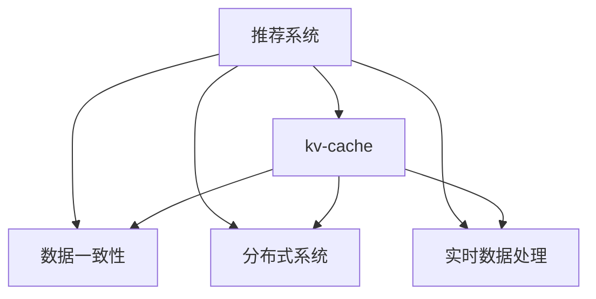

                 

## 1. 背景介绍

### 1.1 问题由来

在推荐系统领域，用户的兴趣建模和个性化推荐是核心问题。然而，随着数据量的爆炸式增长，推荐系统需要实时处理海量数据，在保证推荐效果的同时，对系统的实时性、稳定性、扩展性提出了严峻挑战。

**挑战主要体现在以下几个方面**：
- **延迟问题**：推荐系统的响应时间需要控制在毫秒级，这对于处理大规模数据非常困难。
- **数据一致性**：用户行为数据常常是实时动态变化的，如何在高并发下保证数据一致性是一个重要问题。
- **扩展性问题**：随着用户数和物品数的增加，推荐系统需要支持高吞吐量的并发请求。

### 1.2 问题核心关键点

为了解决上述挑战，推荐系统在数据处理和缓存技术上进行了大量探索和创新。其中，**kv-cache**技术作为高效的数据缓存方案，被广泛应用于推荐系统中，显著提升了系统的性能和稳定性。

kv-cache是一种基于Key-Value的缓存机制，通过将查询结果缓存在内存中，减少了对后端数据库的访问，从而大大提升了响应速度和系统吞吐量。在推荐系统中，kv-cache能够有效降低推荐延迟，同时保持数据的一致性和准确性。

## 2. 核心概念与联系

### 2.1 核心概念概述

为更好地理解kv-cache在推荐系统中的应用，本节将介绍几个密切相关的核心概念：

- **推荐系统**：通过用户历史行为数据和物品属性数据，构建用户兴趣模型，实现个性化推荐。
- **kv-cache**：基于Key-Value的缓存技术，快速查询和更新缓存中的数据。
- **数据一致性**：在多用户并发访问时，保证数据在缓存和后端数据库中的同步。
- **分布式系统**：推荐系统常常需要分布式部署，kv-cache需要在分布式环境下保持数据一致性。
- **实时数据处理**：推荐系统需要实时处理用户行为数据，kv-cache需要支持高效的读写操作。

这些核心概念之间的逻辑关系可以通过以下Mermaid流程图来展示：



这个流程图展示了好几个核心概念及其之间的关系：

1. **推荐系统**是kv-cache的应用场景。
2. **数据一致性**是kv-cache在分布式系统中的重要保证。
3. **实时数据处理**是kv-cache需要处理的核心需求。

这些概念共同构成了kv-cache在推荐系统中的应用框架，使得kv-cache成为推荐系统中的重要组成部分。

## 3. 核心算法原理 & 具体操作步骤
### 3.1 算法原理概述

kv-cache在推荐系统中的应用，主要体现在两个方面：**查询加速**和**数据更新**。

**查询加速**：通过缓存用户的历史行为数据和推荐结果，当用户再次访问时，可以直接从缓存中读取数据，避免了对后端数据库的频繁访问，从而大幅提升查询效率。

**数据更新**：当用户行为数据或推荐模型发生变化时，需要及时更新缓存中的数据。在保证数据一致性的同时，需要减少对后端数据库的写入次数，从而降低系统延迟和开销。

### 3.2 算法步骤详解

kv-cache在推荐系统中的操作流程主要包括：

1. **数据缓存**：将推荐系统的查询结果（如用户行为数据、推荐结果等）缓存到内存中。
2. **查询匹配**：当用户发起请求时，首先查询缓存中是否有相关数据，如果有则直接返回，否则查询后端数据库。
3. **数据更新**：当用户行为数据或推荐结果发生变化时，更新缓存中的数据。

这些步骤可以通过以下伪代码实现：

```python
# 缓存数据
cache.insert(key, value)

# 查询缓存
value = cache.get(key)

# 更新缓存
cache.update(key, new_value)
```

### 3.3 算法优缺点

kv-cache在推荐系统中的应用，具有以下优点：

- **查询效率高**：缓存数据能够显著降低推荐系统的查询延迟，提升用户体验。
- **支持高并发**：通过合理配置缓存大小，可以支持高并发的查询请求，提升系统的吞吐量。
- **可扩展性强**：kv-cache可以水平扩展，增加更多的缓存节点，提高系统的处理能力。

同时，kv-cache也存在一定的局限性：

- **内存占用大**：缓存数据需要占用大量内存空间，对于内存资源有限的系统可能不适用。
- **数据一致性问题**：在分布式环境下，缓存数据需要与后端数据库保持一致，否则可能导致数据不一致。
- **写操作开销大**：更新缓存数据时，需要对缓存和后端数据库进行同步更新，可能会影响系统的性能。

### 3.4 算法应用领域

kv-cache不仅在推荐系统中有广泛应用，还广泛应用于各种需要高效数据缓存的场景，例如：

- **电子商务系统**：缓存用户浏览、点击、购买等行为数据，提升推荐效果和查询速度。
- **社交网络系统**：缓存用户动态、好友关系等数据，支持高效的社交推荐和内容分发。
- **新闻媒体系统**：缓存用户浏览新闻、评论等数据，提升个性化新闻推荐和内容分发效率。

kv-cache在推荐系统中的应用，已经成为了推荐技术的重要组成部分，推动了推荐系统的高效化和智能化发展。

## 4. 数学模型和公式 & 详细讲解 & 举例说明

### 4.1 数学模型构建

kv-cache在推荐系统中的应用，主要涉及以下几个数学模型：

- **缓存命中率**：当用户请求时，能够从缓存中找到相关数据的概率。
- **缓存更新频率**：缓存数据需要定期更新的次数。
- **查询延迟**：用户请求从发出到获取结果的等待时间。

### 4.2 公式推导过程

我们可以使用以下公式来计算缓存命中率和查询延迟：

- **缓存命中率公式**：

$$
H = \frac{N_{cache}}{N_{cache} + N_{db}}
$$

其中，$N_{cache}$为缓存中数据的数量，$N_{db}$为后端数据库中数据的数量。

- **查询延迟公式**：

$$
T = T_{cache} + T_{db}
$$

其中，$T_{cache}$为从缓存中读取数据的延迟，$T_{db}$为从后端数据库中读取数据的延迟。

### 4.3 案例分析与讲解

假设某推荐系统中有10万个用户，每个用户有1000个历史行为数据，查询命中率为99%，从缓存中读取数据的延迟为1毫秒，从后端数据库中读取数据的延迟为50毫秒。则系统查询延迟为：

$$
T = 0.01 \times 1 + 0.99 \times 50 = 49.99 \text{毫秒}
$$

可以看出，缓存技术显著降低了推荐系统的查询延迟。

## 5. 项目实践：代码实例和详细解释说明

### 5.1 开发环境搭建

在进行kv-cache实践前，我们需要准备好开发环境。以下是使用Python进行Redis开发的环境配置流程：

1. 安装Redis：从官网下载并安装Redis。
2. 安装Python的Redis客户端：

```python
pip install redis
```

3. 安装相关工具包：

```python
pip install redis-py lru-cache
```

完成上述步骤后，即可在Python环境中开始kv-cache实践。

### 5.2 源代码详细实现

这里我们以Redis实现kv-cache为例，给出一个简单的Python代码实现。

```python
from redis import Redis

# 连接Redis服务器
r = Redis(host='localhost', port=6379, db=0)

# 缓存数据
def cache_insert(key, value):
    r.set(key, value)

# 查询缓存
def cache_get(key):
    value = r.get(key)
    if value:
        return value.decode('utf-8')
    else:
        return None

# 更新缓存
def cache_update(key, new_value):
    r.set(key, new_value)
```

### 5.3 代码解读与分析

让我们再详细解读一下关键代码的实现细节：

**cache_insert函数**：
- 使用Redis的`set`方法将数据缓存到Redis服务器中。

**cache_get函数**：
- 使用Redis的`get`方法从Redis服务器中读取缓存数据。
- 如果缓存中存在相关数据，则返回数据；否则返回`None`。

**cache_update函数**：
- 使用Redis的`set`方法更新缓存数据。

通过以上代码，我们实现了一个简单的kv-cache缓存系统。其中，Redis作为高效的内存数据结构，能够快速进行数据的读写操作，是kv-cache的理想选择。

### 5.4 运行结果展示

运行以下代码，可以看到kv-cache的效果：

```python
# 缓存数据
cache_insert('key1', 'value1')

# 查询缓存
value = cache_get('key1')
print(value)  # 输出：value1

# 更新缓存
cache_update('key1', 'new_value')
value = cache_get('key1')
print(value)  # 输出：new_value
```

通过这段代码，我们成功将数据缓存到Redis中，并从Redis中读取和更新数据。

## 6. 实际应用场景

### 6.1 智能推荐系统

在智能推荐系统中，kv-cache技术能够显著提升推荐系统的响应速度和用户满意度。推荐系统中的核心操作如用户画像构建、推荐结果生成、用户行为记录等，都可以通过缓存技术进行优化。

**具体应用如下**：
- **用户画像构建**：缓存用户的浏览、点击、收藏等行为数据，加速用户画像的生成。
- **推荐结果生成**：缓存用户的个性化推荐结果，提升推荐的速度和准确性。
- **用户行为记录**：缓存用户的行为记录，避免对数据库的频繁写入，减少系统延迟。

### 6.2 广告推荐系统

广告推荐系统需要实时处理用户点击、曝光等行为数据，并进行高频次推荐。kv-cache技术能够有效提升广告推荐系统的响应速度和性能。

**具体应用如下**：
- **广告展示**：缓存用户的浏览和点击行为数据，加速广告展示和推荐。
- **用户行为分析**：缓存用户的点击和曝光数据，进行用户行为分析，优化广告投放策略。
- **广告优化**：缓存广告展示效果数据，实时优化广告投放策略，提升广告效果。

### 6.3 电子商务系统

电子商务系统需要处理海量用户数据，并进行高效的推荐和查询。kv-cache技术能够有效提升系统的响应速度和处理能力。

**具体应用如下**：
- **商品推荐**：缓存用户的浏览和购买行为数据，进行高效的商品推荐。
- **商品搜索**：缓存商品的详细信息，加速商品搜索和展示。
- **订单处理**：缓存用户的订单数据，提升订单处理的速度和效率。

### 6.4 未来应用展望

随着推荐系统对实时性和性能要求的不断提高，kv-cache技术的应用将更加广泛和深入。

- **实时数据处理**：kv-cache技术将应用于实时数据流处理，提升推荐系统的实时性和响应速度。
- **多模态数据融合**：kv-cache技术将支持多模态数据的融合，提升推荐系统的智能性和丰富度。
- **个性化推荐**：kv-cache技术将支持个性化推荐，提升推荐系统的针对性和精准性。

## 7. 工具和资源推荐

### 7.1 学习资源推荐

为了帮助开发者系统掌握kv-cache技术，这里推荐一些优质的学习资源：

1. Redis官方文档：Redis的官方文档是学习kv-cache技术的最佳资源，详细介绍了Redis的各种功能和用法。
2. Redis实战：一本实战性较强的书籍，通过实际案例讲解Redis的使用方法，适合深入学习。
3. Python Redis客户端官方文档：详细的Redis客户端API文档，方便开发者快速上手。
4. Redis集群架构设计：一篇关于Redis集群架构设计的博客，介绍了Redis集群的高可用性和扩展性。
5. Redis性能优化：一篇关于Redis性能优化的博客，介绍了Redis的性能瓶颈和优化策略。

通过对这些资源的学习实践，相信你一定能够快速掌握kv-cache技术，并用于解决实际的推荐系统问题。

### 7.2 开发工具推荐

kv-cache技术的实现需要依赖Redis等缓存系统。以下是几款用于kv-cache开发的常用工具：

1. Redis：高性能的内存数据结构，支持数据持久化和集群部署。
2. Redis Cluster：Redis的集群扩展方案，支持高可用性和扩展性。
3. Redis Sentinel：Redis的高可用性方案，保证Redis服务器的可用性。
4. Redis-Py：Python的Redis客户端，方便开发者进行Redis操作。
5. lru-cache：Python的缓存模块，支持LRU缓存策略，适合kv-cache的应用场景。

合理利用这些工具，可以显著提升kv-cache技术的应用效率，加速推荐系统的开发和部署。

### 7.3 相关论文推荐

kv-cache技术的发展源于学界的持续研究。以下是几篇奠基性的相关论文，推荐阅读：

1. Redis设计理念（Redis Design Philosophy）：介绍了Redis的设计理念和核心功能。
2. Redis事务（Redis Transactions）：介绍了Redis的事务机制，支持ACID特性。
3. Redis高可用性（Redis High Availability）：介绍了Redis的高可用性方案，保证Redis服务的稳定性和可靠性。
4. Redis性能优化（Redis Performance Optimization）：介绍了Redis的性能瓶颈和优化策略，帮助提升Redis的性能。
5. Redis集群架构设计（Redis Cluster Architecture Design）：介绍了Redis集群架构的设计思路和实现方法，提升Redis的扩展性和可用性。

这些论文代表了大语言模型微调技术的发展脉络。通过学习这些前沿成果，可以帮助研究者把握学科前进方向，激发更多的创新灵感。

## 8. 总结：未来发展趋势与挑战

### 8.1 总结

本文对kv-cache技术在推荐系统中的应用进行了全面系统的介绍。首先阐述了kv-cache技术的背景和意义，明确了kv-cache在推荐系统中的重要价值。其次，从原理到实践，详细讲解了kv-cache的数学模型和操作步骤，给出了kv-cache技术实现的完整代码实例。同时，本文还广泛探讨了kv-cache技术在智能推荐、广告推荐、电子商务等推荐系统中的实际应用，展示了kv-cache技术的广泛应用前景。

通过本文的系统梳理，可以看到，kv-cache技术在推荐系统中具有广泛的应用价值，通过缓存技术能够显著提升推荐系统的响应速度和系统性能。未来，随着推荐系统对实时性和性能要求的不断提高，kv-cache技术的应用将更加广泛和深入。

### 8.2 未来发展趋势

展望未来，kv-cache技术将呈现以下几个发展趋势：

1. **实时数据处理**：随着实时数据的不断增加，kv-cache技术将应用于实时数据流处理，提升推荐系统的实时性和响应速度。
2. **多模态数据融合**：kv-cache技术将支持多模态数据的融合，提升推荐系统的智能性和丰富度。
3. **个性化推荐**：kv-cache技术将支持个性化推荐，提升推荐系统的针对性和精准性。
4. **分布式缓存**：kv-cache技术将支持分布式缓存，提升系统的扩展性和可用性。
5. **高可用性和一致性**：kv-cache技术将支持高可用性和一致性，保证系统的稳定性和可靠性。

以上趋势凸显了kv-cache技术的广阔前景。这些方向的探索发展，必将进一步提升推荐系统的性能和应用范围，为推荐系统的高效化和智能化发展提供有力支持。

### 8.3 面临的挑战

尽管kv-cache技术已经取得了瞩目成就，但在迈向更加智能化、普适化应用的过程中，它仍面临着诸多挑战：

1. **内存资源限制**：kv-cache需要占用大量内存空间，对于内存资源有限的系统可能不适用。
2. **数据一致性问题**：在分布式环境下，缓存数据需要与后端数据库保持一致，否则可能导致数据不一致。
3. **写操作开销大**：更新缓存数据时，需要对缓存和后端数据库进行同步更新，可能会影响系统的性能。
4. **缓存命中率问题**：缓存命中率低时，缓存效果会大打折扣，需要优化缓存策略。

### 8.4 研究展望

面对kv-cache面临的这些挑战，未来的研究需要在以下几个方面寻求新的突破：

1. **优化缓存策略**：通过缓存失效策略、缓存预热策略等，提高缓存命中率，优化缓存效果。
2. **支持高并发**：通过多缓存节点部署、分片缓存等技术，支持高并发的查询请求，提升系统的处理能力。
3. **支持多模态数据**：通过多维索引、分布式存储等技术，支持多模态数据的缓存和查询。
4. **提升一致性**：通过分布式锁、事务等技术，提升缓存数据与后端数据库的一致性，保证数据一致性。
5. **支持分布式部署**：通过Redis Cluster等技术，支持kv-cache的分布式部署，提升系统的扩展性和可用性。

这些研究方向的探索，必将引领kv-cache技术迈向更高的台阶，为推荐系统的高效化和智能化发展提供有力支持。面向未来，kv-cache技术还需要与其他人工智能技术进行更深入的融合，如知识表示、因果推理、强化学习等，多路径协同发力，共同推动推荐系统的发展。

## 9. 附录：常见问题与解答

**Q1：kv-cache是否适用于所有推荐系统？**

A: kv-cache适用于大多数推荐系统，特别是需要高效处理大量数据和频繁查询的系统。但对于一些特定的推荐系统，如实时推荐系统、小规模推荐系统等，可能需要考虑其他缓存技术。

**Q2：如何优化kv-cache的缓存命中率？**

A: 可以通过以下方法优化kv-cache的缓存命中率：
1. 缓存预热：在用户请求到来之前，提前将部分数据缓存到Redis中。
2. 缓存失效策略：根据数据的变化频率，设置合理的缓存失效时间。
3. 缓存分片：将大数据分成多个小的缓存片，减少缓存压力。

**Q3：kv-cache在分布式系统中的应用需要注意哪些问题？**

A: kv-cache在分布式系统中的应用需要注意以下问题：
1. 数据一致性：保证Redis缓存和后端数据库的数据一致性。
2. 缓存失效：设置合理的缓存失效时间，避免缓存数据过时。
3. 分布式锁：使用分布式锁保证Redis集群中的数据一致性。
4. 数据同步：定期同步Redis缓存和后端数据库的数据，保持数据一致性。

**Q4：kv-cache的写操作开销大，如何解决？**

A: 可以通过以下方法解决kv-cache的写操作开销问题：
1. 批量写入：将多个操作合并为一个操作，减少写入次数。
2. 延迟写入：将写操作延迟到合适的时间再执行，减少写入次数。
3. 数据分片：将数据分散到多个Redis节点中，减少单个节点的写入压力。

**Q5：kv-cache的缓存策略有哪些？**

A: kv-cache的缓存策略主要包括：
1. 时间失效：根据时间设置缓存失效时间。
2. 访问失效：根据访问频率设置缓存失效时间。
3. 计数失效：根据缓存访问次数设置缓存失效时间。
4. 缓存预热：在用户请求到来之前，提前将部分数据缓存到Redis中。

通过优化缓存策略和注意分布式系统中的问题，可以最大限度地发挥kv-cache的优势，提升推荐系统的性能和稳定性。

---

作者：禅与计算机程序设计艺术 / Zen and the Art of Computer Programming

