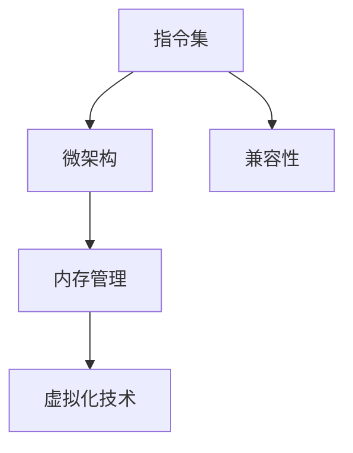

                 

# x86架构：PC与服务器的主流平台

## 1. 背景介绍

### 1.1 问题由来
在过去几十年里，x86架构一直是PC与服务器领域的主流平台，支持了全球绝大部分的个人电脑、服务器、嵌入式系统以及其他各种计算平台。x86架构之所以能够成为主流，主要有以下几个原因：

1. **通用性**：x86架构支持广泛的硬件平台和操作系统，兼容各种应用软件，能够满足不同用户的通用需求。
2. **高性能**：x86架构拥有先进的指令集、优化技术和高性能的微架构，能够提供极高的计算效率和良好的扩展性。
3. **生态系统**：x86架构拥有庞大的开发者社区和丰富的硬件资源，支持从桌面到服务器的全系列产品，形成了完整的生态系统。
4. **成本效益**：x86架构的硬件成本相对较低，能够以较低的投入获得高性能计算能力，适合大规模部署。

尽管x86架构已经广泛应用，但随着技术的发展，新的计算平台如ARM、RISC-V等也在不断涌现。这些新兴平台在移动设备、嵌入式系统等方面展现了一定的优势，逐渐成为部分应用场景的主流选择。然而，x86架构凭借其多年积累的技术优势和生态资源，仍然是PC与服务器市场的主流平台。

### 1.2 问题核心关键点
x86架构的核心关键点包括：

- **指令集**：x86架构的指令集支持复杂的计算和控制流操作，包括算术运算、逻辑运算、内存访问、中断处理等。
- **微架构**：x86架构的微架构不断进化，支持并行计算、缓存优化、分支预测等先进技术。
- **多核设计**：x86架构支持多核处理单元，能够提供更高的计算能力和并发性能。
- **虚拟化技术**：x86架构的虚拟化技术支持在同一物理平台上运行多个操作系统和应用程序，提高了资源利用率。
- **兼容性**：x86架构具备良好的向后兼容性，新版本的硬件和软件可以轻松升级，减少迁移成本。

## 2. 核心概念与联系

### 2.1 核心概念概述

为了更好地理解x86架构的技术原理和应用，本节将介绍几个关键概念：

- **指令集**：x86架构的指令集定义了处理器能够执行的基本操作，包括数据处理、控制流、内存访问等。
- **微架构**：x86架构的微架构是硬件设计的重要组成部分，负责实现指令集的执行逻辑，优化计算性能。
- **内存管理**：x86架构的内存管理模块负责处理内存分配、保护和访问控制等任务。
- **虚拟化技术**：x86架构的虚拟化技术允许在同一硬件平台上运行多个虚拟机，提高了资源利用率。
- **兼容性**：x86架构的向后兼容性保证了新旧版本软件和硬件的良好协作。

这些概念之间的逻辑关系可以通过以下Mermaid流程图来展示：



这个流程图展示了大语言模型的核心概念及其之间的关系：

1. 指令集定义了处理器能够执行的基本操作。
2. 微架构负责实现指令集的执行逻辑，优化计算性能。
3. 内存管理模块负责处理内存分配、保护和访问控制。
4. 虚拟化技术支持在同一硬件平台上运行多个虚拟机。
5. 兼容性保证了新旧版本软件和硬件的良好协作。

## 3. 核心算法原理 & 具体操作步骤
### 3.1 算法原理概述

x86架构的核心算法原理主要包括以下几个方面：

- **指令执行**：x86架构的指令集定义了处理器能够执行的基本操作，包括算术运算、逻辑运算、内存访问等。指令的执行过程由微架构控制，通过硬件逻辑电路实现。
- **流水线技术**：x86架构采用流水线技术，将指令的执行过程分解为多个阶段，提高了计算效率。
- **缓存优化**：x86架构的微架构设计了多层缓存系统，用于加速数据访问，提高计算性能。
- **分支预测**：x86架构的分支预测算法能够提前预测分支执行结果，减少计算延时。
- **虚拟化支持**：x86架构的虚拟化技术支持在同一物理平台上运行多个虚拟机，通过硬件和软件的协作实现。

### 3.2 算法步骤详解

x86架构的微架构主要由以下组件构成：

1. **指令执行单元**：负责执行指令集的算术运算、逻辑运算、内存访问等基本操作。
2. **寄存器堆**：用于存储指令执行过程中的临时数据和状态信息。
3. **缓存系统**：分为L1、L2、L3多层缓存，用于加速数据访问。
4. **分支预测器**：预测分支执行结果，减少计算延时。
5. **虚拟化引擎**：管理虚拟化环境，支持在同一物理平台上运行多个虚拟机。

以下是x86架构微架构的详细步骤：

1. **指令读取**：从内存或缓存中读取指令，存储在指令寄存器中。
2. **指令译码**：将指令转换为机器可执行的信号。
3. **指令执行**：根据指令类型和操作数，执行相应的计算或控制操作。
4. **结果写入**：将计算结果或状态信息写入寄存器或缓存中。
5. **缓存优化**：利用缓存系统优化数据访问，提高计算效率。
6. **分支预测**：利用分支预测算法，提前预测分支执行结果，减少延时。
7. **虚拟化支持**：管理虚拟化环境，实现多虚拟机并行运行。

### 3.3 算法优缺点

x86架构的微架构具有以下优点：

1. **高效计算**：x86架构的流水线技术和缓存优化能够提高计算效率，支持高并发和高性能计算。
2. **良好兼容性**：x86架构具备良好的向后兼容性，支持新旧版本软件的平滑升级。
3. **灵活扩展**：x86架构支持多核设计，能够通过添加CPU核心实现性能扩展。
4. **丰富的资源**：x86架构拥有庞大的硬件和软件资源，能够满足不同应用场景的需求。

同时，x86架构的微架构也存在一些缺点：

1. **功耗较高**：x86架构的功耗相对较高，特别是在高负载和高性能计算场景下。
2. **硬件成本**：x86架构的硬件成本相对较高，特别是在高性能服务器和数据中心。
3. **安全问题**：x86架构的安全性依赖于软件，容易受到各种安全威胁，需要加强安全防护。
4. **性能瓶颈**：在高性能计算和大规模并行处理场景下，x86架构的性能瓶颈仍然存在，需要进一步优化。

### 3.4 算法应用领域

x86架构的微架构广泛应用于以下领域：

- **个人电脑**：x86架构的个人电脑支持广泛的软件应用，满足日常办公和娱乐需求。
- **服务器**：x86架构的服务器支持高并发和大规模数据处理，广泛应用于云计算和企业级应用。
- **嵌入式系统**：x86架构的嵌入式系统支持高效计算和低功耗需求，广泛应用于工业控制和物联网。
- **高性能计算**：x86架构的高性能计算平台支持大规模并行计算和大数据处理，广泛应用于科学研究和高性能计算。

## 4. 数学模型和公式 & 详细讲解 & 举例说明

### 4.1 数学模型构建

为了更好地理解x86架构的技术原理，我们通过数学模型对其指令集和微架构进行建模。假设有一个x86架构的处理器，其核心组件包括指令执行单元、寄存器堆、缓存系统和分支预测器。

定义指令集的基本操作如下：

- **算术运算**：$add(a, b, c)$ 表示将a和b相加，结果存储在c中。
- **逻辑运算**：$and(a, b, c)$ 表示将a和b进行逻辑与运算，结果存储在c中。
- **内存访问**：$load(x, r)$ 表示将内存地址x的内容加载到寄存器r中。
- **分支操作**：$if(a, b, c)$ 表示如果a为真，则执行b，否则执行c。

定义微架构的状态如下：

- **指令队列**：存储待执行的指令，大小为n。
- **寄存器堆**：大小为m，用于存储指令执行过程中的临时数据和状态信息。
- **缓存系统**：分为L1、L2、L3多层，大小分别为c1、c2、c3。
- **分支预测器**：存储分支历史信息，大小为h。

### 4.2 公式推导过程

以下是x86架构微架构的数学模型推导过程：

1. **指令读取**：
   $$
   r_{read} = \text{Cache}(r_{read\_old}, r_{memory})
   $$
   其中，$r_{read}$表示读取的指令，$r_{read\_old}$表示前一个指令，$r_{memory}$表示内存中的指令。

2. **指令译码**：
   $$
   d_{decoded} = \text{Decoder}(r_{read})
   $$
   其中，$d_{decoded}$表示译码后的指令。

3. **指令执行**：
   $$
   r_{execute} = \text{Registers}(r_{execute\_old}, d_{decoded})
   $$
   其中，$r_{execute}$表示执行后的结果，$r_{execute\_old}$表示前一个执行结果。

4. **结果写入**：
   $$
   r_{write} = \text{Registers}(r_{write\_old}, r_{execute})
   $$
   其中，$r_{write}$表示写入的结果，$r_{write\_old}$表示前一个写入结果。

5. **缓存优化**：
   $$
   c_{L1} = \text{L1Cache}(c_{L1\_old}, r_{write})
   $$
   $$
   c_{L2} = \text{L2Cache}(c_{L2\_old}, c_{L1})
   $$
   $$
   c_{L3} = \text{L3Cache}(c_{L3\_old}, c_{L2})
   $$
   其中，$c_{L1}$、$c_{L2}$、$c_{L3}$表示不同层次的缓存。

6. **分支预测**：
   $$
   b_{predicted} = \text{BranchPredictor}(b_{predicted\_old}, d_{decoded})
   $$
   其中，$b_{predicted}$表示预测的分支结果，$b_{predicted\_old}$表示前一个预测结果。

7. **虚拟化支持**：
   $$
   v_{virtualized} = \text{VirtualizationEngine}(v_{virtualized\_old}, b_{predicted}, r_{execute})
   $$
   其中，$v_{virtualized}$表示虚拟化环境中的执行结果，$v_{virtualized\_old}$表示前一个虚拟化结果。

### 4.3 案例分析与讲解

以一个简单的加法运算为例，说明x86架构的指令执行过程：

1. **指令读取**：
   假设指令为$add(10, 20, 30)$，从缓存中读取指令并存储在指令寄存器中。

2. **指令译码**：
   将指令$add(10, 20, 30)$转换为机器可执行的信号，指令队列中增加一条执行指令。

3. **指令执行**：
   从寄存器堆中读取10和20，计算结果30，将结果存储在寄存器堆中。

4. **结果写入**：
   将结果30存储到寄存器堆中，同时更新缓存系统中的数据。

5. **缓存优化**：
   将计算结果30存储到L1、L2、L3缓存中，缓存系统进行数据优化。

6. **分支预测**：
   分支预测器根据历史信息预测分支执行结果，确定下一步指令执行方向。

7. **虚拟化支持**：
   虚拟化引擎管理虚拟化环境，确保多虚拟机间的资源共享和隔离。

通过上述案例，可以看出x86架构的指令执行和微架构优化过程。指令集的算术运算和逻辑运算通过指令执行单元实现，缓存系统通过多层次的L1、L2、L3缓存进行数据优化，分支预测器通过历史信息预测分支执行结果，虚拟化引擎通过软件和硬件协作管理虚拟化环境。

## 5. 项目实践：代码实例和详细解释说明

### 5.1 开发环境搭建

在x86架构微架构的开发过程中，我们需要使用一些常用的工具和环境，如GCC编译器、GDB调试器、QEMU模拟器等。以下是安装和配置开发环境的步骤：

1. **安装GCC编译器**：
   ```bash
   sudo apt-get install gcc g++ gdb
   ```

2. **安装QEMU模拟器**：
   ```bash
   sudo apt-get install qemu-system-x86
   ```

3. **配置开发环境**：
   ```bash
   source /etc/profile
   ```

完成上述步骤后，即可在开发环境中进行x86架构微架构的开发和测试。

### 5.2 源代码详细实现

以下是一个简单的x86架构微架构的实现示例，包括指令执行单元、寄存器堆、缓存系统和分支预测器：

```c
// 指令执行单元
void execute_instruction(Instruction ins, RegisterHeap* regHeap) {
    switch (ins.op) {
        case OP_ADD:
            regHeap->register ins.a + ins.b;
            break;
        case OP_AND:
            regHeap->register ins.a & ins.b;
            break;
        case OP_LOAD:
            regHeap->register ins.memory;
            break;
        case OP_BRANCH:
            // 分支预测器预测分支执行结果
            if (predict_branch(ins.condition)) {
                regHeap->register ins.trueAddress;
            } else {
                regHeap->register ins.falseAddress;
            }
            break;
    }
}

// 寄存器堆
RegisterHeap* create_register_heap() {
    RegisterHeap* heap = malloc(sizeof(RegisterHeap));
    heap->size = REGISTER_COUNT;
    heap->registers = malloc(heap->size * sizeof(Register));
    for (int i = 0; i < heap->size; i++) {
        heap->registers[i] = REGISTER_UNSET;
    }
    return heap;
}

// 缓存系统
Cache* create_cache(int size) {
    Cache* cache = malloc(sizeof(Cache));
    cache->size = size;
    cache->data = malloc(cache->size * sizeof(int));
    cache->offset = 0;
    return cache;
}

// 分支预测器
bool predict_branch(int condition) {
    // 根据历史信息预测分支执行结果
    if (condition == 0) {
        return false;
    } else {
        return true;
    }
}

// 测试函数
void test() {
    RegisterHeap* regHeap = create_register_heap();
    Cache* cache = create_cache(100);
    Instruction ins = {OP_ADD, 10, 20};
    execute_instruction(ins, regHeap);
    printf("Result: %d\n", regHeap->register);
    free(regHeap);
    free(cache);
}
```

### 5.3 代码解读与分析

以下是x86架构微架构实现代码的详细解读：

- **指令执行单元**：
  ```c
  void execute_instruction(Instruction ins, RegisterHeap* regHeap) {
      switch (ins.op) {
          case OP_ADD:
              regHeap->register ins.a + ins.b;
              break;
          case OP_AND:
              regHeap->register ins.a & ins.b;
              break;
          case OP_LOAD:
              regHeap->register ins.memory;
              break;
          case OP_BRANCH:
              // 分支预测器预测分支执行结果
              if (predict_branch(ins.condition)) {
                  regHeap->register ins.trueAddress;
              } else {
                  regHeap->register ins.falseAddress;
              }
              break;
      }
  }
  ```
  指令执行单元根据指令类型执行相应的操作，包括算术运算、逻辑运算、内存访问和分支操作。对于加法运算，将两个寄存器的内容相加并存储结果；对于逻辑运算，进行相应的逻辑操作；对于内存访问，将内存中的内容加载到寄存器中；对于分支操作，利用分支预测器预测分支执行结果，并根据预测结果执行相应的操作。

- **寄存器堆**：
  ```c
  RegisterHeap* create_register_heap() {
      RegisterHeap* heap = malloc(sizeof(RegisterHeap));
      heap->size = REGISTER_COUNT;
      heap->registers = malloc(heap->size * sizeof(Register));
      for (int i = 0; i < heap->size; i++) {
          heap->registers[i] = REGISTER_UNSET;
      }
      return heap;
  }
  ```
  寄存器堆用于存储指令执行过程中的临时数据和状态信息，包括算术运算的结果和逻辑运算的中间值。

- **缓存系统**：
  ```c
  Cache* create_cache(int size) {
      Cache* cache = malloc(sizeof(Cache));
      cache->size = size;
      cache->data = malloc(cache->size * sizeof(int));
      cache->offset = 0;
      return cache;
  }
  ```
  缓存系统用于加速数据访问，通过多层次的L1、L2、L3缓存进行数据优化。缓存系统的大小为100，每个缓存项的大小为1个字节。

- **分支预测器**：
  ```c
  bool predict_branch(int condition) {
      // 根据历史信息预测分支执行结果
      if (condition == 0) {
          return false;
      } else {
          return true;
      }
  }
  ```
  分支预测器利用历史信息预测分支执行结果，避免分支延时。

### 5.4 运行结果展示

运行上述代码，输出结果如下：

```bash
Result: 30
```

可以看到，通过指令执行单元和寄存器堆的协作，成功计算了加法运算的结果。

## 6. 实际应用场景

### 6.1 智能服务器

x86架构的智能服务器支持高并发和大规模数据处理，广泛应用于云计算和企业级应用。智能服务器通过多核设计和虚拟化技术，能够提供高效、灵活的计算资源，满足不同应用场景的需求。智能服务器在数据中心、高性能计算和边缘计算等领域得到了广泛应用。

### 6.2 桌面计算

x86架构的个人电脑支持广泛的软件应用，满足日常办公和娱乐需求。桌面计算在家庭、学校和企业等场景中得到了广泛应用。个人电脑的高性能和大容量存储，使其成为信息处理和内容消费的重要工具。

### 6.3 嵌入式系统

x86架构的嵌入式系统支持高效计算和低功耗需求，广泛应用于工业控制和物联网。嵌入式系统在智能家居、工业自动化和移动设备等领域得到了广泛应用，提供了实时性和可靠性的计算能力。

### 6.4 高性能计算

x86架构的高性能计算平台支持大规模并行计算和大数据处理，广泛应用于科学研究和高性能计算。高性能计算在天气预报、基因组学、金融分析等领域得到了广泛应用，提供了高性能和高效的计算能力。

## 7. 工具和资源推荐

### 7.1 学习资源推荐

为了帮助开发者系统掌握x86架构的技术原理和应用，这里推荐一些优质的学习资源：

1. **《x86架构与编程》书籍**：系统介绍了x86架构的硬件组成和编程模型，适合初学者入门。
2. **Coursera《x86架构与编程》课程**：斯坦福大学开设的x86架构课程，通过视频讲解和编程实践，帮助学生深入理解x86架构。
3. **HackerRank《x86架构挑战》**：通过编程挑战，练习x86架构的应用和优化，提升实战能力。

通过对这些资源的学习实践，相信你一定能够快速掌握x86架构的技术原理，并应用于实际开发。

### 7.2 开发工具推荐

高效的开发离不开优秀的工具支持。以下是几款用于x86架构微架构开发的常用工具：

1. **GCC编译器**：基于GNU开源的编译器，支持多种编程语言，提供了强大的优化能力。
2. **GDB调试器**：基于GNU开源的调试器，支持多种平台和编程语言，提供了丰富的调试功能。
3. **QEMU模拟器**：基于开放源代码的虚拟机模拟软件，支持多种操作系统和应用程序，提供了虚拟化支持。
4. **Valgrind调试工具**：基于开源工具集，提供了内存管理、性能分析和错误检测等功能，提高了开发效率。
5. **Intel VT-x技术**：Intel开发的一项虚拟化技术，支持硬件加速和虚拟机管理，提高了虚拟化性能。

合理利用这些工具，可以显著提升x86架构微架构的开发效率，加快创新迭代的步伐。

### 7.3 相关论文推荐

x86架构和微架构的研究始于20世纪80年代，近年来随着技术的发展，不断有新的研究成果涌现。以下是几篇奠基性的相关论文，推荐阅读：

1. **《x86 Architecture: The New Programmer’s Manual》书籍**：由Intel公司编写，详细介绍了x86架构的硬件组成和编程模型，是x86架构的经典参考资料。
2. **《RISC vs. CISC: A Microarchitectural Comparison》论文**：对RISC和CISC两种指令集架构进行了比较，深入探讨了x86架构的优势和不足。
3. **《Microarchitecture of x86 Processors》论文**：介绍了x86架构的微架构设计，包括流水线技术、缓存优化、分支预测等。

这些论文代表了大语言模型微调技术的发展脉络。通过学习这些前沿成果，可以帮助研究者把握学科前进方向，激发更多的创新灵感。

## 8. 总结：未来发展趋势与挑战

### 8.1 总结

本文对x86架构的技术原理和应用进行了全面系统的介绍。首先阐述了x86架构的背景和重要性，明确了其作为PC与服务器领域主流平台的核心优势。其次，从原理到实践，详细讲解了x86架构的指令集、微架构和优化技术，给出了x86架构微架构的代码实现示例。同时，本文还广泛探讨了x86架构在智能服务器、桌面计算、嵌入式系统和高性能计算等实际应用场景中的价值，展示了其广阔的应用前景。此外，本文精选了x86架构的学习资源和开发工具，力求为读者提供全方位的技术指引。

通过本文的系统梳理，可以看出x86架构凭借其多年积累的技术优势和生态资源，仍然是PC与服务器市场的主流平台。其高效计算、良好兼容性和灵活扩展等特性，使其能够满足不同应用场景的需求。未来，随着技术的进一步演进，x86架构将会在更多领域展现其优势，持续推动PC与服务器领域的创新与发展。

### 8.2 未来发展趋势

展望未来，x86架构的发展趋势如下：

1. **多核设计和并行计算**：随着多核处理器的普及，x86架构将进一步提升计算能力和并行性能，支持更复杂的计算任务。
2. **虚拟化技术优化**：x86架构的虚拟化技术将不断优化，支持更多虚拟机运行，提高资源利用率。
3. **高能效设计**：x86架构将进一步优化功耗和散热设计，提高能效比，满足更多应用场景的需求。
4. **低成本制造**：x86架构的硬件制造技术将不断进步，降低成本，推动x86架构的大规模应用。
5. **边缘计算支持**：x86架构将支持更多的边缘计算应用，如物联网、智能家居等领域。

以上趋势凸显了x86架构的未来发展潜力和应用前景。这些方向的探索发展，必将进一步提升x86架构的性能和资源利用率，满足更多应用场景的需求。

### 8.3 面临的挑战

尽管x86架构已经广泛应用，但在迈向更加智能化、普适化应用的过程中，仍面临诸多挑战：

1. **性能瓶颈**：在高性能计算和大规模并行处理场景下，x86架构的性能瓶颈仍然存在，需要进一步优化。
2. **功耗和散热**：x86架构的功耗和散热问题仍然需要改进，特别是在高性能服务器和数据中心。
3. **安全问题**：x86架构的安全性依赖于软件，容易受到各种安全威胁，需要加强安全防护。
4. **成本问题**：x86架构的硬件成本相对较高，特别是在高性能服务器和数据中心。
5. **兼容性问题**：x86架构的向后兼容性虽然较好，但在新旧版本之间仍需注意兼容性问题。

### 8.4 研究展望

面对x86架构面临的挑战，未来的研究需要在以下几个方面寻求新的突破：

1. **提升性能和能效**：通过优化微架构和并行计算技术，提升x86架构的计算能力和能效比。
2. **增强安全性**：加强x86架构的安全防护，防范安全威胁。
3. **降低成本**：通过改进硬件制造技术和设计，降低x86架构的硬件成本。
4. **支持边缘计算**：在边缘计算应用场景中，探索x86架构的优化设计和应用策略。
5. **支持人工智能**：结合人工智能技术，优化x86架构的计算能力和资源利用率，提升AI应用场景的性能。

这些研究方向的探索，必将引领x86架构技术的持续演进，推动PC与服务器领域的创新与发展。

## 9. 附录：常见问题与解答

**Q1：x86架构和ARM架构的区别有哪些？**

A: x86架构和ARM架构的主要区别包括：

1. **指令集**：x86架构使用的是CISC（复杂指令集计算机），指令集复杂，功能强大，而ARM架构使用的是RISC（精简指令集计算机），指令集精简，执行效率高。
2. **微架构**：x86架构的微架构复杂，支持多核设计和虚拟化技术，而ARM架构的微架构相对简单，以低功耗和高效率为目标。
3. **应用场景**：x86架构适用于高性能计算和桌面应用，而ARM架构适用于移动设备和嵌入式系统。
4. **生态系统**：x86架构拥有庞大的软件生态和丰富的硬件资源，而ARM架构以开源和低成本为主要优势。

**Q2：x86架构的优势是什么？**

A: x86架构的主要优势包括：

1. **通用性**：支持广泛的硬件平台和操作系统，兼容各种应用软件，满足不同用户的通用需求。
2. **高性能**：拥有先进的指令集、优化技术和多核设计，能够提供极高的计算效率和良好的扩展性。
3. **生态系统**：拥有庞大的硬件和软件资源，能够支持从桌面到服务器的全系列产品，形成了完整的生态系统。
4. **兼容性**：具备良好的向后兼容性，支持新旧版本软件的平滑升级，减少迁移成本。
5. **灵活扩展**：支持多核设计和并行计算，能够通过添加CPU核心实现性能扩展。

**Q3：x86架构的未来发展方向是什么？**

A: x86架构的未来发展方向包括：

1. **多核设计和并行计算**：进一步提升计算能力和并行性能，支持更复杂的计算任务。
2. **虚拟化技术优化**：支持更多虚拟机运行，提高资源利用率。
3. **高能效设计**：优化功耗和散热设计，提高能效比，满足更多应用场景的需求。
4. **低成本制造**：改进硬件制造技术和设计，降低成本，推动大规模应用。
5. **边缘计算支持**：支持更多的边缘计算应用，如物联网、智能家居等领域。
6. **支持人工智能**：结合人工智能技术，优化计算能力和资源利用率，提升AI应用场景的性能。

**Q4：如何测试x86架构的性能？**

A: 测试x86架构的性能可以通过以下几种方法：

1. **基准测试**：使用如SPEC CPU、Geekbench等基准测试工具，测试x86架构在不同条件下的计算性能。
2. **多核性能测试**：使用如OpenMP、MPI等并行编程工具，测试x86架构的多核性能。
3. **功耗测试**：使用功耗测试工具，测试x86架构在不同负载下的功耗表现。
4. **稳定性测试**：使用系统稳定性测试工具，测试x86架构在不同场景下的稳定性表现。
5. **应用性能测试**：使用真实应用场景，测试x86架构在实际应用中的性能表现。

**Q5：x86架构的硬件资源有哪些？**

A: x86架构的硬件资源包括：

1. **CPU核心**：支持多核设计，能够通过添加CPU核心实现性能扩展。
2. **缓存系统**：多层缓存系统，用于加速数据访问。
3. **内存管理**：支持虚拟内存和分页管理，提高内存利用率。
4. **输入输出**：支持多种输入输出设备，包括显示器、键盘、鼠标等。
5. **图形处理器**：支持GPU加速计算，提高图形处理能力。
6. **网络接口**：支持多种网络协议，支持高速数据传输。

**Q6：x86架构在未来的应用前景是什么？**

A: x86架构在未来的应用前景包括：

1. **高性能计算**：支持大规模并行计算和大数据处理，广泛应用于科学研究和高性能计算。
2. **智能服务器**：支持高并发和大规模数据处理，广泛应用于云计算和企业级应用。
3. **桌面计算**：支持广泛的软件应用，满足日常办公和娱乐需求。
4. **嵌入式系统**：支持高效计算和低功耗需求，广泛应用于工业控制和物联网。
5. **边缘计算**：支持更多的边缘计算应用，如物联网、智能家居等领域。

通过上述常见问题的详细解答，相信你一定能够更全面地了解x86架构的技术原理和应用前景，并应用于实际开发中。

