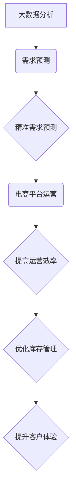

> 需求预测，大数据分析，电商，机器学习，深度学习，时间序列分析，推荐系统

## 1. 背景介绍

在当今数据爆炸的时代，电商行业面临着日益激烈的竞争。为了提高运营效率、优化库存管理和提升客户体验，精准的需求预测成为了电商企业发展的关键。传统的需求预测方法往往依赖于历史数据和专家经验，难以捕捉到市场变化和用户行为的复杂动态。随着大数据技术的快速发展，电商企业开始利用海量数据进行需求预测，取得了显著的成果。

大数据分析在电商中的应用，可以帮助企业从海量数据中挖掘出隐藏的价值，从而实现精准的需求预测。例如，通过分析用户的购买历史、浏览记录、评价信息、社交行为等数据，可以建立用户画像，预测用户的未来需求。同时，结合市场趋势、季节性因素、促销活动等外部因素，可以构建更精准的预测模型。

## 2. 核心概念与联系

**2.1 需求预测**

需求预测是指根据历史数据、市场趋势和用户行为等信息，预测未来一段时间内产品的需求量。

**2.2 大数据分析**

大数据分析是指对海量数据进行收集、存储、处理、分析和挖掘，以发现隐藏的模式、趋势和价值。

**2.3 电商平台数据**

电商平台的数据包括用户数据、商品数据、交易数据、浏览数据、评价数据等，这些数据是进行需求预测的重要基础。

**2.4 关联关系**

大数据分析与需求预测在电商平台中有着密切的关联。通过大数据分析技术，可以从电商平台的海量数据中挖掘出用户需求的规律，从而实现精准的需求预测。



## 3. 核心算法原理 & 具体操作步骤

**3.1 算法原理概述**

常用的需求预测算法包括：

* **时间序列分析:** 这种方法基于历史数据的时间趋势，预测未来需求。常用的时间序列模型包括ARIMA、SARIMA等。
* **机器学习:** 机器学习算法可以从历史数据中学习用户需求的模式，并根据这些模式预测未来需求。常用的机器学习算法包括线性回归、逻辑回归、决策树、支持向量机、神经网络等。
* **深度学习:** 深度学习算法是一种更高级的机器学习算法，可以处理更复杂的数据，并获得更精准的预测结果。常用的深度学习算法包括循环神经网络（RNN）、长短期记忆网络（LSTM）等。

**3.2 算法步骤详解**

以时间序列分析为例，其具体操作步骤如下：

1. **数据收集:** 收集历史需求数据，包括时间戳、需求量等信息。
2. **数据预处理:** 对数据进行清洗、转换、归一化等处理，以确保数据质量和算法的稳定性。
3. **模型选择:** 根据数据的特点和预测需求的精度要求，选择合适的ARIMA模型。
4. **模型训练:** 使用历史数据训练ARIMA模型，并调整模型参数以获得最佳的预测效果。
5. **模型评估:** 使用测试数据评估模型的预测精度，常用的指标包括均方误差（MSE）、平均绝对误差（MAE）等。
6. **模型部署:** 将训练好的模型部署到生产环境中，用于实时预测未来需求。

**3.3 算法优缺点**

* **时间序列分析:**
    * **优点:** 算法简单易懂，易于实现，对数据要求不高。
    * **缺点:** 难以捕捉到非线性趋势和突发事件的影响。
* **机器学习:**
    * **优点:** 可以学习到更复杂的模式，预测精度更高。
    * **缺点:** 对数据要求较高，需要大量的训练数据，模型训练时间较长。
* **深度学习:**
    * **优点:** 可以处理更复杂的数据，预测精度更高。
    * **缺点:** 对数据要求更高，模型训练时间更长，需要更强大的计算资源。

**3.4 算法应用领域**

需求预测算法广泛应用于电商平台的各个环节，例如：

* **库存管理:** 预测未来产品的需求量，优化库存水平，避免缺货和积压。
* **商品推荐:** 根据用户的历史购买记录和浏览记录，预测用户可能感兴趣的商品，提高商品推荐的精准度。
* **促销活动:** 预测促销活动的效果，制定更有效的促销策略。
* **价格优化:** 根据市场需求和竞争对手的价格，优化商品价格，提高利润率。

## 4. 数学模型和公式 & 详细讲解 & 举例说明

**4.1 数学模型构建**

时间序列分析模型通常采用ARIMA模型，其数学模型可以表示为：

$$
y_t = c + \phi_1 y_{t-1} + \phi_2 y_{t-2} + ... + \phi_p y_{t-p} + \theta_1 \epsilon_{t-1} + \theta_2 \epsilon_{t-2} + ... + \theta_q \epsilon_{t-q} + \epsilon_t
$$

其中：

* $y_t$ 表示时间t点的需求量。
* $c$ 表示截距项。
* $\phi_i$ 表示自回归系数。
* $p$ 表示自回归阶数。
* $\theta_i$ 表示移动平均系数。
* $q$ 表示移动平均阶数。
* $\epsilon_t$ 表示白噪声。

**4.2 公式推导过程**

ARIMA模型的推导过程较为复杂，涉及到时间序列的性质、统计学原理和数学建模等多个方面。

**4.3 案例分析与讲解**

假设我们想要预测某商品未来一周的需求量，我们可以使用ARIMA模型进行预测。首先，我们需要收集该商品过去一周的需求数据，然后根据数据的特点选择合适的ARIMA模型参数。例如，如果数据呈现出明显的趋势和季节性，我们可以选择SARIMA模型。最后，使用训练好的模型预测未来一周的需求量。

## 5. 项目实践：代码实例和详细解释说明

**5.1 开发环境搭建**

* 操作系统：Windows/Linux/macOS
* Python版本：3.6+
* 必要的库：pandas, numpy, statsmodels, scikit-learn

**5.2 源代码详细实现**

```python
import pandas as pd
from statsmodels.tsa.arima.model import ARIMA
from sklearn.metrics import mean_squared_error

# 数据加载
data = pd.read_csv('demand_data.csv', index_col='Date')

# 数据预处理
data = data['Demand'].values

# 模型训练
model = ARIMA(data, order=(5,1,0))
model_fit = model.fit()

# 模型预测
predictions = model_fit.predict(start=len(data), end=len(data)+6)

# 模型评估
rmse = mean_squared_error(data[-7:], predictions, squared=False)
print(f'RMSE: {rmse}')

# 结果展示
print(predictions)
```

**5.3 代码解读与分析**

* 数据加载：使用pandas库读取需求数据，并设置日期作为索引。
* 数据预处理：提取需求量列，并将其转换为NumPy数组。
* 模型训练：使用statsmodels库的ARIMA模型进行训练，指定模型阶数为(5,1,0)。
* 模型预测：使用训练好的模型预测未来一周的需求量。
* 模型评估：使用sklearn库的mean_squared_error函数计算预测结果与实际值的均方根误差。
* 结果展示：打印预测结果和RMSE值。

**5.4 运行结果展示**

运行代码后，会输出预测结果和RMSE值。RMSE值越小，模型的预测精度越高。

## 6. 实际应用场景

**6.1 库存管理**

电商平台可以利用需求预测模型，预测未来一段时间内产品的需求量，从而优化库存水平，避免缺货和积压。例如，如果预测某个产品的需求量会大幅增加，平台可以提前增加库存，以满足用户的需求。

**6.2 商品推荐**

电商平台可以根据用户的历史购买记录和浏览记录，预测用户可能感兴趣的商品，并将其推荐给用户。例如，如果用户经常购买运动鞋，平台可以推荐用户购买其他运动品牌或运动服饰。

**6.3 促销活动**

电商平台可以利用需求预测模型，预测促销活动的效果，制定更有效的促销策略。例如，如果预测某个促销活动会带来大量流量，平台可以提前做好准备，确保网站能够正常运行。

**6.4 价格优化**

电商平台可以根据市场需求和竞争对手的价格，优化商品价格，提高利润率。例如，如果预测某个产品的需求量会增加，平台可以适当提高价格，以获得更高的利润。

**6.5 未来应用展望**

随着大数据分析技术的不断发展，需求预测模型将会更加精准，应用场景将会更加广泛。例如，未来可能会出现基于用户画像的个性化需求预测，以及基于人工智能的智能库存管理系统。

## 7. 工具和资源推荐

**7.1 学习资源推荐**

* **书籍:**
    * 《时间序列分析与预测》
    * 《机器学习实战》
    * 《深度学习》
* **在线课程:**
    * Coursera: 时间序列分析
    * edX: 机器学习
    * Udacity: 深度学习

**7.2 开发工具推荐**

* **Python:** 
    * pandas
    * numpy
    * statsmodels
    * scikit-learn
* **R:**
    * forecast
    * caret

**7.3 相关论文推荐**

* **时间序列分析:**
    * Box, G. E. P., & Jenkins, G. M. (1976). Time series analysis: Forecasting and control. Holden-Day.
* **机器学习:**
    * Bishop, C. M. (2006). Pattern recognition and machine learning. Springer.
* **深度学习:**
    * Goodfellow, I., Bengio, Y., & Courville, A. (2016). Deep learning. MIT press.

## 8. 总结：未来发展趋势与挑战

**8.1 研究成果总结**

大数据分析在电商中的应用取得了显著的成果，精准的需求预测模型能够帮助电商企业提高运营效率、优化库存管理和提升客户体验。

**8.2 未来发展趋势**

* **模型精度提升:** 随着人工智能技术的不断发展，需求预测模型的精度将会进一步提升。
* **个性化需求预测:** 未来可能会出现基于用户画像的个性化需求预测，能够更精准地满足用户的需求。
* **智能库存管理:** 基于人工智能的智能库存管理系统将会更加智能化，能够自动调整库存水平，避免缺货和积压。

**8.3 面临的挑战**

* **数据质量:** 大数据分析的精度依赖于数据的质量，如何保证数据的准确性和完整性是一个重要的挑战。
* **模型复杂度:** 随着模型复杂度的增加，模型训练和部署的难度也会增加。
* **隐私保护:** 大数据分析涉及到用户的个人信息，如何保护用户的隐私是一个重要的伦理问题。

**8.4 研究展望**

未来，大数据分析在电商中的应用将会更加广泛，将会对电商行业产生更深远的影响。

## 9. 附录：常见问题与解答

**9.1 如何选择合适的ARIMA模型参数？**

可以使用模型诊断工具和交叉验证方法来选择合适的ARIMA模型参数。

**9.2 如何处理缺失数据？**

可以使用插值法、平均法或其他方法来处理缺失数据。

**9.3 如何评估模型的预测精度？**

可以使用均方误差（MSE）、平均绝对误差（MAE）等指标来评估模型的预测精度。


作者：禅与计算机程序设计艺术 / Zen and the Art of Computer Programming 
<end_of_turn>