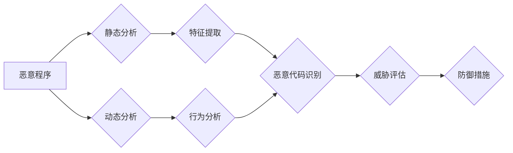

> 恶意程序，网络安全，反恶意软件，恶意代码分析，检测方法，机器学习，深度学习

## 1. 背景介绍

在当今数字化时代，网络安全已成为至关重要的议题。随着互联网的普及和网络技术的不断发展，恶意软件的种类和攻击手段也日益复杂化，给个人、企业和国家安全带来了严峻的挑战。恶意程序，也称为恶意软件，是指旨在损害计算机系统、窃取数据或干扰正常运行的软件程序。它们可以采取多种形式，包括病毒、蠕虫、木马、勒索软件和间谍软件等。

恶意程序的危害性不容忽视。它们可以导致数据泄露、系统崩溃、经济损失甚至国家安全威胁。因此，及时有效地分析和检测恶意程序至关重要，以保护网络安全和个人隐私。

## 2. 核心概念与联系

### 2.1 恶意程序分类

恶意程序的分类方法多种多样，常见的有：

* **按功能分类:** 
    * **病毒:** 自复制并传播到其他文件或系统，破坏数据或系统稳定性。
    * **蠕虫:** 利用网络漏洞自动传播，消耗网络资源或窃取数据。
    * **木马:** 伪装成合法软件，隐藏恶意功能，窃取数据或控制系统。
    * **勒索软件:** 加密用户数据，要求支付赎金才能解锁。
    * **间谍软件:** 窃取用户隐私信息，例如密码、银行卡号等。
* **按传播方式分类:**
    * **网络传播:** 通过电子邮件附件、恶意网站、网络漏洞等方式传播。
    * **物理传播:** 通过感染了恶意程序的存储设备或光盘等物理介质传播。
* **按目标系统分类:**
    * **桌面系统:** 针对个人电脑或笔记本电脑的恶意程序。
    * **服务器系统:** 针对服务器或网络设备的恶意程序。
    * **移动设备:** 针对智能手机或平板电脑的恶意程序。

### 2.2 恶意程序分析与检测

恶意程序分析与检测是网络安全领域的重要研究方向。其目标是识别、分析和阻止恶意程序的传播和执行。

**恶意程序分析**是指对恶意程序的结构、功能和行为进行深入研究，以了解其工作原理、攻击目标和潜在危害。

**恶意程序检测**是指利用各种技术手段，识别和隔离潜在的恶意程序。

### 2.3 相关技术

恶意程序分析与检测涉及多种相关技术，包括：

* **静态分析:** 对恶意程序的二进制代码进行分析，识别其功能和潜在威胁。
* **动态分析:** 在虚拟环境中运行恶意程序，观察其行为和交互，识别其攻击目标和恶意功能。
* **机器学习:** 利用机器学习算法，从恶意程序的特征中学习模式，识别新的恶意程序。
* **深度学习:** 利用深度神经网络，对恶意程序进行更深入的分析和识别。
* **网络流量分析:** 分析网络流量，识别异常行为和潜在的恶意活动。

**Mermaid 流程图**



## 3. 核心算法原理 & 具体操作步骤

### 3.1 算法原理概述

恶意程序检测算法通常基于以下原理：

* **特征提取:** 从恶意程序中提取特征，例如代码结构、函数调用、网络行为等。
* **分类模型:** 利用机器学习或深度学习算法，构建分类模型，将恶意程序和合法程序进行区分。
* **异常检测:** 识别网络流量或系统行为中的异常模式，例如频繁的网络连接、异常的进程创建等。

### 3.2 算法步骤详解

**基于机器学习的恶意程序检测算法步骤:**

1. **数据收集:** 收集大量恶意程序和合法程序样本。
2. **数据预处理:** 对数据进行清洗、转换和特征工程，提取特征向量。
3. **模型训练:** 利用机器学习算法，例如支持向量机、决策树、随机森林等，训练分类模型。
4. **模型评估:** 使用测试集评估模型的性能，例如准确率、召回率、F1-score等。
5. **模型部署:** 将训练好的模型部署到实际环境中，用于检测新的恶意程序。

**基于深度学习的恶意程序检测算法步骤:**

1. **数据收集:** 收集大量恶意程序和合法程序样本。
2. **数据预处理:** 对数据进行清洗、转换和特征工程，提取特征向量。
3. **模型构建:** 利用深度神经网络，例如卷积神经网络、循环神经网络等，构建模型。
4. **模型训练:** 利用训练数据训练深度学习模型。
5. **模型评估:** 使用测试集评估模型的性能。
6. **模型部署:** 将训练好的模型部署到实际环境中，用于检测新的恶意程序。

### 3.3 算法优缺点

**机器学习算法:**

* **优点:** 
    * 能够学习复杂的特征关系。
    * 训练速度相对较快。
* **缺点:** 
    * 对训练数据质量要求较高。
    * 难以处理新的恶意程序类型。

**深度学习算法:**

* **优点:** 
    * 能够学习更深层次的特征关系。
    * 对新的恶意程序类型具有更好的泛化能力。
* **缺点:** 
    * 训练时间较长。
    * 对计算资源要求较高。

### 3.4 算法应用领域

恶意程序检测算法广泛应用于以下领域:

* **个人电脑安全:** 防病毒软件、杀毒软件等。
* **企业网络安全:** 防火墙、入侵检测系统等。
* **移动设备安全:** 手机杀毒软件、应用商店安全检测等。
* **云计算安全:** 云平台安全检测、虚拟机安全等。

## 4. 数学模型和公式 & 详细讲解 & 举例说明

### 4.1 数学模型构建

恶意程序检测算法通常基于统计模型或机器学习模型。

**统计模型:**

例如，可以使用贝叶斯定理来计算恶意程序的概率。

$$P(恶意程序|特征) = \frac{P(特征|恶意程序) * P(恶意程序)}{P(特征)}$$

其中:

* $P(恶意程序|特征)$ 是给定特征条件下恶意程序的概率。
* $P(特征|恶意程序)$ 是给定恶意程序条件下特征出现的概率。
* $P(恶意程序)$ 是恶意程序出现的概率。
* $P(特征)$ 是特征出现的概率。

**机器学习模型:**

例如，可以使用支持向量机 (SVM) 来分类恶意程序和合法程序。SVM 试图找到一个超平面，将不同类别的样本分开。

### 4.2 公式推导过程

SVM 的目标函数是：

$$min_{w,b} \frac{1}{2} ||w||^2 + C \sum_{i=1}^{n} \xi_i$$

其中:

* $w$ 是权重向量。
* $b$ 是偏置项。
* $C$ 是惩罚参数。
* $\xi_i$ 是松弛变量，用于容忍分类错误。

### 4*3 案例分析与讲解

假设我们有一个数据集，包含 100 个恶意程序样本和 100 个合法程序样本。每个样本都包含 10 个特征。我们可以使用 SVM 算法训练一个分类模型，用于识别新的恶意程序。

在训练过程中，SVM 会找到一个超平面，将恶意程序和合法程序分开。然后，我们可以使用这个模型来预测新的样本是否为恶意程序。

## 5. 项目实践：代码实例和详细解释说明

### 5.1 开发环境搭建

* 操作系统: Ubuntu 20.04
* Python 版本: 3.8
* 必要的库: scikit-learn, numpy, pandas

### 5.2 源代码详细实现

```python
from sklearn.svm import SVC
from sklearn.model_selection import train_test_split
from sklearn.metrics import accuracy_score

# 加载数据
data = pd.read_csv("malware_data.csv")

# 分割特征和标签
X = data.drop("label", axis=1)
y = data["label"]

# 将数据分成训练集和测试集
X_train, X_test, y_train, y_test = train_test_split(X, y, test_size=0.2, random_state=42)

# 创建 SVM 模型
model = SVC(kernel="linear")

# 训练模型
model.fit(X_train, y_train)

# 预测测试集
y_pred = model.predict(X_test)

# 计算准确率
accuracy = accuracy_score(y_test, y_pred)
print(f"准确率: {accuracy}")
```

### 5.3 代码解读与分析

* 首先，我们加载恶意程序数据，并将数据分成特征和标签。
* 然后，我们将数据分成训练集和测试集。
* 接下来，我们创建 SVM 模型，并使用训练集训练模型。
* 最后，我们使用测试集预测标签，并计算模型的准确率。

### 5.4 运行结果展示

运行上述代码后，我们可以得到模型的准确率。

## 6. 实际应用场景

恶意程序检测算法在现实世界中应用广泛，例如:

* **个人电脑安全:** 防病毒软件、杀毒软件等使用恶意程序检测算法来识别和清除恶意程序。
* **企业网络安全:** 防火墙、入侵检测系统等使用恶意程序检测算法来识别和阻止恶意攻击。
* **移动设备安全:** 手机杀毒软件、应用商店安全检测等使用恶意程序检测算法来识别和阻止恶意应用程序。

### 6.4 未来应用展望

随着人工智能技术的不断发展，恶意程序检测算法将更加智能化、自动化和精准化。未来，恶意程序检测算法可能应用于以下领域:

* **主动防御:** 利用机器学习算法，预测和阻止新的恶意攻击。
* **行为分析:** 分析用户行为，识别异常行为，例如恶意软件的活动。
* **网络安全态势感知:** 利用恶意程序检测算法，构建网络安全态势感知系统，及时发现和应对网络安全威胁。

## 7. 工具和资源推荐

### 7.1 学习资源推荐

* **书籍:**
    * "Practical Malware Analysis" by Michael Sikorski and Andrew Honig
    * "Malware Analysis Cookbook" by Michael Sikorski and Andrew Honig
* **在线课程:**
    * Coursera: "Malware Analysis" by SANS Institute
    * Udemy: "Malware Analysis: A Practical Guide" by John Hammond

### 7.2 开发工具推荐

* **虚拟机:** VirtualBox, VMware Workstation
* **调试器:** GDB, IDA Pro
* **反汇编器:** IDA Pro, Ghidra
* **网络分析工具:** Wireshark, tcpdump

### 7.3 相关论文推荐

* "A Survey of Malware Detection Techniques" by S. Kumar et al.
* "Deep Learning for Malware Detection: A Survey" by Y. Wang et al.

## 8. 总结：未来发展趋势与挑战

### 8.1 研究成果总结

恶意程序检测算法取得了显著的进展，能够有效识别和阻止多种类型的恶意程序。

### 8.2 未来发展趋势

* **人工智能技术:** 利用深度学习等人工智能技术，提高恶意程序检测的准确性和效率。
* **行为分析:** 更加注重恶意程序的行为分析，识别更加隐蔽的恶意活动。
* **主动防御:** 利用机器学习算法，预测和阻止新的恶意攻击。

### 8.3 面临的挑战

* **恶意程序的不断演变:** 恶意程序开发人员不断开发新的恶意程序，挑战现有的检测算法。
* **数据获取和标注:** 恶意程序检测算法需要大量的训练数据，获取和标注这些数据是一个挑战。
* **计算资源:** 深度学习算法对计算资源要求较高，部署到实际环境中需要考虑