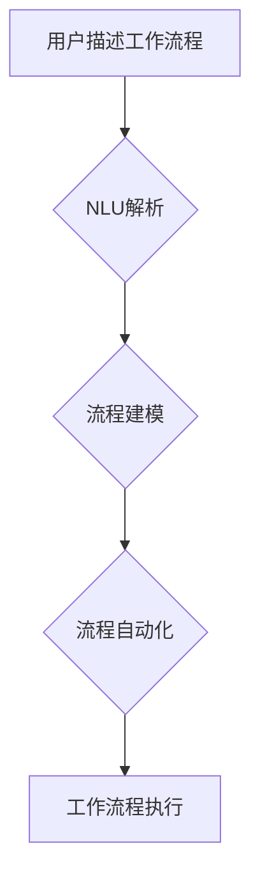

> 自然语言，工作流，人工智能，自动化，流程建模，低代码平台

## 1. 背景介绍

在当今数字化时代，工作流程自动化已成为企业提高效率、降低成本和增强竞争力的关键驱动力。传统的流程建模和自动化方法通常依赖于专业的技术人员和复杂的代码编写，这使得流程设计和部署变得繁琐且耗时。随着自然语言处理（NLP）技术的飞速发展，自然语言创建工作流的概念应运而生，它利用自然语言的优势，使非技术人员也能轻松地设计和管理工作流程。

## 2. 核心概念与联系

自然语言创建工作流的核心概念是将自然语言理解和生成技术应用于工作流程建模和自动化领域。它通过以下几个关键环节实现：

* **自然语言理解（NLU）：** 将用户用自然语言描述的工作流程需求转换为机器可理解的结构化数据。
* **工作流程建模：** 基于NLU解析的结果，自动生成相应的流程图或流程定义文件。
* **流程自动化：** 将自动生成的流程定义与现有系统和应用程序进行集成，实现流程的自动化执行。

**Mermaid 流程图：**



## 3. 核心算法原理 & 具体操作步骤

### 3.1  算法原理概述

自然语言创建工作流的核心算法主要包括：

* **实体识别：** 从自然语言文本中识别出关键实体，例如人员、角色、事件、时间等。
* **关系抽取：** 识别出实体之间的关系，例如“A负责B”，“C在D时间内完成E”。
* **意图识别：** 识别出用户描述工作流程的意图，例如创建新流程、修改现有流程、启动流程实例等。
* **流程模板匹配：** 将用户描述的工作流程与预定义的流程模板进行匹配，并根据匹配结果生成相应的流程定义。

### 3.2  算法步骤详解

1. **预处理：** 对用户输入的自然语言文本进行预处理，例如去除停用词、分词、词性标注等。
2. **实体识别：** 使用实体识别模型识别出文本中的关键实体。
3. **关系抽取：** 使用关系抽取模型识别出实体之间的关系。
4. **意图识别：** 使用意图识别模型识别出用户描述工作流程的意图。
5. **流程模板匹配：** 将识别出的实体、关系和意图与预定义的流程模板进行匹配，并根据匹配结果生成相应的流程定义。
6. **流程生成：** 将流程定义转换为机器可执行的格式，例如BPMN、JSON等。

### 3.3  算法优缺点

**优点：**

* **易用性：** 非技术人员也能使用自然语言描述工作流程需求。
* **灵活性：** 可以根据实际需求灵活地修改和调整工作流程。
* **效率：** 自动化流程建模和部署，提高工作效率。

**缺点：**

* **准确性：** 自然语言理解的准确性仍然存在挑战，可能导致流程定义不准确。
* **复杂度：** 处理复杂的工作流程可能需要更复杂的算法和模型。
* **可维护性：** 当业务需求发生变化时，需要对流程定义进行修改和维护。

### 3.4  算法应用领域

自然语言创建工作流的应用领域非常广泛，包括：

* **企业流程自动化：** 自动化审批流程、采购流程、销售流程等。
* **客户服务自动化：** 自动化客户咨询、投诉处理等。
* **IT运维自动化：** 自动化系统监控、故障处理等。
* **教育培训：** 自动化学习路径规划、知识点讲解等。

## 4. 数学模型和公式 & 详细讲解 & 举例说明

### 4.1  数学模型构建

自然语言创建工作流的数学模型可以基于概率论和统计学原理构建。例如，可以使用贝叶斯网络模型来表示实体、关系和意图之间的概率关系。

### 4.2  公式推导过程

假设我们有一个实体识别模型，它可以将文本中的每个词语预测为某个实体类型。我们可以使用以下公式来计算某个词语属于某个实体类型的概率：

$$P(实体类型|词语) = \frac{P(词语|实体类型) * P(实体类型)}{P(词语)}$$

其中：

* $P(实体类型|词语)$ 是词语属于某个实体类型的概率。
* $P(词语|实体类型)$ 是给定某个实体类型，词语出现的概率。
* $P(实体类型)$ 是实体类型的先验概率。
* $P(词语)$ 是词语出现的概率。

### 4.3  案例分析与讲解

例如，我们想要识别文本中的“张三”是否属于“人员”实体。我们可以根据训练数据计算出：

* $P(人员|张三)$：给定“张三”是人员的概率。
* $P(张三|人员)$：给定是人员，出现“张三”的概率。
* $P(人员)$：人员实体的先验概率。
* $P(张三)$： “张三”出现的概率。

将这些值代入公式，即可计算出“张三”属于“人员”实体的概率。

## 5. 项目实践：代码实例和详细解释说明

### 5.1  开发环境搭建

* Python 3.x
* TensorFlow 或 PyTorch
* NLTK 或 SpaCy

### 5.2  源代码详细实现

```python
import nltk
from nltk.tokenize import word_tokenize
from nltk.tag import pos_tag

# 下载 NLTK 数据集
nltk.download('punkt')
nltk.download('averaged_perceptron_tagger')

# 用户输入的自然语言文本
text = "张三负责完成项目A。"

# 词语分词
tokens = word_tokenize(text)

# 词性标注
pos_tags = pos_tag(tokens)

# 实体识别
# ...

# 流程建模
# ...

# 流程自动化
# ...
```

### 5.3  代码解读与分析

* 代码首先使用 NLTK 库对用户输入的自然语言文本进行词语分词和词性标注。
* 然后，可以使用预训练的实体识别模型或自定义训练模型来识别文本中的关键实体。
* 流程建模和自动化部分需要根据具体的业务需求和流程定义进行实现。

### 5.4  运行结果展示

运行上述代码后，可以得到以下结果：

* 词语列表：["张三", "负责", "完成", "项目", "A", "."]
* 词性列表： [('张三', 'NNP'), ('负责', 'VBZ'), ('完成', 'VB'), ('项目', 'NN'), ('A', 'NN'), ('.', '.')]
* 识别出的实体：张三（人员）, 项目A（项目）

## 6. 实际应用场景

### 6.1  企业流程自动化

自然语言创建工作流可以帮助企业自动化各种业务流程，例如：

* **审批流程：** 用户可以使用自然语言描述审批流程，例如“申请人提交申请，经部门经理审批后，由财务部门审核并最终批准”。系统会自动生成相应的审批流程，并根据流程规则自动执行审批任务。
* **采购流程：** 用户可以使用自然语言描述采购流程，例如“采购员提出采购需求，经部门负责人审批后，由采购部门进行采购并接收货物”。系统会自动生成相应的采购流程，并根据流程规则自动执行采购任务。

### 6.2  客户服务自动化

自然语言创建工作流可以帮助企业自动化客户服务流程，例如：

* **客户咨询：** 用户可以通过自然语言描述问题，系统会根据预定义的知识库自动提供解决方案。
* **投诉处理：** 用户可以通过自然语言描述投诉内容，系统会自动记录投诉信息并分配给相关人员处理。

### 6.3  IT运维自动化

自然语言创建工作流可以帮助企业自动化IT运维流程，例如：

* **系统监控：** 用户可以使用自然语言描述监控指标，系统会自动监控指标并发送告警信息。
* **故障处理：** 用户可以使用自然语言描述故障现象，系统会根据预定义的故障处理规则自动执行故障处理任务。

### 6.4  未来应用展望

随着自然语言处理技术的不断发展，自然语言创建工作流的应用场景将更加广泛，例如：

* **个性化流程定制：** 根据用户的个性化需求自动生成定制化的工作流程。
* **跨系统流程集成：** 将不同系统之间的流程进行集成，实现跨系统的数据共享和流程协同。
* **智能流程优化：** 利用机器学习算法分析工作流程数据，自动识别流程中的瓶颈和冗余环节，并提出优化建议。

## 7. 工具和资源推荐

### 7.1  学习资源推荐

* **书籍：**
    * 《自然语言处理》
    * 《深度学习》
* **在线课程：**
    * Coursera：自然语言处理
    * edX：深度学习
* **博客和论坛：**
    * NLP Stack Exchange
    * Hugging Face

### 7.2  开发工具推荐

* **自然语言处理库：**
    * NLTK
    * SpaCy
    * Gensim
* **机器学习框架：**
    * TensorFlow
    * PyTorch
* **流程建模工具：**
    * BPMN
    * Flowchart.js

### 7.3  相关论文推荐

* **BERT：预训练语言表示的改进**
* **GPT-3：训练30亿参数的语言模型**
* **Transformer：注意力机制的应用**

## 8. 总结：未来发展趋势与挑战

### 8.1  研究成果总结

自然语言创建工作流是一个新兴的领域，近年来取得了显著的进展。预训练语言模型的出现使得自然语言理解的准确性大幅提升，为自然语言创建工作流的发展提供了强有力的技术支撑。

### 8.2  未来发展趋势

未来，自然语言创建工作流的发展趋势包括：

* **更准确的自然语言理解：** 利用更先进的深度学习算法和预训练语言模型，提高自然语言理解的准确性和鲁棒性。
* **更智能的流程自动化：** 利用机器学习算法分析工作流程数据，自动识别流程中的瓶颈和冗余环节，并提出优化建议。
* **更广泛的应用场景：** 将自然语言创建工作流应用于更多领域，例如教育、医疗、金融等。

### 8.3  面临的挑战

自然语言创建工作流仍然面临一些挑战，例如：

* **复杂业务流程的建模：** 如何处理复杂业务流程，并将其准确地转换为机器可执行的格式。
* **数据安全和隐私保护：** 如何确保用户输入的数据安全和隐私保护。
* **可解释性和可维护性：** 如何提高自然语言创建工作流的透明度和可维护性。

### 8.4  研究展望

未来，我们需要继续深入研究自然语言理解、机器学习和流程建模等领域，开发更先进的自然语言创建工作流技术，并将其应用于更多领域，为企业和个人带来更大的价值。

## 9. 附录：常见问题与解答

**Q1：自然语言创建工作流与传统流程建模有什么区别？**

**A1：** 传统流程建模通常需要专业的技术人员使用专门的工具进行建模，而自然语言创建工作流则允许非技术人员使用自然语言描述工作流程需求，从而降低了流程建模的门槛。

**Q2：自然语言创建工作流的准确性如何？**

**A2：** 自然语言理解的准确性仍然存在挑战，但随着预训练语言模型的不断发展，自然语言创建工作流的准确性也在不断提高。

**Q3：自然语言创建工作流的安全性如何？**

**A3：** 自然语言创建工作流需要确保用户输入的数据安全和隐私保护。开发人员需要采取相应的安全措施，例如数据加密和访问控制，来保护用户数据。