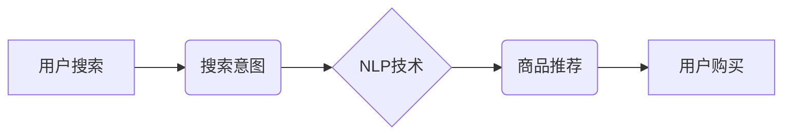

> 自然语言处理，搜索意图，电商推荐，机器学习，深度学习，BERT，Transformer

## 1. 背景介绍

在当今数字经济时代，电商平台已成为人们购物的首选方式。然而，面对海量的商品和复杂的搜索需求，精准推荐用户感兴趣的商品成为了电商平台发展的重要挑战。传统的基于关键词匹配的推荐算法难以准确理解用户搜索意图，导致推荐结果不精准，用户体验下降。

自然语言处理（NLP）技术作为一种能够理解和处理人类语言的技术，为电商精准推荐提供了新的思路。通过对用户搜索词语进行分析和理解，NLP算法可以挖掘用户潜在的搜索意图，并推荐更符合用户需求的商品。

## 2. 核心概念与联系

**2.1 搜索意图**

搜索意图是指用户在进行搜索时所想要获取的信息或完成的任务。例如，用户搜索“iPhone 13”，其搜索意图可能是：

* 了解iPhone 13的具体参数和配置
* 比较iPhone 13与其他手机的优缺点
* 寻找iPhone 13的购买链接

**2.2 自然语言处理（NLP）**

NLP是人工智能领域的一个分支，致力于使计算机能够理解、处理和生成人类语言。NLP技术涵盖了多种任务，例如：

* 词法分析：将文本分解成单词或短语
* 语法分析：分析文本的语法结构
* 句义分析：理解文本的语义含义
* 情感分析：识别文本中的情感倾向

**2.3 电商推荐系统**

电商推荐系统是指利用数据挖掘、机器学习等技术，根据用户的历史行为、偏好等信息，推荐用户感兴趣的商品的系统。

**2.4 核心概念关系图**



## 3. 核心算法原理 & 具体操作步骤

**3.1 算法原理概述**

为了准确解读用户搜索意图，电商平台通常采用以下几种核心算法：

* **关键词匹配:** 基于用户搜索词与商品标题、描述等信息的匹配度进行推荐。
* **协同过滤:** 根据用户历史购买行为和相似用户的购买行为进行推荐。
* **内容过滤:** 根据商品属性和用户偏好进行推荐。
* **深度学习:** 利用深度神经网络模型，例如BERT、Transformer等，对用户搜索词进行语义分析，挖掘用户潜在的搜索意图。

**3.2 算法步骤详解**

以深度学习算法为例，其具体操作步骤如下：

1. **数据预处理:** 收集用户搜索词、商品信息等数据，进行清洗、格式化等预处理操作。
2. **模型训练:** 利用深度学习模型，例如BERT、Transformer等，对预处理后的数据进行训练，学习用户搜索意图与商品关系的映射关系。
3. **模型评估:** 使用测试数据对训练好的模型进行评估，评估模型的准确率、召回率等指标。
4. **模型部署:** 将训练好的模型部署到电商平台，用于实时处理用户搜索请求，并进行商品推荐。

**3.3 算法优缺点**

**深度学习算法**

* **优点:** 能够准确理解用户搜索意图，推荐结果更精准。
* **缺点:** 需要大量的训练数据，训练成本较高。

**3.4 算法应用领域**

深度学习算法在电商推荐系统、搜索引擎、聊天机器人等领域都有广泛的应用。

## 4. 数学模型和公式 & 详细讲解 & 举例说明

**4.1 数学模型构建**

深度学习模型通常采用多层神经网络结构，每个神经元接收多个输入，并通过激活函数进行处理，输出到下一层神经元。

**4.2 公式推导过程**

深度学习模型的训练过程是通过反向传播算法进行的。反向传播算法的核心思想是通过计算损失函数的梯度，更新模型参数，使得模型的预测结果与真实值之间的误差最小化。

**4.3 案例分析与讲解**

例如，BERT模型的训练目标是最大化以下公式的值：

$$
\text{Maximize} \quad \sum_{i=1}^{N} \log P(w_i | context_i)
$$

其中，$w_i$ 是第 $i$ 个词，$context_i$ 是该词所在的上下文，$P(w_i | context_i)$ 是模型预测该词出现的概率。

## 5. 项目实践：代码实例和详细解释说明

**5.1 开发环境搭建**

* Python 3.6+
* TensorFlow/PyTorch
* CUDA/cuDNN

**5.2 源代码详细实现**

```python
# 使用BERT模型进行用户搜索意图识别
from transformers import BertTokenizer, BertModel

# 加载预训练的BERT模型
tokenizer = BertTokenizer.from_pretrained('bert-base-uncased')
model = BertModel.from_pretrained('bert-base-uncased')

# 用户搜索词
query = "iPhone 13"

# 对用户搜索词进行token化
input_ids = tokenizer.encode(query, add_special_tokens=True)

# 将token化后的输入送入BERT模型进行处理
outputs = model(input_ids)

# 从模型输出中提取特征向量
last_hidden_state = outputs.last_hidden_state

# 使用特征向量进行后续的意图识别任务
```

**5.3 代码解读与分析**

* 使用`transformers`库加载预训练的BERT模型和词典。
* 对用户搜索词进行token化，将文本转换为模型可理解的数字表示。
* 将token化后的输入送入BERT模型进行处理，得到每个词的特征向量。
* 从模型输出中提取特征向量，用于后续的意图识别任务。

**5.4 运行结果展示**

BERT模型的输出结果是一个包含每个词的特征向量的矩阵。这些特征向量可以用于训练分类模型，识别用户搜索的意图，例如：了解产品信息、比较产品、购买产品等。

## 6. 实际应用场景

**6.1 电商商品推荐**

* 根据用户的搜索词语，利用NLP算法识别用户的搜索意图，并推荐符合用户需求的商品。
* 个性化推荐：根据用户的历史购买行为、浏览记录等信息，进行个性化商品推荐。

**6.2 搜索引擎优化**

* 分析用户搜索词语的搜索意图，优化网站内容和关键词，提高网站在搜索引擎中的排名。
* 提供更精准的搜索结果，提升用户搜索体验。

**6.3 聊天机器人**

* 利用NLP算法，使聊天机器人能够理解用户的自然语言输入，并提供更自然、更人性化的回复。
* 自动回复常见问题，提高客服效率。

**6.4 未来应用展望**

* 更精准的搜索结果：利用更先进的NLP算法，例如Transformer、XLNet等，进一步提升搜索结果的精准度。
* 多模态搜索：结合文本、图像、音频等多模态数据，实现更全面的搜索体验。
* 个性化推荐：利用用户行为数据、兴趣偏好等信息，进行更个性化的商品推荐。

## 7. 工具和资源推荐

**7.1 学习资源推荐**

* **书籍:**
    * 《自然语言处理入门》
    * 《深度学习》
* **在线课程:**
    * Coursera: 自然语言处理
    * edX: 深度学习
* **开源库:**
    * TensorFlow
    * PyTorch
    * spaCy

**7.2 开发工具推荐**

* **IDE:** PyCharm, VS Code
* **数据处理工具:** Pandas, NumPy
* **可视化工具:** Matplotlib, Seaborn

**7.3 相关论文推荐**

* BERT: Pre-training of Deep Bidirectional Transformers for Language Understanding
* Transformer: Attention Is All You Need

## 8. 总结：未来发展趋势与挑战

**8.1 研究成果总结**

近年来，NLP技术取得了长足的进步，在电商推荐系统、搜索引擎、聊天机器人等领域取得了广泛应用。深度学习算法的应用，使得用户搜索意图识别更加精准，商品推荐更加个性化。

**8.2 未来发展趋势**

* 更先进的NLP算法：例如Transformer、XLNet等，能够更好地理解用户搜索意图，提升推荐效果。
* 多模态搜索：结合文本、图像、音频等多模态数据，实现更全面的搜索体验。
* 个性化推荐：利用用户行为数据、兴趣偏好等信息，进行更个性化的商品推荐。

**8.3 面临的挑战**

* 数据标注问题：深度学习算法需要大量的标注数据，数据标注成本较高。
* 模型解释性问题：深度学习模型的决策过程难以解释，难以理解模型是如何进行决策的。
* 隐私保护问题：用户数据在电商推荐系统中的使用，需要考虑用户隐私保护问题。

**8.4 研究展望**

未来，NLP技术将继续发展，在电商推荐系统等领域发挥更大的作用。研究者将继续探索更先进的NLP算法，解决数据标注问题、模型解释性问题和隐私保护问题，推动NLP技术向更智能、更安全的方向发展。

## 9. 附录：常见问题与解答

**9.1 如何选择合适的NLP算法？**

选择合适的NLP算法需要根据具体任务和数据特点进行选择。例如，对于文本分类任务，可以使用BERT、LSTM等算法；对于机器翻译任务，可以使用Transformer等算法。

**9.2 如何解决数据标注问题？**

数据标注是深度学习算法训练的重要环节，数据标注成本较高。可以考虑使用自动标注工具，或者利用众包平台进行数据标注。

**9.3 如何保证用户隐私保护？**

在电商推荐系统中使用用户数据，需要考虑用户隐私保护问题。可以采用数据脱敏技术，或者使用联邦学习等隐私保护技术。


作者：禅与计算机程序设计艺术 / Zen and the Art of Computer Programming 
<end_of_turn>