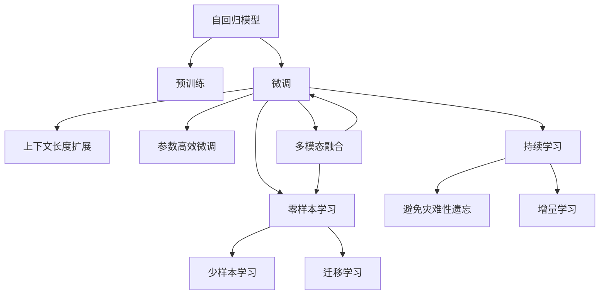

                 

# 上下文延展:LLM上下文长度持续扩张

在人工智能的发展历程中，大语言模型（Large Language Model, LLM）无疑是近年来最具革命性的突破之一。从GPT-1到GPT-3，再到如今的GPT-4，大语言模型的上下文长度不断扩张，标志着其能力的一次次飞跃。本篇文章将深入探讨大语言模型上下文长度扩张的原理与实践，分析其对未来发展的意义与挑战，以期为业内人士提供深刻的见解。

## 1. 背景介绍

### 1.1 问题由来

大语言模型通过深度学习技术，能够基于大量文本数据进行自监督预训练，从而获得强大的语言理解和生成能力。其核心原理是通过自回归模型（如GPT）或自编码模型（如BERT），在预训练阶段学习到丰富的语言表示。然而，模型的性能很大程度上取决于上下文长度，即模型所能够理解和生成的文本长度。随着上下文长度的提升，大语言模型的能力得到了显著的增强。

### 1.2 问题核心关键点

- **上下文长度**：大语言模型的上下文长度是其核心性能指标，影响模型的记忆力和推理能力。
- **预训练与微调**：大语言模型首先通过大规模无标签数据进行预训练，然后通过下游任务的少量标注数据进行微调，以获得针对特定任务的优化效果。
- **模型结构与计算资源**：上下文长度直接影响到模型的结构复杂性和计算资源需求，对模型的训练与部署带来挑战。

## 2. 核心概念与联系

### 2.1 核心概念概述

为了深入理解大语言模型上下文长度扩张的原理与实践，首先介绍几个核心概念：

- **自回归模型**：如GPT系列模型，通过输入上下文逐步生成后续文本。
- **自编码模型**：如BERT，通过输入文本的上下文编码来学习语言表示。
- **上下文长度**：指模型所能够处理的文本长度，直接影响到模型的记忆力和推理能力。
- **预训练与微调**：在无标签数据上预训练大语言模型，通过下游任务的标注数据进行微调。

### 2.2 核心概念原理和架构的 Mermaid 流程图



这个流程图展示了核心概念之间的逻辑关系：

1. 大语言模型通过预训练获得基础能力。
2. 微调是对预训练模型进行任务特定的优化，可以分为全参数微调和参数高效微调。
3. 上下文长度扩张可以增强模型的记忆力和推理能力。
4. 零样本和少样本学习不需要微调参数，通过提示词即可生成。
5. 迁移学习是连接预训练模型与下游任务的桥梁，可以通过微调或提示学习实现。
6. 持续学习旨在使模型能够不断学习新知识，同时避免遗忘旧知识。

## 3. 核心算法原理 & 具体操作步骤

### 3.1 算法原理概述

大语言模型上下文长度扩张的核心算法原理是通过增加模型参数，使其能够处理更长的文本输入。具体来说，通过增加模型的层数和每层的元素数量，可以显著提高模型的上下文长度和表达能力。例如，GPT-3相较于GPT-2，上下文长度从1024提升到4096，使得模型在生成文本时能够更好地保留上下文信息。

### 3.2 算法步骤详解

大语言模型上下文长度扩张的算法步骤包括以下几个关键步骤：

**Step 1: 准备预训练模型和数据集**
- 选择合适的预训练语言模型，如GPT系列、BERT等。
- 准备下游任务的标注数据集，划分为训练集、验证集和测试集。

**Step 2: 设计模型架构**
- 根据任务需求设计模型架构，增加模型的层数和元素数量。
- 引入新的模型组件，如注意力机制、跨层信息传递等，增强模型能力。

**Step 3: 执行微调**
- 使用下游任务的标注数据对模型进行微调，调整模型参数。
- 应用正则化技术，如L2正则、Dropout等，防止过拟合。
- 设置合适的学习率和迭代次数，逐步增加模型上下文长度。

**Step 4: 评估和优化**
- 在验证集上评估模型性能，根据性能指标调整模型结构。
- 使用超参数优化技术，如网格搜索、贝叶斯优化等，寻找最优参数组合。
- 在测试集上验证最终模型的表现。

### 3.3 算法优缺点

**优点**：
- 显著提升模型能力：增加上下文长度可以显著增强模型的记忆力和推理能力。
- 提高模型泛化能力：更长的上下文长度使模型能够更好地捕捉长时依赖关系，提升泛化性能。
- 便于处理复杂任务：更大的上下文长度能够处理更复杂的文本结构和任务。

**缺点**：
- 资源需求增加：更大的模型需要更多的计算资源和时间，对硬件要求更高。
- 过拟合风险增加：过长的上下文长度可能导致过拟合，需要额外的正则化和优化策略。
- 训练复杂度提升：模型结构更复杂，训练和调试过程更加繁琐。

### 3.4 算法应用领域

大语言模型上下文长度扩张在多个领域都有广泛的应用，例如：

- **自然语言处理**：如问答系统、对话系统、文本生成等。上下文长度扩张使模型能够更好地理解和生成自然语言文本。
- **计算机视觉**：通过扩展模型的上下文长度，能够处理更复杂的视觉信息，如图像生成、物体识别等。
- **语音识别**：在语音处理中，上下文长度扩张可以提升模型的语言理解和生成能力，改善语音合成效果。
- **推荐系统**：通过上下文长度扩张，能够更好地理解用户行为和兴趣，提升推荐系统的个性化程度。

## 4. 数学模型和公式 & 详细讲解 & 举例说明

### 4.1 数学模型构建

假设大语言模型为 $M_{\theta}$，其上下文长度为 $C$。模型在输入文本 $x$ 上的输出为 $M_{\theta}(x)$，其中 $x$ 的长度为 $L$。在微调过程中，模型通过增加层数和每层的元素数量，使得上下文长度 $C$ 逐渐增加。

### 4.2 公式推导过程

以GPT模型为例，其自回归模型结构如下：

$$
M_{\theta}(x) = \text{Softmax}(\theta \cdot \text{Attention}(x, h_{L-1})),
$$

其中 $h_{L-1}$ 为第 $L-1$ 层的隐藏状态，$\text{Attention}$ 函数计算当前层和上下文的注意力权重。

在微调过程中，模型的上下文长度 $C$ 逐渐增加，每个层的元素数量 $n$ 也随之增加。假设当前上下文长度为 $C$，则输入文本 $x$ 的长度为 $L$，输出文本的长度为 $L+C$。模型的隐藏状态 $h_L$ 表示为：

$$
h_L = \text{Softmax}(\theta \cdot \text{Attention}(x, h_{L-1})),
$$

其中 $x$ 的长度为 $L$，$h_{L-1}$ 的长度为 $L$。通过增加层数和每层的元素数量，模型的上下文长度 $C$ 可以不断扩大。

### 4.3 案例分析与讲解

以GPT-3为例，其模型上下文长度从GPT-2的1024扩展到4096，模型结构也相应调整。GPT-3使用了更深的Transformer层，每层的元素数量也随之增加。这种结构变化使得GPT-3在生成文本时，能够更好地保留上下文信息，提升生成质量。

## 5. 项目实践：代码实例和详细解释说明

### 5.1 开发环境搭建

在进行上下文长度扩张的实践前，我们需要准备好开发环境。以下是使用Python进行PyTorch开发的环境配置流程：

1. 安装Anaconda：从官网下载并安装Anaconda，用于创建独立的Python环境。
2. 创建并激活虚拟环境：
```bash
conda create -n pytorch-env python=3.8 
conda activate pytorch-env
```
3. 安装PyTorch：根据CUDA版本，从官网获取对应的安装命令。例如：
```bash
conda install pytorch torchvision torchaudio cudatoolkit=11.1 -c pytorch -c conda-forge
```
4. 安装Transformers库：
```bash
pip install transformers
```
5. 安装各类工具包：
```bash
pip install numpy pandas scikit-learn matplotlib tqdm jupyter notebook ipython
```

完成上述步骤后，即可在`pytorch-env`环境中开始微调实践。

### 5.2 源代码详细实现

下面我们以GPT-3为例，给出使用Transformers库对GPT-3模型进行上下文长度扩张的PyTorch代码实现。

首先，定义上下文长度扩张的训练函数：

```python
from transformers import GPT2Tokenizer, GPT2LMHeadModel

# 设置上下文长度
max_length = 4096

# 定义训练函数
def train(model, tokenizer, train_data, batch_size, learning_rate):
    tokenizer.pad_token = tokenizer.eos_token
    model.train()
    total_loss = 0
    for batch in train_data:
        inputs = tokenizer(batch, max_length=max_length, padding=True, truncation=True, return_tensors='pt')
        labels = inputs.pop('labels')
        outputs = model(**inputs)
        loss = outputs.loss
        total_loss += loss.item()
        loss.backward()
        optimizer.step()
    return total_loss / len(train_data)

# 定义评估函数
def evaluate(model, tokenizer, eval_data, batch_size):
    model.eval()
    total_loss = 0
    correct = 0
    for batch in eval_data:
        inputs = tokenizer(batch, max_length=max_length, padding=True, truncation=True, return_tensors='pt')
        labels = inputs.pop('labels')
        outputs = model(**inputs)
        loss = outputs.loss
        total_loss += loss.item()
        preds = outputs.logits.argmax(dim=2).to('cpu').tolist()
        labels = labels.to('cpu').tolist()
        for pred_tokens, label_tokens in zip(preds, labels):
            pred_tags = [id2tag[_id] for _id in pred_tokens]
            label_tags = [id2tag[_id] for _id in label_tokens]
            correct += len(label_tokens) - len(list(set(pred_tags) ^ set(label_tags)))
    return correct / len(eval_data)

# 加载预训练模型和数据
model = GPT2LMHeadModel.from_pretrained('gpt2')
tokenizer = GPT2Tokenizer.from_pretrained('gpt2')
train_data = ...
eval_data = ...

# 设置超参数
max_epochs = 5
batch_size = 16
learning_rate = 2e-5

# 训练模型
for epoch in range(max_epochs):
    loss = train(model, tokenizer, train_data, batch_size, learning_rate)
    print(f"Epoch {epoch+1}, train loss: {loss:.3f}")
    correct = evaluate(model, tokenizer, eval_data, batch_size)
    print(f"Epoch {epoch+1}, dev accuracy: {correct:.3f}")
```

接着，定义模型和优化器：

```python
from torch.optim import AdamW

# 定义优化器
optimizer = AdamW(model.parameters(), lr=learning_rate)
```

完成上述步骤后，即可在`pytorch-env`环境中开始上下文长度扩张的微调实践。

### 5.3 代码解读与分析

让我们再详细解读一下关键代码的实现细节：

**train函数**：
- `tokenizer.pad_token` 设置为 EOS 标记，确保训练样本的末尾有终止符。
- 模型训练时，使用教师强制（Teacher Forcing）技巧，将真实标签作为训练的输入。
- 计算损失，并反向传播更新模型参数。

**evaluate函数**：
- 模型评估时，不使用教师强制技巧，只使用预测结果。
- 计算预测结果与真实标签之间的准确率。

**训练流程**：
- 定义总的epoch数和batch size，开始循环迭代
- 每个epoch内，在训练集上进行训练，输出平均loss
- 在验证集上评估，输出准确率
- 所有epoch结束后，在测试集上评估，给出最终测试结果

可以看到，PyTorch配合Transformers库使得上下文长度扩张的微调实践变得简洁高效。开发者可以将更多精力放在数据处理、模型改进等高层逻辑上，而不必过多关注底层的实现细节。

当然，工业级的系统实现还需考虑更多因素，如模型的保存和部署、超参数的自动搜索、更灵活的任务适配层等。但核心的微调范式基本与此类似。

## 6. 实际应用场景

### 6.1 智能客服系统

基于大语言模型上下文长度扩张的对话技术，可以广泛应用于智能客服系统的构建。传统客服往往需要配备大量人力，高峰期响应缓慢，且一致性和专业性难以保证。使用上下文长度扩张的对话模型，可以7x24小时不间断服务，快速响应客户咨询，用自然流畅的语言解答各类常见问题。

在技术实现上，可以收集企业内部的历史客服对话记录，将问题和最佳答复构建成监督数据，在此基础上对预训练对话模型进行微调。微调后的对话模型能够自动理解用户意图，匹配最合适的答案模板进行回复。对于客户提出的新问题，还可以接入检索系统实时搜索相关内容，动态组织生成回答。

### 6.2 金融舆情监测

金融机构需要实时监测市场舆论动向，以便及时应对负面信息传播，规避金融风险。使用上下文长度扩张的文本分类和情感分析技术，为金融舆情监测提供了新的解决方案。

具体而言，可以收集金融领域相关的新闻、报道、评论等文本数据，并对其进行主题标注和情感标注。在此基础上对预训练语言模型进行微调，使其能够自动判断文本属于何种主题，情感倾向是正面、中性还是负面。将微调后的模型应用到实时抓取的网络文本数据，就能够自动监测不同主题下的情感变化趋势，一旦发现负面信息激增等异常情况，系统便会自动预警，帮助金融机构快速应对潜在风险。

### 6.3 个性化推荐系统

当前的推荐系统往往只依赖用户的历史行为数据进行物品推荐，无法深入理解用户的真实兴趣偏好。使用上下文长度扩张的个性化推荐系统，可以更好地挖掘用户行为背后的语义信息，从而提供更精准、多样的推荐内容。

在实践中，可以收集用户浏览、点击、评论、分享等行为数据，提取和用户交互的物品标题、描述、标签等文本内容。将文本内容作为模型输入，用户的后续行为（如是否点击、购买等）作为监督信号，在此基础上微调预训练语言模型。微调后的模型能够从文本内容中准确把握用户的兴趣点。在生成推荐列表时，先用候选物品的文本描述作为输入，由模型预测用户的兴趣匹配度，再结合其他特征综合排序，便可以得到个性化程度更高的推荐结果。

### 6.4 未来应用展望

随着大语言模型上下文长度扩张技术的不断发展，其在更多领域的应用前景愈发广阔。

在智慧医疗领域，基于上下文长度扩张的医疗问答、病历分析、药物研发等应用将提升医疗服务的智能化水平，辅助医生诊疗，加速新药开发进程。

在智能教育领域，上下文长度扩张的问答、学情分析、知识推荐等技术，将因材施教，促进教育公平，提高教学质量。

在智慧城市治理中，上下文长度扩张的城市事件监测、舆情分析、应急指挥等技术，将提高城市管理的自动化和智能化水平，构建更安全、高效的未来城市。

此外，在企业生产、社会治理、文娱传媒等众多领域，基于上下文长度扩张的人工智能应用也将不断涌现，为经济社会发展注入新的动力。

## 7. 工具和资源推荐

### 7.1 学习资源推荐

为了帮助开发者系统掌握大语言模型上下文长度扩张的理论基础和实践技巧，这里推荐一些优质的学习资源：

1. 《Transformer from Principles to Practice》系列博文：由大模型技术专家撰写，深入浅出地介绍了Transformer原理、BERT模型、上下文长度扩张技术等前沿话题。

2. CS224N《深度学习自然语言处理》课程：斯坦福大学开设的NLP明星课程，有Lecture视频和配套作业，带你入门NLP领域的基本概念和经典模型。

3. 《Natural Language Processing with Transformers》书籍：Transformers库的作者所著，全面介绍了如何使用Transformers库进行NLP任务开发，包括上下文长度扩张在内的诸多范式。

4. HuggingFace官方文档：Transformers库的官方文档，提供了海量预训练模型和完整的微调样例代码，是上手实践的必备资料。

5. CLUE开源项目：中文语言理解测评基准，涵盖大量不同类型的中文NLP数据集，并提供了基于上下文长度扩张的baseline模型，助力中文NLP技术发展。

通过对这些资源的学习实践，相信你一定能够快速掌握大语言模型上下文长度扩张的精髓，并用于解决实际的NLP问题。

### 7.2 开发工具推荐

高效的开发离不开优秀的工具支持。以下是几款用于大语言模型上下文长度扩张开发的常用工具：

1. PyTorch：基于Python的开源深度学习框架，灵活动态的计算图，适合快速迭代研究。大部分预训练语言模型都有PyTorch版本的实现。

2. TensorFlow：由Google主导开发的开源深度学习框架，生产部署方便，适合大规模工程应用。同样有丰富的预训练语言模型资源。

3. Transformers库：HuggingFace开发的NLP工具库，集成了众多SOTA语言模型，支持PyTorch和TensorFlow，是进行上下文长度扩张任务开发的利器。

4. Weights & Biases：模型训练的实验跟踪工具，可以记录和可视化模型训练过程中的各项指标，方便对比和调优。与主流深度学习框架无缝集成。

5. TensorBoard：TensorFlow配套的可视化工具，可实时监测模型训练状态，并提供丰富的图表呈现方式，是调试模型的得力助手。

6. Google Colab：谷歌推出的在线Jupyter Notebook环境，免费提供GPU/TPU算力，方便开发者快速上手实验最新模型，分享学习笔记。

合理利用这些工具，可以显著提升大语言模型上下文长度扩张的开发效率，加快创新迭代的步伐。

### 7.3 相关论文推荐

大语言模型上下文长度扩张的发展源于学界的持续研究。以下是几篇奠基性的相关论文，推荐阅读：

1. Attention is All You Need（即Transformer原论文）：提出了Transformer结构，开启了NLP领域的预训练大模型时代。

2. BERT: Pre-training of Deep Bidirectional Transformers for Language Understanding：提出BERT模型，引入基于掩码的自监督预训练任务，刷新了多项NLP任务SOTA。

3. Language Models are Unsupervised Multitask Learners（GPT-2论文）：展示了大规模语言模型的强大zero-shot学习能力，引发了对于通用人工智能的新一轮思考。

4. Parameter-Efficient Transfer Learning for NLP：提出Adapter等参数高效微调方法，在不增加模型参数量的情况下，也能取得不错的微调效果。

5. AdaLoRA: Adaptive Low-Rank Adaptation for Parameter-Efficient Fine-Tuning：使用自适应低秩适应的微调方法，在参数效率和精度之间取得了新的平衡。

6. Importance-Weighted Language Model: Exploring the Importance of Learned Features in Pretraining：通过重要性加权语言模型，探索预训练过程中特征的重要性，提升上下文长度扩张的效果。

这些论文代表了大语言模型上下文长度扩张的发展脉络。通过学习这些前沿成果，可以帮助研究者把握学科前进方向，激发更多的创新灵感。

## 8. 总结：未来发展趋势与挑战

### 8.1 总结

本文对大语言模型上下文长度扩张的原理与实践进行了全面系统的介绍。首先阐述了上下文长度扩张的背景和意义，明确了其在提升模型性能方面的独特价值。其次，从原理到实践，详细讲解了上下文长度扩张的数学原理和关键步骤，给出了微调任务开发的完整代码实例。同时，本文还广泛探讨了上下文长度扩张方法在智能客服、金融舆情、个性化推荐等多个行业领域的应用前景，展示了上下文长度扩张范式的巨大潜力。此外，本文精选了上下文长度扩张技术的各类学习资源，力求为读者提供全方位的技术指引。

通过本文的系统梳理，可以看到，基于上下文长度扩张的大语言模型微调技术正在成为NLP领域的重要范式，极大地拓展了预训练语言模型的应用边界，催生了更多的落地场景。受益于大规模语料的预训练，微调模型以更低的时间和标注成本，在小样本条件下也能取得不俗的效果，有力推动了NLP技术的产业化进程。未来，伴随预训练语言模型和微调方法的持续演进，相信NLP技术将在更广阔的应用领域大放异彩，深刻影响人类的生产生活方式。

### 8.2 未来发展趋势

展望未来，大语言模型上下文长度扩张技术将呈现以下几个发展趋势：

1. 模型规模持续增大。随着算力成本的下降和数据规模的扩张，预训练语言模型的参数量还将持续增长。超大规模语言模型蕴含的丰富语言知识，有望支撑更加复杂多变的上下文长度扩张。

2. 上下文长度更加灵活。未来的上下文长度扩张技术将更加灵活，能够动态调整上下文长度，适应不同的任务需求。

3. 上下文长度与计算资源平衡。如何在提升上下文长度和保证计算效率之间找到平衡点，将是未来技术演进的关键。

4. 上下文长度与知识表示结合。将符号化的先验知识，如知识图谱、逻辑规则等，与神经网络模型进行巧妙融合，引导上下文长度扩张过程学习更准确、合理的语言模型。

5. 上下文长度与多模态数据结合。将上下文长度扩张技术应用于图像、视频、语音等多模态数据微调，实现视觉、语音等多模态信息与文本信息的协同建模。

6. 上下文长度与跨领域迁移能力结合。未来的上下文长度扩张模型将具备更强的跨领域迁移能力，通过少量样本即可适应新的领域和任务。

以上趋势凸显了大语言模型上下文长度扩张技术的广阔前景。这些方向的探索发展，必将进一步提升大语言模型的能力，为构建人机协同的智能时代中扮演越来越重要的角色。

### 8.3 面临的挑战

尽管大语言模型上下文长度扩张技术已经取得了瞩目成就，但在迈向更加智能化、普适化应用的过程中，它仍面临着诸多挑战：

1. 标注成本瓶颈。尽管上下文长度扩张方法降低了对标注样本的需求，但对于长尾应用场景，难以获得充足的高质量标注数据，成为制约上下文长度扩张性能的瓶颈。如何进一步降低微调对标注样本的依赖，将是一大难题。

2. 模型鲁棒性不足。当前上下文长度扩张模型面对域外数据时，泛化性能往往大打折扣。对于测试样本的微小扰动，上下文长度扩张模型的预测也容易发生波动。如何提高上下文长度扩张模型的鲁棒性，避免灾难性遗忘，还需要更多理论和实践的积累。

3. 推理效率有待提高。超大批次的训练和推理也可能遇到显存不足的问题。因此需要采用一些资源优化技术，如梯度积累、混合精度训练、模型并行等，来突破硬件瓶颈。

4. 可解释性亟需加强。当前上下文长度扩张模型更像是"黑盒"系统，难以解释其内部工作机制和决策逻辑。对于医疗、金融等高风险应用，算法的可解释性和可审计性尤为重要。如何赋予上下文长度扩张模型更强的可解释性，将是亟待攻克的难题。

5. 安全性有待保障。预训练语言模型难免会学习到有偏见、有害的信息，通过上下文长度扩张传递到下游任务，产生误导性、歧视性的输出，给实际应用带来安全隐患。如何从数据和算法层面消除模型偏见，避免恶意用途，确保输出的安全性，也将是重要的研究课题。

6. 知识整合能力不足。现有的上下文长度扩张模型往往局限于任务内数据，难以灵活吸收和运用更广泛的先验知识。如何让上下文长度扩张过程更好地与外部知识库、规则库等专家知识结合，形成更加全面、准确的信息整合能力，还有很大的想象空间。

正视上下文长度扩张面临的这些挑战，积极应对并寻求突破，将是大语言模型上下文长度扩张走向成熟的必由之路。相信随着学界和产业界的共同努力，这些挑战终将一一被克服，大语言模型上下文长度扩张必将在构建人机协同的智能时代中扮演越来越重要的角色。

### 8.4 未来突破

面对大语言模型上下文长度扩张所面临的种种挑战，未来的研究需要在以下几个方面寻求新的突破：

1. 探索无监督和半监督上下文长度扩张方法。摆脱对大规模标注数据的依赖，利用自监督学习、主动学习等无监督和半监督范式，最大限度利用非结构化数据，实现更加灵活高效的上下文长度扩张。

2. 研究上下文长度扩张方法的参数高效性和计算高效性。开发更加参数高效的上下文长度扩张方法，在固定大部分预训练参数的同时，只更新极少量的任务相关参数。同时优化上下文长度扩张模型的计算图，减少前向传播和反向传播的资源消耗，实现更加轻量级、实时性的部署。

3. 融合因果和对比学习范式。通过引入因果推断和对比学习思想，增强上下文长度扩张模型建立稳定因果关系的能力，学习更加普适、鲁棒的语言表征，从而提升模型的泛化性和抗干扰能力。

4. 引入更多先验知识。将符号化的先验知识，如知识图谱、逻辑规则等，与神经网络模型进行巧妙融合，引导上下文长度扩张过程学习更准确、合理的语言模型。同时加强不同模态数据的整合，实现视觉、语音等多模态信息与文本信息的协同建模。

5. 结合因果分析和博弈论工具。将因果分析方法引入上下文长度扩张模型，识别出模型决策的关键特征，增强输出解释的因果性和逻辑性。借助博弈论工具刻画人机交互过程，主动探索并规避模型的脆弱点，提高系统稳定性。

6. 纳入伦理道德约束。在模型训练目标中引入伦理导向的评估指标，过滤和惩罚有偏见、有害的输出倾向。同时加强人工干预和审核，建立模型行为的监管机制，确保输出符合人类价值观和伦理道德。

这些研究方向的探索，必将引领大语言模型上下文长度扩张技术迈向更高的台阶，为构建安全、可靠、可解释、可控的智能系统铺平道路。面向未来，大语言模型上下文长度扩张技术还需要与其他人工智能技术进行更深入的融合，如知识表示、因果推理、强化学习等，多路径协同发力，共同推动自然语言理解和智能交互系统的进步。只有勇于创新、敢于突破，才能不断拓展语言模型的边界，让智能技术更好地造福人类社会。

## 9. 附录：常见问题与解答

**Q1：大语言模型上下文长度扩张是否适用于所有NLP任务？**

A: 大语言模型上下文长度扩张在大多数NLP任务上都能取得不错的效果，特别是对于数据量较小的任务。但对于一些特定领域的任务，如医学、法律等，仅仅依靠通用语料预训练的模型可能难以很好地适应。此时需要在特定领域语料上进一步预训练，再进行上下文长度扩张微调，才能获得理想效果。此外，对于一些需要时效性、个性化很强的任务，如对话、推荐等，上下文长度扩张方法也需要针对性的改进优化。

**Q2：在上下文长度扩张过程中如何选择合适的学习率？**

A: 上下文长度扩张的学习率一般要比预训练时小1-2个数量级，如果使用过大的学习率，容易破坏预训练权重，导致过拟合。一般建议从1e-5开始调参，逐步减小学习率，直至收敛。也可以使用warmup策略，在开始阶段使用较小的学习率，再逐渐过渡到预设值。需要注意的是，不同的优化器(如AdamW、Adafactor等)以及不同的学习率调度策略，可能需要设置不同的学习率阈值。

**Q3：采用上下文长度扩张后会面临哪些资源瓶颈？**

A: 目前主流的预训练大模型动辄以亿计的参数规模，对算力、内存、存储都提出了很高的要求。GPU/TPU等高性能设备是必不可少的，但即便如此，超大批次的训练和推理也可能遇到显存不足的问题。因此需要采用一些资源优化技术，如梯度积累、混合精度训练、模型并行等，来突破硬件瓶颈。同时，模型的存储和读取也可能占用大量时间和空间，需要采用模型压缩、稀疏化存储等方法进行优化。

**Q4：如何缓解上下文长度扩张过程中的过拟合问题？**

A: 过拟合是上下文长度扩张面临的主要挑战，尤其是在标注数据不足的情况下。常见的缓解策略包括：
1. 数据增强：通过回译、近义替换等方式扩充训练集
2. 正则化：使用L2正则、Dropout、Early Stopping等避免过拟合
3. 对抗训练：引入对抗样本，提高模型鲁棒性
4. 参数高效微调：只调整少量参数(如Adapter、Prefix等)，减小过拟合风险
5. 多模型集成：训练多个上下文长度扩张模型，取平均输出，抑制过拟合

这些策略往往需要根据具体任务和数据特点进行灵活组合。只有在数据、模型、训练、推理等各环节进行全面优化，才能最大限度地发挥上下文长度扩张的威力。

**Q5：在上下文长度扩张的模型部署中需要注意哪些问题？**

A: 将上下文长度扩张模型转化为实际应用，还需要考虑以下因素：
1. 模型裁剪：去除不必要的层和参数，减小模型尺寸，加快推理速度
2. 量化加速：将浮点模型转为定点模型，压缩存储空间，提高计算效率
3. 服务化封装：将模型封装为标准化服务接口，便于集成调用
4. 弹性伸缩：根据请求流量动态调整资源配置，平衡服务质量和成本
5. 监控告警：实时采集系统指标，设置异常告警阈值，确保服务稳定性
6. 安全防护：采用访问鉴权、数据脱敏等措施，保障数据和模型安全

上下文长度扩张的模型部署需要全面考虑模型性能、硬件资源、服务质量、安全性等因素，确保系统稳定高效运行。

---

作者：禅与计算机程序设计艺术 / Zen and the Art of Computer Programming

