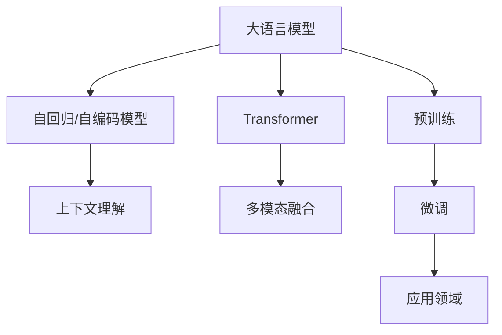

                 

# 上下文理解：LLM 捕捉微妙的语义

## 1. 背景介绍

在人工智能领域，自然语言处理(NLP)是最具挑战性、应用最广泛的分支之一。其中，语言模型作为理解和生成自然语言的基础，长期以来一直是NLP研究的焦点。而在大模型(Large Language Model, LLM)的引领下，语言模型的能力已经取得了跨越式的发展，可以处理大规模文本数据，捕获丰富的语言知识。

大模型通常基于自回归(如GPT)或自编码(如BERT)架构进行预训练，学习到了广泛的语义知识。然而，大模型不仅仅是一个强大的"记忆器"，它更是一个复杂的"推理器"，能够在上下文中捕捉微妙的语义信息。本文章将从上下文理解的角度，深入探讨大模型如何捕获微妙的语义，以及其在实际应用中的关键作用。

## 2. 核心概念与联系

### 2.1 核心概念概述

在深入探讨大模型的上下文理解能力前，首先需要明确几个关键概念：

- **上下文理解(Context Understanding)**：指模型在处理文本时，能够基于前面的文本内容推断出后续文本的意义。对于自然语言处理而言，上下文理解是决定模型能否准确理解和生成语言的核心。

- **语言模型(Language Model)**：能够基于给定前面的文本内容，预测下一个可能出现的词汇或符号的模型。大语言模型通过大规模无标签数据的预训练，学习到了语言的基本规则和概率分布。

- **自回归模型(Autoregressive Model)**：如GPT系列模型，依赖于前文的历史信息，逐词预测后续文本的生成概率。

- **自编码模型(Autoencoder Model)**：如BERT模型，通过缺失重建(missing token prediction)来学习语言表征。

- **Transformer**：作为大模型的核心架构，Transformer模型引入了注意力机制，能够处理长距离依赖，提升了模型的并行计算能力。

这些概念之间的联系可以通过以下Mermaid流程图来展示：



## 3. 核心算法原理 & 具体操作步骤

### 3.1 算法原理概述

大模型的上下文理解能力主要基于以下原理：

- **自回归或自编码预训练**：通过大规模无标签文本的预训练，大模型学习到了丰富的语言知识，能够在给定上下文中进行语言预测。

- **Transformer架构**：Transformer模型的注意力机制能够捕捉长距离依赖，使其在处理长文本时表现出色。

- **语言模型预测概率**：大模型通过语言模型预测，能够根据上下文推断出下一个词汇的概率分布，从而捕捉微妙的语义信息。

- **上下文编码器**：模型中通常包含上下文编码器，能够根据上下文信息，生成丰富的语义表示。

### 3.2 算法步骤详解

大模型的上下文理解能力主要通过以下步骤实现：

1. **预训练阶段**：使用大规模无标签文本数据，通过自回归或自编码模型进行预训练，学习到语言的基本规则和统计分布。

2. **上下文编码器**：在模型的顶层，增加上下文编码器，能够根据上下文信息生成丰富的语义表示。

3. **微调阶段**：针对具体任务，使用少量标注数据进行微调，优化模型在该任务上的性能。

4. **推理过程**：在输入新的文本时，大模型根据前面的文本信息推断出后续文本的意义，生成相应的输出。

### 3.3 算法优缺点

大模型的上下文理解能力具有以下优点：

- **灵活性**：能够处理任意长度的文本，适用于各种NLP任务。
- **鲁棒性**：通过预训练学习到丰富的语言知识，模型鲁棒性更强。
- **可扩展性**：模型可以不断扩展和优化，适应新领域和新任务。

同时，也存在以下缺点：

- **计算资源需求高**：大模型参数量庞大，需要高性能计算资源进行训练和推理。
- **对标注数据依赖**：微调依赖标注数据，标注数据质量直接影响模型性能。
- **过拟合风险**：模型复杂度高，容易在标注数据不足时出现过拟合现象。
- **推理速度慢**：大模型推理速度较慢，适用于对实时性要求不高的场景。

### 3.4 算法应用领域

大模型的上下文理解能力在多个领域得到了广泛应用，例如：

- **问答系统**：能够根据用户问题，推断出答案的上下文信息，生成精确的回答。
- **机器翻译**：通过上下文理解，能够准确翻译不同语言间的句子。
- **摘要生成**：能够根据输入文本，生成精炼的摘要。
- **对话系统**：能够根据对话历史，生成符合上下文语境的回答。
- **情感分析**：能够根据上下文信息，准确判断文本的情感倾向。

这些应用展示了大模型上下文理解能力的强大潜力，为NLP技术落地提供了新的可能。

## 4. 数学模型和公式 & 详细讲解 & 举例说明

### 4.1 数学模型构建

大模型的上下文理解能力主要通过以下几个数学模型进行刻画：

- **自回归语言模型**：通过计算给定上下文条件下下一个词汇的概率分布，学习到语言的基本统计分布。

- **自编码语言模型**：通过缺失重建(missing token prediction)，学习到词汇之间的关联关系，生成丰富的语义表示。

### 4.2 公式推导过程

以自回归语言模型为例，推导其上下文理解能力的数学模型：

- **上下文编码器**：
  $$
  h(x)=\text{Encoder}(x; \theta_{\text{encoder}})
  $$
  其中 $h(x)$ 表示上下文编码器的输出，$x$ 为输入文本，$\theta_{\text{encoder}}$ 为上下文编码器的参数。

- **语言模型预测**：
  $$
  p(y|x)=\frac{\exp(-\sum_{i=1}^{n} \log p(y_i|h(x); \theta)}{\sum_{y'} \exp(-\sum_{i=1}^{n} \log p(y'_i|h(x); \theta)}
  $$
  其中 $y=\{y_1, y_2, \ldots, y_n\}$ 为待预测的词汇序列，$n$ 为序列长度，$h(x)$ 为上下文编码器输出，$\theta$ 为模型参数。

### 4.3 案例分析与讲解

以情感分析任务为例，分析大模型如何进行上下文理解：

- **任务定义**：给定一段文本，判断其情感倾向是正面、负面或中性。
- **上下文理解过程**：模型首先通过预训练学习到语言的基本统计分布，然后在微调阶段针对情感分析任务进行优化。
- **预测过程**：在输入新文本时，模型根据前面的文本信息，生成情感倾向的概率分布，最终输出情感分类结果。

## 5. 项目实践：代码实例和详细解释说明

### 5.1 开发环境搭建

进行大模型上下文理解能力实践前，首先需要准备好开发环境。以下是使用Python进行PyTorch开发的环境配置流程：

1. 安装Anaconda：从官网下载并安装Anaconda，用于创建独立的Python环境。

2. 创建并激活虚拟环境：
```bash
conda create -n pytorch-env python=3.8 
conda activate pytorch-env
```

3. 安装PyTorch：根据CUDA版本，从官网获取对应的安装命令。例如：
```bash
conda install pytorch torchvision torchaudio cudatoolkit=11.1 -c pytorch -c conda-forge
```

4. 安装Transformer库：
```bash
pip install transformers
```

5. 安装各类工具包：
```bash
pip install numpy pandas scikit-learn matplotlib tqdm jupyter notebook ipython
```

完成上述步骤后，即可在`pytorch-env`环境中开始项目实践。

### 5.2 源代码详细实现

下面我们以情感分析任务为例，给出使用Transformers库对BERT模型进行微调的PyTorch代码实现。

首先，定义情感分析任务的数据处理函数：

```python
from transformers import BertTokenizer
from torch.utils.data import Dataset
import torch

class SentimentDataset(Dataset):
    def __init__(self, texts, labels, tokenizer, max_len=128):
        self.texts = texts
        self.labels = labels
        self.tokenizer = tokenizer
        self.max_len = max_len
        
    def __len__(self):
        return len(self.texts)
    
    def __getitem__(self, item):
        text = self.texts[item]
        label = self.labels[item]
        
        encoding = self.tokenizer(text, return_tensors='pt', max_length=self.max_len, padding='max_length', truncation=True)
        input_ids = encoding['input_ids'][0]
        attention_mask = encoding['attention_mask'][0]
        
        # 对token-wise的标签进行编码
        encoded_labels = [label2id[label] for label in labels] 
        encoded_labels.extend([label2id['O']] * (self.max_len - len(encoded_labels)))
        labels = torch.tensor(encoded_labels, dtype=torch.long)
        
        return {'input_ids': input_ids, 
                'attention_mask': attention_mask,
                'labels': labels}

# 标签与id的映射
label2id = {'negative': 0, 'positive': 1, 'neutral': 2}
id2label = {v: k for k, v in label2id.items()}

# 创建dataset
tokenizer = BertTokenizer.from_pretrained('bert-base-cased')

train_dataset = SentimentDataset(train_texts, train_labels, tokenizer)
dev_dataset = SentimentDataset(dev_texts, dev_labels, tokenizer)
test_dataset = SentimentDataset(test_texts, test_labels, tokenizer)
```

然后，定义模型和优化器：

```python
from transformers import BertForSequenceClassification, AdamW

model = BertForSequenceClassification.from_pretrained('bert-base-cased', num_labels=len(label2id))

optimizer = AdamW(model.parameters(), lr=2e-5)
```

接着，定义训练和评估函数：

```python
from torch.utils.data import DataLoader
from tqdm import tqdm
from sklearn.metrics import classification_report

device = torch.device('cuda') if torch.cuda.is_available() else torch.device('cpu')
model.to(device)

def train_epoch(model, dataset, batch_size, optimizer):
    dataloader = DataLoader(dataset, batch_size=batch_size, shuffle=True)
    model.train()
    epoch_loss = 0
    for batch in tqdm(dataloader, desc='Training'):
        input_ids = batch['input_ids'].to(device)
        attention_mask = batch['attention_mask'].to(device)
        labels = batch['labels'].to(device)
        model.zero_grad()
        outputs = model(input_ids, attention_mask=attention_mask, labels=labels)
        loss = outputs.loss
        epoch_loss += loss.item()
        loss.backward()
        optimizer.step()
    return epoch_loss / len(dataloader)

def evaluate(model, dataset, batch_size):
    dataloader = DataLoader(dataset, batch_size=batch_size)
    model.eval()
    preds, labels = [], []
    with torch.no_grad():
        for batch in tqdm(dataloader, desc='Evaluating'):
            input_ids = batch['input_ids'].to(device)
            attention_mask = batch['attention_mask'].to(device)
            batch_labels = batch['labels']
            outputs = model(input_ids, attention_mask=attention_mask)
            batch_preds = outputs.logits.argmax(dim=1).to('cpu').tolist()
            batch_labels = batch_labels.to('cpu').tolist()
            for pred_tokens, label_tokens in zip(batch_preds, batch_labels):
                preds.append(pred_tokens[:len(label_tokens)])
                labels.append(label_tokens)
                
    print(classification_report(labels, preds))
```

最后，启动训练流程并在测试集上评估：

```python
epochs = 5
batch_size = 16

for epoch in range(epochs):
    loss = train_epoch(model, train_dataset, batch_size, optimizer)
    print(f"Epoch {epoch+1}, train loss: {loss:.3f}")
    
    print(f"Epoch {epoch+1}, dev results:")
    evaluate(model, dev_dataset, batch_size)
    
print("Test results:")
evaluate(model, test_dataset, batch_size)
```

以上就是使用PyTorch对BERT进行情感分析任务微调的完整代码实现。可以看到，得益于Transformers库的强大封装，我们可以用相对简洁的代码完成BERT模型的加载和微调。

### 5.3 代码解读与分析

让我们再详细解读一下关键代码的实现细节：

**SentimentDataset类**：
- `__init__`方法：初始化文本、标签、分词器等关键组件。
- `__len__`方法：返回数据集的样本数量。
- `__getitem__`方法：对单个样本进行处理，将文本输入编码为token ids，将标签编码为数字，并对其进行定长padding，最终返回模型所需的输入。

**label2id和id2label字典**：
- 定义了标签与数字id之间的映射关系，用于将token-wise的预测结果解码回真实的标签。

**训练和评估函数**：
- 使用PyTorch的DataLoader对数据集进行批次化加载，供模型训练和推理使用。
- 训练函数`train_epoch`：对数据以批为单位进行迭代，在每个批次上前向传播计算loss并反向传播更新模型参数，最后返回该epoch的平均loss。
- 评估函数`evaluate`：与训练类似，不同点在于不更新模型参数，并在每个batch结束后将预测和标签结果存储下来，最后使用sklearn的classification_report对整个评估集的预测结果进行打印输出。

**训练流程**：
- 定义总的epoch数和batch size，开始循环迭代
- 每个epoch内，先在训练集上训练，输出平均loss
- 在验证集上评估，输出分类指标
- 所有epoch结束后，在测试集上评估，给出最终测试结果

可以看到，PyTorch配合Transformers库使得BERT微调的代码实现变得简洁高效。开发者可以将更多精力放在数据处理、模型改进等高层逻辑上，而不必过多关注底层的实现细节。

当然，工业级的系统实现还需考虑更多因素，如模型的保存和部署、超参数的自动搜索、更灵活的任务适配层等。但核心的微调范式基本与此类似。

## 6. 实际应用场景

### 6.1 情感分析

情感分析是大模型上下文理解能力的典型应用之一。通过对文本进行情感分析，企业可以了解消费者对产品的满意度和情感倾向，为市场营销、产品改进提供数据支持。

在技术实现上，可以收集社交媒体、评论、客户反馈等文本数据，对其进行情感标注。将标注数据作为监督数据，对预训练模型进行微调。微调后的模型能够自动分析新文本的情感倾向，帮助企业快速了解用户反馈，调整市场营销策略。

### 6.2 文本分类

文本分类是将文本自动分类到预定义的类别中的任务。在大模型的上下文理解能力下，文本分类任务可以更精准地识别不同类别的文本，提升分类的准确性和效率。

在实践中，可以收集大量的新闻、评论、用户帖子等文本数据，并对其进行分类标注。将标注数据作为监督数据，对预训练模型进行微调。微调后的模型能够自动将新的文本分类到相应的类别中，为新闻推荐、广告过滤、内容审核等场景提供支撑。

### 6.3 机器翻译

机器翻译是将一种语言的文本自动翻译成另一种语言的任务。大模型的上下文理解能力使其在机器翻译中表现出色，能够捕捉文本中的微妙语义，生成更准确的翻译结果。

在实践中，可以收集双语对照语料，对其进行翻译标注。将标注数据作为监督数据，对预训练模型进行微调。微调后的模型能够自动将源语言文本翻译成目标语言，提升翻译的流畅度和准确性。

### 6.4 未来应用展望

随着大模型上下文理解能力的不断发展，其在更多领域将得到应用，为传统行业带来变革性影响。

在智慧医疗领域，基于上下文理解的大模型可以用于医疗问答、病历分析、知识图谱构建等场景，提升医疗服务的智能化水平，辅助医生诊疗，加速新药开发进程。

在智能教育领域，微调技术可应用于作业批改、学情分析、知识推荐等方面，因材施教，促进教育公平，提高教学质量。

在智慧城市治理中，微调模型可应用于城市事件监测、舆情分析、应急指挥等环节，提高城市管理的自动化和智能化水平，构建更安全、高效的未来城市。

此外，在企业生产、社会治理、文娱传媒等众多领域，基于大模型上下文理解能力的人工智能应用也将不断涌现，为经济社会发展注入新的动力。相信随着技术的日益成熟，上下文理解能力将成为人工智能技术的重要基石，推动NLP技术的进一步发展。

## 7. 工具和资源推荐

### 7.1 学习资源推荐

为了帮助开发者系统掌握大模型上下文理解的理论基础和实践技巧，这里推荐一些优质的学习资源：

1. 《Transformer从原理到实践》系列博文：由大模型技术专家撰写，深入浅出地介绍了Transformer原理、BERT模型、上下文理解等前沿话题。

2. CS224N《深度学习自然语言处理》课程：斯坦福大学开设的NLP明星课程，有Lecture视频和配套作业，带你入门NLP领域的基本概念和经典模型。

3. 《Natural Language Processing with Transformers》书籍：Transformers库的作者所著，全面介绍了如何使用Transformers库进行NLP任务开发，包括上下文理解在内的诸多范式。

4. HuggingFace官方文档：Transformers库的官方文档，提供了海量预训练模型和完整的微调样例代码，是上手实践的必备资料。

5. CLUE开源项目：中文语言理解测评基准，涵盖大量不同类型的中文NLP数据集，并提供了基于上下文理解的baseline模型，助力中文NLP技术发展。

通过对这些资源的学习实践，相信你一定能够快速掌握大模型上下文理解的能力，并用于解决实际的NLP问题。

### 7.2 开发工具推荐

高效的开发离不开优秀的工具支持。以下是几款用于大模型上下文理解开发的常用工具：

1. PyTorch：基于Python的开源深度学习框架，灵活动态的计算图，适合快速迭代研究。大部分预训练语言模型都有PyTorch版本的实现。

2. TensorFlow：由Google主导开发的开源深度学习框架，生产部署方便，适合大规模工程应用。同样有丰富的预训练语言模型资源。

3. Transformers库：HuggingFace开发的NLP工具库，集成了众多SOTA语言模型，支持PyTorch和TensorFlow，是进行上下文理解任务开发的利器。

4. Weights & Biases：模型训练的实验跟踪工具，可以记录和可视化模型训练过程中的各项指标，方便对比和调优。与主流深度学习框架无缝集成。

5. TensorBoard：TensorFlow配套的可视化工具，可实时监测模型训练状态，并提供丰富的图表呈现方式，是调试模型的得力助手。

6. Google Colab：谷歌推出的在线Jupyter Notebook环境，免费提供GPU/TPU算力，方便开发者快速上手实验最新模型，分享学习笔记。

合理利用这些工具，可以显著提升大模型上下文理解任务的开发效率，加快创新迭代的步伐。

### 7.3 相关论文推荐

大模型上下文理解能力的发展源于学界的持续研究。以下是几篇奠基性的相关论文，推荐阅读：

1. Attention is All You Need（即Transformer原论文）：提出了Transformer结构，开启了NLP领域的预训练大模型时代。

2. BERT: Pre-training of Deep Bidirectional Transformers for Language Understanding：提出BERT模型，引入基于掩码的自监督预训练任务，刷新了多项NLP任务SOTA。

3. Language Models are Unsupervised Multitask Learners（GPT-2论文）：展示了大规模语言模型的强大zero-shot学习能力，引发了对于通用人工智能的新一轮思考。

4. Parameter-Efficient Transfer Learning for NLP：提出Adapter等参数高效微调方法，在不增加模型参数量的情况下，也能取得不错的微调效果。

5. Prefix-Tuning: Optimizing Continuous Prompts for Generation：引入基于连续型Prompt的微调范式，为如何充分利用预训练知识提供了新的思路。

6. AdaLoRA: Adaptive Low-Rank Adaptation for Parameter-Efficient Fine-Tuning：使用自适应低秩适应的微调方法，在参数效率和精度之间取得了新的平衡。

这些论文代表了大模型上下文理解能力的发展脉络。通过学习这些前沿成果，可以帮助研究者把握学科前进方向，激发更多的创新灵感。

## 8. 总结：未来发展趋势与挑战

### 8.1 研究成果总结

本文对大模型上下文理解能力进行了全面系统的介绍。首先阐述了上下文理解在大模型中的应用背景和意义，明确了上下文理解在NLP任务中的重要地位。其次，从原理到实践，详细讲解了上下文理解的数学模型和关键步骤，给出了上下文理解任务开发的完整代码实例。同时，本文还广泛探讨了上下文理解能力在实际应用中的关键作用，展示了其在情感分析、文本分类、机器翻译等诸多领域的强大潜力。

通过本文的系统梳理，可以看到，大模型的上下文理解能力正在成为NLP领域的重要范式，极大地拓展了预训练语言模型的应用边界，催生了更多的落地场景。受益于大规模语料的预训练和Transformer架构的优势，上下文理解能力能够处理复杂多变的文本数据，提升模型的准确性和鲁棒性。

### 8.2 未来发展趋势

展望未来，大模型的上下文理解能力将呈现以下几个发展趋势：

1. **模型规模持续增大**：随着算力成本的下降和数据规模的扩张，预训练语言模型的参数量还将持续增长。超大规模语言模型蕴含的丰富语言知识，有望支撑更加复杂多变的上下文理解任务。

2. **上下文理解模型的多样性**：除了传统的自回归和自编码模型外，未来会涌现更多上下文理解模型，如自注意力模型、图神经网络等，提升模型的表达能力和推理能力。

3. **上下文编码器的改进**：现有的上下文编码器往往只依赖词向量，未来会引入更多先验知识，如知识图谱、逻辑规则等，提升模型的知识整合能力。

4. **跨模态上下文理解**：未来的上下文理解模型将融合视觉、听觉等多种模态信息，实现更全面、更准确的语言理解。

5. **上下文理解模型的可解释性**：现有的上下文理解模型通常是"黑盒"系统，难以解释其内部工作机制和决策逻辑。未来需要通过更科学的方法，增强模型的可解释性。

6. **上下文理解模型的安全性**：在处理敏感信息时，上下文理解模型需要具备更高的安全性，避免模型被滥用。

以上趋势凸显了大模型上下文理解能力的广阔前景。这些方向的探索发展，必将进一步提升NLP系统的性能和应用范围，为人类认知智能的进化带来深远影响。

### 8.3 面临的挑战

尽管大模型的上下文理解能力已经取得了瞩目成就，但在迈向更加智能化、普适化应用的过程中，它仍面临着诸多挑战：

1. **标注数据需求高**：上下文理解模型依赖标注数据进行微调，标注数据的质量和数量直接影响模型性能。获取高质量标注数据的成本较高，成为制约上下文理解能力发展的瓶颈。

2. **模型鲁棒性不足**：面对域外数据时，上下文理解模型的泛化性能往往大打折扣。对于测试样本的微小扰动，模型的输出也容易发生波动，鲁棒性不足。

3. **推理速度慢**：大模型推理速度较慢，不适合对实时性要求高的场景。如何优化模型结构，提高推理效率，是一个亟需解决的问题。

4. **知识整合能力不足**：现有的上下文理解模型往往局限于任务内数据，难以灵活吸收和运用更广泛的先验知识。如何让上下文理解过程更好地与外部知识库、规则库等专家知识结合，形成更加全面、准确的信息整合能力，还有很大的想象空间。

5. **安全性问题**：上下文理解模型可能会学习到有害信息，传递到下游任务，产生误导性、歧视性的输出。如何过滤和防范有害信息的传播，保障系统的安全性，也是一个重要的研究方向。

6. **模型复杂度高**：上下文理解模型参数量庞大，训练和推理过程复杂。如何在保证性能的同时，简化模型结构，是一个重要的优化方向。

这些挑战需要学界和产业界的共同努力，通过技术创新和优化，逐步克服上下文理解能力在实际应用中的瓶颈。相信随着技术的发展和算力的提升，这些挑战终将一一被克服，上下文理解能力将成为NLP技术的重要基石，推动人工智能技术迈向更高的台阶。

### 8.4 研究展望

面对上下文理解能力所面临的挑战，未来的研究需要在以下几个方面寻求新的突破：

1. **探索无监督和半监督上下文理解方法**：摆脱对大规模标注数据的依赖，利用自监督学习、主动学习等无监督和半监督范式，最大限度利用非结构化数据，实现更加灵活高效的上下文理解。

2. **研究参数高效和计算高效的上下文理解范式**：开发更加参数高效的上下文理解方法，在固定大部分预训练参数的同时，只更新极少量的任务相关参数。同时优化上下文理解模型的计算图，减少前向传播和反向传播的资源消耗，实现更加轻量级、实时性的部署。

3. **引入因果推断和对比学习思想**：通过引入因果推断和对比学习思想，增强上下文理解模型建立稳定因果关系的能力，学习更加普适、鲁棒的语言表征，从而提升模型的泛化性和抗干扰能力。

4. **融合更多先验知识**：将符号化的先验知识，如知识图谱、逻辑规则等，与神经网络模型进行巧妙融合，引导上下文理解过程学习更准确、合理的语言模型。同时加强不同模态数据的整合，实现视觉、语音等多模态信息与文本信息的协同建模。

5. **结合因果分析和博弈论工具**：将因果分析方法引入上下文理解模型，识别出模型决策的关键特征，增强输出解释的因果性和逻辑性。借助博弈论工具刻画人机交互过程，主动探索并规避模型的脆弱点，提高系统稳定性。

6. **纳入伦理道德约束**：在模型训练目标中引入伦理导向的评估指标，过滤和惩罚有偏见、有害的输出倾向。同时加强人工干预和审核，建立模型行为的监管机制，确保输出符合人类价值观和伦理道德。

这些研究方向的探索，必将引领上下文理解能力向更高的台阶，为构建安全、可靠、可解释、可控的智能系统铺平道路。面向未来，上下文理解能力还需要与其他人工智能技术进行更深入的融合，如知识表示、因果推理、强化学习等，多路径协同发力，共同推动自然语言理解和智能交互系统的进步。只有勇于创新、敢于突破，才能不断拓展语言模型的边界，让智能技术更好地造福人类社会。

## 9. 附录：常见问题与解答

**Q1：大语言模型上下文理解能力如何应用在实际业务场景中？**

A: 大语言模型上下文理解能力在实际业务场景中具有广泛的应用，例如：

1. **情感分析**：通过分析用户评论、社交媒体帖子等文本数据，判断用户情感倾向，为市场营销、产品改进提供数据支持。
2. **文本分类**：对新闻、评论、用户帖子等文本进行分类，帮助企业快速了解用户反馈，调整市场营销策略。
3. **机器翻译**：将一种语言的文本自动翻译成另一种语言，提升翻译的流畅度和准确性。
4. **问答系统**：根据用户问题，自动生成答案，提升客户服务体验。
5. **文本生成**：根据上下文信息，自动生成文本，辅助内容创作和文本摘要。

这些应用展示了上下文理解能力在大模型中的强大潜力，为NLP技术落地提供了新的可能。

**Q2：微调大模型时如何选择合适的学习率？**

A: 微调大模型时，学习率的选择至关重要。一般建议从较小的值开始，逐步减小，直至收敛。常用的学习率调度策略包括：

1. **学习率衰减**：逐步减小学习率，防止过拟合。例如，使用余弦退火或指数衰减策略。
2. **warmup策略**：在开始阶段使用较小的学习率，逐步过渡到预设值。例如，使用线性warmup策略。

需要注意的是，不同的优化器(如AdamW、Adafactor等)以及不同的学习率调度策略，可能需要设置不同的学习率阈值。

**Q3：大模型的上下文理解能力如何避免过拟合？**

A: 大模型的上下文理解能力在微调过程中容易发生过拟合，尤其是面对标注数据不足的情况下。以下是一些缓解过拟合的策略：

1. **数据增强**：通过回译、近义替换等方式扩充训练集。
2. **正则化**：使用L2正则、Dropout、Early Stopping等技术，防止模型过度适应小规模训练集。
3. **对抗训练**：引入对抗样本，提高模型鲁棒性。
4. **参数高效微调**：只更新少量的模型参数，减少需优化的参数量，避免过拟合。
5. **多模型集成**：训练多个微调模型，取平均输出，抑制过拟合。

这些策略需要根据具体任务和数据特点进行灵活组合，以最大限度地发挥大模型的上下文理解能力。

**Q4：如何评估大模型的上下文理解能力？**

A: 评估大模型的上下文理解能力通常使用以下指标：

1. **准确率(Accuracy)**：模型预测正确的样本占总样本数的比例。
2. **精确率(Precision)**：预测为正类的样本中，实际为正类的样本占预测为正类的样本的比例。
3. **召回率(Recall)**：实际为正类的样本中，被预测为正类的样本占实际为正类的样本的比例。
4. **F1分数(F1 Score)**：精确率和召回率的调和平均数。
5. **编辑距离(Edit Distance)**：衡量预测文本与真实文本之间的差异，通常用于文本生成任务的评估。

通过这些指标的评估，可以全面了解模型的上下文理解能力，并根据评估结果进行优化和改进。

**Q5：大模型上下文理解能力在部署时需要注意哪些问题？**

A: 将大模型上下文理解能力转化为实际应用，还需要考虑以下因素：

1. **模型裁剪**：去除不必要的层和参数，减小模型尺寸，加快推理速度。
2. **量化加速**：将浮点模型转为定点模型，压缩存储空间，提高计算效率。
3. **服务化封装**：将模型封装为标准化服务接口，便于集成调用。
4. **弹性伸缩**：根据请求流量动态调整资源配置，平衡服务质量和成本。
5. **监控告警**：实时采集系统指标，设置异常告警阈值，确保服务稳定性。
6. **安全防护**：采用访问鉴权、数据脱敏等措施，保障数据和模型安全。

大模型上下文理解能力在实际应用中具有广泛的潜在价值，但如何在保证性能的同时，优化模型结构，提高推理速度，保障系统安全性，是部署过程中需要重点考虑的问题。

---

作者：禅与计算机程序设计艺术 / Zen and the Art of Computer Programming

