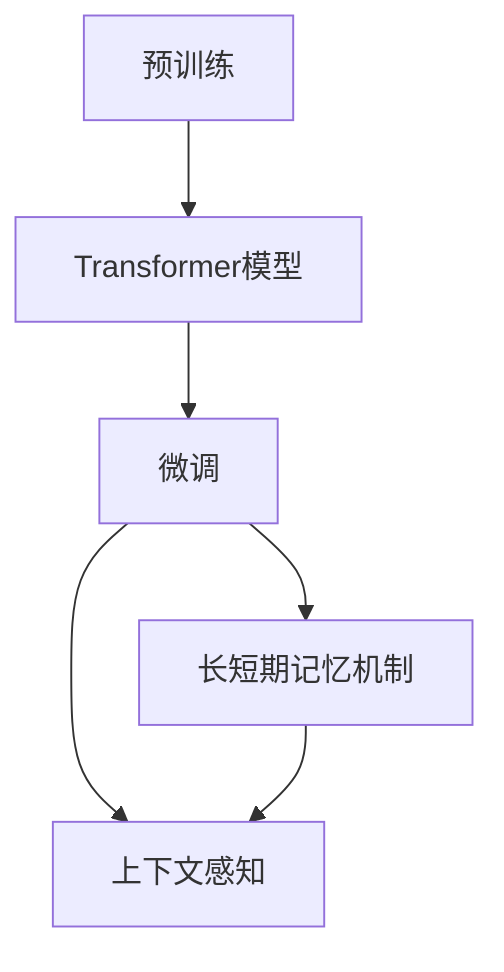

                 

# 上下文记忆：LLM 的长处

> 关键词：长短期记忆,上下文感知,自适应编码,预训练,微调,自然语言处理(NLP)

## 1. 背景介绍

在过去几年中，大规模语言模型（Large Language Models, LLMs）如GPT-3和BERT等，已经取得了显著的进展，被广泛应用于各种自然语言处理（Natural Language Processing, NLP）任务中，例如文本分类、问答、翻译、摘要、对话系统等。这些模型通过在大规模无标签文本数据上预训练，学习到丰富的语言知识和常识，展现出强大的语言理解和生成能力。然而，尽管这些模型在诸多任务上取得了优异表现，其核心特性和长处仍然存在很多有趣且有价值的探究。

在本博客中，我们将深入探讨大型语言模型的一个核心特性——上下文记忆（Contextual Memory），并讨论其长处、原理、操作步骤以及如何应用到实际任务中。

## 2. 核心概念与联系

### 2.1 核心概念概述

上下文记忆是大型语言模型（如Transformer模型）的一个重要特性。它允许模型通过考虑当前输入和之前输入之间的依赖关系，来更准确地理解语言的含义和上下文。

以下是一些与上下文记忆密切相关的核心概念：

- **Transformer模型**：一种基于自注意力机制的神经网络结构，广泛用于大型语言模型的设计。
- **自注意力机制**：Transformer的核心技术之一，允许模型在计算每个输入的表示时，同时考虑所有输入。
- **预训练**：模型在大量无标签数据上进行预训练，以学习通用语言表示。
- **微调**：在预训练模型上应用少量标注数据，以针对特定任务进行优化。

通过这些概念的联系，我们能够更好地理解大型语言模型是如何通过上下文记忆，将预训练和微调相结合，从而在各种自然语言处理任务中取得卓越性能的。

### 2.2 核心概念原理和架构的 Mermaid 流程图



这个流程图展示了大型语言模型从预训练到微调的基本流程。预训练模型通过自注意力机制进行建模，学习通用的语言表示。微调过程通过将预训练模型与特定任务相结合，进一步优化模型在特定任务上的性能。而长短期记忆机制和上下文感知则帮助模型在处理不同长度的上下文信息时，展现出更好的理解和记忆能力。

## 3. 核心算法原理 & 具体操作步骤

### 3.1 算法原理概述

大型语言模型中的上下文记忆主要通过长短期记忆机制（Long Short-Term Memory, LSTM）和Transformer模型中的自注意力机制来实现。

- **LSTM**：一种递归神经网络结构，能够有效处理长序列数据，并记忆之前的信息。
- **Transformer的自注意力机制**：能够通过同时关注输入序列中的所有位置，捕捉上下文信息。

这些机制的结合，使得大型语言模型能够理解并记住长时间跨度的上下文信息，从而提升其在各种自然语言处理任务中的性能。

### 3.2 算法步骤详解

1. **预训练步骤**：
    - 收集大规模无标签文本数据，如Web语料、书籍、新闻等。
    - 使用Transformer模型和自注意力机制，在大规模数据上进行预训练。
    - 通过自监督学习任务，如掩码语言模型、下一句子预测等，学习语言的通用表示。

2. **微调步骤**：
    - 收集特定任务的标注数据，如分类、匹配、生成等。
    - 在预训练模型基础上，添加任务适配层（如分类器或解码器）。
    - 使用少量标注数据进行微调，优化模型在特定任务上的性能。
    - 调整学习率、正则化参数、批次大小等超参数。

### 3.3 算法优缺点

**优点**：
- **上下文感知**：模型能够理解并记住长时间跨度的上下文信息。
- **通用表示**：预训练模型在通用语言表示上具有显著优势。
- **少样本学习**：微调模型能够在少量标注数据上进行高效学习。

**缺点**：
- **资源消耗**：预训练和微调模型需要大量的计算资源。
- **过拟合风险**：微调过程中容易过拟合，尤其是标注数据量不足时。
- **长尾问题**：对于长尾数据或领域数据，模型性能可能受限。

### 3.4 算法应用领域

大型语言模型的上下文记忆特性，使其在以下领域中具有广泛的应用：

- **文本分类**：如情感分析、主题分类、意图识别等。
- **命名实体识别**：识别文本中的人名、地名、机构名等特定实体。
- **关系抽取**：从文本中抽取实体之间的语义关系。
- **问答系统**：对自然语言问题给出答案。
- **机器翻译**：将源语言文本翻译成目标语言。
- **文本摘要**：将长文本压缩成简短摘要。
- **对话系统**：使机器能够与人自然对话。

## 4. 数学模型和公式 & 详细讲解 & 举例说明

### 4.1 数学模型构建

我们以Transformer模型为例，来构建一个大规模语言模型的数学模型。

假设输入序列为$x_1, x_2, \ldots, x_n$，输出序列为$y_1, y_2, \ldots, y_n$。Transformer模型由编码器和解码器两部分组成，其中编码器将输入序列$x$转换为中间表示$h$，解码器将中间表示$h$转换为输出序列$y$。

编码器的自注意力机制可以表示为：

$$
h_i = \text{Attention}(QK^HV, K_i, Q_i)
$$

其中$Q, K, V$分别为查询、键、值矩阵，$h_i$为第$i$个位置的隐藏表示。

解码器的自注意力机制类似，但加入了多头注意力机制，可以表示为：

$$
h_i = \text{Attention}(QK^HV, K_i, Q_i) + h_{i-1}
$$

### 4.2 公式推导过程

对于自注意力机制，其计算过程如下：

1. **计算查询向量**：

$$
Q = XW_Q^T
$$

2. **计算键值矩阵**：

$$
K = XW_K^T, V = XW_V^T
$$

3. **计算注意力得分**：

$$
\text{Attention}(QK^HV, K_i, Q_i) = \frac{Q_iK_i^T}{\sqrt{d_k}} \cdot V_i
$$

其中$d_k$为键向量的维度。

### 4.3 案例分析与讲解

假设有一个文本分类任务，模型在训练集上已经学习到了文本-标签的映射。在进行微调时，我们可以使用以下步骤：

1. **任务适配层**：在模型顶层添加一个分类器，输出每个词对应的分类标签。

2. **损失函数**：使用交叉熵损失函数计算模型输出与真实标签之间的差异。

3. **优化器**：使用AdamW优化器，设置合适的学习率。

4. **微调过程**：使用少量标注数据进行微调，更新模型的参数，最小化损失函数。

## 5. 项目实践：代码实例和详细解释说明

### 5.1 开发环境搭建

要使用大型语言模型进行微调，首先需要准备好开发环境。以下是使用Python和PyTorch搭建环境的详细步骤：

1. **安装Anaconda**：从官网下载并安装Anaconda，创建独立的Python环境。
2. **创建虚拟环境**：

```bash
conda create -n llm-env python=3.8 
conda activate llm-env
```

3. **安装PyTorch**：

```bash
pip install torch torchvision torchaudio
```

4. **安装Transformers库**：

```bash
pip install transformers
```

5. **安装其他库**：

```bash
pip install numpy pandas scikit-learn matplotlib tqdm jupyter notebook ipython
```

### 5.2 源代码详细实现

下面以BERT模型为例，展示如何使用PyTorch和Transformers库进行文本分类任务微调的代码实现。

```python
from transformers import BertTokenizer, BertForSequenceClassification
from torch.utils.data import Dataset, DataLoader
from torch.optim import AdamW
import torch

class TextDataset(Dataset):
    def __init__(self, texts, labels, tokenizer):
        self.texts = texts
        self.labels = labels
        self.tokenizer = tokenizer
    
    def __len__(self):
        return len(self.texts)
    
    def __getitem__(self, item):
        text = self.texts[item]
        label = self.labels[item]
        
        encoding = self.tokenizer(text, return_tensors='pt', padding='max_length')
        input_ids = encoding['input_ids']
        attention_mask = encoding['attention_mask']
        
        return {'input_ids': input_ids, 
                'attention_mask': attention_mask,
                'labels': torch.tensor(label, dtype=torch.long)}

# 加载预训练模型
model = BertForSequenceClassification.from_pretrained('bert-base-uncased', num_labels=2)

# 加载分词器
tokenizer = BertTokenizer.from_pretrained('bert-base-uncased')

# 准备数据集
train_dataset = TextDataset(train_texts, train_labels, tokenizer)
val_dataset = TextDataset(val_texts, val_labels, tokenizer)

# 设置优化器
optimizer = AdamW(model.parameters(), lr=2e-5)

# 训练过程
for epoch in range(5):
    train_loss = 0.0
    train_correct = 0
    val_loss = 0.0
    val_correct = 0
    
    model.train()
    for batch in DataLoader(train_dataset, batch_size=32, shuffle=True):
        input_ids = batch['input_ids'].to(device)
        attention_mask = batch['attention_mask'].to(device)
        labels = batch['labels'].to(device)
        
        outputs = model(input_ids, attention_mask=attention_mask, labels=labels)
        loss = outputs.loss
        train_loss += loss.item()
        train_predict = torch.argmax(outputs.logits, dim=1)
        train_correct += torch.sum(train_predict == labels).item()
        
    model.eval()
    with torch.no_grad():
        for batch in DataLoader(val_dataset, batch_size=32, shuffle=False):
            input_ids = batch['input_ids'].to(device)
            attention_mask = batch['attention_mask'].to(device)
            labels = batch['labels'].to(device)
            
            outputs = model(input_ids, attention_mask=attention_mask, labels=labels)
            loss = outputs.loss
            val_loss += loss.item()
            val_predict = torch.argmax(outputs.logits, dim=1)
            val_correct += torch.sum(val_predict == labels).item()
            
    print(f'Epoch {epoch+1}, Train Loss: {train_loss/len(train_dataset)}, Train Acc: {train_correct/len(train_dataset)}')
    print(f'Epoch {epoch+1}, Val Loss: {val_loss/len(val_dataset)}, Val Acc: {val_correct/len(val_dataset)}')
```

### 5.3 代码解读与分析

在上述代码中，我们首先定义了一个`TextDataset`类，用于将文本数据转换为模型所需的格式。然后，我们加载了预训练的BERT模型，并设置了微调的优化器。在训练过程中，我们使用了交叉熵损失函数，并使用AdamW优化器进行参数更新。

在每个epoch的训练和验证过程中，我们分别计算了模型在训练集和验证集上的损失和准确率。最后，我们打印出每个epoch的训练和验证结果。

### 5.4 运行结果展示

运行上述代码，我们可以得到模型在训练集和验证集上的准确率和损失曲线。通过这些结果，我们可以评估模型的性能，并根据需要进行超参数调整。

## 6. 实际应用场景

### 6.1 智能客服系统

智能客服系统是一个典型的上下文记忆应用场景。在传统的客服系统中，客户通过人工客服进行咨询，而智能客服系统则可以通过微调BERT等大型语言模型，实现自动化的问答和问题解答。

在智能客服系统中，模型通过分析客户的问题，并结合之前对话的上下文信息，给出最合适的答案。通过上下文记忆，模型能够更好地理解客户的意图，提供更加个性化的服务。

### 6.2 金融舆情监测

金融舆情监测也是一个上下文记忆应用场景。在金融领域，舆情分析需要实时监测市场舆论动向，以便及时应对负面信息传播，规避金融风险。

通过微调BERT等大型语言模型，金融舆情监测系统可以自动识别新闻、报道、评论等文本，并根据上下文信息判断其情绪倾向和主题。一旦发现负面信息激增等异常情况，系统便会自动预警，帮助金融机构快速应对潜在风险。

### 6.3 个性化推荐系统

个性化推荐系统是另一个上下文记忆应用场景。在传统的推荐系统中，推荐结果往往只依赖用户的历史行为数据，难以深入理解用户的真实兴趣偏好。而通过微调BERT等大型语言模型，个性化推荐系统可以更好地挖掘用户行为背后的语义信息，从而提供更精准、多样的推荐内容。

在推荐系统中，模型通过分析用户浏览、点击、评论、分享等行为数据，并结合上下文信息，推荐最符合用户兴趣的物品。通过上下文记忆，模型能够更好地捕捉用户的多样化需求，提供更加个性化的推荐结果。

## 7. 工具和资源推荐

### 7.1 学习资源推荐

为了更好地理解大型语言模型的上下文记忆特性，以下是一些推荐的资源：

1. **《Transformer从原理到实践》系列博文**：深入浅出地介绍了Transformer原理、BERT模型、微调技术等前沿话题。
2. **CS224N《深度学习自然语言处理》课程**：斯坦福大学开设的NLP明星课程，涵盖NLP领域的基本概念和经典模型。
3. **《Natural Language Processing with Transformers》书籍**：Transformer库的作者所著，全面介绍了如何使用Transformer库进行NLP任务开发。
4. **HuggingFace官方文档**：提供了海量预训练模型和完整的微调样例代码，是上手实践的必备资料。
5. **CLUE开源项目**：中文语言理解测评基准，涵盖大量不同类型的中文NLP数据集，并提供了基于微调的baseline模型。

### 7.2 开发工具推荐

以下是几款用于大型语言模型微调开发的常用工具：

1. **PyTorch**：基于Python的开源深度学习框架，灵活动态的计算图，适合快速迭代研究。
2. **TensorFlow**：由Google主导开发的开源深度学习框架，生产部署方便，适合大规模工程应用。
3. **Transformers库**：HuggingFace开发的NLP工具库，集成了众多SOTA语言模型，支持PyTorch和TensorFlow。
4. **Weights & Biases**：模型训练的实验跟踪工具，可以记录和可视化模型训练过程中的各项指标。
5. **TensorBoard**：TensorFlow配套的可视化工具，可实时监测模型训练状态。
6. **Google Colab**：谷歌推出的在线Jupyter Notebook环境，免费提供GPU/TPU算力。

### 7.3 相关论文推荐

以下是几篇奠基性的相关论文，推荐阅读：

1. **Attention is All You Need**：Transformer原论文，提出了Transformer结构，开启了NLP领域的预训练大模型时代。
2. **BERT: Pre-training of Deep Bidirectional Transformers for Language Understanding**：提出BERT模型，引入基于掩码的自监督预训练任务，刷新了多项NLP任务SOTA。
3. **Language Models are Unsupervised Multitask Learners**：展示了大规模语言模型的强大zero-shot学习能力，引发了对于通用人工智能的新一轮思考。
4. **Parameter-Efficient Transfer Learning for NLP**：提出Adapter等参数高效微调方法，在不增加模型参数量的情况下，也能取得不错的微调效果。
5. **Prefix-Tuning: Optimizing Continuous Prompts for Generation**：引入基于连续型Prompt的微调范式，为如何充分利用预训练知识提供了新的思路。
6. **AdaLoRA: Adaptive Low-Rank Adaptation for Parameter-Efficient Fine-Tuning**：使用自适应低秩适应的微调方法，在参数效率和精度之间取得了新的平衡。

## 8. 总结：未来发展趋势与挑战

### 8.1 总结

本文对大型语言模型的上下文记忆特性进行了全面系统的介绍。首先阐述了上下文记忆在大语言模型中的核心地位，并明确了其在预训练和微调过程中的作用。其次，从原理到实践，详细讲解了上下文记忆的数学模型和操作步骤，给出了微调任务开发的完整代码实例。同时，本文还探讨了上下文记忆在智能客服、金融舆情、个性化推荐等实际任务中的应用前景，展示了其广泛的应用潜力。最后，本文精选了上下文记忆技术的各类学习资源，力求为读者提供全方位的技术指引。

通过本文的系统梳理，可以看到，上下文记忆是大型语言模型的一大优势，使其在理解和处理自然语言时，展现出更强的适应性和学习能力。未来，伴随上下文记忆技术的进一步发展，大型语言模型将能够处理更复杂、更灵活的语言任务，为自然语言处理领域带来新的突破。

### 8.2 未来发展趋势

展望未来，大型语言模型的上下文记忆技术将呈现以下几个发展趋势：

1. **模型规模持续增大**：随着算力成本的下降和数据规模的扩张，大型语言模型的参数量还将持续增长。超大规模语言模型蕴含的丰富语言知识，有望支撑更加复杂多变的下游任务微调。
2. **上下文记忆能力增强**：未来的大型语言模型将在上下文记忆能力上取得更大进展，能够处理更长时间跨度的上下文信息，进一步提升其在自然语言处理任务中的表现。
3. **跨模态融合**：未来的上下文记忆技术将更加注重跨模态信息的整合，如视觉、语音等多模态信息的融合，实现视觉、语音等多模态信息与文本信息的协同建模。
4. **知识整合能力增强**：将符号化的先验知识，如知识图谱、逻辑规则等，与神经网络模型进行巧妙融合，引导上下文记忆过程学习更准确、合理的语言模型。
5. **个性化推荐系统**：未来的上下文记忆技术将更加注重个性化推荐系统的优化，通过上下文记忆能力，提供更精准、多样的推荐内容。

以上趋势凸显了上下文记忆技术在大语言模型中的重要性和未来发展方向。这些方向的探索发展，必将进一步提升大型语言模型在各种自然语言处理任务中的性能和应用范围。

### 8.3 面临的挑战

尽管大型语言模型的上下文记忆技术已经取得了瞩目成就，但在迈向更加智能化、普适化应用的过程中，它仍面临着诸多挑战：

1. **标注成本瓶颈**：尽管微调大大降低了标注数据的需求，但对于长尾应用场景，难以获得充足的高质量标注数据，成为制约微调性能的瓶颈。
2. **模型鲁棒性不足**：当前上下文记忆模型面对域外数据时，泛化性能往往大打折扣。对于测试样本的微小扰动，上下文记忆模型也可能发生波动。
3. **推理效率有待提高**：大规模语言模型虽然精度高，但在实际部署时往往面临推理速度慢、内存占用大等效率问题。
4. **可解释性亟需加强**：当前上下文记忆模型更像是"黑盒"系统，难以解释其内部工作机制和决策逻辑。
5. **安全性有待保障**：预训练语言模型难免会学习到有偏见、有害的信息，通过上下文记忆传递到下游任务，产生误导性、歧视性的输出，给实际应用带来安全隐患。
6. **知识整合能力不足**：现有的上下文记忆模型往往局限于任务内数据，难以灵活吸收和运用更广泛的先验知识。

这些挑战凸显了上下文记忆技术在大规模语言模型中的复杂性和重要性。解决这些问题需要更多理论和实践的积累，才能使上下文记忆技术更好地服务于自然语言处理和人工智能领域。

### 8.4 研究展望

未来的研究需要在以下几个方面寻求新的突破：

1. **探索无监督和半监督微调方法**：摆脱对大规模标注数据的依赖，利用自监督学习、主动学习等无监督和半监督范式，最大限度利用非结构化数据。
2. **研究参数高效和计算高效的微调范式**：开发更加参数高效的微调方法，在固定大部分预训练参数的同时，只更新极少量的任务相关参数。同时优化微调模型的计算图，减少前向传播和反向传播的资源消耗。
3. **融合因果和对比学习范式**：通过引入因果推断和对比学习思想，增强上下文记忆模型建立稳定因果关系的能力，学习更加普适、鲁棒的语言表征。
4. **引入更多先验知识**：将符号化的先验知识，如知识图谱、逻辑规则等，与神经网络模型进行巧妙融合，引导上下文记忆过程学习更准确、合理的语言模型。
5. **结合因果分析和博弈论工具**：将因果分析方法引入上下文记忆模型，识别出模型决策的关键特征，增强输出解释的因果性和逻辑性。借助博弈论工具刻画人机交互过程，主动探索并规避模型的脆弱点，提高系统稳定性。
6. **纳入伦理道德约束**：在模型训练目标中引入伦理导向的评估指标，过滤和惩罚有偏见、有害的输出倾向。同时加强人工干预和审核，建立模型行为的监管机制，确保输出符合人类价值观和伦理道德。

这些研究方向将引领上下文记忆技术迈向更高的台阶，为构建安全、可靠、可解释、可控的智能系统铺平道路。面向未来，上下文记忆技术还需要与其他人工智能技术进行更深入的融合，如知识表示、因果推理、强化学习等，多路径协同发力，共同推动自然语言理解和智能交互系统的进步。只有勇于创新、敢于突破，才能不断拓展上下文记忆技术的边界，让智能技术更好地造福人类社会。

## 9. 附录：常见问题与解答

**Q1：大型语言模型微调是否适用于所有NLP任务？**

A: 大型语言模型微调在大多数NLP任务上都能取得不错的效果，特别是对于数据量较小的任务。但对于一些特定领域的任务，如医学、法律等，仅仅依靠通用语料预训练的模型可能难以很好地适应。此时需要在特定领域语料上进一步预训练，再进行微调，才能获得理想效果。此外，对于一些需要时效性、个性化很强的任务，如对话、推荐等，微调方法也需要针对性的改进优化。

**Q2：微调过程中如何选择合适的学习率？**

A: 微调的学习率一般要比预训练时小1-2个数量级，如果使用过大的学习率，容易破坏预训练权重，导致过拟合。一般建议从1e-5开始调参，逐步减小学习率，直至收敛。也可以使用warmup策略，在开始阶段使用较小的学习率，再逐渐过渡到预设值。需要注意的是，不同的优化器(如AdamW、Adafactor等)以及不同的学习率调度策略，可能需要设置不同的学习率阈值。

**Q3：采用大模型微调时会面临哪些资源瓶颈？**

A: 目前主流的预训练大模型动辄以亿计的参数规模，对算力、内存、存储都提出了很高的要求。GPU/TPU等高性能设备是必不可少的，但即便如此，超大批次的训练和推理也可能遇到显存不足的问题。因此需要采用一些资源优化技术，如梯度积累、混合精度训练、模型并行等，来突破硬件瓶颈。同时，模型的存储和读取也可能占用大量时间和空间，需要采用模型压缩、稀疏化存储等方法进行优化。

**Q4：如何缓解微调过程中的过拟合问题？**

A: 过拟合是微调面临的主要挑战，尤其是在标注数据不足的情况下。常见的缓解策略包括：
1. 数据增强：通过回译、近义替换等方式扩充训练集
2. 正则化：使用L2正则、Dropout、Early Stopping等避免过拟合
3. 对抗训练：引入对抗样本，提高模型鲁棒性
4. 参数高效微调：只调整少量参数(如Adapter、Prefix等)，减小过拟合风险
5. 多模型集成：训练多个微调模型，取平均输出，抑制过拟合

这些策略往往需要根据具体任务和数据特点进行灵活组合。只有在数据、模型、训练、推理等各环节进行全面优化，才能最大限度地发挥大型语言模型微调的威力。

**Q5：微调模型在落地部署时需要注意哪些问题？**

A: 将微调模型转化为实际应用，还需要考虑以下因素：
1. 模型裁剪：去除不必要的层和参数，减小模型尺寸，加快推理速度
2. 量化加速：将浮点模型转为定点模型，压缩存储空间，提高计算效率
3. 服务化封装：将模型封装为标准化服务接口，便于集成调用
4. 弹性伸缩：根据请求流量动态调整资源配置，平衡服务质量和成本
5. 监控告警：实时采集系统指标，设置异常告警阈值，确保服务稳定性
6. 安全防护：采用访问鉴权、数据脱敏等措施，保障数据和模型安全

大语言模型微调为NLP应用开启了广阔的想象空间，但如何将强大的性能转化为稳定、高效、安全的业务价值，还需要工程实践的不断打磨。只有从数据、算法、工程、业务等多个维度协同发力，才能真正实现人工智能技术在垂直行业的规模化落地。总之，微调需要开发者根据具体任务，不断迭代和优化模型、数据和算法，方能得到理想的效果。

---

作者：禅与计算机程序设计艺术 / Zen and the Art of Computer Programming

