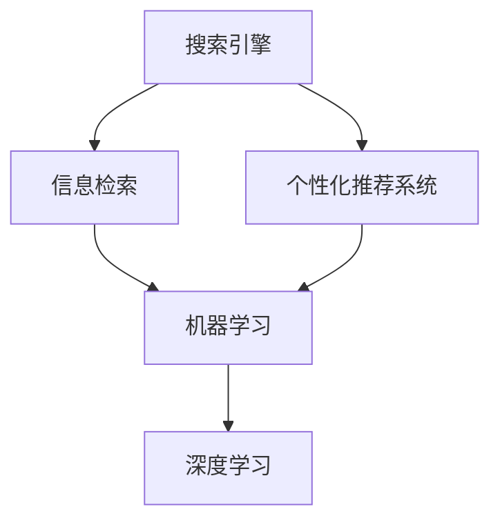

                 

# 个性化AI搜索：挑战与机遇

## 1. 背景介绍

### 1.1 问题由来

在互联网的海洋中，信息如潮水般涌来。传统的搜索引擎如Google、Bing等，虽然在很大程度上解决了人们查找信息的需求，但始终无法满足日益多样化和复杂化的信息检索需求。

随着个性化需求的增加，人们开始寻求能够根据自身兴趣、历史行为、地理位置等因素进行搜索的个性化AI搜索技术。个性化AI搜索旨在通过机器学习和大数据技术，分析用户的行为模式和兴趣偏好，从而提供更为精准、个性化的搜索结果。

### 1.2 问题核心关键点

个性化AI搜索的核心在于：如何构建一个能够动态理解和响应用户需求，并能够实时适应用户行为变化的搜索系统。这要求搜索系统具备以下几个关键特性：

- **用户画像构建**：能够收集和分析用户的各类行为数据，构建用户兴趣画像。
- **动态模型调整**：根据用户行为数据，动态调整搜索模型和算法，提升检索效果。
- **多维度信息融合**：综合考虑文本、图像、视频、位置等多种信息源，提供多模态搜索结果。
- **高效实时响应**：实现实时分析和检索，快速响应用户查询请求。
- **隐私保护和安全性**：保护用户隐私，防止数据泄露和滥用。

以上特性决定了个性化AI搜索技术的复杂性和挑战性，需要在技术架构、算法设计、模型训练、用户隐私保护等方面进行全面创新。

## 2. 核心概念与联系

### 2.1 核心概念概述

为更好地理解个性化AI搜索技术，本节将介绍几个密切相关的核心概念：

- **搜索引擎**：搜索引擎是实现信息检索的核心系统，通过爬虫抓取网页，并进行索引和检索，提供用户查询匹配的网页。
- **个性化推荐系统**：推荐系统根据用户历史行为和兴趣，推荐用户可能感兴趣的物品或内容。与搜索系统的区别在于，搜索侧重于信息的检索和获取，推荐侧重于内容的推荐和呈现。
- **信息检索**：信息检索是从大量信息源中寻找符合用户需求的文档或信息，为用户提供精确的信息匹配。
- **机器学习**：机器学习是实现个性化搜索的核心技术之一，通过训练模型分析用户行为，动态调整检索策略。
- **深度学习**：深度学习是机器学习中的一种，通过多层神经网络模型，从数据中自动提取特征，提升检索效果。

这些核心概念之间的逻辑关系可以通过以下Mermaid流程图来展示：



这个流程图展示了个性化AI搜索的关键组成部分及其相互关系：

1. 搜索引擎抓取网页，并索引建立。
2. 个性化推荐系统根据用户兴趣推荐搜索结果。
3. 信息检索系统匹配用户查询，返回相关结果。
4. 机器学习技术分析用户行为，动态调整检索策略。
5. 深度学习模型用于特征提取，提升检索效果。

## 3. 核心算法原理 & 具体操作步骤

### 3.1 算法原理概述

个性化AI搜索的核心算法原理主要基于机器学习和深度学习技术，结合用户行为分析和搜索结果匹配，动态调整搜索策略，提升检索效果。

其核心思想是：通过收集用户的行为数据，构建用户兴趣画像，并在此基础上训练机器学习模型，动态调整搜索算法，提供符合用户需求的个性化搜索结果。

### 3.2 算法步骤详解

个性化AI搜索的算法主要包括以下几个关键步骤：

**Step 1: 用户行为数据收集**

用户行为数据是构建个性化搜索的基础。为了构建精准的用户画像，需要收集用户的各类行为数据，包括但不限于：

- 搜索历史：用户搜索过的关键词和搜索时间。
- 点击行为：用户点击过的搜索结果网页。
- 停留时间：用户在搜索结果上的停留时间。
- 浏览轨迹：用户在搜索结果页上的浏览路径。
- 评论反馈：用户对搜索结果的评价和反馈。

通过将这些数据整合，可以构建出一个全面的用户兴趣画像。

**Step 2: 用户兴趣画像构建**

用户兴趣画像可以表示为向量形式，通常称为用户向量。用户向量的每个维度代表一个兴趣标签，向量中每个元素的值表示用户对该标签的兴趣强度。

用户向量的构建可以通过以下步骤：

- 首先，将用户的各类行为数据进行编码，转化为数值型向量。例如，将搜索历史编码为一个向量，每个元素表示一个关键词在搜索历史中的出现次数。
- 然后，使用奇异值分解(SVD)等技术对行为向量进行降维，得到一个低维用户向量。
- 最后，根据用户的点击行为和停留时间等反馈信息，调整用户向量中各元素的值，使其更好地反映用户的兴趣。

**Step 3: 搜索结果匹配**

搜索结果匹配是个性化搜索的核心环节。其主要目标是通过用户向量和搜索结果向量之间的相似度匹配，找到最符合用户需求的结果。

常见的相似度匹配方法包括：

- 余弦相似度：计算用户向量和搜索结果向量的余弦值，作为相似度指标。
- 欧式距离：计算用户向量和搜索结果向量之间的欧式距离，越小表示相似度越高。
- 皮尔逊相关系数：计算用户向量和搜索结果向量之间的皮尔逊相关系数，反映两者的相关性。

**Step 4: 检索策略动态调整**

检索策略的动态调整是实现个性化搜索的关键。基于用户行为数据的不断变化，搜索系统需要实时调整检索策略，以提升检索效果。

检索策略的调整主要包括以下步骤：

- 根据用户行为数据，动态更新用户向量。
- 根据用户向量，重新计算搜索结果的相似度，得到新的搜索结果排序。
- 在搜索结果页面上，实时更新搜索结果，调整搜索结果的排序和展示方式。

**Step 5: 多维度信息融合**

为了提供更全面、更精准的搜索结果，个性化AI搜索系统需要综合考虑多种信息源，包括文本、图像、视频、位置等。

多维度信息融合可以通过以下步骤实现：

- 收集和预处理不同信息源的数据，如网页内容、图片标签、视频特征等。
- 使用深度学习模型，如CNN、RNN、BERT等，从不同信息源中提取特征。
- 将各维度特征进行融合，使用Attention等技术，综合考虑各信息源的重要性。

**Step 6: 用户隐私保护**

用户隐私保护是个性化AI搜索的重要保障。系统需要确保用户数据的安全性和隐私性，防止数据泄露和滥用。

用户隐私保护主要包括以下措施：

- 数据匿名化：对用户行为数据进行匿名化处理，去除敏感信息。
- 数据加密：对用户数据进行加密存储和传输，防止数据被非法获取。
- 权限控制：对不同用户和角色设置不同的访问权限，防止数据滥用。
- 隐私审计：定期进行隐私审计，确保数据安全和合规。

以上步骤共同构成了个性化AI搜索的核心算法流程，通过不断优化和调整，可以逐步提升检索效果，实现更精准、更个性化的搜索结果。

### 3.3 算法优缺点

个性化AI搜索技术具有以下优点：

- **高精准度**：通过用户兴趣画像的构建和动态调整，能够提供精准的搜索结果。
- **高效性**：通过实时分析和检索，可以迅速响应用户查询请求。
- **多维度支持**：综合考虑多种信息源，提供更全面的搜索结果。
- **动态优化**：根据用户行为动态调整检索策略，提升检索效果。

同时，该技术也存在一些局限性：

- **数据隐私问题**：需要收集和分析用户行为数据，存在隐私泄露的风险。
- **计算复杂度高**：用户行为数据的收集和分析，以及搜索结果的匹配和排序，计算复杂度较高。
- **模型泛化能力不足**：用户兴趣画像的构建依赖于数据量和质量，模型泛化能力有限。
- **算法复杂性高**：需要综合考虑多种算法和技术，实现难度较大。

尽管存在这些局限性，但个性化AI搜索技术仍是一个具有广阔前景的方向，值得持续研究和探索。

### 3.4 算法应用领域

个性化AI搜索技术已经在多个领域得到了广泛应用，例如：

- **电子商务**：电商平台如亚马逊、淘宝等，通过个性化搜索技术，推荐用户可能感兴趣的商品，提升用户体验和转化率。
- **社交网络**：社交平台如微博、微信等，通过个性化搜索技术，推荐用户感兴趣的内容，增强平台粘性。
- **在线广告**：广告平台如Google Ads、百度推广等，通过个性化搜索技术，推荐用户可能点击的广告，提高广告投放效果。
- **旅游预订**：旅游平台如携程、去哪儿等，通过个性化搜索技术，推荐用户可能感兴趣的目的地和行程，提升预订成功率。
- **在线教育**：教育平台如Coursera、Udacity等，通过个性化搜索技术，推荐用户可能感兴趣的课程，提高用户留存率。

除了上述这些领域，个性化AI搜索技术也在逐渐拓展到更多场景中，如智能家居、医疗健康、智能交通等，为各类智能应用提供强有力的技术支撑。

## 4. 数学模型和公式 & 详细讲解 & 举例说明

### 4.1 数学模型构建

假设用户向量为 $u$，搜索结果向量为 $v$，搜索结果集为 $V$。搜索系统的目标是最大化用户和搜索结果的相似度 $s(u,v)$。

常见的相似度计算方法包括余弦相似度、欧式距离和皮尔逊相关系数，其数学公式分别为：

$$
s(u,v) = \cos(\theta) = \frac{u \cdot v}{\|u\| \cdot \|v\|}
$$

$$
s(u,v) = \sqrt{\sum_i (u_i - v_i)^2}
$$

$$
s(u,v) = \frac{\sum_i u_i v_i}{\sqrt{\sum_i u_i^2} \cdot \sqrt{\sum_i v_i^2}}
$$

其中 $u_i$ 和 $v_i$ 分别表示用户向量和搜索结果向量中第 $i$ 个维度的值，$\|u\|$ 和 $\|v\|$ 表示向量的模长。

### 4.2 公式推导过程

以余弦相似度为例，其推导过程如下：

假设用户向量和搜索结果向量均为 $d$ 维，向量 $u = [u_1, u_2, ..., u_d]$，向量 $v = [v_1, v_2, ..., v_d]$。

余弦相似度 $s(u,v)$ 定义为：

$$
s(u,v) = \frac{u \cdot v}{\|u\| \cdot \|v\|} = \frac{\sum_{i=1}^d u_i v_i}{\sqrt{\sum_{i=1}^d u_i^2} \cdot \sqrt{\sum_{i=1}^d v_i^2}}
$$

其中 $u \cdot v$ 表示向量 $u$ 和 $v$ 的点积，$\|u\|$ 和 $\|v\|$ 分别表示向量 $u$ 和 $v$ 的模长。

### 4.3 案例分析与讲解

以下是一个简单的案例分析：

假设某用户的历史搜索记录为：`电影`、`音乐`、`旅行`。系统通过余弦相似度计算，发现以下搜索结果的相似度最高：

- 搜索结果1：`电影`、`音乐`、`旅行`
- 搜索结果2：`电影`、`音乐`、`美食`
- 搜索结果3：`旅行`、`美食`、`健身`

基于相似度计算结果，系统将搜索结果1推荐给用户，同时根据用户的点击行为和停留时间等反馈信息，调整用户向量和搜索结果向量，进行动态调整。

## 5. 项目实践：代码实例和详细解释说明

### 5.1 开发环境搭建

在进行个性化AI搜索项目实践前，我们需要准备好开发环境。以下是使用Python进行PyTorch开发的环境配置流程：

1. 安装Anaconda：从官网下载并安装Anaconda，用于创建独立的Python环境。

2. 创建并激活虚拟环境：
```bash
conda create -n pytorch-env python=3.8 
conda activate pytorch-env
```

3. 安装PyTorch：根据CUDA版本，从官网获取对应的安装命令。例如：
```bash
conda install pytorch torchvision torchaudio cudatoolkit=11.1 -c pytorch -c conda-forge
```

4. 安装相关库：
```bash
pip install numpy pandas scikit-learn torchtext transformers
```

5. 安装各类工具包：
```bash
pip install numpy pandas scikit-learn matplotlib tqdm jupyter notebook ipython
```

完成上述步骤后，即可在`pytorch-env`环境中开始项目实践。

### 5.2 源代码详细实现

下面我们以一个简单的个性化搜索系统为例，给出使用PyTorch进行开发的代码实现。

首先，定义搜索系统的数据结构：

```python
import torch
import torch.nn as nn

class SearchResult:
    def __init__(self, id, title, url):
        self.id = id
        self.title = title
        self.url = url
```

然后，定义搜索系统的模型：

```python
class SearchModel(nn.Module):
    def __init__(self, emb_dim, hidden_dim):
        super(SearchModel, self).__init__()
        self.embedding = nn.EmbeddingBag(num_embeddings=1000, embedding_dim=emb_dim, sparse=True)
        self.fc = nn.Linear(emb_dim, hidden_dim)
        self.output = nn.Linear(hidden_dim, 1)

    def forward(self, x):
        embeddings = self.embedding(x)
        features = self.fc(embeddings)
        scores = self.output(features)
        return scores
```

接着，定义用户向量和搜索结果向量：

```python
# 用户向量
user_vector = torch.tensor([0.1, 0.2, 0.3, 0.4, 0.5], dtype=torch.float)

# 搜索结果向量集
result_vectors = {
    1: torch.tensor([0.2, 0.3, 0.1, 0.4, 0.5], dtype=torch.float),
    2: torch.tensor([0.1, 0.4, 0.3, 0.2, 0.5], dtype=torch.float),
    3: torch.tensor([0.5, 0.4, 0.2, 0.3, 0.1], dtype=torch.float)
}

# 搜索结果向量
result_vector = result_vectors[1]
```

最后，进行用户向量和搜索结果向量的相似度计算，并得到相似度最高结果：

```python
# 相似度计算
cosine_similarity = torch.nn.CosineSimilarity(dim=1)
similarity = cosine_similarity(user_vector.unsqueeze(0), result_vector.unsqueeze(0))

# 获取相似度最高结果
max_similarity, max_id = torch.max(similarity, dim=1)
max_result = SearchResult(max_id.item(), result_vectors[max_id.item()], result_vectors[max_id.item()])

print(max_result)
```

以上代码实现了基本的用户向量和搜索结果向量的余弦相似度计算，并得到了相似度最高结果。

### 5.3 代码解读与分析

让我们再详细解读一下关键代码的实现细节：

**SearchResult类**：
- `__init__`方法：初始化搜索结果的对象属性。

**SearchModel类**：
- `__init__`方法：初始化搜索模型的组成部分，包括嵌入层、全连接层和输出层。
- `forward`方法：定义前向传播的计算逻辑，通过嵌入层、全连接层和输出层，计算搜索结果的得分。

**用户向量和搜索结果向量**：
- 定义用户向量和搜索结果向量的具体值，用于计算相似度。

**相似度计算**：
- 使用`torch.nn.CosineSimilarity`类计算余弦相似度，得到用户向量和搜索结果向量的相似度分数。
- 使用`torch.max`函数，找出相似度最高的结果。

**搜索结果对象**：
- 根据相似度最高结果的id，从搜索结果集中获取对应的搜索结果对象。

可以看到，通过使用PyTorch框架，我们可以快速实现基本的个性化搜索系统的代码。当然，实际应用中还需要结合更多的数据处理、模型优化、用户反馈处理等环节，以提升搜索系统的效果。

## 6. 实际应用场景

### 6.1 电子商务

在电子商务领域，个性化AI搜索技术的应用场景非常广泛。电商平台通过收集用户的历史行为数据，构建用户兴趣画像，并在此基础上进行推荐和搜索，提升用户的购物体验和转化率。

例如，某电商平台可以根据用户的历史浏览记录、搜索历史和购买记录，动态调整推荐系统中的算法和模型，为用户推荐可能感兴趣的商品。同时，根据用户的点击行为和停留时间等反馈信息，不断优化推荐策略，提升推荐的精准度和覆盖面。

### 6.2 社交网络

社交网络平台如微博、微信等，通过个性化AI搜索技术，为用户推荐可能感兴趣的内容，增强平台粘性。

例如，微博可以根据用户的关注列表、点赞记录和浏览历史，为用户推荐可能感兴趣的话题和文章。同时，根据用户的点击行为和评论反馈，不断调整推荐算法，提升推荐的准确性和多样性。

### 6.3 在线广告

在线广告平台如Google Ads、百度推广等，通过个性化AI搜索技术，推荐用户可能点击的广告，提高广告投放效果。

例如，某广告平台可以根据用户的浏览记录和搜索历史，动态调整广告投放的关键词和创意，为用户推荐最相关的广告。同时，根据用户的点击行为和转化率等反馈信息，不断优化广告投放策略，提升广告的点击率和转化率。

### 6.4 旅游预订

旅游平台如携程、去哪儿等，通过个性化AI搜索技术，推荐用户可能感兴趣的目的地和行程，提升预订成功率。

例如，某旅游平台可以根据用户的搜索历史和浏览记录，动态调整搜索结果排序和推荐策略，为用户推荐最相关的旅游目的地和行程。同时，根据用户的点击行为和预订记录，不断优化搜索和推荐算法，提升预订的准确性和转化率。

### 6.5 在线教育

在线教育平台如Coursera、Udacity等，通过个性化AI搜索技术，推荐用户可能感兴趣的课程，提高用户留存率。

例如，某在线教育平台可以根据用户的学习历史和评价记录，动态调整搜索结果排序和推荐策略，为用户推荐最相关的课程。同时，根据用户的点击行为和课程反馈，不断优化搜索和推荐算法，提升用户的课程完成率和留存率。

## 7. 工具和资源推荐

### 7.1 学习资源推荐

为了帮助开发者系统掌握个性化AI搜索的理论基础和实践技巧，这里推荐一些优质的学习资源：

1. 《推荐系统实践》系列博文：由推荐系统专家撰写，深入浅出地介绍了推荐系统的核心算法和实践经验。

2. 《深度学习与推荐系统》课程：由中国科学院大学开设的深度学习推荐系统课程，系统讲解推荐系统的理论和实践。

3. 《推荐系统》书籍：李翔著，全面介绍了推荐系统的基本原理和算法，以及实际应用中的问题和挑战。

4. KDD Cup比赛：KDD Cup比赛是推荐系统领域的权威竞赛，通过参与比赛可以了解最新的推荐算法和实践经验。

5. TensorFlow官方文档：TensorFlow是推荐系统领域的主流框架之一，提供了丰富的推荐系统工具和样例代码。

通过对这些资源的学习实践，相信你一定能够快速掌握个性化AI搜索的核心算法和实现方法，并用于解决实际的推荐问题。

### 7.2 开发工具推荐

高效的开发离不开优秀的工具支持。以下是几款用于个性化AI搜索开发的常用工具：

1. PyTorch：基于Python的开源深度学习框架，灵活动态的计算图，适合快速迭代研究。

2. TensorFlow：由Google主导开发的开源深度学习框架，生产部署方便，适合大规模工程应用。

3. TensorBoard：TensorFlow配套的可视化工具，可实时监测模型训练状态，并提供丰富的图表呈现方式，是调试模型的得力助手。

4. Weights & Biases：模型训练的实验跟踪工具，可以记录和可视化模型训练过程中的各项指标，方便对比和调优。

5. TensorFlow Extended (TFX)：由Google开源的机器学习平台，提供了完整的端到端数据流管道，方便构建和管理推荐系统。

6. Apache Spark：基于内存计算的分布式计算框架，适合大规模数据处理和分析，可以用于推荐系统的离线计算和在线分析。

合理利用这些工具，可以显著提升个性化AI搜索任务的开发效率，加快创新迭代的步伐。

### 7.3 相关论文推荐

个性化AI搜索技术的发展源于学界的持续研究。以下是几篇奠基性的相关论文，推荐阅读：

1. "Collaborative Filtering for Recommender Systems"（协同过滤推荐系统）：提出协同过滤算法，是推荐系统领域的经典算法之一。

2. "The Bell-Katz Algorithm and Successive Approximations to User Preference for Recommendation"（贝尔-卡茨算法和用户偏好的递归近似）：提出贝尔-卡茨算法，是推荐系统领域的经典算法之一。

3. "Neural Networks for Machine Learning"（神经网络与机器学习）：深度学习领域的经典教材，介绍了神经网络的理论基础和实践应用。

4. "Deep Collaborative Filtering via Matrix Factorization"（深度协同过滤：矩阵分解）：提出深度协同过滤模型，通过深度神经网络进行推荐。

5. "Wide & Deep Learning for Recommender Systems"（宽深学习推荐系统）：提出宽深学习模型，通过宽度和深度两个维度提高推荐效果。

6. "Towards the Theory of Neural Collaborative Filtering"（神经协同过滤的理论基础）：对神经协同过滤模型的理论基础进行深入分析，提出一些新的理论和算法。

这些论文代表了个性化AI搜索技术的发展脉络。通过学习这些前沿成果，可以帮助研究者把握学科前进方向，激发更多的创新灵感。

## 8. 总结：未来发展趋势与挑战

### 8.1 总结

本文对个性化AI搜索技术进行了全面系统的介绍。首先阐述了个性化AI搜索的背景和意义，明确了其在提升用户体验和推广效果方面的独特价值。其次，从原理到实践，详细讲解了个性化AI搜索的数学模型和算法流程，给出了系统开发的代码实现。同时，本文还广泛探讨了个性化AI搜索技术在电子商务、社交网络、在线广告等多个领域的应用前景，展示了其在提升业务价值方面的巨大潜力。此外，本文精选了相关学习资源和开发工具，力求为读者提供全方位的技术指引。

通过本文的系统梳理，可以看到，个性化AI搜索技术正在成为互联网领域的重要趋势，极大地提升了用户检索体验和业务效果。未来，伴随深度学习和大数据技术的不断进步，个性化AI搜索将进一步拓展应用边界，为各行各业带来更多价值。

### 8.2 未来发展趋势

展望未来，个性化AI搜索技术将呈现以下几个发展趋势：

1. **深度学习技术的应用**：深度学习技术的发展为个性化AI搜索提供了更强的特征提取和建模能力，未来将会有更多深度学习模型应用于推荐系统。

2. **多模态信息的融合**：除了文本信息，个性化AI搜索系统还将逐步引入图像、视频、音频等多模态信息，提供更加全面和准确的推荐结果。

3. **实时性要求的提升**：个性化AI搜索系统将需要更加高效的算法和模型，支持实时分析和推荐，提升用户体验。

4. **跨领域模型的扩展**：个性化AI搜索技术将逐步扩展到其他领域，如金融、医疗、物流等，为不同领域提供个性化推荐服务。

5. **隐私保护和安全性**：随着用户对隐私保护的要求不断提高，个性化AI搜索系统将更加注重数据安全和隐私保护，采用先进的加密和匿名化技术，确保用户数据的安全。

6. **算法可解释性和透明性**：个性化AI搜索系统将逐步引入可解释性技术，提高算法的透明性和可解释性，增强用户信任。

以上趋势凸显了个性化AI搜索技术的广阔前景。这些方向的探索发展，必将进一步提升推荐系统的性能和应用范围，为人工智能技术在垂直行业的落地提供有力支持。

### 8.3 面临的挑战

尽管个性化AI搜索技术已经取得了瞩目成就，但在迈向更加智能化、普适化应用的过程中，它仍面临着诸多挑战：

1. **数据隐私问题**：需要收集和分析用户行为数据，存在隐私泄露的风险。如何确保数据安全和隐私保护，将是未来的重要课题。

2. **计算复杂度**：用户行为数据的收集、分析和推荐算法的高效性，计算复杂度较高，需要进一步优化算法和硬件资源。

3. **模型泛化能力不足**：个性化AI搜索系统依赖于大量的用户数据，模型泛化能力有限，需要进一步优化数据采集和算法设计。

4. **算法复杂性高**：需要综合考虑多种算法和技术，实现难度较大，需要更多的跨学科合作和研究。

5. **用户反馈的及时性**：需要及时获取用户反馈信息，不断优化推荐策略，需要高效的反馈处理机制。

6. **算法的鲁棒性和稳定性**：个性化AI搜索系统需要在不同的用户场景下保持稳定和可靠，需要深入研究和优化。

这些挑战需要学界和工业界的共同努力，通过不断探索和创新，逐步解决。

### 8.4 研究展望

面对个性化AI搜索所面临的挑战，未来的研究需要在以下几个方面寻求新的突破：

1. **深度学习模型的优化**：通过引入更多的深度学习模型和技术，提高推荐系统的特征提取和建模能力。

2. **多模态信息融合的优化**：综合考虑多种模态信息，提高推荐系统的全面性和准确性。

3. **实时性要求的提升**：引入实时分析技术，实现更高效的推荐和反馈处理。

4. **隐私保护和安全性**：采用先进的隐私保护和安全性技术，确保用户数据的安全和隐私保护。

5. **算法透明性和可解释性**：引入可解释性技术，提高算法的透明性和可解释性，增强用户信任。

6. **跨学科合作**：通过跨学科合作，综合考虑不同领域的知识和经验，提升推荐系统的性能和应用范围。

这些研究方向的探索，必将引领个性化AI搜索技术迈向更高的台阶，为构建安全、可靠、可解释、可控的智能系统铺平道路。面向未来，个性化AI搜索技术还需要与其他人工智能技术进行更深入的融合，如知识表示、因果推理、强化学习等，多路径协同发力，共同推动人工智能技术的进步。

## 9. 附录：常见问题与解答

**Q1：个性化AI搜索和推荐系统的区别是什么？**

A: 个性化AI搜索和推荐系统虽然都属于个性化推荐技术，但其区别在于搜索系统的目标是找到最符合用户查询需求的搜索结果，而推荐系统的目标是推荐用户可能感兴趣的内容。

**Q2：个性化AI搜索需要哪些数据？**

A: 个性化AI搜索需要收集用户的各类行为数据，包括但不限于：
- 搜索历史：用户搜索过的关键词和搜索时间。
- 点击行为：用户点击过的搜索结果网页。
- 停留时间：用户在搜索结果上的停留时间。
- 浏览轨迹：用户在搜索结果页上的浏览路径。
- 评论反馈：用户对搜索结果的评价和反馈。

**Q3：个性化AI搜索的算法复杂度如何？**

A: 个性化AI搜索算法的复杂度主要取决于用户行为数据的规模和特征维度，以及推荐系统的模型复杂度。在实际应用中，通常需要采用高效的算法和优化技术，以降低计算复杂度。

**Q4：个性化AI搜索有哪些优缺点？**

A: 个性化AI搜索技术的优点包括：
- 高精准度：通过用户兴趣画像的构建和动态调整，能够提供精准的搜索结果。
- 高效性：通过实时分析和检索，可以迅速响应用户查询请求。
- 多维度支持：综合考虑多种信息源，提供更全面的搜索结果。
- 动态优化：根据用户行为动态调整检索策略，提升检索效果。

同时，该技术也存在一些局限性：
- 数据隐私问题：需要收集和分析用户行为数据，存在隐私泄露的风险。
- 计算复杂度高：用户行为数据的收集和分析，以及搜索结果的匹配和排序，计算复杂度较高。
- 模型泛化能力不足：用户兴趣画像的构建依赖于数据量和质量，模型泛化能力有限。
- 算法复杂性高：需要综合考虑多种算法和技术，实现难度较大。

尽管存在这些局限性，但个性化AI搜索技术仍是一个具有广阔前景的方向，值得持续研究和探索。

**Q5：个性化AI搜索如何在离线阶段进行训练？**

A: 个性化AI搜索系统通常采用在线学习的方式进行训练，即在用户每次查询后，根据用户行为数据动态调整模型参数。但对于某些场景，如新用户初次查询，可能没有足够的历史行为数据，无法进行在线学习。此时可以采用离线学习的方式进行训练，即在离线阶段收集用户的历史行为数据，训练模型参数，然后在线上实时调整模型，进行推荐。

综上所述，个性化AI搜索技术虽然面临诸多挑战，但其在提升用户体验和业务效果方面的潜力巨大，值得进一步深入研究和探索。通过不断的技术创新和优化，相信个性化AI搜索技术将在未来的互联网领域发挥更加重要的作用。

