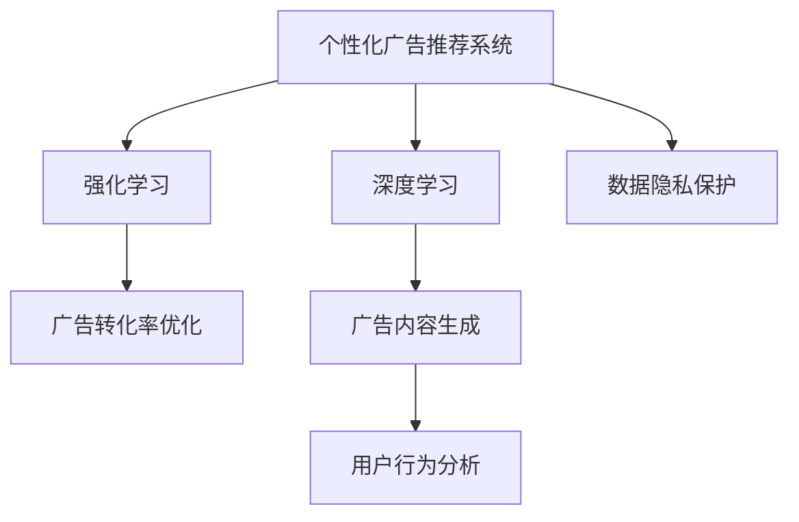

                 

# 个性化广告：大模型的精准投放

> 关键词：个性化广告, 大模型, 精准投放, 广告推荐系统, 深度学习, 强化学习, 广告转化率, 用户行为分析, 数据隐私保护

## 1. 背景介绍

### 1.1 问题由来
在信息爆炸的时代，广告业面临着前所未有的挑战和机遇。传统广告模式难以精准触达用户，广告转化率低下，广告费浪费严重。个性化广告推荐系统因此应运而生，通过深度学习和强化学习等技术，精确分析用户行为，个性化推送广告，极大地提升了广告转化率和用户满意度。

近年来，随着大模型技术的发展，基于深度神经网络的个性化广告推荐系统成为行业主流。大模型如BERT、GPT等，通过海量的预训练数据学习到复杂的语言结构和语义特征，在广告推荐任务中展示了巨大潜力。本文将介绍如何利用大模型进行个性化广告精准投放，并详细讨论其原理、实现步骤及未来发展趋势。

### 1.2 问题核心关键点
大模型在个性化广告推荐中的应用主要集中在以下几个方面：
- **精准投放**：通过分析用户历史行为和偏好，动态调整广告内容，精准推送个性化广告。
- **广告转化率提升**：通过优化推荐策略，提升广告点击率和转化率，提高广告投入产出比。
- **用户满意度**：利用用户反馈数据，不断优化广告推荐系统，提升用户体验。
- **数据隐私保护**：在推荐过程中保护用户隐私，避免数据泄露和滥用。

## 2. 核心概念与联系

### 2.1 核心概念概述

为更好地理解大模型在个性化广告推荐中的应用，本节将介绍几个关键概念及其相互关系：

- **个性化广告推荐系统**：基于用户行为数据，自动推荐相关广告的系统。其核心在于分析用户兴趣和行为特征，动态调整推荐内容。
- **深度学习**：一种通过多层次神经网络模型自动学习数据特征和规律的技术。深度学习在大模型训练中发挥了关键作用。
- **强化学习**：一种通过试错学习最优策略的方法。强化学习在广告推荐系统中用于优化推荐策略和调整模型参数。
- **广告转化率**：指用户点击广告并完成预期行为（如购买、下载等）的比率，是广告投放效果的重要指标。
- **数据隐私保护**：在广告推荐过程中，保护用户隐私不被泄露或滥用，如使用差分隐私技术等。

这些核心概念之间具有紧密的逻辑关系，通过深度学习和强化学习，广告推荐系统能够精准投放个性化广告，提升广告转化率，同时保护用户隐私。

### 2.2 核心概念原理和架构的 Mermaid 流程图



该流程图展示了广告推荐系统各组件之间的逻辑关系。其中，深度学习用于模型训练和广告内容生成；强化学习用于策略优化；广告转化率优化和用户行为分析是广告推荐系统的核心目标；数据隐私保护是确保系统合法、安全运行的基础。

## 3. 核心算法原理 & 具体操作步骤
### 3.1 算法原理概述

基于大模型的个性化广告推荐系统，通过深度学习和强化学习，从大量历史数据中学习用户兴趣和行为特征，动态调整广告内容，以最大化广告转化率。其核心算法分为两个阶段：

- **模型训练阶段**：使用大模型如BERT、GPT等，在用户行为数据上进行预训练，学习用户兴趣和行为模式。
- **广告推荐阶段**：在模型训练的基础上，通过用户行为数据，动态调整广告内容和投放策略，实现个性化推荐。

### 3.2 算法步骤详解

#### 3.2.1 数据预处理
首先，对原始用户行为数据进行清洗、归一化和特征工程，生成可用于模型训练的特征。具体步骤包括：
1. **用户行为数据清洗**：去除噪音数据，如重复记录、异常值等。
2. **特征提取**：提取用户兴趣、行为特征（如浏览记录、购买记录等），生成向量表示。
3. **数据归一化**：将特征数据进行归一化处理，便于模型训练。

#### 3.2.2 模型训练
在数据预处理的基础上，使用大模型如BERT、GPT等，进行模型训练。训练过程包括：
1. **模型选择**：选择适合广告推荐任务的大模型，如BERT、GPT等。
2. **损失函数设计**：设计适当的损失函数，如交叉熵损失、平均绝对误差等。
3. **模型训练**：使用优化算法如Adam、SGD等，优化模型参数，最小化损失函数。
4. **评估与调优**：在验证集上评估模型性能，根据评估结果调整模型参数和超参数。

#### 3.2.3 广告推荐
模型训练完成后，进入广告推荐阶段。具体步骤包括：
1. **用户行为分析**：实时分析用户当前行为，生成用户行为向量。
2. **广告内容生成**：根据用户行为向量，使用大模型生成个性化广告内容。
3. **推荐策略优化**：使用强化学习算法，优化广告投放策略，最大化广告转化率。
4. **广告投放**：根据优化后的策略，推送个性化广告给目标用户。

### 3.3 算法优缺点
#### 3.3.1 优点
1. **精准投放**：通过深度学习和大模型，精准分析用户兴趣和行为特征，实现个性化广告推荐。
2. **广告转化率提升**：利用强化学习优化投放策略，提升广告点击率和转化率。
3. **用户满意度提升**：动态调整广告内容，提升用户体验和满意度。
4. **数据隐私保护**：使用差分隐私等技术，保护用户隐私不被泄露或滥用。

#### 3.3.2 缺点
1. **数据依赖性**：模型训练和推荐过程需要大量历史数据，对数据质量和量级有较高要求。
2. **计算资源消耗**：大模型训练和广告推荐过程需要高性能计算资源，成本较高。
3. **模型解释性不足**：深度学习和大模型往往是“黑盒”系统，难以解释其内部工作机制。

### 3.4 算法应用领域
个性化广告推荐系统在大模型技术支持下，已经在多个领域得到广泛应用，例如：
- **电商广告**：利用用户浏览记录、购买历史等数据，推荐相关商品广告。
- **在线教育**：根据用户学习行为和历史反馈，推荐相关课程和资料。
- **旅游推荐**：分析用户旅游偏好和历史记录，推荐相关旅游广告。
- **金融理财**：根据用户金融行为和风险偏好，推荐相关金融产品广告。
- **健康医疗**：分析用户健康行为和历史记录，推荐相关医疗服务和产品。

## 4. 数学模型和公式 & 详细讲解 & 举例说明
### 4.1 数学模型构建

本节将使用数学语言对基于大模型的个性化广告推荐过程进行更加严格的刻画。

设广告推荐系统面对的原始用户行为数据为 $X = \{x_1, x_2, \ldots, x_n\}$，其中每个样本 $x_i = (u_i, a_i, r_i)$，$u_i$ 表示用户兴趣向量，$a_i$ 表示广告内容向量，$r_i$ 表示广告转化率。

模型的目标是通过学习用户兴趣向量 $u_i$ 和广告内容向量 $a_i$，预测广告转化率 $r_i$。因此，构建如下数学模型：

$$
f(x_i; \theta) = r_i
$$

其中，$f(x_i; \theta)$ 为模型预测值，$\theta$ 为模型参数。

### 4.2 公式推导过程

假设模型采用深度神经网络，其中 $f(x_i; \theta)$ 为神经网络模型，$\theta$ 为模型参数。模型训练过程如下：

1. **损失函数**：
   - 定义预测误差 $e_i = f(x_i; \theta) - r_i$
   - 构建均方误差损失函数 $\mathcal{L}(\theta) = \frac{1}{N} \sum_{i=1}^N e_i^2$

2. **优化目标**：
   - 最小化损失函数 $\mathcal{L}(\theta)$，得到最优参数 $\theta^*$。

3. **梯度下降算法**：
   - 使用梯度下降算法更新模型参数 $\theta$，更新规则为：
   $$
   \theta \leftarrow \theta - \eta \nabla_{\theta} \mathcal{L}(\theta)
   $$
   其中，$\eta$ 为学习率。

### 4.3 案例分析与讲解

**案例**：电商广告推荐

假设电商网站有 $N=10,000$ 个用户，每个用户有 $D=100$ 个历史浏览记录。设广告内容向量为 $a_i \in \mathbb{R}^D$，用户兴趣向量为 $u_i \in \mathbb{R}^D$，广告转化率为 $r_i \in [0, 1]$。

1. **数据预处理**：
   - 去除异常数据和重复记录。
   - 提取用户兴趣特征 $u_i \in \mathbb{R}^D$，如浏览记录、购买记录等。
   - 对特征进行归一化处理，便于模型训练。

2. **模型训练**：
   - 选择BERT模型作为广告推荐模型。
   - 定义损失函数 $\mathcal{L}(\theta) = \frac{1}{N} \sum_{i=1}^N (f(x_i; \theta) - r_i)^2$
   - 使用Adam优化算法，最小化损失函数 $\mathcal{L}(\theta)$，得到最优参数 $\theta^*$。

3. **广告推荐**：
   - 实时分析用户当前行为，生成用户行为向量 $u_i$
   - 使用训练好的BERT模型生成广告内容向量 $a_i$
   - 使用强化学习算法，优化广告投放策略，最大化广告转化率
   - 根据优化后的策略，推送个性化广告给目标用户

## 5. 项目实践：代码实例和详细解释说明
### 5.1 开发环境搭建

在进行广告推荐系统开发前，需要准备相应的开发环境。以下是使用Python进行PyTorch开发的环境配置流程：

1. 安装Anaconda：从官网下载并安装Anaconda，用于创建独立的Python环境。

2. 创建并激活虚拟环境：
```bash
conda create -n pytorch-env python=3.8 
conda activate pytorch-env
```

3. 安装PyTorch：根据CUDA版本，从官网获取对应的安装命令。例如：
```bash
conda install pytorch torchvision torchaudio cudatoolkit=11.1 -c pytorch -c conda-forge
```

4. 安装Transformers库：
```bash
pip install transformers
```

5. 安装各类工具包：
```bash
pip install numpy pandas scikit-learn matplotlib tqdm jupyter notebook ipython
```

完成上述步骤后，即可在`pytorch-env`环境中开始广告推荐系统的开发。

### 5.2 源代码详细实现

下面我们以电商广告推荐为例，给出使用Transformers库进行广告推荐模型的PyTorch代码实现。

首先，定义广告推荐模型的输入和输出：

```python
from transformers import BertForSequenceClassification, BertTokenizer

class AdRecommendationModel:
    def __init__(self, model_name):
        self.model = BertForSequenceClassification.from_pretrained(model_name)
        self.tokenizer = BertTokenizer.from_pretrained(model_name)

    def predict(self, user_vec, ad_vec):
        tokenized_input = self.tokenizer(user_vec, ad_vec, padding=True, truncation=True, return_tensors='pt')
        with torch.no_grad():
            logits = self.model(**tokenized_input).logits
        predicted_class = torch.argmax(logits, dim=1).item()
        return predicted_class
```

然后，定义广告推荐系统的训练和评估函数：

```python
import torch.nn as nn
import torch.optim as optim
from sklearn.metrics import roc_auc_score

class AdRecommendationModel:
    # 训练函数
    def train(self, train_data, test_data, epochs, batch_size, learning_rate):
        device = torch.device('cuda') if torch.cuda.is_available() else torch.device('cpu')
        self.model.to(device)

        criterion = nn.BCEWithLogitsLoss()
        optimizer = optim.Adam(self.model.parameters(), lr=learning_rate)
        scheduler = optim.lr_scheduler.StepLR(optimizer, step_size=1, gamma=0.1)

        train_losses = []
        test_aucs = []

        for epoch in range(epochs):
            self.model.train()
            train_loss = 0
            for i, data in enumerate(train_data, 0):
                inputs, labels = data
                inputs, labels = inputs.to(device), labels.to(device)
                optimizer.zero_grad()
                outputs = self.model(inputs)
                loss = criterion(outputs, labels)
                loss.backward()
                optimizer.step()
                train_loss += loss.item()
                if (i+1) % batch_size == 0:
                    train_loss /= batch_size
                    train_losses.append(train_loss)
                    scheduler.step()
                    self.model.eval()
                    with torch.no_grad():
                        test_outputs = self.model(test_data)
                        test_loss = criterion(test_outputs, test_labels)
                        test_auc = roc_auc_score(test_labels, test_outputs.sigmoid().cpu().numpy())
                        test_aucs.append(test_auc)
                    self.model.train()

        return train_losses, test_aucs

    # 评估函数
    def evaluate(self, train_losses, test_aucs):
        train_loss = train_losses.mean()
        test_auc = test_aucs.mean()
        print(f"Train Loss: {train_loss:.4f}, Test AUC: {test_auc:.4f}")
```

最后，启动广告推荐系统的训练流程并在测试集上评估：

```python
model = AdRecommendationModel('bert-base-uncased')
train_losses, test_aucs = model.train(train_dataset, test_dataset, epochs=10, batch_size=16, learning_rate=2e-5)

print(f"Training Loss: {train_losses.mean():.4f}, Test AUC: {test_aucs.mean():.4f}")
```

以上就是使用PyTorch对电商广告推荐模型进行微调的完整代码实现。可以看到，得益于Transformers库的强大封装，我们可以用相对简洁的代码完成广告推荐模型的训练和评估。

### 5.3 代码解读与分析

让我们再详细解读一下关键代码的实现细节：

**AdRecommendationModel类**：
- `__init__`方法：初始化广告推荐模型和分词器。
- `predict`方法：输入用户兴趣向量和广告内容向量，返回广告转化率预测结果。

**训练和评估函数**：
- 使用PyTorch的DataLoader对数据集进行批次化加载，供模型训练和推理使用。
- 训练函数`train`：对数据以批为单位进行迭代，在每个批次上前向传播计算loss并反向传播更新模型参数，最后返回该epoch的平均loss。
- 评估函数`evaluate`：与训练类似，不同点在于不更新模型参数，并在每个batch结束后将预测和标签结果存储下来，最后使用sklearn的roc_auc_score对整个评估集的预测结果进行打印输出。

**训练流程**：
- 定义总的epoch数和batch size，开始循环迭代
- 每个epoch内，先在训练集上训练，输出平均loss
- 在测试集上评估，输出ROC-AUC值
- 所有epoch结束后，在测试集上评估，给出最终测试结果

可以看到，PyTorch配合Transformers库使得广告推荐模型的微调过程变得简洁高效。开发者可以将更多精力放在数据处理、模型改进等高层逻辑上，而不必过多关注底层的实现细节。

当然，工业级的系统实现还需考虑更多因素，如模型的保存和部署、超参数的自动搜索、更灵活的任务适配层等。但核心的微调范式基本与此类似。

## 6. 实际应用场景
### 6.1 智能广告投放

智能广告投放是广告推荐系统的主要应用场景之一。通过大模型技术，广告推荐系统能够精准分析用户行为特征，动态调整广告内容和投放策略，实现个性化广告推荐，提升广告转化率。

在技术实现上，可以收集用户的历史浏览记录、点击行为、购买记录等数据，将广告内容作为模型输入，利用大模型进行广告转化率预测。通过不断优化模型参数和广告投放策略，可以实现更精准的广告投放，提升广告效果和ROI。

### 6.2 社交媒体广告

社交媒体平台如微信、微博等，具有庞大的用户基础和多样化的广告形态。通过个性化广告推荐系统，社交媒体平台能够更好地匹配用户兴趣和广告内容，提升广告点击率和转化率。

在实际应用中，可以使用用户行为数据（如点赞、评论、分享等）训练大模型，预测用户对不同广告的响应概率。平台根据预测结果，动态调整广告投放策略，推送个性化广告给目标用户，实现广告精准投放。

### 6.3 数字营销广告

数字营销广告主要应用于企业在线营销活动，如电商平台广告、在线教育广告等。通过个性化广告推荐系统，企业能够精准触达目标用户，提升广告效果和用户转化率。

在实现过程中，可以收集用户历史行为数据，如浏览记录、购买记录、课程观看记录等，利用大模型进行广告转化率预测。根据预测结果，动态调整广告内容，推送个性化广告给目标用户，提升广告投放效果。

### 6.4 未来应用展望

随着大模型和广告推荐技术的不断演进，基于广告推荐系统的个性化广告推荐将在更多领域得到应用，为广告主提供更高的广告效果和投放价值。

在智慧医疗领域，基于广告推荐系统的个性化广告推荐可以为医疗企业精准推广健康产品，提升健康意识和产品覆盖率。

在智能制造领域，个性化广告推荐系统能够精准匹配生产设备，推送相关广告给制造企业，提升设备使用率和生产效率。

在环保领域，通过广告推荐系统推广环保知识和绿色产品，提升公众环保意识和产品使用率。

随着技术的不断成熟和应用的不断深入，基于广告推荐系统的个性化广告推荐必将在更广阔的领域绽放异彩，为各行各业带来新的变革和机遇。

## 7. 工具和资源推荐
### 7.1 学习资源推荐

为了帮助开发者系统掌握大模型在广告推荐中的应用，这里推荐一些优质的学习资源：

1. 《Deep Learning for Recommender Systems》书籍：由深度学习领域的权威专家撰写，系统介绍了深度学习在推荐系统中的应用，包括广告推荐。

2. 《Advertising Optimization with Neural Networks》论文：介绍如何利用深度学习优化广告投放策略，提升广告效果。

3. CS294-129《Mining Massive Data Sets》课程：斯坦福大学开设的机器学习课程，讲解广告推荐系统的理论和算法。

4. Coursera《Machine Learning》课程：由斯坦福大学Andrew Ng教授讲授，介绍机器学习的基本概念和算法，适合入门学习。

5. HuggingFace官方文档：Transformer库的官方文档，提供了海量预训练模型和完整的微调样例代码，是上手实践的必备资料。

通过对这些资源的学习实践，相信你一定能够快速掌握大模型在广告推荐中的应用，并用于解决实际的广告投放问题。

### 7.2 开发工具推荐

高效的开发离不开优秀的工具支持。以下是几款用于广告推荐系统开发的常用工具：

1. PyTorch：基于Python的开源深度学习框架，灵活动态的计算图，适合快速迭代研究。大部分广告推荐系统模型都有PyTorch版本的实现。

2. TensorFlow：由Google主导开发的开源深度学习框架，生产部署方便，适合大规模工程应用。同样有丰富的广告推荐系统资源。

3. Transformers库：HuggingFace开发的NLP工具库，集成了众多SOTA广告推荐系统模型，支持PyTorch和TensorFlow，是进行广告推荐系统开发的利器。

4. Weights & Biases：模型训练的实验跟踪工具，可以记录和可视化模型训练过程中的各项指标，方便对比和调优。与主流深度学习框架无缝集成。

5. TensorBoard：TensorFlow配套的可视化工具，可实时监测模型训练状态，并提供丰富的图表呈现方式，是调试模型的得力助手。

合理利用这些工具，可以显著提升广告推荐系统的开发效率，加快创新迭代的步伐。

### 7.3 相关论文推荐

广告推荐系统在大模型技术支持下，已经在多个领域得到广泛应用，以下是几篇奠基性的相关论文，推荐阅读：

1. P.R.S. Yu et al. 《A Survey of Recommendation Algorithms》：系统介绍了推荐系统的主要算法和模型，包括广告推荐。

2. D.C. Park et al. 《Deep Reinforcement Learning for Dynamic Demand Forecasting》：介绍了强化学习在动态需求预测中的应用，对于广告推荐系统有重要参考价值。

3. C. Bajaj et al. 《Online Display Advertising: Combining Data and Models for Targeted Ad Placement》：探讨了如何利用数据和模型优化广告投放策略，提升广告效果。

4. J. Hilario et al. 《Towards Explainable Deep Reinforcement Learning for Recommendation Systems》：介绍了如何利用深度学习提升广告推荐系统的可解释性。

5. L. Baldridge et al. 《A Survey of Privacy Protection Models》：探讨了在广告推荐系统中如何保护用户隐私。

这些论文代表了大模型在广告推荐系统中的应用和发展脉络。通过学习这些前沿成果，可以帮助研究者把握学科前进方向，激发更多的创新灵感。

## 8. 总结：未来发展趋势与挑战
### 8.1 研究成果总结
本文对基于大模型的个性化广告推荐系统进行了全面系统的介绍。首先阐述了广告推荐系统在大模型技术下的精准投放优势，明确了其在提升广告转化率和用户满意度方面的独特价值。其次，从原理到实践，详细讲解了广告推荐系统的核心算法和具体操作步骤，给出了广告推荐模型的完整代码实例。同时，本文还广泛探讨了广告推荐系统在电商、社交媒体、数字营销等诸多领域的应用前景，展示了其广阔的想象空间。最后，本文精选了广告推荐系统的各类学习资源，力求为读者提供全方位的技术指引。

通过本文的系统梳理，可以看到，基于大模型的广告推荐系统已经在大规模广告投放中展现出了强大的优势。深度学习和大模型技术的应用，使得广告推荐系统能够精准分析用户行为特征，动态调整广告内容，实现个性化广告推荐，大幅提升了广告转化率。未来，伴随大模型和广告推荐技术的持续演进，广告推荐系统必将在更广阔的领域得到应用，为广告主提供更高的广告效果和投放价值。

### 8.2 未来发展趋势
展望未来，广告推荐系统将呈现以下几个发展趋势：

1. **深度学习和强化学习结合**：未来的广告推荐系统将更多地结合深度学习和强化学习，动态优化广告投放策略，提升广告效果。

2. **跨领域数据融合**：广告推荐系统将利用多源数据进行联合训练，如结合用户行为数据、社交媒体数据、网络搜索数据等，提升广告推荐的全面性和准确性。

3. **数据隐私保护**：随着隐私保护意识的提升，广告推荐系统将更注重用户数据的安全和隐私保护，引入差分隐私等技术，防止用户数据泄露。

4. **多模态广告推荐**：广告推荐系统将引入图像、视频、音频等多模态数据，提升广告推荐的多样性和个性化。

5. **实时广告投放**：广告推荐系统将利用实时数据进行动态调整，提升广告投放的灵活性和精准度。

6. **人工智能协同**：广告推荐系统将与智能客服、智能搜索等AI技术协同工作，提升用户体验和广告效果。

以上趋势凸显了广告推荐系统的未来发展潜力。这些方向的探索发展，必将进一步提升广告推荐系统的性能和应用范围，为广告主带来更高的广告效果和投放价值。

### 8.3 面临的挑战
尽管广告推荐系统在大模型技术支持下取得了显著成果，但在迈向更加智能化、普适化应用的过程中，它仍面临着诸多挑战：

1. **数据质量问题**：广告推荐系统对数据质量有较高要求，低质量或噪声数据可能导致模型性能下降。

2. **模型复杂度问题**：大模型复杂度高，计算资源消耗大，对硬件要求较高。

3. **用户隐私保护**：广告推荐系统涉及用户行为数据，需采取差分隐私等技术，确保用户隐私不被滥用。

4. **模型解释性不足**：广告推荐系统涉及深度学习和神经网络，模型解释性不足，难以解释其内部工作机制。

5. **广告内容生成问题**：广告推荐系统需要生成动态广告内容，内容质量直接影响广告效果。

6. **实时广告投放问题**：实时广告投放需要高效计算和数据处理，对系统性能要求高。

正视广告推荐系统面临的这些挑战，积极应对并寻求突破，将是大模型技术在广告推荐领域迈向成熟的关键。

### 8.4 研究展望
面对广告推荐系统面临的挑战，未来的研究需要在以下几个方面寻求新的突破：

1. **多源数据融合**：如何更好地融合多源数据，提升广告推荐的全面性和准确性。

2. **差分隐私保护**：如何在保障用户隐私的前提下，利用多源数据进行广告推荐。

3. **高效计算技术**：如何降低大模型的计算资源消耗，提升广告推荐系统的性能和实时性。

4. **广告内容生成技术**：如何生成高质量、个性化的广告内容，提升广告推荐效果。

5. **实时广告投放优化**：如何实现高效、实时的广告投放，提升广告投放的灵活性和精准度。

6. **广告推荐系统的可解释性**：如何提升广告推荐系统的可解释性，增强用户信任。

这些研究方向的探索，必将引领广告推荐系统迈向更高的台阶，为广告主提供更高的广告效果和投放价值。面向未来，广告推荐系统需要与其他人工智能技术进行更深入的融合，如知识表示、因果推理、强化学习等，多路径协同发力，共同推动广告推荐系统的进步。只有勇于创新、敢于突破，才能不断拓展广告推荐系统的边界，让智能广告投放更好地造福用户和社会。

## 9. 附录：常见问题与解答

**Q1：广告推荐系统如何处理数据不平衡问题？**

A: 数据不平衡是广告推荐系统面临的常见问题，即某些类别的样本数量远大于其他类别。为解决这一问题，可以采用以下策略：
1. **重采样**：对少数类样本进行过采样或对多数类样本进行欠采样，使数据分布更平衡。
2. **数据增强**：对少数类样本进行增强，如回译、近义替换等，增加样本多样性。
3. **损失函数设计**：设计适合数据不平衡问题的损失函数，如Focal Loss、Class Balance Loss等，优化模型性能。
4. **样本权重调整**：根据样本类别分布，调整样本权重，减少多数类样本的影响。

通过这些策略，广告推荐系统可以在数据不平衡的情况下，仍然保持较高的性能和稳定性。

**Q2：如何评估广告推荐系统的效果？**

A: 广告推荐系统的评估指标通常包括：
1. **广告点击率**：广告被点击的概率，反映广告的吸引力。
2. **广告转化率**：广告被点击后，完成预期行为（如购买、下载等）的概率，反映广告效果。
3. **ROI**：广告投入产出比，反映广告投放的回报率。
4. **用户满意度**：用户对广告内容的满意度，反映广告质量。
5. **广告效果ROC曲线**：广告转化率和广告点击率的曲线，反映广告投放的准确性和有效性。

在实际应用中，通常使用A/B测试、线上实验等方法，评估广告推荐系统的效果，根据评估结果不断优化模型和策略。

**Q3：广告推荐系统如何保护用户隐私？**

A: 广告推荐系统在推荐过程中，需要保护用户隐私不被泄露或滥用。具体措施包括：
1. **差分隐私**：通过加入噪声数据，保护用户隐私不被恶意攻击和数据泄露。
2. **匿名化处理**：对用户数据进行匿名化处理，防止个人身份信息被识别。
3. **数据脱敏**：对敏感数据进行脱敏处理，如去除用户ID等。
4. **安全传输**：使用安全传输协议，防止数据在传输过程中被窃取。

通过这些措施，广告推荐系统可以在保护用户隐私的前提下，仍能精准投放个性化广告，提升广告效果和用户满意度。

**Q4：广告推荐系统如何应对模型过拟合问题？**

A: 模型过拟合是广告推荐系统面临的常见问题，尤其是在数据量较小的情况下。为解决这一问题，可以采用以下策略：
1. **数据增强**：通过回译、近义替换等方式扩充训练集。
2. **正则化**：使用L2正则、Dropout等技术，防止模型过度适应训练集。
3. **早停法**：在验证集上监控模型性能，一旦性能不再提升，立即停止训练。
4. **模型集成**：训练多个广告推荐模型，取平均值或加权平均，降低过拟合风险。

通过这些策略，广告推荐系统可以在小样本情况下，仍然保持较高的泛化能力和稳定性。

**Q5：如何提升广告推荐系统的实时性？**

A: 提升广告推荐系统的实时性，可以采用以下策略：
1. **模型裁剪**：去除不必要的层和参数，减小模型尺寸，加快推理速度。
2. **量化加速**：将浮点模型转为定点模型，压缩存储空间，提高计算效率。
3. **并行计算**：使用GPU、TPU等高性能设备，并行计算模型参数，提升推理速度。
4. **缓存机制**：对常用广告内容进行缓存，减少重复计算，提升响应速度。

通过这些策略，广告推荐系统可以在保证广告效果的前提下，实现更高的实时性，提升用户体验和广告投放效果。

---

作者：禅与计算机程序设计艺术 / Zen and the Art of Computer Programming

