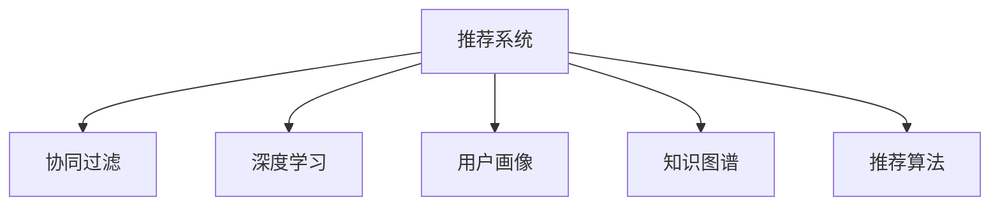

                 

# 个性化知识订阅提高知识获取的针对性

## 1. 背景介绍

在信息爆炸的时代，人们面临的挑战不再是知识的获取不足，而是如何高效、有针对性地获取适合自己的知识。互联网的普及和社交媒体的兴起，使得信息源变得更加丰富，用户有更多的选择。但与此同时，用户的时间和注意力变得更为宝贵，如何从中筛选出对自己有价值的内容，成为一个重要的问题。

个性化知识订阅应运而生。通过分析用户的兴趣、历史行为和社交网络，推荐系统能够为用户定制个性化的内容流，帮助用户更精准地获取知识。这种技术已经被广泛应用于新闻、电商、娱乐等多个领域，成为提升用户体验的重要手段。

## 2. 核心概念与联系

### 2.1 核心概念概述

为了更好地理解个性化知识订阅的原理和应用，本节将介绍几个核心概念：

- **推荐系统(Recommendation System)**：通过分析用户行为数据，为用户推荐感兴趣内容的技术。个性化知识订阅正是基于推荐系统的原理构建的。

- **协同过滤(Collaborative Filtering)**：推荐系统中的重要技术之一，通过分析用户之间的相似性，为用户推荐相似用户喜欢的内容。

- **深度学习(Depth Learning)**：一种机器学习技术，通过多层次的神经网络模型，学习数据的高级特征表示。深度学习被广泛用于个性化知识订阅系统中的用户画像建模和内容推荐。

- **用户画像(User Profile)**：通过分析用户的兴趣、行为、社交网络等数据，构建用户的多维度特征表示，用于指导推荐系统的决策。

- **知识图谱(Knowledge Graph)**：将复杂的知识领域转化为图形结构的数据表示，用于辅助推荐系统的推理和决策。

- **推荐算法(Recommendation Algorithm)**：基于用户画像和内容特征，设计推荐模型进行推荐计算。常见的算法包括协同过滤、基于内容的推荐、深度学习等。

这些核心概念之间的逻辑关系可以通过以下Mermaid流程图来展示：



这个流程图展示了个性化知识订阅的核心概念及其之间的关系：

1. 推荐系统通过协同过滤、深度学习等技术构建用户画像，并在此基础上进行推荐计算。
2. 用户画像是通过分析用户的兴趣、行为、社交网络等数据构建的多维度特征表示。
3. 知识图谱用于辅助推荐系统的推理和决策，提升推荐结果的准确性和全面性。
4. 推荐算法是推荐系统的核心组件，负责基于用户画像和内容特征进行推荐计算。

这些概念共同构成了个性化知识订阅的推荐引擎，用于帮助用户精准获取知识。

## 3. 核心算法原理 & 具体操作步骤

### 3.1 算法原理概述

个性化知识订阅的本质是基于推荐系统的个性化内容推荐。其核心思想是：通过分析用户的兴趣和历史行为，构建用户画像，并在此基础上选择合适的算法进行推荐计算，为用户定制个性化的知识内容流。

形式化地，假设用户集为 $U$，内容集为 $I$，推荐系统为用户 $u$ 推荐内容 $i$，其推荐效果由 $\mathcal{R}(u,i)$ 表示。推荐系统的目标是最小化推荐效果与真实用户兴趣的差异，即：

$$
\min_{\mathcal{R}} \mathcal{L}(\mathcal{R}, U, I)
$$

其中 $\mathcal{L}$ 为损失函数，$\mathcal{R}$ 为推荐算法。在实践中，我们通常使用交叉熵损失、均方误差损失等进行优化。

### 3.2 算法步骤详解

个性化知识订阅的一般流程包括以下几个关键步骤：

**Step 1: 用户画像构建**

- 收集用户的历史行为数据，如浏览记录、点击记录、收藏记录等。
- 分析用户的兴趣、偏好、社交网络等信息，构建用户画像。
- 使用协同过滤、深度学习等方法，进一步增强用户画像的准确性和全面性。

**Step 2: 内容表示与特征提取**

- 对内容进行编码，如将文章转化为词向量、图像转换为特征向量等。
- 提取内容的高级特征，如情感、主题、风格等，用于提升推荐效果。

**Step 3: 推荐模型构建**

- 选择合适的推荐算法，如协同过滤、基于内容的推荐、深度学习等。
- 构建推荐模型，使用训练数据对模型进行优化，使其能够根据用户画像和内容特征进行推荐计算。

**Step 4: 推荐计算与排序**

- 将用户画像和内容特征输入推荐模型，计算推荐结果。
- 根据推荐效果对内容进行排序，生成个性化的知识内容流。

**Step 5: 反馈与优化**

- 根据用户的反馈数据，如点击、收藏、评分等，对推荐模型进行优化。
- 定期更新用户画像，使其反映最新的兴趣和行为变化。

以上是个性化知识订阅的一般流程。在实际应用中，还需要根据具体任务的特点，对推荐过程的各个环节进行优化设计，如改进推荐算法、引入更多的特征工程、优化模型超参数等，以进一步提升推荐效果。

### 3.3 算法优缺点

个性化知识订阅具有以下优点：

1. 高效精准。通过分析用户历史行为，构建精准的用户画像，能够为用户提供有针对性的推荐。
2. 用户友好。推荐系统的推荐结果可以根据用户偏好进行调整，提升用户体验。
3. 个性化定制。推荐系统能够根据用户兴趣动态生成内容流，满足个性化需求。

同时，该方法也存在一定的局限性：

1. 数据隐私问题。用户的隐私数据可能被用于构建用户画像，引发数据隐私和安全问题。
2. 冷启动问题。新用户的画像难以快速构建，推荐效果不如老用户。
3. 多样性不足。长期推荐相似内容，可能导致用户兴趣狭窄，无法发现新的知识领域。
4. 过度依赖算法。推荐结果的准确性高度依赖于推荐算法的性能，算法选择不当可能导致推荐效果不佳。

尽管存在这些局限性，但个性化知识订阅在实际应用中已经取得了显著的效果，为知识获取的个性化和精准化提供了新的解决方案。

### 3.4 算法应用领域

个性化知识订阅技术已经广泛应用于以下领域：

- **新闻媒体**：如今日头条、网易新闻等平台，为用户推荐个性化的新闻内容。
- **电商零售**：如淘宝、京东等电商平台，为用户推荐个性化的商品和促销信息。
- **视频娱乐**：如Netflix、爱奇艺等视频平台，为用户推荐个性化的视频内容。
- **在线教育**：如Coursera、Khan Academy等平台，为用户推荐个性化的学习资源。
- **社交媒体**：如微信、微博等社交平台，为用户推荐个性化的内容和互动。

除了上述这些主流应用外，个性化知识订阅还被创新性地应用到更多场景中，如智能健康、智能家居、智能办公等，为各行各业带来了新的机遇。

## 4. 数学模型和公式 & 详细讲解 & 举例说明

### 4.1 数学模型构建

本节将使用数学语言对个性化知识订阅的推荐过程进行更加严格的刻画。

记推荐系统为用户 $u$ 推荐内容 $i$ 的推荐效果为 $\mathcal{R}(u,i)$，用户 $u$ 的真实兴趣为 $\mathcal{I}(u)$。假设推荐效果 $\mathcal{R}(u,i)$ 可以表示为用户 $u$ 的兴趣特征 $x_u$ 和内容特征 $x_i$ 的线性组合，即：

$$
\mathcal{R}(u,i) = \mathcal{W}^T x_u x_i + b
$$

其中 $\mathcal{W}$ 为权重矩阵，$b$ 为偏置项。

用户 $u$ 的真实兴趣 $\mathcal{I}(u)$ 可以表示为用户画像 $p_u$ 和兴趣标签 $y$ 的线性组合，即：

$$
\mathcal{I}(u) = \mathcal{A}^T p_u y + \gamma
$$

其中 $\mathcal{A}$ 为权重矩阵，$\gamma$ 为偏置项。

推荐系统的目标是最小化推荐效果与真实兴趣的差异，即：

$$
\min_{\mathcal{W}, \mathcal{A}} \frac{1}{N} \sum_{(u,i) \in D} \ell(\mathcal{R}(u,i), \mathcal{I}(u))
$$

其中 $D$ 为推荐数据集，$\ell$ 为损失函数，如均方误差损失、交叉熵损失等。

### 4.2 公式推导过程

以均方误差损失为例，我们可以将推荐效果与真实兴趣的差异表示为：

$$
\mathcal{L}(\mathcal{W}, \mathcal{A}) = \frac{1}{N} \sum_{(u,i) \in D} \frac{1}{2} (\mathcal{R}(u,i) - \mathcal{I}(u))^2
$$

将其展开，得：

$$
\mathcal{L}(\mathcal{W}, \mathcal{A}) = \frac{1}{2N} \sum_{(u,i) \in D} \left[ (\mathcal{W}^T x_u x_i + b - \mathcal{A}^T p_u y - \gamma)^2 \right]
$$

为简化计算，令 $z = \mathcal{A}^T p_u y + \gamma$，得：

$$
\mathcal{L}(\mathcal{W}, \mathcal{A}) = \frac{1}{2N} \sum_{(u,i) \in D} \left[ (\mathcal{W}^T x_u x_i + b - z)^2 \right]
$$

这是一个非凸优化问题，通常使用梯度下降等方法进行求解。

### 4.3 案例分析与讲解

以电商平台为用户推荐商品为例，对公式进行详细讲解：

假设用户 $u$ 对商品 $i$ 的评分 $r$ 为 $1-5$ 之间的整数。用户 $u$ 的真实兴趣可以表示为用户画像 $p_u$ 和商品标签 $y$ 的线性组合，即：

$$
r = \mathcal{A}^T p_u y + \gamma
$$

内容特征 $x_i$ 可以表示为商品的特征向量，如颜色、大小、价格等。推荐效果 $\mathcal{R}(u,i)$ 可以表示为用户兴趣特征 $x_u$ 和商品特征 $x_i$ 的线性组合，即：

$$
r = \mathcal{W}^T x_u x_i + b
$$

推荐系统的目标是最小化推荐效果与真实兴趣的差异，即：

$$
\min_{\mathcal{W}, \mathcal{A}} \frac{1}{N} \sum_{(u,i) \in D} \frac{1}{2} (r - \mathcal{A}^T p_u y - \gamma)^2
$$

将上述公式进行展开，得：

$$
\mathcal{L}(\mathcal{W}, \mathcal{A}) = \frac{1}{2N} \sum_{(u,i) \in D} \left[ (\mathcal{W}^T x_u x_i + b - \mathcal{A}^T p_u y - \gamma)^2 \right]
$$

在求解时，我们可以使用随机梯度下降等优化算法，逐步调整权重矩阵 $\mathcal{W}$ 和用户画像权重矩阵 $\mathcal{A}$，最小化损失函数 $\mathcal{L}(\mathcal{W}, \mathcal{A})$。通过优化后的 $\mathcal{W}$ 和 $\mathcal{A}$，即可计算推荐效果 $\mathcal{R}(u,i)$，生成个性化的商品推荐流。

## 5. 项目实践：代码实例和详细解释说明

### 5.1 开发环境搭建

在进行推荐系统开发前，我们需要准备好开发环境。以下是使用Python进行PyTorch开发的环境配置流程：

1. 安装Anaconda：从官网下载并安装Anaconda，用于创建独立的Python环境。

2. 创建并激活虚拟环境：
```bash
conda create -n recommendation-env python=3.8 
conda activate recommendation-env
```

3. 安装PyTorch：根据CUDA版本，从官网获取对应的安装命令。例如：
```bash
conda install pytorch torchvision torchaudio cudatoolkit=11.1 -c pytorch -c conda-forge
```

4. 安装TensorFlow：使用Google官方提供的安装命令：
```bash
pip install tensorflow
```

5. 安装各类工具包：
```bash
pip install numpy pandas scikit-learn matplotlib tqdm jupyter notebook ipython
```

完成上述步骤后，即可在`recommendation-env`环境中开始推荐系统开发。

### 5.2 源代码详细实现

这里我们以基于深度学习的内容推荐系统为例，给出使用PyTorch进行推荐系统开发的PyTorch代码实现。

首先，定义推荐系统的输入数据：

```python
import torch
from torch.utils.data import Dataset

class RecommendationDataset(Dataset):
    def __init__(self, user_data, item_data, user interests):
        self.user_data = user_data
        self.item_data = item_data
        self.user_interests = user interests
        
    def __len__(self):
        return len(self.user_data)
    
    def __getitem__(self, item):
        user_id = self.user_data[item]
        user_interests = self.user_interests[item]
        items = self.item_data[item]
        
        user_features = get_user_features(user_id)
        item_features = get_item_features(items)
        user_interests = torch.tensor(user_interests, dtype=torch.long)
        
        return {'user_features': user_features,
                'item_features': item_features,
                'user_interests': user_interests}

# 获取用户特征函数
def get_user_features(user_id):
    # 假设用户特征可以从数据库中获取
    return fetch_user_features_from_db(user_id)

# 获取物品特征函数
def get_item_features(items):
    # 假设物品特征可以从数据库中获取
    return fetch_item_features_from_db(items)
```

然后，定义推荐模型：

```python
from torch.nn import Linear, ReLU

class RecommendationModel(torch.nn.Module):
    def __init__(self, dim_user, dim_item):
        super(RecommendationModel, self).__init__()
        self.linear = Linear(dim_user + dim_item, 1)
        self.relu = ReLU()
        
    def forward(self, user_features, item_features):
        features = torch.cat([user_features, item_features], dim=1)
        output = self.linear(features)
        return self.relu(output)

# 获取用户特征和物品特征的维度
dim_user = 10
dim_item = 5

# 构建推荐模型
model = RecommendationModel(dim_user, dim_item)
```

接着，定义损失函数和优化器：

```python
from torch.optim import Adam

criterion = torch.nn.MSELoss()
optimizer = Adam(model.parameters(), lr=0.01)

# 用户数据、物品数据和用户兴趣数据
user_data = [1, 2, 3, 4, 5]
item_data = [[1, 2, 3, 4, 5], [2, 3, 4, 5, 6]]
user_interests = [0, 1, 0, 1, 1]

# 创建推荐数据集
dataset = RecommendationDataset(user_data, item_data, user_interests)

# 加载推荐数据集
dataloader = torch.utils.data.DataLoader(dataset, batch_size=2)

# 训练推荐模型
for epoch in range(100):
    model.train()
    for batch in dataloader:
        user_features = batch['user_features']
        item_features = batch['item_features']
        user_interests = batch['user_interests']
        
        optimizer.zero_grad()
        predictions = model(user_features, item_features)
        loss = criterion(predictions, user_interests)
        loss.backward()
        optimizer.step()

# 测试推荐模型
model.eval()
for batch in dataloader:
    user_features = batch['user_features']
    item_features = batch['item_features']
    user_interests = batch['user_interests']
    
    predictions = model(user_features, item_features)
    loss = criterion(predictions, user_interests)
    print(loss.item())
```

以上就是使用PyTorch对内容推荐系统进行深度学习建模的完整代码实现。可以看到，得益于PyTorch的强大封装，我们可以用相对简洁的代码完成推荐模型的构建和训练。

### 5.3 代码解读与分析

让我们再详细解读一下关键代码的实现细节：

**RecommendationDataset类**：
- `__init__`方法：初始化用户数据、物品数据和用户兴趣等关键组件。
- `__len__`方法：返回数据集的样本数量。
- `__getitem__`方法：对单个样本进行处理，提取用户特征、物品特征和用户兴趣，进行特征编码。

**get_user_features和get_item_features函数**：
- 从数据库中获取用户特征和物品特征，通常需要设计相应的API或数据接口。

**RecommendationModel类**：
- `__init__`方法：初始化推荐模型的结构。
- `forward`方法：计算推荐模型的前向传播过程。

**训练和测试流程**：
- 定义训练过程中的损失函数和优化器。
- 对推荐数据集进行批次化加载，供模型训练和推理使用。
- 在训练和测试过程中，分别使用训练数据和测试数据计算损失函数，并进行模型优化和性能评估。

可以看到，PyTorch配合深度学习框架，使得推荐系统的开发变得简洁高效。开发者可以将更多精力放在特征工程和模型优化等高层逻辑上，而不必过多关注底层的实现细节。

当然，工业级的系统实现还需考虑更多因素，如模型的保存和部署、超参数的自动搜索、更灵活的任务适配层等。但核心的推荐范式基本与此类似。

## 6. 实际应用场景

### 6.1 新闻媒体

在新闻媒体领域，个性化知识订阅技术可以为用户推荐个性化的新闻内容。传统的新闻推荐往往以点击量、阅读时长等指标为依据，缺乏对用户兴趣的深入分析。通过个性化知识订阅技术，推荐系统可以根据用户的历史行为和兴趣，为用户推荐更有价值的新闻内容，提高用户黏性和阅读体验。

例如，《今日头条》使用深度学习模型对用户的行为数据进行分析，构建用户画像，并在此基础上进行新闻推荐。推荐结果不仅包括新闻标题，还包括了文章摘要、用户评价等信息，增加了推荐的丰富性和准确性。

### 6.2 电商零售

在电商零售领域，个性化知识订阅技术可以为用户推荐个性化的商品和促销信息。传统的推荐系统往往基于用户的浏览和购买记录，推荐相似的商品。然而，由于电商商品的种类繁多，用户很难在茫茫的商品海洋中快速找到满意的商品。

通过个性化知识订阅技术，推荐系统可以根据用户的兴趣和行为，推荐更符合用户需求的商品。例如，电商平台如淘宝、京东，使用深度学习模型对用户行为数据进行分析，构建用户画像，并在此基础上进行商品推荐。推荐结果不仅包括商品的展示信息，还包括了商品评论、用户评价等信息，增加了推荐的丰富性和准确性。

### 6.3 视频娱乐

在视频娱乐领域，个性化知识订阅技术可以为用户推荐个性化的视频内容。传统的推荐系统往往基于用户的浏览记录和评分，推荐相似的视频内容。然而，由于视频内容的多样性和个性化需求，用户很难在大量的视频中找到满意的观看内容。

通过个性化知识订阅技术，推荐系统可以根据用户的兴趣和行为，推荐更符合用户需求的视频内容。例如，视频平台如Netflix、爱奇艺，使用深度学习模型对用户的行为数据进行分析，构建用户画像，并在此基础上进行视频推荐。推荐结果不仅包括视频的展示信息，还包括了视频评论、用户评价等信息，增加了推荐的丰富性和准确性。

### 6.4 在线教育

在在线教育领域，个性化知识订阅技术可以为用户推荐个性化的学习资源。传统的学习资源推荐往往基于用户的浏览和购买记录，推荐相似的学习资源。然而，由于学习资源的种类繁多，用户很难在大量的学习资源中找到满意的学习内容。

通过个性化知识订阅技术，推荐系统可以根据用户的兴趣和行为，推荐更符合用户需求的学习资源。例如，在线教育平台如Coursera、Khan Academy，使用深度学习模型对用户的行为数据进行分析，构建用户画像，并在此基础上进行学习资源推荐。推荐结果不仅包括学习资源的展示信息，还包括了学习资源的评价、用户评价等信息，增加了推荐的丰富性和准确性。

## 7. 工具和资源推荐

### 7.1 学习资源推荐

为了帮助开发者系统掌握个性化知识订阅的理论基础和实践技巧，这里推荐一些优质的学习资源：

1. 《推荐系统实践》系列书籍：该书系统介绍了推荐系统的理论基础和实践方法，包括协同过滤、深度学习等前沿技术。

2. 《Python推荐系统实战》课程：由知名专家讲授，结合实际项目，手把手教你构建推荐系统。

3. 《深度学习与推荐系统》在线课程：由斯坦福大学开设，介绍了深度学习在推荐系统中的应用，适合进阶学习。

4. Kaggle推荐系统竞赛：参加Kaggle推荐系统竞赛，实战练习推荐算法，积累项目经验。

5. GitHub推荐系统开源项目：开源项目如RecSys、PyRecSys等，提供了大量的推荐算法实现和案例，可以供学习参考。

通过对这些资源的学习实践，相信你一定能够快速掌握个性化知识订阅的精髓，并用于解决实际的推荐问题。

### 7.2 开发工具推荐

高效的开发离不开优秀的工具支持。以下是几款用于推荐系统开发的常用工具：

1. PyTorch：基于Python的开源深度学习框架，灵活动态的计算图，适合快速迭代研究。

2. TensorFlow：由Google主导开发的开源深度学习框架，生产部署方便，适合大规模工程应用。

3. Scikit-learn：Python的科学计算库，提供了丰富的机器学习算法，适合特征工程和模型评估。

4. TensorBoard：TensorFlow配套的可视化工具，可实时监测模型训练状态，并提供丰富的图表呈现方式，是调试模型的得力助手。

5. Weights & Biases：模型训练的实验跟踪工具，可以记录和可视化模型训练过程中的各项指标，方便对比和调优。

6. Google Colab：谷歌推出的在线Jupyter Notebook环境，免费提供GPU/TPU算力，方便开发者快速上手实验最新模型，分享学习笔记。

合理利用这些工具，可以显著提升推荐系统的开发效率，加快创新迭代的步伐。

### 7.3 相关论文推荐

个性化知识订阅技术的发展源于学界的持续研究。以下是几篇奠基性的相关论文，推荐阅读：

1. "Collaborative Filtering for Implicit Feedback Datasets"：提出了协同过滤的基本模型，奠定了协同过滤在推荐系统中的基础。

2. "Neural Recommendation Systems"：展示了深度学习在推荐系统中的应用，证明了深度模型在推荐效果上的优越性。

3. "Deep Learning Recommender Systems: A Survey"：系统综述了深度学习在推荐系统中的应用，提供了丰富的实践案例和算法推荐。

4. "Practical Recommendation Engines"：介绍了推荐系统中的实际问题和技术实现，适合推荐系统开发者参考。

5. "Hybrid Approaches for Recommendation Systems"：探讨了深度学习和传统推荐算法相结合的方法，提供了新的推荐思路。

这些论文代表了个性化知识订阅技术的发展脉络。通过学习这些前沿成果，可以帮助研究者把握学科前进方向，激发更多的创新灵感。

## 8. 总结：未来发展趋势与挑战

### 8.1 总结

本文对个性化知识订阅技术的原理和应用进行了全面系统的介绍。首先阐述了推荐系统与个性化知识订阅的核心概念及其关系，明确了个性化知识订阅在提升知识获取针对性方面的重要价值。其次，从原理到实践，详细讲解了个性化知识订阅的数学模型和操作步骤，给出了推荐系统开发的完整代码实例。同时，本文还广泛探讨了个性化知识订阅技术在新闻媒体、电商零售、视频娱乐、在线教育等多个领域的应用前景，展示了个性化知识订阅技术的广泛应用潜力。此外，本文精选了推荐系统的各类学习资源，力求为读者提供全方位的技术指引。

通过本文的系统梳理，可以看到，个性化知识订阅技术正在成为推荐系统的重要范式，极大地提升了用户获取知识的个性化和精准化。随着推荐系统技术的不断发展，个性化知识订阅必将在更多领域得到应用，为各行各业带来变革性影响。

### 8.2 未来发展趋势

展望未来，个性化知识订阅技术将呈现以下几个发展趋势：

1. 多模态推荐：推荐系统将不再局限于文本数据，将视觉、语音等多模态数据与文本数据相结合，提供更加丰富和个性化的推荐结果。

2. 深度强化学习：结合深度学习和强化学习技术，推荐系统将更加智能和主动，能够根据用户的行为变化动态调整推荐策略，提升推荐效果。

3. 实时推荐：推荐系统将能够实时响应用户行为，动态生成推荐内容，提供更加即时和个性化的服务。

4. 跨领域推荐：推荐系统将跨越不同领域，提供跨领域的多元化推荐结果，满足用户的复合需求。

5. 个性化定制：推荐系统将能够根据用户的个性化需求，提供定制化的推荐服务，提升用户体验。

以上趋势凸显了个性化知识订阅技术的广阔前景。这些方向的探索发展，必将进一步提升推荐系统的性能和应用范围，为各行各业带来新的机遇。

### 8.3 面临的挑战

尽管个性化知识订阅技术已经取得了显著的效果，但在迈向更加智能化、普适化应用的过程中，它仍面临着诸多挑战：

1. 数据隐私问题：用户数据的隐私保护成为推荐系统面临的重要问题。如何在保证推荐效果的同时，保护用户数据隐私，是一个需要深入研究的课题。

2. 多样性不足：长期推荐相似内容，可能导致用户兴趣狭窄，无法发现新的知识领域。如何平衡个性化和多样性，是推荐系统需要解决的重要问题。

3. 冷启动问题：新用户的画像难以快速构建，推荐效果不如老用户。如何提高推荐系统对新用户的适应能力，是推荐系统需要解决的重要问题。

4. 模型复杂度：深度学习模型的高复杂度可能导致计算资源消耗过大，难以在实际应用中大规模部署。如何设计高效低耗的模型，是推荐系统需要解决的重要问题。

5. 数据稀疏性：用户数据稀疏性可能导致推荐模型无法充分学习用户特征，影响推荐效果。如何处理数据稀疏性，是推荐系统需要解决的重要问题。

尽管存在这些挑战，但个性化知识订阅技术在实际应用中已经取得了显著的效果，为知识获取的个性化和精准化提供了新的解决方案。未来，伴随推荐系统技术的持续演进，个性化知识订阅必将在更多领域得到应用，为各行各业带来变革性影响。

### 8.4 研究展望

面对个性化知识订阅技术面临的挑战，未来的研究需要在以下几个方面寻求新的突破：

1. 引入外部知识图谱：将知识图谱与推荐系统相结合，提升推荐系统的推理和决策能力，提供更加准确和全面的推荐结果。

2. 融合多模态数据：将视觉、语音等多模态数据与文本数据相结合，提供更加丰富和个性化的推荐结果。

3. 引入深度强化学习：结合深度学习和强化学习技术，推荐系统将更加智能和主动，能够根据用户的行为变化动态调整推荐策略，提升推荐效果。

4. 设计高效低耗模型：设计高效低耗的推荐模型，降低计算资源消耗，提升推荐系统的可扩展性。

5. 解决冷启动问题：引入用户行为预测等技术，提高推荐系统对新用户的适应能力。

这些研究方向的探索，必将引领个性化知识订阅技术迈向更高的台阶，为构建人机协同的智能系统铺平道路。面向未来，个性化知识订阅技术还需要与其他人工智能技术进行更深入的融合，如知识表示、因果推理、强化学习等，多路径协同发力，共同推动个性化知识订阅技术的进步。只有勇于创新、敢于突破，才能不断拓展推荐系统的边界，让个性化知识订阅技术更好地造福人类社会。

## 9. 附录：常见问题与解答

**Q1：推荐系统如何处理数据稀疏性问题？**

A: 推荐系统通常使用矩阵分解等方法处理数据稀疏性问题。例如，将用户与物品的评分矩阵进行分解，得到用户特征和物品特征，然后再进行推荐计算。此外，还可以使用深度学习模型，通过预训练和微调等方法，从稀疏数据中学习更丰富的特征表示。

**Q2：推荐系统如何解决冷启动问题？**

A: 推荐系统可以通过用户行为预测等技术，解决冷启动问题。例如，使用深度学习模型对新用户的行为进行预测，预测其可能喜欢的物品，并将其作为推荐结果。此外，还可以使用协同过滤等方法，利用相似用户的推荐结果，为新用户提供推荐。

**Q3：推荐系统如何提高多样性？**

A: 推荐系统可以通过多样化算法来解决多样性问题。例如，使用协同过滤算法，结合用户兴趣和物品属性，生成多样化的推荐结果。此外，还可以使用基于内容的推荐算法，通过多样化的物品属性，增加推荐结果的多样性。

**Q4：推荐系统如何保护用户隐私？**

A: 推荐系统可以通过差分隐私等技术，保护用户隐私。例如，使用差分隐私技术对用户数据进行加噪处理，减少用户隐私泄露的风险。此外，还可以使用联邦学习等技术，在用户数据不离开本地的情况下，进行推荐模型的训练和优化。

**Q5：推荐系统如何提高实时性？**

A: 推荐系统可以通过实时计算和缓存等技术，提高实时性。例如，使用流式数据处理技术，对实时数据进行计算，并缓存计算结果，减少计算时间。此外，还可以使用分布式计算等技术，提高推荐系统的计算效率。

这些问题的解答，展示了推荐系统在实际应用中面临的挑战及其解决方案。通过合理应用这些技术，可以进一步提升推荐系统的性能和应用范围，为用户提供更加个性化和精准的知识获取服务。

---

作者：禅与计算机程序设计艺术 / Zen and the Art of Computer Programming

