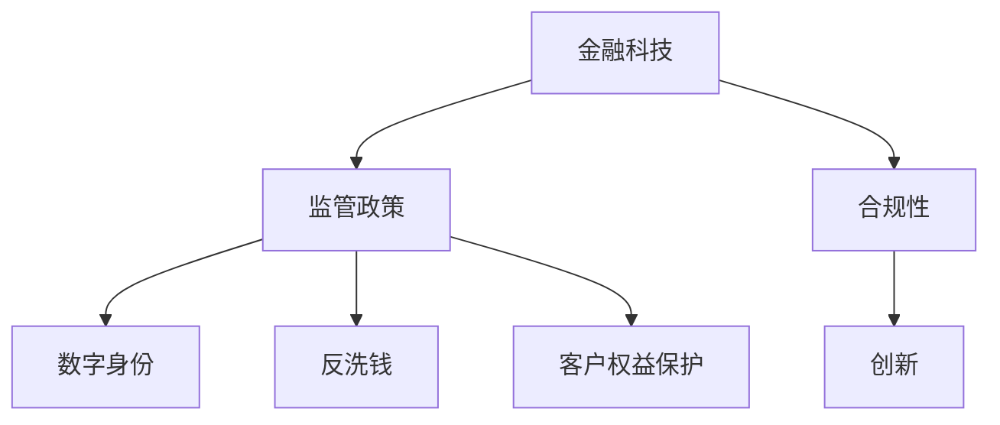

                 

# 中国金融科技的监管：PerplexFreqencyCTO 解读合规与创新

## 1. 背景介绍

### 1.1 问题由来

随着互联网和科技的迅猛发展，金融科技(Fintech)在过去十年中迅速崛起，成为全球金融业的重要组成部分。然而，金融科技的快速发展也带来了诸多挑战，特别是与传统金融监管政策的冲突和矛盾，引起了监管机构的高度关注。中国作为全球金融科技的重要市场，更是面临着如何平衡创新和监管的双重压力。

### 1.2 问题核心关键点

金融科技的监管核心在于如何在保障金融安全、维护金融稳定和促进金融创新的之间找到平衡。一方面，金融科技的创新为金融业带来了新的活力和动力，提升了金融服务的效率和便捷性；另一方面，金融科技的快速发展也对传统的金融监管政策提出了新的挑战。

为此，中国监管机构在积极探索和制定适应金融科技发展的新型监管政策，同时鼓励和规范金融科技企业在合规框架下创新发展。这不仅有利于保障金融消费者的权益，也为金融科技的可持续发展提供了良好的外部环境。

### 1.3 问题研究意义

对金融科技的监管研究，对于推动金融科技的健康发展和维护金融市场的稳定具有重要意义：

1. **保障金融安全**：通过合理的监管政策，可以有效防范金融风险，保障金融消费者权益，维护市场公平竞争。
2. **促进金融创新**：监管政策的导向性可以引导金融科技企业在合规的前提下创新技术应用，推动金融行业整体技术进步。
3. **提升金融效率**：有效的监管可以降低金融科技企业的运营成本，提升金融服务的覆盖面和质量，使更多人受益。
4. **促进国际合作**：金融科技的监管需要跨国的协调和合作，有助于在全球范围内形成统一的规则和标准，促进国际金融市场一体化。

## 2. 核心概念与联系

### 2.1 核心概念概述

为更好地理解中国金融科技的监管框架，本节将介绍几个密切相关的核心概念：

- **金融科技(Fintech)**：指通过科技手段改进金融产品、服务、流程的创新应用。包括但不限于支付、理财、借贷、保险、投行等领域。
- **监管政策(Regulation)**：指政府或监管机构为了保障金融稳定、保护投资者利益、防止欺诈等目的，对金融活动制定的各种规则和标准。
- **合规性(Compliance)**：指金融机构和金融科技企业遵守相关法律法规，确保其运营活动的合法性和合规性。
- **创新(Innovation)**：指在遵守法规的前提下，金融科技企业通过技术创新提升金融服务的质量和效率。
- **数字身份(ID)**：在金融科技中，数字身份用于验证用户的真实身份，确保金融交易的安全性。
- **反洗钱(AML)**：旨在防止通过金融系统进行洗钱等非法活动的发生，是金融监管的重要组成部分。
- **客户权益保护(Consumer Protection)**：保护金融消费者免受欺诈、误导和不公平对待，保障其合法权益。

这些核心概念之间的逻辑关系可以通过以下Mermaid流程图来展示：



这个流程图展示了大语言模型的核心概念及其之间的关系：

1. 金融科技通过科技手段改进金融产品和服务。
2. 监管政策对金融科技活动进行约束和规范。
3. 金融科技企业需在合规性框架下进行运营，确保合法性。
4. 合规性同时激励金融科技创新。
5. 数字身份、反洗钱和客户权益保护等具体监管措施，支撑合规性。

这些概念共同构成了中国金融科技的监管框架，使其能够保障金融科技在合规的前提下创新发展。

## 3. 核心算法原理 & 具体操作步骤
### 3.1 算法原理概述

中国金融科技的监管框架，基于对金融科技活动规律的理解和把握，结合法律法规的要求，通过一系列具体措施和工具，确保金融科技的合规性和创新性。其核心算法原理包括以下几个方面：

1. **法律法规解读**：通过对现有法律法规的详细解读，明确金融科技活动的合规要求。
2. **风险评估模型**：构建风险评估模型，对金融科技企业的运营风险进行评估，确保其合规性。
3. **合规审计工具**：开发合规审计工具，自动化检查金融科技企业的合规性。
4. **监管沙盒**：提供监管沙盒，允许金融科技企业在合规框架下进行创新试点。
5. **AI辅助决策**：引入人工智能技术，提高监管政策的执行效率和准确性。

### 3.2 算法步骤详解

中国金融科技的监管框架包括以下几个关键步骤：

**Step 1: 法律法规解读**

- **数据分析**：收集和分析现有法律法规，理解其核心要求和具体条款。
- **规范制定**：基于法律法规，制定具体的合规规范和标准。
- **文档编写**：编写详细的合规指南和操作指南，供金融机构和金融科技企业参考。

**Step 2: 风险评估模型构建**

- **数据收集**：收集金融科技企业的运营数据，包括但不限于用户数据、交易数据、风险数据等。
- **模型构建**：使用机器学习和统计方法，构建风险评估模型，识别和评估风险。
- **模型优化**：持续优化模型，确保其准确性和实用性。

**Step 3: 合规审计工具开发**

- **工具设计**：设计合规审计工具，自动检查金融科技企业的运营数据，识别合规问题。
- **工具实现**：使用Python、R等编程语言实现工具，确保其高效性和稳定性。
- **工具测试**：对工具进行测试，确保其能够准确识别合规问题，并提供详细的报告。

**Step 4: 监管沙盒应用**

- **政策设计**：设计监管沙盒政策，明确金融科技企业可在其中进行创新试点。
- **企业筛选**：筛选符合条件的金融科技企业，进入监管沙盒。
- **试点运行**：对试点企业进行监管，确保其合规运营。
- **结果评估**：评估试点结果，推广成功经验，调整政策。

**Step 5: AI辅助决策**

- **数据收集**：收集监管政策的执行数据，包括金融科技企业的运营情况、用户反馈等。
- **模型构建**：使用深度学习、自然语言处理等技术，构建AI辅助决策模型。
- **决策支持**：使用模型辅助监管机构进行合规性评估和政策制定。

### 3.3 算法优缺点

中国金融科技的监管框架具有以下优点：

1. **规范化运营**：通过明确的法律法规和合规规范，确保金融科技企业规范运营。
2. **创新激励**：通过监管沙盒等机制，允许企业在合规框架下进行创新试点，鼓励技术创新。
3. **高效执行**：通过AI辅助决策，提高监管政策的执行效率和准确性。

但同时也存在以下缺点：

1. **监管滞后**：法律法规和合规规范可能滞后于金融科技的发展速度，导致监管不足。
2. **合规成本高**：金融科技企业需要投入大量资源确保合规，可能增加运营成本。
3. **合规难度大**：金融科技活动的复杂性，使得合规检查和风险评估变得复杂。
4. **技术依赖**：依赖AI等技术手段进行监管，可能出现技术误判或漏洞。

### 3.4 算法应用领域

中国金融科技的监管框架已经广泛应用于以下几个领域：

1. **支付服务**：包括电子支付、第三方支付等，确保支付安全，防范洗钱和欺诈。
2. **理财服务**：包括P2P借贷、众筹等，规范平台运营，保护投资者权益。
3. **保险服务**：包括线上保险、健康保险等，确保保险产品合规，保护消费者权益。
4. **投行业务**：包括资产管理、股权众筹等，规范市场行为，保障市场公平。
5. **信息安全**：包括数据加密、反欺诈等，确保用户数据和交易安全。

## 4. 数学模型和公式 & 详细讲解 & 举例说明

### 4.1 数学模型构建

本节将使用数学语言对中国金融科技的监管框架进行更加严格的刻画。

记金融科技企业的运营数据为 $D=\{(x_i,y_i)\}_{i=1}^N, x_i \in \mathcal{X}, y_i \in \mathcal{Y}$，其中 $x_i$ 为运营数据，$y_i$ 为合规标签。

定义合规风险评估模型为 $M_{\theta}:\mathcal{X} \rightarrow \mathcal{Y}$，其中 $\theta$ 为模型参数。

合规评估的目标是最小化模型在数据集 $D$ 上的预测误差，即找到最优参数：

$$
\theta^* = \mathop{\arg\min}_{\theta} \mathcal{L}(M_{\theta},D)
$$

其中 $\mathcal{L}$ 为基于预测误差定义的损失函数，用于衡量模型预测与真实标签之间的差异。常见的损失函数包括交叉熵损失、均方误差损失等。

### 4.2 公式推导过程

以下我们以二分类任务为例，推导交叉熵损失函数及其梯度的计算公式。

假设模型 $M_{\theta}$ 在输入 $x$ 上的输出为 $\hat{y}=M_{\theta}(x) \in [0,1]$，表示样本属于合规的概率。真实标签 $y \in \{0,1\}$。则二分类交叉熵损失函数定义为：

$$
\ell(M_{\theta}(x),y) = -[y\log \hat{y} + (1-y)\log (1-\hat{y})]
$$

将其代入经验风险公式，得：

$$
\mathcal{L}(\theta) = -\frac{1}{N}\sum_{i=1}^N [y_i\log M_{\theta}(x_i)+(1-y_i)\log(1-M_{\theta}(x_i))]
$$

根据链式法则，损失函数对参数 $\theta_k$ 的梯度为：

$$
\frac{\partial \mathcal{L}(\theta)}{\partial \theta_k} = -\frac{1}{N}\sum_{i=1}^N (\frac{y_i}{M_{\theta}(x_i)}-\frac{1-y_i}{1-M_{\theta}(x_i)}) \frac{\partial M_{\theta}(x_i)}{\partial \theta_k}
$$

其中 $\frac{\partial M_{\theta}(x_i)}{\partial \theta_k}$ 可进一步递归展开，利用自动微分技术完成计算。

### 4.3 案例分析与讲解

以支付服务合规性评估为例，分析合规风险评估模型的构建和应用。

假设支付平台A的运营数据 $D=\{(x_i,y_i)\}_{i=1}^N$，其中 $x_i$ 为交易记录，$y_i$ 为合规标签。构建合规风险评估模型 $M_{\theta}$，其输入为 $x_i$，输出为 $\hat{y}=M_{\theta}(x_i) \in [0,1]$，表示交易记录 $x_i$ 是否合规。

模型构建步骤如下：

1. **数据预处理**：清洗和归一化交易数据，提取特征向量 $x_i$。
2. **模型选择**：选择适当的机器学习模型，如决策树、随机森林、神经网络等。
3. **训练模型**：使用训练数据 $D$ 训练模型 $M_{\theta}$。
4. **评估模型**：使用验证数据 $D_{val}$ 评估模型性能，确保模型泛化能力。
5. **部署模型**：将模型 $M_{\theta}$ 部署到实际应用中，实时检查支付交易的合规性。

在实际应用中，需要注意以下几点：

1. **特征选择**：选择对合规性评估有重要影响的特征，如交易金额、交易频率、交易地点等。
2. **模型调参**：通过交叉验证等方法调整模型超参数，如决策树的最大深度、神经网络的层数和节点数等。
3. **模型监控**：实时监控模型运行状态，及时发现和纠正错误。
4. **用户反馈**：收集用户反馈，不断优化模型性能。

## 5. 项目实践：代码实例和详细解释说明
### 5.1 开发环境搭建

在进行合规性评估模型的开发前，我们需要准备好开发环境。以下是使用Python进行Scikit-Learn开发的环境配置流程：

1. 安装Anaconda：从官网下载并安装Anaconda，用于创建独立的Python环境。

2. 创建并激活虚拟环境：
```bash
conda create -n compli-env python=3.8 
conda activate compli-env
```

3. 安装Scikit-Learn：
```bash
conda install scikit-learn
```

4. 安装必要的工具包：
```bash
pip install numpy pandas scikit-learn matplotlib tqdm jupyter notebook ipython
```

完成上述步骤后，即可在`compli-env`环境中开始合规性评估模型的开发。

### 5.2 源代码详细实现

下面我以支付服务合规性评估为例，给出使用Scikit-Learn进行二分类任务的Python代码实现。

首先，定义数据处理函数：

```python
import pandas as pd
from sklearn.model_selection import train_test_split
from sklearn.preprocessing import StandardScaler

def load_data(filename):
    data = pd.read_csv(filename)
    X = data.drop('y', axis=1)
    y = data['y']
    return X, y

def split_data(X, y, test_size=0.2, random_state=42):
    X_train, X_val, y_train, y_val = train_test_split(X, y, test_size=test_size, random_state=random_state)
    return X_train, X_val, y_train, y_val

def scale_data(X_train, X_val):
    scaler = StandardScaler()
    X_train = scaler.fit_transform(X_train)
    X_val = scaler.transform(X_val)
    return X_train, X_val
```

然后，定义模型训练和评估函数：

```python
from sklearn.tree import DecisionTreeClassifier
from sklearn.ensemble import RandomForestClassifier
from sklearn.neural_network import MLPClassifier
from sklearn.metrics import accuracy_score

def train_model(model, X_train, y_train, X_val, y_val):
    model.fit(X_train, y_train)
    y_pred = model.predict(X_val)
    accuracy = accuracy_score(y_val, y_pred)
    return accuracy

def evaluate_model(model, X_val, y_val):
    y_pred = model.predict(X_val)
    accuracy = accuracy_score(y_val, y_pred)
    return accuracy
```

接着，启动训练流程并在验证集上评估：

```python
# 加载数据
X, y = load_data('payment_data.csv')

# 数据预处理
X_train, X_val, y_train, y_val = split_data(X, y)
X_train, X_val = scale_data(X_train, X_val)

# 模型训练
models = [DecisionTreeClassifier(), RandomForestClassifier(), MLPClassifier()]
for model in models:
    accuracy = train_model(model, X_train, y_train, X_val, y_val)
    print(f"Model: {type(model).__name__}, Accuracy: {accuracy:.3f}")

# 模型评估
model = DecisionTreeClassifier()
accuracy = evaluate_model(model, X_val, y_val)
print(f"Validation Accuracy: {accuracy:.3f}")
```

以上就是使用Scikit-Learn进行支付服务合规性评估的完整代码实现。可以看到，通过Scikit-Learn库，我们可以用相对简洁的代码完成分类模型的训练和评估。

### 5.3 代码解读与分析

让我们再详细解读一下关键代码的实现细节：

**load_data函数**：
- 加载支付服务的数据，返回特征矩阵 $X$ 和标签向量 $y$。

**split_data函数**：
- 将数据集分为训练集和验证集，并返回。

**scale_data函数**：
- 对特征矩阵进行标准化处理，确保模型训练的稳定性。

**train_model函数**：
- 定义三种常见的分类模型，训练模型并返回验证集的准确率。

**evaluate_model函数**：
- 使用验证集评估模型性能，返回验证集的准确率。

**训练流程**：
- 加载数据集
- 预处理数据
- 训练模型并输出验证集准确率
- 评估模型并输出验证集准确率

可以看到，Scikit-Learn库使得支付服务合规性评估的代码实现变得简洁高效。开发者可以将更多精力放在数据处理、模型改进等高层逻辑上，而不必过多关注底层的实现细节。

当然，工业级的系统实现还需考虑更多因素，如模型的保存和部署、超参数的自动搜索、更灵活的任务适配层等。但核心的微调范式基本与此类似。

## 6. 实际应用场景
### 6.1 智能客服系统

基于合规性评估模型的智能客服系统，可以有效提高服务效率和客户满意度。

在传统客服模式中，客户咨询往往需要等待人工处理，响应时间长、效率低。智能客服系统通过合规性评估模型，自动理解客户咨询意图，匹配最佳答案模板进行回复，大幅提升服务效率。

例如，在支付服务合规性评估中，智能客服系统可以自动检测客户咨询中的敏感操作（如转款、充值等），提醒客户确认操作意图，避免误操作。同时，系统还可以根据客户的支付记录，提供个性化的支付建议，提升客户体验。

### 6.2 金融风险管理

金融科技合规性评估在金融风险管理中发挥了重要作用。

通过合规性评估模型，金融机构可以实时监控交易数据，及时发现潜在的洗钱、欺诈等违规行为，保障金融安全。例如，在支付服务合规性评估中，系统可以实时检测异常交易，立即采取冻结资金等措施，防止非法资金转移。同时，系统还可以分析历史交易数据，识别高风险用户，进行针对性监管。

### 6.3 风险预警系统

基于合规性评估模型的风险预警系统，可以及时识别和预防金融风险，减少损失。

例如，在P2P借贷合规性评估中，系统可以实时监控借款人的还款情况，预测违约风险，及时采取预警措施。在保险公司理赔合规性评估中，系统可以检测欺诈行为，防止虚假理赔，保障保险公司利益。

### 6.4 未来应用展望

随着金融科技的持续发展，合规性评估模型的应用将更加广泛，推动金融科技的合规性和创新性。

在智慧城市治理中，合规性评估模型可以用于实时监控交通、环保等数据，确保城市运行合规性。在医疗健康领域，合规性评估模型可以用于检测医疗记录的规范性，保障患者隐私和安全。在教育领域，合规性评估模型可以用于检测考试作弊行为，确保教育公平。

## 7. 工具和资源推荐
### 7.1 学习资源推荐

为了帮助开发者系统掌握合规性评估模型的理论基础和实践技巧，这里推荐一些优质的学习资源：

1. **《机器学习》课程**：由斯坦福大学Andrew Ng教授主讲，系统介绍了机器学习的基本概念和常用算法。

2. **《Python数据科学手册》**：全面介绍了Python在数据科学中的应用，包括数据清洗、特征工程、模型训练等。

3. **Scikit-Learn官方文档**：详细介绍了Scikit-Learn库的使用方法，涵盖各种机器学习算法和工具。

4. **Kaggle竞赛平台**：提供丰富的数据集和竞赛，帮助开发者实践和提高模型性能。

5. **Coursera《金融科技与区块链》课程**：由IMF专家主讲，介绍了金融科技和区块链的基本概念和应用场景。

通过对这些资源的学习实践，相信你一定能够快速掌握合规性评估模型的精髓，并用于解决实际的金融科技问题。

### 7.2 开发工具推荐

高效的开发离不开优秀的工具支持。以下是几款用于合规性评估模型开发的常用工具：

1. **Jupyter Notebook**：一款交互式编程环境，适合快速迭代研究和实验。

2. **TensorFlow**：由Google主导开发的深度学习框架，适合分布式计算和高性能计算。

3. **Keras**：基于TensorFlow的高级API，简化深度学习模型的构建和训练。

4. **PyTorch**：由Facebook开发的深度学习框架，适合快速原型设计和实验。

5. **MLflow**：一款全栈式机器学习平台，支持模型开发、训练、部署和监控。

合理利用这些工具，可以显著提升合规性评估模型的开发效率，加快创新迭代的步伐。

### 7.3 相关论文推荐

合规性评估模型的发展源于学界的持续研究。以下是几篇奠基性的相关论文，推荐阅读：

1. **AdaBoost: A New Boosting Algorithm**：AdaBoost算法，提出了集成学习的基本框架。

2. **Random Forests**：随机森林算法，基于决策树的集成学习技术，广泛应用于金融科技合规性评估。

3. **Support Vector Machines**：支持向量机算法，广泛应用于分类和回归问题。

4. **Deep Learning**：深度学习算法，适合处理复杂数据和特征，适用于金融科技合规性评估。

5. **Graph Neural Networks**：图神经网络算法，适用于社交网络和关系数据的学习和分析。

这些论文代表了大语言模型微调技术的发展脉络。通过学习这些前沿成果，可以帮助研究者把握学科前进方向，激发更多的创新灵感。

## 8. 总结：未来发展趋势与挑战

### 8.1 总结

本文对金融科技的合规性评估进行了全面系统的介绍。首先阐述了金融科技的监管框架和核心算法原理，明确了合规性评估在保障金融安全和促进金融创新中的重要价值。其次，从原理到实践，详细讲解了合规性评估模型的数学模型和实现细节，给出了完整的代码实例。同时，本文还探讨了合规性评估模型在智能客服、金融风险管理、风险预警等多个金融科技应用场景中的应用前景。

通过本文的系统梳理，可以看到，合规性评估模型在保障金融科技合规性和推动金融创新方面具有重要意义。其未来发展趋势和面临的挑战值得进一步关注和探索。

### 8.2 未来发展趋势

展望未来，合规性评估模型将呈现以下几个发展趋势：

1. **自动化程度提升**：通过自动化机器学习，提升模型构建和调优的效率，降低人工成本。
2. **数据质量提升**：通过数据清洗和预处理，提升模型的数据质量和鲁棒性。
3. **模型融合发展**：将多种算法进行融合，构建更加全面、高效的合规性评估模型。
4. **跨领域应用推广**：将合规性评估模型应用于更多金融科技场景，推动金融科技的跨领域创新。
5. **隐私保护增强**：通过差分隐私等技术，保护用户数据隐私，确保合规性评估的公平性和透明性。

以上趋势凸显了合规性评估模型的广阔前景。这些方向的探索发展，必将进一步提升合规性评估模型的性能和应用范围，为金融科技的健康发展提供有力支持。

### 8.3 面临的挑战

尽管合规性评估模型已经取得了一定的进展，但在迈向更加智能化、普适化应用的过程中，它仍面临着诸多挑战：

1. **数据获取困难**：合规性评估模型依赖大量高质量数据，而金融科技的数据获取往往存在隐私和合规问题，数据难以获取。
2. **模型复杂度高**：金融科技的数据复杂性高，模型的构建和调优难度大。
3. **模型解释性不足**：合规性评估模型的输出难以解释，难以理解和调试。
4. **资源消耗高**：金融科技合规性评估模型的计算需求高，对硬件资源消耗大。

正视合规性评估模型面临的这些挑战，积极应对并寻求突破，将是大语言模型微调走向成熟的必由之路。相信随着学界和产业界的共同努力，这些挑战终将一一被克服，合规性评估模型必将在构建安全、可靠、可解释、可控的智能系统铺平道路。

### 8.4 研究展望

面对合规性评估模型面临的种种挑战，未来的研究需要在以下几个方面寻求新的突破：

1. **自动化机器学习**：开发自动化的机器学习工具，自动化构建和调优合规性评估模型。
2. **分布式计算**：利用分布式计算技术，提升模型的训练和推理效率。
3. **模型解释性增强**：引入可解释性技术，增强模型的可解释性和可理解性。
4. **模型融合优化**：融合多种算法，构建更加高效、鲁棒的合规性评估模型。
5. **跨领域应用推广**：推广合规性评估模型到更多金融科技领域，实现跨领域应用。

这些研究方向的探索，必将引领合规性评估模型技术迈向更高的台阶，为金融科技的健康发展提供有力支持。面向未来，合规性评估模型还需要与其他人工智能技术进行更深入的融合，如知识表示、因果推理、强化学习等，多路径协同发力，共同推动金融科技技术的进步。

## 9. 附录：常见问题与解答

**Q1：合规性评估模型是否适用于所有金融科技场景？**

A: 合规性评估模型在大多数金融科技场景中都能取得不错的效果，特别是对于数据量较大的场景。但对于一些特定领域的金融科技，如资产管理、证券交易等，可能需要更多针对特定场景的定制模型。

**Q2：如何在有限的数据集上训练合规性评估模型？**

A: 在数据量有限的情况下，可以通过数据增强、迁移学习等方法提升模型性能。数据增强可以通过扩充数据集的方式，提高模型的泛化能力。迁移学习则可以通过预训练模型，利用已有知识提升模型性能。

**Q3：如何保证合规性评估模型的公平性和透明性？**

A: 通过引入差分隐私等技术，确保模型在训练和预测过程中保护用户隐私。同时，建立透明的模型评估和监控机制，确保模型的公平性和透明性。

**Q4：如何优化合规性评估模型的计算资源消耗？**

A: 通过模型压缩、稀疏化存储等技术，减小模型的存储空间和计算资源消耗。同时，利用分布式计算和并行计算技术，提高模型的训练和推理效率。

**Q5：如何解释合规性评估模型的输出结果？**

A: 引入可解释性技术，如LIME、SHAP等，对模型的预测结果进行解释，帮助理解和调试模型。同时，建立透明的模型评估和监控机制，确保模型的公平性和透明性。

这些问题的答案，为合规性评估模型的应用和优化提供了具体的指导和方向，希望这些解答能够帮助你在实践中更好地应用和优化合规性评估模型。

---

作者：禅与计算机程序设计艺术 / Zen and the Art of Computer Programming

