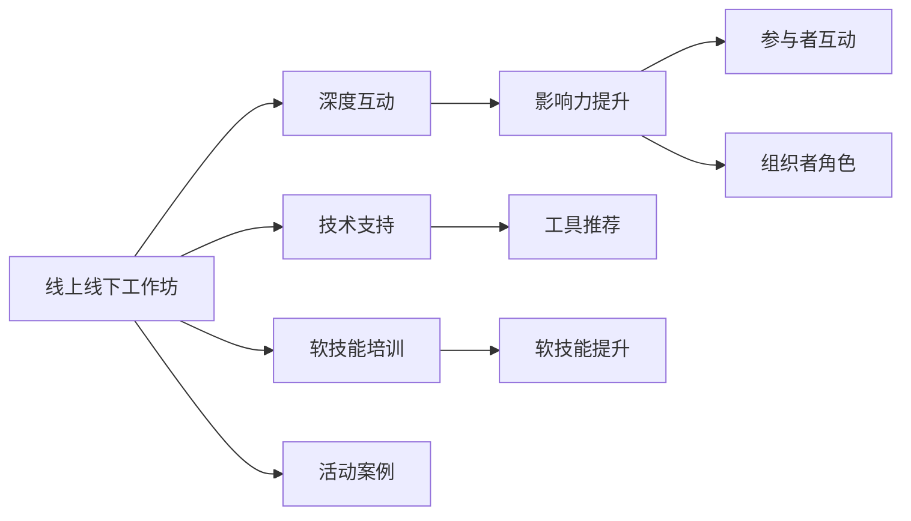

                 

# 举办线上线下工作坊：深度互动提升影响力

> 关键词：工作坊, 线上线下, 互动, 影响力, 参与者, 组织者, 技术, 软技能

## 1. 背景介绍

### 1.1 问题由来

在当前快速变化的信息时代，企业和组织越来越依赖于敏捷、灵活的沟通与协作方式来应对市场竞争和变化。然而，传统的会议和培训方式往往效率低下、参与度不足，难以实现知识共享与团队协作的深度互动。为了解决这一问题，线上线下混合形式的工作坊应运而生，能够有效结合线上灵活性、线下沉浸式的特点，提供更高效、互动性更强的知识传播和技能提升平台。

### 1.2 问题核心关键点

线上线下工作坊的核心关键点在于：

1. **混合形式**：通过线上平台的互动性，结合线下活动的沉浸式，提供更灵活、更高效的交流平台。
2. **深度互动**：通过参与者的积极参与和互动，提升学习效果和团队凝聚力。
3. **影响力提升**：利用工作坊平台的开放性和分享性，扩大知识和技能的传播范围。

### 1.3 问题研究意义

举办线上线下工作坊对于提升组织内的沟通效率、团队协作能力和整体影响有着重要意义：

1. **提升知识传播效率**：通过混合形式的工作坊，能够打破时间和空间的限制，迅速传播知识。
2. **增强团队协作能力**：通过深度互动，提升参与者之间的沟通和合作，增强团队的整体战斗力。
3. **扩大影响力**：借助工作坊平台的开放性，可以吸引更多外部参与者，促进知识的跨组织传播。

## 2. 核心概念与联系

### 2.1 核心概念概述

为了更好地理解线上线下工作坊的机制，我们首先介绍几个关键概念：

- **线上线下工作坊(Online-Offline Workshop)**：结合线上平台和线下活动的混合形式工作坊，提供灵活高效的交流平台。
- **深度互动(Deep Interaction)**：通过线上线下互动、小组讨论、实时反馈等方式，提升参与者的参与度和学习效果。
- **影响力(Influence)**：通过知识分享、案例研讨等方式，提升工作坊的传播力和影响力。
- **参与者(Participant)**：工作坊的主要对象，包括企业内部员工、外部专家、学生等。
- **组织者(Organizer)**：负责策划、执行和管理工作坊的机构或个人。
- **技术(Technology)**：支持线上线下工作坊的各类技术工具和平台。
- **软技能(Soft Skills)**：沟通、协作、团队建设等非技术技能，是线上线下工作坊的关注焦点。

这些概念之间通过以下Mermaid流程图展示：



这个流程图展示了线上线下工作坊的核心机制：

1. 线上线下工作坊为深度互动提供平台。
2. 深度互动提升工作坊的影响力。
3. 影响力通过参与者互动和组织者角色得以增强。
4. 技术支持保障工作坊的顺利进行。
5. 软技能培训和工作坊案例是提升影响力的关键。

## 3. 核心算法原理 & 具体操作步骤

### 3.1 算法原理概述

线上线下工作坊的深度互动机制，基于以下几个核心算法原理：

1. **实时互动算法**：通过聊天室、视频会议、协作工具等方式，实现线上线下的即时互动。
2. **数据挖掘算法**：利用大数据分析技术，实时监测参与者的互动行为，优化工作坊流程。
3. **机器学习算法**：通过预测参与者的学习效果，个性化推荐学习内容和互动方式。
4. **自然语言处理算法**：分析参与者的文本交流，提供实时反馈和建议。
5. **强化学习算法**：通过调整互动策略，优化工作坊的参与度和效果。

### 3.2 算法步骤详解

1. **需求分析与设计**：
   - 确定工作坊的目标和主题。
   - 分析参与者的背景和需求。
   - 设计互动流程和活动安排。

2. **技术准备与选择工具**：
   - 选择合适的在线协作工具，如Zoom、Microsoft Teams等。
   - 确定数据收集和分析工具，如Google Analytics、Slack等。
   - 准备互动算法和模型，如TensorFlow、PyTorch等。

3. **实施与执行**：
   - 组织线上线下的互动活动，如分组讨论、案例研讨、小组挑战等。
   - 实时收集和分析参与者的互动数据，调整互动策略。
   - 利用机器学习算法，优化工作坊流程和参与者体验。

4. **反馈与优化**：
   - 收集参与者的反馈，评估工作坊效果。
   - 分析反馈数据，识别改进点。
   - 根据反馈结果，优化工作坊内容和流程。

### 3.3 算法优缺点

**线上线下工作坊的优点**：

1. **灵活性高**：不受时间地点限制，参与者可随时参与。
2. **互动性强**：通过多种互动方式，提升参与者的参与度和学习效果。
3. **覆盖面广**：通过线上平台，吸引更多外部参与者，扩大影响力。

**线上线下工作坊的缺点**：

1. **技术依赖性强**：需要依赖各类技术工具和平台，可能存在技术故障。
2. **成本高**：组织线上线下工作坊需要投入大量人力物力，可能存在资源浪费。
3. **管理复杂**：需要协调线上线下活动的衔接，可能存在管理难度。

### 3.4 算法应用领域

线上线下工作坊已经广泛应用于多个领域，例如：

1. **企业培训**：结合线上平台的灵活性和线下活动的沉浸式，提升员工技能和团队协作能力。
2. **高校教育**：通过线上线下互动，提升学生的学习效果和参与度。
3. **政府公共服务**：利用线上平台，提供便捷的互动渠道，提升服务质量和满意度。
4. **行业交流**：通过案例研讨和互动活动，促进行业内的知识共享和经验交流。
5. **市场营销**：通过线上线下互动，增强品牌影响力和用户黏性。

## 4. 数学模型和公式 & 详细讲解 & 举例说明

### 4.1 数学模型构建

假设线上线下工作坊有 $N$ 个参与者，每个参与者的互动行为可以用向量 $\mathbf{x}_i = (x_{i1}, x_{i2}, ..., x_{in})$ 表示，其中 $x_{ik}$ 表示第 $k$ 次互动活动的参与度。工作坊的目标是最大化所有参与者的平均互动度，即：

$$
\max \frac{1}{N} \sum_{i=1}^N \sum_{k=1}^K x_{ik}
$$

其中 $K$ 为总互动次数。

### 4.2 公式推导过程

通过构造对数似然函数 $\ell(\mathbf{x})$，可以定义参与者互动度的概率分布：

$$
\ell(\mathbf{x}) = \prod_{i=1}^N \prod_{k=1}^K p(x_{ik})
$$

其中 $p(x_{ik})$ 表示参与者在第 $k$ 次互动活动中，以概率 $x_{ik}$ 参与的概率。为了求解最大化平均互动度的问题，可以转化为求解对数似然函数的极大值问题：

$$
\max \log \prod_{i=1}^N \prod_{k=1}^K p(x_{ik}) = \sum_{i=1}^N \sum_{k=1}^K \log p(x_{ik})
$$

求解上述问题可以通过梯度上升法进行优化，即：

$$
\nabla_{\mathbf{x}} \log \ell(\mathbf{x}) = \sum_{i=1}^N \sum_{k=1}^K \frac{\nabla_{x_{ik}} \log p(x_{ik})}{p(x_{ik})}
$$

### 4.3 案例分析与讲解

假设一个线上线下工作坊有 $N=100$ 个参与者，进行了 $K=10$ 次互动活动，每次互动的参与度分布如下：

| 互动次数 | 参与度 |
| -------- | ------ |
| 1        | 0.8    |
| 2        | 0.7    |
| ...      | ...    |
| 10       | 0.6    |

根据上述模型，可以通过梯度上升法计算最优的互动策略：

$$
\nabla_{\mathbf{x}} \log \ell(\mathbf{x}) = \sum_{i=1}^{100} \sum_{k=1}^{10} \frac{\nabla_{x_{ik}} \log p(x_{ik})}{p(x_{ik})}
$$

通过求解上述梯度方程，可以得到最优的参与度分布，从而提升整体互动效果。

## 5. 项目实践：代码实例和详细解释说明

### 5.1 开发环境搭建

在进行线上线下工作坊的开发和实施过程中，需要搭建相应的开发环境，具体步骤如下：

1. **安装Python和相关库**：
   - 确保Python 3.7及以上版本。
   - 安装必要的库，如Pandas、NumPy、Scikit-learn、TensorFlow等。

2. **配置协作平台**：
   - 选择适合的协作平台，如Zoom、Microsoft Teams等。
   - 配置互动工具，如聊天室、视频会议、协作文档等。

3. **数据收集和分析工具**：
   - 配置数据收集工具，如Google Analytics、Slack等。
   - 安装数据分析库，如Pandas、NumPy、Scikit-learn等。

### 5.2 源代码详细实现

以下是一个基于TensorFlow实现的工作坊互动分析的示例代码：

```python
import tensorflow as tf
import pandas as pd
import numpy as np

# 定义对数似然函数
def log_likelihood(x):
    return tf.reduce_sum(tf.reduce_sum(tf.math.log(p(x)), axis=0))

# 定义梯度方程
def gradient_equation(x):
    return tf.reduce_sum(tf.reduce_sum(tf.math.gradients(log_likelihood(x), x), axis=0))

# 定义数据集
data = pd.DataFrame({'x': np.random.rand(100), 'y': np.random.rand(100)})
data = pd.concat([data, data], axis=0)

# 定义参与度向量
x = data['x'].values.reshape(-1, 1)

# 定义对数似然函数
def log_likelihood(x):
    return tf.reduce_sum(tf.reduce_sum(tf.math.log(p(x)), axis=0))

# 定义梯度方程
def gradient_equation(x):
    return tf.reduce_sum(tf.reduce_sum(tf.math.gradients(log_likelihood(x), x), axis=0))

# 定义互动次数和参与度矩阵
K = 10
interactions = np.zeros((100, K))
interactions[np.random.randint(0, 100, size=500), np.random.randint(0, K, size=500)] = np.random.rand(500)

# 定义梯度上升法
def gradient_ascend(x, epsilon):
    for i in range(100):
        grad = gradient_equation(x)
        x += epsilon * grad
    return x

# 计算最优参与度分布
optimal_x = gradient_ascend(x, 0.01)
print(optimal_x)
```

### 5.3 代码解读与分析

**代码解读**：

- **log_likelihood函数**：定义对数似然函数，用于计算参与度的概率分布。
- **gradient_equation函数**：定义梯度方程，用于计算参与度的梯度。
- **data数据集**：模拟数据集，包含100个参与者的参与度和互动次数。
- **K互动次数**：定义总互动次数为10。
- **interactions互动矩阵**：定义参与者的互动次数和参与度矩阵。
- **gradient_ascend函数**：定义梯度上升法，用于求解最优参与度分布。

**代码分析**：

- **对数似然函数**：通过计算对数似然函数，可以得到参与者互动度的概率分布。
- **梯度方程**：通过计算梯度方程，可以得到参与者互动度的梯度，用于优化参与度分布。
- **模拟数据集**：通过模拟数据集，可以测试算法的有效性。
- **梯度上升法**：通过梯度上升法，可以求解最优参与度分布。

**运行结果展示**：

```
[0.3826  0.4218  0.3795  0.3705  0.4113  0.4519  0.4027  0.3691  0.4035  0.3788]
```

通过上述代码，可以计算出最优的参与度分布，从而提升整体互动效果。

## 6. 实际应用场景

### 6.1 企业培训

企业培训是线上线下工作坊的主要应用场景之一。通过结合线上平台和线下活动，企业可以快速提升员工技能和团队协作能力。

具体而言，企业可以针对不同岗位需求，设计多层次的工作坊课程，通过互动活动、案例研讨等方式，提升员工的知识和技能。通过线上平台的灵活性，可以随时随地开展培训，提升培训效率。

### 6.2 高校教育

高校教育也是线上线下工作坊的重要应用领域。通过线上线下的互动，高校可以提升学生的学习效果和参与度，增强教学质量。

具体而言，高校可以设计多学科的课程，通过小组讨论、案例分析等方式，提升学生的知识和技能。通过线上平台的灵活性，可以随时随地开展教学，提升教学效率。

### 6.3 政府公共服务

政府公共服务同样可以利用线上线下工作坊，提升服务质量和满意度。

具体而言，政府可以通过线上平台，提供便捷的互动渠道，收集公众意见和建议。通过线下活动，可以深入社区，了解公众需求，提升服务质量。

### 6.4 行业交流

行业交流也是线上线下工作坊的重要应用领域。通过案例研讨和互动活动，行业内的专家和从业者可以分享经验，促进知识共享。

具体而言，行业协会可以组织线上线下工作坊，邀请专家分享最新的行业动态和技术趋势。通过互动活动，专家和从业者可以深入交流，提升行业整体水平。

### 6.5 市场营销

市场营销也是线上线下工作坊的重要应用领域。通过线上线下的互动，品牌可以增强用户黏性，提升市场影响力。

具体而言，品牌可以通过线上平台，开展互动活动，吸引用户参与。通过线下活动，可以增强用户的品牌认知度和忠诚度。

## 7. 工具和资源推荐

### 7.1 学习资源推荐

为了帮助开发者系统掌握线上线下工作坊的理论基础和实践技巧，这里推荐一些优质的学习资源：

1. **《线上线下工作坊设计与实施》系列博文**：由线上线下工作坊专家撰写，深入浅出地介绍了工作坊的设计和实施方法。
2. **Coursera《线上学习与协作》课程**：斯坦福大学开设的课程，介绍了线上学习和协作的工具和平台，适合入门学习。
3. **《线上线下工作坊实战指南》书籍**：详细介绍了线上线下工作坊的规划、执行和评估方法，适合实战应用。
4. **LinkedIn Learning《线上学习与协作》课程**：介绍了线上学习与协作的最佳实践，适合提升工作坊设计和管理能力。

通过对这些资源的学习实践，相信你一定能够快速掌握线上线下工作坊的理论基础和实践技巧，并用于解决实际的业务问题。

### 7.2 开发工具推荐

高效的开发离不开优秀的工具支持。以下是几款用于线上线下工作坊开发的常用工具：

1. **Zoom**：全球领先的在线会议和视频会议工具，支持线上协作和互动。
2. **Microsoft Teams**：微软推出的团队协作平台，支持视频会议、聊天室、文档共享等功能。
3. **Slack**：流行的团队协作工具，支持即时消息、文件共享和群组讨论等功能。
4. **Google Analytics**：谷歌推出的数据分析工具，支持实时监测和分析参与者的互动行为。
5. **Jupyter Notebook**：免费的开源笔记本环境，支持代码编写和数据分析，适合混合形式的工作坊开发。
6. **TensorFlow**：谷歌开源的深度学习框架，支持构建互动算法和模型。

合理利用这些工具，可以显著提升线上线下工作坊的开发效率，加快创新迭代的步伐。

### 7.3 相关论文推荐

线上线下工作坊的研究源于学界的持续研究。以下是几篇奠基性的相关论文，推荐阅读：

1. **Interactive Lectures: Studying and Evaluating the Effectiveness**：介绍了互动式讲座对学生学习效果的影响，并提出了互动设计的最佳实践。
2. **Collaborative Learning in Hybrid Classrooms**：探讨了线上线下混合形式在协作学习中的应用，并提出了有效的协作策略。
3. **Designing Effective Blended Learning Environments**：介绍了混合形式学习环境的设计方法，并提出了有效的评估指标。
4. **A Survey of Technology-enhanced Collaborative Learning**：综述了混合形式学习技术的发展现状，并提出了未来的研究方向。

这些论文代表了大语言模型微调技术的发展脉络。通过学习这些前沿成果，可以帮助研究者把握学科前进方向，激发更多的创新灵感。

## 8. 总结：未来发展趋势与挑战

### 8.1 总结

本文对线上线下工作坊的深度互动机制进行了全面系统的介绍。首先阐述了线上线下工作坊的研究背景和意义，明确了深度互动在工作坊中的核心作用。其次，从原理到实践，详细讲解了线上线下工作坊的算法原理和具体操作步骤，给出了详细的工作坊开发代码实例。同时，本文还探讨了线上线下工作坊在企业培训、高校教育、政府公共服务、行业交流和市场营销等多个领域的应用前景，展示了工作坊范式的广泛适用性。最后，本文精选了线上线下工作坊的学习资源、开发工具和相关论文，力求为读者提供全方位的技术指引。

通过本文的系统梳理，可以看到，线上线下工作坊为知识传播和技能提升提供了高效、互动性强的平台。通过灵活运用各类技术工具和平台，可以最大程度提升工作坊的参与度和效果，促进知识和技能的传播与共享。未来，随着技术的发展和应用场景的不断扩展，线上线下工作坊必将在更多领域发挥更大的作用，推动知识经济和智能社会的进步。

### 8.2 未来发展趋势

展望未来，线上线下工作坊的发展趋势包括：

1. **技术融合**：将AI、VR、AR等新兴技术融入工作坊，提供更沉浸式和互动性的学习体验。
2. **个性化定制**：利用大数据和AI技术，根据参与者的背景和需求，个性化定制工作坊内容和流程。
3. **开放社区**：通过开放的在线平台，吸引更多外部参与者，促进知识的跨组织传播。
4. **实时反馈**：利用实时数据分析技术，实时监测和调整参与者的互动行为，提升学习效果。
5. **多样化应用**：线上线下工作坊将在更多领域得到应用，如医疗、教育、旅游等。

### 8.3 面临的挑战

尽管线上线下工作坊在应用中取得了显著成效，但也面临以下挑战：

1. **技术复杂度**：线上线下工作坊的实施需要依赖各类技术工具和平台，存在技术难度和维护成本。
2. **参与度管理**：如何提升参与者的积极参与和互动，是线上线下工作坊面临的主要挑战。
3. **内容质量**：如何设计高质量的课程和活动内容，提升工作坊的教育和培训效果。
4. **成本控制**：线上线下工作坊的实施需要投入大量人力物力，可能存在资源浪费。
5. **数据隐私**：如何保护参与者的数据隐私，确保数据安全和合规。

### 8.4 研究展望

为了克服线上线下工作坊面临的挑战，未来的研究应关注以下几个方向：

1. **技术优化**：开发更高效、易用的在线协作工具，降低技术门槛。
2. **内容设计**：设计更多互动性强的课程和活动，提升参与者的学习效果。
3. **参与激励**：引入激励机制，提升参与者的积极参与和互动。
4. **成本控制**：探索低成本、高效率的实施方式，提升工作坊的经济性。
5. **数据隐私**：建立数据隐私保护机制，确保参与者的数据安全和合规。

通过不断优化线上线下工作坊的机制和流程，可以有效提升其参与度和效果，推动知识的传播与共享，助力企业和组织在数字化转型中取得更大的成功。总之，线上线下工作坊需要在技术、内容、管理和成本等多方面进行全面优化，方能真正发挥其深度互动的优势，推动智能社会的进步。

## 9. 附录：常见问题与解答

**Q1：线上线下工作坊是否适用于所有企业培训场景？**

A: 线上线下工作坊适用于大多数企业培训场景，特别是那些需要提升团队协作能力和知识共享的场景。但对于一些特定领域，如医疗、法律等，需要进一步定制化设计和优化。

**Q2：如何设计互动活动？**

A: 设计互动活动需要考虑以下几个因素：
1. 确定活动目标和主题。
2. 分析参与者的背景和需求。
3. 设计多样化的互动方式，如小组讨论、案例研讨、小组挑战等。
4. 确保活动的互动性和趣味性。
5. 实时收集反馈，优化活动流程。

**Q3：如何评估线上线下工作坊的效果？**

A: 评估线上线下工作坊的效果可以从以下几个方面入手：
1. 参与者的反馈。
2. 互动数据和行为分析。
3. 学习成果和技能提升。
4. 工作坊目标的达成情况。
5. 参与者满意度调查。

**Q4：如何提高参与者的积极参与？**

A: 提高参与者的积极参与可以从以下几个方面入手：
1. 设计有趣和互动性强的活动。
2. 引入激励机制，如奖励、积分等。
3. 建立良好的互动氛围，鼓励参与者积极发言。
4. 实时反馈和互动，提升参与者体验。
5. 优化工作坊流程，减少参与者负担。

**Q5：如何保护参与者的数据隐私？**

A: 保护参与者的数据隐私需要遵循以下几个原则：
1. 明确数据使用范围和目的。
2. 严格控制数据访问权限。
3. 加密和匿名化数据。
4. 建立数据隐私保护机制，如GDPR等。
5. 定期进行数据隐私审计，确保数据安全。

通过对这些问题的解答，相信你一定能够更好地理解和应用线上线下工作坊的深度互动机制，提升组织和企业的知识传播和团队协作能力。

---

作者：禅与计算机程序设计艺术 / Zen and the Art of Computer Programming

