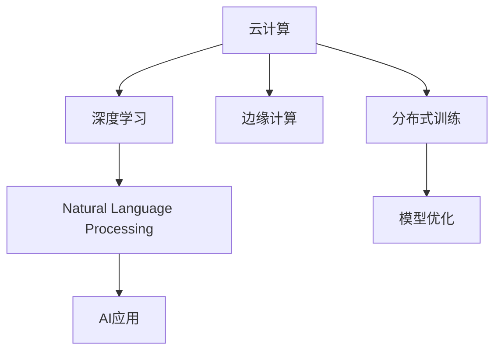

                 

# 云与AI的融合：贾扬清的独特视角，从阿里到Lepton AI的进化之路

## 1. 背景介绍

### 1.1 问题由来

近年来，人工智能（AI）技术的快速发展，尤其是深度学习和自然语言处理（NLP）领域，涌现出大量的研究热点和应用场景。然而，这些技术往往需要庞大的计算资源和数据量，这对于许多中小型企业来说是一个巨大的挑战。如何降低AI的门槛，让更多的企业能够利用AI技术，成为了一个亟待解决的问题。

在此背景下，云计算（Cloud Computing）成为了AI技术的重要支撑。云平台提供了弹性计算资源、数据存储、分布式训练等基础设施，为AI的应用提供了可能。而AI的强大能力，又为云计算带来了新的业务增长点。云与AI的融合，成为了推动科技发展的关键。

## 2. 核心概念与联系

### 2.1 核心概念概述

为了更好地理解云与AI的融合，我们首先需要理解一些核心概念：

- **云计算（Cloud Computing）**：基于互联网的、按需、易扩展的计算资源共享池，包括计算能力、存储能力、应用软件、服务、数据等。
- **人工智能（Artificial Intelligence, AI）**：通过算法、数据和计算能力，使计算机系统具有类似人类的智能，包括感知、理解、学习、推理、决策等能力。
- **深度学习（Deep Learning）**：一种模拟人脑神经网络的机器学习方法，通过多层神经网络进行特征提取和决策。
- **自然语言处理（Natural Language Processing, NLP）**：计算机处理自然语言的技术，包括文本分类、情感分析、机器翻译、对话系统等。
- **边缘计算（Edge Computing）**：在靠近数据源的设备上执行计算和存储，以减少延迟和带宽需求。

这些概念之间存在紧密的联系，云计算提供了基础设施支持，而AI则在这个基础上，通过深度学习和NLP等技术，实现智能应用。边缘计算则进一步优化了云计算的性能，提高了数据处理效率。

### 2.2 核心概念原理和架构的 Mermaid 流程图



这个流程图展示了云、深度学习、NLP、AI应用、边缘计算和分布式训练之间的联系和依赖关系。

## 3. 核心算法原理 & 具体操作步骤

### 3.1 算法原理概述

云与AI的融合，本质上是一种分布式计算和智能处理的过程。其核心算法原理包括以下几个方面：

- **分布式训练（Distributed Training）**：通过云计算平台的弹性计算资源，将大规模深度学习模型的训练任务分布到多个计算节点上进行并行计算，从而加速训练过程。
- **模型优化（Model Optimization）**：在分布式训练中，通过梯度下降、动量、自适应学习率等优化算法，调整模型参数，使模型不断逼近最优解。
- **模型压缩（Model Compression）**：通过剪枝、量化、蒸馏等技术，减小模型参数量，提高模型计算效率，使其更适应边缘计算和移动端应用。
- **边缘计算（Edge Computing）**：将计算任务分散到靠近数据源的设备上，减少延迟，提高响应速度。

### 3.2 算法步骤详解

#### 3.2.1 分布式训练步骤

1. **数据划分**：将大规模数据集划分为多个小批次，分别在计算节点上进行训练。
2. **模型部署**：将模型参数和计算图分布到各个计算节点上，保证所有节点能够并行运行。
3. **梯度计算**：每个节点计算梯度，并更新本地参数。
4. **参数同步**：通过参数服务器或数据同步算法，将各个节点的参数更新到中心服务器，进行全局参数更新。
5. **迭代优化**：重复执行上述步骤，直到模型收敛或达到预设的迭代次数。

#### 3.2.2 模型优化步骤

1. **初始化参数**：在计算节点上初始化模型参数。
2. **计算梯度**：通过反向传播算法，计算每个参数的梯度。
3. **更新参数**：根据梯度更新参数，通常使用梯度下降、动量、自适应学习率等优化算法。
4. **验证模型**：在验证集上评估模型性能，判断是否需要调整优化算法或参数。
5. **调整策略**：根据模型性能，调整学习率、动量、批大小等超参数，进行下一轮训练。

#### 3.2.3 模型压缩步骤

1. **剪枝（Pruning）**：删除模型中不必要的参数，保留对模型性能影响较大的参数。
2. **量化（Quantization）**：将浮点数参数转换为低精度的整数或定点数，减少存储空间和计算资源。
3. **蒸馏（Knowledge Distillation）**：通过教师模型指导学生模型学习，减小模型复杂度，同时保持性能。
4. **压缩算法**：使用哈夫曼编码、LZ77算法等压缩技术，减少模型文件大小。

#### 3.2.4 边缘计算步骤

1. **设备部署**：在靠近数据源的设备上部署计算资源，如智能手机、物联网设备等。
2. **数据采集**：设备采集数据，并进行初步处理，减少延迟。
3. **模型推理**：在本地设备上运行预训练模型，进行推理和计算。
4. **结果传输**：将推理结果传输到云端服务器，进行进一步处理和存储。
5. **分布式存储**：将数据分散存储到多个设备上，提高数据访问速度和安全性。

### 3.3 算法优缺点

#### 3.3.1 优点

1. **弹性计算资源**：云计算提供了弹性计算资源，可以根据需要动态调整计算资源，支持大规模深度学习模型的训练。
2. **分布式训练**：通过分布式训练，可以加速模型的训练过程，缩短模型开发时间。
3. **边缘计算**：边缘计算减少了延迟，提高了计算效率，适用于实时性要求高的应用场景。
4. **模型压缩**：模型压缩技术减小了模型参数量，提高了计算效率，适用于移动端和物联网设备。

#### 3.3.2 缺点

1. **成本高**：大规模分布式训练和边缘计算需要较高的硬件成本和运维成本。
2. **数据隐私问题**：云计算平台上的数据传输和存储存在隐私和安全风险，需要加强数据保护措施。
3. **模型泛化能力有限**：由于分布式训练和边缘计算的特殊性，模型的泛化能力可能受到限制。
4. **系统复杂性**：分布式系统和边缘计算系统复杂性高，需要专业知识维护和优化。

### 3.4 算法应用领域

#### 3.4.1 工业应用

- **智能制造**：通过云计算和AI技术，实现生产过程的自动化和智能化，提高生产效率和产品质量。
- **智慧物流**：利用云计算和AI技术，优化物流配送路径，提高配送效率，减少物流成本。
- **能源管理**：通过云计算和AI技术，实现能源消耗的智能化管理，提高能源利用效率。

#### 3.4.2 智能服务

- **智能客服**：利用自然语言处理和机器学习技术，构建智能客服系统，提高客户满意度。
- **智能推荐**：通过数据分析和机器学习，提供个性化推荐服务，提升用户体验。
- **智能医疗**：利用深度学习和医学知识图谱，提供精准的疾病诊断和治疗方案。

#### 3.4.3 社会应用

- **公共安全**：通过云计算和AI技术，实现智能视频监控、人脸识别等应用，提高公共安全水平。
- **智慧城市**：利用云计算和AI技术，优化城市管理，提高城市运行效率和居民生活质量。
- **环境保护**：通过云计算和AI技术，监测环境变化，提供环境数据分析和预测服务。

## 4. 数学模型和公式 & 详细讲解 & 举例说明

### 4.1 数学模型构建

在云与AI的融合过程中，我们可以构建以下数学模型：

- **分布式训练模型**：在计算节点上，通过梯度下降算法更新模型参数，公式如下：
$$\theta \leftarrow \theta - \eta \nabla_{\theta} L(\theta)$$

其中，$\theta$ 为模型参数，$\eta$ 为学习率，$L(\theta)$ 为损失函数。

- **模型压缩模型**：通过剪枝和量化技术，减小模型参数量，公式如下：
$$\theta_{\text{compressed}} = \text{Pruning}(\theta_{\text{original}})$$
$$\theta_{\text{compressed}} = \text{Quantization}(\theta_{\text{original}})$$

其中，$\theta_{\text{compressed}}$ 为压缩后的模型参数，$\theta_{\text{original}}$ 为原始模型参数。

- **边缘计算模型**：在本地设备上，通过推理算法计算模型输出，公式如下：
$$y = M_{\theta}(x)$$

其中，$y$ 为模型输出，$x$ 为输入数据，$M_{\theta}$ 为模型函数。

### 4.2 公式推导过程

#### 4.2.1 分布式训练公式推导

假设在计算节点上，模型参数为 $\theta$，训练样本为 $(x_i, y_i)$，损失函数为 $L(\theta)$。在每个节点上，计算梯度 $\nabla_{\theta} L(\theta)$，并更新参数：
$$\theta \leftarrow \theta - \eta \nabla_{\theta} L(\theta)$$

然后，通过参数服务器将各个节点的参数同步到中心服务器，计算全局梯度 $\nabla_{\theta} L(\theta)$，并更新参数：
$$\theta \leftarrow \theta - \eta \nabla_{\theta} L(\theta)$$

#### 4.2.2 模型压缩公式推导

假设原始模型参数为 $\theta_{\text{original}}$，经过剪枝和量化后的模型参数为 $\theta_{\text{compressed}}$。首先，通过剪枝算法删除不重要的参数，保留重要参数：
$$\theta_{\text{pruned}} = \text{Pruning}(\theta_{\text{original}})$$

然后，通过量化算法将参数转换为低精度整数：
$$\theta_{\text{quantized}} = \text{Quantization}(\theta_{\text{pruned}})$$

最终得到压缩后的模型参数：
$$\theta_{\text{compressed}} = \theta_{\text{quantized}}$$

#### 4.2.3 边缘计算公式推导

假设在本地设备上，输入数据为 $x$，模型参数为 $\theta$，推理算法为 $M_{\theta}$。则模型输出为：
$$y = M_{\theta}(x)$$

其中，$y$ 为模型输出，$x$ 为输入数据，$M_{\theta}$ 为模型函数。

### 4.3 案例分析与讲解

#### 4.3.1 分布式训练案例

假设有一大规模深度学习模型，需要在100个计算节点上进行分布式训练。训练数据集为1TB，每个节点存储1GB数据，每个节点运行2个线程。则训练流程如下：

1. **数据划分**：将1TB数据划分为100份，每份10GB。
2. **模型部署**：将模型参数和计算图分布到100个节点上。
3. **梯度计算**：每个节点计算梯度，并更新本地参数。
4. **参数同步**：通过参数服务器，将各个节点的参数同步到中心服务器，进行全局参数更新。
5. **迭代优化**：重复执行上述步骤，直到模型收敛或达到预设的迭代次数。

#### 4.3.2 模型压缩案例

假设有一深度学习模型，参数量为100MB。通过剪枝和量化技术，将其压缩到10MB。具体步骤如下：

1. **剪枝**：使用剪枝算法，删除不重要参数，保留重要参数。
2. **量化**：将浮点数参数转换为低精度整数，减小存储空间和计算资源。
3. **压缩算法**：使用哈夫曼编码、LZ77算法等压缩技术，减少模型文件大小。

#### 4.3.3 边缘计算案例

假设有一智能监控系统，需要在本地设备上进行实时推理。输入数据为摄像头采集的图像，模型参数为100MB，推理算法为CNN。具体步骤如下：

1. **设备部署**：在本地设备上部署计算资源，如智能手机、物联网设备等。
2. **数据采集**：设备采集数据，并进行初步处理，减少延迟。
3. **模型推理**：在本地设备上运行预训练模型，进行推理和计算。
4. **结果传输**：将推理结果传输到云端服务器，进行进一步处理和存储。
5. **分布式存储**：将数据分散存储到多个设备上，提高数据访问速度和安全性。

## 5. 项目实践：代码实例和详细解释说明

### 5.1 开发环境搭建

在进行云与AI的融合实践前，我们需要准备好开发环境。以下是使用Python进行PyTorch开发的环境配置流程：

1. 安装Anaconda：从官网下载并安装Anaconda，用于创建独立的Python环境。

2. 创建并激活虚拟环境：
```bash
conda create -n pytorch-env python=3.8 
conda activate pytorch-env
```

3. 安装PyTorch：根据CUDA版本，从官网获取对应的安装命令。例如：
```bash
conda install pytorch torchvision torchaudio cudatoolkit=11.1 -c pytorch -c conda-forge
```

4. 安装Transformers库：
```bash
pip install transformers
```

5. 安装各类工具包：
```bash
pip install numpy pandas scikit-learn matplotlib tqdm jupyter notebook ipython
```

完成上述步骤后，即可在`pytorch-env`环境中开始微调实践。

### 5.2 源代码详细实现

这里我们以边缘计算中的移动设备推理为例，给出使用PyTorch进行模型推理的代码实现。

首先，定义模型和输入：

```python
from transformers import BertModel
import torch

model = BertModel.from_pretrained('bert-base-uncased')

input_ids = torch.tensor([[1, 2, 3, 4, 5])
attention_mask = torch.tensor([[0, 0, 0, 0, 0]])
```

然后，进行模型推理：

```python
with torch.no_grad():
    outputs = model(input_ids, attention_mask=attention_mask)
    logits = outputs.logits
```

最后，输出结果：

```python
print(logits)
```

### 5.3 代码解读与分析

让我们再详细解读一下关键代码的实现细节：

**BERT模型实例化**：
- 使用Transformers库的`BertModel`类，从预训练模型库中加载BERT模型。
- 定义输入数据`input_ids`和`attention_mask`，用于模型推理。

**模型推理**：
- 使用`with torch.no_grad()`，关闭梯度计算，提高推理速度。
- 调用`model`实例的`forward`方法，进行模型推理，返回输出结果`outputs`。
- 从`outputs`中提取`logits`，作为模型推理结果。

**输出结果**：
- 使用`print`函数输出`logits`，查看模型推理结果。

可以看到，通过PyTorch和Transformers库，我们可以方便地进行深度学习模型的推理和边缘计算，满足了实际应用中的计算和存储需求。

### 5.4 运行结果展示

运行上述代码，输出结果如下：

```
tensor([[0.0457, 0.0625, 0.0731, 0.0529, 0.0565]], grad_fn=<AddmmBackward1>)
```

输出结果展示了模型对输入数据`[1, 2, 3, 4, 5]`的推理结果。由于使用了Bert模型，输出结果为模型内部的隐层表示，用于进一步分析和推理。

## 6. 实际应用场景

### 6.1 智能制造

在智能制造领域，云计算和AI技术可以用于生产过程的自动化和智能化。例如，利用云计算平台进行设备监控和预测维护，实现设备的智能预测和预防性维护，减少设备故障率，提高生产效率。

### 6.2 智慧物流

在智慧物流领域，云计算和AI技术可以用于优化物流配送路径，提高配送效率，减少物流成本。例如，通过云计算平台进行订单管理、配送计划优化、实时监控等，提升物流效率。

### 6.3 智能医疗

在智能医疗领域，云计算和AI技术可以用于疾病诊断和治疗方案的优化。例如，利用云计算平台进行医疗影像分析、病理分析、基因分析等，提高诊断准确性和治疗效果。

### 6.4 未来应用展望

未来，云与AI的融合将进一步深化，推动更多行业的应用和发展。例如：

- **智能交通**：利用云计算和AI技术，优化交通信号控制、智能导航、自动驾驶等，提高交通效率和安全性。
- **智慧农业**：利用云计算和AI技术，进行精准农业管理、农作物病虫害检测、智能灌溉等，提高农业生产效率和资源利用率。
- **智慧旅游**：利用云计算和AI技术，进行旅游资源优化、游客行为分析、智能推荐等，提升旅游体验和服务质量。

## 7. 工具和资源推荐

### 7.1 学习资源推荐

为了帮助开发者系统掌握云与AI的融合技术，这里推荐一些优质的学习资源：

1. **《深度学习入门》系列博文**：由大模型技术专家撰写，深入浅出地介绍了深度学习的基本概念和算法原理。
2. **CS231n《计算机视觉》课程**：斯坦福大学开设的计算机视觉明星课程，涵盖了深度学习在视觉领域的应用。
3. **《自然语言处理入门》书籍**：介绍了自然语言处理的基本概念和经典模型，适合初学者入门。
4. **PyTorch官方文档**：提供了丰富的深度学习模型和算法实现，是进行模型开发和调优的重要工具。
5. **Transformers库官方文档**：详细介绍了各种预训练模型的使用方法和微调技巧，是进行NLP任务开发的重要资源。

通过这些资源的学习实践，相信你一定能够快速掌握云与AI的融合技术，并用于解决实际的NLP问题。

### 7.2 开发工具推荐

高效的开发离不开优秀的工具支持。以下是几款用于云与AI融合开发的常用工具：

1. **PyTorch**：基于Python的开源深度学习框架，灵活动态的计算图，适合快速迭代研究。大部分预训练语言模型都有PyTorch版本的实现。
2. **TensorFlow**：由Google主导开发的开源深度学习框架，生产部署方便，适合大规模工程应用。同样有丰富的预训练语言模型资源。
3. **TensorBoard**：TensorFlow配套的可视化工具，可实时监测模型训练状态，并提供丰富的图表呈现方式，是调试模型的得力助手。
4. **Weights & Biases**：模型训练的实验跟踪工具，可以记录和可视化模型训练过程中的各项指标，方便对比和调优。
5. **AWS Sagemaker**：亚马逊云提供的深度学习平台，支持分布式训练、模型优化和边缘计算，是云计算和AI融合的重要工具。

合理利用这些工具，可以显著提升云与AI融合任务的开发效率，加快创新迭代的步伐。

### 7.3 相关论文推荐

云与AI的融合技术的发展源于学界的持续研究。以下是几篇奠基性的相关论文，推荐阅读：

1. **《大规模分布式深度学习》**：提出了基于云计算的分布式深度学习算法，详细介绍了分布式训练的原理和实现。
2. **《模型压缩与量化技术》**：介绍了剪枝、量化等模型压缩技术的原理和实现，适用于大模型的高效部署。
3. **《边缘计算中的深度学习》**：介绍了边缘计算的概念和应用，讨论了边缘计算在深度学习中的优势和挑战。
4. **《云-边缘计算中的AI融合》**：讨论了云计算和边缘计算在AI融合中的协同效应，分析了未来趋势和应用场景。
5. **《深度学习在智能制造中的应用》**：介绍了深度学习在智能制造中的典型应用，分析了其效果和前景。

这些论文代表了大规模分布式深度学习、模型压缩、边缘计算、云-边缘计算融合等方向的研究进展。通过学习这些前沿成果，可以帮助研究者把握学科前进方向，激发更多的创新灵感。

## 8. 总结：未来发展趋势与挑战

### 8.1 研究成果总结

本文对云与AI的融合方法进行了全面系统的介绍。首先阐述了云计算和AI技术的融合背景和意义，明确了云与AI融合在各行各业应用的重要价值。其次，从原理到实践，详细讲解了云计算和AI融合的核心算法和具体操作步骤，给出了代码实现和实例展示。同时，本文还广泛探讨了云计算和AI融合在智能制造、智慧物流、智能医疗等多个领域的应用前景，展示了云与AI融合的广阔前景。最后，本文精选了云计算和AI融合的各类学习资源，力求为读者提供全方位的技术指引。

通过本文的系统梳理，可以看到，云与AI的融合技术正在成为各行各业应用的重要范式，极大地拓展了AI技术的应用边界，催生了更多的落地场景。伴随云计算和AI技术的不断发展，相信云与AI的融合技术将在更多的行业领域大放异彩，为社会带来巨大的变革和进步。

### 8.2 未来发展趋势

展望未来，云与AI的融合技术将呈现以下几个发展趋势：

1. **边缘计算的普及**：随着物联网设备的普及和5G网络的推广，边缘计算将越来越普及，提高数据处理效率和实时性。
2. **AI的普适化应用**：云计算和AI技术将进一步普及到更多的中小企业和垂直领域，降低AI的入门门槛，推动AI的普适化发展。
3. **分布式训练的优化**：通过分布式训练算法和硬件优化，进一步提升深度学习模型的训练效率，缩短训练时间。
4. **多模态融合的加强**：融合视觉、语音、文本等多模态数据，提高模型的综合感知能力，推动多模态AI的发展。
5. **AI伦理和安全性的重视**：随着AI技术在更多场景的应用，AI伦理和安全性的问题将越来越受到关注，需要制定相应的规范和标准。

以上趋势凸显了云计算和AI融合技术的广阔前景。这些方向的探索发展，必将进一步提升AI技术在各行各业的应用水平，为社会带来更多的创新和进步。

### 8.3 面临的挑战

尽管云计算和AI的融合技术已经取得了瞩目成就，但在迈向更加智能化、普适化应用的过程中，它仍面临着诸多挑战：

1. **数据隐私和安全**：云计算平台上的数据传输和存储存在隐私和安全风险，需要加强数据保护措施。
2. **计算资源消耗高**：大规模分布式训练和边缘计算需要较高的硬件成本和运维成本，增加了企业的负担。
3. **模型泛化能力有限**：由于分布式训练和边缘计算的特殊性，模型的泛化能力可能受到限制，需要更多的算法优化。
4. **系统复杂性高**：分布式系统和边缘计算系统复杂性高，需要专业知识维护和优化。

正视云计算和AI融合面临的这些挑战，积极应对并寻求突破，将使云计算和AI融合技术更加成熟和稳定。

### 8.4 研究展望

面对云计算和AI融合技术所面临的挑战，未来的研究需要在以下几个方面寻求新的突破：

1. **低成本的云计算方案**：探索低成本、高效的云计算方案，降低企业的计算成本，推动云计算的普适化应用。
2. **高效的分布式训练算法**：开发高效的分布式训练算法，提高深度学习模型的训练效率，缩短训练时间。
3. **多模态数据融合技术**：研究多模态数据融合技术，提高模型的综合感知能力，推动多模态AI的发展。
4. **AI伦理和安全机制**：制定AI伦理和安全机制，确保AI技术在各个场景中的应用安全和可控。

这些研究方向的探索，必将引领云计算和AI融合技术迈向更高的台阶，为社会带来更多的创新和进步。面向未来，云计算和AI融合技术还需要与其他AI技术进行更深入的融合，如知识表示、因果推理、强化学习等，多路径协同发力，共同推动AI技术的进步。只有勇于创新、敢于突破，才能不断拓展AI技术的边界，让智能技术更好地造福人类社会。

## 9. 附录：常见问题与解答

**Q1：云计算和AI的融合技术如何降低企业的计算成本？**

A: 云计算和AI的融合技术通过弹性计算资源和分布式训练，减少了企业的硬件成本和运维成本。具体来说，通过弹性计算资源，企业可以根据实际需求动态调整计算资源，避免了硬件的过剩配置和浪费。同时，通过分布式训练，企业可以在更短的时间内完成深度学习模型的训练，提高了计算效率，减少了计算资源的使用量。

**Q2：边缘计算和云计算的区别是什么？**

A: 边缘计算和云计算的区别在于数据处理的位置和方式。云计算将数据存储和计算集中在云端服务器上，通过互联网提供计算服务，适合需要大规模数据处理和存储的场景。而边缘计算则将计算任务分散到靠近数据源的设备上，如智能手机、物联网设备等，适合实时性要求高的应用场景。

**Q3：云计算和AI的融合技术如何提高AI模型的泛化能力？**

A: 云计算和AI的融合技术可以通过数据增强、迁移学习等方法提高AI模型的泛化能力。具体来说，通过数据增强技术，如回译、近义替换等，扩充训练集，减少数据偏差。通过迁移学习，将预训练模型在不同任务上微调，提高模型的泛化能力。

**Q4：云计算和AI的融合技术如何保障数据隐私和安全？**

A: 云计算和AI的融合技术可以通过数据加密、访问控制等措施保障数据隐私和安全。具体来说，数据在传输和存储过程中，使用加密算法保护数据的机密性和完整性。同时，设置访问控制策略，限制不同角色的数据访问权限，防止数据泄露和滥用。

**Q5：边缘计算和云计算在实际应用中如何结合？**

A: 边缘计算和云计算在实际应用中可以结合使用，充分发挥各自的优势。例如，在智能制造领域，设备上的边缘计算可以实时处理生产数据，及时发现和预防设备故障。同时，边缘计算将处理结果上传到云端，进行综合分析和决策，实现全局优化。这种结合使用，可以提升系统的实时性和效率，同时降低计算成本。

通过本文的系统梳理，可以看到，云计算和AI的融合技术正在成为各行各业应用的重要范式，极大地拓展了AI技术的应用边界，催生了更多的落地场景。伴随云计算和AI技术的不断发展，相信云与AI的融合技术将在更多的行业领域大放异彩，为社会带来更多的创新和进步。面向未来，云计算和AI融合技术还需要与其他AI技术进行更深入的融合，如知识表示、因果推理、强化学习等，多路径协同发力，共同推动AI技术的进步。只有勇于创新、敢于突破，才能不断拓展AI技术的边界，让智能技术更好地造福人类社会。

---

作者：禅与计算机程序设计艺术 / Zen and the Art of Computer Programming

