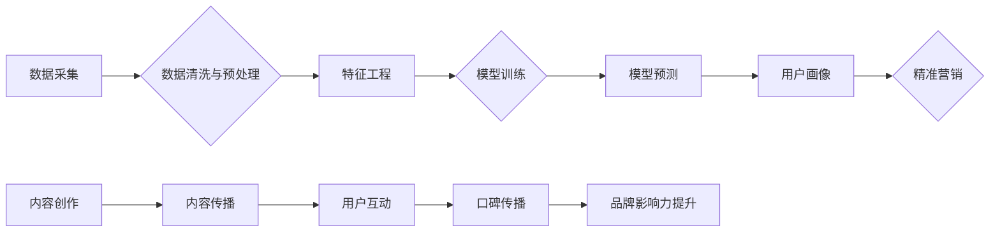

> 规模化、市场覆盖、火车、轮船、技术架构、数据驱动、机器学习、深度学习、云计算、大数据

## 1. 背景介绍

在当今数字时代，市场规模的不断扩大和用户需求的多样化，使得企业面临着如何有效地覆盖目标市场、触达用户、实现规模化增长的新挑战。传统的营销手段已经难以满足这一需求，企业需要寻求更先进、更有效的解决方案。

就像火车和轮船在交通运输领域扮演着不同的角色，在市场覆盖方面，也存在着两种不同的策略：

* **火车：** 代表着快速、高效、集中式的覆盖方式，例如，通过精准广告投放、社交媒体营销等手段，快速触达目标用户群体。
* **轮船：** 代表着稳健、持久、广域式的覆盖方式，例如，通过内容营销、社区运营、口碑传播等手段，持续积累用户，扩大市场影响力。

## 2. 核心概念与联系

**火车和轮船的对应关系：**

* **火车：** 对应于数据驱动、机器学习、深度学习等技术驱动的营销策略。
* **轮船：** 对应于内容营销、社区运营、口碑传播等用户体验驱动的营销策略。

**核心概念原理和架构：**



**核心概念联系：**

* 数据驱动和用户体验是两种互补的营销策略，两者可以相互促进，共同实现规模化市场覆盖。
* 数据驱动可以帮助企业更精准地定位目标用户，提供个性化的服务，提升用户体验。
* 用户体验可以帮助企业积累用户口碑，扩大品牌影响力，形成良性循环。

## 3. 核心算法原理 & 具体操作步骤

### 3.1  算法原理概述

数据驱动营销的核心算法主要包括：

* **机器学习算法：** 用于从海量数据中学习用户行为模式，预测用户需求，实现精准营销。
* **深度学习算法：** 用于处理复杂的数据结构，例如文本、图像、视频等，实现更精准的用户画像和个性化推荐。

### 3.2  算法步骤详解

**机器学习算法步骤：**

1. **数据采集：** 收集用户行为数据，例如浏览记录、购买记录、评论记录等。
2. **数据清洗与预处理：** 清理数据中的噪声和异常值，将数据转换为机器学习算法可以理解的格式。
3. **特征工程：** 从原始数据中提取特征，例如用户年龄、性别、兴趣爱好等，这些特征可以帮助机器学习算法更好地理解用户。
4. **模型训练：** 使用机器学习算法训练模型，让模型能够从数据中学习用户行为模式。
5. **模型评估：** 使用测试数据评估模型的性能，例如准确率、召回率等。
6. **模型部署：** 将训练好的模型部署到生产环境中，用于预测用户需求和实现精准营销。

**深度学习算法步骤：**

深度学习算法步骤与机器学习算法类似，但深度学习算法使用更复杂的网络结构，可以处理更复杂的数据结构。

### 3.3  算法优缺点

**机器学习算法：**

* **优点：** 能够从数据中学习用户行为模式，实现精准营销。
* **缺点：** 需要大量的训练数据，对数据质量要求较高。

**深度学习算法：**

* **优点：** 可以处理更复杂的数据结构，实现更精准的用户画像和个性化推荐。
* **缺点：** 需要更强大的计算资源，训练时间更长。

### 3.4  算法应用领域

* **精准广告投放：** 根据用户的兴趣爱好、行为模式，精准投放广告，提高广告转化率。
* **个性化推荐：** 根据用户的历史行为和偏好，推荐个性化的商品或服务。
* **用户画像分析：** 从用户的行为数据中构建用户画像，了解用户的需求和行为模式。
* **客户关系管理：** 通过机器学习算法，预测客户流失风险，及时采取措施挽留客户。

## 4. 数学模型和公式 & 详细讲解 & 举例说明

### 4.1  数学模型构建

**用户行为预测模型：**

假设用户行为可以用一个概率分布来表示，例如泊松分布、高斯分布等。我们可以使用机器学习算法训练一个模型，将用户的特征作为输入，预测用户的行为概率。

**公式：**

$$P(y|x) = f(x; \theta)$$

其中：

* $P(y|x)$ 是用户行为 $y$ 在特征 $x$ 下的概率。
* $f(x; \theta)$ 是模型函数，其中 $\theta$ 是模型参数。

### 4.2  公式推导过程

模型参数 $\theta$ 可以通过最大似然估计或贝叶斯估计等方法来求解。

**最大似然估计：**

$$ \theta = \arg \max_{ \theta } \prod_{i=1}^{n} P(y_i|x_i; \theta)$$

其中：

* $n$ 是样本数量。
* $y_i$ 是第 $i$ 个样本的用户行为。
* $x_i$ 是第 $i$ 个样本的用户特征。

### 4.3  案例分析与讲解

**案例：**

预测用户是否会购买某个商品。

**特征：** 用户年龄、性别、浏览记录、购买历史等。

**模型：** 使用逻辑回归模型，将用户特征作为输入，预测用户购买商品的概率。

**结果：** 模型可以预测出哪些用户更有可能购买商品，企业可以根据预测结果进行精准营销。

## 5. 项目实践：代码实例和详细解释说明

### 5.1  开发环境搭建

* 操作系统：Linux
* Python 版本：3.7+
* 必要的库：pandas, numpy, scikit-learn, tensorflow等

### 5.2  源代码详细实现

```python
# 导入必要的库
import pandas as pd
from sklearn.model_selection import train_test_split
from sklearn.linear_model import LogisticRegression

# 加载数据
data = pd.read_csv('user_data.csv')

# 划分训练集和测试集
X_train, X_test, y_train, y_test = train_test_split(data.drop('purchase', axis=1), data['purchase'], test_size=0.2, random_state=42)

# 创建逻辑回归模型
model = LogisticRegression()

# 训练模型
model.fit(X_train, y_train)

# 预测测试集结果
y_pred = model.predict(X_test)

# 评估模型性能
from sklearn.metrics import accuracy_score
accuracy = accuracy_score(y_test, y_pred)
print(f'模型准确率: {accuracy}')
```

### 5.3  代码解读与分析

* 代码首先导入必要的库，然后加载用户数据。
* 使用 `train_test_split` 函数将数据划分成训练集和测试集。
* 创建一个逻辑回归模型，并使用 `fit` 方法训练模型。
* 使用 `predict` 方法预测测试集结果，并使用 `accuracy_score` 函数评估模型性能。

### 5.4  运行结果展示

运行代码后，会输出模型的准确率。

## 6. 实际应用场景

### 6.1  电商平台

* **精准推荐：** 根据用户的浏览记录、购买历史等数据，推荐个性化的商品，提高转化率。
* **用户画像分析：** 分析用户的行为数据，构建用户画像，了解用户的需求和行为模式，为产品开发和营销策略提供参考。

### 6.2  社交媒体平台

* **内容推荐：** 根据用户的兴趣爱好、浏览记录等数据，推荐个性化的内容，提高用户粘性。
* **广告投放：** 根据用户的兴趣爱好、行为模式，精准投放广告，提高广告转化率。

### 6.3  金融机构

* **风险控制：** 使用机器学习算法分析用户的行为数据，预测用户的风险等级，帮助金融机构进行风险控制。
* **客户服务：** 使用聊天机器人等技术，提供智能化的客户服务，提高客户满意度。

### 6.4  未来应用展望

随着人工智能技术的不断发展，数据驱动营销将更加智能化、个性化、自动化。未来，数据驱动营销将应用于更多领域，为企业带来更大的价值。

## 7. 工具和资源推荐

### 7.1  学习资源推荐

* **书籍：**
    * 《Python机器学习》
    * 《深度学习》
* **在线课程：**
    * Coursera
    * edX
    * Udemy

### 7.2  开发工具推荐

* **Python：** 
* **机器学习库：** scikit-learn, TensorFlow, PyTorch
* **数据分析库：** pandas, numpy

### 7.3  相关论文推荐

* **《机器学习》**
* **《深度学习》**

## 8. 总结：未来发展趋势与挑战

### 8.1  研究成果总结

数据驱动营销已经取得了显著的成果，帮助企业提高了营销效率、降低了营销成本，并提升了用户体验。

### 8.2  未来发展趋势

* **更智能化：** 利用人工智能技术，实现更智能化的营销策略，例如自动化的广告投放、个性化的内容推荐等。
* **更个性化：** 利用用户行为数据，构建更精准的用户画像，提供更个性化的服务。
* **更自动化：** 利用自动化技术，实现营销流程的自动化，例如自动化的邮件营销、社交媒体营销等。

### 8.3  面临的挑战

* **数据质量问题：** 数据驱动营销需要大量高质量的数据，而现实中数据质量往往参差不齐。
* **隐私保护问题：** 数据驱动营销需要收集和使用用户的个人信息，如何保护用户的隐私是一个重要的挑战。
* **算法解释性问题：** 许多机器学习算法是黑箱模型，难以解释模型的决策过程，这可能会导致用户对算法的信任度降低。

### 8.4  研究展望

未来，数据驱动营销的研究将更加注重数据质量、隐私保护和算法解释性。


## 9. 附录：常见问题与解答

**常见问题：**

* 数据驱动营销需要多少数据才能有效？
* 如何保证数据质量？
* 如何保护用户的隐私？

**解答：**

* 数据量需要根据具体情况而定，一般来说，需要收集至少几千条数据才能进行有效的模型训练。
* 数据质量可以通过数据清洗、数据预处理等方法来保证。
* 用户隐私可以通过数据匿名化、数据加密等方法来保护。


作者：禅与计算机程序设计艺术 / Zen and the Art of Computer Programming 
<end_of_turn>