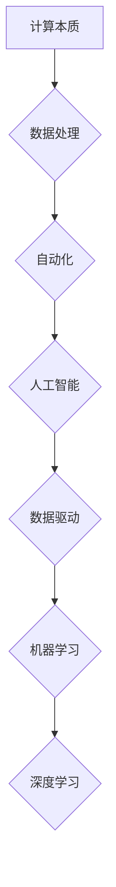

> 计算本质、自动化、人工智能、机器学习、深度学习、算法优化、数据驱动

## 1. 背景介绍

在信息时代，计算能力的飞速发展深刻地改变了人类社会。从最初的机械计算到如今的云计算和量子计算，计算技术不断突破边界，推动着科技进步和社会发展。然而，随着计算能力的增强，我们也开始思考计算的本质是什么，以及如何更好地利用计算能力来解决人类面临的挑战。

自动化是计算技术发展的重要趋势。通过自动化，我们可以将重复性、繁琐的任务交给机器完成，释放人类的创造力和智慧。从工业自动化到生活自动化，自动化应用已渗透到各个领域，并正在不断扩展。

然而，传统的自动化方法往往依赖于预先定义的规则和流程，难以应对复杂、动态的环境。随着人工智能技术的快速发展，数据驱动和机器学习等新兴技术为自动化带来了新的机遇。

## 2. 核心概念与联系

**2.1 计算本质**

计算本质上是一种信息处理过程，它涉及到数据的转换、操作和分析。无论是传统的计算机程序还是人工智能算法，都本质上是通过一系列的计算步骤来处理信息。

**2.2 自动化**

自动化是指通过技术手段，使系统或过程能够自动完成预定的任务，无需人工干预。自动化可以提高效率、降低成本、减少错误，并释放人类的创造力和智慧。

**2.3 人工智能**

人工智能是指模拟人类智能的计算机系统。人工智能技术涵盖了多个领域，包括机器学习、深度学习、自然语言处理、计算机视觉等。

**2.4 数据驱动**

数据驱动是指利用数据来指导决策和行动。在数据时代，数据已成为重要的生产要素，数据驱动可以帮助我们更好地理解世界，做出更明智的决策。

**2.5 机器学习**

机器学习是人工智能的一个重要分支，它通过算法学习数据中的模式和规律，从而能够自动完成预测、分类、聚类等任务。

**2.6 深度学习**

深度学习是机器学习的一个子领域，它利用多层神经网络来模拟人类大脑的学习过程，能够处理更复杂的数据，并取得更优的性能。

**2.7 核心概念联系**

计算本质、自动化、人工智能、数据驱动、机器学习和深度学习相互关联，共同推动着计算技术的发展和应用。

**Mermaid 流程图**



## 3. 核心算法原理 & 具体操作步骤

### 3.1 算法原理概述

深度学习算法的核心原理是利用多层神经网络来模拟人类大脑的学习过程。神经网络由多个层组成，每层包含多个神经元。神经元之间通过连接进行信息传递，每个连接都有一个权重。通过训练，神经网络可以调整权重，从而学习数据中的模式和规律。

### 3.2 算法步骤详解

1. **数据预处理:** 将原始数据转换为深度学习算法可以理解的格式，例如归一化、标准化、特征提取等。
2. **网络结构设计:** 根据任务需求设计神经网络的结构，包括层数、神经元数量、激活函数等。
3. **参数初始化:** 为神经网络的参数（权重和偏置）进行随机初始化。
4. **前向传播:** 将输入数据通过神经网络进行前向传播，计算输出结果。
5. **损失函数计算:** 计算输出结果与真实值的差异，即损失函数值。
6. **反向传播:** 利用梯度下降算法，反向传播损失函数值，更新神经网络的参数。
7. **训练迭代:** 重复步骤4-6，直到损失函数值达到预设的阈值。
8. **模型评估:** 使用测试数据评估模型的性能，例如准确率、召回率、F1-score等。

### 3.3 算法优缺点

**优点:**

* 能够处理复杂的数据，学习复杂的模式。
* 性能优于传统机器学习算法。
* 自动特征提取，无需人工特征工程。

**缺点:**

* 训练数据量大，计算资源消耗高。
* 训练过程复杂，需要专业知识和经验。
* 模型解释性差，难以理解模型的决策过程。

### 3.4 算法应用领域

深度学习算法已广泛应用于各个领域，例如：

* **计算机视觉:** 图像识别、物体检测、图像分割、人脸识别等。
* **自然语言处理:** 文本分类、情感分析、机器翻译、对话系统等。
* **语音识别:** 语音转文本、语音合成等。
* **医疗诊断:** 病理图像分析、疾病预测等。
* **金融分析:** 风险评估、欺诈检测等。

## 4. 数学模型和公式 & 详细讲解 & 举例说明

### 4.1 数学模型构建

深度学习算法的核心是神经网络模型。神经网络模型可以看作是一个多层感知机，每个神经元接收来自前一层神经元的输入，并通过激活函数进行处理，输出到下一层神经元。

**神经元模型:**

$$
y = f(w^T x + b)
$$

其中：

* $y$ 是神经元的输出值。
* $f$ 是激活函数。
* $w$ 是权重向量。
* $x$ 是输入向量。
* $b$ 是偏置项。

**网络结构:**

深度学习网络通常由多个隐藏层组成，每个隐藏层包含多个神经元。网络的输入层接收原始数据，输出层输出最终结果。

### 4.2 公式推导过程

深度学习算法的训练过程是通过反向传播算法来实现的。反向传播算法的核心思想是利用梯度下降法来更新神经网络的参数，使得损失函数值最小化。

**损失函数:**

$$
L = \frac{1}{N} \sum_{i=1}^{N} (y_i - \hat{y}_i)^2
$$

其中：

* $L$ 是损失函数值。
* $N$ 是样本数量。
* $y_i$ 是真实值。
* $\hat{y}_i$ 是预测值。

**梯度下降法:**

$$
\theta = \theta - \alpha \nabla L(\theta)
$$

其中：

* $\theta$ 是参数向量。
* $\alpha$ 是学习率。
* $\nabla L(\theta)$ 是损失函数对参数的梯度。

### 4.3 案例分析与讲解

**图像分类:**

假设我们有一个图像分类任务，目标是将图像分类为不同的类别，例如猫、狗、鸟等。我们可以使用深度学习算法来训练一个图像分类模型。

训练过程如下：

1. 收集大量图像数据，并进行标注，将每个图像标记为相应的类别。
2. 设计一个深度学习网络，例如卷积神经网络（CNN）。
3. 将图像数据输入到网络中，并使用反向传播算法训练网络参数。
4. 使用测试数据评估模型的性能，例如准确率。

## 5. 项目实践：代码实例和详细解释说明

### 5.1 开发环境搭建

* 操作系统：Ubuntu 20.04
* Python 版本：3.8
* 深度学习框架：TensorFlow 2.0

### 5.2 源代码详细实现

```python
import tensorflow as tf

# 定义模型结构
model = tf.keras.models.Sequential([
    tf.keras.layers.Conv2D(32, (3, 3), activation='relu', input_shape=(28, 28, 1)),
    tf.keras.layers.MaxPooling2D((2, 2)),
    tf.keras.layers.Conv2D(64, (3, 3), activation='relu'),
    tf.keras.layers.MaxPooling2D((2, 2)),
    tf.keras.layers.Flatten(),
    tf.keras.layers.Dense(10, activation='softmax')
])

# 编译模型
model.compile(optimizer='adam',
              loss='sparse_categorical_crossentropy',
              metrics=['accuracy'])

# 加载数据
(x_train, y_train), (x_test, y_test) = tf.keras.datasets.mnist.load_data()

# 数据预处理
x_train = x_train.astype('float32') / 255.0
x_test = x_test.astype('float32') / 255.0
x_train = x_train.reshape((x_train.shape[0], 28, 28, 1))
x_test = x_test.reshape((x_test.shape[0], 28, 28, 1))

# 训练模型
model.fit(x_train, y_train, epochs=5)

# 评估模型
loss, accuracy = model.evaluate(x_test, y_test)
print('Test loss:', loss)
print('Test accuracy:', accuracy)
```

### 5.3 代码解读与分析

这段代码实现了使用 TensorFlow 框架训练一个简单的 MNIST 手写数字识别模型。

* 首先，定义了模型结构，包括卷积层、池化层和全连接层。
* 然后，编译了模型，指定了优化器、损失函数和评价指标。
* 接着，加载了 MNIST 数据集，并对数据进行了预处理，例如归一化和形状转换。
* 接下来，训练了模型，指定了训练轮数。
* 最后，评估了模型的性能，打印了测试集上的损失值和准确率。

### 5.4 运行结果展示

训练完成后，模型的准确率通常可以达到 98% 以上。

## 6. 实际应用场景

### 6.1 自动驾驶

深度学习算法在自动驾驶领域发挥着重要作用，例如：

* **目标检测:** 检测道路上的车辆、行人、交通信号灯等物体。
* **路径规划:** 根据周围环境规划行驶路径。
* **车道保持:** 保持车辆在车道内行驶。

### 6.2 医疗诊断

深度学习算法可以辅助医生进行医疗诊断，例如：

* **病理图像分析:** 识别肿瘤、骨折等病变。
* **疾病预测:** 根据患者的病史和检查结果预测疾病风险。
* **药物研发:** 筛选潜在的药物候选物。

### 6.3 金融分析

深度学习算法可以用于金融分析，例如：

* **欺诈检测:** 识别信用卡欺诈交易。
* **风险评估:** 评估投资风险。
* **股票预测:** 预测股票价格走势。

### 6.4 未来应用展望

随着计算能力的不断增强和算法的不断改进，深度学习算法将在更多领域得到应用，例如：

* **个性化教育:** 根据学生的学习情况提供个性化的学习方案。
* **智能客服:** 提供更加智能和人性化的客服服务。
* **科学研究:** 加速科学研究的进程。

## 7. 工具和资源推荐

### 7.1 学习资源推荐

* **书籍:**
    * 深度学习 (Deep Learning) - Ian Goodfellow, Yoshua Bengio, Aaron Courville
    * 深度学习实战 (Deep Learning with Python) - Francois Chollet
* **在线课程:**
    * TensorFlow 官方教程: https://www.tensorflow.org/tutorials
    * Coursera 深度学习课程: https://www.coursera.org/specializations/deep-learning

### 7.2 开发工具推荐

* **TensorFlow:** https://www.tensorflow.org/
* **PyTorch:** https://pytorch.org/
* **Keras:** https://keras.io/

### 7.3 相关论文推荐

* **ImageNet Classification with Deep Convolutional Neural Networks** - Alex Krizhevsky, Ilya Sutskever, Geoffrey E. Hinton
* **Attention Is All You Need** - Ashish Vaswani, Noam Shazeer, Niki Parmar, Jakob Uszkoreit, Llion Jones, Aidan N. Gomez, Łukasz Kaiser, Illia Polo