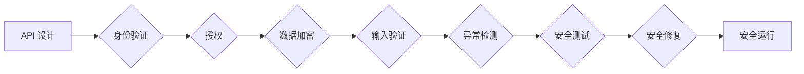

> API 安全，API 设计，API 攻击，API 防御，OAuth 2.0，JWT，API Gateway

## 1. 背景介绍

在当今以互联网为核心的时代，应用程序之间通过 API 进行通信已成为一种普遍的模式。API（Application Programming Interface，应用程序接口）为不同系统之间提供了一种标准化的接口，允许它们相互交互和共享数据。然而，API 的开放性也带来了安全风险，恶意攻击者可以利用 API 的漏洞进行数据泄露、系统入侵等攻击行为。因此，设计安全的 API 对于保护应用程序和用户数据至关重要。

## 2. 核心概念与联系

### 2.1 API 安全的威胁模型

API 安全的威胁模型是指分析 API 可能面临的安全威胁的框架。常见的 API 安全威胁包括：

* **未授权访问:** 攻击者未经授权访问 API，获取敏感数据或执行恶意操作。
* **数据泄露:** 攻击者窃取 API 传输的数据，例如用户凭据、财务信息等。
* **拒绝服务攻击:** 攻击者发送大量请求，导致 API 服务器无法正常工作，从而拒绝合法用户访问。
* **代码注入:** 攻击者通过注入恶意代码，控制 API 的执行流程，执行恶意操作。

### 2.2 API 安全的防御策略

为了应对上述威胁，需要采用多种防御策略，例如：

* **身份验证:** 确保只有授权用户才能访问 API。
* **授权:** 控制用户访问 API 的权限。
* **数据加密:** 加密 API 传输的数据，防止数据泄露。
* **输入验证:** 验证 API 请求中的数据，防止代码注入攻击。
* **异常检测:** 监控 API 的运行状态，检测异常行为。

### 2.3 API 安全的最佳实践

API 安全的最佳实践包括：

* **遵循安全编码规范:** 使用安全的编程语言和库，避免常见的安全漏洞。
* **定期进行安全测试:** 使用自动化工具和人工测试，发现 API 的安全漏洞。
* **及时修复安全漏洞:** 发现安全漏洞后，及时修复，防止攻击者利用漏洞。
* **保持 API 的最新版本:** 使用最新的 API 版本，修复已知的安全漏洞。

**Mermaid 流程图**



## 3. 核心算法原理 & 具体操作步骤

### 3.1  算法原理概述

API 安全的实现依赖于多种算法和技术，例如：

* **哈希算法:** 用于加密密码和生成安全令牌。
* **数字签名算法:** 用于验证数据来源和完整性。
* **加密算法:** 用于加密数据传输，防止数据泄露。
* **身份验证协议:** 用于验证用户的身份，例如 OAuth 2.0。

### 3.2  算法步骤详解

**身份验证流程:**

1. 用户向 API 服务器发送身份验证请求，包含用户名或电子邮件地址和密码。
2. API 服务器验证用户凭据，并生成一个安全令牌。
3. API 服务器返回安全令牌给用户。
4. 用户在后续请求中携带安全令牌，API 服务器验证令牌，确认用户身份。

**数据加密流程:**

1. 用户向 API 服务器发送数据请求，数据被加密。
2. API 服务器接收加密数据，解密数据。
3. API 服务器处理数据，并返回加密结果。
4. 用户接收加密结果，解密结果。

### 3.3  算法优缺点

**哈希算法:**

* **优点:** 计算速度快，安全性高。
* **缺点:** 不可逆，无法恢复原始数据。

**数字签名算法:**

* **优点:** 可验证数据来源和完整性。
* **缺点:** 计算速度慢，密钥管理复杂。

**加密算法:**

* **优点:** 保护数据隐私，防止数据泄露。
* **缺点:** 加密和解密速度慢，密钥管理复杂。

### 3.4  算法应用领域

* **身份验证:** OAuth 2.0、JWT
* **数据加密:** HTTPS、TLS
* **代码签名:** 代码验证、软件更新

## 4. 数学模型和公式 & 详细讲解 & 举例说明

### 4.1  数学模型构建

API 安全的数学模型可以基于概率论和信息论，分析攻击者的成功概率和防御者的成功概率。

**攻击者成功概率:**

$$P_{attack} = P_{vulnerability} \times P_{exploitation}$$

其中：

* $P_{attack}$ 是攻击者成功概率。
* $P_{vulnerability}$ 是 API 存在漏洞的概率。
* $P_{exploitation}$ 是攻击者利用漏洞的概率。

**防御者成功概率:**

$$P_{defense} = 1 - P_{attack}$$

### 4.2  公式推导过程

通过分析 API 的安全特性和攻击者的攻击策略，可以推导出攻击者成功概率和防御者成功概率的具体公式。例如，对于身份验证攻击，可以考虑以下因素：

* 用户密码的强度
* 身份验证协议的安全性
* 攻击者的攻击手段

### 4.3  案例分析与讲解

假设一个 API 使用弱密码策略，攻击者可以使用字典攻击或暴力破解攻击获取用户密码。在这种情况下，$P_{vulnerability}$ 会较高，$P_{exploitation}$ 也可能较高，因此 $P_{attack}$ 会较高。

为了降低 $P_{attack}$，可以采用更强的密码策略，例如使用密码复杂度要求、多因素身份验证等。

## 5. 项目实践：代码实例和详细解释说明

### 5.1  开发环境搭建

* 操作系统: Ubuntu 20.04
* 编程语言: Python 3.8
* 框架: Flask

### 5.2  源代码详细实现

```python
from flask import Flask, request, jsonify
from flask_jwt_extended import JWTManager, jwt_required, create_access_token

app = Flask(__name__)
app.config['JWT_SECRET_KEY'] = 'your_secret_key'  # 设置 JWT 密钥
jwt = JWTManager(app)

@app.route('/protected', methods=['GET'])
@jwt_required()
def protected():
    return jsonify({'message': 'This is a protected resource.'})

@app.route('/login', methods=['POST'])
def login():
    username = request.json.get('username')
    password = request.json.get('password')

    # 验证用户名和密码
    if username == 'admin' and password == 'password':
        access_token = create_access_token(identity=username)
        return jsonify({'access_token': access_token})
    else:
        return jsonify({'message': 'Invalid credentials'}), 401

if __name__ == '__main__':
    app.run(debug=True)
```

### 5.3  代码解读与分析

* 使用 Flask 框架构建 API。
* 使用 Flask-JWT-Extended 扩展实现 JWT 身份验证。
* `/protected` 路由需要用户携带 JWT 令牌才能访问。
* `/login` 路由用于用户登录，验证用户名和密码后生成 JWT 令牌。

### 5.4  运行结果展示

* 访问 `/protected` 路由，需要先登录并获取 JWT 令牌。
* 访问 `/login` 路由，输入正确的用户名和密码，可以获取 JWT 令牌。

## 6. 实际应用场景

### 6.1  电商平台

电商平台可以使用 API 提供商品信息、订单管理、支付处理等功能，API 安全可以保护用户数据和交易安全。

### 6.2  社交媒体平台

社交媒体平台可以使用 API 提供用户数据、消息推送、好友关系等功能，API 安全可以防止用户数据泄露和账号被盗。

### 6.3  金融服务平台

金融服务平台可以使用 API 提供账户查询、转账、贷款申请等功能，API 安全可以保护用户资金安全和隐私。

### 6.4  未来应用展望

随着互联网技术的不断发展，API 将在更多领域得到应用，例如物联网、人工智能等。API 安全将变得更加重要，需要不断研究和改进新的安全技术和策略。

## 7. 工具和资源推荐

### 7.1  学习资源推荐

* OWASP API Security Top 10: https://owasp.org/www-project-top-ten/
* API Security Best Practices: https://developer.mozilla.org/en-US/docs/Web/API/Security

### 7.2  开发工具推荐

* Postman: https://www.postman.com/
* Swagger: https://swagger.io/

### 7.3  相关论文推荐

* API Security: A Comprehensive Survey: https://arxiv.org/abs/1909.01837

## 8. 总结：未来发展趋势与挑战

### 8.1  研究成果总结

API 安全的研究取得了显著进展，涌现出许多新的安全技术和策略，例如 JWT、OAuth 2.0、API Gateway 等。

### 8.2  未来发展趋势

* **微服务架构下的 API 安全:** 微服务架构下，API 的数量和复杂度增加，需要新的安全机制来应对。
* **人工智能驱动的 API 安全:** 利用人工智能技术，可以实现更加智能的 API 安全防御，例如自动检测和响应攻击。
* **API 安全的标准化:** 需要制定更加完善的 API 安全标准，规范 API 的设计和开发。

### 8.3  面临的挑战

* **API 的复杂性:** API 的设计和开发越来越复杂，安全漏洞也更加难以发现和修复。
* **攻击者的不断升级:** 攻击者不断开发新的攻击手段，API 安全需要不断跟进和改进。
* **安全意识的提升:** 开发人员和用户需要提高 API 安全意识，共同维护 API 的安全。

### 8.4  研究展望

未来 API 安全的研究将更加注重以下方面：

* **自动化安全测试:** 开发更加自动化和智能的 API 安全测试工具。
* **零信任安全模型:** 应用零信任安全模型，对 API 进行更加严格的访问控制。
* **API 安全的教育和培训:** 加强 API 安全的教育和培训，提高开发人员和用户的安全意识。

## 9. 附录：常见问题与解答

### 9.1  常见问题

* 如何保护 API 的数据安全？
* 如何防止 API 的拒绝服务攻击？
* 如何验证 API 的安全性？

### 9.2  解答

* 使用加密算法加密 API 传输的数据，防止数据泄露。
* 使用限流和容错机制，防止 API 被拒绝服务攻击。
* 使用安全测试工具和人工测试，验证 API 的安全性。


作者：禅与计算机程序设计艺术 / Zen and the Art of Computer Programming 
<end_of_turn>