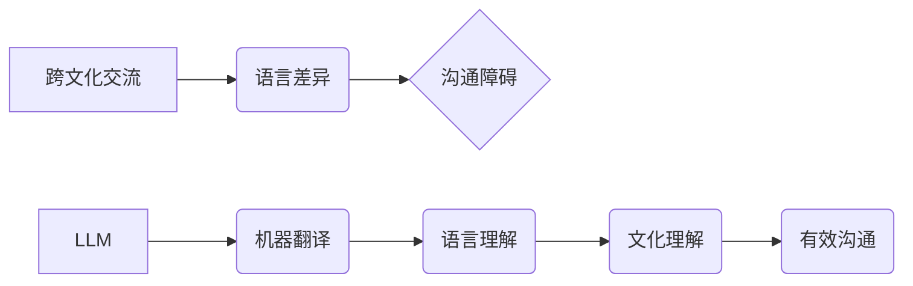

> Large Language Model (LLM), 跨文化交流, 机器翻译, 自然语言处理 (NLP), 人工智能 (AI), 全球互联, 沟通障碍, 文化理解

## 1. 背景介绍

在全球化时代，跨文化交流日益频繁，人们之间需要跨越语言和文化障碍进行沟通。然而，语言差异和文化差异往往成为沟通的阻碍，导致误解和冲突。传统的机器翻译技术虽然取得了一定的进展，但仍然难以完全准确地捕捉语言和文化的微妙之处。

近年来，大型语言模型 (LLM) 的出现为跨文化交流带来了新的希望。LLM 是一种基于深度学习的强大人工智能模型，能够理解和生成人类语言，并具备强大的文本处理能力。其强大的语义理解和文本生成能力，使其在跨文化交流领域具有巨大的潜力。

## 2. 核心概念与联系

**2.1 跨文化交流**

跨文化交流是指不同文化背景的人们之间进行的沟通和互动。它涉及到语言、文化、价值观、行为规范等多方面的差异。

**2.2 大型语言模型 (LLM)**

LLM 是一种深度学习模型，通过训练海量文本数据，学习语言的语法、语义和上下文关系。它能够理解和生成人类语言，并执行各种自然语言处理 (NLP) 任务，例如机器翻译、文本摘要、问答系统等。

**2.3 核心概念联系**

LLM 可以通过其强大的语言理解和生成能力，帮助人们克服语言和文化障碍，促进跨文化交流。

**Mermaid 流程图**



## 3. 核心算法原理 & 具体操作步骤

**3.1 算法原理概述**

LLM 的核心算法是基于 Transformer 架构的深度神经网络。Transformer 模型通过自注意力机制，能够捕捉文本序列中单词之间的长距离依赖关系，从而实现更准确的语言理解和生成。

**3.2 算法步骤详解**

1. **数据预处理:** 将文本数据进行清洗、分词、标记等预处理操作，使其能够被模型理解。
2. **模型训练:** 使用预处理后的数据训练 Transformer 模型，通过反向传播算法不断调整模型参数，使其能够准确地预测下一个单词。
3. **模型评估:** 使用测试数据评估模型的性能，例如准确率、BLEU 分数等。
4. **模型部署:** 将训练好的模型部署到实际应用场景中，例如机器翻译系统、聊天机器人等。

**3.3 算法优缺点**

**优点:**

* 能够捕捉文本序列中长距离依赖关系，实现更准确的语言理解和生成。
* 训练效率高，能够在海量数据上进行高效训练。
* 可迁移性强，可以应用于多种 NLP 任务。

**缺点:**

* 模型参数量大，需要大量的计算资源进行训练和部署。
* 训练数据对模型性能有很大影响，需要高质量的训练数据。
* 仍然存在一些挑战，例如生成文本的流畅度和多样性。

**3.4 算法应用领域**

LLM 的应用领域非常广泛，包括：

* 机器翻译
* 文本摘要
* 问答系统
* 聊天机器人
* 代码生成
* 文本创作

## 4. 数学模型和公式 & 详细讲解 & 举例说明

**4.1 数学模型构建**

LLM 的数学模型主要基于 Transformer 架构，其核心是自注意力机制。自注意力机制能够计算每个单词与其他单词之间的相关性，从而捕捉文本序列中长距离依赖关系。

**4.2 公式推导过程**

自注意力机制的计算公式如下：

$$
Attention(Q, K, V) = softmax(\frac{QK^T}{\sqrt{d_k}})V
$$

其中：

* $Q$：查询矩阵
* $K$：键矩阵
* $V$：值矩阵
* $d_k$：键向量的维度
* $softmax$：softmax 函数

**4.3 案例分析与讲解**

例如，在机器翻译任务中，LLM 可以使用自注意力机制来捕捉源语言和目标语言之间的对应关系，从而实现更准确的翻译。

## 5. 项目实践：代码实例和详细解释说明

**5.1 开发环境搭建**

* Python 3.7+
* PyTorch 或 TensorFlow
* CUDA 和 cuDNN

**5.2 源代码详细实现**

```python
import torch
import torch.nn as nn

class Attention(nn.Module):
    def __init__(self, d_model, num_heads):
        super(Attention, self).__init__()
        self.num_heads = num_heads
        self.d_model = d_model
        self.head_dim = d_model // num_heads

        assert self.head_dim * num_heads == d_model, "d_model must be divisible by num_heads"

        self.query = nn.Linear(d_model, d_model)
        self.key = nn.Linear(d_model, d_model)
        self.value = nn.Linear(d_model, d_model)
        self.fc_out = nn.Linear(d_model, d_model)

    def forward(self, query, key, value, mask=None):
        batch_size = query.size(0)

        # Linear projections
        Q = self.query(query).view(batch_size, -1, self.num_heads, self.head_dim).transpose(1, 2)
        K = self.key(key).view(batch_size, -1, self.num_heads, self.head_dim).transpose(1, 2)
        V = self.value(value).view(batch_size, -1, self.num_heads, self.head_dim).transpose(1, 2)

        # Scaled dot-product attention
        scores = torch.matmul(Q, K.transpose(-2, -1)) / torch.sqrt(torch.tensor(self.head_dim, dtype=torch.float))

        if mask is not None:
            scores = scores.masked_fill(mask == 0, -1e9)

        attention_weights = torch.softmax(scores, dim=-1)

        # Weighted sum of values
        context = torch.matmul(attention_weights, V)

        # Concatenate heads and project
        context = context.transpose(1, 2).contiguous().view(batch_size, -1, self.d_model)
        output = self.fc_out(context)

        return output, attention_weights
```

**5.3 代码解读与分析**

这段代码实现了自注意力机制的计算过程。首先，将输入的查询、键和值矩阵进行线性投影，然后计算它们的点积，并使用 softmax 函数将其归一化，得到注意力权重。最后，将注意力权重与值矩阵相乘，得到上下文向量。

**5.4 运行结果展示**

运行上述代码可以得到注意力权重和上下文向量，这些结果可以用于后续的 NLP 任务，例如机器翻译、文本摘要等。

## 6. 实际应用场景

**6.1 机器翻译**

LLM 可以用于构建更准确、更流畅的机器翻译系统。例如，Google Translate 使用了 Transformer 模型，显著提高了翻译质量。

**6.2 文本摘要**

LLM 可以自动生成文本摘要，提取文本的关键信息。例如，新闻网站可以使用 LLM 自动生成新闻摘要，方便用户快速了解新闻内容。

**6.3 聊天机器人**

LLM 可以用于构建更智能、更自然的聊天机器人。例如，ChatGPT 是一个基于 GPT-3 的聊天机器人，能够进行自然对话，回答问题，甚至创作故事。

**6.4 未来应用展望**

LLM 的应用场景还在不断扩展，未来可能应用于：

* 教育领域：个性化学习、智能辅导
* 医疗领域：疾病诊断、医疗记录分析
* 法律领域：法律文件分析、合同审查
* 艺术领域：文本创作、诗歌生成

## 7. 工具和资源推荐

**7.1 学习资源推荐**

* **论文:**
    * Attention Is All You Need (Vaswani et al., 2017)
    * BERT: Pre-training of Deep Bidirectional Transformers for Language Understanding (Devlin et al., 2018)
    * GPT-3: Language Models are Few-Shot Learners (Brown et al., 2020)
* **在线课程:**
    * Stanford CS224N: Natural Language Processing with Deep Learning
    * DeepLearning.AI: Natural Language Processing Specialization

**7.2 开发工具推荐**

* **PyTorch:** https://pytorch.org/
* **TensorFlow:** https://www.tensorflow.org/
* **Hugging Face Transformers:** https://huggingface.co/transformers/

**7.3 相关论文推荐**

* **T5: Text-to-Text Transfer Transformer** (Raffel et al., 2019)
* **XLNet: Generalized Autoregressive Pretraining for Language Understanding** (Yang et al., 2019)
* **RoBERTa: A Robustly Optimized BERT Pretraining Approach** (Liu et al., 2019)

## 8. 总结：未来发展趋势与挑战

**8.1 研究成果总结**

近年来，LLM 在跨文化交流领域取得了显著进展，例如机器翻译的准确率大幅提升，聊天机器人的自然度也得到了提高。

**8.2 未来发展趋势**

* **模型规模和能力的提升:** 未来 LLMs 将会拥有更大的规模和更强的能力，能够处理更复杂的任务。
* **多模态 LLMs:** LLMs 将会融合多模态信息，例如文本、图像、音频等，实现更全面的理解和生成。
* **个性化和定制化 LLMs:** LLMs 将会更加个性化和定制化，能够根据用户的需求进行调整和优化。

**8.3 面临的挑战**

* **数据偏见和公平性:** LLMs 的训练数据可能存在偏见，导致模型输出存在歧视或不公平的情况。
* **可解释性和透明度:** LLMs 的决策过程往往难以理解，缺乏透明度，这可能会导致用户对模型结果的信任度降低。
* **安全性和隐私性:** LLMs 可能被用于恶意目的，例如生成虚假信息或窃取隐私数据。

**8.4 研究展望**

未来研究将重点关注解决上述挑战，例如开发更公平、更透明、更安全的 LLMs。


## 9. 附录：常见问题与解答

**9.1 如何训练一个 LLM？**

训练一个 LLM 需要大量的计算资源和海量文本数据。通常需要使用分布式训练框架，例如 PyTorch Distributed Data Parallel 或 TensorFlow Distributed Strategy。

**9.2 如何评估 LLM 的性能？**

LLM 的性能可以评估多种指标，例如准确率、BLEU 分数、ROUGE 分数等。具体指标的选择取决于具体的应用场景。

**9.3 如何部署 LLM？**

LLM 可以部署到云端服务器、边缘设备等多种平台。可以使用容器化技术，例如 Docker，方便部署和管理。


作者：禅与计算机程序设计艺术 / Zen and the Art of Computer Programming 
<end_of_turn>