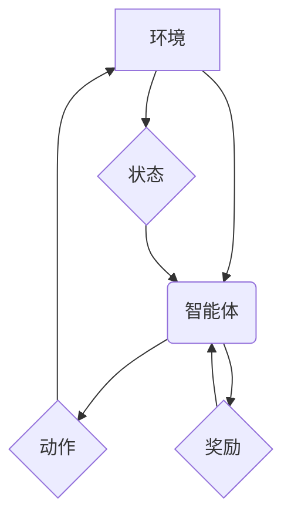

> 深度学习、强化学习、软件 2.0、人工智能、机器学习、自动驾驶、机器人

## 1. 背景介绍

软件行业正处于一个前所未有的变革时期。传统的软件开发模式，依赖于人类程序员手动编写代码，效率低下，难以应对复杂系统的需求。而人工智能（AI）技术的快速发展，为软件行业带来了新的机遇和挑战。深度学习和强化学习作为AI领域的两大重要分支，正在深刻地改变着软件的开发、运行和应用方式，催生了“软件 2.0”的时代。

软件 2.0 的核心特征是智能化、自动化和自适应性。它不再仅仅是静态的代码集合，而是能够学习、进化和自我完善的智能系统。深度学习和强化学习为实现这些特征提供了强大的技术支撑。

## 2. 核心概念与联系

**2.1 深度学习**

深度学习是一种基于人工神经网络的机器学习方法。它通过多层神经网络结构，模拟人类大脑的学习机制，从海量数据中自动提取特征和知识。深度学习在图像识别、自然语言处理、语音识别等领域取得了突破性的进展。

**2.2 强化学习**

强化学习是一种基于试错的机器学习方法。它通过奖励机制，引导智能体在环境中学习最优策略。强化学习在机器人控制、游戏 AI、自动驾驶等领域展现出巨大的潜力。

**2.3 深度学习与强化学习的联系**

深度学习和强化学习可以相互补充，共同推动软件 2.0 的发展。深度学习可以为强化学习提供强大的特征提取能力，帮助智能体更好地理解环境和做出决策。而强化学习可以引导深度学习模型的优化，使其在特定任务中取得更好的性能。

**2.4 深度学习与强化学习的架构**



## 3. 核心算法原理 & 具体操作步骤

### 3.1 算法原理概述

深度学习和强化学习的核心算法原理分别为：

* **深度学习：** 多层感知机（MLP）、卷积神经网络（CNN）、循环神经网络（RNN）等。
* **强化学习：** Q学习、SARSA、深度Q网络（DQN）等。

这些算法通过不同的方式学习数据特征和决策策略，最终实现智能化的目标。

### 3.2 算法步骤详解

**3.2.1 深度学习算法步骤**

1. **数据预处理：** 将原始数据进行清洗、转换和特征工程，使其适合深度学习模型的训练。
2. **模型构建：** 选择合适的深度学习模型架构，并根据任务需求进行参数设置。
3. **模型训练：** 使用训练数据训练深度学习模型，通过反向传播算法调整模型参数，使其能够准确地预测目标输出。
4. **模型评估：** 使用测试数据评估模型的性能，并根据评估结果进行模型调优。
5. **模型部署：** 将训练好的模型部署到实际应用场景中，用于进行预测或决策。

**3.2.2 强化学习算法步骤**

1. **环境建模：** 建立一个模拟真实世界的环境，并定义智能体的动作空间和状态空间。
2. **策略选择：** 选择合适的强化学习算法，并根据环境和任务需求进行参数设置。
3. **交互学习：** 智能体与环境进行交互，根据环境反馈的奖励信号，更新策略参数，使其能够获得更高的奖励。
4. **策略评估：** 使用测试环境评估策略的性能，并根据评估结果进行策略优化。
5. **策略部署：** 将训练好的策略部署到实际应用场景中，用于控制智能体行为。

### 3.3 算法优缺点

**3.3.1 深度学习算法**

* **优点：** 能够自动提取特征，学习复杂模式，性能优异。
* **缺点：** 需要大量数据进行训练，训练时间长，解释性差。

**3.3.2 强化学习算法**

* **优点：** 可以学习复杂决策策略，适应动态环境，具有自主学习能力。
* **缺点：** 训练过程复杂，容易陷入局部最优，需要大量的试错和探索。

### 3.4 算法应用领域

* **深度学习：** 图像识别、语音识别、自然语言处理、机器翻译、推荐系统等。
* **强化学习：** 自动驾驶、机器人控制、游戏 AI、医疗诊断、金融交易等。

## 4. 数学模型和公式 & 详细讲解 & 举例说明

### 4.1 数学模型构建

**4.1.1 深度学习模型**

深度学习模型通常由多层神经网络组成，每层神经元之间通过权重连接，并使用激活函数进行非线性变换。

**4.1.2 强化学习模型**

强化学习模型通常由智能体、环境和奖励函数组成。智能体通过与环境交互，选择动作，并根据环境反馈的奖励信号更新策略。

### 4.2 公式推导过程

**4.2.1 深度学习模型的损失函数**

$$
L = \frac{1}{N} \sum_{i=1}^{N} (y_i - \hat{y}_i)^2
$$

其中：

* $L$ 为损失函数
* $N$ 为样本数量
* $y_i$ 为真实标签
* $\hat{y}_i$ 为模型预测值

**4.2.2 强化学习模型的Bellman方程**

$$
V(s) = \max_{\alpha} \sum_{s'} P(s' | s, \alpha) [r(s, \alpha, s') + \gamma V(s')]
$$

其中：

* $V(s)$ 为状态 $s$ 的价值函数
* $\alpha$ 为智能体选择的动作
* $P(s' | s, \alpha)$ 为从状态 $s$ 执行动作 $\alpha$ 到状态 $s'$ 的转移概率
* $r(s, \alpha, s')$ 为从状态 $s$ 执行动作 $\alpha$ 到状态 $s'$ 的奖励
* $\gamma$ 为折扣因子

### 4.3 案例分析与讲解

**4.3.1 深度学习案例：图像识别**

使用CNN模型进行图像识别，训练数据包括大量带标签的图像。模型通过学习图像特征，将图像映射到相应的类别标签。

**4.3.2 强化学习案例：自动驾驶**

使用DQN模型进行自动驾驶，训练数据包括车辆在不同环境下的行驶轨迹和奖励信号。模型通过学习驾驶策略，使车辆能够安全地行驶。

## 5. 项目实践：代码实例和详细解释说明

### 5.1 开发环境搭建

使用Python语言和相关的深度学习框架（如TensorFlow、PyTorch）进行开发。

### 5.2 源代码详细实现

```python
# 使用TensorFlow构建一个简单的深度学习模型
import tensorflow as tf

# 定义模型结构
model = tf.keras.models.Sequential([
    tf.keras.layers.Dense(128, activation='relu', input_shape=(784,)),
    tf.keras.layers.Dense(10, activation='softmax')
])

# 编译模型
model.compile(optimizer='adam',
              loss='sparse_categorical_crossentropy',
              metrics=['accuracy'])

# 训练模型
model.fit(x_train, y_train, epochs=10)

# 评估模型
loss, accuracy = model.evaluate(x_test, y_test)
print('Test loss:', loss)
print('Test accuracy:', accuracy)
```

### 5.3 代码解读与分析

这段代码展示了如何使用TensorFlow构建一个简单的深度学习模型进行手写数字识别。

* `tf.keras.models.Sequential` 创建一个顺序模型，将层级依次连接。
* `tf.keras.layers.Dense` 定义全连接层，输入节点数为784，输出节点数为10（对应10个数字）。
* `activation='relu'` 使用ReLU激活函数。
* `optimizer='adam'` 使用Adam优化器进行模型训练。
* `loss='sparse_categorical_crossentropy'` 使用稀疏类别交叉熵损失函数。
* `metrics=['accuracy']` 使用准确率作为评估指标。
* `model.fit()` 训练模型，使用训练数据进行训练，迭代10次。
* `model.evaluate()` 评估模型，使用测试数据进行评估。

### 5.4 运行结果展示

训练完成后，模型能够准确识别手写数字。

## 6. 实际应用场景

### 6.1 深度学习应用场景

* **图像识别：** 人脸识别、物体检测、图像分类、医学影像分析等。
* **语音识别：** 语音助手、语音搜索、语音翻译等。
* **自然语言处理：** 机器翻译、文本摘要、情感分析、聊天机器人等。
* **推荐系统：** 产品推荐、内容推荐、个性化服务等。

### 6.2 强化学习应用场景

* **自动驾驶：** 车辆路径规划、避障、交通规则识别等。
* **机器人控制：** 机器人运动控制、环境感知、任务执行等。
* **游戏 AI：** 游戏策略制定、对手模仿、游戏难度调节等。
* **医疗诊断：** 辅助医生诊断疾病、预测患者病情等。

### 6.4 未来应用展望

深度学习和强化学习将在未来广泛应用于各个领域，例如：

* **个性化教育：** 根据学生的学习情况，提供个性化的学习内容和教学方法。
* **智能医疗：** 辅助医生诊断疾病、预测患者病情、开发个性化治疗方案。
* **智慧城市：** 利用传感器数据，优化交通流量、提高能源效率、提升城市安全。
* **工业自动化：** 自动化生产流程、提高生产效率、降低生产成本。

## 7. 工具和资源推荐

### 7.1 学习资源推荐

* **书籍：**
    * 《深度学习》
    * 《强化学习：原理、算法和应用》
* **在线课程：**
    * Coursera：深度学习、强化学习
    * Udacity：深度学习工程师、强化学习工程师
* **开源项目：**
    * TensorFlow
    * PyTorch
    * OpenAI Gym

### 7.2 开发工具推荐

* **深度学习框架：** TensorFlow、PyTorch、Keras
* **强化学习库：** OpenAI Gym、Stable Baselines3
* **编程语言：** Python

### 7.3 相关论文推荐

* **深度学习：**
    * AlexNet
    * VGGNet
    * ResNet
* **强化学习：**
    * Q-learning
    * SARSA
    * Deep Q-Network (DQN)

## 8. 总结：未来发展趋势与挑战

### 8.1 研究成果总结

深度学习和强化学习取得了显著的成果，在图像识别、语音识别、自然语言处理、自动驾驶等领域取得了突破性的进展。

### 8.2 未来发展趋势

* **模型规模和复杂度提升：** 模型参数量更大，架构更复杂，能够学习更复杂的知识和模式。
* **数据效率提升：** 能够利用更少的数据进行训练，降低数据获取和标注成本。
* **解释性和可解释性增强：** 能够更好地解释模型的决策过程，提高模型的可信度和可接受性。
* **跨模态学习：** 能够学习不同模态数据（如文本、图像、音频）之间的关系，实现更全面的知识表示。

### 8.3 面临的挑战

* **数据获取和标注成本高：** 深度学习和强化学习都需要大量数据进行训练，数据获取和标注成本较高。
* **模型训练时间长：** 大型深度学习模型的训练时间很长，需要强大的计算资源。
* **模型解释性和可解释性差：** 深度学习模型的决策过程难以解释，