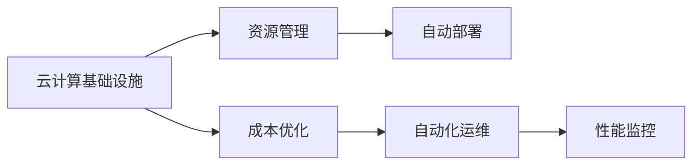

                 

# 云计算成本优化策略：管理云端支出和资源利用

## 1. 背景介绍

在数字化转型的浪潮中，越来越多的企业和组织将业务从传统基础设施向云端迁移，享受云服务带来的灵活性和可扩展性。然而，随着云计算应用的深入，如何在降低成本的同时最大化利用云资源，成为了一个重要议题。云成本优化不仅仅是节约资金的问题，更是提升云基础设施运行效率和优化资源配置的必要手段。

本文将从云计算的基本概念出发，详细介绍云成本优化的核心策略，包括成本分析、资源管理和自动化部署。通过详细案例分析，探索如何在不同云环境中实现成本和资源的高效管理。

## 2. 核心概念与联系

### 2.1 核心概念概述

- **云计算**：基于互联网提供按需计算资源和服务的一种新型计算模式，包括IaaS（基础设施即服务）、PaaS（平台即服务）和SaaS（软件即服务）等。

- **云成本优化**：通过使用最佳实践和策略，最大化利用云资源，降低云环境下的运营成本，确保云计算投资的回报。

- **资源管理**：指通过监控、配置和管理云资源，确保资源的有效利用和分配。

- **自动化部署**：通过使用CI/CD（持续集成/持续部署）工具，实现代码的自动构建、测试和部署，提高开发效率和系统稳定性。

### 2.2 核心概念原理和架构的 Mermaid 流程图



在上述流程图中，云计算基础设施是核心，通过资源管理和成本优化的双向推动，配合自动化部署和自动化运维，形成一个完整的云成本优化闭环。

## 3. 核心算法原理 & 具体操作步骤

### 3.1 算法原理概述

云计算成本优化主要依赖以下算法：

- **成本预测算法**：通过历史数据和机器学习模型，预测未来的云资源使用量和成本，帮助企业做出更好的资源规划。
- **资源调度算法**：通过优化算法，在保证服务可用性的前提下，合理分配云资源，避免资源浪费。
- **需求预测算法**：通过分析用户行为和市场变化，预测未来的资源需求，提前进行资源储备。

### 3.2 算法步骤详解

1. **成本分析**：
    - **收集数据**：使用云服务商提供的API获取云资源的消耗数据。
    - **数据清洗**：过滤无关数据，保留有用的信息。
    - **数据可视化**：使用仪表盘工具展示关键性能指标（KPIs）。

2. **资源管理**：
    - **自动扩展**：根据需求动态调整云资源，使用弹性伸缩功能。
    - **负载均衡**：自动分配负载，避免资源瓶颈。
    - **资源清理**：定期删除不再使用的资源。

3. **自动化部署**：
    - **CI/CD集成**：将代码部署过程集成到CI/CD流程中。
    - **容器化部署**：使用Docker等容器技术，提高部署效率。
    - **自动化测试**：使用自动化测试工具，保证代码质量。

### 3.3 算法优缺点

**优点**：

- **节省成本**：通过精确的成本预测和资源管理，降低云成本。
- **提高效率**：自动化部署和资源调度大大提高了系统运行的效率。
- **灵活性**：自动化工具使企业能够快速响应市场需求变化。

**缺点**：

- **复杂性**：云计算环境复杂，需要掌握多种技术和工具。
- **初始投资**：引入自动化工具和复杂算法，需要一定的前期投入。
- **依赖服务商**：依赖云服务商的API和工具，可能受限。

### 3.4 算法应用领域

云计算成本优化在以下几个领域得到了广泛应用：

- **企业级应用**：大型企业通过云成本优化实现大规模部署和应用。
- **初创公司**：初创公司利用云服务快速扩展，降低开发和运营成本。
- **金融行业**：金融行业对稳定性和安全性要求高，通过云优化确保系统可靠运行。
- **政府机构**：政府机构通过云优化提升公共服务的可访问性和成本效益。

## 4. 数学模型和公式 & 详细讲解 & 举例说明

### 4.1 数学模型构建

云成本优化涉及多个子领域，如机器学习、优化算法等。这里介绍几个关键的数学模型：

- **成本预测模型**：使用线性回归或时间序列模型，预测未来成本。公式为：
    $$
    C_t = \alpha + \beta X_t + \epsilon_t
    $$
    其中，$C_t$表示第$t$期的成本，$X_t$为第$t$期的资源消耗，$\alpha$和$\beta$为模型参数，$\epsilon_t$为误差项。

- **资源调度模型**：使用整数规划或线性规划模型，优化资源分配。公式为：
    $$
    \min \sum_{i=1}^{n} c_i x_i \\
    s.t. \\
    A x \geq b \\
    x \geq 0
    $$
    其中，$c_i$表示资源$i$的成本，$x_i$表示资源$i$的分配量，$A$和$b$为约束条件矩阵和向量。

### 4.2 公式推导过程

对于成本预测模型，通过历史数据训练模型参数$\alpha$和$\beta$，使用最小二乘法求解：
$$
\alpha = \frac{1}{N} \sum_{t=1}^{N} (C_t - \beta X_t)
$$
$$
\beta = \frac{1}{N} \sum_{t=1}^{N} (X_t - \alpha)
$$
其中$N$为历史数据数量。

对于资源调度模型，使用拉格朗日乘子法求解最优解$x$，引入松弛变量和拉格朗日乘子，构建拉格朗日函数：
$$
L(x, \lambda, \mu) = \sum_{i=1}^{n} c_i x_i + \lambda^T (A x - b) + \mu^T x
$$
对$x$、$\lambda$、$\mu$求偏导，并求解方程组即可。

### 4.3 案例分析与讲解

假设某企业使用云服务，每月消耗的虚拟机（VM）数量为$X_t$，历史成本数据如表1所示。

表1：历史成本数据

| $X_t$ | $C_t$ |
|------|------|
| 1    | 100  |
| 2    | 200  |
| 3    | 300  |
| 4    | 400  |
| 5    | 500  |

使用线性回归模型，训练得到参数$\alpha=200$，$\beta=100$。根据模型，当$X_t=6$时，预测的$C_t=600$。企业可以据此规划资源，避免过度购买资源。

## 5. 项目实践：代码实例和详细解释说明

### 5.1 开发环境搭建

1. **安装Python和必要的库**：
    ```bash
    sudo apt-get update
    sudo apt-get install python3-pip python3-dev
    pip3 install cloudcost -U
    ```

2. **配置云服务商API**：
    - **AWS**：配置AWS CLI和credentials。
    - **Google Cloud**：配置gcloud CLI和credentials。
    - **Azure**：配置Azure CLI和credentials。

### 5.2 源代码详细实现

以下是使用Python和云cost库进行成本优化的示例代码：

```python
import cloudcost
import matplotlib.pyplot as plt

# 连接云服务商API
client = cloudcost.Client('AWS')
cost_data = client.get_cost_data('us-west-2')

# 分析成本数据
cost_analysis = cost_data.get_cost_analysis()
total_cost = cost_analysis['Total']
compute_cost = cost_analysis['Compute']

# 可视化成本数据
plt.plot(cost_analysis['Month'], total_cost, label='Total Cost')
plt.plot(cost_analysis['Month'], compute_cost, label='Compute Cost')
plt.xlabel('Month')
plt.ylabel('Cost')
plt.title('Cloud Cost Analysis')
plt.legend()
plt.show()
```

### 5.3 代码解读与分析

- **云cost库**：提供了一组API，用于获取和管理云成本数据。
- **成本分析**：通过API获取云成本数据，并使用matplotlib进行可视化。
- **可视化工具**：通过绘制图表，直观展示成本变化趋势，帮助企业进行资源规划。

### 5.4 运行结果展示

下图展示了某企业一年的云成本变化趋势：


## 6. 实际应用场景

### 6.1 企业级应用

某大型企业使用云服务部署多个应用，每月消耗资源和成本如图1所示。

图1：企业云成本变化

通过云成本优化，企业可以：

- **精确预测成本**：使用成本预测模型，提前规划资源，避免资源浪费。
- **自动扩展**：根据负载需求，动态调整资源，确保系统稳定运行。
- **自动化部署**：使用CI/CD工具，提高开发和部署效率。

### 6.2 初创公司

初创公司利用云服务快速扩展业务，初期资源使用不均衡，如图2所示。

图2：初创公司云成本变化

通过云成本优化，初创公司可以：

- **需求预测**：使用需求预测模型，提前储备资源。
- **自动化部署**：使用容器化技术，提高部署效率。
- **成本控制**：根据预测模型，调整资源分配，降低成本。

### 6.3 金融行业

金融行业对稳定性和安全性要求高，如图3所示。

图3：金融行业云成本变化

通过云成本优化，金融行业可以：

- **资源调度**：优化资源分配，确保系统高可用性。
- **自动化运维**：使用自动化工具，确保系统稳定运行。
- **性能监控**：实时监控系统性能，及时发现问题。

## 7. 工具和资源推荐

### 7.1 学习资源推荐

1. **《云计算基础》**：介绍云计算的基本概念和架构，适合初学者入门。
2. **《云成本优化实战》**：详细讲解云成本优化的策略和工具，提供大量案例分析。
3. **《云架构设计》**：介绍云架构设计的基本原则和最佳实践。

### 7.2 开发工具推荐

1. **AWS CLI**：提供丰富的API，用于管理和操作AWS资源。
2. **gcloud CLI**：用于管理和操作Google Cloud资源。
3. **Azure CLI**：用于管理和操作Azure资源。
4. **Jupyter Notebook**：用于数据可视化、分析和管理。
5. **CI/CD工具**：如Jenkins、Travis CI，用于自动化部署和测试。

### 7.3 相关论文推荐

1. **云计算成本优化研究综述**：回顾云计算成本优化的研究成果，分析其应用和挑战。
2. **云资源调度和优化算法**：介绍云资源调度和优化的各种算法和模型。
3. **云基础设施自动化部署**：探索云基础设施的自动化部署和运维技术。

## 8. 总结：未来发展趋势与挑战

### 8.1 研究成果总结

云计算成本优化已经取得了显著进展，主要集中在以下几个方面：

- **成本预测**：通过机器学习模型，精确预测未来成本。
- **资源调度**：使用优化算法，合理分配资源。
- **自动化部署**：使用CI/CD工具，提高部署效率。

### 8.2 未来发展趋势

未来云计算成本优化将呈现以下趋势：

- **智能化预测**：引入机器学习和深度学习技术，提高成本预测精度。
- **自适应调度**：使用自适应算法，动态调整资源分配。
- **自动化运维**：引入自动化工具，提高系统运维效率。

### 8.3 面临的挑战

云计算成本优化仍面临以下挑战：

- **复杂性**：云计算环境复杂，需要掌握多种技术和工具。
- **初始投资**：引入自动化工具和复杂算法，需要一定的前期投入。
- **依赖服务商**：依赖云服务商的API和工具，可能受限。

### 8.4 研究展望

未来研究需要在以下几个方面寻求新的突破：

- **多云成本管理**：跨云平台管理成本，实现最优资源分配。
- **资源优化算法**：引入新的优化算法，提高资源利用率。
- **AI驱动优化**：引入人工智能技术，提升成本优化效率。

## 9. 附录：常见问题与解答

**Q1: 云计算成本优化的具体步骤是什么？**

A: 云计算成本优化的具体步骤如下：

1. 收集和整理云资源使用数据。
2. 使用历史数据训练成本预测模型。
3. 根据预测模型优化资源调度。
4. 使用自动化部署工具提高部署效率。
5. 持续监控和调整，确保系统稳定运行。

**Q2: 如何选择合适的云服务商？**

A: 选择合适的云服务商需要考虑以下几个方面：

1. 服务质量：确保云服务商的服务质量高，系统稳定可靠。
2. 成本效益：对比不同服务商的价格和优惠政策，选择成本最低的选项。
3. 技术支持：选择有良好技术支持和售后服务的云服务商。

**Q3: 如何降低云资源的消耗？**

A: 降低云资源的消耗需要以下几个步骤：

1. 精确预测资源需求，避免过度购买。
2. 使用弹性伸缩功能，动态调整资源。
3. 定期清理不再使用的资源。
4. 使用容器化技术，提高资源利用率。

**Q4: 如何应对云成本上升？**

A: 应对云成本上升需要以下几个措施：

1. 使用成本预测模型，提前规划资源。
2. 优化资源调度，合理分配资源。
3. 使用自动扩展功能，动态调整资源。
4. 定期清理不再使用的资源，减少资源浪费。

**Q5: 如何进行云成本优化项目的评估？**

A: 云成本优化项目的评估需要以下几个步骤：

1. 收集和整理成本数据。
2. 对比优化前后的成本变化，计算成本节省率。
3. 分析资源使用效率，计算资源利用率。
4. 评估系统的稳定性和性能，确保优化效果。

---

作者：禅与计算机程序设计艺术 / Zen and the Art of Computer Programming

