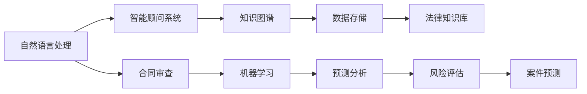

                 

# 人工智能在法律服务中的应用：提高效率与准确性

## 1. 背景介绍

随着数字化和自动化技术的不断演进，人工智能(AI)正在改变各行各业的工作模式。在法律服务领域，AI的应用已经成为了提高效率和提升服务质量的关键手段。本文将深入探讨AI在法律服务中的应用，重点讨论其如何通过自动化、智能化手段提升法律工作的效率和准确性。

### 1.1 法律服务行业的挑战

传统法律服务行业面临着一系列挑战：

1. **高成本**：法律服务的费用高昂，通常需要律师和法律助手进行大量繁琐的手工工作，如文书撰写、合同审查等，这些都导致法律服务的成本居高不下。

2. **低效率**：律师和法律助手的工作速度有限，特别是在处理大量文件和复杂案件时，效率低下是一个普遍问题。

3. **高错误率**：由于法律文件复杂且细节繁多，手动处理容易出错，导致文书撰写、合同审查等任务存在较高的错误率。

4. **资源分配不均**：高质量的律师资源稀缺，而基础法律事务需要大量人力资源，使得高素质律师常常被分配到更复杂的案件上，而基本法律事务的处理效率难以提高。

5. **信息检索困难**：法律服务需要大量查阅和分析案件背景资料，传统信息检索方式效率低下，且容易遗漏关键信息。

### 1.2 AI的应用潜力

AI技术的引入，为解决上述问题提供了新的途径：

1. **自动化处理**：AI可以自动处理文书撰写、合同审查等重复性高、规则明确的法律任务，大幅减少人工干预，提升效率。

2. **智能化决策**：AI通过学习大量法律数据和案例，能够提供更快速、准确的法律意见和建议，帮助律师快速做出决策。

3. **知识库构建**：AI可以构建全面的法律知识库，提供即时的法律查询和分析，帮助律师更好地处理复杂案件。

4. **客户沟通辅助**：AI可以协助律师进行客户沟通，提供智能化的建议和回答，提升客户体验。

5. **预测分析**：AI可以进行风险评估和案件预测，帮助律师提前预判案件结果，优化策略。

## 2. 核心概念与联系

### 2.1 核心概念概述

为更好地理解AI在法律服务中的应用，本文将介绍几个核心概念：

1. **人工智能(AI)**：通过计算机模拟人类智能，实现自动化、智能化任务的技术。
2. **机器学习(Machine Learning)**：一种让机器通过学习数据集自动改进的算法。
3. **自然语言处理(NLP)**：使计算机能够理解、处理和生成人类语言的技术。
4. **合同审查**：对合同文本进行检查，确保其合法合规性的过程。
5. **知识图谱**：通过图结构化的方式，表示实体、关系和属性，构建知识网络。
6. **智能顾问系统**：提供法律咨询、建议的系统，基于AI技术，能够理解自然语言输入，并生成对应的法律意见。

### 2.2 核心概念原理和架构的 Mermaid 流程图



这个流程图展示了AI在法律服务应用中的主要流程：

1. 自然语言处理：将用户输入的文本转换为机器可理解的形式，进行信息提取、分类、摘要等处理。
2. 智能顾问系统：基于处理后的文本信息，生成法律意见、建议等。
3. 合同审查：利用NLP和机器学习算法，自动化地检查合同文本，确保合规性。
4. 知识图谱：构建全面的法律知识库，提供即时的法律查询和分析。
5. 预测分析：通过机器学习模型对案件进行预测分析，提供风险评估和案件预测。

这些核心概念共同构成了AI在法律服务中的应用框架，为提高效率和准确性提供了技术支持。

## 3. 核心算法原理 & 具体操作步骤

### 3.1 算法原理概述

AI在法律服务中的应用主要基于自然语言处理和机器学习算法。通过训练模型，使其能够理解、处理和生成法律文本，进而自动化地完成各种法律任务。

### 3.2 算法步骤详解

1. **数据收集和预处理**：收集法律领域的文本数据，包括合同、案例、判决书等。清洗、标注和划分训练集、验证集和测试集。
   
2. **模型训练**：使用深度学习模型（如RNN、LSTM、Transformer等）对法律文本进行训练，使其能够进行文本分类、情感分析、实体识别等任务。

3. **文本处理**：对用户输入的文本进行分词、词性标注、命名实体识别等处理，提取关键信息。

4. **法律信息抽取**：利用信息抽取技术，从法律文本中提取出实体、关系、属性等关键信息。

5. **合同审查**：对合同文本进行自动化审查，确保其合规性，并识别出潜在的法律风险。

6. **智能顾问**：基于提取出的信息，生成法律意见、建议等，供律师参考。

7. **知识图谱构建**：构建法律领域的知识图谱，提供法律查询、分析和推理支持。

8. **预测分析**：利用机器学习模型对案件进行风险评估和预测，辅助律师决策。

### 3.3 算法优缺点

**优点**：

1. **提升效率**：自动化处理重复性高、规则明确的法律任务，减少人工干预，提升处理速度。
2. **降低成本**：减少人力资源需求，降低法律服务的总体成本。
3. **提高准确性**：通过大规模数据训练，模型能够提供更快速、准确的法律意见和建议。
4. **优化资源分配**：将基础法律事务处理自动化，让高素质律师更专注于复杂案件。
5. **改善客户体验**：智能顾问系统能够快速响应客户需求，提供定制化的法律服务。

**缺点**：

1. **数据依赖**：AI的性能高度依赖于数据质量，低质量的训练数据可能导致模型效果不佳。
2. **模型解释性差**：AI模型通常是"黑盒"，难以解释其内部决策逻辑。
3. **偏见问题**：AI模型可能学习到数据中的偏见，导致不公平的法律判断。
4. **法律变化的适应性**：AI模型需要不断更新以适应法律的变化，否则可能产生过时的法律建议。
5. **安全性和隐私问题**：处理法律文件涉及敏感信息，需要严格的保护措施。

### 3.4 算法应用领域

AI在法律服务中的应用领域广泛，包括但不限于：

1. **文书处理**：自动化文书撰写、合同审查等，提升文书处理效率和准确性。
2. **法律咨询**：提供智能化的法律咨询和建议，辅助律师决策。
3. **风险评估**：利用预测分析，评估法律案件的风险，提供风险管理建议。
4. **案件预测**：基于历史数据和法律知识，预测案件结果，辅助律师制定策略。
5. **知识图谱构建**：构建法律知识库，提供即时的法律查询和分析支持。
6. **客户沟通辅助**：智能化的客户沟通工具，提高客户体验。

## 4. 数学模型和公式 & 详细讲解 & 举例说明

### 4.1 数学模型构建

AI在法律服务中的应用涉及多个数学模型，下面以合同审查为例，构建其数学模型。

**输入**：法律合同文本 $x$，长度为 $n$。

**输出**：合同合规性标签 $y$，取值为 0 或 1，其中 1 表示合规，0 表示不合规。

**损失函数**：常用的损失函数包括交叉熵损失、均方误差损失等。

### 4.2 公式推导过程

假设使用二分类交叉熵损失函数，其公式为：

$$
\mathcal{L}(\theta) = -\frac{1}{N} \sum_{i=1}^N [y_i\log \hat{y_i} + (1-y_i)\log (1-\hat{y_i})]
$$

其中 $y_i$ 为真实标签，$\hat{y_i}$ 为模型预测结果。

### 4.3 案例分析与讲解

以合同审查为例，分析如何使用AI模型进行自动化审查：

1. **数据收集**：收集大量的法律合同文本，并对其进行标注，构建训练集和测试集。

2. **模型训练**：使用深度学习模型（如LSTM、Transformer等）对合同文本进行训练，使其能够区分合规和不合规的合同。

3. **模型验证**：在验证集上测试模型性能，调整模型参数，优化模型。

4. **合同审查**：将待审查的合同文本输入模型，得到合规性预测结果，并进行人工复核，优化模型。

5. **模型部署**：将训练好的模型部署到生产环境中，自动化地进行合同审查。

## 5. 项目实践：代码实例和详细解释说明

### 5.1 开发环境搭建

为了进行AI在法律服务中的应用实践，需要先搭建好开发环境：

1. **安装Python**：确保系统上安装有Python 3.x版本，可以使用Anaconda或Miniconda进行安装。

2. **安装深度学习框架**：安装TensorFlow或PyTorch，这些框架提供了强大的深度学习模型库。

3. **安装自然语言处理库**：安装NLTK、SpaCy、TextBlob等自然语言处理库，用于文本预处理和分析。

4. **安装法律知识库**：安装各种法律知识库，如RavDeepL等，用于法律知识抽取和推理。

5. **安装可视化工具**：安装TensorBoard等可视化工具，用于模型训练和性能监控。

### 5.2 源代码详细实现

以下是一个简单的基于LSTM的合同审查模型实现：

```python
import tensorflow as tf
from tensorflow.keras.layers import LSTM, Dense, Embedding
from tensorflow.keras.models import Sequential
from tensorflow.keras.preprocessing.text import Tokenizer
from tensorflow.keras.preprocessing.sequence import pad_sequences

# 加载训练集
train_data = load_train_data()
train_x, train_y = train_data['text'], train_data['label']

# 构建词向量
tokenizer = Tokenizer(num_words=10000)
tokenizer.fit_on_texts(train_x)
train_sequences = tokenizer.texts_to_sequences(train_x)
train_sequences = pad_sequences(train_sequences, maxlen=100)

# 定义模型
model = Sequential()
model.add(Embedding(input_dim=10000, output_dim=128, input_length=100))
model.add(LSTM(128, dropout=0.2, recurrent_dropout=0.2))
model.add(Dense(1, activation='sigmoid'))

# 编译模型
model.compile(loss='binary_crossentropy', optimizer='adam', metrics=['accuracy'])

# 训练模型
model.fit(train_sequences, train_y, epochs=10, batch_size=32, validation_split=0.2)

# 评估模型
test_data = load_test_data()
test_x, test_y = test_data['text'], test_data['label']
test_sequences = tokenizer.texts_to_sequences(test_x)
test_sequences = pad_sequences(test_sequences, maxlen=100)
loss, accuracy = model.evaluate(test_sequences, test_y)
print(f'Test loss: {loss:.4f}, Test accuracy: {accuracy:.4f}')
```

### 5.3 代码解读与分析

**代码说明**：

1. **数据加载**：从数据集中加载训练数据和测试数据。
2. **文本预处理**：使用Tokenizer对文本进行分词和序列化，使用pad_sequences对序列进行填充，保证所有序列长度一致。
3. **模型定义**：定义LSTM模型，包含词向量层、LSTM层和全连接层。
4. **模型编译**：设置损失函数、优化器和评估指标。
5. **模型训练**：使用训练数据训练模型，设置迭代次数和批大小。
6. **模型评估**：使用测试数据评估模型性能，输出损失和准确率。

**代码分析**：

- **词向量层**：将文本转化为词向量表示，提高模型的泛化能力。
- **LSTM层**：利用LSTM对文本序列进行处理，捕捉上下文信息。
- **全连接层**：将LSTM输出映射到二分类标签上。

## 6. 实际应用场景

### 6.1 智能顾问系统

智能顾问系统是AI在法律服务中最具代表性的应用之一。通过智能顾问系统，用户可以输入法律问题，系统自动给出相应的法律意见和建议。

1. **问题输入**：用户输入法律问题，系统自动分析输入文本。
2. **信息抽取**：从输入文本中抽取关键信息，如法律主体、事件、实体等。
3. **知识检索**：从知识库中检索相关的法律条文和案例，提取有用的信息。
4. **生成意见**：基于抽取和检索到的信息，生成法律意见和建议，供用户参考。
5. **持续学习**：系统根据用户的反馈不断优化模型，提升服务质量。

**案例**：某律所开发智能顾问系统，用户输入“合同中止条件”，系统自动检索出相关法律条文，生成合同中止条件的法律意见和建议。

### 6.2 合同审查

合同审查是法律服务中常见且繁琐的任务。AI可以通过自动化合同审查，大幅提升审查效率和准确性。

1. **合同加载**：从系统中加载合同文本。
2. **文本处理**：对合同文本进行分词、词性标注、命名实体识别等处理。
3. **信息抽取**：从合同文本中抽取关键信息，如合同条款、法律责任、违约条件等。
4. **合规性检查**：根据抽取出的信息，检查合同是否符合相关法律法规，识别潜在的法律风险。
5. **生成报告**：自动生成合同审查报告，标记出不合规部分，并提出改进建议。

**案例**：某公司使用AI进行合同审查，自动检查合同是否符合劳动法规定，生成审查报告，标记出需要修改的部分。

### 6.3 法律咨询

法律咨询是AI在法律服务中的另一个重要应用。通过AI，律师可以快速回答客户咨询，提供定制化的法律服务。

1. **客户输入**：客户输入法律问题，系统自动分析输入文本。
2. **信息抽取**：从输入文本中抽取关键信息，如法律主体、事件、实体等。
3. **知识检索**：从知识库中检索相关的法律条文和案例，提取有用的信息。
4. **生成意见**：基于抽取和检索到的信息，生成法律意见和建议，供律师参考。
5. **客户沟通**：系统与客户进行互动，解答法律问题。

**案例**：某法律咨询平台使用AI，用户输入“合同纠纷如何解决”，系统自动检索出相关法律条文，生成法律意见和建议，辅助律师回答用户问题。

### 6.4 未来应用展望

未来，AI在法律服务中的应用前景广阔，主要趋势包括：

1. **多模态融合**：将文本、语音、图像等多种模态信息融合，提升法律服务的智能化水平。
2. **深度学习模型的发展**：采用更先进的深度学习模型（如Transformer、BERT等），提高模型的准确性和泛化能力。
3. **联邦学习的应用**：利用联邦学习技术，保护用户隐私的同时，提升模型的效率和效果。
4. **法律知识图谱的构建**：构建全面的法律知识图谱，提供更全面的法律查询和分析支持。
5. **实时监控和预警**：利用AI进行实时监控和预警，及时发现法律风险和问题。
6. **持续学习和优化**：通过持续学习和优化，不断提升AI在法律服务中的应用效果。

## 7. 工具和资源推荐

### 7.1 学习资源推荐

1. **《Deep Learning in Natural Language Processing》（深度学习在自然语言处理中的应用）**：该书详细介绍了深度学习在NLP中的各种应用，包括法律领域。
2. **《Legal Reasoning with AI》（AI在法律推理中的应用）**：该书专注于AI在法律推理中的应用，提供丰富的案例和实践经验。
3. **Coursera上的《Machine Learning for Healthcare》课程**：该课程介绍了机器学习在医疗领域的各种应用，对理解AI在法律领域的应用有参考价值。
4. **Kaggle上的法律数据集**：Kaggle上有很多法律领域的公开数据集，可以用于模型的训练和测试。
5. **NLP工具库**：如NLTK、SpaCy、TextBlob等，提供丰富的NLP功能，用于文本处理和分析。

### 7.2 开发工具推荐

1. **Python编程语言**：Python是AI和NLP领域的主流编程语言，有丰富的库和框架支持。
2. **TensorFlow和PyTorch**：这两个深度学习框架提供了强大的模型库，支持各种深度学习模型。
3. **NLTK、SpaCy、TextBlob**：这些NLP工具库提供了丰富的文本处理功能，如分词、词性标注、命名实体识别等。
4. **RavDeepL**：这是一个开源的法律知识库，提供了丰富的法律数据和知识图谱，可用于法律信息抽取和推理。
5. **TensorBoard**：这是一个可视化工具，用于模型训练和性能监控。

### 7.3 相关论文推荐

1. **《Towards an AI-Driven Legal Assistant: State-of-the-Art in Legal Question Answering》**：该论文介绍了AI在法律问答系统中的应用。
2. **《Contract Review: A Deep Learning Approach》**：该论文介绍了利用深度学习进行合同审查的方法。
3. **《Legal Reasoning with AI》**：该论文专注于AI在法律推理中的应用，提供了丰富的案例和实践经验。
4. **《A Survey on Contract Automation in Legal Practice》**：该论文综述了合同自动化在法律实践中的应用，提供了各种自动化技术。

## 8. 总结：未来发展趋势与挑战

### 8.1 研究成果总结

AI在法律服务中的应用已经取得了显著的成果，主要体现在以下几个方面：

1. **自动化处理**：利用AI进行文书处理、合同审查等，提升了法律工作的效率和准确性。
2. **智能化决策**：通过智能顾问系统和预测分析，提升了律师的决策速度和质量。
3. **知识库构建**：构建全面的法律知识库，提供了即时的法律查询和分析支持。
4. **客户沟通辅助**：智能化的客户沟通工具，提升了客户体验。
5. **风险评估和预测**：利用预测分析，评估法律案件的风险，提供了风险管理建议。

### 8.2 未来发展趋势

未来，AI在法律服务中的应用将继续深化，主要趋势包括：

1. **多模态融合**：将文本、语音、图像等多种模态信息融合，提升法律服务的智能化水平。
2. **深度学习模型的发展**：采用更先进的深度学习模型（如Transformer、BERT等），提高模型的准确性和泛化能力。
3. **联邦学习的应用**：利用联邦学习技术，保护用户隐私的同时，提升模型的效率和效果。
4. **法律知识图谱的构建**：构建全面的法律知识图谱，提供更全面的法律查询和分析支持。
5. **实时监控和预警**：利用AI进行实时监控和预警，及时发现法律风险和问题。
6. **持续学习和优化**：通过持续学习和优化，不断提升AI在法律服务中的应用效果。

### 8.3 面临的挑战

尽管AI在法律服务中的应用取得了显著进展，但仍面临以下挑战：

1. **数据依赖**：AI的性能高度依赖于数据质量，低质量的训练数据可能导致模型效果不佳。
2. **模型解释性差**：AI模型通常是"黑盒"，难以解释其内部决策逻辑。
3. **偏见问题**：AI模型可能学习到数据中的偏见，导致不公平的法律判断。
4. **法律变化的适应性**：AI模型需要不断更新以适应法律的变化，否则可能产生过时的法律建议。
5. **安全性和隐私问题**：处理法律文件涉及敏感信息，需要严格的保护措施。

### 8.4 研究展望

未来，AI在法律服务中的应用需要在以下几个方面进行深入研究：

1. **数据治理和质量控制**：提高数据质量，建立数据治理体系，保证数据的安全性和隐私性。
2. **模型可解释性**：提高AI模型的可解释性，使其能够解释内部决策逻辑，提升用户信任。
3. **模型公平性**：开发公平性评估指标，避免模型学习数据中的偏见，确保法律判断的公正性。
4. **法律知识库的构建**：构建更全面、准确的法律知识库，提供更丰富的法律查询和分析支持。
5. **多模态融合技术**：研究多模态融合技术，提升法律服务的智能化水平。

## 9. 附录：常见问题与解答

### Q1：AI在法律服务中的应用是否存在偏见问题？

A: 是的，AI模型可能会学习到数据中的偏见，导致不公平的法律判断。例如，如果训练数据中的合同文本存在性别、种族等偏见，模型也会学习到这些偏见。因此，需要在模型训练和应用中注意偏见问题，通过数据治理和模型优化，减少偏见对法律判断的影响。

### Q2：AI在法律服务中的应用如何保护用户隐私？

A: 处理法律文件涉及敏感信息，需要严格的保护措施。可以使用数据脱敏、加密、匿名化等技术，保护用户隐私。同时，需要在模型训练和应用中设计隐私保护机制，确保用户数据的安全性。

### Q3：AI在法律服务中的应用是否需要考虑法律变化的影响？

A: 是的，法律会随着社会变化而不断更新，AI模型需要不断更新以适应法律的变化。例如，随着民法典的出台，合同审查模型需要更新合同模板和法律条文，才能保证其有效性。因此，需要在模型设计和应用中考虑法律变化的影响，定期更新模型和知识库。

### Q4：AI在法律服务中的应用如何确保模型的公平性？

A: 确保模型的公平性需要从多个方面入手：
1. 数据治理：保证训练数据的公平性，避免数据偏见。
2. 模型评估：引入公平性评估指标，评估模型的偏见程度。
3. 算法优化：开发公平性优化算法，减少模型偏见。
4. 人机结合：通过人机结合的方式，在AI决策中引入人工干预，保证公平性。

总之，AI在法律服务中的应用需要不断优化和完善，才能确保其公平性、公正性和可靠性。

---

作者：禅与计算机程序设计艺术 / Zen and the Art of Computer Programming

