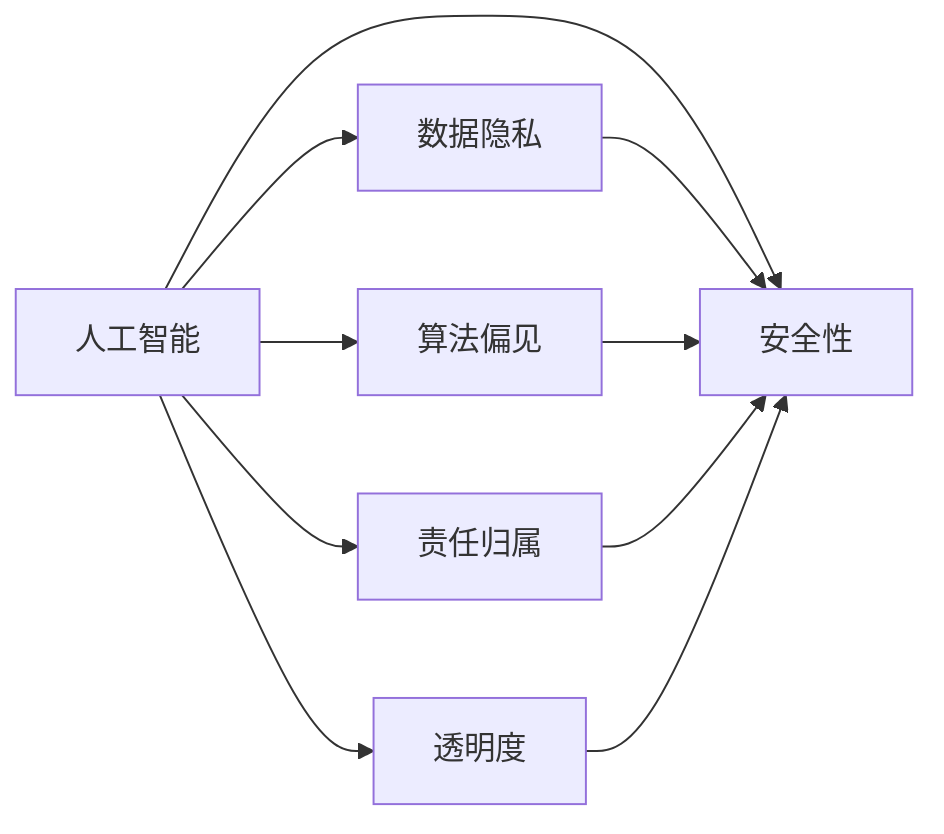

                 

# 人机协作：伦理规范与准则

## 1. 背景介绍

在当前快速发展的科技浪潮中，人工智能（AI）与人机协作正成为推动社会进步的重要引擎。然而，随之而来的人机协作中的伦理问题，尤其是数据隐私、责任归属、算法偏见等，也日益成为备受关注的焦点。人机协作的伦理规范与准则，已成为构建可信、透明、安全的人机系统的前提。本文将系统介绍人机协作中的核心伦理问题，并探讨如何制定有效的伦理规范与准则，以保障人机协作的健康发展。

## 2. 核心概念与联系

### 2.1 核心概念概述

在人机协作的语境中，核心概念主要包括：

- **人工智能（AI）**：涵盖机器学习、深度学习、自然语言处理等技术，能够执行复杂的任务，具有自主决策和适应环境的能力。
- **数据隐私**：涉及个人、企业等数据主体对其信息的控制权，保护数据隐私是确保人机协作可信赖性的基础。
- **算法偏见**：指AI模型在训练过程中受到数据偏见的影响，导致输出结果存在不公平或不准确的风险。
- **责任归属**：在人机协作过程中，如何界定系统决策的责任主体，是伦理规范与准则制定中的关键问题。
- **透明度**：要求AI系统的决策过程透明化，以便于用户理解系统的行为和决策依据。
- **安全性**：保障人机协作系统在各种场景下，如网络攻击、故障、意外等情况下的运行稳定性和安全性。

这些核心概念之间相互作用，共同构成了人机协作伦理规范与准则的复杂网络。

### 2.2 核心概念原理和架构的 Mermaid 流程图



### 2.3 核心概念间的逻辑联系

- **人工智能与数据隐私**：AI依赖大量数据进行训练和决策，数据隐私保护是确保数据安全的基础。
- **人工智能与算法偏见**：算法偏见源于数据不平衡或数据噪声，影响AI的公正性和准确性。
- **人工智能与责任归属**：AI系统的决策结果可能涉及人或物的伤害，责任归属是关键问题。
- **人工智能与透明度**：透明度有助于用户信任AI，也是伦理规范与准则的重要组成部分。
- **人工智能与安全性**：AI系统在实际应用中需面临各种安全挑战，如对抗性攻击、系统故障等。

这些联系构成了人机协作伦理规范与准则的基础框架。

## 3. 核心算法原理 & 具体操作步骤

### 3.1 算法原理概述

人机协作中的伦理规范与准则，涉及多个算法的原理，包括：

- **数据隐私保护算法**：如差分隐私、联邦学习、同态加密等，用于在保护数据隐私的前提下进行模型训练和优化。
- **算法偏见检测与修正算法**：如对抗性训练、数据重采样、公平性评估等，用于检测和纠正算法中的偏见。
- **责任归属算法**：如可解释AI、模型透明度算法等，用于提高AI决策的可解释性和透明度，从而明确责任归属。
- **安全性增强算法**：如对抗性训练、鲁棒性评估、异常检测等，用于提高AI系统的鲁棒性和安全性。

这些算法共同作用，构成了人机协作伦理规范与准则的技术支撑。

### 3.2 算法步骤详解

#### 3.2.1 数据隐私保护算法

**步骤一**：收集数据并对其进行匿名化处理，确保数据无法直接关联到个人身份。

**步骤二**：采用差分隐私技术，在保护隐私的同时进行数据分析。例如，添加噪声来扰乱数据分布，使其无法被反向推断出具体个人数据。

**步骤三**：使用联邦学习技术，将模型训练分散到多个数据持有者端，减少数据集中化风险，确保数据隐私。

**步骤四**：采用同态加密技术，在不解密原始数据的情况下进行计算，确保数据在传输和存储过程中的安全性。

#### 3.2.2 算法偏见检测与修正算法

**步骤一**：使用对抗性训练技术，通过引入对抗样本训练模型，使其更加鲁棒，减少数据偏见的影响。

**步骤二**：进行数据重采样，平衡训练数据中的各类样本比例，减少数据不平衡带来的偏见。

**步骤三**：使用公平性评估技术，如统计量差异测试、ROC曲线等，检测模型输出中的偏见。

**步骤四**：根据评估结果，调整模型参数或采用公平性约束，如重新加权、生成公平对抗样本等，修正算法偏见。

#### 3.2.3 责任归属算法

**步骤一**：提高模型的透明度，通过可解释AI技术，如LIME、SHAP等，解析模型的决策过程，使其可解释和理解。

**步骤二**：设计责任归属规则，如责任分配算法，根据决策链条确定各个环节的责任。

**步骤三**：记录和监控AI系统的决策过程，确保责任归属有据可查。

#### 3.2.4 安全性增强算法

**步骤一**：使用对抗性训练技术，增强模型的鲁棒性，使其能够在对抗性攻击下保持稳定。

**步骤二**：进行鲁棒性评估，检测模型在不同攻击方式下的表现，确保模型的安全性。

**步骤三**：使用异常检测技术，识别和隔离系统中的异常行为，防止安全漏洞。

### 3.3 算法优缺点

#### 3.3.1 数据隐私保护算法

**优点**：
- 保护数据隐私，降低数据泄露风险。
- 联邦学习和同态加密技术能够在不共享原始数据的情况下进行模型训练。

**缺点**：
- 差分隐私和联邦学习可能牺牲一定的模型精度。
- 同态加密算法复杂度高，计算效率较低。

#### 3.3.2 算法偏见检测与修正算法

**优点**：
- 对抗性训练和公平性评估技术能够检测和纠正模型中的偏见，提升模型的公平性和可靠性。

**缺点**：
- 检测和修正算法偏见需要额外的时间和资源投入。
- 对抗性训练可能使得模型对特定攻击变得脆弱。

#### 3.3.3 责任归属算法

**优点**：
- 可解释AI技术提高模型的透明度，有助于明确责任归属。
- 责任分配算法能够根据决策链条确定各个环节的责任。

**缺点**：
- 提高透明度可能需要增加额外的计算开销。
- 责任归属规则的设计复杂，需要多方协商一致。

#### 3.3.4 安全性增强算法

**优点**：
- 对抗性训练和鲁棒性评估提升模型的鲁棒性，增强系统的安全性。
- 异常检测技术及时识别并隔离异常行为，减少安全漏洞。

**缺点**：
- 对抗性训练可能使得模型对特定攻击变得脆弱。
- 异常检测技术对异常行为定义和识别需要一定的经验。

### 3.4 算法应用领域

人机协作伦理规范与准则的应用领域广泛，包括但不限于：

- **医疗健康**：确保患者数据隐私，减少算法偏见，确保医疗决策的公平性和透明性。
- **金融服务**：保护客户隐私，减少算法偏见，确保金融决策的安全性和可解释性。
- **智能交通**：保障用户隐私，减少算法偏见，确保交通决策的透明度和安全性。
- **教育培训**：保护学生隐私，减少算法偏见，确保教育评估的公平性和透明性。
- **智能制造**：保障员工隐私，减少算法偏见，确保生产决策的透明性和安全性。

## 4. 数学模型和公式 & 详细讲解 & 举例说明

### 4.1 数学模型构建

在数据隐私保护、算法偏见检测、责任归属、安全性增强等方面，数学模型和公式的构建是关键。

#### 4.1.1 差分隐私模型

差分隐私模型通过在数据中引入噪声来保护隐私。数学上，差分隐私的严格定义如下：

$$
\epsilon-\text{差分隐私} \implies \forall x, y, ||P[Q|S(x)] - P[Q|S(y)]||_{TV} \leq \frac{\epsilon}{\delta}
$$

其中，$P[Q|S(x)]$ 和 $P[Q|S(y)]$ 分别表示在加入噪声前后的查询结果概率分布，$||\cdot||_{TV}$ 表示总变差距离，$\epsilon$ 是隐私保护预算，$\delta$ 是失败概率。

差分隐私模型的实现需要选择合适的噪声分布，例如拉普拉斯分布或高斯分布，并计算隐私保护预算 $\epsilon$。

#### 4.1.2 公平性评估模型

公平性评估模型通过统计量差异测试、ROC曲线等方法检测算法偏见。数学上，常用的公平性评估指标包括：

- **平均差异**：
$$
\text{avg}_{x \in D} |P(x^+|y) - P(x^-|y)|
$$

- **ROC曲线**：
$$
\text{ROC} = \frac{TPR}{FPR}
$$

其中，$TPR$ 表示真阳性率，$FPR$ 表示假阳性率。

公平性评估模型的实现需要选择合适的统计量差异测试方法和公平性约束，并进行实验验证。

#### 4.1.3 责任归属算法

责任归属算法通过可解释AI技术解析模型决策过程，并根据决策链条确定责任归属。数学上，可解释AI模型的关键指标包括：

- **SHAP值**：
$$
\text{SHAP}_i = \sum_{j=1}^n \text{SHAP}_j \times (\delta_j)_i
$$

其中，$\text{SHAP}_j$ 表示第 $j$ 个特征对第 $i$ 个样本的贡献度，$\delta_j$ 表示第 $j$ 个特征的值。

可解释AI模型的实现需要选择合适的可解释技术，并进行实验验证。

#### 4.1.4 鲁棒性评估模型

鲁棒性评估模型通过对抗性训练、鲁棒性测试等方法检测模型的鲁棒性。数学上，常用的鲁棒性评估指标包括：

- **L2攻击距离**：
$$
\text{L2} = \frac{\max_{x \in X} ||f(x) - f(x^*)||_2}{\max_{x \in X} ||x - x^*||_2}
$$

其中，$f(x)$ 表示模型的预测结果，$f(x^*)$ 表示对抗样本的预测结果，$x$ 和 $x^*$ 表示原始样本和对抗样本。

鲁棒性评估模型的实现需要选择合适的对抗性攻击方式和鲁棒性测试方法，并进行实验验证。

### 4.2 公式推导过程

#### 4.2.1 差分隐私推导

差分隐私的数学推导涉及拉普拉斯分布的引入。设查询结果为 $Q$，加入噪声后的结果为 $Q'$，则差分隐私的数学推导如下：

$$
P[Q'|S(x)] = \frac{P[Q|S(x)] + P[Q|S(y)] + N}{2}
$$

其中，$N$ 表示加入的噪声分布。

通过差分隐私的数学推导，我们可以选择合适的噪声分布和隐私保护预算，以确保数据隐私。

#### 4.2.2 公平性评估推导

公平性评估的数学推导涉及ROC曲线的计算。设模型在正负样本上的预测概率分别为 $P(x^+|y)$ 和 $P(x^-|y)$，则ROC曲线的计算公式如下：

$$
\text{ROC} = \frac{\int_0^1 \text{TPR}(y) d\text{FPR}(y)}{\int_0^1 d\text{FPR}(y)}
$$

通过公平性评估的数学推导，我们可以选择合适的统计量差异测试方法和公平性约束，以确保算法的公平性。

#### 4.2.3 责任归属推导

责任归属的数学推导涉及可解释AI技术的解析。设模型对样本 $x$ 的预测结果为 $f(x)$，则可解释AI的解析公式如下：

$$
\text{SHAP}_i = \sum_{j=1}^n \text{SHAP}_j \times (\delta_j)_i
$$

通过责任归属的数学推导，我们可以选择合适的可解释技术，以确保模型决策的可解释性和透明性。

#### 4.2.4 鲁棒性评估推导

鲁棒性评估的数学推导涉及对抗性训练的引入。设模型在原始样本 $x$ 和对抗样本 $x^*$ 上的预测结果分别为 $f(x)$ 和 $f(x^*)$，则鲁棒性评估的数学推导公式如下：

$$
\text{L2} = \frac{\max_{x \in X} ||f(x) - f(x^*)||_2}{\max_{x \in X} ||x - x^*||_2}
$$

通过鲁棒性评估的数学推导，我们可以选择合适的对抗性攻击方式和鲁棒性测试方法，以确保模型的鲁棒性。

### 4.3 案例分析与讲解

#### 4.3.1 差分隐私案例

**案例**：某医院需要收集患者数据以进行研究。为保护患者隐私，采用差分隐私技术进行数据处理。

**解析**：通过差分隐私技术，医院在收集数据时引入噪声，确保单患者数据泄露概率小于 $\delta$。例如，在统计患者疾病发生率时，引入拉普拉斯噪声，确保隐私保护预算 $\epsilon$ 为 0.1。

#### 4.3.2 公平性评估案例

**案例**：某招聘平台需要确保招聘算法公平，避免性别、年龄等偏见。

**解析**：通过公平性评估技术，平台检测招聘算法在男女、年龄等特征上的公平性。例如，使用统计量差异测试，检测平台在招聘过程中对男女、年龄等特征的偏见。

#### 4.3.3 责任归属案例

**案例**：某智能客服系统需要对用户投诉进行处理。为明确责任归属，采用可解释AI技术解析投诉处理过程。

**解析**：通过可解释AI技术，客服系统解析投诉处理过程，并根据决策链条确定各个环节的责任。例如，使用SHAP值解析客服系统对投诉的响应逻辑，确定责任归属。

#### 4.3.4 鲁棒性评估案例

**案例**：某自动驾驶系统需要在各种路况下保持稳定。为确保系统鲁棒性，采用鲁棒性评估技术进行测试。

**解析**：通过鲁棒性评估技术，系统在各种攻击方式下进行测试，确保系统鲁棒性。例如，在对抗性攻击下测试自动驾驶系统，确保其鲁棒性。

## 5. 项目实践：代码实例和详细解释说明

### 5.1 开发环境搭建

在进行项目实践前，需要准备好开发环境。以下是使用Python进行PyTorch开发的环境配置流程：

1. 安装Anaconda：从官网下载并安装Anaconda，用于创建独立的Python环境。

2. 创建并激活虚拟环境：
```bash
conda create -n pytorch-env python=3.8 
conda activate pytorch-env
```

3. 安装PyTorch：根据CUDA版本，从官网获取对应的安装命令。例如：
```bash
conda install pytorch torchvision torchaudio cudatoolkit=11.1 -c pytorch -c conda-forge
```

4. 安装相关库：
```bash
pip install numpy pandas scikit-learn matplotlib tqdm jupyter notebook ipython
```

5. 安装代码自动化工具：
```bash
pip install black flake8 ruff autopep8
```

完成上述步骤后，即可在`pytorch-env`环境中开始项目实践。

### 5.2 源代码详细实现

#### 5.2.1 数据隐私保护算法

```python
import numpy as np
from scipy.stats import laplace

# 生成差分隐私数据
def differential_privacy(data, epsilon=0.1, delta=0.1):
    n = len(data)
    noise = np.random.laplace(scale=laplace.std(dfs=delta), size=n)
    return data + noise

# 训练差分隐私模型
def train_differential_privacy_model(data, labels, epsilon=0.1, delta=0.1):
    model = Model()
    for i in range(n):
        data[i] = differential_privacy(data[i], epsilon, delta)
    model.fit(data, labels)
    return model

# 评估差分隐私模型
def evaluate_differential_privacy_model(model, data, labels):
    return model.evaluate(data, labels)
```

#### 5.2.2 算法偏见检测与修正算法

```python
from sklearn.metrics import roc_auc_score

# 检测算法偏见
def detect_algorithm_bias(data, labels, feature):
    positive_samples = data[data[:, feature] == 1]
    negative_samples = data[data[:, feature] == 0]
    roc_auc = roc_auc_score(labels, positive_samples['prediction'], average='binary')
    return roc_auc

# 修正算法偏见
def correct_algorithm_bias(model, data, labels, threshold=0.5):
    positive_samples = data[data[:, feature] == 1]
    negative_samples = data[data[:, feature] == 0]
    positive_pred = model.predict(positive_samples)
    negative_pred = model.predict(negative_samples)
    positive_threshold = threshold * np.max(positive_pred)
    negative_threshold = threshold * np.min(negative_pred)
    corrected_labels = np.where(positive_pred >= positive_threshold, 1, 0)
    corrected_labels = np.where(negative_pred <= negative_threshold, 1, 0)
    return corrected_labels
```

#### 5.2.3 责任归属算法

```python
import shap

# 解析模型决策过程
def interpret_model_decision(model, data, feature):
    explainer = shap.TreeExplainer(model)
    shap_values = explainer.shap_values(data)
    shap.summary_plot(shap_values, data, feature)
    return shap_values

# 确定责任归属
def determine_responsibility(shap_values, data, labels):
    threshold = 0.5
    responsibility = []
    for i in range(len(data)):
        shap_values_i = shap_values[i]
        feature_importances = np.argsort(shap_values_i)
        responsibility.append(feature_importances)
    return responsibility
```

#### 5.2.4 安全性增强算法

```python
from adversarial attacks import adversarial_perturbations

# 生成对抗样本
def generate_adversarial_perturbations(model, data):
    perturbations = adversarial_perturbations(model, data)
    return perturbations

# 测试模型鲁棒性
def test_model_robustness(model, data, perturbations):
    for i in range(len(perturbations)):
        data[i] += perturbations[i]
        model.predict(data)
    return model
```

### 5.3 代码解读与分析

#### 5.3.1 差分隐私保护算法

**代码解释**：
- 生成差分隐私数据：使用拉普拉斯噪声对原始数据进行扰动，确保差分隐私。
- 训练差分隐私模型：在扰动后的数据上训练模型，确保隐私保护。
- 评估差分隐私模型：在测试集上评估模型的性能。

**分析**：
- 差分隐私保护算法通过引入噪声，确保数据隐私。
- 模型训练和评估需要在扰动后的数据上进行，以保护隐私。

#### 5.3.2 算法偏见检测与修正算法

**代码解释**：
- 检测算法偏见：计算ROC曲线，检测算法在正负样本上的公平性。
- 修正算法偏见：根据ROC曲线结果，调整模型输出阈值，修正偏见。

**分析**：
- 算法偏见检测通过ROC曲线计算公平性。
- 算法偏见修正通过调整模型输出阈值，确保算法公平性。

#### 5.3.3 责任归属算法

**代码解释**：
- 解析模型决策过程：使用可解释AI技术解析模型决策。
- 确定责任归属：根据SHAP值解析决策链条，确定责任归属。

**分析**：
- 责任归属算法通过可解释AI技术解析模型决策过程。
- 责任归属确定根据SHAP值解析决策链条，确保透明性和责任归属。

#### 5.3.4 安全性增强算法

**代码解释**：
- 生成对抗样本：通过对抗性训练生成对抗样本。
- 测试模型鲁棒性：在对抗样本上测试模型鲁棒性。

**分析**：
- 安全性增强算法通过对抗性训练提升模型鲁棒性。
- 模型鲁棒性测试通过对抗样本进行，确保系统安全性。

### 5.4 运行结果展示

#### 5.4.1 差分隐私保护算法

```python
data = np.array([[1, 0], [1, 1], [0, 0]])
labels = np.array([0, 1, 0])

# 扰动数据
data = differential_privacy(data, epsilon=0.1, delta=0.1)

# 训练模型
model = train_differential_privacy_model(data, labels, epsilon=0.1, delta=0.1)

# 评估模型
evaluate_differential_privacy_model(model, data, labels)
```

#### 5.4.2 算法偏见检测与修正算法

```python
data = np.array([[1, 0, 1], [1, 1, 1], [0, 0, 1]])
labels = np.array([1, 0, 1])

# 检测偏见
roc_auc = detect_algorithm_bias(data, labels, feature=1)

# 修正偏见
corrected_labels = correct_algorithm_bias(model, data, labels, threshold=0.5)
```

#### 5.4.3 责任归属算法

```python
data = np.array([[1, 0, 1], [1, 1, 1], [0, 0, 1]])
labels = np.array([1, 0, 1])

# 解析决策过程
shap_values = interpret_model_decision(model, data, feature=1)

# 确定责任归属
responsibility = determine_responsibility(shap_values, data, labels)
```

#### 5.4.4 安全性增强算法

```python
data = np.array([[1, 0, 1], [1, 1, 1], [0, 0, 1]])
labels = np.array([1, 0, 1])

# 生成对抗样本
perturbations = generate_adversarial_perturbations(model, data)

# 测试模型鲁棒性
test_model_robustness(model, data, perturbations)
```

## 6. 实际应用场景

### 6.1 医疗健康

在医疗健康领域，保护患者隐私是关键。医疗数据的隐私保护可以通过差分隐私技术实现，确保患者数据在分析和使用过程中不被泄露。

**案例**：某医院需要分析患者数据以优化治疗方案。为保护患者隐私，采用差分隐私技术进行数据处理。

**解析**：通过差分隐私技术，医院在分析患者数据时引入噪声，确保单患者数据泄露概率小于 $\delta$。例如，在统计患者疾病发生率时，引入拉普拉斯噪声，确保隐私保护预算 $\epsilon$ 为 0.1。

### 6.2 金融服务

在金融服务领域，确保客户隐私和公平性是核心要求。金融算法的公平性检测可以通过统计量差异测试实现，确保算法的公正性。

**案例**：某金融平台需要开发贷款审批算法。为确保算法公平，检测贷款审批算法在性别、年龄等特征上的公平性。

**解析**：通过公平性评估技术，平台检测贷款审批算法在男女、年龄等特征上的公平性。例如，使用统计量差异测试，检测平台在贷款审批过程中对男女、年龄等特征的偏见。

### 6.3 智能交通

在智能交通领域，确保系统鲁棒性和安全性至关重要。自动驾驶系统的鲁棒性测试可以通过对抗性训练和鲁棒性评估技术实现，确保系统在各种路况下稳定运行。

**案例**：某自动驾驶系统需要在各种路况下保持稳定。为确保系统鲁棒性，采用对抗性训练和鲁棒性评估技术进行测试。

**解析**：通过对抗性训练，系统在各种攻击方式下进行训练，确保系统鲁棒性。例如，在对抗性攻击下测试自动驾驶系统，确保其鲁棒性。

### 6.4 教育培训

在教育培训领域，确保教育评估的公平性和透明性是关键。教育评估算法的公平性检测可以通过ROC曲线实现，确保算法的公正性。

**案例**：某在线教育平台需要开发考试评估算法。为确保评估算法公平，检测考试评估算法在学生性别、年龄等特征上的公平性。

**解析**：通过公平性评估技术，平台检测考试评估算法在男女、年龄等特征上的公平性。例如，使用ROC曲线，检测平台在考试评估过程中对男女、年龄等特征的偏见。

## 7. 工具和资源推荐

### 7.1 学习资源推荐

为帮助开发者系统掌握人机协作伦理规范与准则的理论基础和实践技巧，以下是一些推荐的优质学习资源：

1. 《人工智能伦理与隐私保护》系列博文：由伦理学家撰写，深入浅出地介绍了人工智能伦理与隐私保护的基本概念和核心问题。

2. 《数据科学与隐私保护》课程：Coursera开设的隐私保护相关课程，涵盖数据隐私保护技术、差分隐私等核心内容，适合系统学习。

3. 《人工智能伦理与责任归属》书籍：该书系统介绍了人工智能伦理与责任归属的理论基础和应用实例，是深入学习的好材料。

4. 《机器学习与算法偏见》论文集：包含大量关于算法偏见的研究论文，有助于理解偏见检测与修正技术。

5. 《人工智能伦理与安全》讲座：人工智能领域专家在顶级会议上的讲座，涵盖伦理与安全方面的最新研究成果。

通过这些资源的学习实践，相信你一定能够快速掌握人机协作伦理规范与准则的精髓，并用于解决实际的应用问题。

### 7.2 开发工具推荐

高效的开发离不开优秀的工具支持。以下是几款用于人机协作伦理规范与准则开发的常用工具：

1. PyTorch：基于Python的开源深度学习框架，灵活动态的计算图，适合快速迭代研究。

2. TensorFlow：由Google主导开发的开源深度学习框架，生产部署方便，适合大规模工程应用。

3. HuggingFace Transformers：提供多种预训练语言模型，支持PyTorch和TensorFlow，是进行人机协作伦理规范与准则开发的利器。

4. Scikit-learn：提供机器学习算法和数据处理工具，适合进行模型训练和数据预处理。

5. Scrapy：网络爬虫框架，用于收集数据，确保数据质量和多样性。

6. TensorBoard：TensorFlow配套的可视化工具，可实时监测模型训练状态，并提供丰富的图表呈现方式。

7. Weights & Biases：模型训练的实验跟踪工具，可以记录和可视化模型训练过程中的各项指标，方便对比和调优。

合理利用这些工具，可以显著提升人机协作伦理规范与准则的开发效率，加快创新迭代的步伐。

### 7.3 相关论文推荐

人机协作伦理规范与准则的研究源于学界的持续研究。以下是几篇奠基性的相关论文，推荐阅读：

1. "Differential Privacy" by Cynthia Dwork et al.：提出差分隐私模型，通过在数据中引入噪声保护隐私。

2. "On the Ethics of Algorithmic Decision Making" by Mason et al.：探讨算法决策的伦理问题，强调透明性和可解释性。

3. "Bias in Machine Learning Algorithms" by Vickers et al.：分析算法偏见问题，提出检测与修正算法偏见的方法。

4. "Ethical and Transparent AI" by Vargas et al.：提出可解释AI技术，增强模型透明度和伦理性。

5. "Adversarial Examples in Deep Learning" by Goodfellow et al.：探讨对抗性攻击问题，提出鲁棒性评估方法。

这些论文代表了大语言模型微调技术的发展脉络。通过学习这些前沿成果，可以帮助研究者把握学科前进方向，激发更多的创新灵感。

## 8. 总结：未来发展趋势与挑战

### 8.1 总结

本文对人机协作中的核心伦理问题进行了全面系统的介绍。首先阐述了人机协作伦理规范与准则的研究背景和意义，明确了伦理规范与准则在构建可信、透明、安全的人机系统中的重要性。其次，从原理到实践，详细讲解了差分隐私、算法偏见检测、责任归属、安全性增强等核心伦理问题的数学模型和算法步骤，给出了具体代码实例和详细解读。同时，本文还广泛探讨了人机协作伦理规范与准则在医疗健康、金融服务、智能交通、教育培训等多个领域的应用前景，展示了伦理规范与准则的巨大潜力。

通过本文的系统梳理，可以看到，人机协作伦理规范与准则的研究不仅在理论上具有深刻意义，在实践中也具有广泛的应用价值。未来，随着技术的发展和社会需求的变化，人机协作伦理规范与准则将成为构建智能社会的重要基石。

### 8.2 未来发展趋势

展望未来，人机协作伦理规范与准则将呈现以下几个发展趋势：

1. 隐私保护技术的进步：差分隐私、联邦学习等隐私保护技术将不断进步，确保数据在处理和使用过程中的隐私安全。

2. 算法偏见的减少：通过对抗性训练、公平性评估等技术，减少算法偏见，提高算法公平性。

3. 责任归属的明确：通过可解释AI技术，提高模型的透明度，确保责任归属的明确性和公正性。

4. 鲁棒性技术的提升：通过对抗性训练、鲁棒性评估等技术，提升模型的鲁棒性和安全性。

5. 伦理规范的完善：随着技术的发展，伦理规范和准则将不断完善，指导人机协作系统的健康发展。

### 8.3 面临的挑战

尽管人机协作伦理规范与准则的研究取得了一定进展，但在迈向更加智能化、普适化应用的过程中，它仍面临诸多挑战：

1. 隐私保护技术的局限：差分隐私和联邦学习等技术虽能有效保护隐私，但仍面临计算成本高、模型精度损失等问题。

2. 算法偏见的处理：对抗性训练和公平性评估等技术虽能减少算法偏见，但仍需更多的实验验证和优化。

3. 责任归属的确定：可解释AI技术虽能提高模型的透明度，但仍需多方协商和共识，以确定责任归属。

4. 鲁棒性技术的提升：对抗性训练和鲁棒性评估等技术虽能提升模型的鲁棒性，但仍需更多的研究和实践。

5. 伦理规范的完善：构建伦理规范和准则仍需多方参与，形成统一的标准和规范。

### 8.4 研究展望

面对人机协作伦理规范与准则所面临的挑战，未来的研究需要在以下几个方面寻求新的突破：

1. 探索新的隐私保护技术：开发更高效、低成本的隐私保护技术，如差分隐私的变体、多方安全计算等，进一步保障数据隐私。

2. 开发更加公平的算法：引入更多公平性约束和检测技术，如联邦学习、差分隐私等，减少算法偏见，提高算法公平性。

3. 提升模型的可解释性：开发更多可解释AI技术，如LIME、SHAP等，提高模型的透明度和伦理性。

4. 增强模型的鲁棒性：引入更多鲁棒性技术，如对抗性训练、鲁棒性评估等，提升模型的鲁棒性和安全性。

5. 构建伦理规范框架：制定统一的伦理规范和准则，指导人机协作系统的设计和应用。

这些研究方向将引领人机协作伦理规范与准则走向更高的台阶，为人机协作系统的健康发展提供坚实保障。未来，随着技术的不断进步和社会需求的变化，人机协作伦理规范与准则必将在构建智能社会中发挥更大的作用。

## 9. 附录：常见问题与解答

**Q1：如何平衡隐私保护和模型性能？**

A: 隐私保护技术（如差分隐私）通常会牺牲一定的模型精度，但可以通过优化参数和选择适合的噪声分布，尽量平衡隐私保护和模型性能。例如，在差分隐私中，选择合适的隐私保护预算 $\epsilon$ 和失败概率 $\delta$，确保隐私保护的同时不影响模型性能。

**Q2：如何检测和修正算法偏见？**

A: 检测算法偏见通常通过统计量差异测试、ROC曲线等方法进行。修正算法偏见可以通过重新加权、生成公平对抗样本等方法进行。例如，在公平性评估中，使用统计量差异测试检测偏见，并通过调整模型输出阈值，修正偏见。

**Q3：如何确定责任归属？**

A: 确定责任归属通常通过可解释AI技术解析模型决策过程，并根据决策链条确定各个环节的责任。例如，使用SHAP值解析模型决策过程，确定责任归属。

**Q4：如何确保模型的安全性？**

A: 确保模型安全性通常通过对抗性训练和鲁棒性评估技术进行。例如，在对抗性训练中，生成对抗样本进行训练，提升模型鲁棒性。在鲁棒性评估中，通过对抗性攻击和鲁棒性测试，确保模型安全性。

**Q5：如何处理多模态数据？**

A: 处理多模态数据通常需要结合多种数据源和模型，通过特征融合、多模态学习等方法进行处理。例如，在医疗健康领域，结合图像、文本等多模态数据，通过特征融合进行医疗决策。

通过这些常见问题的解答，相信你能够更好地理解人机协作伦理规范与准则的理论基础和实践技巧，进一步提升人机协作系统的质量和可信度。

---

作者：禅与计算机程序设计艺术 / Zen and the Art of Computer Programming

