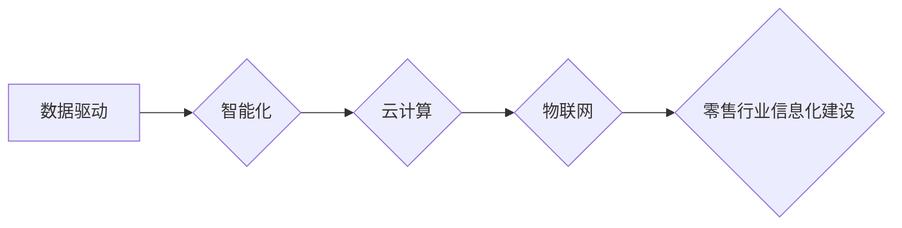

> 零售行业、信息化建设、数据分析、人工智能、云计算、物联网、供应链管理、客户关系管理

## 1. 背景介绍

在当今数字化时代，零售行业面临着前所未有的挑战和机遇。消费者购物习惯的转变、电商平台的崛起以及供应链的复杂化，都迫使零售企业寻求新的发展模式。信息化建设已成为零售行业转型升级的关键驱动力，能够帮助零售企业提升运营效率、优化客户体验、增强竞争力。

零售行业信息化建设的目标是通过信息技术手段，实现零售企业的数字化转型，构建智能化、高效化、可持续发展的经营模式。信息化建设涵盖了多个方面，包括：

* **门店数字化转型:** 利用物联网、大数据、人工智能等技术，实现门店智能化运营，提升顾客体验，优化商品展示和销售流程。
* **供应链管理优化:** 通过信息共享、数据分析和智能决策，实现供应链的透明化、高效化和可视化，降低运营成本，提高供应链韧性。
* **客户关系管理提升:** 利用大数据分析和人工智能技术，精准识别客户需求，提供个性化服务，提升客户忠诚度和满意度。
* **电商平台建设:** 建设线上销售平台，拓展销售渠道，实现线上线下融合发展。

## 2. 核心概念与联系

零售行业信息化建设的核心概念包括：

* **数据驱动:** 将数据作为决策的基石，通过数据分析和挖掘，洞察市场趋势、客户需求和运营效率，为决策提供依据。
* **智能化:** 利用人工智能、机器学习等技术，实现自动化决策、智能化服务和预测分析，提升运营效率和客户体验。
* **云计算:** 利用云计算平台，实现资源共享、弹性伸缩和成本优化，降低IT基础设施建设和维护成本。
* **物联网:** 利用物联网技术，连接门店、仓库、物流等环节，实现数据实时采集和传输，提升供应链透明度和效率。

**核心概念架构图:**



## 3. 核心算法原理 & 具体操作步骤

### 3.1  算法原理概述

在零售行业信息化建设中，常用的算法包括：

* **推荐算法:** 基于用户历史行为、商品特征等数据，推荐用户可能感兴趣的商品。
* **预测算法:** 利用历史数据预测未来销售额、库存需求等指标，帮助企业进行库存管理和销售预测。
* **聚类算法:** 将用户或商品进行分类，帮助企业进行市场细分和精准营销。
* **异常检测算法:** 检测数据中的异常值，例如欺诈交易、库存异常等，帮助企业进行风险控制。

### 3.2  算法步骤详解

以推荐算法为例，其基本步骤如下：

1. **数据收集:** 收集用户行为数据、商品信息数据等。
2. **数据预处理:** 对数据进行清洗、转换、特征提取等处理。
3. **模型训练:** 选择合适的推荐算法模型，利用训练数据进行模型训练。
4. **模型评估:** 利用测试数据评估模型的性能，例如准确率、召回率等。
5. **模型部署:** 将训练好的模型部署到线上环境，为用户提供个性化推荐服务。

### 3.3  算法优缺点

不同的推荐算法具有不同的优缺点，需要根据实际应用场景选择合适的算法。

* **协同过滤算法:** 优点是能够发现用户之间的隐性关联，推荐个性化商品。缺点是数据稀疏性问题，需要大量的用户行为数据才能有效。
* **内容过滤算法:** 优点是能够根据商品特征进行推荐，不受数据稀疏性的影响。缺点是推荐结果可能过于单一，缺乏个性化。
* **基于知识的推荐算法:** 优点是能够利用商品属性、用户偏好等知识进行推荐，推荐结果更精准。缺点是需要构建复杂的知识图谱，数据维护成本较高。

### 3.4  算法应用领域

推荐算法广泛应用于零售行业，例如：

* **商品推荐:** 根据用户浏览历史、购买记录等数据，推荐用户可能感兴趣的商品。
* **个性化营销:** 根据用户画像，进行精准营销，提高营销效果。
* **跨界推荐:** 根据用户兴趣爱好，推荐跨界商品，拓展销售渠道。

## 4. 数学模型和公式 & 详细讲解 & 举例说明

### 4.1  数学模型构建

在零售行业信息化建设中，常用的数学模型包括：

* **需求预测模型:** 利用历史销售数据、市场趋势等因素，预测未来商品需求。
* **库存优化模型:** 利用需求预测模型、成本模型等因素，优化库存水平，降低库存成本。
* **定价模型:** 利用市场需求、成本、竞争对手价格等因素，制定合理的商品定价策略。

### 4.2  公式推导过程

以需求预测模型为例，常用的ARIMA模型可以用来预测未来需求。ARIMA模型的公式如下：

$$
y_t = c + \phi_1 y_{t-1} + \phi_2 y_{t-2} + ... + \phi_p y_{t-p} + \theta_1 \epsilon_{t-1} + \theta_2 \epsilon_{t-2} + ... + \theta_q \epsilon_{t-q} + \epsilon_t
$$

其中：

* $y_t$ 表示时间t的实际需求量
* $c$ 表示截距项
* $\phi_i$ 表示自回归系数
* $y_{t-i}$ 表示时间t-i的实际需求量
* $\theta_j$ 表示移动平均系数
* $\epsilon_{t-j}$ 表示时间t-j的随机误差项
* $p$ 表示自回归阶数
* $q$ 表示移动平均阶数

### 4.3  案例分析与讲解

假设一家零售企业想要预测未来三个月的商品需求量，可以使用ARIMA模型进行预测。首先需要收集历史销售数据，然后根据数据特征选择合适的ARIMA模型参数。最后，利用模型进行预测，并根据预测结果进行库存管理和销售计划。

## 5. 项目实践：代码实例和详细解释说明

### 5.1  开发环境搭建

零售行业信息化建设项目通常需要搭建以下开发环境：

* **服务器:** 用于运行应用程序和数据库。
* **数据库:** 用于存储商品信息、用户数据、订单数据等。
* **开发工具:** 用于开发应用程序，例如Java、Python等编程语言，以及相关框架和工具。

### 5.2  源代码详细实现

以下是一个简单的商品推荐系统代码示例，使用Python语言和Scikit-learn库实现协同过滤算法：

```python
from sklearn.metrics.pairwise import cosine_similarity

# 用户行为数据
user_item_matrix = {
    'user1': {'item1': 5, 'item2': 3, 'item3': 4},
    'user2': {'item1': 4, 'item2': 5, 'item3': 2},
    'user3': {'item1': 3, 'item2': 2, 'item3': 5},
}

# 计算用户之间的相似度
user_similarity = cosine_similarity(user_item_matrix.values())

# 获取用户1与其他用户的相似度
user1_similarity = user_similarity[0]

# 获取与用户1相似度最高的两个用户
top_k_users = np.argsort(user1_similarity)[::-1][:2]

# 推荐给用户1的商品
recommended_items = set()
for user_id in top_k_users:
    for item, rating in user_item_matrix[user_id].items():
        if item not in recommended_items:
            recommended_items.add(item)

print(f"推荐给用户1的商品: {recommended_items}")
```

### 5.3  代码解读与分析

这段代码首先定义了用户行为数据，然后使用cosine_similarity函数计算用户之间的相似度。接着，获取与用户1相似度最高的两个用户，并根据这些用户的评分推荐商品给用户1。

### 5.4  运行结果展示

运行这段代码后，会输出推荐给用户1的商品列表。

## 6. 实际应用场景

### 6.1  门店数字化转型

利用物联网、大数据、人工智能等技术，实现门店智能化运营，提升顾客体验，优化商品展示和销售流程。例如：

* **智能货架:** 通过传感器监测商品库存，自动补货，避免缺货现象。
* **智能导购:** 利用机器人或虚拟助手，为顾客提供个性化导购服务。
* **智能支付:** 支持多种支付方式，例如手机支付、二维码支付等，提高支付效率。

### 6.2  供应链管理优化

通过信息共享、数据分析和智能决策，实现供应链的透明化、高效化和可视化，降低运营成本，提高供应链韧性。例如：

* **实时库存管理:** 利用物联网技术，实时监控库存水平，避免库存积压和缺货现象。
* **智能物流配送:** 利用大数据分析和路径规划算法，优化物流配送路线，提高配送效率。
* **风险预警:** 利用机器学习算法，预测供应链风险，例如原材料价格波动、运输延误等，及时采取应对措施。

### 6.3  客户关系管理提升

利用大数据分析和人工智能技术，精准识别客户需求，提供个性化服务，提升客户忠诚度和满意度。例如：

* **个性化推荐:** 根据用户购买历史、浏览记录等数据，推荐用户可能感兴趣的商品。
* **精准营销:** 根据用户画像，进行精准营销，提高营销效果。
* **客户服务自动化:** 利用聊天机器人等技术，自动回复客户咨询，提高服务效率。

### 6.4  未来应用展望

随着人工智能、物联网、云计算等技术的不断发展，零售行业信息化建设将迎来更多新的应用场景和发展机遇。例如：

* **虚拟现实和增强现实:** 利用虚拟现实和增强现实技术，打造沉浸式的购物体验。
* **个性化定制:** 利用3D打印等技术，实现商品个性化定制，满足消费者个性化需求。
* **无人零售:** 利用机器人和人工智能技术，实现无人零售，降低运营成本，提高效率。

## 7. 工具和资源推荐

### 7.1  学习资源推荐

* **书籍:**
    * 《零售行业数字化转型》
    * 《数据驱动零售》
    * 《人工智能在零售行业的应用》
* **在线课程:**
    * Coursera: 数据科学、机器学习、人工智能
    * Udemy: 零售行业数字化转型、电商平台建设
* **技术博客:**
    * Retail Dive
    * Chain Store Age
    * Internet Retailer

### 7.2  开发工具推荐

* **编程语言:** Python, Java, C#
* **数据分析工具:** Pandas, NumPy, Scikit-learn
* **云计算平台:** AWS, Azure, Google Cloud
* **物联网平台:** AWS IoT, Azure IoT, Google Cloud IoT

### 7.3  相关论文推荐

* **基于协同过滤的商品推荐算法研究**
* **利用机器学习预测零售行业销售额**
* **物联网技术在零售行业应用研究**

## 8. 总结：未来发展趋势与挑战

### 8.1  研究成果总结

零售行业信息化建设取得了显著成果，例如：

* **提升了运营效率:** 通过自动化、智能化手段，提高了库存管理、物流配送、客户服务等环节的效率。
* **优化了客户体验:** 通过个性化推荐、精准营销等手段，提升了客户购物体验和满意度。
* **降低了运营成本:** 通过优化供应链、提高效率等手段，降低了运营成本。

### 8.2  未来发展趋势

未来零售行业信息化建设将朝着以下趋势发展：

* **更加智能化:** 利用人工智能、机器学习等技术，实现更智能化的运营和服务。
* **更加个性化:** 利用大数据分析和个性化推荐技术，提供更加个性化的购物体验。
* **更加融合化:** 将线上