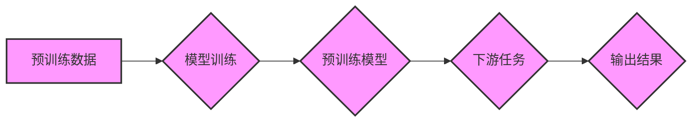

> 预训练模型，幻觉，数据完整性，数据偏差，模型鲁棒性，可解释性

## 1. 背景介绍

近年来，基于预训练的深度学习模型在自然语言处理、计算机视觉等领域取得了令人瞩目的成就。这些模型通过在海量文本或图像数据上进行预训练，学习了丰富的语义和结构知识，从而能够在各种下游任务中表现出色。然而，随着预训练模型规模和复杂度的不断增加，一个不容忽视的问题逐渐浮出水面：预训练数据的不完整性可能导致模型产生“幻觉”，即在处理某些输入时生成不合理、甚至荒谬的输出。

## 2. 核心概念与联系

**2.1 预训练模型**

预训练模型是指在大量未标记数据上进行训练的深度学习模型。这些模型学习了数据的普遍特征和模式，并能够迁移到各种下游任务中，无需从头开始训练。

**2.2 幻觉**

在人工智能领域，“幻觉”是指模型在处理某些输入时生成不合理、甚至荒谬的输出。这些输出可能与输入数据存在着逻辑上的矛盾，或者与现实世界中的知识和常识相违背。

**2.3 数据完整性**

数据完整性是指数据中不存在缺失、错误或重复等问题。完整的数据能够更好地反映真实世界，从而帮助模型学习更准确和可靠的知识。

**2.4 数据偏差**

数据偏差是指数据中存在某些特定特征或属性的过度或不足表达。这些偏差可能导致模型在处理某些类型的输入时表现不佳，或者产生带有偏见的输出。

**2.5 模型鲁棒性**

模型鲁棒性是指模型对输入数据中的噪声、异常值或偏差的抵抗能力。鲁棒的模型能够在面对不完整或有偏差的数据时仍然能够保持较好的性能。

**2.6 可解释性**

可解释性是指能够理解模型是如何做出决策的。可解释的模型能够帮助我们更好地理解模型的内部工作机制，并发现潜在的问题。

**Mermaid 流程图**



## 3. 核心算法原理 & 具体操作步骤

### 3.1  算法原理概述

预训练模型的训练过程通常采用自监督学习的方式。在自监督学习中，模型会从未标记数据中学习到一些潜在的结构和规律，这些结构和规律可以用于后续的下游任务。例如，在自然语言处理领域，预训练模型可能会学习到单词之间的语义关系、句子结构等知识。

### 3.2  算法步骤详解

1. **数据预处理:** 将原始数据进行清洗、格式化和编码，使其能够被模型理解。
2. **模型架构设计:** 选择合适的深度学习模型架构，例如Transformer、BERT等。
3. **预训练任务设计:** 设计一些自监督学习任务，例如语言建模、掩码语言模型等。
4. **模型训练:** 使用预训练数据进行模型训练，优化模型参数，使其能够完成预训练任务。
5. **下游任务微调:** 将预训练模型应用于具体的下游任务，使用少量标记数据进行微调，使其能够更好地完成目标任务。

### 3.3  算法优缺点

**优点:**

* **迁移学习能力强:** 预训练模型能够将从大量数据中学习到的知识迁移到各种下游任务中。
* **性能提升显著:** 预训练模型在许多下游任务中都能够取得比传统模型更好的性能。
* **数据效率高:** 预训练模型只需要少量标记数据即可进行微调，从而提高了数据利用效率。

**缺点:**

* **训练成本高:** 预训练模型的训练需要大量的计算资源和时间。
* **数据偏差问题:** 预训练数据可能存在偏差，导致模型产生偏见或错误的输出。
* **可解释性差:** 预训练模型的内部工作机制比较复杂，难以解释其决策过程。

### 3.4  算法应用领域

预训练模型在自然语言处理、计算机视觉、语音识别、机器翻译等多个领域都有广泛的应用。例如，GPT-3、BERT、DALL-E等预训练模型在文本生成、问答系统、图像识别等任务中取得了突破性的进展。

## 4. 数学模型和公式 & 详细讲解 & 举例说明

### 4.1  数学模型构建

预训练模型的训练通常基于最大似然估计 (Maximum Likelihood Estimation,MLE) 或交叉熵损失函数 (Cross-Entropy Loss Function)。

**最大似然估计 (MLE):**

MLE的目标是找到模型参数，使得模型在训练数据上出现的概率最大化。

**交叉熵损失函数:**

交叉熵损失函数衡量模型预测结果与真实标签之间的差异。

### 4.2  公式推导过程

假设模型的输出为 $p(y|x)$，真实标签为 $y$，则交叉熵损失函数可以表示为:

$$
L = -\sum_{y} y \log p(y|x)
$$

其中，$y$ 是真实标签，$p(y|x)$ 是模型预测的概率分布。

### 4.3  案例分析与讲解

例如，在语言建模任务中，模型需要预测下一个单词。假设模型预测下一个单词为“cat”的概率为0.8，而真实标签为“dog”，则交叉熵损失函数的值为:

$$
L = - \log(0.2)
$$

## 5. 项目实践：代码实例和详细解释说明

### 5.1  开发环境搭建

使用Python语言和深度学习框架TensorFlow或PyTorch搭建开发环境。

### 5.2  源代码详细实现

```python
# 使用TensorFlow实现一个简单的语言建模预训练模型
import tensorflow as tf

# 定义模型架构
model = tf.keras.Sequential([
    tf.keras.layers.Embedding(vocab_size, embedding_dim),
    tf.keras.layers.LSTM(units),
    tf.keras.layers.Dense(vocab_size, activation='softmax')
])

# 定义损失函数和优化器
model.compile(loss='sparse_categorical_crossentropy', optimizer='adam')

# 训练模型
model.fit(train_data, train_labels, epochs=10)
```

### 5.3  代码解读与分析

* `tf.keras.layers.Embedding`: 将单词映射到低维向量空间。
* `tf.keras.layers.LSTM`: 长短期记忆网络，用于捕捉文本序列中的长距离依赖关系。
* `tf.keras.layers.Dense`: 全连接层，用于预测下一个单词的概率分布。
* `sparse_categorical_crossentropy`: 用于分类任务的损失函数。
* `adam`: 优化器，用于更新模型参数。

### 5.4  运行结果展示

训练完成后，可以使用模型预测新的文本序列。

## 6. 实际应用场景

预训练模型在许多实际应用场景中发挥着重要作用，例如：

* **聊天机器人:** 预训练模型可以用于训练聊天机器人，使其能够进行更自然、更流畅的对话。
* **文本摘要:** 预训练模型可以用于自动生成文本摘要，提取文本的关键信息。
* **机器翻译:** 预训练模型可以用于机器翻译，将文本从一种语言翻译成另一种语言。
* **代码生成:** 预训练模型可以用于生成代码，帮助程序员提高开发效率。

### 6.4  未来应用展望

随着预训练模型的不断发展，其应用场景将会更加广泛。例如，预训练模型可以用于医疗诊断、法律分析、金融预测等领域。

## 7. 工具和资源推荐

### 7.1  学习资源推荐

* **课程:** 深度学习课程 (Coursera, edX)
* **书籍:** 深度学习 (Ian Goodfellow)
* **博客:** TensorFlow博客, PyTorch博客

### 7.2  开发工具推荐

* **TensorFlow:** 开源深度学习框架
* **PyTorch:** 开源深度学习框架
* **Hugging Face:** 预训练模型库和工具

### 7.3  相关论文推荐

* BERT: Pre-training of Deep Bidirectional Transformers for Language Understanding
* GPT-3: Language Models are Few-Shot Learners
* DALL-E: Creating Images from Text

## 8. 总结：未来发展趋势与挑战

### 8.1  研究成果总结

预训练模型在人工智能领域取得了显著的进展，为许多下游任务带来了性能提升。

### 8.2  未来发展趋势

* **模型规模和复杂度不断提升:** 预训练模型的规模和复杂度将会继续增加，从而学习到更丰富的知识和模式。
* **多模态预训练:** 预训练模型将能够处理多种模态数据，例如文本、图像、音频等。
* **可解释性增强:** 研究者将致力于提高预训练模型的可解释性，使其决策过程更加透明。

### 8.3  面临的挑战

* **数据完整性问题:** 预训练数据的不完整性可能导致模型产生幻觉，需要开发新的方法来解决这个问题。
* **数据偏差问题:** 预训练数据可能存在偏差，需要开发新的方法来识别和缓解数据偏差。
* **计算资源需求:** 预训练模型的训练需要大量的计算资源，需要开发新的训练方法和硬件架构来降低计算成本。

### 8.4  研究展望

未来，预训练模型的研究将继续朝着更强大、更安全、更可解释的方向发展。


## 9. 附录：常见问题与解答

**Q1: 预训练模型的训练成本很高吗？**

A1: 是的，预训练模型的训练成本很高，需要大量的计算资源和时间。

**Q2: 预训练模型的性能如何？**

A2: 预训练模型在许多下游任务中都能够取得比传统模型更好的性能。

**Q3: 如何使用预训练模型？**

A3: 可以使用预训练模型库，例如Hugging Face，下载预训练模型，然后进行微调。

**Q4: 预训练模型的安全性如何？**

A4: 预训练模型的安全性需要进一步研究，需要开发新的方法来防止模型被恶意利用。


作者：禅与计算机程序设计艺术 / Zen and the Art of Computer Programming 
<end_of_turn>