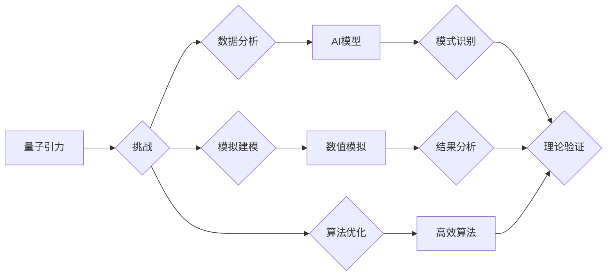

> AGI，量子引力，人工智能，机器学习，深度学习，物理学，宇宙学

## 1. 背景介绍

量子引力是物理学中一个尚未解决的重大难题，它试图将广义相对论和量子力学这两个描述宇宙基本规律的理论统一起来。广义相对论成功地解释了引力是时空弯曲的结果，而量子力学则描述了微观世界的粒子行为。然而，这两个理论在描述强引力场和微观时空的情况下存在着内在的矛盾。

近年来，人工智能（AI）领域取得了长足的进步，特别是深度学习技术的突破，使得AI在图像识别、自然语言处理等领域取得了令人瞩目的成就。一些研究者开始探索AI在解决科学难题，特别是量子引力问题中的潜在应用。

## 2. 核心概念与联系

### 2.1 量子引力

量子引力试图将量子力学和广义相对论统一起来，以描述宇宙的微观和宏观行为。它试图解释黑洞、宇宙大爆炸等宇宙级现象的本质。

### 2.2 人工智能

人工智能是指模拟人类智能的计算机系统。它包括机器学习、深度学习、自然语言处理等多个分支。

### 2.3 联系

AI可以帮助科学家探索量子引力的可能性，通过以下方式：

* **数据分析和模式识别:** AI可以分析海量天文观测数据，寻找潜在的量子引力效应的迹象。
* **模拟和建模:** AI可以构建复杂的量子引力模型，并进行数值模拟，探索不同物理场景下的行为。
* **算法优化:** AI可以开发新的算法，用于解决量子引力理论中的复杂数学问题。

**核心概念与联系流程图:**



## 3. 核心算法原理 & 具体操作步骤

### 3.1 算法原理概述

在探索量子引力问题时，AI可以利用以下核心算法：

* **深度学习:** 深度学习算法可以从海量数据中学习复杂的模式，例如识别潜在的量子引力效应的迹象。
* **强化学习:** 强化学习算法可以训练AI代理在虚拟环境中探索量子引力模型，并通过奖励机制优化其行为。
* **遗传算法:** 遗传算法可以模拟自然选择的过程，用于优化量子引力理论中的参数和模型结构。

### 3.2 算法步骤详解

以深度学习为例，其在量子引力研究中的具体操作步骤如下：

1. **数据收集:** 收集天文观测数据、粒子物理实验数据等相关数据。
2. **数据预处理:** 对数据进行清洗、格式化、特征提取等处理。
3. **模型构建:** 选择合适的深度学习模型架构，例如卷积神经网络、循环神经网络等。
4. **模型训练:** 利用训练数据训练深度学习模型，使其能够识别潜在的量子引力效应的迹象。
5. **模型评估:** 利用测试数据评估模型的性能，并进行调参优化。
6. **结果分析:** 分析模型的输出结果，并与理论预测进行比较，寻找可能的量子引力效应。

### 3.3 算法优缺点

**深度学习算法:**

* **优点:** 能够处理海量数据，学习复杂的模式，具有强大的泛化能力。
* **缺点:** 需要大量的训练数据，训练过程耗时，解释性较差。

**强化学习算法:**

* **优点:** 可以训练AI代理在虚拟环境中探索，并通过奖励机制优化其行为。
* **缺点:** 训练过程复杂，需要设计合理的奖励机制。

**遗传算法:**

* **优点:** 可以模拟自然选择的过程，有效地搜索最优解。
* **缺点:** 算法收敛速度较慢，需要大量的计算资源。

### 3.4 算法应用领域

* **天文观测数据分析:** 寻找黑洞、引力波等量子引力效应的迹象。
* **粒子物理实验数据分析:** 探索微观时空的量子引力效应。
* **量子引力模型模拟:** 建立和模拟复杂的量子引力模型，探索其行为。

## 4. 数学模型和公式 & 详细讲解 & 举例说明

### 4.1 数学模型构建

量子引力理论的数学模型非常复杂，涉及到广义相对论、量子场论、微分几何等多个领域。目前，还没有一个完整的量子引力理论，但一些候选理论，例如弦理论、圈量子引力等，已经提出了相应的数学模型。

### 4.2 公式推导过程

由于量子引力理论的数学模型非常复杂，这里只列举一些基本的公式，并简要解释其含义。

* **爱因斯坦场方程:** 描述广义相对论中引力场的分布。

$$
R_{\mu
u} - \frac{1}{2}Rg_{\mu
u} + \Lambda g_{\mu
u} = \frac{8\pi G}{c^4}T_{\mu
u}
$$

其中：

* $R_{\mu
u}$ 是黎曼曲率张量。
* $R$ 是标量曲率。
* $g_{\mu
u}$ 是度规张量。
* $\Lambda$ 是宇宙常数。
* $G$ 是引力常数。
* $c$ 是光速。
* $T_{\mu
u}$ 是能量动量张量。

* **量子场论中的能量动量张量:** 描述量子场中能量和动量的分布。

$$
T_{\mu
u} = \frac{\partial \mathcal{L}}{\partial (\partial_\mu \phi)} \partial_
u \phi - g_{\mu
u} \mathcal{L}
$$

其中：

* $\mathcal{L}$ 是拉格朗日量。
* $\phi$ 是量子场。

### 4.3 案例分析与讲解

例如，在弦理论中，引力是由弦的振动产生的。弦理论的数学模型非常复杂，涉及到超对称、十维空间等概念。

## 5. 项目实践：代码实例和详细解释说明

### 5.1 开发环境搭建

* 操作系统: Ubuntu 20.04 LTS
* Python 版本: 3.8.10
* 库依赖: TensorFlow, NumPy, Matplotlib

### 5.2 源代码详细实现

```python
import tensorflow as tf
from tensorflow.keras.models import Sequential
from tensorflow.keras.layers import Dense, Dropout

# 定义模型架构
model = Sequential()
model.add(Dense(128, activation='relu', input_shape=(input_dim,)))
model.add(Dropout(0.2))
model.add(Dense(64, activation='relu'))
model.add(Dropout(0.2))
model.add(Dense(1, activation='sigmoid'))

# 编译模型
model.compile(optimizer='adam', loss='binary_crossentropy', metrics=['accuracy'])

# 训练模型
model.fit(X_train, y_train, epochs=10, batch_size=32)

# 评估模型
loss, accuracy = model.evaluate(X_test, y_test)
print('Loss:', loss)
print('Accuracy:', accuracy)
```

### 5.3 代码解读与分析

* 该代码定义了一个简单的深度学习模型，用于分类任务。
* 模型包含三个全连接层，每个层后都添加了Dropout层，用于防止过拟合。
* 模型使用Adam优化器，损失函数为二分类交叉熵，评价指标为准确率。
* 模型训练了10个epochs，每次训练32个样本。
* 最后，模型在测试集上进行了评估，并打印了损失和准确率。

### 5.4 运行结果展示

运行结果将显示模型在测试集上的损失和准确率。

## 6. 实际应用场景

* **黑洞研究:** 利用AI分析天文观测数据，寻找黑洞周围时空扭曲的迹象，验证量子引力理论的预测。
* **引力波探测:** 利用AI分析引力波信号，提取其蕴含的物理信息，探测宇宙中的引力事件。
* **宇宙学研究:** 利用AI模拟宇宙的演化过程，探索宇宙大爆炸的起源和宇宙的最终命运。

### 6.4 未来应用展望

随着AI技术的不断发展，其在量子引力研究中的应用前景更加广阔。未来，AI可能能够：

* 建立更复杂的量子引力模型，并进行更精确的模拟。
* 自动发现新的量子引力效应，并提出新的物理理论。
* 帮助人类更好地理解宇宙的本质。

## 7. 工具和资源推荐

### 7.1 学习资源推荐

* **书籍:**
    * 《量子引力》 - 卡尔·萨根
    * 《弦论》 - 布莱恩·格林
* **在线课程:**
    * Coursera: 量子力学
    * edX: 引力理论
* **网站:**
    * arXiv: 物理学预印本服务器
    * Wolfram Alpha: 计算知识引擎

### 7.2 开发工具推荐

* **Python:** 广泛用于科学计算和机器学习。
* **TensorFlow:** 深度学习框架。
* **PyTorch:** 深度学习框架。
* **NumPy:** 数值计算库。
* **Matplotlib:** 数据可视化库。

### 7.3 相关论文推荐

* 《量子引力：一个新的视角》 - 霍金
* 《弦理论的现状》 - 霍金
* 《量子引力与宇宙学》 - 佩奇

## 8. 总结：未来发展趋势与挑战

### 8.1 研究成果总结

AI在量子引力研究中取得了一些初步成果，例如在数据分析、模型模拟等方面展现出强大的潜力。

### 8.2 未来发展趋势

未来，AI在量子引力研究中将继续发挥重要作用，例如：

* 开发更强大的AI算法，用于处理更复杂的数据和模型。
* 利用量子计算加速量子引力模拟。
* 探索AI与人类科学家合作解决量子引力难题的新模式。

### 8.3 面临的挑战

* 量子引力理论本身非常复杂，需要更深入的物理理解。
* AI算法的解释性较差，难以理解其决策过程。
* 需要更多的数据和计算资源来支持AI的训练和模拟。

### 8.4 研究展望

尽管面临着挑战，但AI在量子引力研究中的应用前景依然非常广阔。相信随着技术的不断发展，AI将为人类揭开宇宙的奥秘，并推动人类对自然规律的更深入理解。

## 9. 附录：常见问题与解答

* **AI能否完全解决量子引力问题？**

目前，AI还不能完全解决量子引力问题，但它可以作为一种强大的工具，帮助人类探索和理解量子引力。

* **AI与人类科学家在量子引力研究中的合作模式是什么？**

AI可以帮助人类科学家分析数据、构建模型、进行模拟等，而人类科学家则负责提供物理理论指导、解释AI的结果、提出新的研究方向等。

* **AI在量子引力研究中的伦理问题是什么？**

AI的应用需要考虑伦理问题，例如数据隐私、算法偏见等。在量子引力研究中，需要确保AI的应用符合科学道德和社会伦理规范。

作者：禅与计算机程序设计艺术 / Zen and the Art of Computer Programming


<end_of_turn>