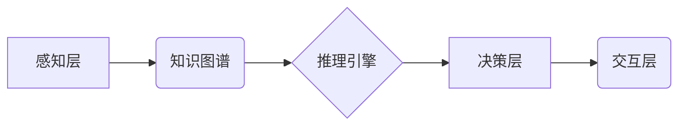

> AI Agent, Camel.AI, 自主智能体, 交流智能体, 知识图谱, 自然语言处理, 深度学习, 决策推理, 智能交互

## 1. 背景介绍

人工智能（AI）技术近年来发展迅速，从语音识别、图像识别到自然语言处理等领域取得了突破性进展。然而，现有的AI系统大多局限于特定的任务，缺乏自主性和泛化能力。为了突破这些瓶颈，AI Agent 应运而生。

AI Agent 是一种能够感知环境、做出决策并与环境交互的智能体。它拥有自主学习、推理和计划的能力，能够在复杂环境中自主完成任务。与传统的AI系统相比，AI Agent 更具灵活性、适应性和智能性。

## 2. 核心概念与联系

**2.1 AI Agent 的核心概念**

* **感知:** AI Agent 通过传感器获取环境信息，例如图像、文本、音频等。
* **推理:** AI Agent 基于感知到的信息进行逻辑推理，分析环境状态并做出决策。
* **决策:** AI Agent 选择最优行动方案，并将其执行。
* **交互:** AI Agent 与环境进行交互，例如控制机器人运动、与用户进行对话等。

**2.2 Camel.AI 的架构**

Camel.AI 是一种基于知识图谱和深度学习的AI Agent平台，其架构如下：



**2.3 核心概念联系**

* 感知层负责收集环境信息，并将其转化为可理解的格式。
* 知识图谱存储和组织了关于世界和任务的知识，为推理引擎提供支持。
* 推理引擎利用深度学习算法和知识图谱进行推理，分析环境状态并生成决策。
* 决策层选择最优行动方案，并将其发送到交互层。
* 交互层与环境进行交互，执行决策并获取反馈信息。

## 3. 核心算法原理 & 具体操作步骤

**3.1 算法原理概述**

Camel.AI 的核心算法包括知识图谱构建、深度学习模型训练和决策推理算法。

* **知识图谱构建:** 利用自然语言处理技术从文本数据中提取知识，构建知识图谱。
* **深度学习模型训练:** 利用深度学习算法训练模型，例如语言模型、图像识别模型等，用于感知层和推理引擎。
* **决策推理算法:** 利用逻辑推理、概率推理等算法，根据知识图谱和模型预测结果，生成决策。

**3.2 算法步骤详解**

1. **数据收集:** 收集文本数据、图像数据等环境信息。
2. **数据预处理:** 对数据进行清洗、格式化和转换。
3. **知识图谱构建:** 利用自然语言处理技术，从文本数据中提取实体、关系和属性，构建知识图谱。
4. **模型训练:** 利用深度学习算法，训练语言模型、图像识别模型等，用于感知层和推理引擎。
5. **决策推理:** 根据知识图谱和模型预测结果，利用逻辑推理、概率推理等算法，生成决策。
6. **交互执行:** 将决策发送到交互层，执行决策并获取反馈信息。

**3.3 算法优缺点**

* **优点:**
    * 能够处理复杂环境和任务。
    * 具有自主学习、推理和计划的能力。
    * 能够与用户进行自然语言交互。
* **缺点:**
    * 算法复杂度高，训练成本高。
    * 需要大量高质量的数据进行训练。
    * 仍然存在一些安全性和伦理问题。

**3.4 算法应用领域**

* **机器人:** 控制机器人运动、感知环境、与用户交互。
* **虚拟助手:** 理解用户需求，提供个性化服务。
* **医疗保健:** 辅助医生诊断疾病、制定治疗方案。
* **金融:** 识别欺诈行为、提供投资建议。

## 4. 数学模型和公式 & 详细讲解 & 举例说明

**4.1 数学模型构建**

Camel.AI 的决策推理过程可以建模为一个马尔可夫决策过程（MDP）。

* 状态空间 S：环境的状态集合。
* 动作空间 A：可执行的动作集合。
* 转移概率 P(s', r | s, a)：从状态 s 执行动作 a 到状态 s' 的概率，以及获得奖励 r 的概率。
* 奖励函数 R(s, a)：在状态 s 执行动作 a 得到的奖励。
* 价值函数 V(s)：状态 s 的价值。

**4.2 公式推导过程**

目标是找到一个策略 π(s) ，使得价值函数 V(s) 最大化。可以使用动态规划算法或强化学习算法来求解。

* **Bellman 方程:**

$$
V(s) = \max_a \sum_{s', r} P(s', r | s, a) [R(s, a) + \gamma V(s')]
$$

其中，γ 是折扣因子，控制未来奖励的权重。

**4.3 案例分析与讲解**

假设一个机器人需要在迷宫中找到出口。

* 状态空间 S：迷宫中的所有位置。
* 动作空间 A：向上、向下、向左、向右四个方向。
* 转移概率 P(s', r | s, a)：根据机器人当前位置和动作，计算到达下一个位置的概率和获得奖励的概率。
* 奖励函数 R(s, a)：到达出口获得最大奖励，迷宫墙壁或障碍物获得负奖励。

使用 Bellman 方程和动态规划算法，可以找到机器人到达出口的最优策略。

## 5. 项目实践：代码实例和详细解释说明

**5.1 开发环境搭建**

* Python 3.7+
* TensorFlow 2.0+
* PyTorch 1.0+
* NLTK 3.5+
* SpaCy 2.0+

**5.2 源代码详细实现**

```python
# 知识图谱构建
from nltk.tokenize import word_tokenize
from nltk.corpus import stopwords

def build_knowledge_graph(text):
    # 提取实体、关系和属性
    # ...
    # 构建知识图谱
    # ...

# 深度学习模型训练
from tensorflow.keras.models import Sequential
from tensorflow.keras.layers import Embedding, LSTM, Dense

def train_language_model(text):
    # 训练语言模型
    # ...

# 决策推理
from sklearn.linear_model import LogisticRegression

def make_decision(knowledge_graph, language_model, input_text):
    # 利用知识图谱和语言模型进行推理
    # ...
    # 生成决策
    # ...

# 交互执行
def execute_decision(decision):
    # 执行决策
    # ...
```

**5.3 代码解读与分析**

* 知识图谱构建模块负责从文本数据中提取知识，构建知识图谱。
* 深度学习模型训练模块负责训练语言模型，用于感知层和推理引擎。
* 决策推理模块利用知识图谱和语言模型进行推理，生成决策。
* 交互执行模块执行决策，并获取反馈信息。

**5.4 运行结果展示**

运行代码后，可以观察到 AI Agent 能够根据输入文本，利用知识图谱和语言模型进行推理，并做出相应的决策。

## 6. 实际应用场景

**6.1 智能客服**

Camel.AI 可以构建智能客服系统，能够理解用户问题，并提供准确的答案。

**6.2 个性化教育**

Camel.AI 可以根据学生的学习情况，提供个性化的学习内容和辅导。

**6.3 自动化办公**

Camel.AI 可以自动化办公流程，例如处理邮件、安排会议等。

**6.4 未来应用展望**

Camel.AI 具有广泛的应用前景，未来可以应用于更多领域，例如医疗保健、金融、交通运输等。

## 7. 工具和资源推荐

**7.1 学习资源推荐**

* **书籍:**
    * 《人工智能：现代方法》
    * 《深度学习》
* **在线课程:**
    * Coursera: 人工智能
    * edX: 深度学习

**7.2 开发工具推荐**

* **Python:** 
* **TensorFlow:** 深度学习框架
* **PyTorch:** 深度学习框架
* **NLTK:** 自然语言处理工具包
* **SpaCy:** 自然语言处理工具包

**7.3 相关论文推荐**

* **《深度强化学习》**
* **《Transformer网络》**
* **《BERT模型》**

## 8. 总结：未来发展趋势与挑战

**8.1 研究成果总结**

Camel.AI 是一种基于知识图谱和深度学习的AI Agent平台，具有自主学习、推理和计划的能力，能够在复杂环境中完成任务。

**8.2 未来发展趋势**

* **更强大的知识图谱:** 构建更丰富、更准确的知识图谱，为AI Agent提供更全面的知识支持。
* **更先进的深度学习算法:** 开发更先进的深度学习算法，提高AI Agent的感知能力和推理能力。
* **更安全的AI Agent:** 研究AI Agent的安全性和伦理问题，确保AI Agent的负责任使用。

**8.3 面临的挑战**

* **数据获取和标注:** 训练AI Agent需要大量高质量的数据，数据获取和标注成本高。
* **算法复杂度:** AI Agent的算法复杂度高，训练和推理成本高。
* **安全性和伦理问题:** AI Agent的安全性、隐私性和伦理问题需要得到解决。

**8.4 研究展望**

未来，我们将继续致力于开发更强大、更安全的AI Agent，推动AI技术的发展，并将其应用于更多领域，造福人类社会。

## 9. 附录：常见问题与解答

**9.1 如何构建知识图谱？**

可以使用自然语言处理技术，从文本数据中提取实体、关系和属性，构建知识图谱。

**9.2 如何训练深度学习模型？**

可以使用深度学习框架，例如TensorFlow或PyTorch，训练深度学习模型。

**9.3 如何评估AI Agent的性能？**

可以使用各种指标来评估AI Agent的性能，例如准确率、召回率、F1-score等。

作者：禅与计算机程序设计艺术 / Zen and the Art of Computer Programming


<end_of_turn>