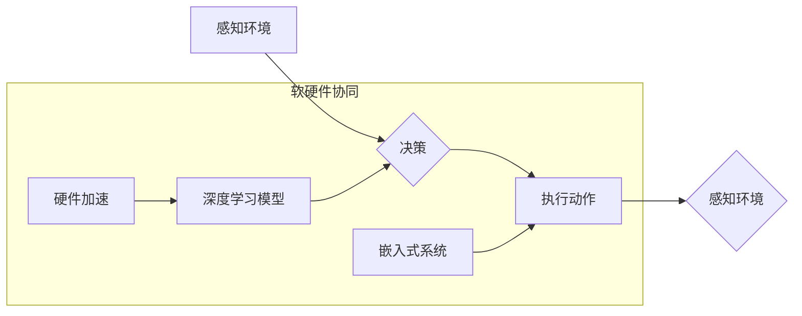

> AI Agent, 软硬件协同, 智能代理, 深度学习, 自然语言处理, 机器学习, 计算机视觉, 嵌入式系统, 硬件加速

## 1. 背景介绍

人工智能（AI）技术近年来发展迅速，从语音识别、图像识别到自然语言处理等领域取得了突破性进展。然而，传统的AI模型大多依赖于庞大的数据中心和高性能计算资源，难以部署在资源受限的边缘设备上。随着物联网、5G等技术的快速发展，对AI应用场景的扩展和多样化提出了更高的要求。

在这种背景下，AI Agent 应运而生。AI Agent 是一种能够自主学习、决策和执行任务的智能实体，它可以独立运行在各种环境中，并与其他智能体进行交互。相较于传统的AI模型，AI Agent 具有以下优势：

* **自主性:** AI Agent 可以根据环境变化和任务目标自主做出决策，无需人工干预。
* **适应性:** AI Agent 可以通过学习和经验积累不断适应新的环境和任务。
* **分布式性:** AI Agent 可以分布部署在多个设备上，实现协同工作，提高效率和可靠性。

## 2. 核心概念与联系

AI Agent 的核心概念包括：

* **智能体 (Agent):**  能够感知环境、做出决策并执行动作的实体。
* **环境 (Environment):** AI Agent 运行和交互的外部世界。
* **感知 (Perception):** AI Agent 收集环境信息的能力。
* **决策 (Decision):** AI Agent 根据感知信息做出行动计划的能力。
* **执行 (Action):** AI Agent 在环境中执行动作的能力。

AI Agent 的软硬件协同发展是实现其强大功能的关键。

**Mermaid 流程图:**



## 3. 核心算法原理 & 具体操作步骤

### 3.1  算法原理概述

AI Agent 的核心算法通常基于强化学习 (Reinforcement Learning, RL) 和深度学习 (Deep Learning) 技术。

* **强化学习:**  AI Agent 通过与环境交互，学习最优的策略，以最大化累积奖励。
* **深度学习:**  利用多层神经网络，学习复杂的特征表示，提高 AI Agent 的感知和决策能力。

### 3.2  算法步骤详解

1. **环境建模:** 建立 AI Agent 与环境交互的模型，定义状态空间、动作空间和奖励函数。
2. **策略学习:** 使用强化学习算法，例如 Q-learning 或 Deep Q-Network (DQN)，训练 AI Agent 学习最优策略。
3. **感知和决策:** AI Agent 通过感知环境信息，根据学习到的策略做出决策。
4. **动作执行:** AI Agent 在环境中执行决策，并获得相应的奖励。
5. **迭代更新:**  根据获得的奖励，更新 AI Agent 的策略，不断优化其行为。

### 3.3  算法优缺点

**优点:**

* **自主学习:** AI Agent 可以通过与环境交互学习，无需人工标注数据。
* **适应性强:** AI Agent 可以根据环境变化不断调整策略，适应新的挑战。
* **通用性:**  强化学习算法可以应用于各种不同的任务和环境。

**缺点:**

* **训练时间长:**  强化学习算法通常需要大量的训练数据和时间。
* **奖励设计困难:**  设计合适的奖励函数是强化学习的关键，但往往比较困难。
* **样本效率低:**  强化学习算法对数据效率要求较高，需要大量的样本才能有效学习。

### 3.4  算法应用领域

AI Agent 具有广泛的应用前景，例如：

* **机器人控制:**  使机器人能够自主导航、避障和执行任务。
* **游戏 AI:**  开发更智能、更具挑战性的游戏对手。
* **自动驾驶:**  实现车辆的自主驾驶功能。
* **医疗诊断:**  辅助医生进行疾病诊断和治疗方案制定。

## 4. 数学模型和公式 & 详细讲解 & 举例说明

### 4.1  数学模型构建

强化学习的核心数学模型是马尔可夫决策过程 (Markov Decision Process, MDP)。

MDP 由以下要素组成:

* **状态空间 (S):**  环境可能存在的全部状态。
* **动作空间 (A):**  AI Agent 在每个状态下可以执行的动作。
* **转移概率 (P):**  从一个状态执行一个动作后转移到另一个状态的概率。
* **奖励函数 (R):**  AI Agent 在每个状态执行一个动作后获得的奖励。

### 4.2  公式推导过程

目标是找到最优策略 π，使得 AI Agent 在长期的交互过程中获得最大的累积奖励。

最优策略 π 可以通过 Bellman 方程求解:

$$
V^{\pi}(s) = \max_{a \in A} \left[ R(s, a) + \gamma \sum_{s' \in S} P(s' | s, a) V^{\pi}(s') \right]
$$

其中:

* $V^{\pi}(s)$ 是状态 s 下按照策略 π 的价值函数。
* $R(s, a)$ 是状态 s 下执行动作 a 后获得的奖励。
* $\gamma$ 是折扣因子，控制未来奖励的权重。

### 4.3  案例分析与讲解

例如，训练一个 AI Agent 来玩游戏，我们可以将游戏状态定义为游戏画面，动作定义为游戏角色可以执行的操作，奖励函数定义为获得分数或完成任务。通过强化学习算法，AI Agent 可以学习最优策略，从而获得更高的分数或完成任务。

## 5. 项目实践：代码实例和详细解释说明

### 5.1  开发环境搭建

* 操作系统: Ubuntu 20.04
* Python 版本: 3.8
* 深度学习框架: TensorFlow 2.x

### 5.2  源代码详细实现

```python
import tensorflow as tf

# 定义神经网络模型
model = tf.keras.models.Sequential([
    tf.keras.layers.Dense(64, activation='relu', input_shape=(input_size,)),
    tf.keras.layers.Dense(32, activation='relu'),
    tf.keras.layers.Dense(num_actions)
])

# 定义损失函数和优化器
optimizer = tf.keras.optimizers.Adam()
loss_fn = tf.keras.losses.CategoricalCrossentropy()

# 训练模型
for epoch in range(num_epochs):
    for state, action, reward, next_state, done in dataset:
        with tf.GradientTape() as tape:
            predictions = model(state)
            loss = loss_fn(action, predictions)
        gradients = tape.gradient(loss, model.trainable_variables)
        optimizer.apply_gradients(zip(gradients, model.trainable_variables))

# 保存模型
model.save('ai_agent_model.h5')
```

### 5.3  代码解读与分析

* 代码首先定义了一个神经网络模型，用于学习 AI Agent 的策略。
* 然后定义了损失函数和优化器，用于训练模型。
* 训练过程循环遍历数据集，计算损失并更新模型参数。
* 最后保存训练好的模型。

### 5.4  运行结果展示

训练好的 AI Agent 可以应用于各种任务，例如玩游戏、控制机器人等。运行结果展示可以包括 AI Agent 在不同任务上的表现，例如游戏分数、机器人完成任务的时间等。

## 6. 实际应用场景

### 6.1  智能家居

AI Agent 可以控制智能家居设备，例如灯光、空调、窗帘等，根据用户的需求和环境变化自动调节。

### 6.2  医疗保健

AI Agent 可以辅助医生进行诊断、治疗方案制定和患者管理，提高医疗效率和质量。

### 6.3  工业自动化

AI Agent 可以控制工业机器人，提高生产效率和安全性。

### 6.4  未来应用展望

随着软硬件协同发展，AI Agent 将在更多领域得到应用，例如自动驾驶、教育、金融等。

## 7. 工具和资源推荐

### 7.1  学习资源推荐

* **书籍:**
    * Reinforcement Learning: An Introduction by Sutton and Barto
    * Deep Learning by Goodfellow, Bengio, and Courville
* **在线课程:**
    * Coursera: Reinforcement Learning Specialization
    * Udacity: Deep Learning Nanodegree

### 7.2  开发工具推荐

* **深度学习框架:** TensorFlow, PyTorch
* **机器人平台:** ROS, Gazebo
* **云平台:** AWS, Azure, GCP

### 7.3  相关论文推荐

* Deep Reinforcement Learning with Double Q-learning
* Proximal Policy Optimization Algorithms
* Asynchronous Methods for Deep Reinforcement Learning

## 8. 总结：未来发展趋势与挑战

### 8.1  研究成果总结

AI Agent 作为人工智能领域的重要研究方向，取得了显著进展。软硬件协同发展为 AI Agent 的发展提供了强有力的支撑。

### 8.2  未来发展趋势

* **更强大的计算能力:**  随着硬件技术的进步，AI Agent 将能够处理更复杂的任务。
* **更有效的学习算法:**  新的强化学习算法将提高 AI Agent 的学习效率和泛化能力。
* **更丰富的应用场景:**  AI Agent 将应用于更多领域，例如自动驾驶、医疗保健、教育等。

### 8.3  面临的挑战

* **数据安全和隐私保护:**  AI Agent 的训练和运行需要大量数据，如何保证数据安全和隐私保护是一个重要挑战。
* **算法可解释性和信任度:**  AI Agent 的决策过程往往是复杂的，如何提高算法的可解释性和信任度是一个关键问题。
* **伦理和社会影响:**  AI Agent 的发展可能带来一些伦理和社会问题，需要进行深入的思考和讨论。

### 8.4  研究展望

未来，AI Agent 研究将继续朝着更智能、更安全、更可解释的方向发展。


## 9. 附录：常见问题与解答

**Q1:  AI Agent 和传统AI模型有什么区别？**

**A1:**  传统AI模型大多依赖于大量的训练数据和高性能计算资源，难以部署在资源受限的边缘设备上。而AI Agent 则更加注重自主学习和适应性，能够在更复杂的环境中自主工作。

**Q2:  如何训练一个AI Agent？**

**A2:**  训练AI Agent通常使用强化学习算法，通过与环境交互，学习最优策略。

**Q3:  AI Agent 的应用场景有哪些？**

**A3:**  AI Agent 的应用场景非常广泛，例如智能家居、医疗保健、工业自动化、自动驾驶等。

**Q4:  AI Agent 的发展趋势是什么？**

**A4:**  未来，AI Agent 将更加智能、安全、可解释，并应用于更多领域。


作者：禅与计算机程序设计艺术 / Zen and the Art of Computer Programming 
<end_of_turn>