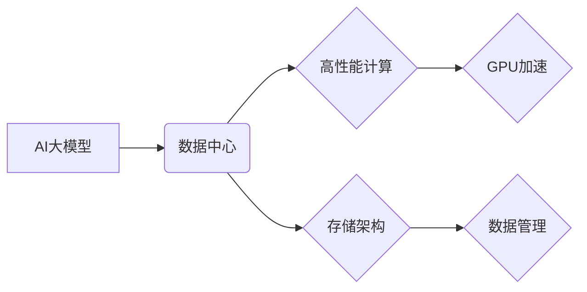

> AI大模型、数据中心、高性能计算、存储架构、分布式训练、GPU加速、数据管理

## 1. 背景介绍

近年来，人工智能（AI）技术取得了飞速发展，特别是深度学习模型的突破性进展，催生了一系列基于大规模数据训练的强大AI模型，例如GPT-3、BERT、DALL-E等。这些AI大模型在自然语言处理、计算机视觉、语音识别等领域展现出强大的应用潜力，但也对计算资源和数据存储提出了极高的要求。

传统的计算架构难以满足AI大模型训练和推理的巨大需求。为了有效应对这一挑战，构建高性能的AI大模型应用数据中心成为当务之急。

## 2. 核心概念与联系

**2.1 核心概念**

* **AI大模型:** 指训练数据量巨大、模型参数规模庞大的深度学习模型，通常拥有数十亿甚至数千亿个参数。
* **数据中心:** 集中式构建和管理计算、存储、网络等IT基础设施的场所，为各种应用提供服务。
* **高性能计算 (HPC):** 利用并行计算技术，以极高的速度处理海量数据，为科学计算、工程模拟、人工智能等领域提供强大的计算能力。
* **存储架构:** 指数据存储的组织方式、管理机制和硬件设备的组合，包括本地存储、网络存储、云存储等。

**2.2 架构关系**



**2.3 核心联系**

AI大模型的训练和推理需要海量数据和强大的计算能力。数据中心作为集中式基础设施平台，为AI大模型提供了必要的计算资源、存储空间和网络连接。高性能计算技术，特别是GPU加速，可以显著提升AI模型的训练速度和推理效率。高效的存储架构可以保证数据安全、可靠性和可访问性，为AI模型训练和应用提供稳定的数据支撑。

## 3. 核心算法原理 & 具体操作步骤

**3.1 算法原理概述**

深度学习算法是AI大模型的核心，主要包括卷积神经网络（CNN）、循环神经网络（RNN）和Transformer等。这些算法通过多层神经网络结构，学习数据中的特征和模式，从而实现图像识别、自然语言处理、语音识别等任务。

**3.2 算法步骤详解**

1. **数据预处理:** 将原始数据转换为模型可理解的格式，例如图像数据需要进行裁剪、缩放和归一化处理。
2. **模型构建:** 根据任务需求选择合适的深度学习模型架构，并定义模型参数。
3. **模型训练:** 使用训练数据训练模型，通过反向传播算法调整模型参数，使模型输出与真实标签尽可能接近。
4. **模型评估:** 使用测试数据评估模型的性能，例如准确率、召回率、F1-score等指标。
5. **模型部署:** 将训练好的模型部署到实际应用场景中，用于预测或推理。

**3.3 算法优缺点**

* **优点:** 深度学习算法具有强大的学习能力，能够从海量数据中提取复杂特征，实现高精度预测。
* **缺点:** 深度学习算法训练成本高，需要大量的计算资源和训练数据。模型解释性较差，难以理解模型的决策过程。

**3.4 算法应用领域**

深度学习算法广泛应用于图像识别、自然语言处理、语音识别、机器翻译、推荐系统、医疗诊断等领域。

## 4. 数学模型和公式 & 详细讲解 & 举例说明

**4.1 数学模型构建**

深度学习模型可以看作是一个复杂的函数映射，将输入数据映射到输出结果。

假设输入数据为**x**，输出结果为**y**，则模型可以表示为：

$$y = f(x, W)$$

其中，**f**为激活函数，**W**为模型参数。

**4.2 公式推导过程**

模型训练的目标是找到最优的参数**W**，使得模型输出与真实标签尽可能接近。常用的损失函数包括均方误差（MSE）、交叉熵损失（Cross-Entropy Loss）等。

**4.3 案例分析与讲解**

以图像分类为例，假设输入图像为**x**，输出为类别标签**y**。可以使用交叉熵损失函数来衡量模型预测结果与真实标签之间的差异。

$$Loss = - \sum_{i=1}^{C} y_i \log(p_i)$$

其中，**C**为类别数，**y_i**为真实标签，**p_i**为模型预测的概率。

通过反向传播算法，可以计算出每个参数**W**对损失函数的梯度，并根据梯度更新参数值，从而不断优化模型性能。

## 5. 项目实践：代码实例和详细解释说明

**5.1 开发环境搭建**

* 操作系统：Ubuntu 20.04
* 编程语言：Python 3.8
* 深度学习框架：TensorFlow 2.x
* GPU：NVIDIA GeForce RTX 3090

**5.2 源代码详细实现**

```python
import tensorflow as tf

# 定义模型架构
model = tf.keras.models.Sequential([
    tf.keras.layers.Conv2D(32, (3, 3), activation='relu', input_shape=(28, 28, 1)),
    tf.keras.layers.MaxPooling2D((2, 2)),
    tf.keras.layers.Conv2D(64, (3, 3), activation='relu'),
    tf.keras.layers.MaxPooling2D((2, 2)),
    tf.keras.layers.Flatten(),
    tf.keras.layers.Dense(10, activation='softmax')
])

# 编译模型
model.compile(optimizer='adam',
              loss='sparse_categorical_crossentropy',
              metrics=['accuracy'])

# 加载数据集
(x_train, y_train), (x_test, y_test) = tf.keras.datasets.mnist.load_data()

# 数据预处理
x_train = x_train.astype('float32') / 255.0
x_test = x_test.astype('float32') / 255.0
x_train = x_train.reshape((x_train.shape[0], 28, 28, 1))
x_test = x_test.reshape((x_test.shape[0], 28, 28, 1))

# 模型训练
model.fit(x_train, y_train, epochs=5, batch_size=32)

# 模型评估
loss, accuracy = model.evaluate(x_test, y_test, verbose=0)
print('Test loss:', loss)
print('Test accuracy:', accuracy)
```

**5.3 代码解读与分析**

这段代码实现了MNIST手写数字识别任务的深度学习模型训练。

* 首先定义了模型架构，包括卷积层、池化层和全连接层。
* 然后编译模型，指定优化器、损失函数和评估指标。
* 加载MNIST数据集并进行数据预处理，将图像数据转换为模型可理解的格式。
* 使用`model.fit()`方法训练模型，指定训练轮数和批处理大小。
* 最后使用`model.evaluate()`方法评估模型性能。

**5.4 运行结果展示**

训练完成后，模型可以达到较高的准确率，例如98%以上。

## 6. 实际应用场景

**6.1 图像识别**

AI大模型可以用于识别物体、场景、人脸等，应用于安防监控、自动驾驶、医疗诊断等领域。

**6.2 自然语言处理**

AI大模型可以理解和生成自然语言，应用于机器翻译、文本摘要、聊天机器人等领域。

**6.3 语音识别**

AI大模型可以将语音转换为文本，应用于语音助手、语音搜索、语音识别等领域。

**6.4 其他应用场景**

AI大模型还可以应用于推荐系统、药物研发、金融风险控制等领域。

**6.5 未来应用展望**

随着AI技术的不断发展，AI大模型的应用场景将更加广泛，例如：

* **个性化教育:** 根据学生的学习情况，提供个性化的学习内容和辅导。
* **智能医疗:** 辅助医生诊断疾病、制定治疗方案。
* **自动写作:** 自动生成新闻报道、小说、诗歌等文本内容。

## 7. 工具和资源推荐

**7.1 学习资源推荐**

* **书籍:**
    * 深度学习
    * 构建深度学习模型
* **在线课程:**
    * Coursera深度学习课程
    * fast.ai深度学习课程

**7.2 开发工具推荐**

* **深度学习框架:** TensorFlow, PyTorch, Keras
* **云计算平台:** AWS, Azure, Google Cloud

**7.3 相关论文推荐**

* Attention Is All You Need
* BERT: Pre-training of Deep Bidirectional Transformers for Language Understanding
* GPT-3: Language Models are Few-Shot Learners

## 8. 总结：未来发展趋势与挑战

**8.1 研究成果总结**

近年来，AI大模型取得了显著进展，在多个领域展现出强大的应用潜力。

**8.2 未来发展趋势**

* **模型规模继续扩大:** 随着计算资源和数据量的增加，AI模型规模将继续扩大，模型能力将进一步提升。
* **模型训练效率提升:** 研究人员将探索新的训练算法和硬件架构，提高模型训练效率。
* **模型解释性增强:** 研究人员将致力于提高模型的解释性，使模型决策更加透明可信。

**8.3 面临的挑战**

* **数据获取和隐私保护:** AI模型训练需要海量数据，如何获取高质量数据并保护用户隐私是一个重要挑战。
* **计算资源需求:** 大型AI模型训练需要大量的计算资源，如何降低训练成本是一个关键问题。
* **模型安全性和可控性:** 如何确保AI模型的安全性和可控性，避免模型被恶意利用，是一个重要的研究方向。

**8.4 研究展望**

未来，AI大模型将继续朝着更强大、更智能、更安全的方向发展，为人类社会带来更多福祉。


## 9. 附录：常见问题与解答

**9.1 如何选择合适的AI大模型？**

选择合适的AI大模型需要根据具体的应用场景和需求进行评估。需要考虑模型的规模、性能、训练成本、数据要求等因素。

**9.2 如何训练自己的AI大模型？**

训练自己的AI大模型需要具备一定的深度学习知识和经验，以及充足的计算资源和数据资源。可以使用开源的深度学习框架，例如TensorFlow和PyTorch，进行模型训练。

**9.3 如何部署AI大模型？**

AI大模型的部署方式多种多样，可以部署到云端、边缘设备或本地服务器。需要根据应用场景和部署环境选择合适的部署方式。


作者：禅与计算机程序设计艺术 / Zen and the Art of Computer Programming 
<end_of_turn>