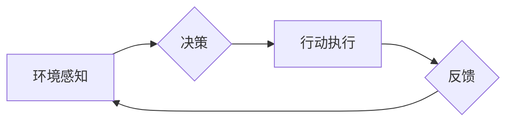

> AI人工智能,航天领域,智能代理,机器学习,深度学习,路径规划,任务规划,自主导航,风险评估

## 1. 背景介绍

航天领域一直以来都是人类探索未知、追求进步的象征。随着科技的不断发展，航天任务的复杂性和挑战性也在不断增加。传统的航天控制方式依赖于地面指令，存在着响应速度慢、可靠性低、适应性差等问题。而人工智能（AI）技术的出现为航天领域带来了新的机遇，为解决这些问题提供了新的解决方案。

AI人工智能代理作为一种智能化决策和执行系统，能够自主学习、感知环境、规划任务并执行行动，在航天领域具有广泛的应用前景。例如，在航天器自主导航、任务规划、风险评估等方面，AI代理可以显著提高航天任务的效率、安全性以及可靠性。

## 2. 核心概念与联系

### 2.1 智能代理

智能代理是一种能够感知环境、做出决策并执行行动的软件系统。它通常具有以下特征：

* **自主性:** 智能代理能够自主地感知环境信息、制定决策并执行行动，无需人工干预。
* **学习能力:** 智能代理能够通过学习从经验中获取知识，不断提高其决策和执行能力。
* **适应性:** 智能代理能够根据环境变化调整其行为策略，适应不同的任务和场景。

### 2.2 AI人工智能在航天领域的应用

AI人工智能技术在航天领域有着广泛的应用场景，例如：

* **自主导航:** 利用传感器数据和机器学习算法，使航天器能够自主地规划路径、避障和控制飞行姿态。
* **任务规划:** 根据任务目标和环境约束，利用人工智能算法规划航天器执行任务的最佳方案。
* **风险评估:** 利用机器学习算法分析航天任务的潜在风险，并提出相应的风险 mitigation 措施。
* **遥感图像分析:** 利用深度学习算法对遥感图像进行分析，提取目标信息，辅助航天任务的执行。

**AI人工智能代理在航天领域的应用架构**



## 3. 核心算法原理 & 具体操作步骤

### 3.1 算法原理概述

在航天领域，AI人工智能代理通常采用基于强化学习的算法进行训练。强化学习是一种机器学习方法，通过在环境中与环境交互，学习最优的行为策略。

在航天任务中，AI代理可以看作是一个智能体，环境可以看作是航天器所处的空间环境，行为可以看作是航天器执行的各种动作，奖励可以看作是完成任务的程度。AI代理通过不断尝试不同的行为，并根据环境反馈的奖励进行调整，最终学习到最优的行为策略。

### 3.2 算法步骤详解

1. **环境建模:** 建立航天器所处的环境模型，包括航天器自身的物理特性、空间环境的物理特性以及任务目标等。
2. **状态空间定义:** 定义航天器的状态空间，包括航天器的位置、速度、姿态等关键参数。
3. **动作空间定义:** 定义航天器可以执行的动作空间，例如控制发动机、调整方向等。
4. **奖励函数设计:** 设计一个奖励函数，根据航天器完成任务的程度给予奖励。
5. **强化学习算法训练:** 使用强化学习算法，例如Q-learning或Deep Q-Network (DQN)，训练AI代理，使其学习到最优的行为策略。
6. **策略部署:** 将训练好的策略部署到实际的航天器上，使航天器能够自主执行任务。

### 3.3 算法优缺点

**优点:**

* **自主性强:** AI代理能够自主学习和决策，无需人工干预。
* **适应性强:** AI代理能够根据环境变化调整行为策略，适应不同的任务和场景。
* **效率高:** AI代理能够快速学习和执行任务，提高航天任务的效率。

**缺点:**

* **训练复杂:** 强化学习算法的训练过程复杂，需要大量的训练数据和计算资源。
* **安全性问题:** AI代理的决策可能会存在不可预测性，需要进行充分的安全评估和风险控制。
* **解释性问题:** 强化学习算法的决策过程难以解释，这可能会导致信任问题。

### 3.4 算法应用领域

* **航天器自主导航:** 使航天器能够自主地规划路径、避障和控制飞行姿态。
* **任务规划:** 根据任务目标和环境约束，规划航天器执行任务的最佳方案。
* **风险评估:** 分析航天任务的潜在风险，并提出相应的风险 mitigation 措施。
* **遥感图像分析:** 对遥感图像进行分析，提取目标信息，辅助航天任务的执行。

## 4. 数学模型和公式 & 详细讲解 & 举例说明

### 4.1 数学模型构建

在强化学习中，AI代理与环境交互的过程可以用一个马尔可夫决策过程 (MDP) 来描述。MDP 由以下几个要素组成：

* **状态空间 (S):** 表示航天器可能处于的所有状态，例如位置、速度、姿态等。
* **动作空间 (A):** 表示航天器可以执行的所有动作，例如控制发动机、调整方向等。
* **转移概率 (P):** 表示从一个状态执行一个动作后，转移到另一个状态的概率。
* **奖励函数 (R):** 表示在某个状态执行某个动作后获得的奖励。

### 4.2 公式推导过程

强化学习的目标是学习一个策略 π(s, a)，该策略能够最大化累积的奖励。策略 π(s, a) 表示在状态 s 下执行动作 a 的概率。

常用的强化学习算法，例如 Q-learning，通过迭代更新 Q 值来学习策略。Q 值表示在状态 s 下执行动作 a 后获得的期望累积奖励。

Q 值更新公式如下：

$$Q(s, a) = Q(s, a) + \alpha [R(s, a) + \gamma \max_{a'} Q(s', a') - Q(s, a)]$$

其中：

* α 是学习率，控制着 Q 值更新的步长。
* γ 是折扣因子，控制着未来奖励的权重。
* R(s, a) 是在状态 s 下执行动作 a 后获得的奖励。
* s' 是执行动作 a 后转移到的下一个状态。

### 4.3 案例分析与讲解

假设一个航天器需要在太空环境中自主导航到目标位置。我们可以将这个任务建模为一个 MDP。

* 状态空间：航天器的位置、速度、姿态等。
* 动作空间：控制发动机、调整方向等。
* 转移概率：根据航天器的物理特性和环境因素计算。
* 奖励函数：根据航天器距离目标位置的距离给予奖励。

通过使用 Q-learning 算法，AI 代理可以学习到最优的导航策略，使航天器能够自主地到达目标位置。

## 5. 项目实践：代码实例和详细解释说明

### 5.1 开发环境搭建

* 操作系统：Ubuntu 20.04
* Python 版本：3.8
* 库依赖：TensorFlow, PyTorch, NumPy, Matplotlib

### 5.2 源代码详细实现

```python
import tensorflow as tf

# 定义神经网络模型
model = tf.keras.models.Sequential([
    tf.keras.layers.Dense(64, activation='relu', input_shape=(10,)),
    tf.keras.layers.Dense(32, activation='relu'),
    tf.keras.layers.Dense(4, activation='linear')
])

# 定义损失函数和优化器
optimizer = tf.keras.optimizers.Adam()
loss_fn = tf.keras.losses.MeanSquaredError()

# 训练模型
for epoch in range(100):
    # 训练数据
    X_train = ...
    y_train = ...
    
    with tf.GradientTape() as tape:
        predictions = model(X_train)
        loss = loss_fn(y_train, predictions)
    
    gradients = tape.gradient(loss, model.trainable_variables)
    optimizer.apply_gradients(zip(gradients, model.trainable_variables))

    print(f'Epoch {epoch+1}, Loss: {loss.numpy()}')

# 保存模型
model.save('space_agent_model.h5')
```

### 5.3 代码解读与分析

* 代码首先定义了一个神经网络模型，该模型用于预测航天器的最佳动作。
* 然后定义了损失函数和优化器，用于训练模型。
* 训练模型的过程包括迭代地计算损失函数，并根据梯度下降算法更新模型参数。
* 最后，将训练好的模型保存为文件。

### 5.4 运行结果展示

训练完成后，可以将模型应用于实际的航天任务中。例如，可以将航天器的传感器数据作为输入，模型可以预测航天器应该执行的动作，从而使航天器能够自主地完成任务。

## 6. 实际应用场景

### 6.1 航天器自主导航

AI人工智能代理可以帮助航天器自主导航，避障，并完成任务目标。例如，在火星探测任务中，AI代理可以帮助火星车自主地规划路径，避开障碍物，并收集科学数据。

### 6.2 任务规划

AI人工智能代理可以帮助规划航天任务，例如，在月球着陆任务中，AI代理可以帮助规划着陆器的着陆路径，并根据实时环境信息进行调整。

### 6.3 风险评估

AI人工智能代理可以帮助评估航天任务的风险，例如，在发射火箭任务中，AI代理可以帮助评估火箭发射的风险，并提出相应的风险 mitigation 措施。

### 6.4 未来应用展望

随着人工智能技术的不断发展，AI人工智能代理在航天领域的应用前景更加广阔。未来，AI代理可能被用于：

* **太空探索:** 探索未知的星系和行星。
* **太空资源开发:** 开发太空中的资源，例如水资源和矿产资源。
* **太空环境监测:** 监测太空环境的变化，例如太空垃圾和辐射水平。

## 7. 工具和资源推荐

### 7.1 学习资源推荐

* **书籍:**
    * "Reinforcement Learning: An Introduction" by Richard S. Sutton and Andrew G. Barto
    * "Deep Learning" by Ian Goodfellow, Yoshua Bengio, and Aaron Courville
* **在线课程:**
    * Coursera: Reinforcement Learning Specialization
    * Udacity: Deep Learning Nanodegree

### 7.2 开发工具推荐

* **TensorFlow:** 开源深度学习框架
* **PyTorch:** 开源深度学习框架
* **Keras:** 高级深度学习 API

### 7.3 相关论文推荐

* "Deep Reinforcement Learning for Spacecraft Rendezvous and Docking"
* "Autonomous Navigation of Spacecraft Using Deep Reinforcement Learning"
* "A Survey of Reinforcement Learning for Robotics"

## 8. 总结：未来发展趋势与挑战

### 8.1 研究成果总结

AI人工智能代理在航天领域的应用取得了显著的成果，例如，在自主导航、任务规划和风险评估方面，AI代理已经能够有效地辅助航天任务的执行。

### 8.2 未来发展趋势

未来，AI人工智能代理在航天领域的应用将更加广泛和深入，例如：

* **更复杂的航天任务:** AI代理将能够处理更复杂的航天任务，例如太空探索和太空资源开发。
* **更智能的航天器:** AI代理将赋予航天器更智能的决策和执行能力，使其能够更加自主地完成任务。
* **更安全的航天任务:** AI代理将能够帮助评估和降低航天任务的风险，提高航天任务的安全性和可靠性。

### 8.3 面临的挑战

AI人工智能代理在航天领域的应用也面临着一些挑战，例如：

* **数据获取和标注:** 训练AI代理需要大量的航天数据，获取和标注这些数据是一个挑战。
* **模型解释性和可信度:** AI代理的决策过程难以解释，这可能会导致信任问题。
* **安全性和可靠性:** AI代理的决策可能会存在不可预测性，需要进行充分的安全评估和风险控制。

### 8.4 研究展望

