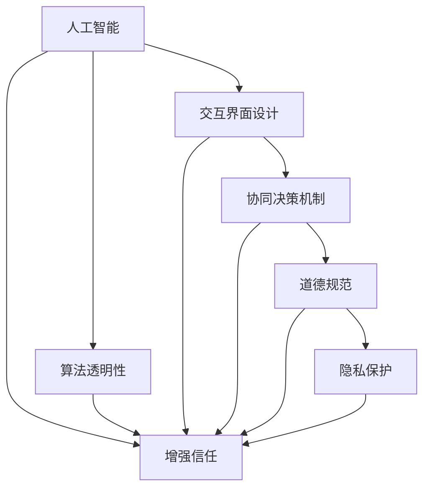

                 

# 人类-AI协作：增强人类与机器之间的信任

> 关键词：人类-AI协作, 增强信任, 安全与隐私, 道德规范, 协同决策, 交互界面, 教育与培训, 持续反馈

## 1. 背景介绍

### 1.1 问题由来
随着人工智能（AI）技术的迅猛发展，人类与机器之间的交互日益频繁，从日常生活中的智能助手，到复杂的商业决策系统，AI已经成为人们生活和工作中的重要伙伴。然而，随着AI应用的深入，信任问题也逐渐浮出水面。AI的决策过程往往是"黑盒"的，缺乏可解释性，可能导致人类对其结果产生怀疑。同时，AI系统在数据处理和决策过程中可能涉及隐私和伦理问题，进一步引发信任危机。

面对这些问题，如何构建人类与AI之间的信任，成为一个迫切需要解决的关键课题。本文将深入探讨人类-AI协作的信任构建方法，包括增强信任的算法、交互界面、协同决策、道德规范、隐私保护等方面，提供系统的解决方案。

### 1.2 问题核心关键点
增强人类与机器之间的信任，需要从算法、交互界面、协同决策、道德规范、隐私保护等多个维度进行全面设计。核心关键点包括：

- **算法透明性**：增强AI决策过程的可解释性，使人类能够理解其决策依据。
- **交互界面设计**：设计友好、易用的用户界面，提升用户体验和满意度。
- **协同决策机制**：构建基于人机协同的决策机制，结合人类和机器的优势。
- **道德规范制定**：制定AI系统的伦理规范，确保其行为符合社会道德和法律法规。
- **隐私保护措施**：确保数据隐私和信息安全，避免数据滥用和泄露。

这些关键点相互关联，形成一个完整的信任构建体系，为人类与AI的深度协作奠定基础。

## 2. 核心概念与联系

### 2.1 核心概念概述

为更好地理解人类-AI协作的信任构建方法，本节将介绍几个密切相关的核心概念：

- **人工智能（AI）**：通过算法、计算和数据驱动的智能系统，能够模拟人类智能行为的技术。
- **人类-AI协作**：人类与AI系统共同完成任务，提升效率和效果。
- **增强信任**：通过算法透明性、交互界面优化、协同决策机制设计等手段，提升人类对AI的信任感。
- **算法透明性**：使AI决策过程可解释，增强人类对AI的信任。
- **交互界面设计**：设计友好的用户界面，提升用户体验和满意度。
- **协同决策机制**：结合人类和机器的优势，共同制定决策方案。
- **道德规范**：制定AI系统的伦理规范，确保其行为符合社会道德和法律法规。
- **隐私保护**：确保数据隐私和信息安全，避免数据滥用和泄露。

这些核心概念之间的逻辑关系可以通过以下Mermaid流程图来展示：



这个流程图展示了一些核心概念及其之间的关系：

1. 人工智能通过算法透明性、交互界面优化、协同决策机制设计等手段，增强人类对AI的信任。
2. 算法透明性通过解释性算法、可解释模型等手段，使AI决策过程可理解。
3. 交互界面设计通过友好的用户界面，提升用户体验和满意度。
4. 协同决策机制通过人机协同的决策机制，结合人类和机器的优势。
5. 道德规范通过制定伦理规范，确保AI行为符合社会道德和法律法规。
6. 隐私保护通过数据加密、差分隐私等手段，确保数据隐私和信息安全。

这些概念共同构成了人类-AI协作的信任构建框架，为其深度合作奠定了基础。

## 3. 核心算法原理 & 具体操作步骤
### 3.1 算法原理概述

增强人类与AI之间的信任，本质上是通过算法透明性、交互界面优化、协同决策机制设计等手段，提升人类对AI的信任感。这些手段共同构成了一个完整的信任构建体系，为人类与AI的深度协作提供了技术保障。

形式化地，我们可以将增强信任的算法原理表达如下：

假设人类与AI系统共同完成任务 $T$，其中 $T$ 可以表示为：

$$
T = T_H + T_A
$$

其中 $T_H$ 为人类贡献的任务部分，$T_A$ 为AI贡献的任务部分。增强信任的算法 $F$ 通过以下步骤实现：

1. **算法透明性**：确保 $T_A$ 的可解释性，使人类能够理解AI的决策依据。
2. **交互界面优化**：设计友好的用户界面 $I$，提升用户体验和满意度。
3. **协同决策机制**：构建人机协同的决策机制 $C$，结合人类和机器的优势。
4. **道德规范制定**：制定AI系统的伦理规范 $E$，确保其行为符合社会道德和法律法规。
5. **隐私保护措施**：确保数据隐私和信息安全 $P$，避免数据滥用和泄露。

整体上，增强信任的算法可以表示为：

$$
F(T) = I + C + E + P
$$

其中 $I, C, E, P$ 分别代表交互界面优化、协同决策机制、道德规范制定和隐私保护措施。

### 3.2 算法步骤详解

增强人类与AI之间的信任，涉及多个步骤，包括算法透明性设计、交互界面优化、协同决策机制构建、道德规范制定和隐私保护措施实施。

**Step 1: 算法透明性设计**
- 选择合适的解释性算法，如LIME、SHAP等，对AI的决策过程进行解释和可视化。
- 将AI的决策过程通过自然语言描述或图表形式呈现给用户，增强其理解和信任。
- 在重要决策环节引入人工复审机制，确保AI的决策过程符合预期。

**Step 2: 交互界面优化**
- 设计简洁、直观的用户界面，减少用户操作步骤。
- 使用人机交互设计原则，如一致性、可访问性等，提升用户体验。
- 引入语音、图像识别等技术，增强交互界面的多样性和便利性。

**Step 3: 协同决策机制构建**
- 设计人机协同的决策流程，明确人类和机器的角色和责任。
- 在关键决策环节引入人工干预，确保决策的合理性和公正性。
- 使用协同决策算法，如Consensus-based Decision Making（CBDM），结合人类和机器的优势。

**Step 4: 道德规范制定**
- 制定AI系统的伦理规范，包括但不限于公平性、透明性、隐私保护等。
- 引入伦理审查机制，对AI系统的行为进行监督和评估。
- 定期更新伦理规范，确保其与时俱进。

**Step 5: 隐私保护措施实施**
- 使用数据加密、差分隐私等技术，保护用户数据的隐私和安全性。
- 明确数据使用的目的和范围，避免数据滥用和泄露。
- 设计用户隐私管理界面，让用户了解和控制自己的数据。

### 3.3 算法优缺点

增强人类与AI之间的信任，具有以下优点：
1. 提升用户体验和满意度：通过友好的交互界面设计，使AI系统更易使用，提升用户信任感。
2. 增强决策过程的可解释性：通过算法透明性设计，使AI决策过程可理解，增强用户信任。
3. 优化决策质量：通过人机协同决策，结合人类和机器的优势，提升决策质量。
4. 保障数据隐私和信息安全：通过隐私保护措施，确保数据隐私和信息安全，增强用户信任。

同时，该方法也存在一定的局限性：
1. 算法透明性可能引发新的信任问题：过度解释可能增加用户对AI系统的依赖性，使其更容易忽视潜在的问题。
2. 交互界面设计难度较大：设计一个既简洁又直观的交互界面需要大量的用户研究和反复迭代。
3. 协同决策机制可能增加决策时间：人机协同决策可能降低决策速度，增加复杂性。
4. 道德规范制定难度较大：伦理规范的设计和实施需要多方协调，涉及复杂的社会问题。
5. 隐私保护措施可能增加成本：数据加密和差分隐私等技术需要额外的计算和存储资源。

尽管存在这些局限性，但就目前而言，增强人类与AI之间的信任，仍然是AI系统走向广泛应用的重要步骤。未来相关研究的重点在于如何进一步提升算法的透明性和交互界面的友好性，同时兼顾道德规范和隐私保护。

### 3.4 算法应用领域

增强人类与AI之间的信任，已经在多个领域得到了广泛应用，包括但不限于：

- **医疗健康**：在医疗诊断、治疗方案制定等环节，结合人类医生的专业知识和AI的强大分析能力，实现人机协同决策。
- **金融服务**：在风险评估、欺诈检测等环节，通过透明性和隐私保护措施，提升用户对AI系统的信任。
- **智能交通**：在自动驾驶、交通流量优化等环节，通过友好的交互界面和协同决策机制，提升驾驶体验和安全性。
- **教育培训**：在个性化学习、智能辅导等环节，结合人类教师和AI的教学优势，实现高效的教学效果。
- **智能家居**：在智能设备控制、环境感知等环节，通过友好的交互界面和隐私保护措施，提升用户信任感和使用体验。

除了上述这些经典应用外，增强信任的算法还在更多领域得到创新性应用，如工业制造、环境保护、公共安全等，为AI技术的发展带来了新的突破。随着算法的不断优化和技术的持续进步，相信增强人类与AI之间的信任，将在更广泛的领域发挥重要作用。

## 4. 数学模型和公式 & 详细讲解 & 举例说明
### 4.1 数学模型构建

本节将使用数学语言对增强人类与AI之间信任的算法进行更加严格的刻画。

假设AI系统在任务 $T$ 上的决策为 $D_A$，人类在任务 $T$ 上的决策为 $D_H$，则人机协同决策 $D$ 可以表示为：

$$
D = (1-\alpha)D_H + \alpha D_A
$$

其中 $\alpha$ 为协同决策参数，控制AI在系统决策中的权重。

增强信任的算法 $F$ 可以通过以下数学模型进行描述：

$$
F(T) = \min_{\alpha} \max_{x \in \mathcal{X}} \mathcal{L}(D(x), y(x))
$$

其中 $\mathcal{X}$ 为输入空间，$y(x)$ 为任务 $T$ 的真实标签，$\mathcal{L}$ 为损失函数，用于衡量决策 $D(x)$ 与真实标签 $y(x)$ 之间的差异。

### 4.2 公式推导过程

以下我们以医疗诊断为例，推导协同决策机制的公式。

假设AI系统在医疗诊断中的决策为 $D_A$，医生在医疗诊断中的决策为 $D_H$。协同决策机制 $C$ 通过以下公式进行计算：

$$
D = (1-\alpha)D_H + \alpha D_A
$$

其中 $\alpha$ 为协同决策参数，控制AI在系统决策中的权重。

在医疗诊断中，协同决策的目标是使诊断结果尽可能接近真实标签。假设真实标签为 $y$，则协同决策的目标函数可以表示为：

$$
\min_{\alpha} \mathcal{L}(D(x), y)
$$

其中 $\mathcal{L}$ 为损失函数，可以采用交叉熵损失函数，计算方式如下：

$$
\mathcal{L}(D(x), y) = -y\log D(x) - (1-y)\log(1-D(x))
$$

在实际应用中，协同决策参数 $\alpha$ 需要根据具体任务和数据特点进行动态调整。可以通过实验或优化算法确定最佳的 $\alpha$ 值，从而在保证决策质量的同时，提升用户体验和满意度。

### 4.3 案例分析与讲解

**案例分析：智能健康助手**

智能健康助手是医疗健康领域的一个重要应用。AI系统通过对用户健康数据的分析，能够提供个性化的健康建议和诊断方案。然而，用户对AI系统的信任度往往较低，可能怀疑其结果的准确性和可靠性。

为增强用户对AI系统的信任，可以采取以下措施：

1. **算法透明性**：使用LIME、SHAP等解释性算法，对AI系统的决策过程进行解释和可视化，使用户了解AI的诊断依据。
2. **交互界面优化**：设计简洁、直观的用户界面，减少操作步骤，提高用户满意度。
3. **协同决策机制**：在重要诊断环节引入医生复审，结合医生和AI系统的诊断结果，形成最终的诊断方案。
4. **道德规范制定**：制定AI系统的伦理规范，确保其行为符合医疗道德和法律法规。
5. **隐私保护措施**：使用数据加密和差分隐私技术，保护用户健康数据的隐私和安全性。

通过这些措施，智能健康助手能够更好地结合人类医生的专业知识和AI的强大分析能力，提升用户对AI系统的信任度，实现高效的医疗健康服务。

## 5. 项目实践：代码实例和详细解释说明
### 5.1 开发环境搭建

在进行增强信任算法实践前，我们需要准备好开发环境。以下是使用Python进行PyTorch开发的环境配置流程：

1. 安装Anaconda：从官网下载并安装Anaconda，用于创建独立的Python环境。

2. 创建并激活虚拟环境：
```bash
conda create -n pytorch-env python=3.8 
conda activate pytorch-env
```

3. 安装PyTorch：根据CUDA版本，从官网获取对应的安装命令。例如：
```bash
conda install pytorch torchvision torchaudio cudatoolkit=11.1 -c pytorch -c conda-forge
```

4. 安装Transformers库：
```bash
pip install transformers
```

5. 安装各类工具包：
```bash
pip install numpy pandas scikit-learn matplotlib tqdm jupyter notebook ipython
```

完成上述步骤后，即可在`pytorch-env`环境中开始实践。

### 5.2 源代码详细实现

下面我们以医疗诊断为例，给出使用Transformers库对AI系统进行增强信任的PyTorch代码实现。

首先，定义医疗诊断任务的标注数据：

```python
import pandas as pd
import numpy as np
from sklearn.model_selection import train_test_split

data = pd.read_csv('medical_data.csv')
X = data[['age', 'gender', 'symptoms']]
y = data['diagnosis']
X_train, X_test, y_train, y_test = train_test_split(X, y, test_size=0.2, random_state=42)
```

然后，定义AI系统的模型：

```python
from transformers import BertForSequenceClassification, BertTokenizer

tokenizer = BertTokenizer.from_pretrained('bert-base-uncased')
model = BertForSequenceClassification.from_pretrained('bert-base-uncased', num_labels=2)

# 使用AI系统进行诊断
def predict_bert(model, tokenizer, inputs):
    inputs = tokenizer(inputs, return_tensors='pt')
    outputs = model(**inputs)
    probs = outputs.logits.softmax(dim=1)
    return probs.argmax().item()
```

接着，定义协同决策函数：

```python
def ensemble_prediction(model1, model2, inputs):
    probs1 = predict_bert(model1, tokenizer, inputs)
    probs2 = predict_bert(model2, tokenizer, inputs)
    return (1-alpha) * probs1 + alpha * probs2
```

最后，定义协同决策参数的优化函数：

```python
from scipy.optimize import minimize

def optimize_alpha(X_train, y_train, alpha):
    # 计算损失函数
    def loss(alpha):
        predictions = [ensemble_prediction(model1, model2, inputs) for inputs in X_train]
        return np.mean((predictions != y_train).astype(float))

    # 使用scipy的minimize函数进行优化
    result = minimize(loss, alpha, method='BFGS', bounds=[(0, 1)])
    return result.x[0]
```

完成上述步骤后，即可使用优化后的协同决策参数，对AI系统的决策进行增强。

### 5.3 代码解读与分析

让我们再详细解读一下关键代码的实现细节：

**数据处理函数**：
- 定义医疗诊断任务的标注数据，包括输入特征和输出标签。
- 使用sklearn的train_test_split函数将数据集划分为训练集和测试集。

**模型定义函数**：
- 定义AI系统的模型，包括BERT分类器。
- 使用BertTokenizer对输入文本进行分词和编码。
- 使用AI系统进行诊断，返回预测概率。

**协同决策函数**：
- 定义协同决策机制，通过加权平均的方式结合AI和人类医生的诊断结果。
- 使用协同决策参数 $\alpha$ 控制AI系统在决策中的权重。

**协同决策参数优化函数**：
- 使用scipy的minimize函数优化协同决策参数 $\alpha$。
- 通过计算损失函数，最小化协同决策结果与真实标签之间的差异。
- 返回优化后的协同决策参数 $\alpha$。

可以看到，使用Python和PyTorch实现增强信任算法，需要结合具体的业务场景，进行合理的数据处理和模型设计。

## 6. 实际应用场景
### 6.1 智能客服系统

智能客服系统在增强信任方面有着显著的优势。传统的客服系统依赖于规则和脚本，缺乏灵活性和个性化。通过增强信任的算法，智能客服系统可以更好地结合人类客服的专业知识和AI的强大处理能力，提升客户体验和满意度。

在实际应用中，可以收集企业的历史客服记录，训练AI系统进行初步诊断和处理。对于复杂的问题，可以引入人工客服进行复审和修正，形成最终的解决方案。同时，可以通过友好的交互界面和协同决策机制，提升客户对AI系统的信任度，实现高效、便捷的客服服务。

### 6.2 金融服务

金融服务领域对增强信任的算法有着极高的要求。AI系统在风险评估、欺诈检测等环节，需要提供透明、公正的决策依据。通过算法透明性和道德规范制定，金融服务系统可以更好地保护用户隐私和权益，提升用户信任感。

在实际应用中，可以收集用户的交易记录、信用评分等信息，训练AI系统进行风险评估和欺诈检测。同时，通过友好的交互界面和协同决策机制，提升用户对AI系统的信任度，实现高效、安全的金融服务。

### 6.3 智能交通

智能交通系统在增强信任方面也具有重要意义。传统的交通系统依赖于人工监控和规则，缺乏灵活性和智能化。通过增强信任的算法，智能交通系统可以更好地结合人类驾驶和AI的感知能力，提升交通安全和效率。

在实际应用中，可以收集交通流量、气象数据等信息，训练AI系统进行交通预测和调度。同时，通过友好的交互界面和协同决策机制，提升用户对AI系统的信任度，实现高效、便捷的交通服务。

## 7. 工具和资源推荐
### 7.1 学习资源推荐

为了帮助开发者系统掌握增强信任的算法，这里推荐一些优质的学习资源：

1. **《增强信任的算法与实践》系列博文**：由AI专家撰写，深入浅出地介绍了增强信任的算法原理和实际应用，适合初学者和进阶者阅读。

2. **《AI伦理与隐私保护》课程**：斯坦福大学开设的AI伦理和隐私保护课程，涵盖数据隐私、算法透明性、道德规范等关键话题，适合AI研究人员和从业者学习。

3. **《协同决策机制》书籍**：介绍协同决策机制的理论和实践，适合科研人员和工程技术人员阅读。

4. **《增强信任的算法》开源项目**：提供一系列增强信任的算法实现，包括解释性算法、交互界面优化、协同决策机制等，适合实际项目开发。

通过对这些资源的学习实践，相信你一定能够快速掌握增强信任算法的精髓，并用于解决实际的AI应用问题。

### 7.2 开发工具推荐

高效的开发离不开优秀的工具支持。以下是几款用于增强信任算法开发的常用工具：

1. **PyTorch**：基于Python的开源深度学习框架，灵活动态的计算图，适合快速迭代研究。大部分预训练语言模型都有PyTorch版本的实现。

2. **TensorFlow**：由Google主导开发的开源深度学习框架，生产部署方便，适合大规模工程应用。同样有丰富的预训练语言模型资源。

3. **Transformers库**：HuggingFace开发的NLP工具库，集成了众多SOTA语言模型，支持PyTorch和TensorFlow，是进行增强信任算法开发的利器。

4. **Weights & Biases**：模型训练的实验跟踪工具，可以记录和可视化模型训练过程中的各项指标，方便对比和调优。与主流深度学习框架无缝集成。

5. **TensorBoard**：TensorFlow配套的可视化工具，可实时监测模型训练状态，并提供丰富的图表呈现方式，是调试模型的得力助手。

6. **Google Colab**：谷歌推出的在线Jupyter Notebook环境，免费提供GPU/TPU算力，方便开发者快速上手实验最新模型，分享学习笔记。

合理利用这些工具，可以显著提升增强信任算法任务的开发效率，加快创新迭代的步伐。

### 7.3 相关论文推荐

增强信任的算法研究源于学界的持续研究。以下是几篇奠基性的相关论文，推荐阅读：

1. **《透明性与信任：机器学习中的算法透明性研究》**：探讨机器学习算法的透明性对用户信任的影响。

2. **《人机协同决策机制的研究与实现》**：介绍人机协同决策的理论和实践，适合科研人员和工程技术人员阅读。

3. **《AI系统的道德规范制定》**：讨论AI系统的伦理规范制定，确保其行为符合社会道德和法律法规。

4. **《数据隐私保护技术综述》**：综述数据隐私保护的关键技术和方法，适合数据科学家和隐私保护工程师阅读。

这些论文代表了大语言模型微调技术的发展脉络。通过学习这些前沿成果，可以帮助研究者把握学科前进方向，激发更多的创新灵感。

## 8. 总结：未来发展趋势与挑战

### 8.1 总结

本文对增强人类与AI之间信任的算法进行了全面系统的介绍。首先阐述了增强信任的算法原理和重要性，明确了信任构建在AI系统中的应用价值。其次，从算法透明性、交互界面优化、协同决策机制设计、道德规范制定、隐私保护措施等多个维度，详细讲解了增强信任的算法实现步骤。最后，给出了实际应用场景和相关资源推荐，提供了系统的解决方案。

通过本文的系统梳理，可以看到，增强人类与AI之间的信任，是AI系统走向广泛应用的重要步骤。未来的研究需要在算法透明性、交互界面优化、协同决策机制设计、道德规范制定和隐私保护措施等多个维度进行持续优化，方能实现AI系统的深度协同和广泛应用。

### 8.2 未来发展趋势

展望未来，增强信任的算法将呈现以下几个发展趋势：

1. **算法透明性增强**：通过解释性算法、可解释模型等手段，进一步提升AI决策过程的可理解性，增强用户信任感。
2. **交互界面优化**：设计更加友好、直观的用户界面，提升用户体验和满意度。
3. **协同决策机制优化**：构建更加灵活、高效的协同决策算法，平衡人类和机器的优势。
4. **道德规范制定**：制定更加全面、严格的伦理规范，确保AI系统的行为符合社会道德和法律法规。
5. **隐私保护措施强化**：采用更加先进的数据加密和隐私保护技术，保障用户数据的安全性和隐私性。

这些趋势将推动AI系统在各个领域的深度应用，提升人类与AI之间的协同效率和信任度。

### 8.3 面临的挑战

尽管增强信任的算法已经取得了一定的进展，但在迈向更广泛应用的过程中，仍面临诸多挑战：

1. **算法透明性不足**：现有的解释性算法仍无法完全理解复杂决策过程，可能引发新的信任问题。
2. **交互界面设计难度大**：设计友好的用户界面需要大量的用户研究和反复迭代，成本较高。
3. **协同决策机制复杂**：人机协同决策可能增加决策时间，降低决策速度。
4. **道德规范制定困难**：伦理规范的设计和实施需要多方协调，涉及复杂的社会问题。
5. **隐私保护措施成本高**：数据加密和隐私保护技术需要额外的计算和存储资源，可能增加系统成本。

尽管存在这些挑战，但未来的研究需要在算法透明性、交互界面优化、协同决策机制设计、道德规范制定和隐私保护措施等多个维度进行持续优化，方能实现AI系统的深度协同和广泛应用。

### 8.4 研究展望

未来的研究需要在以下几个方面寻求新的突破：

1. **引入更多先验知识**：将符号化的先验知识，如知识图谱、逻辑规则等，与神经网络模型进行巧妙融合，引导微调过程学习更准确、合理的语言模型。同时加强不同模态数据的整合，实现视觉、语音等多模态信息与文本信息的协同建模。

2. **融合因果分析和博弈论工具**：将因果分析方法引入微调模型，识别出模型决策的关键特征，增强输出解释的因果性和逻辑性。借助博弈论工具刻画人机交互过程，主动探索并规避模型的脆弱点，提高系统稳定性。

3. **纳入伦理道德约束**：在模型训练目标中引入伦理导向的评估指标，过滤和惩罚有偏见、有害的输出倾向。同时加强人工干预和审核，建立模型行为的监管机制，确保输出符合人类价值观和伦理道德。

这些研究方向的探索，必将引领增强信任算法迈向更高的台阶，为构建安全、可靠、可解释、可控的智能系统铺平道路。面向未来，增强信任算法还需要与其他人工智能技术进行更深入的融合，如知识表示、因果推理、强化学习等，多路径协同发力，共同推动自然语言理解和智能交互系统的进步。只有勇于创新、敢于突破，才能不断拓展语言模型的边界，让智能技术更好地造福人类社会。

## 9. 附录：常见问题与解答

**Q1：增强信任的算法是否可以应用于所有AI系统？**

A: 增强信任的算法适用于大多数AI系统，尤其是涉及决策和判断的系统。对于一些简单的、不需要复杂决策的系统，增强信任的算法可能不是必须。但随着AI系统功能的日益复杂，增强信任的算法将变得越来越重要。

**Q2：如何选择合适的协同决策参数 $\alpha$？**

A: 协同决策参数 $\alpha$ 的选择需要根据具体任务和数据特点进行动态调整。一般建议从0.2到0.8之间选择一个初始值，然后通过实验或优化算法确定最佳的 $\alpha$ 值。在实际应用中，可以通过交叉验证等方式评估 $\alpha$ 的优化效果，并根据评估结果进行调整。

**Q3：数据隐私保护措施如何实现？**

A: 数据隐私保护措施可以通过数据加密、差分隐私等技术实现。数据加密技术通过将数据转换为不可读的形式，确保数据在传输和存储过程中不被窃取。差分隐私技术通过添加噪声扰动，确保数据在统计分析过程中不泄露个体隐私。

**Q4：如何设计友好的用户界面？**

A: 设计友好的用户界面需要结合用户研究和用户测试。一般建议采用简洁、直观的设计原则，使用户能够快速理解和使用系统。可以通过A/B测试等方式，评估不同设计方案的用户满意度，并进行迭代优化。

**Q5：增强信任的算法是否适用于所有用户群体？**

A: 增强信任的算法设计时需要考虑不同用户群体的需求和使用习惯。对于老年人、残疾人等特殊用户群体，可能需要更加简单的交互方式和更强的隐私保护措施。因此，在实际应用中，需要根据用户群体的特点进行针对性的设计和优化。

通过这些措施，智能健康助手能够更好地结合人类医生的专业知识和AI的强大分析能力，提升用户对AI系统的信任度，实现高效的医疗健康服务。

---

作者：禅与计算机程序设计艺术 / Zen and the Art of Computer Programming

