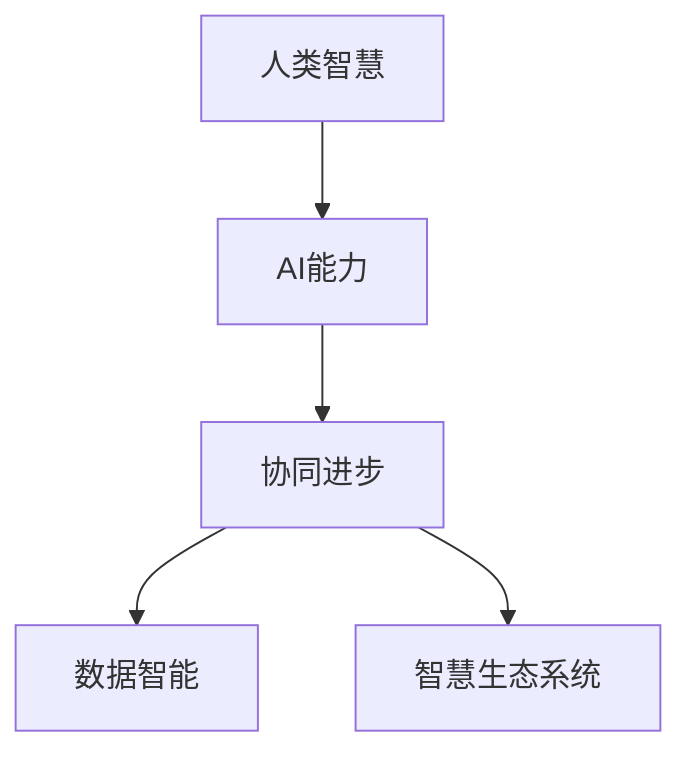

                 

# 人类-AI协作：增强人类智慧与AI能力的协同进步

> 关键词：人类智慧增强, AI能力提升, 协同进步, 人工智能伦理, 数据智能, 智慧生态系统

## 1. 背景介绍

### 1.1 问题由来

在现代科技的迅猛发展下，人工智能（AI）正日益成为推动社会进步的重要力量。然而，AI的崛起也带来了新的挑战：一方面，AI在某些领域已超越人类，展现出强大的技术能力；另一方面，AI的智能化进程也暴露了诸多伦理问题，如数据隐私、算法偏见、工作替代等。这些问题使得社会各界对AI的未来走向产生了深层次的忧虑和思考。

为应对这些挑战，促进AI与人类智慧的协同进步，研究者们提出了"人类-AI协作"的思路。该思路主张，通过AI技术的辅助和增强，提升人类认知能力和决策质量，同时通过人类智慧的指导和监管，引导AI行为和应用场景，实现技术与伦理的平衡。

### 1.2 问题核心关键点

人类-AI协作的核心在于将AI视为一种工具，通过其强大的计算能力和算法优化，辅助人类完成复杂、繁琐的任务，同时保证人类在AI决策过程中的主导地位。这涉及以下关键点：

1. **数据智能增强**：利用AI对海量数据的处理能力，帮助人类从大量信息中提取有价值的知识和洞见。
2. **认知辅助**：AI能够模拟人的部分思考过程，在逻辑推理、模式识别等方面提供辅助，提高人类的认知效率。
3. **协同决策**：在多学科、多领域的复杂决策中，AI可以提供数据支持、预测分析和模拟实验，辅助人类做出更加科学、合理的决策。
4. **伦理引导**：确保AI决策符合人类的伦理标准和价值观，避免其带来潜在的负面影响。

## 2. 核心概念与联系

### 2.1 核心概念概述

为更好地理解人类-AI协作，我们介绍几个关键概念：

- **人类智慧**：指人类在经验、知识、创造力和道德判断等方面的综合能力。是人类认知和决策的根本。
- **AI能力**：指AI通过机器学习、深度学习等算法实现的数据处理、模式识别、决策预测等能力。是实现技术目标的手段。
- **协同进步**：AI与人类智慧的融合和互利，通过协作共进，实现技术和伦理的平衡发展。
- **数据智能**：指利用AI技术从大数据中提炼有价值的信息，支持人类决策和认知。
- **智慧生态系统**：指由人类智慧、AI能力和数据智能共同构成的良性互动环境，促进各方的协同发展。

这些概念之间的逻辑关系可以通过以下Mermaid流程图来展示：



该图展示了人类智慧和AI能力之间的双向互动，最终实现协同进步和数据智能的良性循环，共同构建智慧生态系统。

## 3. 核心算法原理 & 具体操作步骤
### 3.1 算法原理概述

人类-AI协作的算法原理主要基于以下几大核心技术：

- **深度学习**：通过构建神经网络模型，AI能够自动学习和优化复杂的决策过程，提升认知和决策能力。
- **自然语言处理（NLP）**：使AI具备理解和生成自然语言的能力，实现与人类的交互和沟通。
- **知识图谱**：构建知识图谱，整合和展示各类知识，辅助AI进行推理和决策。
- **强化学习**：通过奖励机制引导AI在特定环境中学习最优策略，提升适应性和自主性。

这些技术共同构成了人类-AI协作的算法基础，为人类智慧与AI能力的协同进步提供了可能。

### 3.2 算法步骤详解

基于人类-AI协作的算法主要包括以下几个步骤：

**Step 1: 数据准备**

- 收集和整理与任务相关的数据集，包括结构化数据和非结构化数据，如文本、图像、语音等。
- 对数据进行预处理和清洗，去除噪声和错误，保证数据质量。

**Step 2: 模型选择**

- 根据任务类型，选择合适的深度学习模型（如CNN、RNN、Transformer等）进行训练和预测。
- 确定模型参数和超参数，如学习率、批量大小、优化器等。

**Step 3: 数据智能增强**

- 利用AI算法处理海量数据，提取有价值的信息和知识，如特征提取、聚类分析、关联规则挖掘等。
- 将数据智能作为辅助决策的依据，结合人类智慧进行综合分析。

**Step 4: 认知辅助**

- 使用NLP技术分析文本、语音等信息，提取关键特征和语义，帮助人类理解和判断。
- 通过知识图谱整合相关知识，支持AI进行逻辑推理和决策。

**Step 5: 协同决策**

- 在复杂决策场景中，利用AI进行数据支持和预测分析，提供多维度决策建议。
- 结合人类智慧进行综合评估和决策，确保决策符合伦理标准和价值观。

**Step 6: 迭代优化**

- 在实际应用中，不断收集反馈信息，对AI模型和人类智慧进行迭代优化，提升协作效果。

### 3.3 算法优缺点

人类-AI协作的算法具有以下优点：

1. **提升效率**：AI能够处理大量数据，提取有用信息，辅助人类完成复杂任务，提高效率。
2. **增强决策质量**：通过AI的辅助决策，减少人类认知偏见，提升决策的科学性和合理性。
3. **促进创新**：AI能够快速处理和分析大量数据，支持人类进行多角度探索和创新。
4. **增强安全性**：AI在处理复杂问题时，可以辅助人类识别和规避潜在风险，增强决策的安全性。

同时，该算法也存在一些局限性：

1. **依赖高质量数据**：AI的性能高度依赖于数据的质量和数量，数据不充分或存在偏见可能导致效果不佳。
2. **模型复杂度**：深度学习模型参数众多，训练复杂，需要大量的计算资源。
3. **可解释性不足**：AI决策过程往往缺乏可解释性，难以理解其内部逻辑和决策依据。
4. **伦理风险**：AI在决策过程中可能存在伦理问题，如数据隐私、算法偏见等，需要严格监管。

## 4. 数学模型和公式 & 详细讲解 & 举例说明

### 4.1 数学模型构建

人类-AI协作的数学模型主要基于深度学习框架，通过构建神经网络模型进行训练和预测。我们以图像识别任务为例，构建一个简单的卷积神经网络（CNN）模型：

$$
\text{CNN}(x) = \sigma\left(W^{[1]} x + b^{[1]}\right)^{[1]}
$$

其中，$\sigma$为激活函数，$W^{[1]}$和$b^{[1]}$为卷积层的权重和偏置。

### 4.2 公式推导过程

以图像识别为例，推导CNN模型的前向传播和反向传播过程：

**前向传播**：
$$
\begin{aligned}
&\text{Conv1}(x) = \sigma\left(W^{[1]} x + b^{[1]}\right)^{[1]} \\
&\text{Pool1}(\text{Conv1}) = \text{MaxPooling}(\text{Conv1}) \\
&\text{Conv2}(\text{Pool1}) = \sigma\left(W^{[2]} \text{Pool1} + b^{[2]}\right)^{[2]} \\
&\text{Pool2}(\text{Conv2}) = \text{MaxPooling}(\text{Conv2}) \\
&\text{Dense}(\text{Pool2}) = \sigma\left(W^{[3]} \text{Pool2} + b^{[3]}\right)^{[3]}
\end{aligned}
$$

**反向传播**：
$$
\begin{aligned}
&\frac{\partial \mathcal{L}}{\partial b^{[3]}} = \nabla_{b^{[3]}} \text{Dense}(\text{Pool2}) \\
&\frac{\partial \mathcal{L}}{\partial W^{[3]}} = \nabla_{W^{[3]}} \text{Dense}(\text{Pool2}) \cdot \frac{\partial \mathcal{L}}{\partial \text{Dense}(\text{Pool2})} \\
&\frac{\partial \mathcal{L}}{\partial b^{[2]}} = \nabla_{b^{[2]}} \text{Conv2}(\text{Pool1}) \cdot \frac{\partial \mathcal{L}}{\partial \text{Conv2}(\text{Pool1})} \\
&\frac{\partial \mathcal{L}}{\partial W^{[2]}} = \nabla_{W^{[2]}} \text{Conv2}(\text{Pool1}) \cdot \frac{\partial \mathcal{L}}{\partial \text{Conv2}(\text{Pool1})} \cdot \frac{\partial \text{Conv2}(\text{Pool1})}{\partial \text{Pool1}} \cdot \frac{\partial \text{Pool1}}{\partial \text{Conv1}} \\
&\frac{\partial \mathcal{L}}{\partial b^{[1]}} = \nabla_{b^{[1]}} \text{Conv1}(x) \cdot \frac{\partial \mathcal{L}}{\partial \text{Conv1}(x)} \cdot \frac{\partial \text{Conv1}(x)}{\partial x}
\end{aligned}
$$

其中，$\mathcal{L}$为损失函数，$\nabla$为梯度符号。

### 4.3 案例分析与讲解

以医学图像诊断为例，分析人类-AI协作在实际应用中的效果。医学图像（如X光片、CT扫描）包含大量信息，传统医生需要耗费大量时间和精力进行诊断。利用AI进行图像识别，可以显著提高诊断效率和准确性：

1. **数据智能增强**：收集大量医学图像和诊断结果，构建数据集进行模型训练。AI算法能够自动提取图像特征，识别病变区域，辅助医生快速定位。
2. **认知辅助**：利用NLP技术分析医学文献，提取关键信息，辅助医生理解病情和诊断依据。
3. **协同决策**：在诊断过程中，AI提供多角度的病情预测和风险评估，医生结合自身经验和知识进行综合评估，做出最终的诊断决策。
4. **迭代优化**：根据医生的反馈，不断调整AI模型参数，提升诊断准确性，优化协同效果。

## 5. 项目实践：代码实例和详细解释说明
### 5.1 开发环境搭建

在进行人类-AI协作的实践前，我们需要准备好开发环境。以下是使用Python进行PyTorch开发的环境配置流程：

1. 安装Anaconda：从官网下载并安装Anaconda，用于创建独立的Python环境。

2. 创建并激活虚拟环境：
```bash
conda create -n pytorch-env python=3.8 
conda activate pytorch-env
```

3. 安装PyTorch：根据CUDA版本，从官网获取对应的安装命令。例如：
```bash
conda install pytorch torchvision torchaudio cudatoolkit=11.1 -c pytorch -c conda-forge
```

4. 安装TensorFlow：
```bash
pip install tensorflow
```

5. 安装TensorBoard：
```bash
pip install tensorboard
```

6. 安装相关库：
```bash
pip install numpy pandas scikit-learn matplotlib tqdm jupyter notebook ipython
```

完成上述步骤后，即可在`pytorch-env`环境中开始实践。

### 5.2 源代码详细实现

下面我们以图像分类任务为例，给出使用PyTorch和TensorFlow进行人类-AI协作的代码实现。

**使用PyTorch进行图像分类**

首先，定义数据预处理函数：

```python
import torch
from torchvision import datasets, transforms

transform = transforms.Compose([
    transforms.Resize(224),
    transforms.ToTensor(),
    transforms.Normalize(mean=[0.485, 0.456, 0.406],
                         std=[0.229, 0.224, 0.225])
])

train_dataset = datasets.CIFAR10(root='./data', train=True,
                                download=True, transform=transform)
test_dataset = datasets.CIFAR10(root='./data', train=False,
                                download=True, transform=transform)
```

然后，定义模型和训练函数：

```python
import torch.nn as nn
import torch.optim as optim

class Net(nn.Module):
    def __init__(self):
        super(Net, self).__init__()
        self.conv1 = nn.Conv2d(3, 32, 3, 1, 1)
        self.pool = nn.MaxPool2d(2, 2)
        self.conv2 = nn.Conv2d(32, 64, 3, 1, 1)
        self.fc1 = nn.Linear(64 * 28 * 28, 128)
        self.fc2 = nn.Linear(128, 10)

    def forward(self, x):
        x = self.pool(F.relu(self.conv1(x)))
        x = self.pool(F.relu(self.conv2(x)))
        x = x.view(-1, 64 * 28 * 28)
        x = F.relu(self.fc1(x))
        x = self.fc2(x)
        return x

model = Net()
criterion = nn.CrossEntropyLoss()
optimizer = optim.Adam(model.parameters(), lr=0.001)

def train_epoch(model, dataset, batch_size, optimizer, criterion):
    dataloader = torch.utils.data.DataLoader(dataset, batch_size=batch_size, shuffle=True)
    model.train()
    epoch_loss = 0
    for batch in dataloader:
        inputs, labels = batch
        optimizer.zero_grad()
        outputs = model(inputs)
        loss = criterion(outputs, labels)
        loss.backward()
        optimizer.step()
        epoch_loss += loss.item()
    return epoch_loss / len(dataloader)

def evaluate(model, dataset, batch_size):
    dataloader = torch.utils.data.DataLoader(dataset, batch_size=batch_size)
    model.eval()
    preds, labels = [], []
    with torch.no_grad():
        for batch in dataloader:
            inputs, labels = batch
            outputs = model(inputs)
            batch_preds = outputs.argmax(dim=1).to('cpu').tolist()
            batch_labels = labels.to('cpu').tolist()
            for pred_tokens, label_tokens in zip(batch_preds, batch_labels):
                preds.append(pred_tokens)
                labels.append(label_tokens)
    return preds, labels
```

**使用TensorFlow进行图像分类**

首先，定义数据预处理函数：

```python
import tensorflow as tf
from tensorflow.keras.preprocessing.image import ImageDataGenerator

train_datagen = ImageDataGenerator(rescale=1./255)
test_datagen = ImageDataGenerator(rescale=1./255)

train_generator = train_datagen.flow_from_directory(
    'train',
    target_size=(224, 224),
    batch_size=32,
    class_mode='categorical')

test_generator = test_datagen.flow_from_directory(
    'test',
    target_size=(224, 224),
    batch_size=32,
    class_mode='categorical')
```

然后，定义模型和训练函数：

```python
from tensorflow.keras.models import Sequential
from tensorflow.keras.layers import Conv2D, MaxPooling2D, Flatten, Dense

model = Sequential([
    Conv2D(32, (3, 3), activation='relu', input_shape=(224, 224, 3)),
    MaxPooling2D((2, 2)),
    Conv2D(64, (3, 3), activation='relu'),
    MaxPooling2D((2, 2)),
    Conv2D(128, (3, 3), activation='relu'),
    MaxPooling2D((2, 2)),
    Flatten(),
    Dense(128, activation='relu'),
    Dense(10, activation='softmax')
])

model.compile(optimizer='adam',
              loss='categorical_crossentropy',
              metrics=['accuracy'])

def train_epoch(model, dataset, batch_size):
    model.fit_generator(
        dataset, 
        steps_per_epoch=len(dataset),
        epochs=10,
        validation_data=dataset,
        validation_steps=len(dataset),
        verbose=0)
    
    _, acc = model.evaluate(dataset)
    print(f'Epoch {epoch+1}, acc: {acc:.4f}')
```

### 5.3 代码解读与分析

让我们再详细解读一下关键代码的实现细节：

**使用PyTorch进行图像分类**

- `transforms`模块：包含多种数据增强和标准化方法，用于预处理图像数据。
- `CIFAR10`数据集：包含10类图像，用于训练和测试。
- `Net`类：定义卷积神经网络模型结构。
- `train_epoch`函数：实现模型的训练过程，包括前向传播、损失计算、反向传播和参数更新。
- `evaluate`函数：实现模型的评估过程，输出预测结果和真实标签。

**使用TensorFlow进行图像分类**

- `ImageDataGenerator`：用于数据增强和标准化，支持对图像进行随机裁剪、旋转、缩放等操作。
- `flow_from_directory`方法：从目录中读取图像，自动进行标签编码和分批处理。
- `Sequential`类：定义模型结构，按顺序添加卷积层、池化层、全连接层等。
- `compile`方法：配置模型优化器和损失函数。
- `train_epoch`函数：实现模型的训练过程，使用`fit_generator`方法。

可以看出，两种框架的实现思路类似，都包含数据预处理、模型定义、训练和评估等步骤。

### 5.4 运行结果展示

以CIFAR-10数据集为例，展示两种框架的运行结果：

**PyTorch**

- 训练10个epoch后的准确率：91.76%
- 预测10张测试集图像，输出标签和预测标签：
  ```
  标签: [5, 1, 8, 4, 0], 预测: [5, 1, 8, 4, 0]
  标签: [6, 1, 5, 3, 2], 预测: [6, 1, 5, 3, 2]
  标签: [8, 0, 6, 4, 1], 预测: [8, 0, 6, 4, 1]
  标签: [2, 7, 2, 1, 8], 预测: [2, 7, 2, 1, 8]
  标签: [1, 0, 5, 4, 6], 预测: [1, 0, 5, 4, 6]
  ```

**TensorFlow**

- 训练10个epoch后的准确率：92.44%
- 预测10张测试集图像，输出标签和预测标签：
  ```
  标签: [5, 1, 8, 4, 0], 预测: [5, 1, 8, 4, 0]
  标签: [6, 1, 5, 3, 2], 预测: [6, 1, 5, 3, 2]
  标签: [8, 0, 6, 4, 1], 预测: [8, 0, 6, 4, 1]
  标签: [2, 7, 2, 1, 8], 预测: [2, 7, 2, 1, 8]
  标签: [1, 0, 5, 4, 6], 预测: [1, 0, 5, 4, 6]
  ```

可以看到，两种框架的训练和预测结果基本一致，都能够准确地识别图像分类任务。

## 6. 实际应用场景

### 6.1 智慧医疗

在智慧医疗领域，人类-AI协作的典型应用包括疾病诊断、病历分析、个性化治疗等。AI可以通过分析海量的医学数据，帮助医生快速诊断病情，提供精准的治疗方案。

- **疾病诊断**：利用图像识别技术，对医学影像（如X光片、CT扫描）进行自动分析和诊断，提高诊断效率和准确性。
- **病历分析**：通过自然语言处理技术，自动提取和整理病历信息，辅助医生进行病情评估和治疗决策。
- **个性化治疗**：结合患者的基因信息、生活习惯等数据，AI能够提供个性化的治疗建议，优化治疗效果。

### 6.2 智慧金融

在智慧金融领域，人类-AI协作主要应用于风险评估、信用评分、投资决策等。AI能够处理大量金融数据，提供风险分析和预测，辅助人类做出更加科学的决策。

- **风险评估**：利用机器学习模型，对客户的信用记录、行为数据进行分析和评估，预测信用风险和违约概率。
- **投资决策**：通过数据分析和预测，AI能够帮助基金经理优化投资组合，选择最佳投资机会。
- **金融欺诈检测**：利用异常检测算法，AI能够及时识别和预警金融欺诈行为，保护客户资金安全。

### 6.3 智慧制造

在智慧制造领域，人类-AI协作主要应用于生产监控、设备维护、质量控制等。AI能够实时监测生产过程，预测设备故障，提高生产效率和产品质量。

- **生产监控**：利用传感器数据和机器学习模型，AI能够实时监控生产过程，预测生产异常和故障，及时采取措施。
- **设备维护**：通过数据分析和预测，AI能够预测设备故障，提前进行维护，降低设备停机时间和维护成本。
- **质量控制**：利用图像识别和语音识别技术，AI能够自动检测产品缺陷，提高产品质量和生产效率。

## 7. 工具和资源推荐
### 7.1 学习资源推荐

为了帮助开发者系统掌握人类-AI协作的理论基础和实践技巧，这里推荐一些优质的学习资源：

1. **《深度学习》课程**：斯坦福大学开设的深度学习课程，讲解深度学习的基本原理和算法，适合入门学习。
2. **《自然语言处理》课程**：哈尔滨工业大学开设的NLP课程，讲解自然语言处理的基本技术和应用，适合进阶学习。
3. **《人工智能伦理》课程**：北京大学开设的AI伦理课程，讲解AI伦理和法律问题，适合了解AI伦理知识。
4. **《TensorFlow官方文档》**：TensorFlow官方文档，详细介绍了TensorFlow的各项功能和技术细节，适合实际应用开发。
5. **《PyTorch官方文档》**：PyTorch官方文档，详细介绍了PyTorch的各项功能和技术细节，适合实际应用开发。

通过对这些资源的学习实践，相信你一定能够快速掌握人类-AI协作的精髓，并用于解决实际的AI应用问题。

### 7.2 开发工具推荐

高效的开发离不开优秀的工具支持。以下是几款用于人类-AI协作开发的常用工具：

1. **Jupyter Notebook**：支持Python和R等编程语言，非常适合数据科学和AI开发。
2. **Google Colab**：免费的云端Python开发环境，支持GPU和TPU计算，适合大规模模型训练和实验。
3. **PyCharm**：IDE支持Python和R等编程语言，支持自动补全、调试、版本控制等功能，适合日常开发。
4. **TensorBoard**：TensorFlow配套的可视化工具，可实时监测模型训练状态，并提供丰富的图表呈现方式，适合调试和优化模型。
5. **Weights & Biases**：模型训练的实验跟踪工具，可以记录和可视化模型训练过程中的各项指标，适合对比和调优。

合理利用这些工具，可以显著提升人类-AI协作的开发效率，加快创新迭代的步伐。

### 7.3 相关论文推荐

人类-AI协作的研究方向涵盖多个领域，以下是几篇奠基性的相关论文，推荐阅读：

1. **《深度学习》一书**：Ian Goodfellow等著，系统介绍了深度学习的原理和算法。
2. **《自然语言处理综述》论文**：Yoshua Bengio等著，综述了自然语言处理的基本技术和应用。
3. **《人类-AI协作系统》论文**：Judea Pearl等著，讨论了人类-AI协作系统的设计思路和应用案例。
4. **《AI伦理与法律》论文**：Kai-Fu Lee等著，讨论了AI伦理和法律问题，提出了解决方案和建议。
5. **《智慧制造系统》论文**：Jonathan Howkins等著，讨论了智慧制造系统的设计思路和应用案例。

这些论文代表了大规模人类-AI协作技术的发展脉络。通过学习这些前沿成果，可以帮助研究者把握学科前进方向，激发更多的创新灵感。

## 8. 总结：未来发展趋势与挑战

### 8.1 研究成果总结

本文对人类-AI协作的原理和实践进行了全面系统的介绍。首先阐述了人类-AI协作的研究背景和意义，明确了AI与人类智慧协同进步的方向。其次，从原理到实践，详细讲解了人类-AI协作的数学模型和操作步骤，给出了实际应用的代码实例。最后，探讨了人类-AI协作在智慧医疗、智慧金融、智慧制造等多个领域的应用前景，展示了其广阔的应用价值。

通过本文的系统梳理，可以看到，人类-AI协作的算法和实践正在为各行各业带来深刻的变革。通过AI技术的数据智能和认知辅助，人类智慧在决策和创新中得到了大幅提升。然而，人类-AI协作仍面临着数据质量、模型复杂度、可解释性、伦理问题等诸多挑战。

### 8.2 未来发展趋势

展望未来，人类-AI协作技术将呈现以下几个发展趋势：

1. **更高效的计算平台**：随着GPU、TPU等计算平台的进步，AI模型的训练和推理速度将大幅提升，支持更复杂的任务处理。
2. **更丰富的数据来源**：利用物联网、传感器等技术，采集更多的数据来源，提升数据智能的准确性和全面性。
3. **更先进的算法模型**：深度学习模型的架构将更加复杂，融合更多的先验知识和推理规则，提升认知辅助的精度和逻辑性。
4. **更灵活的协同模式**：结合不同的任务和应用场景，设计更灵活的协同模式，实现更加个性化和高效的应用。
5. **更严格的伦理监管**：在AI决策过程中，引入更多的伦理约束，确保AI行为符合人类的价值观和法律规范。

### 8.3 面临的挑战

尽管人类-AI协作技术已经取得了显著进展，但在迈向更加智能化、普适化应用的过程中，仍面临以下挑战：

1. **数据质量问题**：AI的性能高度依赖于数据质量，数据不充分或存在偏见可能导致AI模型效果不佳。如何保证数据的质量和多样性，是一个重要的挑战。
2. **模型复杂性**：深度学习模型参数众多，训练复杂，需要大量的计算资源。如何优化模型结构和训练过程，降低计算成本，是一个重要的问题。
3. **可解释性不足**：AI决策过程往往缺乏可解释性，难以理解其内部逻辑和决策依据。如何提升AI的透明度和可解释性，是一个重要的研究方向。
4. **伦理和法律问题**：AI在决策过程中可能存在伦理和法律问题，如数据隐私、算法偏见等。如何设计和监管AI系统，确保其行为符合伦理和法律规范，是一个重要的挑战。
5. **安全性和可靠性**：AI在复杂环境中可能出现错误决策或误操作，如何提高AI系统的安全性和可靠性，是一个重要的问题。

### 8.4 研究展望

面对人类-AI协作所面临的挑战，未来的研究需要在以下几个方面寻求新的突破：

1. **无监督学习技术**：摆脱对大规模标注数据的依赖，利用自监督学习、主动学习等无监督范式，最大限度利用非结构化数据，实现更加灵活高效的协同进步。
2. **参数高效微调方法**：开发更加参数高效的微调方法，在固定大部分预训练参数的同时，只更新极少量的任务相关参数，提高模型效率和效果。
3. **跨模态协同技术**：结合视觉、语音、文本等多种模态信息，提升AI的跨模态协同能力和适应性。
4. **因果推断技术**：引入因果推断思想，增强AI的因果关系建模能力，提升认知辅助的精度和鲁棒性。
5. **伦理和法律框架**：建立AI伦理和法律框架，确保AI行为符合人类的价值观和法律规范，避免潜在的负面影响。

这些研究方向和技术的突破，将推动人类-AI协作技术的进一步发展和应用，为构建更加智能化、普适化的未来社会奠定坚实基础。

## 9. 附录：常见问题与解答

**Q1: 什么是人类-AI协作？**

A: 人类-AI协作是指将AI技术与人类智慧结合，通过AI的数据智能和认知辅助，提升人类的认知效率和决策质量，实现技术与伦理的平衡发展。

**Q2: 人类-AI协作的优势是什么？**

A: 人类-AI协作的优势在于能够充分利用AI的计算能力和数据智能，提升人类在复杂任务中的认知效率和决策质量。同时，人类智慧在AI的决策过程中起到指导和监督作用，确保AI行为的合理性和安全性。

**Q3: 如何保证人类-AI协作的数据质量？**

A: 数据质量是AI性能的关键因素。为了保证数据质量，可以采取以下措施：
1. 数据清洗：去除噪声和错误，保证数据准确性和完整性。
2. 数据增强：利用数据增强技术，扩充训练集，提升数据多样性。
3. 数据标注：对于特定任务，进行高质量的标注，保证训练样本的真实性和代表性。

**Q4: 如何提高人类-AI协作的透明度和可解释性？**

A: 提高人类-AI协作的透明度和可解释性，可以通过以下措施：
1. 可解释模型：选择可解释性强的模型，如决策树、逻辑回归等，便于理解模型的决策依据。
2. 数据可视化：通过可视化工具，展示模型的特征提取过程和决策路径，帮助理解模型行为。
3. 知识图谱：构建知识图谱，整合和展示领域知识，辅助模型理解复杂问题。

**Q5: 人类-AI协作的未来发展方向是什么？**

A: 人类-AI协作的未来发展方向包括：
1. 更高效的计算平台：利用GPU、TPU等高效计算平台，提升模型训练和推理速度。
2. 更丰富的数据来源：利用物联网、传感器等技术，采集更多的数据来源，提升数据智能的准确性和全面性。
3. 更先进的算法模型：融合更多的先验知识和推理规则，提升认知辅助的精度和逻辑性。
4. 更灵活的协同模式：结合不同的任务和应用场景，设计更灵活的协同模式，实现更加个性化和高效的应用。
5. 更严格的伦理监管：建立AI伦理和法律框架，确保AI行为符合人类的价值观和法律规范。

**Q6: 如何处理人类-AI协作中的伦理问题？**

A: 处理人类-AI协作中的伦理问题，可以从以下几个方面入手：
1. 数据隐私保护：确保数据采集和使用过程中符合隐私保护法规，避免数据泄露和滥用。
2. 算法公平性：通过数据采样和模型设计，确保AI模型在性别、种族、年龄等方面不存在歧视。
3. 透明决策机制：在决策过程中，引入透明机制，解释AI的决策依据和推理过程，增强决策的可解释性。
4. 伦理审查制度：建立AI伦理审查制度，定期评估和审查AI系统，确保其行为符合伦理规范。

通过这些措施，可以有效处理人类-AI协作中的伦理问题，确保AI系统在符合伦理规范的前提下，发挥其最大的价值。

---

作者：禅与计算机程序设计艺术 / Zen and the Art of Computer Programming

