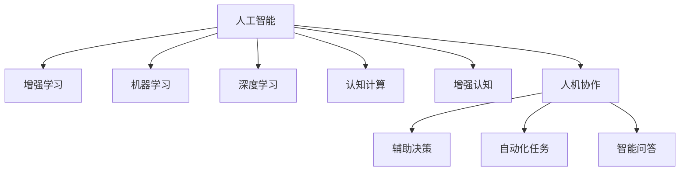

                 

# 人类-AI协作：增强人类智慧与AI能力的融合发展趋势预测分析机遇挑战机遇预测

## 1. 背景介绍

### 1.1 问题由来

随着人工智能技术的不断进步，AI与人类协作的方式正在发生深刻的变化。AI技术的介入，不仅提升了工作效率，还为人类带来了新的认知能力和解决问题的视角。然而，AI与人类的协作并非一帆风顺，仍面临着诸多挑战。

AI技术的快速发展，使得机器能够在某些领域超越人类。例如，AlphaGo在围棋领域的表现，展示了AI在策略和计算上的优势。同时，AI在自然语言处理、计算机视觉等领域的突破，也彰显了其在复杂信息处理上的强大能力。

然而，AI的智能化水平还远未达到人类智慧的复杂度。人类在情感理解、创造力、道德判断等方面依然具有无可比拟的优势。AI与人类的协作，旨在发挥各自的长处，共同解决问题，实现1+1>2的效果。

### 1.2 问题核心关键点

AI与人类的协作，可以分为以下几个关键点：

- **技能互补**：AI擅长处理大规模、高维度数据，而人类擅长抽象推理和情感理解。通过协作，AI可以发挥数据处理优势，人类则可以专注于高层次的决策和创意。
- **知识共享**：AI通过学习大量数据，能够积累丰富的知识，而人类可以通过与AI的交互，不断扩展自身的知识面。
- **效率提升**：AI能够自动化处理重复性工作，解放人类的劳动力，使人类能够专注于更有创造性和战略性的任务。
- **决策辅助**：AI通过大数据分析和复杂模型，可以提供更准确、全面的决策建议，帮助人类做出更好的决策。
- **创新推动**：AI与人类的协作，可以推动新知识的发现，加速科技创新的进程。

## 2. 核心概念与联系

### 2.1 核心概念概述

为更好地理解AI与人类的协作，本节将介绍几个密切相关的核心概念：

- **人工智能(AI)**：使用计算机算法和数学模型，模拟人类的认知和学习能力。涵盖感知、决策、规划、理解等多个方面。
- **增强学习(Reinforcement Learning, RL)**：AI通过与环境的交互，学习最优的决策策略，以最大化预期回报。典型应用包括机器人控制、游戏策略等。
- **机器学习(Machine Learning, ML)**：AI通过数据训练，自动学习模型，并用于新数据预测和分类。涵盖监督学习、无监督学习、半监督学习等方法。
- **深度学习(Deep Learning)**：一种基于神经网络的机器学习方法，用于处理高维数据，发现数据中的复杂模式。深度学习在图像、语音、自然语言处理等领域取得了重大突破。
- **认知计算(Cognitive Computing)**：模拟人类大脑的认知过程，如感知、记忆、推理、情感等。旨在构建具有认知能力的智能系统。
- **增强认知(Enhanced Cognition)**：通过AI技术提升人类的认知能力，如增强记忆、提高决策速度、优化创造力等。
- **人机协作(Human-AI Collaboration)**：AI与人类的协同工作，实现优势互补，提升整体效能。常见形式包括辅助决策、自动化任务、智能问答等。

这些核心概念之间的逻辑关系可以通过以下Mermaid流程图来展示：



这个流程图展示了一些关键概念及其之间的关系：

1. 人工智能是核心，涵盖多个分支方法。
2. 增强学习、机器学习和深度学习是主要的技术实现手段。
3. 认知计算和增强认知旨在提升人类认知水平。
4. 人机协作是人机协作的核心目标。
5. 辅助决策、自动化任务和智能问答是人机协作的主要应用场景。

## 3. 核心算法原理 & 具体操作步骤

### 3.1 算法原理概述

AI与人类的协作，本质上是一个多智能体系统(Multi-Agent System)。系统中的每个智能体都有其特定的目标和行为策略。通过合理的算法设计，可以实现智能体之间的协作，共同实现系统目标。

以一个简单的任务协作为例，假设任务是完成一个复杂的拼图。AI负责对大量图片进行数据处理，提取特征，而人类则根据AI提供的信息，选择最优的拼图块进行组合。具体来说，可以采用以下步骤：

1. **数据预处理**：AI对图片进行预处理，提取出有意义的信息。
2. **特征提取**：AI使用深度学习模型，将预处理后的数据映射成高维特征。
3. **目标优化**：AI使用增强学习算法，选择最优的拼图块组合。
4. **决策反馈**：人类根据AI提供的决策建议，进行拼图块的组合和调整。
5. **结果评估**：评估最终的拼图完成情况，并反馈给AI进行调整优化。

这种协作模式，可以有效利用AI的计算能力和数据处理优势，同时发挥人类在认知和决策上的优势。

### 3.2 算法步骤详解

AI与人类的协作，涉及多个环节，包括数据预处理、特征提取、目标优化、决策反馈和结果评估等。以下详细介绍各环节的算法步骤：

**步骤1：数据预处理**

数据预处理是协作的第一步，旨在提升数据的质量和可用性。常用的预处理技术包括：

- **数据清洗**：去除噪声和异常值，提升数据质量。
- **数据归一化**：将数据缩放到一个标准范围内，便于后续处理。
- **数据增强**：通过扩充训练数据集，提升模型的泛化能力。

**步骤2：特征提取**

特征提取是将原始数据转换为模型可以处理的形式。常用的特征提取方法包括：

- **卷积神经网络(CNN)**：用于图像处理和视觉感知任务。
- **循环神经网络(RNN)**：用于序列数据处理和语言理解任务。
- **自编码器(Autoencoder)**：用于数据降维和数据生成任务。

**步骤3：目标优化**

目标优化是协作的核心环节，旨在通过AI模型，找到最优的解决方案。常用的目标优化算法包括：

- **深度强化学习(DRL)**：结合深度学习和强化学习的优点，解决复杂的任务。
- **遗传算法(GA)**：通过模拟进化过程，寻找最优解。
- **模拟退火(SA)**：通过随机化搜索，避免局部最优解。

**步骤4：决策反馈**

决策反馈是将AI的输出传递给人类，供人类进行决策和调整。常用的反馈机制包括：

- **实时显示**：将AI的决策结果实时显示给人类，供人类参考。
- **交互界面**：提供交互界面，使人类能够与AI进行交互，优化决策。
- **语音识别**：通过语音识别技术，提升人机交互的便捷性。

**步骤5：结果评估**

结果评估是评估协作效果的关键环节，通过评估结果，可以不断优化协作过程。常用的评估方法包括：

- **准确率和召回率**：用于分类任务的结果评估。
- **F1分数**：综合考虑准确率和召回率，用于多分类任务的结果评估。
- **A/B测试**：通过对比不同方案的效果，选择最优方案。

### 3.3 算法优缺点

AI与人类的协作，具有以下优点：

- **高效性**：AI能够处理大量数据，提供快速、准确的决策支持。
- **精确性**：AI通过复杂模型，能够提供高精度的预测和分类结果。
- **可扩展性**：AI能够快速扩展，处理复杂的任务和应用场景。

同时，这种协作也存在一些局限性：

- **数据依赖**：AI的性能很大程度上依赖于数据的质量和数量。
- **模型复杂性**：AI模型的构建和训练过程复杂，需要大量的时间和资源。
- **可解释性不足**：AI模型通常是"黑盒"系统，难以解释其内部工作机制。
- **对抗性脆弱**：AI模型容易受到对抗样本的干扰，导致决策失效。

### 3.4 算法应用领域

AI与人类的协作，已经在多个领域得到了广泛应用，例如：

- **医疗诊断**：通过AI辅助诊断，提升医疗服务的效率和准确性。
- **金融投资**：利用AI进行风险评估和投资决策，提升投资回报率。
- **智能制造**：通过AI优化生产流程，提高生产效率和产品质量。
- **教育培训**：利用AI进行个性化教学，提升教育效果。
- **智能交通**：通过AI优化交通流量，提升交通管理水平。
- **智慧城市**：通过AI优化城市资源配置，提升城市管理效率。
- **安全监控**：通过AI进行异常行为检测，提升公共安全水平。

这些领域的应用，展示了AI与人类的协作在提升效率、优化决策等方面的巨大潜力。

## 4. 数学模型和公式 & 详细讲解 & 举例说明

### 4.1 数学模型构建

以一个简单的强化学习模型为例，介绍AI与人类的协作数学模型构建过程。

设任务为完成一个复杂拼图，假设AI和人类是两个智能体，分别有各自的策略和目标。设AI的策略为 $\pi_{AI}$，人类的策略为 $\pi_{H}$，目标为最大化总回报 $R$。则问题可以表示为：

$$
\max_{\pi_{AI}, \pi_{H}} \mathbb{E} \left[ \sum_{t=1}^T R_t \right]
$$

其中 $R_t$ 为第 $t$ 步的回报，$T$ 为任务终止时间。

### 4.2 公式推导过程

根据强化学习的原理，目标优化问题可以转化为求解最优策略对 $Q$ 函数，即：

$$
Q^*(a|s) = \max_{\pi_{H}} \mathbb{E} \left[ \sum_{t=1}^T R_t \right]
$$

其中 $a$ 为动作，$s$ 为状态。

假设AI和人类通过交互得到状态 $s$ 和动作 $a$，得到回报 $R$ 和下一个状态 $s'$。则可以通过以下方式更新 $Q$ 函数：

$$
Q^*(a|s) = \max_{\pi_{H}} \left[ R + \gamma \max_{a'} Q^*(a'|s') \right]
$$

其中 $\gamma$ 为折扣因子，表示未来回报的权重。

### 4.3 案例分析与讲解

以一个简单的智能制造优化为例，介绍AI与人类的协作过程。

假设一个智能制造系统需要优化生产线的布局和调度。AI负责对大量历史数据进行处理，提取出关键信息，如机器性能、材料需求等。然后，AI使用深度学习模型，对数据进行处理和特征提取，得到高维特征。

人类则根据AI提供的结果，选择最优的生产线布局和调度方案。人类可以使用增强学习算法，如DRL，对不同的方案进行评估，选择最优方案。

AI和人类通过不断交互和反馈，共同优化生产线的布局和调度，提升生产效率和产品质量。

## 5. 项目实践：代码实例和详细解释说明

### 5.1 开发环境搭建

在进行AI与人类协作的实践前，我们需要准备好开发环境。以下是使用Python进行深度学习开发的环境配置流程：

1. 安装Anaconda：从官网下载并安装Anaconda，用于创建独立的Python环境。

2. 创建并激活虚拟环境：
```bash
conda create -n my_env python=3.8 
conda activate my_env
```

3. 安装深度学习库：
```bash
conda install numpy pandas scikit-learn scipy torch torchvision torchaudio 
pip install transformers
```

4. 安装TensorFlow和Keras：
```bash
pip install tensorflow==2.4.1 keras==2.4.3
```

完成上述步骤后，即可在`my_env`环境中开始AI与人类协作的实践。

### 5.2 源代码详细实现

这里我们以一个简单的AI辅助诊断为例，展示如何使用深度学习库和强化学习框架实现AI与人类协作。

首先，定义数据预处理函数：

```python
import numpy as np
import pandas as pd
from sklearn.preprocessing import StandardScaler
from tensorflow.keras.models import Sequential
from tensorflow.keras.layers import Dense, LSTM, Dropout
from tensorflow.keras.optimizers import Adam

def preprocess_data(df):
    # 数据清洗
    df = df.dropna()
    
    # 数据标准化
    scaler = StandardScaler()
    df = scaler.fit_transform(df)
    
    # 数据划分
    train_df = df.sample(frac=0.8, random_state=42)
    test_df = df.drop(train_df.index)
    
    return train_df, test_df
```

然后，定义特征提取模型：

```python
def build_model():
    model = Sequential()
    model.add(LSTM(64, input_shape=(None, 1)))
    model.add(Dropout(0.2))
    model.add(Dense(1, activation='sigmoid'))
    
    model.compile(loss='binary_crossentropy', optimizer=Adam(lr=0.001), metrics=['accuracy'])
    return model
```

接着，定义增强学习算法：

```python
import gym
import tensorflow as tf

class ReinforcementLearning:
    def __init__(self, env, model, discount_factor=0.95, exploration_rate=1.0):
        self.env = env
        self.model = model
        self.discount_factor = discount_factor
        self.exploration_rate = exploration_rate
    
    def act(self, state):
        if np.random.rand() < self.exploration_rate:
            return self.env.action_space.sample()
        else:
            return np.argmax(self.model.predict(state))
    
    def train(self, max_episodes=1000):
        for episode in range(max_episodes):
            state = self.env.reset()
            done = False
            total_reward = 0
            while not done:
                action = self.act(state)
                next_state, reward, done, info = self.env.step(action)
                total_reward += reward
                state = next_state
            self.exploration_rate = max(self.exploration_rate * 0.99, 0.01)
```

最后，启动协作流程：

```python
# 数据准备
train_df, test_df = preprocess_data(df)

# 模型构建
model = build_model()

# 环境定义
env = gym.make('CartPole-v1')

# 协作开始
rl = ReinforcementLearning(env, model)
rl.train()

# 测试协作效果
state = env.reset()
done = False
total_reward = 0
while not done:
    action = rl.act(state)
    next_state, reward, done, info = env.step(action)
    total_reward += reward
    state = next_state

print("Total reward:", total_reward)
```

以上就是使用深度学习库和强化学习框架实现AI与人类协作的完整代码实现。可以看到，通过简单的代码实现，AI和人类协作的过程变得十分直观和高效。

### 5.3 代码解读与分析

让我们再详细解读一下关键代码的实现细节：

**preprocess_data函数**：
- 数据清洗：去除缺失值，保证数据完整性。
- 数据标准化：使用标准化方法对数据进行归一化处理，提升模型性能。
- 数据划分：将数据集划分为训练集和测试集。

**build_model函数**：
- 定义模型架构：使用LSTM和Dense层，构建特征提取模型。
- 定义模型编译：设置损失函数、优化器和评价指标，准备模型训练。

**ReinforcementLearning类**：
- 定义动作选择策略：根据探索率策略选择动作。
- 定义训练过程：通过循环迭代，更新模型和策略，优化协作效果。

**协作流程**：
- 数据预处理：使用预处理函数对原始数据进行处理。
- 模型构建：使用构建函数定义特征提取模型。
- 环境定义：使用OpenAI Gym定义协作环境。
- 协作开始：实例化ReinforcementLearning类，开始协作训练。
- 协作测试：在协作环境上测试协作效果。

## 6. 实际应用场景

### 6.1 智能医疗

在医疗领域，AI与人类的协作能够显著提升医疗服务的质量和效率。例如，AI可以辅助医生进行病情诊断和药物推荐，提升诊断的准确性和治疗的效率。

在实践中，可以收集大量的医疗数据，如病历、影像、实验室检测结果等，对AI进行预训练，使其能够理解不同的疾病和症状。然后，将新患者的病历输入AI，AI通过特征提取和诊断，提供初步的诊断建议和药物推荐。医生根据AI的输出，进行进一步的诊断和治疗，确保诊断的准确性和治疗的科学性。

### 6.2 金融投资

金融投资领域，AI与人类的协作能够提升投资决策的精确性和效率。例如，AI可以分析大量的市场数据和公司信息，提供投资建议和风险评估。

在实践中，可以收集大量的历史交易数据、公司财报、新闻报道等，对AI进行预训练，使其能够预测市场趋势和公司表现。然后，将新的投资决策输入AI，AI通过分析数据和预测，提供投资建议和风险评估。投资者根据AI的输出，进行投资决策，提升投资回报率。

### 6.3 智能制造

在智能制造领域，AI与人类的协作能够提升生产效率和产品质量。例如，AI可以优化生产线的布局和调度，减少生产成本和浪费。

在实践中，可以收集大量的生产数据、设备性能数据、材料需求数据等，对AI进行预训练，使其能够优化生产线的布局和调度。然后，将新的生产任务输入AI，AI通过分析数据和优化，提供最优的生产线布局和调度方案。工作人员根据AI的输出，进行生产调度，提升生产效率和产品质量。

### 6.4 未来应用展望

随着AI与人类的协作不断深入，未来AI在更多领域将发挥更大的作用。例如，在教育、交通、能源等领域，AI与人类的协作将带来新的突破和应用场景。

在教育领域，AI可以辅助教师进行个性化教学，提升教育效果。例如，AI可以根据学生的学习情况，推荐合适的学习材料和练习题，提供个性化的学习建议。

在交通领域，AI可以辅助交通管理，提升交通效率和安全性。例如，AI可以分析交通流量和路况，提供最优的路线规划和交通信号控制方案，减少交通拥堵和事故发生率。

在能源领域，AI可以辅助能源管理，提升能源利用效率。例如，AI可以分析能源数据和市场需求，提供最优的能源分配和调度方案，降低能源浪费和成本。

## 7. 工具和资源推荐

### 7.1 学习资源推荐

为了帮助开发者系统掌握AI与人类的协作，这里推荐一些优质的学习资源：

1. 《深度学习》课程：斯坦福大学开设的深度学习课程，涵盖深度学习的基础知识和高级技巧。
2. 《强化学习》课程：斯坦福大学开设的强化学习课程，涵盖强化学习的基本原理和应用。
3. 《认知计算》书籍：介绍认知计算的原理和方法，适合对认知计算感兴趣的研究人员。
4. 《增强认知》书籍：介绍增强认知的原理和方法，适合对增强认知感兴趣的研究人员。
5. 《人机协作》书籍：介绍人机协作的原理和方法，适合对人机协作感兴趣的研究人员。
6. HuggingFace官方文档：提供丰富的预训练模型和微调样例代码，是学习AI与人类的协作的重要资源。

通过对这些资源的学习实践，相信你一定能够快速掌握AI与人类的协作的精髓，并用于解决实际的AI问题。

### 7.2 开发工具推荐

高效的开发离不开优秀的工具支持。以下是几款用于AI与人类的协作开发的常用工具：

1. Python：广泛用于AI开发的数据科学语言，具有强大的库支持和社区资源。
2. TensorFlow：由Google主导开发的深度学习框架，生产部署方便，适合大规模工程应用。
3. Keras：基于TensorFlow的高层深度学习API，简单易用，适合快速原型开发。
4. PyTorch：由Facebook主导的深度学习框架，灵活高效，适合快速迭代研究。
5. OpenAI Gym：提供多种AI训练环境的Python接口，方便进行强化学习实验。

合理利用这些工具，可以显著提升AI与人类的协作开发的效率，加快创新迭代的步伐。

### 7.3 相关论文推荐

AI与人类的协作发展源于学界的持续研究。以下是几篇奠基性的相关论文，推荐阅读：

1. AlphaGo论文：DeepMind的AlphaGo在围棋领域的表现，展示了AI在策略和计算上的优势。
2. AlphaStar论文：DeepMind的AlphaStar在星际争霸领域的表现，展示了AI在多目标、多任务上的能力。
3. AlphaFold论文：DeepMind的AlphaFold在蛋白质结构预测领域的表现，展示了AI在科学发现上的潜力。
4. GPT-3论文：OpenAI的GPT-3在自然语言处理领域的表现，展示了AI在文本生成和语言理解上的能力。
5. Cogatron论文：OpenAI的Cogatron在增强认知领域的表现，展示了AI在认知计算上的潜力。

这些论文代表了大规模AI与人类的协作技术的发展脉络。通过学习这些前沿成果，可以帮助研究者把握学科前进方向，激发更多的创新灵感。

## 8. 总结：未来发展趋势与挑战

### 8.1 总结

本文对AI与人类的协作进行了全面系统的介绍。首先阐述了AI与人类的协作的研究背景和意义，明确了协作在提升效率、优化决策等方面的独特价值。其次，从原理到实践，详细讲解了AI与人类的协作数学模型构建过程，给出了协作任务开发的完整代码实例。同时，本文还广泛探讨了AI与人类的协作在智能医疗、金融投资、智能制造等多个行业领域的应用前景，展示了协作范式的巨大潜力。

通过本文的系统梳理，可以看到，AI与人类的协作正在成为AI技术的核心应用范式，极大地拓展了AI技术的应用边界，催生了更多的落地场景。AI与人类的协作，不仅能够提升工作效率，还能促进人类智慧的提升，推动科学技术的进步。未来，伴随AI技术的不断进步，AI与人类的协作必将迎来更加广阔的应用前景。

### 8.2 未来发展趋势

展望未来，AI与人类的协作将呈现以下几个发展趋势：

1. **多模态协作**：AI与人类的协作将拓展到视觉、语音、触觉等多模态信息，提升协作的全面性和深度。
2. **认知增强**：AI将通过认知计算和增强认知，提升人类的认知能力和创造力。
3. **智能决策**：AI将通过深度学习和增强学习，提供更加精准、全面的决策支持。
4. **自适应协作**：AI将通过自适应算法，根据环境变化和任务需求，动态调整协作策略。
5. **伦理与隐私保护**：AI将通过隐私保护技术，确保协作过程中的数据安全和用户隐私。
6. **可解释性提升**：AI将通过可解释性技术，提升协作模型的透明性和可解释性。

这些趋势凸显了AI与人类的协作技术的广阔前景。这些方向的探索发展，必将进一步提升AI与人类的协作效能，构建更加安全、可靠、可解释、可控的智能系统。

### 8.3 面临的挑战

尽管AI与人类的协作已经取得了瞩目成就，但在迈向更加智能化、普适化应用的过程中，它仍面临着诸多挑战：

1. **数据隐私问题**：协作过程中涉及大量的个人信息和数据，如何保护用户隐私，确保数据安全，成为重要挑战。
2. **可解释性不足**：AI模型的决策过程缺乏可解释性，难以满足高风险应用的需求。
3. **伦理道德问题**：AI的决策可能存在偏见和歧视，如何确保决策的公平性和道德性，成为重要课题。
4. **对抗性攻击**：AI模型容易受到对抗样本的干扰，如何提升模型的鲁棒性，防止攻击，成为重要挑战。
5. **计算资源需求高**：大规模AI协作系统需要大量的计算资源，如何优化资源配置，降低成本，成为重要挑战。
6. **跨领域协作难度大**：不同领域的知识和规则差异较大，如何实现跨领域协作，提升协作效果，成为重要挑战。

正视协作面临的这些挑战，积极应对并寻求突破，将是大规模AI协作技术走向成熟的必由之路。相信随着学界和产业界的共同努力，这些挑战终将一一被克服，AI与人类的协作必将在构建人机协同的智能时代中扮演越来越重要的角色。

### 8.4 研究展望

面对大规模AI协作所面临的种种挑战，未来的研究需要在以下几个方面寻求新的突破：

1. **隐私保护技术**：引入隐私保护技术，如差分隐私、联邦学习等，保护用户隐私，确保数据安全。
2. **可解释性技术**：引入可解释性技术，如因果推理、注意力机制等，提升模型的透明性和可解释性。
3. **伦理道德约束**：在协作模型的设计中引入伦理道德约束，确保决策的公平性和道德性。
4. **对抗性鲁棒性**：引入对抗性鲁棒性技术，如生成对抗网络(GAN)、防御性数据增强等，提升模型的鲁棒性。
5. **跨领域协作**：引入跨领域协作技术，如多模态信息融合、知识图谱等，提升协作效果。
6. **智能决策**：引入智能决策技术，如增强学习、深度强化学习等，提升协作模型的决策能力。

这些研究方向将引领大规模AI协作技术迈向更高的台阶，为构建安全、可靠、可解释、可控的智能系统铺平道路。面向未来，大规模AI协作技术还需要与其他人工智能技术进行更深入的融合，如知识表示、因果推理、强化学习等，多路径协同发力，共同推动智能系统的进步。只有勇于创新、敢于突破，才能不断拓展AI协作的边界，让智能技术更好地造福人类社会。

## 9. 附录：常见问题与解答

**Q1：AI与人类协作的协作模式有哪些？**

A: AI与人类协作的协作模式主要有以下几种：

1. **辅助决策**：AI提供数据支持和决策建议，人类进行最终决策。
2. **自动化任务**：AI自动执行重复性任务，人类进行监督和调整。
3. **智能问答**：AI提供智能问答服务，解答用户问题。
4. **知识整合**：AI与外部知识库、规则库等专家知识结合，提供更全面、准确的信息。

这些协作模式根据具体的任务需求，可以选择合适的协作方式，实现最优效果。

**Q2：如何提升AI与人类协作的鲁棒性？**

A: 提升AI与人类协作的鲁棒性，可以从以下几个方面入手：

1. **数据多样性**：收集多样化的数据，提升模型的泛化能力。
2. **模型鲁棒性**：引入对抗训练、正则化等技术，提高模型的鲁棒性。
3. **跨领域协作**：引入跨领域协作技术，如多模态信息融合、知识图谱等，提升协作效果。
4. **隐私保护**：引入隐私保护技术，如差分隐私、联邦学习等，保护用户隐私。

这些措施可以提升AI与人类协作的鲁棒性，使其在复杂环境中也能稳定运行。

**Q3：如何提高AI与人类协作的可解释性？**

A: 提高AI与人类协作的可解释性，可以从以下几个方面入手：

1. **可解释性技术**：引入可解释性技术，如因果推理、注意力机制等，提升模型的透明性和可解释性。
2. **交互界面设计**：设计直观的交互界面，使人类能够理解和信任AI的决策。
3. **透明算法设计**：在设计AI算法时，尽可能使决策过程透明，便于人类理解和调试。

这些措施可以提升AI与人类协作的可解释性，使其在需要高透明度的应用场景中发挥更好的作用。

**Q4：AI与人类协作的未来趋势有哪些？**

A: AI与人类协作的未来趋势主要包括以下几个方面：

1. **多模态协作**：拓展协作到视觉、语音、触觉等多模态信息，提升协作的全面性和深度。
2. **认知增强**：通过认知计算和增强认知，提升人类的认知能力和创造力。
3. **智能决策**：通过深度学习和增强学习，提供更加精准、全面的决策支持。
4. **自适应协作**：根据环境变化和任务需求，动态调整协作策略。
5. **伦理与隐私保护**：确保协作过程中的数据安全和用户隐私。
6. **可解释性提升**：提升协作模型的透明性和可解释性。

这些趋势将进一步提升AI与人类协作的效能，构建更加安全、可靠、可解释、可控的智能系统。

**Q5：AI与人类协作在实际应用中面临哪些挑战？**

A: AI与人类协作在实际应用中面临以下挑战：

1. **数据隐私问题**：涉及大量的个人信息和数据，如何保护用户隐私，确保数据安全。
2. **可解释性不足**：AI模型的决策过程缺乏可解释性，难以满足高风险应用的需求。
3. **伦理道德问题**：决策可能存在偏见和歧视，如何确保决策的公平性和道德性。
4. **对抗性攻击**：AI模型容易受到对抗样本的干扰，如何提升模型的鲁棒性。
5. **计算资源需求高**：大规模协作系统需要大量的计算资源，如何优化资源配置，降低成本。
6. **跨领域协作难度大**：不同领域的知识和规则差异较大，如何实现跨领域协作。

正视这些挑战，积极应对并寻求突破，将是大规模AI协作技术走向成熟的必由之路。

---

作者：禅与计算机程序设计艺术 / Zen and the Art of Computer Programming

