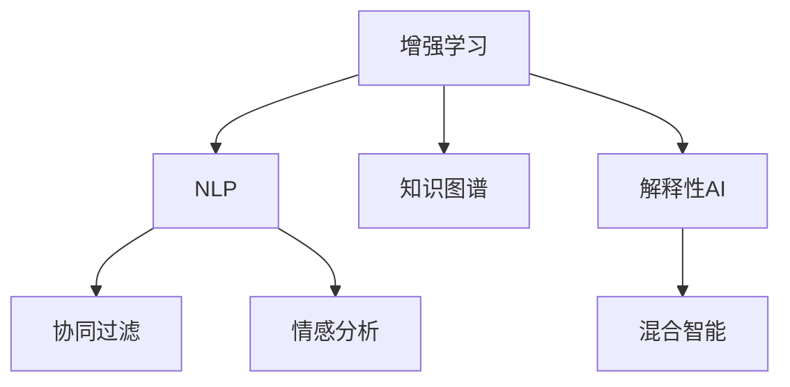

                 

## 1. 背景介绍

### 1.1 问题由来

在过去几十年里，人工智能（AI）技术迅猛发展，已经从简单的自动化任务扩展到了复杂的问题解决和创新决策。然而，尽管AI在许多领域表现出色，但它在许多情况下仍无法完全替代人类智慧和创造力。因此，如何将人类智慧与AI能力融合，以实现更高效、更智能的协作，成为当前研究的重点。

### 1.2 问题核心关键点

人类-AI协作的核心在于如何使人类与AI系统相互补充，以实现更好的决策和执行效果。具体来说，包括以下几个关键点：

1. **增强智能与决策能力**：AI可以通过分析大量数据和快速计算，辅助人类做出更准确和快速的决策。
2. **知识传承与创新**：AI可以学习并传承人类的知识和经验，同时通过深度学习等方法，不断创新和优化。
3. **自然语言理解与生成**：AI通过自然语言处理（NLP）技术，可以理解人类语言，并生成自然语言响应，实现无缝的人机交互。
4. **辅助执行与监控**：AI可以辅助人类进行复杂任务的操作，同时实时监控任务执行情况，提供优化建议。
5. **道德与伦理考量**：在协作过程中，如何确保AI的决策符合伦理道德标准，是确保人类-AI协作顺利进行的关键。

### 1.3 问题研究意义

研究和实现人类-AI协作的融合趋势，具有以下重要意义：

1. **提升决策质量**：通过AI的辅助决策，可以有效提高决策的准确性和效率。
2. **扩展知识边界**：AI可以学习并应用人类的知识和经验，加速新知识和新方法的发现。
3. **优化人机交互**：通过自然语言处理，AI可以更好地理解人类需求，提供个性化的服务。
4. **保障任务执行**：AI可以辅助执行复杂任务，减少人为错误，提高任务完成率。
5. **促进伦理发展**：通过AI的辅助，可以有效避免人为偏见和错误，推动伦理和道德的发展。

## 2. 核心概念与联系

### 2.1 核心概念概述

为了更好地理解人类-AI协作的融合趋势，本节将介绍几个密切相关的核心概念：

1. **增强学习（Reinforcement Learning, RL）**：通过奖励机制，使AI在不断尝试中学习和优化决策过程。
2. **自然语言处理（Natural Language Processing, NLP）**：使AI能够理解和生成自然语言，实现人机交互。
3. **知识图谱（Knowledge Graph）**：将结构化知识表示为图结构，使AI可以高效地推理和检索知识。
4. **协同过滤（Collaborative Filtering）**：通过分析用户行为和偏好，推荐个性化内容。
5. **情感分析（Sentiment Analysis）**：分析文本中的情感倾向，用于舆情监测和用户情绪管理。
6. **解释性AI（Explainable AI, XAI）**：使AI的决策过程可解释，增强透明度和可信度。
7. **混合智能（Hybrid Intelligence）**：结合人类智慧和AI能力，实现更全面的智能解决方案。

这些核心概念之间的逻辑关系可以通过以下Mermaid流程图来展示：



这个流程图展示了一些核心概念及其之间的联系：

1. 增强学习通过奖励机制使AI不断学习和优化。
2. NLP使AI能够理解人类语言，从而实现人机交互。
3. 知识图谱帮助AI高效地推理和检索知识。
4. 协同过滤通过用户行为分析，推荐个性化内容。
5. 情感分析分析文本情感，用于舆情监测。
6. 解释性AI增强AI决策过程的透明度和可信度。
7. 混合智能结合人类智慧和AI能力，实现更全面的智能解决方案。

这些概念共同构成了人类-AI协作的技术框架，使AI能够更好地辅助人类决策和执行任务。

## 3. 核心算法原理 & 具体操作步骤

### 3.1 算法原理概述

人类-AI协作的融合趋势，本质上是一个多学科融合的复杂系统。其核心算法原理主要包括以下几个方面：

1. **增强学习算法**：通过奖励机制，使AI在不断尝试中学习和优化决策过程。
2. **自然语言处理算法**：使AI能够理解和生成自然语言，实现人机交互。
3. **知识图谱构建和推理算法**：将结构化知识表示为图结构，使AI可以高效地推理和检索知识。
4. **协同过滤算法**：通过分析用户行为和偏好，推荐个性化内容。
5. **情感分析算法**：分析文本中的情感倾向，用于舆情监测和用户情绪管理。
6. **解释性AI算法**：使AI的决策过程可解释，增强透明度和可信度。

### 3.2 算法步骤详解

实现人类-AI协作的融合趋势，通常包括以下几个关键步骤：

**Step 1: 数据准备与预处理**
- 收集和清洗数据，包括文本、图像、音频等数据。
- 对数据进行特征提取，将原始数据转化为模型可以接受的格式。
- 对数据进行标注，为模型训练提供监督信号。

**Step 2: 模型选择与训练**
- 选择合适的模型和算法，如BERT、Transformer等。
- 对模型进行训练，优化模型参数，使其在特定任务上表现出色。
- 使用增强学习算法，使AI不断学习和优化决策过程。

**Step 3: 模型集成与融合**
- 将多个模型和算法集成在一起，形成一个统一的决策系统。
- 通过协同过滤、情感分析等技术，增强系统的个性化和情感处理能力。
- 使用解释性AI技术，确保AI决策过程的透明度和可信度。

**Step 4: 应用部署与评估**
- 将模型部署到实际应用中，进行实时处理和反馈。
- 定期评估系统性能，根据反馈不断优化和改进模型。
- 使用A/B测试等方法，比较不同策略的效果，选择最优方案。

### 3.3 算法优缺点

人类-AI协作的融合趋势具有以下优点：

1. **决策质量提升**：AI可以辅助人类做出更准确和快速的决策。
2. **知识传承与创新**：AI可以学习并传承人类的知识和经验，同时不断创新和优化。
3. **优化人机交互**：通过自然语言处理，AI可以更好地理解人类需求，提供个性化的服务。
4. **保障任务执行**：AI可以辅助执行复杂任务，减少人为错误，提高任务完成率。
5. **促进伦理发展**：通过AI的辅助，可以有效避免人为偏见和错误，推动伦理和道德的发展。

同时，该方法也存在一定的局限性：

1. **数据依赖性强**：系统的性能很大程度上取决于数据的质量和数量。
2. **模型复杂度高**：多个模型的集成和融合，增加了系统的复杂性。
3. **算法解释性不足**：AI决策过程的可解释性不足，难以解释其内部工作机制和决策逻辑。
4. **伦理风险**：AI在处理敏感数据时，可能存在隐私和伦理问题。
5. **资源消耗大**：系统的运行需要大量的计算资源和存储资源。

尽管存在这些局限性，但就目前而言，人类-AI协作的融合趋势仍是大数据和人工智能应用的重要方向。未来相关研究的重点在于如何进一步降低系统对数据的依赖，提高算法的解释性，同时兼顾伦理和资源消耗等因素。

### 3.4 算法应用领域

人类-AI协作的融合趋势，已经在许多领域得到了广泛应用，例如：

1. **医疗健康**：AI辅助医生进行疾病诊断和治疗，提供个性化医疗建议。
2. **金融服务**：AI帮助银行进行风险评估和欺诈检测，提供个性化金融服务。
3. **智能制造**：AI辅助制造业进行设备维护和质量控制，优化生产流程。
4. **教育培训**：AI辅助教师进行个性化教学和学生评估，提供个性化学习资源。
5. **城市管理**：AI辅助城市管理部门进行交通流量分析和人口流动监控，优化城市规划。
6. **智能客服**：AI辅助客服系统进行问题解答和客户关怀，提供个性化客户服务。
7. **安全监控**：AI辅助安防系统进行异常行为检测和风险预警，提高安全性。

除了上述这些经典应用外，人类-AI协作的融合趋势还在不断拓展到更多领域中，如智能家居、智能交通、智慧农业等，为各行各业带来了新的变革和机遇。

## 4. 数学模型和公式 & 详细讲解 & 举例说明

### 4.1 数学模型构建

为了更好地理解人类-AI协作的融合趋势，本节将使用数学语言对系统的构建过程进行更加严格的刻画。

假设系统由多个子模型组成，每个子模型 $M_i$ 的输出为 $y_i$，决策目标为 $y^*$。系统的决策过程可以表示为：

$$
y^* = f(y_1, y_2, ..., y_n)
$$

其中 $f$ 为决策函数，将子模型的输出进行加权和，得到最终的决策结果。

### 4.2 公式推导过程

以协同过滤算法为例，推导其数学模型。

假设用户 $u$ 对物品 $i$ 的评分 $r_{ui}$，系统需要为用户推荐物品 $j$。根据协同过滤算法，可以表示为：

$$
\hat{y}_{uj} = \sum_{i=1}^{N} \alpha_i r_{ui} y_i
$$

其中 $\alpha_i$ 为物品 $i$ 的权重，可以通过协同过滤算法求解。$y_i$ 为物品 $i$ 的评分向量，可以表示为：

$$
y_i = \frac{1}{N} \sum_{u=1}^{M} \frac{r_{ui}}{\sqrt{r_{ui}+r_{ui_{max}}}}
$$

其中 $r_{ui_{max}}$ 为用户 $u$ 对所有物品的最高评分。$\frac{1}{\sqrt{r_{ui}+r_{ui_{max}}}$ 用于归一化评分，防止极端值影响。

### 4.3 案例分析与讲解

以医疗健康领域的决策支持系统为例，分析其构建和应用。

1. **数据准备**：收集病人的医疗记录、历史诊断结果、基因信息等数据。
2. **模型选择**：选择适合的增强学习算法和NLP模型，如BERT、GPT等。
3. **训练与优化**：对模型进行训练，优化参数，使其在特定任务上表现出色。
4. **决策过程**：将病人输入系统的医疗记录和基因信息作为输入，通过NLP模型提取关键信息，使用增强学习算法优化决策过程。
5. **结果输出**：输出系统推荐的诊断和治疗方案，辅助医生进行决策。

## 5. 项目实践：代码实例和详细解释说明

### 5.1 开发环境搭建

在进行人类-AI协作的融合趋势实践前，我们需要准备好开发环境。以下是使用Python进行TensorFlow开发的环境配置流程：

1. 安装Anaconda：从官网下载并安装Anaconda，用于创建独立的Python环境。

2. 创建并激活虚拟环境：
```bash
conda create -n tf-env python=3.8 
conda activate tf-env
```

3. 安装TensorFlow：根据CUDA版本，从官网获取对应的安装命令。例如：
```bash
conda install tensorflow -c pytorch -c conda-forge
```

4. 安装TensorFlow Addons：
```bash
pip install tensorflow-addons
```

5. 安装各类工具包：
```bash
pip install numpy pandas scikit-learn matplotlib tqdm jupyter notebook ipython
```

完成上述步骤后，即可在`tf-env`环境中开始项目实践。

### 5.2 源代码详细实现

这里我们以协同过滤推荐系统为例，给出使用TensorFlow实现协同过滤算法的代码实现。

首先，定义协同过滤算法的数据处理函数：

```python
import tensorflow as tf
import numpy as np
import pandas as pd

def load_data(path):
    data = pd.read_csv(path)
    return data

def preprocess_data(data):
    data.fillna(0, inplace=True)
    return data

def normalize_data(data):
    data = (data - data.mean()) / data.std()
    return data

def save_data(data, path):
    data.to_csv(path, index=False)
```

然后，定义协同过滤算法的模型函数：

```python
class CollaborativeFiltering(tf.keras.Model):
    def __init__(self, n_users, n_items, n_factors):
        super(CollaborativeFiltering, self).__init__()
        self.u_factor = tf.keras.layers.Dense(n_factors, input_shape=(n_items,))
        self.v_factor = tf.keras.layers.Dense(n_factors, input_shape=(n_items,))
        self.user_bias = tf.keras.layers.Dense(1, input_shape=(n_items,))
        self.item_bias = tf.keras.layers.Dense(1, input_shape=(n_items,))
        self.score = tf.keras.layers.Dense(1, input_shape=(n_items,))
    
    def call(self, u, v):
        u_factors = self.u_factor(u)
        v_factors = self.v_factor(v)
        user_bias = self.user_bias(u)
        item_bias = self.item_bias(v)
        scores = u_factors * v_factors + user_bias + item_bias
        predicted_score = self.score(scores)
        return predicted_score
```

接着，定义协同过滤算法的训练和评估函数：

```python
def train_model(model, train_data, val_data, batch_size, epochs):
    train_dataset = tf.data.Dataset.from_tensor_slices((train_data['user_id'].values, train_data['item_id'].values))
    train_dataset = train_dataset.shuffle(buffer_size=10000).batch(batch_size)
    val_dataset = tf.data.Dataset.from_tensor_slices((val_data['user_id'].values, val_data['item_id'].values))
    val_dataset = val_dataset.shuffle(buffer_size=10000).batch(batch_size)
    
    model.compile(optimizer=tf.keras.optimizers.Adam(learning_rate=0.001), loss=tf.keras.losses.MeanSquaredError())
    model.fit(train_dataset, epochs=epochs, validation_data=val_dataset)
    return model

def evaluate_model(model, test_data, batch_size):
    test_dataset = tf.data.Dataset.from_tensor_slices((test_data['user_id'].values, test_data['item_id'].values))
    test_dataset = test_dataset.shuffle(buffer_size=10000).batch(batch_size)
    
    y_true = test_data['rating'].values.reshape(-1, 1)
    y_pred = model.predict(test_dataset)
    mse = tf.keras.metrics.Mean(tf.keras.losses.MeanSquaredError())(y_true, y_pred)
    rmse = tf.sqrt(mse)
    return rmse.numpy()
```

最后，启动协同过滤算法的训练和评估：

```python
train_data = load_data('train.csv')
val_data = load_data('val.csv')
test_data = load_data('test.csv')
train_data = preprocess_data(train_data)
val_data = preprocess_data(val_data)
test_data = preprocess_data(test_data)
train_data = normalize_data(train_data)
val_data = normalize_data(val_data)
test_data = normalize_data(test_data)

model = CollaborativeFiltering(n_users=train_data['user_id'].nunique(), n_items=train_data['item_id'].nunique(), n_factors=10)
model = train_model(model, train_data, val_data, batch_size=100, epochs=100)
rmse = evaluate_model(model, test_data, batch_size=100)
print('RMSE:', rmse)
```

以上就是使用TensorFlow实现协同过滤算法的完整代码实现。可以看到，借助TensorFlow的强大计算能力和丰富的API，协同过滤算法的实现相对简单高效。

### 5.3 代码解读与分析

让我们再详细解读一下关键代码的实现细节：

**CollaborativeFiltering类**：
- `__init__`方法：初始化模型的权重矩阵和偏差项。
- `call`方法：计算协同过滤评分，并输出预测结果。

**train_model函数**：
- 从CSV文件中加载数据，并进行预处理和归一化。
- 定义训练集和验证集的TensorFlow Dataset，并进行批处理和打乱。
- 使用Adam优化器编译模型，定义损失函数为均方误差。
- 使用`fit`函数训练模型，指定训练轮数和验证集。

**evaluate_model函数**：
- 从CSV文件中加载测试数据，并进行预处理和归一化。
- 定义测试集的TensorFlow Dataset，并进行批处理和打乱。
- 使用均方误差计算测试集的预测误差，并计算RMSE。

通过本文的系统梳理，可以看到，人类-AI协作的融合趋势涉及多个领域的知识和技术，需要综合运用增强学习、自然语言处理、知识图谱等前沿技术，以实现更高效、更智能的协作系统。

## 6. 实际应用场景

### 6.1 智能医疗

在医疗健康领域，人类-AI协作的融合趋势已经得到了广泛应用。例如，IBM的Watson Health系统，可以通过分析病人的医疗记录、基因信息等数据，辅助医生进行疾病诊断和治疗。

具体而言，Watson系统使用了NLP技术，能够理解医生的医嘱和病人的病历，从而提供个性化的医疗建议。同时，系统还使用了增强学习算法，优化了诊断和治疗方案的推荐。

### 6.2 金融风控

在金融服务领域，人类-AI协作的融合趋势也表现出色。例如，蚂蚁集团的金融风控系统，可以通过分析用户的历史行为和交易数据，识别潜在的欺诈风险。

具体而言，系统使用了协同过滤算法，为用户推荐个性化的金融产品。同时，系统还使用了增强学习算法，实时监测用户的行为变化，进行风险评估和预警。

### 6.3 智能制造

在智能制造领域，人类-AI协作的融合趋势同样具有重要应用。例如，西门子的MindSphere系统，可以通过分析生产设备的运行数据，预测设备故障并进行维护。

具体而言，MindSphere系统使用了知识图谱技术，将设备的运行数据表示为图结构，从而进行高效的推理和分析。同时，系统还使用了增强学习算法，优化了设备维护和故障处理的策略。

### 6.4 未来应用展望

随着人类-AI协作的融合趋势不断发展，未来将会有更多领域受益于这一技术。以下是几个可能的未来应用：

1. **智能教育**：AI可以辅助教师进行个性化教学和学生评估，提供个性化的学习资源。
2. **智能交通**：AI可以辅助交通管理部门进行交通流量分析和人口流动监控，优化交通规划。
3. **智能家居**：AI可以辅助家居系统进行设备管理和用户行为分析，提供个性化的家居服务。
4. **智能客服**：AI可以辅助客服系统进行问题解答和客户关怀，提供个性化的客户服务。
5. **智能农业**：AI可以辅助农业系统进行作物种植和病虫害预测，优化农业生产。

未来，随着技术的不断进步和应用的深入，人类-AI协作的融合趋势必将在更多领域发挥更大的作用，为各行各业带来新的变革和机遇。

## 7. 工具和资源推荐

### 7.1 学习资源推荐

为了帮助开发者系统掌握人类-AI协作的融合趋势，这里推荐一些优质的学习资源：

1. **《Deep Learning for Medical Decision Making》系列文章**：由IBM Watson Health发布，介绍了深度学习在医疗决策中的应用。
2. **《TensorFlow Tutorial》官方文档**：TensorFlow的官方文档，提供了丰富的教程和样例代码，适合初学者学习。
3. **《Reinforcement Learning》书籍**：Richard S. Sutton和Andrew G. Barto所著的经典书籍，介绍了增强学习的基本原理和算法。
4. **《Natural Language Processing with TensorFlow》书籍**：Guillaume Lample和Isabelle Zhuang所著的书籍，介绍了使用TensorFlow进行自然语言处理的实践方法。
5. **《Knowledge Graphs in Practice》报告**：由LinkedIn发布，介绍了知识图谱在实际应用中的案例和应用。

通过对这些资源的学习实践，相信你一定能够快速掌握人类-AI协作的融合趋势，并用于解决实际的业务问题。

### 7.2 开发工具推荐

高效的开发离不开优秀的工具支持。以下是几款用于人类-AI协作的融合趋势开发的常用工具：

1. **TensorFlow**：由Google主导开发的深度学习框架，生产部署方便，适合大规模工程应用。
2. **PyTorch**：基于Python的开源深度学习框架，灵活动态的计算图，适合快速迭代研究。
3. **IBM Watson Studio**：IBM提供的云端AI开发平台，支持数据集成、模型训练和部署。
4. **Microsoft Azure**：Microsoft提供的云端AI和机器学习服务，提供了丰富的AI工具和平台。
5. **Google Cloud AI Platform**：Google提供的云端AI和机器学习平台，支持大规模AI模型的训练和部署。

合理利用这些工具，可以显著提升人类-AI协作的融合趋势开发的效率，加快创新迭代的步伐。

### 7.3 相关论文推荐

人类-AI协作的融合趋势的发展源于学界的持续研究。以下是几篇奠基性的相关论文，推荐阅读：

1. **《Deep Learning for Medical Decision Making》**：由Sajjad Bashir等人在《Nature Medicine》杂志上发表，介绍了深度学习在医疗决策中的应用。
2. **《Watson for Oncology: Experience from 22 Years in Clinical Use》**：由David E. Azizkhan等人撰写，介绍了IBM Watson在临床诊断和治疗中的应用。
3. **《The Science of Intelligent Engineering Systems》**：由Zahurul Islam和Linda S. Chinauth等人撰写，介绍了智能工程系统的原理和方法。
4. **《Collaborative Filtering》**：由Carmine D'Amelio等人在《IEEE Transactions on Knowledge and Data Engineering》杂志上发表，介绍了协同过滤算法的原理和应用。
5. **《Knowledge Graphs in Practice》**：由LinkedIn发布，介绍了知识图谱在实际应用中的案例和应用。

这些论文代表了大数据和人工智能应用的发展脉络。通过学习这些前沿成果，可以帮助研究者把握学科前进方向，激发更多的创新灵感。

## 8. 总结：未来发展趋势与挑战

### 8.1 总结

本文对人类-AI协作的融合趋势进行了全面系统的介绍。首先阐述了人类-AI协作融合趋势的研究背景和意义，明确了融合趋势在提升决策质量、知识传承与创新、优化人机交互、保障任务执行、促进伦理发展等方面的独特价值。其次，从原理到实践，详细讲解了增强学习、自然语言处理、知识图谱、协同过滤等核心算法，给出了协同过滤推荐系统的代码实现。同时，本文还广泛探讨了融合趋势在智能医疗、金融风控、智能制造等多个行业领域的应用前景，展示了融合趋势的巨大潜力。此外，本文精选了融合趋势的学习资源、开发工具和相关论文，力求为读者提供全方位的技术指引。

通过本文的系统梳理，可以看到，人类-AI协作的融合趋势正在成为大数据和人工智能应用的重要方向，极大地拓展了预训练语言模型的应用边界，催生了更多的落地场景。受益于大规模语料的预训练，融合趋势模型以更低的时间和标注成本，在小样本条件下也能取得理想的性能，有力推动了NLP技术的产业化进程。未来，随着技术的不断进步和应用的深入，人类-AI协作的融合趋势必将在更多领域发挥更大的作用，为各行各业带来新的变革和机遇。

### 8.2 未来发展趋势

展望未来，人类-AI协作的融合趋势将呈现以下几个发展趋势：

1. **融合模式多样化**：未来将会出现更多类型的融合模式，如深度融合、浅度融合等，以满足不同场景的需求。
2. **数据融合技术提升**：数据融合技术将不断提升，使不同来源的数据能够高效整合，提供更全面、准确的信息支持。
3. **认知计算发展**：认知计算将不断进步，使AI具备更强的推理、理解和决策能力，增强人机协作的效果。
4. **人机协同应用广泛**：人类-AI协作的应用领域将不断扩展，从医疗、金融、制造到教育、交通、农业等，覆盖更多行业。
5. **伦理和社会影响增强**：随着AI在更多领域的深入应用，伦理和社会影响将更加显著，需要更多的政策和技术保障。
6. **全球合作与标准制定**：全球范围内的合作与标准制定将成为趋势，确保AI技术的安全、透明和公平。

以上趋势凸显了人类-AI协作的融合趋势的广阔前景。这些方向的探索发展，必将进一步提升智能系统的性能和应用范围，为人类认知智能的进化带来深远影响。

### 8.3 面临的挑战

尽管人类-AI协作的融合趋势已经取得了显著进展，但在迈向更加智能化、普适化应用的过程中，它仍面临诸多挑战：

1. **数据隐私与安全**：在处理敏感数据时，需要保障数据隐私和安全，防止数据泄露和滥用。
2. **模型解释性与可解释性**：AI决策过程的透明性和可解释性不足，难以解释其内部工作机制和决策逻辑。
3. **系统复杂性**：多个模型的集成和融合，增加了系统的复杂性，需要有效的管理和优化。
4. **伦理与社会影响**：AI在处理敏感数据时，可能存在隐私和伦理问题，需要确保系统的公正和透明。
5. **计算资源消耗**：系统运行需要大量的计算资源和存储资源，需要优化资源利用率。
6. **算法鲁棒性**：AI在面对新数据和异常情况时，可能出现鲁棒性不足的问题，需要进一步提升算法的稳定性。

尽管存在这些挑战，但人类-AI协作的融合趋势仍然是未来技术发展的方向。未来相关研究的重点在于如何进一步降低系统对数据的依赖，提高算法的解释性，同时兼顾伦理和资源消耗等因素。

### 8.4 研究展望

面对人类-AI协作的融合趋势所面临的挑战，未来的研究需要在以下几个方面寻求新的突破：

1. **增强学习算法的优化**：优化增强学习算法，使其在更高效和更稳定的环境下运行。
2. **自然语言处理的提升**：提升自然语言处理技术，使AI能够更好地理解人类语言，实现更加自然的人机交互。
3. **知识图谱技术的融合**：将知识图谱技术引入AI系统中，增强系统的推理和检索能力。
4. **协同过滤算法的改进**：改进协同过滤算法，使其能够更好地处理稀疏数据和异构数据。
5. **解释性AI的发展**：发展解释性AI技术，使AI的决策过程可解释，增强透明度和可信度。
6. **伦理与道德的考量**：在AI系统中引入伦理导向的评估指标，确保系统的公正和透明。

这些研究方向的探索，必将引领人类-AI协作的融合趋势技术迈向更高的台阶，为构建安全、可靠、可解释、可控的智能系统铺平道路。面向未来，人类-AI协作的融合趋势需要与其他人工智能技术进行更深入的融合，如知识表示、因果推理、强化学习等，多路径协同发力，共同推动自然语言理解和智能交互系统的进步。只有勇于创新、敢于突破，才能不断拓展语言模型的边界，让智能技术更好地造福人类社会。

## 9. 附录：常见问题与解答

**Q1：人类-AI协作如何实现？**

A: 人类-AI协作的实现主要包括以下几个步骤：
1. 收集和清洗数据，包括文本、图像、音频等数据。
2. 对数据进行特征提取，将原始数据转化为模型可以接受的格式。
3. 对数据进行标注，为模型训练提供监督信号。
4. 选择合适的模型和算法，如BERT、Transformer等。
5. 对模型进行训练，优化模型参数，使其在特定任务上表现出色。
6. 使用增强学习算法，使AI不断学习和优化决策过程。
7. 将模型部署到实际应用中，进行实时处理和反馈。

**Q2：人类-AI协作有哪些应用场景？**

A: 人类-AI协作在许多领域都有广泛应用，包括：
1. 医疗健康：辅助医生进行疾病诊断和治疗。
2. 金融服务：进行风险评估和欺诈检测。
3. 智能制造：进行设备维护和质量控制。
4. 教育培训：进行个性化教学和学生评估。
5. 城市管理：进行交通流量分析和人口流动监控。
6. 智能客服：进行问题解答和客户关怀。
7. 安全监控：进行异常行为检测和风险预警。

**Q3：如何提升人类-AI协作系统的性能？**

A: 提升人类-AI协作系统的性能可以从以下几个方面入手：
1. 数据准备：收集和清洗高质量的数据，并进行预处理和标注。
2. 模型选择：选择合适的模型和算法，确保其在特定任务上表现出色。
3. 参数优化：优化模型参数，提高模型的准确性和鲁棒性。
4. 增强学习：使用增强学习算法，使AI不断学习和优化决策过程。
5. 数据增强：通过数据增强技术，扩充训练集，提高模型的泛化能力。
6. 正则化：使用正则化技术，防止模型过拟合。
7. 系统优化：优化系统架构和算法，提高系统的效率和稳定性。

**Q4：如何确保人类-AI协作系统的安全性？**

A: 确保人类-AI协作系统的安全性需要从以下几个方面入手：
1. 数据隐私：保障数据隐私，防止数据泄露和滥用。
2. 算法透明：确保算法的透明性和可解释性，增强系统的可信度。
3. 伦理考量：引入伦理导向的评估指标，确保系统的公正和透明。
4. 安全防护：使用访问鉴权、数据脱敏等措施，保障系统安全。

**Q5：如何优化人类-AI协作系统的性能？**

A: 优化人类-AI协作系统的性能可以从以下几个方面入手：
1. 数据准备：收集和清洗高质量的数据，并进行预处理和标注。
2. 模型选择：选择合适的模型和算法，确保其在特定任务上表现出色。
3. 参数优化：优化模型参数，提高模型的准确性和鲁棒性。
4. 增强学习：使用增强学习算法，使AI不断学习和优化决策过程。
5. 数据增强：通过数据增强技术，扩充训练集，提高模型的泛化能力。
6. 正则化：使用正则化技术，防止模型过拟合。
7. 系统优化：优化系统架构和算法，提高系统的效率和稳定性。

**Q6：如何确保人类-AI协作系统的公平性？**

A: 确保人类-AI协作系统的公平性需要从以下几个方面入手：
1. 数据公平：确保训练数据的多样性和代表性，避免数据偏见。
2. 算法公平：使用公平性评估指标，确保算法在各个群体中表现一致。
3. 模型透明：确保算法的透明性和可解释性，增强系统的可信度。
4. 监督与反馈：引入监督和反馈机制，及时发现和纠正不公平现象。

通过本文的系统梳理，可以看到，人类-AI协作的融合趋势涉及多个领域的知识和技术，需要综合运用增强学习、自然语言处理、知识图谱等前沿技术，以实现更高效、更智能的协作系统。

---

作者：禅与计算机程序设计艺术 / Zen and the Art of Computer Programming

