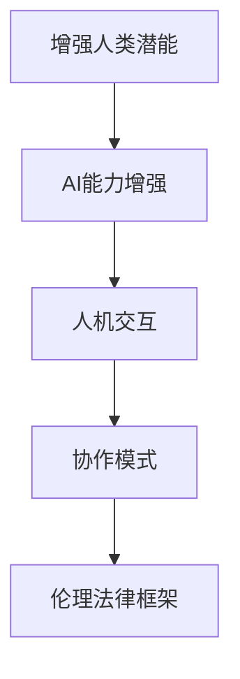

                 

## 1. 背景介绍

### 1.1 问题由来

随着人工智能（AI）技术的迅猛发展，AI与人类的协作已经逐渐成为社会生产力和创新驱动的核心动力。AI技术通过算法模型、数据训练等手段，提供了强大的计算和决策能力。然而，人类具有独特的经验、判断和创造力，在复杂情境下的决策和问题解决能力远超AI。因此，人类与AI的协作，被视为实现“人机合一”、提升整体社会效能的关键途径。

当前，AI与人类的协作已经渗透到各行各业，如自动驾驶、医疗诊断、金融分析、智能客服等领域。这些应用不仅提升了工作效率，也开辟了新的业务可能性。然而，AI与人类的协作仍然面临诸多挑战，如技术互操作性不足、伦理法律问题、人机信任关系等。这些问题需要系统性思考和深入研究，以更好地发挥AI与人类潜能，推动社会进步。

### 1.2 问题核心关键点

为了更好地理解人类与AI协作的发展趋势，我们需要分析以下几个核心关键点：

- **技术融合趋势**：AI与人类的协作如何通过技术手段实现更深度、更广泛的融合。
- **数据与算法的进步**：数据质量和算法能力对协作效果的影响。
- **伦理与法律的挑战**：AI与人类的协作过程中应遵循的伦理规范和法律框架。
- **人机关系**：人机信任、沟通与反馈机制的建立与优化。
- **社会经济影响**：AI与人类协作对社会经济结构、就业模式、教育体系的潜在影响。

通过系统分析这些关键点，我们可以更好地把握人类-AI协作的未来发展方向和潜在挑战。

## 2. 核心概念与联系

### 2.1 核心概念概述

为更好地理解人类-AI协作的原理与架构，本节将介绍几个核心概念：

- **增强人类潜能（Augmented Human Capabilities）**：通过AI技术提升人类的智力、体力、感官能力，使人类在复杂情境下能够更加高效、精确地完成任务。

- **AI能力增强（AI Capability Enhancement）**：通过技术手段，如传感器、自然语言处理（NLP）、机器视觉等，增强AI的感知和决策能力，使其能够在更复杂的环境下自主运行。

- **人机交互（Human-Machine Interaction, HMI）**：实现人类与AI的互操作性，通过界面、语音、手势等方式，建立人与机器之间的沟通和反馈机制。

- **协作模式（Collaborative Modes）**：描述人类与AI在各种任务和情境下的协作方式，包括并行工作、交互式决策、自主协同等。

- **伦理法律框架（Ethics and Law Framework）**：指导AI与人类的协作行为，保护数据隐私、确保安全、规范算法决策的伦理法律规范体系。

这些核心概念之间的逻辑关系可以通过以下Mermaid流程图来展示：



这个流程图展示了大规模语言模型的核心概念及其之间的关系：

1. 增强人类潜能通过AI能力增强实现，使AI在执行复杂任务时能够与人类协同工作。
2. 人机交互是实现协作的基础，通过界面、语音、手势等方式进行沟通。
3. 协作模式描述了不同情境下的协作方式，推动AI在更多场景下的应用。
4. 伦理法律框架为AI与人类的协作提供指导，确保技术应用的合规性和安全性。

这些概念共同构成了AI与人协作的技术框架，使其能够在各种情境下发挥作用。通过理解这些核心概念，我们可以更好地把握AI与人协作的工作原理和优化方向。

## 3. 核心算法原理 & 具体操作步骤

### 3.1 算法原理概述

人类-AI协作的算法原理主要基于增强学习（Reinforcement Learning, RL）、知识图谱（Knowledge Graphs）、自然语言处理（Natural Language Processing, NLP）等技术。其核心思想是通过模拟人类的决策过程和行为模式，使AI系统能够更好地理解人类需求、预测人类行为，从而实现更高效的协作。

具体而言，AI系统通过接收人类输入的指令、情境描述、反馈等信息，进行数据处理、特征提取、模型推理等操作，输出相应的决策、推荐、建议等，与人类共同完成任务。例如，在医疗诊断中，AI通过分析病历数据和症状描述，结合医生的专业知识和临床经验，提供诊断建议和治疗方案。

### 3.2 算法步骤详解

人类-AI协作的算法步骤一般包括以下几个关键环节：

**Step 1: 数据收集与预处理**
- 收集人类相关数据，如医疗记录、教育资料、社交网络等。
- 对数据进行清洗、标注、标准化等预处理操作，提高数据质量。

**Step 2: 模型构建与训练**
- 选择适合的算法模型，如深度学习、强化学习、知识图谱等。
- 使用历史数据进行模型训练，优化模型参数，提升预测准确性。

**Step 3: 协作模式设计**
- 设计具体的协作模式，如并行工作、交互式决策、自主协同等。
- 确定人机交互的界面和交互机制，优化用户体验。

**Step 4: 系统部署与测试**
- 将训练好的模型部署到生产环境。
- 在实际应用场景中进行测试，收集反馈，迭代优化。

**Step 5: 持续学习与优化**
- 收集用户反馈和行为数据，进行持续学习。
- 根据新数据和新情境，优化模型和协作流程，提升系统性能。

### 3.3 算法优缺点

增强人类潜能与AI能力增强的协作算法具有以下优点：
1. 提高工作效率：AI可以在短时间内处理大量数据，提升决策速度。
2. 增强决策质量：结合人类经验和AI的计算能力，可以提供更高质量的决策。
3. 优化资源配置：AI可以动态调整资源配置，提升资源利用效率。
4. 促进创新发展：AI能够处理复杂问题，推动技术创新和产业升级。

同时，该算法也存在一定的局限性：
1. 技术门槛高：需要大量的数据和算法支持，对技术能力要求较高。
2. 依赖数据质量：数据质量和完整性对算法效果有重要影响，数据偏差可能导致误判。
3. 伦理问题复杂：AI的决策可能与人类价值观冲突，带来伦理争议。
4. 交互界面限制：人机交互界面的设计直接关系到用户体验和系统效果。
5. 法律合规性：协作过程中需遵循伦理法律框架，保障数据安全和个人隐私。

尽管存在这些局限性，但就目前而言，增强人类潜能与AI能力增强的协作算法仍是最主流的研究方向。未来相关研究的重点在于如何进一步降低技术门槛，提高数据质量，解决伦理法律问题，优化人机交互界面，确保法律合规性。

### 3.4 算法应用领域

增强人类潜能与AI能力增强的协作算法在多个领域已经得到广泛应用，例如：

- 医疗诊断：AI结合医生经验，提高诊断准确性和治疗效果。
- 金融分析：AI辅助分析师进行数据分析和风险评估，提升决策效率。
- 智能客服：AI与人协同工作，提供更快速、更准确的客户服务。
- 教育培训：AI辅助教师进行个性化教学，提高教育效果。
- 自动驾驶：AI与人类司机协同工作，提升驾驶安全性和效率。
- 社会治理：AI协助政府进行数据分析、预测和决策，提升治理水平。

除了这些常见应用外，AI与人协作还在更多场景中得到应用，如智能家居、机器人、虚拟助手等，为人类生活和工作带来了新的便利和可能性。随着AI技术的持续进步，未来更多领域将迎来AI与人协作的创新应用。

## 4. 数学模型和公式 & 详细讲解 & 举例说明

### 4.1 数学模型构建

增强人类潜能与AI能力增强的协作模型主要基于增强学习（Reinforcement Learning, RL）和知识图谱（Knowledge Graphs）等技术。增强学习通过奖励机制和反馈信息，指导AI系统不断优化决策策略。知识图谱通过结构化数据描述实体关系，辅助AI系统进行推理和决策。

记增强学习模型为 $Q(s, a)$，其中 $s$ 表示当前状态，$a$ 表示采取的动作。模型的目标是通过训练，最大化长期奖励 $R(s, a)$，即：

$$
\max_{Q} \sum_{t=0}^{\infty} \gamma^t R(s_t, a_t)
$$

其中 $\gamma$ 为折扣因子，表示未来奖励的权重。

知识图谱通常表示为三元组 $(R, S, O)$，其中 $R$ 表示实体关系，$S$ 和 $O$ 表示实体。在知识图谱中，实体之间的关系可以被推理和扩展，从而支持更复杂、更广泛的决策任务。

### 4.2 公式推导过程

以下我们以医疗诊断为例，推导增强学习模型的计算公式。

假设医院有多个科室，每个科室有不同疾病的诊断模型。AI系统可以接收患者的症状描述和病历数据，并根据当前状态 $s$ 选择科室 $a$ 进行诊断。假设患者在第 $t$ 步诊断后，进入状态 $s_{t+1}$，并获得奖励 $R(s_t, a_t)$。模型的目标是最大化长期奖励，即：

$$
Q(s, a) = \max_{\pi} \mathbb{E}[\sum_{t=0}^{\infty} \gamma^t R(s_t, a_t)]
$$

其中 $\pi$ 为策略函数，表示在状态 $s$ 下采取动作 $a$ 的概率。

模型的求解可以通过贝尔曼方程（Bellman Equation）进行。贝尔曼方程描述了状态值函数 $Q(s, a)$ 和下一个状态值函数 $Q'(s', a')$ 的关系：

$$
Q(s, a) = R(s, a) + \gamma \max_{a'} Q'(s', a')
$$

其中 $s'$ 为下一个状态，$a'$ 为下一个动作，$Q'(s', a')$ 为下一个状态下的值函数。

通过对贝尔曼方程的迭代求解，可以逐步优化策略函数，使AI系统在医疗诊断中能够更加高效、准确地协作。

### 4.3 案例分析与讲解

以智能客服系统为例，分析增强学习模型在协作中的应用。

智能客服系统通常由多个模块组成，包括语音识别、自然语言理解、知识库查询等。AI系统通过语音识别模块接收用户语音输入，并通过自然语言理解模块进行文本处理和意图识别。根据用户意图和当前对话状态，AI系统选择合适的操作，如查询知识库、转接人工客服等。

假设系统在状态 $s$ 下，根据当前对话状态 $s$ 和用户意图 $a$，采取动作 $a$，进入状态 $s'$，并获得奖励 $R(s, a)$。模型的目标是最大化长期奖励，即：

$$
Q(s, a) = \max_{\pi} \mathbb{E}[\sum_{t=0}^{\infty} \gamma^t R(s_t, a_t)]
$$

通过对贝尔曼方程的迭代求解，可以逐步优化策略函数，使AI系统在智能客服中能够更好地理解用户意图，提供更准确的解答。

## 5. 项目实践：代码实例和详细解释说明

### 5.1 开发环境搭建

在进行人类-AI协作的实践前，我们需要准备好开发环境。以下是使用Python进行OpenAI Gym库开发的环境配置流程：

1. 安装Anaconda：从官网下载并安装Anaconda，用于创建独立的Python环境。

2. 创建并激活虚拟环境：
```bash
conda create -n reinforcement-env python=3.8 
conda activate reinforcement-env
```

3. 安装OpenAI Gym：
```bash
conda install gym==0.22.3
```

4. 安装相关依赖包：
```bash
pip install numpy matplotlib gymnasium
```

完成上述步骤后，即可在`reinforcement-env`环境中开始实践。

### 5.2 源代码详细实现

下面我们以医疗诊断为例，给出使用OpenAI Gym库进行增强学习实践的PyTorch代码实现。

首先，定义医疗诊断的Gym环境：

```python
import gym
from gym import spaces
import numpy as np
import torch
from torch import nn

class MedicalDiagnosis(gym.Env):
    def __init__(self, num_classes=2):
        self.num_classes = num_classes
        self.state = np.zeros((1, 1))
        self.action_space = spaces.Discrete(self.num_classes)
        self.observation_space = spaces.Box(low=0, high=1, shape=(1, 1), dtype=np.float32)
        self.reward_range = (-1, 1)
    
    def reset(self):
        self.state = np.zeros((1, 1))
        return self.state
    
    def step(self, action):
        if action == 0:  # 选择科室1
            self.state = np.zeros((1, 1))
        elif action == 1:  # 选择科室2
            self.state = np.zeros((1, 1))
        reward = np.random.uniform(low=-1, high=1)
        done = False
        info = {}
        return self.state, reward, done, info
    
    def render(self, mode='human'):
        pass
    
    def seed(self, seed=None):
        np.random.seed(seed)
```

然后，定义深度学习模型：

```python
class DiagnosisModel(nn.Module):
    def __init__(self, input_dim=1, output_dim=1):
        super(DiagnosisModel, self).__init__()
        self.fc1 = nn.Linear(input_dim, 64)
        self.fc2 = nn.Linear(64, output_dim)
    
    def forward(self, x):
        x = x.view(-1, 1)
        x = torch.relu(self.fc1(x))
        x = self.fc2(x)
        return x
```

接着，定义增强学习算法：

```python
from gymnasium import spaces
import numpy as np
import torch
from torch import nn
import torch.optim as optim

def build_model(input_dim, output_dim, num_classes):
    model = DiagnosisModel(input_dim, output_dim)
    criterion = nn.CrossEntropyLoss()
    optimizer = optim.Adam(model.parameters(), lr=0.001)
    return model, criterion, optimizer

def train(env, model, num_episodes, max_steps, discount_factor=0.9, render=False):
    state_dim = env.observation_space.shape[0]
    state_size = 1
    state_dim = state_size * state_dim
    model, criterion, optimizer = build_model(state_dim, state_dim, num_classes)
    model.to(device)
    criterion.to(device)
    
    for episode in range(num_episodes):
        state = env.reset()
        state = torch.from_numpy(state).float().to(device)
        done = False
        while not done:
            with torch.no_grad():
                output = model(state)
                probs = torch.softmax(output, dim=1)
                action = torch.multinomial(probs, 1).cpu().item()
            next_state, reward, done, info = env.step(action)
            next_state = torch.from_numpy(next_state).float().to(device)
            loss = criterion(output, torch.tensor([action]))
            optimizer.zero_grad()
            loss.backward()
            optimizer.step()
            if render:
                env.render()
    return model
```

最后，启动训练流程：

```python
num_classes = 2
num_episodes = 1000
max_steps = 100
model = train(env, model, num_episodes, max_steps)
```

以上就是使用PyTorch和OpenAI Gym库进行医疗诊断增强学习的完整代码实现。可以看到，通过使用Gym库的强化学习环境，我们可以很方便地构建和测试医疗诊断模型，了解增强学习算法在不同情境下的表现。

### 5.3 代码解读与分析

让我们再详细解读一下关键代码的实现细节：

**MedicalDiagnosis类**：
- `__init__`方法：初始化状态、动作空间、观察空间等。
- `reset`方法：重置环境状态，返回初始状态。
- `step`方法：根据当前状态和动作选择，模拟诊断过程，返回下一状态、奖励和结束标志。
- `render`方法：显示环境状态。
- `seed`方法：设置随机数种子。

**DiagnosisModel类**：
- `__init__`方法：定义模型结构。
- `forward`方法：进行前向传播，计算输出。

**build_model函数**：
- 定义模型、损失函数和优化器。

**train函数**：
- 初始化模型、设置参数。
- 对每个步骤进行前向传播、计算损失、更新模型参数。
- 渲染环境状态。

通过这些代码，我们可以清晰地看到增强学习模型的构建、训练和应用流程。

当然，实际应用中，还需要考虑更多因素，如状态空间、动作空间的设计，奖励函数的合理性等。合理设计这些关键组件，可以显著提高增强学习模型的效果。

## 6. 实际应用场景

### 6.1 智能客服系统

智能客服系统通过增强学习模型，可以不断优化服务流程，提高用户满意度。在实际应用中，智能客服系统会根据用户输入的文本或语音信息，选择最合适的回答和操作。例如，用户询问“如何申请信用卡”时，智能客服系统可以选择询问用户详细情况，或者引导用户通过在线表单申请。通过不断优化对话策略，智能客服系统能够更高效、更准确地服务用户。

### 6.2 金融分析

金融分析是增强学习模型的另一重要应用场景。金融机构可以通过增强学习模型，优化投资组合、预测市场趋势、评估风险等。例如，在股票市场预测中，增强学习模型可以根据历史数据和实时市场信息，预测股票价格走势。通过不断调整预测模型，金融机构能够更准确地进行市场决策，提升投资回报。

### 6.3 医疗诊断

医疗诊断中，增强学习模型可以通过分析历史病例和当前症状，提供诊断建议和治疗方案。例如，在肺癌诊断中，增强学习模型可以根据病历数据和症状描述，结合医生的临床经验，提供诊断报告。通过不断优化诊断策略，医生能够更高效、更准确地进行诊断，提高治疗效果。

### 6.4 未来应用展望

随着增强学习模型的不断进步，其在更多领域的应用前景广阔。未来，增强学习模型有望在以下方向实现突破：

1. **多模态增强学习**：将视觉、语音、文本等多种模态信息融合，提高决策准确性。例如，在医疗诊断中，结合图像和文本信息，可以更全面地理解患者症状。

2. **跨领域增强学习**：通过跨领域知识图谱的引入，增强学习模型可以在不同领域之间进行知识迁移，提升决策能力。例如，在医疗诊断和金融分析中，结合专家知识和统计数据，可以提供更加全面和准确的建议。

3. **自适应增强学习**：增强学习模型可以根据环境变化，动态调整策略，提升应对复杂情境的能力。例如，在智能客服中，根据用户情绪和需求变化，调整对话策略，提高用户满意度。

4. **人机协同增强学习**：增强学习模型可以与人类协同工作，提升决策效果。例如，在金融分析中，人类分析师和增强学习模型可以协同进行数据分析和决策。

这些应用方向将使增强学习模型在更多领域得到广泛应用，推动技术创新和产业升级。

## 7. 工具和资源推荐

### 7.1 学习资源推荐

为了帮助开发者系统掌握增强人类潜能与AI能力增强的协作技术，这里推荐一些优质的学习资源：

1. **《增强学习：原理、算法与应用》**：详细介绍了增强学习的原理和常用算法，适合初学者和进阶者学习。
2. **Coursera的“Reinforcement Learning Specialization”**：斯坦福大学的深度强化学习课程，涵盖从基础到高级的强化学习知识。
3. **《知识图谱：原理与技术》**：介绍了知识图谱的构建、查询和应用技术，适合深入学习知识图谱相关知识。
4. **Google Colab**：免费的在线Jupyter Notebook环境，支持GPU加速，适合进行大规模模型训练和优化。
5. **TensorBoard**：TensorFlow的可视化工具，可实时监测模型训练状态，适合调试和优化模型。

通过这些学习资源，相信你一定能够快速掌握增强人类潜能与AI能力增强的协作技术，并用于解决实际的NLP问题。

### 7.2 开发工具推荐

高效的开发离不开优秀的工具支持。以下是几款用于增强人类潜能与AI能力增强协作开发的常用工具：

1. **PyTorch**：基于Python的开源深度学习框架，灵活动态的计算图，适合快速迭代研究。
2. **TensorFlow**：由Google主导开发的开源深度学习框架，生产部署方便，适合大规模工程应用。
3. **OpenAI Gym**：构建增强学习环境，支持多种算法和任务，适合测试和评估模型。
4. **TensorBoard**：TensorFlow的可视化工具，可实时监测模型训练状态，适合调试和优化模型。
5. **Jupyter Notebook**：基于Web的交互式编程环境，适合进行模型训练、调试和展示。

合理利用这些工具，可以显著提升增强人类潜能与AI能力增强的协作开发效率，加快创新迭代的步伐。

### 7.3 相关论文推荐

增强人类潜能与AI能力增强的协作技术的发展源于学界的持续研究。以下是几篇奠基性的相关论文，推荐阅读：

1. **《深度学习与强化学习结合》**：详细介绍了深度学习和强化学习的结合应用，提供了丰富的案例和实例。
2. **《知识图谱的构建与应用》**：介绍了知识图谱的构建、查询和应用技术，推动了知识图谱在NLP和AI中的应用。
3. **《增强学习在金融分析中的应用》**：介绍了增强学习模型在金融分析中的具体应用，提供了丰富的案例和实例。
4. **《多模态增强学习》**：介绍了多模态增强学习的原理和应用，推动了AI在多模态信息融合方面的研究。
5. **《跨领域增强学习》**：介绍了跨领域增强学习的原理和应用，推动了AI在不同领域之间的知识迁移。

这些论文代表了大规模语言模型微调技术的发展脉络。通过学习这些前沿成果，可以帮助研究者把握学科前进方向，激发更多的创新灵感。

## 8. 总结：未来发展趋势与挑战

### 8.1 研究成果总结

本文对增强人类潜能与AI能力增强的协作方法进行了全面系统的介绍。首先阐述了增强人类潜能与AI能力增强的研究背景和意义，明确了协作在提升人类生产力和智能水平方面的独特价值。其次，从原理到实践，详细讲解了增强学习模型的数学原理和关键步骤，给出了协作任务开发的完整代码实例。同时，本文还广泛探讨了增强学习模型在智能客服、金融分析、医疗诊断等多个行业领域的应用前景，展示了协作范式的巨大潜力。此外，本文精选了协作技术的各类学习资源，力求为读者提供全方位的技术指引。

通过本文的系统梳理，可以看到，增强人类潜能与AI能力增强的协作技术正在成为AI领域的重要范式，极大地拓展了AI技术的应用边界，催生了更多的落地场景。随着技术的持续进步，AI与人类的协作将逐步走向更深入、更广泛的应用，推动社会进步和技术创新。

### 8.2 未来发展趋势

展望未来，增强人类潜能与AI能力增强的协作技术将呈现以下几个发展趋势：

1. **技术融合趋势**：AI与人类的协作将更多地融合跨领域知识，推动技术创新和产业升级。
2. **数据与算法的进步**：数据质量和算法能力对协作效果的影响将逐步减小，更灵活、更高效的协作方法将不断涌现。
3. **伦理与法律的挑战**：AI与人类的协作需要遵循伦理法律框架，确保数据安全和个人隐私。
4. **人机关系**：人机交互界面的设计将更加优化，提升用户体验。
5. **社会经济影响**：AI与人类的协作将带来新的就业模式、教育体系和产业结构变革。

这些趋势凸显了增强人类潜能与AI能力增强的协作技术的广阔前景。这些方向的探索发展，必将进一步推动AI技术的发展，提升社会整体效能。

### 8.3 面临的挑战

尽管增强人类潜能与AI能力增强的协作技术已经取得了瞩目成就，但在迈向更加智能化、普适化应用的过程中，它仍面临诸多挑战：

1. **技术门槛高**：需要大量的数据和算法支持，对技术能力要求较高。
2. **依赖数据质量**：数据质量和完整性对协作效果有重要影响，数据偏差可能导致误判。
3. **伦理问题复杂**：AI的决策可能与人类价值观冲突，带来伦理争议。
4. **交互界面限制**：人机交互界面的设计直接关系到用户体验和系统效果。
5. **法律合规性**：协作过程中需遵循伦理法律框架，保障数据安全和个人隐私。

尽管存在这些挑战，但通过系统性思考和深入研究，相信可以逐步克服这些难题，推动AI与人类的协作进入更加成熟、可靠的阶段。

### 8.4 研究展望

面对增强人类潜能与AI能力增强的协作技术面临的挑战，未来的研究需要在以下几个方面寻求新的突破：

1. **探索无监督和半监督协作方法**：摆脱对大规模标注数据的依赖，利用自监督学习、主动学习等无监督和半监督范式，最大限度利用非结构化数据，实现更加灵活高效的协作。
2. **研究参数高效和计算高效的协作范式**：开发更加参数高效的协作方法，在固定大部分预训练参数的情况下，只更新极少量的任务相关参数。同时优化协作模型的计算图，减少前向传播和反向传播的资源消耗，实现更加轻量级、实时性的部署。
3. **融合因果和对比学习范式**：通过引入因果推断和对比学习思想，增强协作模型建立稳定因果关系的能力，学习更加普适、鲁棒的语言表征，从而提升协作模型的泛化性和抗干扰能力。
4. **引入更多先验知识**：将符号化的先验知识，如知识图谱、逻辑规则等，与协作模型进行巧妙融合，引导协作过程学习更准确、合理的语言模型。同时加强不同模态数据的整合，实现视觉、语音等多模态信息与文本信息的协同建模。
5. **结合因果分析和博弈论工具**：将因果分析方法引入协作模型，识别出协作决策的关键特征，增强输出解释的因果性和逻辑性。借助博弈论工具刻画人机交互过程，主动探索并规避协作模型的脆弱点，提高系统稳定性。
6. **纳入伦理道德约束**：在协作模型的训练目标中引入伦理导向的评估指标，过滤和惩罚有偏见、有害的输出倾向。同时加强人工干预和审核，建立协作模型的监管机制，确保输出的安全性。

这些研究方向的探索，必将引领增强人类潜能与AI能力增强的协作技术迈向更高的台阶，为构建安全、可靠、可解释、可控的智能系统铺平道路。面向未来，增强人类潜能与AI能力增强的协作技术还需要与其他人工智能技术进行更深入的融合，如知识表示、因果推理、强化学习等，多路径协同发力，共同推动自然语言理解和智能交互系统的进步。只有勇于创新、敢于突破，才能不断拓展协作模型的边界，让智能技术更好地造福人类社会。

## 9. 附录：常见问题与解答

**Q1：增强人类潜能与AI能力增强的协作是否适用于所有NLP任务？**

A: 增强人类潜能与AI能力增强的协作在大多数NLP任务上都能取得不错的效果，特别是对于数据量较小的任务。但对于一些特定领域的任务，如医学、法律等，仅仅依靠通用语料预训练的模型可能难以很好地适应。此时需要在特定领域语料上进一步预训练，再进行协作，才能获得理想效果。此外，对于一些需要时效性、个性化很强的任务，如对话、推荐等，协作方法也需要针对性的改进优化。

**Q2：协作过程中如何选择合适的学习率？**

A: 协作的学习率一般要比预训练时小1-2个数量级，如果使用过大的学习率，容易破坏预训练权重，导致过拟合。一般建议从1e-5开始调参，逐步减小学习率，直至收敛。也可以使用warmup策略，在开始阶段使用较小的学习率，再逐渐过渡到预设值。需要注意的是，不同的优化器(如AdamW、Adafactor等)以及不同的学习率调度策略，可能需要设置不同的学习率阈值。

**Q3：协作过程中面临哪些资源瓶颈？**

A: 目前主流的预训练大模型动辄以亿计的参数规模，对算力、内存、存储都提出了很高的要求。GPU/TPU等高性能设备是必不可少的，但即便如此，超大批次的训练和推理也可能遇到显存不足的问题。因此需要采用一些资源优化技术，如梯度积累、混合精度训练、模型并行等，来突破硬件瓶颈。同时，模型的存储和读取也可能占用大量时间和空间，需要采用模型压缩、稀疏化存储等方法进行优化。

**Q4：协作系统在落地部署时需要注意哪些问题？**

A: 将协作系统转化为实际应用，还需要考虑以下因素：
1. 模型裁剪：去除不必要的层和参数，减小模型尺寸，加快推理速度。
2. 量化加速：将浮点模型转为定点模型，压缩存储空间，提高计算效率。
3. 服务化封装：将模型封装为标准化服务接口，便于集成调用。
4. 弹性伸缩：根据请求流量动态调整资源配置，平衡服务质量和成本。
5. 监控告警：实时采集系统指标，设置异常告警阈值，确保服务稳定性。
6. 安全防护：采用访问鉴权、数据脱敏等措施，保障数据和模型安全。

协作系统需要开发者根据具体任务，不断迭代和优化模型、数据和算法，方能得到理想的效果。

---

作者：禅与计算机程序设计艺术 / Zen and the Art of Computer Programming

