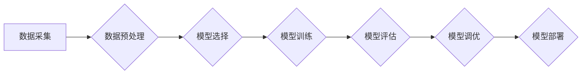

>  人工智能、机器学习、深度学习、模型训练、神经网络、梯度下降、反向传播

## 1. 背景介绍

人工智能（AI）正以惊人的速度发展，深刻地改变着我们的生活。从智能手机的语音助手到自动驾驶汽车，AI技术无处不在。 

模型训练是人工智能的核心环节，它赋予机器学习模型的能力，使其能够从数据中学习并做出预测或决策。 

本文将深入探讨人工智能模型训练的原理和实践，涵盖核心概念、算法、数学模型、代码实例以及实际应用场景。

## 2. 核心概念与联系

**2.1 核心概念**

* **机器学习（Machine Learning）:**  让计算机从数据中学习，无需明确编程，而是通过算法识别模式并做出预测。
* **深度学习（Deep Learning）:**  一种机器学习的子集，使用多层神经网络模拟人类大脑的学习过程，能够处理复杂的数据模式。
* **模型训练（Model Training）:**  使用训练数据调整模型参数，使其能够准确地预测或分类新数据。
* **损失函数（Loss Function）:**  衡量模型预测结果与真实值之间的差异，用于指导模型训练。
* **优化算法（Optimization Algorithm）:**  用于更新模型参数，最小化损失函数值。

**2.2  架构流程图**



## 3. 核心算法原理 & 具体操作步骤

### 3.1  算法原理概述

梯度下降算法是机器学习模型训练中最常用的优化算法。其核心思想是通过不断调整模型参数，逐步降低损失函数的值，从而找到最优的模型参数。

### 3.2  算法步骤详解

1. **初始化模型参数:**  随机初始化模型参数。
2. **计算损失函数值:**  使用训练数据计算模型预测结果与真实值之间的差异，即损失函数值。
3. **计算梯度:**  计算损失函数对每个模型参数的偏导数，即梯度。梯度表示参数调整的方向和幅度。
4. **更新模型参数:**  根据梯度值和学习率，更新模型参数。学习率控制了参数更新的步长。
5. **重复步骤2-4:**  重复以上步骤，直到损失函数值达到最小值或满足其他停止条件。

### 3.3  算法优缺点

**优点:**

* 算法简单易懂，易于实现。
* 能够找到局部最优解。

**缺点:**

* 容易陷入局部最优解，无法找到全局最优解。
* 学习率的选择对算法性能影响较大。

### 3.4  算法应用领域

梯度下降算法广泛应用于各种机器学习模型的训练，例如线性回归、逻辑回归、神经网络等。

## 4. 数学模型和公式 & 详细讲解 & 举例说明

### 4.1  数学模型构建

假设我们有一个线性回归模型，其目标是预测房屋价格。模型的数学表达式如下：

$$
y = w_0 + w_1 * x_1 + w_2 * x_2 + ... + w_n * x_n + \epsilon
$$

其中：

* $y$ 是房屋价格
* $w_0, w_1, w_2, ..., w_n$ 是模型参数
* $x_1, x_2, ..., x_n$ 是房屋特征
* $\epsilon$ 是误差项

### 4.2  公式推导过程

损失函数通常使用均方误差（MSE）来衡量模型预测结果与真实值之间的差异：

$$
MSE = \frac{1}{N} \sum_{i=1}^{N} (y_i - \hat{y}_i)^2
$$

其中：

* $N$ 是训练样本数量
* $y_i$ 是第 $i$ 个样本的真实值
* $\hat{y}_i$ 是模型预测的第 $i$ 个样本的值

梯度下降算法的目标是找到最小化损失函数的参数值。因此，我们需要计算损失函数对每个参数的偏导数，并根据梯度值更新参数。

### 4.3  案例分析与讲解

假设我们有一个训练数据集，包含房屋面积、房间数量等特征以及对应的房屋价格。我们可以使用梯度下降算法训练一个线性回归模型，预测新的房屋价格。

## 5. 项目实践：代码实例和详细解释说明

### 5.1  开发环境搭建

* Python 3.x
* TensorFlow 或 PyTorch 等深度学习框架

### 5.2  源代码详细实现

```python
import tensorflow as tf

# 定义模型
model = tf.keras.Sequential([
    tf.keras.layers.Dense(units=64, activation='relu', input_shape=(num_features,)),
    tf.keras.layers.Dense(units=1)
])

# 定义损失函数和优化器
model.compile(loss='mse', optimizer='adam')

# 训练模型
model.fit(X_train, y_train, epochs=100)

# 评估模型
loss = model.evaluate(X_test, y_test)
```

### 5.3  代码解读与分析

* 我们使用 TensorFlow 框架构建了一个简单的线性回归模型。
* 模型包含两层全连接神经网络层，第一层有 64 个神经元，使用 ReLU 激活函数，输入特征维度为 `num_features`。
* 第二层只有一个神经元，用于输出预测结果。
* 我们使用均方误差（MSE）作为损失函数，Adam 优化器进行模型训练。
* `model.fit()` 函数用于训练模型，`epochs` 参数指定训练轮数。
* `model.evaluate()` 函数用于评估模型性能。

### 5.4  运行结果展示

训练完成后，我们可以使用模型预测新的房屋价格。

## 6. 实际应用场景

### 6.1  图像识别

* 人脸识别
* 物体检测
* 图像分类

### 6.2  自然语言处理

* 机器翻译
* 文本摘要
* 情感分析

### 6.3  推荐系统

* 商品推荐
* 内容推荐
* 用户画像

### 6.4  未来应用展望

* 自动驾驶
* 医疗诊断
* 金融风险管理

## 7. 工具和资源推荐

### 7.1  学习资源推荐

* **书籍:**
    * 《深度学习》
    * 《机器学习实战》
* **在线课程:**
    * Coursera
    * edX
    * Udacity

### 7.2  开发工具推荐

* **Python:**  Python 是机器学习和深度学习的常用编程语言。
* **TensorFlow:**  Google 开发的开源深度学习框架。
* **PyTorch:**  Facebook 开发的开源深度学习框架。

### 7.3  相关论文推荐

* **《ImageNet Classification with Deep Convolutional Neural Networks》**
* **《Attention Is All You Need》**

## 8. 总结：未来发展趋势与挑战

### 8.1  研究成果总结

近年来，人工智能领域取得了显著进展，深度学习算法在图像识别、自然语言处理等领域取得了突破性成果。

### 8.2  未来发展趋势

* **模型规模和复杂度提升:**  更大的模型和更复杂的架构将进一步提高模型性能。
* **数据驱动的发展:**  高质量的数据将是人工智能发展的关键驱动力。
* **边缘计算和联邦学习:**  将人工智能模型部署到边缘设备和分布式数据中心，提高效率和隐私保护。

### 8.3  面临的挑战

* **数据偏差和公平性:**  人工智能模型可能受到训练数据偏差的影响，导致不公平的结果。
* **可解释性和透明度:**  深度学习模型的决策过程难以解释，缺乏透明度。
* **安全性和可靠性:**  人工智能系统可能受到攻击或故障，需要保证其安全性和可靠性。

### 8.4  研究展望

未来，人工智能研究将继续探索更强大的算法、更丰富的应用场景和更安全的解决方案，为人类社会带来更多福祉。

## 9. 附录：常见问题与解答

* **什么是过拟合？**

过拟合是指模型在训练数据上表现良好，但在测试数据上表现较差。

* **如何防止过拟合？**

可以使用正则化、数据增强、交叉验证等方法防止过拟合。

* **什么是学习率？**

学习率控制了模型参数更新的步长。

* **如何选择合适的学习率？**

可以使用学习率衰减策略或网格搜索等方法选择合适的学习率。


作者：禅与计算机程序设计艺术 / Zen and the Art of Computer Programming 
<end_of_turn>