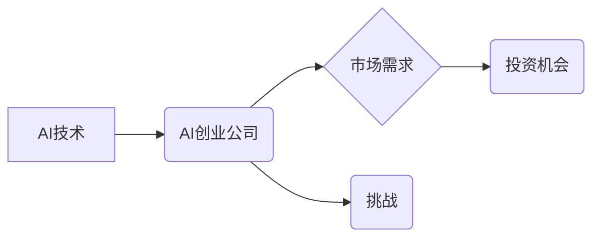

> 人工智能 (AI)
> 机器学习 (ML)
> 深度学习 (DL)
> 创业公司
> 市场前景
> 投资机会
> 挑战

## 1. 背景介绍

人工智能 (AI) 正处于爆发式发展阶段，其技术进步和应用场景的拓展正在深刻地改变着我们的生活和工作方式。从自动驾驶汽车到智能语音助手，从医疗诊断到金融风险管理，AI技术的应用范围越来越广，其带来的经济价值也日益显现。

在这个背景下，AI创业公司应运而生，它们致力于利用AI技术解决实际问题，创造新的价值。AI创业公司凭借其创新精神、技术优势和市场洞察力，正在成为科技创新和经济增长的重要引擎。

## 2. 核心概念与联系

**2.1 AI创业公司**

AI创业公司是指以人工智能技术为核心，致力于研发、推广和应用AI技术的企业。它们通常专注于特定领域，例如医疗、金融、教育、零售等，并利用AI技术提供解决方案或服务。

**2.2 市场前景**

AI市场规模正在快速增长，预计未来几年将持续保持高增长态势。根据市场调研机构的预测，全球AI市场规模将在2030年达到数万亿美元。

**2.3 投资机会**

AI创业公司吸引了大量的投资，风险投资机构和企业纷纷加大对AI领域的投资力度。AI创业公司拥有巨大的市场潜力和投资回报率，成为投资者的热门选择。

**2.4 挑战**

AI创业公司也面临着一些挑战，例如技术壁垒、人才短缺、数据安全等。

**2.5 联系图**



## 3. 核心算法原理 & 具体操作步骤

**3.1 算法原理概述**

机器学习 (ML) 是AI领域的核心技术之一，它通过算法训练模型，使模型能够从数据中学习并做出预测或决策。常见的机器学习算法包括监督学习、无监督学习和强化学习。

**3.2 算法步骤详解**

1. 数据收集和预处理：收集相关数据并进行清洗、转换和特征工程等预处理操作。
2. 模型选择：根据具体任务选择合适的机器学习算法。
3. 模型训练：使用训练数据训练模型，调整模型参数以达到最佳性能。
4. 模型评估：使用测试数据评估模型的性能，例如准确率、召回率、F1-score等。
5. 模型部署：将训练好的模型部署到实际应用场景中。

**3.3 算法优缺点**

**优点：**

* 自动化学习：无需人工编程，模型可以自动从数据中学习。
* 适应性强：可以适应不断变化的数据分布和任务需求。
* 性能优越：在某些任务上，机器学习模型可以超越人类水平。

**缺点：**

* 数据依赖：机器学习模型的性能依赖于训练数据的质量和数量。
* 可解释性差：一些机器学习模型的决策过程难以解释。
* 计算资源消耗：训练大型机器学习模型需要大量的计算资源。

**3.4 算法应用领域**

* 医疗诊断
* 金融风险管理
* 欺诈检测
* 自然语言处理
* 图像识别
* 自动驾驶

## 4. 数学模型和公式 & 详细讲解 & 举例说明

**4.1 数学模型构建**

机器学习模型通常可以看作是数学函数，其输入是数据特征，输出是预测结果或决策。例如，线性回归模型可以表示为：

$$y = w_0 + w_1x_1 + w_2x_2 + ... + w_nx_n$$

其中：

* $y$ 是预测结果
* $w_0, w_1, w_2, ..., w_n$ 是模型参数
* $x_1, x_2, ..., x_n$ 是数据特征

**4.2 公式推导过程**

机器学习模型的训练过程本质上是参数优化过程。常用的优化算法包括梯度下降法、随机梯度下降法等。这些算法通过迭代更新模型参数，使得模型的预测结果与真实值之间的误差最小化。

**4.3 案例分析与讲解**

假设我们有一个数据集，包含房屋面积和房屋价格的信息。我们想使用线性回归模型预测房屋价格。

* 数据集：

| 房屋面积 (平方米) | 房屋价格 (万元) |
|---|---|
| 60 | 100 |
| 80 | 150 |
| 100 | 200 |
| 120 | 250 |

* 模型训练：使用梯度下降法训练线性回归模型，得到模型参数 $w_0$ 和 $w_1$。
* 模型预测：使用训练好的模型预测新房屋价格。例如，如果新房屋面积为 90 平方米，则模型预测价格为：

$$y = w_0 + w_1 * 90$$

## 5. 项目实践：代码实例和详细解释说明

**5.1 开发环境搭建**

* Python 3.x
* TensorFlow 或 PyTorch 等深度学习框架
* Jupyter Notebook 或 VS Code 等开发工具

**5.2 源代码详细实现**

```python
import tensorflow as tf

# 定义模型
model = tf.keras.models.Sequential([
    tf.keras.layers.Dense(64, activation='relu', input_shape=(1,)),
    tf.keras.layers.Dense(1)
])

# 编译模型
model.compile(optimizer='adam', loss='mse')

# 训练模型
model.fit(x_train, y_train, epochs=100)

# 预测结果
predictions = model.predict(x_new)
```

**5.3 代码解读与分析**

* 代码首先定义了一个简单的线性回归模型，包含两个全连接层。
* 然后，模型被编译，指定了优化器、损失函数等参数。
* 接着，模型使用训练数据进行训练，训练过程会迭代更新模型参数。
* 最后，使用训练好的模型预测新数据。

**5.4 运行结果展示**

训练完成后，可以查看模型的训练损失和预测结果，评估模型的性能。

## 6. 实际应用场景

**6.1 医疗诊断**

AI可以帮助医生更快、更准确地诊断疾病，例如癌症、心血管疾病等。

**6.2 金融风险管理**

AI可以帮助金融机构识别欺诈交易、评估信用风险和预测市场波动。

**6.3 教育领域**

AI可以个性化学习体验，提供智能辅导和评估学生学习进度。

**6.4 未来应用展望**

AI技术的应用场景还在不断拓展，未来将应用于更多领域，例如自动驾驶、机器人、个性化推荐等。

## 7. 工具和资源推荐

**7.1 学习资源推荐**

* Coursera: 机器学习课程
* Udacity: 深度学习课程
* TensorFlow 官方文档
* PyTorch 官方文档

**7.2 开发工具推荐**

* Jupyter Notebook
* VS Code
* Google Colab

**7.3 相关论文推荐**

* 《ImageNet Classification with Deep Convolutional Neural Networks》
* 《Attention Is All You Need》
* 《BERT: Pre-training of Deep Bidirectional Transformers for Language Understanding》

## 8. 总结：未来发展趋势与挑战

**8.1 研究成果总结**

近年来，AI技术取得了长足进步，在多个领域取得了突破性进展。

**8.2 未来发展趋势**

* 模型规模和复杂度不断提升
* 算法效率和可解释性不断提高
* AI技术与其他技术融合发展

**8.3 面临的挑战**

* 数据安全和隐私保护
* 算法偏见和公平性
* 人工智能伦理问题

**8.4 研究展望**

未来，AI研究将继续探索更强大的算法、更安全的应用场景和更广泛的应用领域。

## 9. 附录：常见问题与解答

**9.1 什么是机器学习？**

机器学习是一种人工智能技术，它通过算法训练模型，使模型能够从数据中学习并做出预测或决策。

**9.2 如何选择合适的机器学习算法？**

选择合适的机器学习算法取决于具体的任务和数据特点。常见的机器学习算法包括监督学习、无监督学习和强化学习。

**9.3 如何评估机器学习模型的性能？**

常用的机器学习模型性能评估指标包括准确率、召回率、F1-score等。

**9.4 如何解决机器学习模型的过拟合问题？**

过拟合是指模型在训练数据上表现很好，但在测试数据上表现较差。解决过拟合问题的方法包括正则化、交叉验证和数据增强等。


作者：禅与计算机程序设计艺术 / Zen and the Art of Computer Programming 
<end_of_turn>