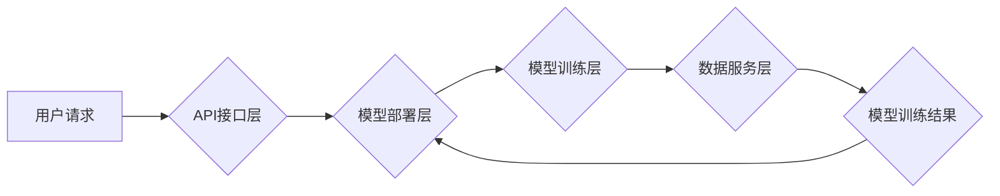

> AIaaS,人工智能,云计算,平台架构,机器学习,深度学习,数据服务

## 1. 背景介绍

人工智能(AI)技术近年来发展迅速，并开始渗透到各个行业领域。然而，AI技术的高门槛和复杂部署也阻碍了其更广泛的应用。为了降低AI技术的使用门槛，并促进AI技术的普及和应用，AI即服务(AIaaS)平台应运而生。

AIaaS平台是指将人工智能技术作为服务提供给用户的云计算平台。用户无需了解复杂的AI算法和模型，只需通过API接口即可调用AI服务，实现对数据的分析、预测和决策等功能。

AIaaS平台的出现，为企业和个人提供了以下优势：

* **降低技术门槛:** 用户无需具备专业的AI技术知识和经验，即可使用AI服务。
* **降低成本:** 用户无需购买和维护昂贵的AI硬件和软件，只需按需付费使用AI服务。
* **提高效率:** 用户可以快速集成AI服务到自己的应用中，提高工作效率。
* **促进创新:** AIaaS平台提供了丰富的AI算法和模型，可以帮助用户快速开发和测试新的AI应用。

## 2. 核心概念与联系

**2.1 AIaaS平台架构**

AIaaS平台通常由以下几个核心组件组成：

* **数据服务层:** 提供数据存储、管理和处理服务。
* **模型训练层:** 提供机器学习和深度学习模型训练服务。
* **模型部署层:** 提供模型部署和调优服务。
* **API接口层:** 提供用户调用AI服务的接口。

**2.2 AIaaS平台与云计算的关系**

AIaaS平台是基于云计算技术的，它利用云计算平台的弹性、可扩展性和高可用性，为用户提供高效、可靠的AI服务。

**2.3 AIaaS平台与机器学习的关系**

机器学习是AI的核心技术之一，AIaaS平台提供各种机器学习算法和模型，用户可以根据自己的需求选择合适的算法和模型进行应用。

**2.4 AIaaS平台与深度学习的关系**

深度学习是机器学习的一个子集，它利用多层神经网络进行数据学习和分析。AIaaS平台提供深度学习框架和工具，用户可以利用这些工具进行深度学习模型的训练和应用。

**Mermaid 流程图**



## 3. 核心算法原理 & 具体操作步骤

**3.1 算法原理概述**

AIaaS平台的核心算法原理主要包括机器学习和深度学习。

* **机器学习:** 机器学习是一种人工智能技术，它通过算法学习数据中的模式和规律，从而进行预测和决策。常见的机器学习算法包括线性回归、逻辑回归、决策树、支持向量机等。

* **深度学习:** 深度学习是机器学习的一个子集，它利用多层神经网络进行数据学习和分析。深度学习算法能够学习更复杂的模式和特征，从而实现更准确的预测和决策。常见的深度学习算法包括卷积神经网络(CNN)、循环神经网络(RNN)等。

**3.2 算法步骤详解**

AIaaS平台的算法步骤可以概括为以下几个阶段：

1. **数据收集和预处理:** 收集相关数据，并进行清洗、转换和特征工程等预处理操作。
2. **模型选择和训练:** 根据业务需求选择合适的机器学习或深度学习算法，并进行模型训练。
3. **模型评估和调优:** 对训练好的模型进行评估，并根据评估结果进行模型调优。
4. **模型部署和服务:** 将训练好的模型部署到AIaaS平台，并提供API接口供用户调用。

**3.3 算法优缺点**

* **机器学习算法:**
    * **优点:** 算法相对简单，易于理解和实现。
    * **缺点:** 对于复杂的数据模式，学习能力有限。
* **深度学习算法:**
    * **优点:** 学习能力强，能够学习更复杂的模式和特征。
    * **缺点:** 算法复杂，训练时间长，对数据需求量大。

**3.4 算法应用领域**

AIaaS平台的算法应用领域非常广泛，包括：

* **自然语言处理:** 文本分类、情感分析、机器翻译等。
* **计算机视觉:** 图像识别、物体检测、图像分割等。
* **语音识别:** 语音转文本、语音合成等。
* **推荐系统:** 商品推荐、内容推荐等。
* **预测分析:** 销售预测、风险预测等。

## 4. 数学模型和公式 & 详细讲解 & 举例说明

**4.1 数学模型构建**

机器学习算法通常基于数学模型进行构建。例如，线性回归模型的数学模型可以表示为：

$$y = w_0 + w_1x_1 + w_2x_2 + ... + w_nx_n + \epsilon$$

其中：

* $y$ 是预测值
* $w_0, w_1, w_2, ..., w_n$ 是模型参数
* $x_1, x_2, ..., x_n$ 是输入特征
* $\epsilon$ 是误差项

**4.2 公式推导过程**

机器学习算法的训练过程通常是通过优化模型参数来最小化模型误差。常用的优化算法包括梯度下降法、随机梯度下降法等。

**4.3 案例分析与讲解**

例如，在使用线性回归模型进行房价预测时，我们可以将房屋面积、房间数量等特征作为输入特征，并将房价作为预测值。通过训练模型，我们可以得到模型参数，并利用这些参数对新的房屋进行预测。

## 5. 项目实践：代码实例和详细解释说明

**5.1 开发环境搭建**

AIaaS平台的开发环境通常包括以下软件：

* **操作系统:** Linux、Windows等
* **编程语言:** Python、Java等
* **机器学习框架:** TensorFlow、PyTorch等
* **云计算平台:** AWS、Azure、GCP等

**5.2 源代码详细实现**

以下是一个使用Python和TensorFlow实现简单的线性回归模型的代码示例：

```python
import tensorflow as tf

# 定义模型
model = tf.keras.models.Sequential([
    tf.keras.layers.Dense(units=1, input_shape=[1])
])

# 编译模型
model.compile(optimizer='sgd', loss='mean_squared_error')

# 训练模型
model.fit(x_train, y_train, epochs=100)

# 预测
predictions = model.predict(x_test)
```

**5.3 代码解读与分析**

* `tf.keras.models.Sequential()` 创建一个顺序模型，即层级结构的模型。
* `tf.keras.layers.Dense()` 创建一个全连接层，输入特征维度为1，输出维度为1。
* `model.compile()` 编译模型，指定优化器、损失函数等参数。
* `model.fit()` 训练模型，输入训练数据和训练轮数。
* `model.predict()` 使用训练好的模型对测试数据进行预测。

**5.4 运行结果展示**

训练完成后，我们可以通过评估指标（例如均方误差）来评估模型的性能。

## 6. 实际应用场景

AIaaS平台在各个行业领域都有广泛的应用场景：

* **医疗保健:** 疾病诊断、药物研发、患者画像等。
* **金融服务:** 风险评估、欺诈检测、客户服务等。
* **零售业:** 商品推荐、库存管理、个性化营销等。
* **制造业:** 质量控制、设备预测维护、生产优化等。

**6.4 未来应用展望**

随着AI技术的不断发展，AIaaS平台的应用场景将会更加广泛，例如：

* **智能家居:** 通过AI技术实现家居自动化、智能控制等功能。
* **自动驾驶:** 利用AI技术实现车辆自动驾驶功能。
* **个性化教育:** 根据学生的学习情况提供个性化的学习方案。

## 7. 工具和资源推荐

**7.1 学习资源推荐**

* **在线课程:** Coursera、edX、Udacity等平台提供丰富的AI课程。
* **书籍:** 《深度学习》、《机器学习实战》等书籍。
* **博客和论坛:** Kaggle、Towards Data Science等平台提供AI相关的博客和论坛。

**7.2 开发工具推荐**

* **机器学习框架:** TensorFlow、PyTorch、Scikit-learn等。
* **云计算平台:** AWS、Azure、GCP等。
* **数据可视化工具:** Tableau、Power BI等。

**7.3 相关论文推荐**

* **深度学习论文:** 《ImageNet Classification with Deep Convolutional Neural Networks》
* **机器学习论文:** 《Support Vector Machines》

## 8. 总结：未来发展趋势与挑战

**8.1 研究成果总结**

AIaaS平台的发展取得了显著成果，为AI技术的普及和应用提供了重要支撑。

**8.2 未来发展趋势**

* **模型自动化:** 自动化模型训练、调优和部署流程。
* **边缘计算:** 将AI模型部署到边缘设备，实现更低延迟和更高效率的AI应用。
* **联邦学习:** 在不共享原始数据的情况下，实现模型训练和更新。

**8.3 面临的挑战**

* **数据安全和隐私保护:** AIaaS平台需要确保用户数据的安全和隐私。
* **算法可解释性:** AI模型的决策过程往往难以理解，需要提高算法的可解释性。
* **公平性和偏见:** AI模型可能存在公平性和偏见问题，需要进行相应的检测和修正。

**8.4 研究展望**

未来，AIaaS平台的研究将继续朝着更自动化、更安全、更公平的方向发展。


## 9. 附录：常见问题与解答

**9.1 如何选择合适的AIaaS平台？**

选择AIaaS平台时，需要考虑以下因素：

* **平台功能:** 平台提供的AI算法和模型是否满足您的需求。
* **平台性能:** 平台的计算能力、存储容量和网络带宽是否满足您的需求。
* **平台价格:** 平台的收费模式和价格是否符合您的预算。
* **平台安全性:** 平台是否提供足够的安全性保障，例如数据加密和访问控制。

**9.2 如何使用AIaaS平台？**

使用AIaaS平台通常需要以下步骤：

1. 注册账号并选择合适的套餐。
2. 上传您的数据并进行预处理。
3. 选择合适的AI算法和模型。
4. 训练模型并进行评估。
5. 部署模型并调用API接口。

**9.3 AIaaS平台的未来发展趋势是什么？**

AIaaS平台的未来发展趋势包括：

* 模型自动化
* 边缘计算
* 联邦学习


作者：禅与计算机程序设计艺术 / Zen and the Art of Computer Programming 
<end_of_turn>