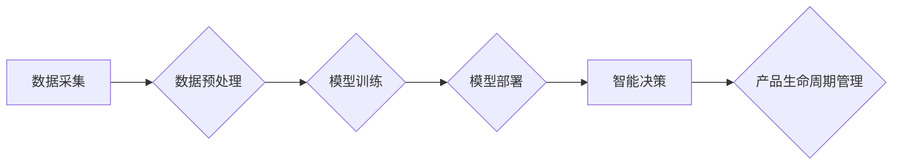

> AI, 产品生命周期管理, 机器学习, 深度学习, 自然语言处理, 预见性分析, 自动化, 优化

## 1. 背景介绍

在当今数字化时代，产品生命周期管理 (PLM) 已经成为企业核心竞争力的关键因素。传统PLM方法依赖于人工干预和经验积累，效率低下，难以应对快速变化的市场需求和技术迭代。而人工智能 (AI) 作为一种新兴技术，凭借其强大的数据处理能力和学习能力，为PLM带来了革命性的变革。

AI在PLM领域的应用，旨在通过智能化手段，提高产品开发效率、降低成本、提升产品质量和用户体验。从产品设计、开发、生产到销售和售后服务，AI技术可以渗透到产品生命周期的各个环节，赋予PLM系统更强的智能化和自动化能力。

## 2. 核心概念与联系

**2.1 产品生命周期管理 (PLM)**

PLM是指从产品概念到最终报废的全生命周期，对产品信息进行管理和控制的系统化过程。它涵盖了产品设计、开发、生产、销售、服务等各个环节，旨在实现产品信息的一致性和可追溯性，提高产品开发效率和市场竞争力。

**2.2 人工智能 (AI)**

AI是指模拟人类智能行为的计算机系统。它通过学习和分析大量数据，能够识别模式、做出决策、解决问题，并不断提升自身的能力。AI技术主要包括机器学习、深度学习、自然语言处理等。

**2.3 AI在PLM中的应用**

AI技术可以应用于PLM的各个环节，例如：

* **产品设计:** 利用AI算法进行产品结构优化、功能设计和外观设计，提高产品性能和美观度。
* **产品开发:** 利用AI加速产品开发流程，预测潜在问题，优化生产计划，降低开发成本。
* **生产制造:** 利用AI实现智能制造，优化生产流程，提高生产效率和产品质量。
* **销售服务:** 利用AI提供个性化产品推荐、智能客服和售后服务，提升用户体验。

**2.4 AI在PLM中的架构**



## 3. 核心算法原理 & 具体操作步骤

**3.1 算法原理概述**

AI在PLM中的应用主要依赖于以下核心算法：

* **机器学习 (ML):** 通过训练模型，从数据中学习规律，进行预测和分类。
* **深度学习 (DL):** 基于多层神经网络，能够处理更复杂的数据，实现更精准的预测和识别。
* **自然语言处理 (NLP):** 能够理解和处理自然语言文本，用于分析用户需求、产品评论等。

**3.2 算法步骤详解**

1. **数据采集:** 从各种数据源收集相关产品信息，例如设计图纸、生产数据、用户反馈等。
2. **数据预处理:** 对收集到的数据进行清洗、转换和格式化，使其适合模型训练。
3. **模型训练:** 选择合适的算法模型，利用训练数据训练模型，使其能够学习产品生命周期中的规律和模式。
4. **模型评估:** 对训练好的模型进行评估，测试其预测准确率和性能，并进行调整优化。
5. **模型部署:** 将训练好的模型部署到生产环境中，用于实际应用。

**3.3 算法优缺点**

* **优点:** 能够自动学习和分析数据，提高效率和准确性，并不断优化自身性能。
* **缺点:** 需要大量的数据进行训练，模型训练过程复杂，且对数据质量要求较高。

**3.4 算法应用领域**

* **产品设计优化:** 利用AI算法优化产品结构、功能和外观设计，提高产品性能和美观度。
* **产品开发预测:** 利用AI预测产品开发周期、成本和风险，帮助企业制定更合理的开发计划。
* **生产制造智能化:** 利用AI实现智能制造，优化生产流程，提高生产效率和产品质量。
* **用户需求分析:** 利用NLP技术分析用户反馈和评论，了解用户需求和痛点，为产品改进提供参考。

## 4. 数学模型和公式 & 详细讲解 & 举例说明

**4.1 数学模型构建**

在AI驱动的PLM中，常用的数学模型包括：

* **回归模型:** 用于预测连续型变量，例如产品开发周期、生产成本等。
* **分类模型:** 用于分类离散型变量，例如产品质量等级、用户满意度等。
* **聚类模型:** 用于将数据点分组，例如用户群体划分、产品相似度分析等。

**4.2 公式推导过程**

例如，使用线性回归模型预测产品开发周期，其数学公式如下：

$$
y = \beta_0 + \beta_1 x_1 + \beta_2 x_2 + ... + \beta_n x_n + \epsilon
$$

其中：

* $y$ 是预测的目标变量，例如产品开发周期。
* $x_1, x_2, ..., x_n$ 是输入特征变量，例如产品复杂度、团队规模等。
* $\beta_0, \beta_1, ..., \beta_n$ 是模型参数，需要通过训练数据进行估计。
* $\epsilon$ 是误差项。

**4.3 案例分析与讲解**

假设我们想要预测一款产品的开发周期，收集了以下数据：

| 产品复杂度 | 团队规模 | 开发周期 |
|---|---|---|
| 1 | 5 | 6个月 |
| 2 | 10 | 8个月 |
| 3 | 15 | 10个月 |

我们可以使用线性回归模型训练一个预测模型，并根据模型预测，例如对于一个复杂度为2，团队规模为8的产品，其开发周期可能为9个月。

## 5. 项目实践：代码实例和详细解释说明

**5.1 开发环境搭建**

* Python 3.x
* TensorFlow 或 PyTorch 深度学习框架
* Scikit-learn 机器学习库
* Jupyter Notebook 开发环境

**5.2 源代码详细实现**

```python
# 导入必要的库
import pandas as pd
from sklearn.linear_model import LinearRegression

# 加载数据
data = pd.read_csv('product_data.csv')

# 选择特征变量和目标变量
X = data[['产品复杂度', '团队规模']]
y = data['开发周期']

# 创建线性回归模型
model = LinearRegression()

# 训练模型
model.fit(X, y)

# 预测开发周期
new_data = pd.DataFrame({'产品复杂度': [2], '团队规模': [8]})
predicted_cycle = model.predict(new_data)

# 打印预测结果
print(f'预测开发周期: {predicted_cycle[0]} 个月')
```

**5.3 代码解读与分析**

* 首先，导入必要的库，并加载数据。
* 然后，选择特征变量和目标变量，并创建线性回归模型。
* 接着，训练模型，并使用训练好的模型预测新的数据。
* 最后，打印预测结果。

**5.4 运行结果展示**

运行上述代码，可以得到预测开发周期的结果，例如：

```
预测开发周期: 9.0 个月
```

## 6. 实际应用场景

**6.1 产品设计优化**

利用AI算法分析用户需求和市场趋势，优化产品外观设计、功能设计和结构设计，提高产品美观度、性能和用户体验。

**6.2 产品开发预测**

利用AI预测产品开发周期、成本和风险，帮助企业制定更合理的开发计划，并及时调整开发策略。

**6.3 生产制造智能化**

利用AI实现智能制造，优化生产流程，提高生产效率和产品质量，并降低生产成本。

**6.4 用户需求分析**

利用NLP技术分析用户反馈和评论，了解用户需求和痛点，为产品改进提供参考，并提高用户满意度。

**6.5 未来应用展望**

随着AI技术的不断发展，其在PLM领域的应用将更加广泛和深入，例如：

* **个性化产品定制:** 利用AI技术实现个性化产品定制，满足用户多样化的需求。
* **预测性维护:** 利用AI预测产品故障，实现提前维护，降低产品故障率和维修成本。
* **供应链优化:** 利用AI优化供应链管理，提高供应链效率和可靠性。

## 7. 工具和资源推荐

**7.1 学习资源推荐**

* **在线课程:** Coursera, edX, Udemy 等平台提供丰富的AI和PLM相关课程。
* **书籍:** 《深度学习》、《机器学习实战》、《产品生命周期管理》等书籍。
* **博客和论坛:** 关注AI和PLM领域的博客和论坛，获取最新资讯和技术分享。

**7.2 开发工具推荐**

* **Python:** 作为AI开发的常用语言，Python拥有丰富的库和工具，例如TensorFlow, PyTorch, Scikit-learn等。
* **Jupyter Notebook:** 用于代码编写、数据分析和可视化。
* **PLM软件:** SAP PLM, Oracle PLM, Siemens Teamcenter 等。

**7.3 相关论文推荐**

* **AI in Product Lifecycle Management: A Systematic Literature Review**
* **Deep Learning for Product Design Optimization**
* **Predictive Maintenance in Manufacturing Using Machine Learning**

## 8. 总结：未来发展趋势与挑战

**8.1 研究成果总结**

AI在PLM领域的应用取得了显著成果，例如提高了产品开发效率、降低了成本、提升了产品质量和用户体验。

**8.2 未来发展趋势**

* **更强大的AI算法:** 随着AI技术的不断发展，将出现更强大的AI算法，能够处理更复杂的数据，实现更精准的预测和识别。
* **更广泛的应用场景:** AI将应用于PLM的更多环节，例如个性化产品定制、预测性维护、供应链优化等。
* **更智能的PLM系统:** AI将赋予PLM系统更强的智能化和自动化能力，实现更智能的决策和管理。

**8.3 面临的挑战**

* **数据质量问题:** AI算法对数据质量要求较高，需要确保数据准确、完整和一致。
* **模型解释性问题:** 一些AI算法的决策过程难以解释，这可能会导致用户对模型结果缺乏信任。
* **伦理问题:** AI技术的应用可能会带来一些伦理问题，例如数据隐私、算法偏见等，需要引起重视和解决。

**8.4 研究展望**

未来，需要继续加强AI在PLM领域的应用研究，解决上述挑战，并探索AI技术的更多应用场景，推动PLM领域的发展。

## 9. 附录：常见问题与解答

**9.1 如何选择合适的AI算法？**

选择合适的AI算法需要根据具体应用场景和数据特点进行选择。例如，对于预测连续型变量，可以使用回归模型；对于分类离散型变量，可以使用分类模型。

**9.2 如何保证数据质量？**

数据质量是AI算法训练的关键因素，需要采取以下措施保证数据质量：

* 数据清洗：去除数据中的噪声、重复数据和缺失值。
* 数据转换：将数据转换为适合模型训练的格式。
* 数据标准化：将数据进行标准化处理，使其分布在同一范围内。

**9.3 如何解释AI模型的决策结果？**

一些AI算法的决策过程难以解释，可以使用以下方法进行解释：

* **特征重要性分析:** 分析哪些特征对模型决策的影响最大。
* **局部解释:** 对单个预测结果进行解释，分析模型是如何做出该预测的。
* **可解释模型:** 使用可解释的模型，例如决策树、规则模型等。


作者：禅与计算机程序设计艺术 / Zen and the Art of Computer Programming 
<end_of_turn>