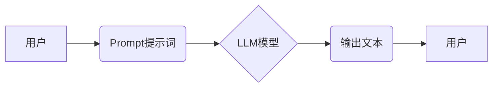

> AI大模型,Prompt提示词,最佳实践,话题理解,测试理解,自然语言处理,机器学习

## 1. 背景介绍

近年来，大规模语言模型（LLM）的快速发展，如GPT-3、LaMDA、BERT等，为自然语言处理（NLP）领域带来了革命性的变革。这些模型展现出惊人的文本生成、翻译、摘要和问答能力，但其性能很大程度上依赖于精心设计的Prompt提示词。

Prompt提示词是与LLM交互的关键，它引导模型理解用户意图并生成相应的输出。一个好的Prompt提示词能够有效地提高模型的准确率、流畅度和相关性。然而，设计高质量的Prompt提示词并非易事，它需要对模型的特性、任务需求和语言表达方式有深入的理解。

## 2. 核心概念与联系

**2.1  Prompt提示词**

Prompt提示词是指用户向LLM输入的文本指令或问题，它为模型提供上下文信息和任务目标，引导模型生成相应的输出。

**2.2  LLM模型**

LLM模型是一种基于深度学习的强大神经网络，能够学习和理解复杂的语言模式。它们通过训练大量的文本数据，学习语言的语法、语义和上下文关系。

**2.3  自然语言处理（NLP）**

NLP是计算机科学的一个分支，致力于使计算机能够理解、处理和生成人类语言。

**2.4  关系图**



## 3. 核心算法原理 & 具体操作步骤

**3.1  算法原理概述**

LLM模型通常基于Transformer架构，它利用自注意力机制学习文本序列之间的长距离依赖关系。

**3.2  算法步骤详解**

1. **词嵌入:** 将输入的文本序列转换为向量表示，每个词对应一个向量。
2. **自注意力:** 计算每个词与其他词之间的注意力权重，学习词之间的关系。
3. **前馈神经网络:** 对每个词的注意力加权向量进行处理，提取特征。
4. **输出层:** 生成预测的下一个词的概率分布。

**3.3  算法优缺点**

**优点:**

* 能够学习复杂的语言模式
* 具有强大的文本生成能力
* 可以处理长文本序列

**缺点:**

* 计算量大，训练成本高
* 容易受到训练数据偏差的影响
* 缺乏对真实世界知识的理解

**3.4  算法应用领域**

* 文本生成
* 机器翻译
* 文本摘要
* 问答系统
* 代码生成

## 4. 数学模型和公式 & 详细讲解 & 举例说明

**4.1  数学模型构建**

LLM模型的数学模型基于概率论和统计学，其核心是学习文本序列的概率分布。

**4.2  公式推导过程**

* **词嵌入:** 使用词向量模型，例如Word2Vec或GloVe，将词映射到低维向量空间。
* **自注意力:** 使用注意力机制计算每个词与其他词之间的权重，公式如下：

$$
\text{Attention}(Q, K, V) = \text{softmax}\left(\frac{Q K^T}{\sqrt{d_k}}\right) V
$$

其中，Q、K、V分别代表查询矩阵、键矩阵和值矩阵，$d_k$是键向量的维度。

* **前馈神经网络:** 使用多层感知机（MLP）对每个词的注意力加权向量进行处理。

**4.3  案例分析与讲解**

假设我们有一个文本序列“The cat sat on the mat”，使用自注意力机制计算每个词与其他词之间的注意力权重，可以得到以下结果：

* “The”与“cat”的注意力权重较高，因为它们是主语和谓语的关系。
* “sat”与“on”和“mat”的注意力权重较高，因为它们是动词和宾语的关系。

## 5. 项目实践：代码实例和详细解释说明

**5.1  开发环境搭建**

使用Python语言和相关的深度学习框架，例如TensorFlow或PyTorch，搭建开发环境。

**5.2  源代码详细实现**

```python
import tensorflow as tf

# 定义词嵌入层
embedding_layer = tf.keras.layers.Embedding(input_dim=vocab_size, output_dim=embedding_dim)

# 定义自注意力层
attention_layer = tf.keras.layers.MultiHeadAttention(num_heads=8, key_dim=embedding_dim)

# 定义前馈神经网络层
ffn_layer = tf.keras.layers.Dense(units=embedding_dim, activation="relu")

# 定义Transformer编码器层
encoder_layer = tf.keras.layers.Layer(
    [embedding_layer, attention_layer, ffn_layer]
)

# 定义Transformer模型
model = tf.keras.Sequential([encoder_layer])
```

**5.3  代码解读与分析**

* 词嵌入层将词映射到低维向量空间。
* 自注意力层计算每个词与其他词之间的注意力权重。
* 前馈神经网络层对每个词的注意力加权向量进行处理。
* Transformer编码器层将上述三个层组合在一起。
* Transformer模型将编码器层作为其核心结构。

**5.4  运行结果展示**

使用训练好的模型对文本序列进行编码，可以得到每个词的隐藏状态向量，这些向量可以用于后续的任务，例如文本生成、文本分类等。

## 6. 实际应用场景

**6.1  文本生成**

LLM模型可以用于生成各种类型的文本，例如小说、诗歌、新闻报道等。

**6.2  机器翻译**

LLM模型可以用于将文本从一种语言翻译成另一种语言。

**6.3  文本摘要**

LLM模型可以用于生成文本的简短摘要。

**6.4  问答系统**

LLM模型可以用于构建问答系统，回答用户的自然语言问题。

**6.5  未来应用展望**

LLM模型在未来将有更广泛的应用场景，例如：

* 个性化教育
* 智能客服
* 代码生成
* 药物研发

## 7. 工具和资源推荐

**7.1  学习资源推荐**

* **书籍:**
    * 《深度学习》
    * 《自然语言处理》
* **在线课程:**
    * Coursera
    * edX
* **博客:**
    * The Gradient
    * Towards Data Science

**7.2  开发工具推荐**

* **深度学习框架:** TensorFlow, PyTorch
* **文本处理库:** NLTK, SpaCy
* **云平台:** Google Cloud AI Platform, AWS SageMaker

**7.3  相关论文推荐**

* 《Attention Is All You Need》
* 《BERT: Pre-training of Deep Bidirectional Transformers for Language Understanding》
* 《GPT-3: Language Models are Few-Shot Learners》

## 8. 总结：未来发展趋势与挑战

**8.1  研究成果总结**

近年来，LLM模型取得了显著的进展，在文本生成、机器翻译、文本摘要等任务上表现出色。

**8.2  未来发展趋势**

* 模型规模进一步扩大
* 训练数据质量提升
* 算法架构创新
* 多模态学习

**8.3  面临的挑战**

* 计算资源需求高
* 训练数据偏差问题
* 缺乏对真实世界知识的理解
* 伦理和安全问题

**8.4  研究展望**

未来研究将重点关注解决上述挑战，开发更安全、更可靠、更智能的LLM模型。

## 9. 附录：常见问题与解答

**9.1  什么是Prompt提示词？**

Prompt提示词是指用户向LLM模型输入的文本指令或问题，它为模型提供上下文信息和任务目标。

**9.2  如何设计高质量的Prompt提示词？**

设计高质量的Prompt提示词需要考虑以下因素：

* 清晰明确的任务目标
* 提供足够的上下文信息
* 使用自然语言表达
* 避免歧义和误解

**9.3  LLM模型有哪些应用场景？**

LLM模型的应用场景非常广泛，例如文本生成、机器翻译、文本摘要、问答系统、代码生成等。

**9.4  LLM模型有哪些局限性？**

LLM模型的局限性包括：

* 计算资源需求高
* 训练数据偏差问题
* 缺乏对真实世界知识的理解
* 伦理和安全问题


作者：禅与计算机程序设计艺术 / Zen and the Art of Computer Programming 
<end_of_turn>