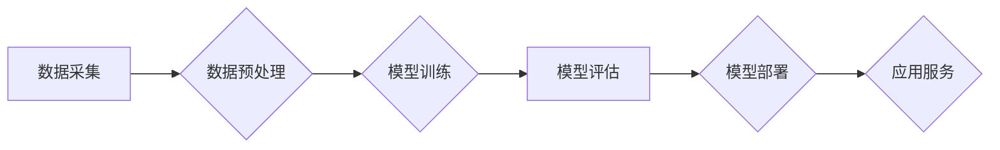

> AI大模型，创业，趋势，展望，应用场景，技术挑战，未来发展

## 1. 背景介绍

近年来，人工智能（AI）技术取得了飞速发展，特别是深度学习技术的突破，催生了一系列强大的AI大模型。这些模型在自然语言处理、计算机视觉、语音识别等领域展现出惊人的能力，引发了广泛的关注和热议。

AI大模型的出现为创业者带来了新的机遇，同时也带来了新的挑战。一方面，AI大模型的强大能力可以应用于各种行业，创造出全新的商业模式和价值。另一方面，AI大模型的开发和应用需要大量的计算资源和技术人才，创业者需要克服技术门槛和商业模式难题。

本文将从多个角度探讨AI大模型创业的现状、趋势和挑战，帮助创业者更好地理解这个领域，并为他们的创业之路提供一些参考。

## 2. 核心概念与联系

**2.1 AI大模型的概念**

AI大模型是指在海量数据上训练，拥有庞大参数规模的深度学习模型。这些模型通常具有以下特点：

* **规模庞大:** 参数数量通常在数十亿甚至数万亿级别。
* **泛化能力强:** 能够在多种任务上表现出色，例如文本生成、图像识别、机器翻译等。
* **可迁移性高:** 可以将模型微调到特定任务，无需从头训练。

**2.2 AI大模型的架构**

AI大模型的架构通常基于Transformer网络，例如GPT-3、BERT、LaMDA等。Transformer网络通过自注意力机制，能够捕捉文本序列中的长距离依赖关系，从而实现更准确的理解和生成。

**2.3 AI大模型的训练**

AI大模型的训练需要海量数据和强大的计算资源。通常采用分布式训练的方式，将模型参数分布在多个机器上进行并行训练。

**2.4 AI大模型的应用**

AI大模型在各个领域都有广泛的应用，例如：

* **自然语言处理:** 文本生成、机器翻译、问答系统、情感分析等。
* **计算机视觉:** 图像识别、物体检测、图像生成等。
* **语音识别:** 语音转文本、语音合成等。
* **其他领域:** 药物研发、金融分析、科学研究等。

**Mermaid 流程图**



## 3. 核心算法原理 & 具体操作步骤

### 3.1  算法原理概述

Transformer网络是AI大模型的核心算法，其主要特点是利用自注意力机制，能够捕捉文本序列中的长距离依赖关系。

**3.1.1 自注意力机制**

自注意力机制允许模型关注输入序列中的不同位置，并计算每个位置之间的相关性。通过计算每个位置的权重，模型可以更好地理解文本的语义关系。

**3.1.2 多头注意力**

多头注意力机制是自注意力机制的扩展，它使用多个注意力头来捕捉不同类型的语义信息。每个注意力头关注不同的方面，并将其结果融合起来，从而提高模型的理解能力。

**3.1.3 位置编码**

由于Transformer网络没有循环结构，无法捕捉文本序列中的顺序信息。因此，需要使用位置编码来为每个词语添加位置信息。

### 3.2  算法步骤详解

1. **输入嵌入:** 将输入文本序列中的每个词语转换为向量表示。
2. **位置编码:** 为每个词语添加位置信息。
3. **多头注意力:** 使用多头注意力机制计算每个词语与其他词语之间的相关性。
4. **前馈网络:** 对每个词语的注意力输出进行非线性变换。
5. **输出层:** 将模型的输出转换为目标语言的词语序列。

### 3.3  算法优缺点

**优点:**

* 能够捕捉长距离依赖关系。
* 泛化能力强，可迁移性高。
* 在多个任务上表现出色。

**缺点:**

* 训练成本高，需要大量的计算资源和数据。
* 模型参数量大，部署成本高。
* 容易受到训练数据质量的影响。

### 3.4  算法应用领域

Transformer网络及其变体在自然语言处理、计算机视觉、语音识别等多个领域都有广泛的应用。

## 4. 数学模型和公式 & 详细讲解 & 举例说明

### 4.1  数学模型构建

Transformer网络的数学模型主要包括以下几个部分：

* **嵌入层:** 将词语转换为向量表示。
* **多头注意力层:** 计算每个词语与其他词语之间的相关性。
* **前馈网络:** 对每个词语的注意力输出进行非线性变换。
* **位置编码层:** 为每个词语添加位置信息。

### 4.2  公式推导过程

**4.2.1 自注意力机制公式**

```latex
Attention(Q, K, V) = softmax(Q K^T / \sqrt{d_k}) V
```

其中：

* Q: 查询矩阵
* K: 键矩阵
* V: 值矩阵
* $d_k$: 键向量的维度

**4.2.2 多头注意力机制公式**

```latex
MultiHeadAttention(Q, K, V) = Concat(head_1, head_2, ..., head_h) W^O
```

其中：

* head_1, head_2, ..., head_h: h个注意力头的输出
* W^O: 输出权重矩阵

### 4.3  案例分析与讲解

**4.3.1 文本生成**

GPT-3是一个基于Transformer网络的文本生成模型，它能够生成流畅、连贯的文本。例如，给定一个开头，GPT-3可以生成后续的文本内容。

**4.3.2 机器翻译**

BERT是一个基于Transformer网络的机器翻译模型，它能够将文本从一种语言翻译成另一种语言。例如，BERT可以将英文文本翻译成中文文本。

## 5. 项目实践：代码实例和详细解释说明

### 5.1  开发环境搭建

* Python 3.7+
* TensorFlow/PyTorch
* CUDA/cuDNN

### 5.2  源代码详细实现

```python
# 导入必要的库
import tensorflow as tf

# 定义Transformer网络的结构
class Transformer(tf.keras.Model):
    def __init__(self, vocab_size, embedding_dim, num_heads, num_layers):
        super(Transformer, self).__init__()
        self.embedding = tf.keras.layers.Embedding(vocab_size, embedding_dim)
        self.transformer_layers = [
            tf.keras.layers.MultiHeadAttention(num_heads=num_heads, key_dim=embedding_dim)
            for _ in range(num_layers)
        ]
        self.dense = tf.keras.layers.Dense(vocab_size)

    def call(self, inputs):
        # 嵌入词向量
        embedded = self.embedding(inputs)
        # 多层Transformer结构
        for layer in self.transformer_layers:
            embedded = layer(embedded)
        # 全连接层输出
        output = self.dense(embedded)
        return output

# 实例化Transformer模型
model = Transformer(vocab_size=10000, embedding_dim=512, num_heads=8, num_layers=6)

# 训练模型
model.compile(optimizer='adam', loss='sparse_categorical_crossentropy', metrics=['accuracy'])
model.fit(x_train, y_train, epochs=10)

```

### 5.3  代码解读与分析

* **嵌入层:** 将词语转换为向量表示。
* **多头注意力层:** 计算每个词语与其他词语之间的相关性。
* **前馈网络:** 对每个词语的注意力输出进行非线性变换。
* **位置编码层:** 为每个词语添加位置信息。

### 5.4  运行结果展示

训练完成后，模型可以用于文本生成、机器翻译等任务。

## 6. 实际应用场景

### 6.1  自然语言处理

* **聊天机器人:** AI大模型可以用于构建更智能、更自然的聊天机器人，能够理解用户的意图并提供更准确的回复。
* **文本摘要:** AI大模型可以自动生成文本摘要，提取文本的关键信息。
* **机器翻译:** AI大模型可以实现更高质量的机器翻译，突破语言障碍。

### 6.2  计算机视觉

* **图像识别:** AI大模型可以识别图像中的物体、场景和人物。
* **图像生成:** AI大模型可以生成逼真的图像，例如人脸、风景、物体等。
* **视频分析:** AI大模型可以分析视频内容，例如识别动作、跟踪物体、理解场景等。

### 6.3  语音识别

* **语音转文本:** AI大模型可以将语音转换为文本，例如语音助手、会议记录等。
* **语音合成:** AI大模型可以将文本转换为语音，例如语音播报、虚拟助手等。

### 6.4  未来应用展望

AI大模型的应用场景还在不断扩展，未来将应用于更多领域，例如：

* **医疗保健:** 辅助诊断、预测疾病、个性化治疗等。
* **教育:** 智能辅导、个性化学习、自动批改作业等。
* **金融:** 风险评估、欺诈检测、投资决策等。

## 7. 工具和资源推荐

### 7.1  学习资源推荐

* **书籍:**
    * 《深度学习》
    * 《自然语言处理》
    * 《计算机视觉》
* **在线课程:**
    * Coursera
    * edX
    * Udacity

### 7.2  开发工具推荐

* **TensorFlow:** 开源深度学习框架
* **PyTorch:** 开源深度学习框架
* **HuggingFace:** 提供预训练模型和工具

### 7.3  相关论文推荐

* **Attention Is All You Need:** https://arxiv.org/abs/1706.03762
* **BERT: Pre-training of Deep Bidirectional Transformers for Language Understanding:** https://arxiv.org/abs/1810.04805
* **GPT-3: Language Models are Few-Shot Learners:** https://arxiv.org/abs/2005.14165

## 8. 总结：未来发展趋势与挑战

### 8.1  研究成果总结

近年来，AI大模型取得了显著的进展，在多个领域展现出强大的能力。

### 8.2  未来发展趋势

* **模型规模继续扩大:** 模型参数规模将继续增长，从而提升模型的性能。
* **多模态学习:** AI大模型将融合文本、图像、音频等多种模态数据，实现更全面的理解和生成。
* **可解释性增强:** 研究者将致力于提高AI大模型的可解释性，使其决策过程更加透明。

### 8.3  面临的挑战

* **计算资源需求:** 训练大型AI模型需要大量的计算资源，成本高昂。
* **数据安全和隐私:** AI大模型的训练需要海量数据，如何保证数据安全和隐私是一个重要挑战。
* **伦理问题:** AI大模型的应用可能带来伦理问题，例如偏见、歧视、虚假信息等。

### 8.4  研究展望

未来，AI大模型的研究将继续深入，探索更强大的模型架构、更有效的训练方法、更广泛的应用场景。


## 9. 附录：常见问题与解答

**9.1  如何选择合适的AI大模型？**

选择合适的AI大模型需要根据具体的应用场景和需求进行考虑。例如，对于文本生成任务，GPT-3是一个不错的选择；对于机器翻译任务，BERT是一个不错的选择。

**9.2  如何训练自己的AI大模型？**

训练自己的AI大模型需要准备海量数据、强大的计算资源和专业的技术团队。

**9.3  如何部署AI大模型？**

AI大模型的