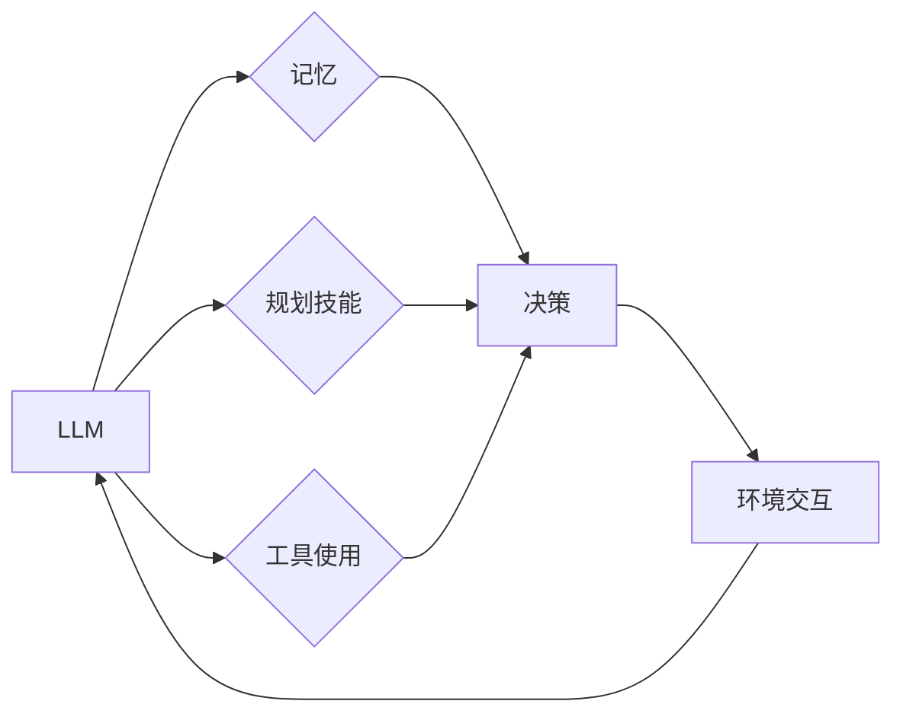

>  大型语言模型（LLM）、代理（Agent）、记忆、规划、工具使用、人工智能

## 1. 背景介绍

近年来，人工智能（AI）领域取得了令人瞩目的进展，其中大型语言模型（LLM）的出现尤为引人注目。LLM 凭借其强大的文本生成、理解和翻译能力，在自然语言处理（NLP）领域展现出巨大的潜力。然而，单纯的LLM 缺乏自主学习和决策的能力，难以应对复杂环境下的任务。为了突破这一瓶颈，研究者们开始探索将LLM与其他技术相结合，构建更智能、更具自主性的代理（Agent）。

## 2. 核心概念与联系

代理（Agent）是指能够感知环境、做出决策并与环境交互的智能体。传统的代理通常基于规则或模型，而现代代理则更倾向于利用机器学习算法，例如强化学习，来学习和优化行为策略。

LLM 作为一种强大的文本处理模型，可以为代理提供丰富的知识和语言理解能力。记忆机制可以帮助代理保存历史信息，从而更好地理解上下文和做出更明智的决策。规划技能则赋予代理制定目标和计划的能力，使其能够在复杂环境中有效地执行任务。最后，工具使用能力使代理能够利用外部工具和资源，进一步扩展其功能和能力。

**核心概念与联系流程图：**



## 3. 核心算法原理 & 具体操作步骤

### 3.1  算法原理概述

构建基于LLM的代理的核心算法原理是将LLM的文本处理能力与其他人工智能技术相结合，形成一个闭环的学习和决策系统。

* **LLM 作为知识库和语言理解引擎：** LLM 可以理解和生成自然语言，并根据其训练数据积累了丰富的知识。代理可以利用LLM来获取信息、理解问题和生成文本。
* **记忆机制：** 记忆机制可以帮助代理保存历史信息，例如之前执行的任务、遇到的问题和取得的成果。这使得代理能够更好地理解上下文，并做出更明智的决策。
* **规划技能：** 规划技能是指代理能够制定目标和计划的能力。代理可以使用规划算法来制定执行任务的步骤，并根据环境变化进行调整。
* **工具使用：** 工具使用能力是指代理能够利用外部工具和资源的能力。代理可以利用工具来完成一些无法直接完成的任务，例如访问网络、处理图像或执行代码。

### 3.2  算法步骤详解

1. **环境感知：** 代理首先需要感知周围环境，例如获取传感器数据、读取文本信息或观察用户行为。
2. **问题理解：** 代理利用LLM来理解环境信息，并将其转化为可执行的任务。
3. **知识检索：** 代理从其记忆库中检索相关知识，以帮助理解问题和制定解决方案。
4. **计划生成：** 代理使用规划算法来制定执行任务的步骤，并考虑环境变化和资源限制。
5. **工具选择：** 代理根据任务需求选择合适的工具，并利用工具使用能力来执行任务。
6. **行动执行：** 代理执行计划中的步骤，并与环境交互。
7. **结果评估：** 代理评估执行结果，并根据反馈信息更新其记忆库和行为策略。

### 3.3  算法优缺点

**优点：**

* **强大的知识和语言理解能力：** LLM 可以提供丰富的知识和语言理解能力，使代理能够更好地理解问题和生成解决方案。
* **自主学习和决策能力：** 结合记忆和规划技能，代理能够自主学习和决策，并适应不断变化的环境。
* **可扩展性：** 通过工具使用能力，代理可以扩展其功能和能力，并完成更复杂的任务。

**缺点：**

* **计算资源需求高：** LLM 和规划算法的计算资源需求较高，需要强大的硬件支持。
* **数据依赖性强：** LLM 的性能取决于其训练数据，如果训练数据不足或不准确，代理的性能也会受到影响。
* **安全性和可靠性问题：** 代理的决策可能会受到恶意攻击或数据偏差的影响，需要加强安全性和可靠性方面的研究。

### 3.4  算法应用领域

基于LLM的代理具有广泛的应用前景，例如：

* **客服机器人：** 代理可以理解用户问题，并提供准确的答案和解决方案。
* **智能助理：** 代理可以帮助用户完成各种任务，例如日程安排、信息检索和文件处理。
* **游戏AI：** 代理可以作为游戏中的对手或伙伴，提供更智能和有趣的体验。
* **自动驾驶：** 代理可以帮助车辆感知环境、做出决策并安全驾驶。

## 4. 数学模型和公式 & 详细讲解 & 举例说明

### 4.1  数学模型构建

一个基于LLM的代理可以被建模为一个马尔可夫决策过程（MDP）。

* **状态空间 (S)：** 代理所处的环境状态，例如车辆位置、道路状况、目标位置等。
* **动作空间 (A)：** 代理可以执行的动作，例如加速、减速、转向等。
* **奖励函数 (R)：** 代理在执行某个动作后获得的奖励，例如到达目的地、避免碰撞等。
* **转移概率 (P)：** 从一个状态执行某个动作后转移到另一个状态的概率。

### 4.2  公式推导过程

代理的目标是找到一个最优策略，即在每个状态下执行最优动作，以最大化累积奖励。最优策略可以使用动态规划算法或强化学习算法来求解。

* **Bellman方程：** Bellman方程描述了最优价值函数的递推关系。

$$
V^*(s) = \max_a \left[ R(s, a) + \gamma \sum_{s'} P(s' | s, a) V^*(s') \right]
$$

其中：

* $V^*(s)$ 是状态 $s$ 的最优价值函数。
* $R(s, a)$ 是在状态 $s$ 执行动作 $a$ 后获得的奖励。
* $\gamma$ 是折扣因子，控制未来奖励的权重。
* $P(s' | s, a)$ 是从状态 $s$ 执行动作 $a$ 后转移到状态 $s'$ 的概率。

### 4.3  案例分析与讲解

例如，在一个自动驾驶场景中，代理的状态空间可以包括车辆位置、速度、方向等信息，动作空间可以包括加速、减速、转向等操作。奖励函数可以设计为鼓励代理安全到达目的地，并避免碰撞等危险情况。通过训练强化学习模型，代理可以学习到最优策略，从而实现安全和高效的自动驾驶。

## 5. 项目实践：代码实例和详细解释说明

### 5.1  开发环境搭建

* **操作系统：** Ubuntu 20.04 LTS
* **编程语言：** Python 3.8
* **深度学习框架：** TensorFlow 2.x
* **LLM 模型：** GPT-3 (OpenAI API)

### 5.2  源代码详细实现

```python
import openai

# 设置 OpenAI API 密钥
openai.api_key = "YOUR_API_KEY"

# 定义代理类
class Agent:
    def __init__(self, memory_size=100):
        self.memory = []
        self.memory_size = memory_size

    def perceive(self, environment):
        # 获取环境信息
        # ...

    def plan(self, goal):
        # 使用规划算法制定计划
        # ...

    def act(self, action):
        # 执行动作
        # ...

    def learn(self, reward):
        # 更新记忆库和行为策略
        # ...

# 创建代理实例
agent = Agent()

# 模拟环境
environment = {
    "location": "start",
    "goal": "destination",
}

# 代理执行任务
while True:
    # 代理感知环境
    perception = agent.perceive(environment)

    # 代理规划行动
    plan = agent.plan(environment["goal"])

    # 代理执行行动
    agent.act(plan)

    # 代理学习奖励
    reward = agent.learn(environment)

    # 更新环境状态
    # ...
```

### 5.3  代码解读与分析

* **代理类：** 代理类包含代理的属性和方法，例如记忆库、感知环境、规划行动、执行行动和学习奖励等。
* **感知环境：** 代理需要感知环境信息，例如位置、目标、障碍物等。
* **规划行动：** 代理需要根据环境信息和目标制定行动计划。
* **执行行动：** 代理需要执行计划中的行动，例如移动、交互等。
* **学习奖励：** 代理需要根据执行结果获得奖励，并更新其行为策略。

### 5.4  运行结果展示

代理在模拟环境中执行任务，并根据奖励反馈不断优化其行为策略。最终，代理能够成功到达目标位置。

## 6. 实际应用场景

### 6.1  智能客服机器人

基于LLM的代理可以作为智能客服机器人，理解用户问题，并提供准确的答案和解决方案。例如，用户可以向机器人询问产品信息、订单状态或售后服务等问题，机器人可以根据其知识库和训练数据提供相关信息。

### 6.2  个性化教育助手

代理可以根据学生的学习进度和需求，提供个性化的学习内容和辅导。例如，代理可以根据学生的错题分析，推荐相关的学习资源，并提供针对性的讲解和练习。

### 6.3  自动代码生成

代理可以根据用户需求，自动生成代码。例如，用户可以描述想要实现的功能，代理可以根据其代码库和编程知识，自动生成相应的代码。

### 6.4  未来应用展望

随着LLM技术和人工智能技术的不断发展，基于LLM的代理将有更广泛的应用场景，例如：

* **医疗诊断辅助：** 代理可以辅助医生诊断疾病，并提供个性化的治疗方案。
* **金融风险管理：** 代理可以分析金融数据，识别潜在的风险，并提供风险控制建议。
* **科学研究辅助：** 代理可以帮助科学家分析实验数据，发现新的规律，并加速科研进度。

## 7. 工具和资源推荐

### 7.1  学习资源推荐

* **OpenAI API 文档：** https://beta.openai.com/docs/api-reference/introduction
* **HuggingFace Transformers 库：** https://huggingface.co/docs/transformers/index
* **DeepMind Blog：** https://deepmind.com/blog/

### 7.2  开发工具推荐

* **Jupyter Notebook：** https://jupyter.org/
* **Google Colab：** https://colab.research.google.com/
* **VS Code：** https://code.visualstudio.com/

### 7.3  相关论文推荐

* **Attention Is All You Need：** https://arxiv.org/abs/1706.03762
* **BERT: Pre-training of Deep Bidirectional Transformers for Language Understanding：** https://arxiv.org/abs/1810.04805
* **AlphaGo：** https://deepmind.com/blog/alphago-defeats-world-champion-go-player

## 8. 总结：未来发展趋势与挑战

### 8.1  研究成果总结

近年来，基于LLM的代理取得了显著进展，在多个领域展现出巨大的潜力。LLM的强大文本处理能力、记忆机制、规划技能和工具使用能力，为代理提供了更智能、更具自主性的决策能力。

### 8.2  未来发展趋势

* **更强大的LLM模型：** 随着模型规模和训练数据的不断增加，LLM的性能将进一步提升，为代理提供更强大的知识和语言理解能力。