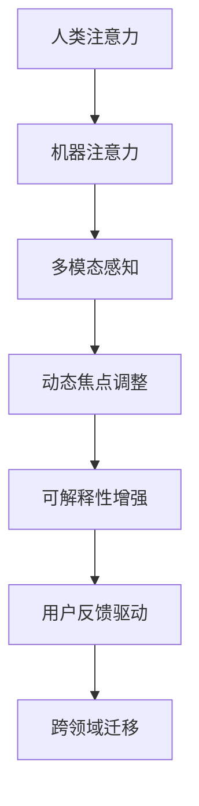

                 

## 1. 背景介绍

### 1.1 问题由来
在信息化快速发展的今天，人们的注意力被各种信息流所分散，传统的线性认知模型已难以应对复杂多变的任务环境。AI技术，特别是深度学习的发展，为人们提供了一种全新的认知提升路径。通过对人类注意力机制的模拟，AI模型能够在信息爆炸的环境中，精准高效地抓取关键信息，提升学习、决策和问题解决的效率。

### 1.2 问题核心关键点
人类注意力增强，即通过AI技术增强人类的认知能力，使人们能够更高效地处理信息。具体包括以下几个核心关键点：

- 多模态感知：模拟人类视觉、听觉、触觉等多种感官信息的融合，提升对环境的全面感知能力。
- 动态焦点调整：通过动态调整注意力焦点，高效处理复杂任务，避免信息过载。
- 可解释性增强：使AI模型的决策过程透明化，帮助人们理解其内部机制和决策依据。
- 用户反馈驱动：利用用户反馈，不断调整注意力模型，使其更加符合用户的认知需求。
- 跨领域迁移：将注意力增强技术应用于更多场景，如医疗、教育、金融等，提升各领域的工作效率。

### 1.3 问题研究意义
通过AI技术增强人类注意力，不仅可以提升信息处理能力，减少决策错误，还能在多个领域带来变革性的应用效果。具体来说，人类注意力增强的研究意义包括：

- 提升个人效能：使人们能够更快速、准确地处理信息，提高学习和工作效率。
- 增强决策质量：在医疗、金融等高风险领域，增强决策的可靠性和准确性。
- 推动产业升级：应用在教育、商业、物流等领域，提高整体运行效率，提升用户体验。
- 促进社会发展：通过注意力增强，实现更加智能化、个性化的服务，促进社会的全面进步。

## 2. 核心概念与联系

### 2.1 核心概念概述

为更好地理解人类注意力增强技术，本节将介绍几个密切相关的核心概念：

- 人类注意力：指人们在感知信息时，主动选择和聚焦关键信息的心理过程。人类注意力机制包括了注意力获取、焦点保持和焦点转移等环节。
- 机器注意力：通过模拟人类注意力机制，构建的机器学习模型。常见的机器注意力模型包括注意力机制网络、卷积注意力网络、注意力自编码器等。
- 多模态感知：指同时处理视觉、听觉、触觉等多种信息源的感知过程。多模态感知模型可以更好地捕捉环境的多维信息，提高认知效率。
- 动态焦点调整：指模型能够根据任务需求动态调整注意力焦点，确保对关键信息的准确抓取。
- 可解释性增强：指通过解释机器决策过程，使人类更好地理解其内部机制。可解释性增强是AI技术在社会应用中的关键要求。
- 用户反馈驱动：指模型能够根据用户反馈进行调整和优化，提升用户满意度。
- 跨领域迁移：指注意力增强技术可以在不同领域间进行迁移应用，提升整体认知能力。

这些核心概念之间的逻辑关系可以通过以下Mermaid流程图来展示：



这个流程图展示了大模型注意力机制的几个核心概念及其之间的关系：

1. 人类注意力机制是AI注意力的基础。
2. 机器注意力模型通过模拟人类注意力，进行多模态感知和焦点调整。
3. 可解释性增强和用户反馈驱动进一步提升了AI注意力的实用性和普适性。
4. 跨领域迁移将注意力增强技术应用于多个领域，拓展其应用范围。

## 3. 核心算法原理 & 具体操作步骤
### 3.1 算法原理概述

人类注意力增强的核心算法原理主要基于注意力机制(Attention Mechanism)。注意力机制是一种能够动态选择输入中不同部分进行加权处理的模型，通过向不同区域分配不同的注意力权重，实现对关键信息的聚焦。

具体来说，注意力机制主要包括以下几个步骤：

1. 计算注意力得分：对输入进行编码，计算输入中的不同部分与目标之间的注意力得分。
2. 注意力加权：根据注意力得分，对输入中的不同部分进行加权，得到加权后的表示。
3. 加权求和：将加权后的表示进行加权求和，得到最终的注意力表示。

通过注意力机制，模型能够对输入中的关键部分进行强调，提升信息处理的效率和准确性。

### 3.2 算法步骤详解

基于注意力机制的注意力增强算法主要包括以下几个关键步骤：

**Step 1: 输入编码**

首先，需要将输入数据进行编码，得到其向量表示。编码过程通常使用卷积神经网络(CNN)或循环神经网络(RNN)等模型。以视觉输入为例，可以使用卷积神经网络对图像进行编码，得到高层次的特征表示。

**Step 2: 注意力得分计算**

在编码得到特征表示后，需要计算输入中不同部分与目标之间的注意力得分。常用的注意力得分计算方法包括点积注意力、双向注意力、多头注意力等。以点积注意力为例，计算方法如下：

$$
\text{Attention Score} = \text{Encoder Output} \cdot \text{Attention Query}
$$

其中，$\text{Encoder Output}$ 为编码器输出的特征表示，$\text{Attention Query}$ 为注意力查询向量。

**Step 3: 注意力加权**

根据计算得到的注意力得分，对输入中的不同部分进行加权，得到加权后的表示。加权方法通常使用softmax函数，将注意力得分进行归一化处理。

$$
\text{Attention Weights} = \text{Softmax}(\text{Attention Score})
$$

其中，$\text{Attention Weights}$ 为注意力权重向量。

**Step 4: 加权求和**

将加权后的表示进行加权求和，得到最终的注意力表示。具体计算方法如下：

$$
\text{Attention Representation} = \sum_{i} \text{Attention Weights}_i \cdot \text{Encoder Output}_i
$$

其中，$\text{Attention Representation}$ 为最终的注意力表示。

### 3.3 算法优缺点

基于注意力机制的注意力增强算法具有以下优点：

1. 高效性：通过动态调整注意力权重，模型能够在输入中快速定位关键信息，提高信息处理效率。
2. 可解释性：注意力机制能够提供模型内部决策过程的可视化，帮助人们理解其决策依据。
3. 灵活性：注意力机制可以根据任务需求，灵活调整注意力焦点，适应不同的任务场景。

同时，该算法也存在一些局限性：

1. 计算复杂度高：注意力机制的计算复杂度较高，需要大量的计算资源。
2. 依赖高质量标注数据：训练过程中需要高质量的标注数据，标注成本较高。
3. 鲁棒性不足：注意力机制对输入噪声和变化较为敏感，鲁棒性不足。

尽管存在这些局限性，但基于注意力机制的注意力增强技术仍然是大数据时代提升认知能力的重要手段。

### 3.4 算法应用领域

基于注意力增强技术，在多个领域都取得了显著的应用效果。以下是几个典型的应用场景：

1. 自然语言处理(NLP)：在问答系统、机器翻译、文本摘要等任务中，通过注意力机制对输入文本进行聚焦，提升模型的理解能力和生成质量。

2. 计算机视觉(CV)：在图像分类、目标检测、图像生成等任务中，通过多模态注意力机制，提升模型对复杂场景的识别和处理能力。

3. 语音处理：在语音识别、语音生成、情感识别等任务中，通过多模态注意力机制，提升模型的多通道信息融合能力。

4. 医疗影像分析：在医学影像分类、病变检测、手术模拟等任务中，通过注意力机制对关键区域进行聚焦，提升模型的诊断精度。

5. 金融分析：在股票分析、风险评估、交易策略等任务中，通过注意力机制对市场动态进行聚焦，提升模型的预测能力和决策质量。

6. 智能推荐：在电商推荐、音乐推荐、广告推荐等任务中，通过注意力机制对用户行为进行聚焦，提升推荐系统的精准度和用户满意度。

随着注意力增强技术的应用不断拓展，相信在更多领域将会涌现出更多的创新应用，为人类认知能力的提升提供新的助力。

## 4. 数学模型和公式 & 详细讲解  
### 4.1 数学模型构建

本节将使用数学语言对基于注意力机制的注意力增强模型进行更加严格的刻画。

记输入数据为 $X$，编码器输出为 $H$，注意力查询向量为 $Q$，注意力权重为 $A$，注意力表示为 $S$。假设输入数据 $X$ 为二维向量 $[x_1, x_2, \dots, x_n]$，编码器输出 $H$ 为二维向量 $[h_1, h_2, \dots, h_n]$，注意力权重 $A$ 为二维向量 $[a_1, a_2, \dots, a_n]$。

定义注意力得分计算公式为：

$$
A_{i,j} = \text{Attention Score}(h_i, q_j)
$$

其中，$h_i$ 为编码器输出的第 $i$ 个特征向量，$q_j$ 为注意力查询向量。

定义注意力权重计算公式为：

$$
a_i = \text{Softmax}(A_i)
$$

其中，$A_i$ 为注意力得分向量 $A$ 的第 $i$ 个分量。

定义注意力表示计算公式为：

$$
S = \sum_{i=1}^{n} a_i h_i
$$

其中，$S$ 为最终的注意力表示。

### 4.2 公式推导过程

以下我们以点积注意力为例，推导注意力得分和注意力权重的计算公式。

假设输入数据 $X$ 为二维向量 $[x_1, x_2, \dots, x_n]$，编码器输出 $H$ 为二维向量 $[h_1, h_2, \dots, h_n]$，注意力查询向量 $Q$ 为二维向量 $[q_1, q_2, \dots, q_n]$。则注意力得分计算公式为：

$$
A_{i,j} = h_i \cdot q_j
$$

其中，$h_i$ 为编码器输出的第 $i$ 个特征向量，$q_j$ 为注意力查询向量。

注意力权重计算公式为：

$$
a_i = \text{Softmax}(A_i)
$$

其中，$A_i$ 为注意力得分向量 $A$ 的第 $i$ 个分量。

注意力表示计算公式为：

$$
S = \sum_{i=1}^{n} a_i h_i
$$

其中，$S$ 为最终的注意力表示。

将以上公式代入目标函数，得到注意力增强模型的训练目标函数为：

$$
\min_{\theta} \sum_{i=1}^{n} (y_i - \sigma(S_i))^2
$$

其中，$y_i$ 为第 $i$ 个样本的标签，$\sigma$ 为激活函数，$\theta$ 为模型参数。

通过最小化目标函数，可以训练出能够动态调整注意力的注意力增强模型。

## 5. 项目实践：代码实例和详细解释说明
### 5.1 开发环境搭建

在进行注意力增强技术开发前，我们需要准备好开发环境。以下是使用Python进行PyTorch开发的环境配置流程：

1. 安装Anaconda：从官网下载并安装Anaconda，用于创建独立的Python环境。

2. 创建并激活虚拟环境：
```bash
conda create -n attention-env python=3.8 
conda activate attention-env
```

3. 安装PyTorch：根据CUDA版本，从官网获取对应的安装命令。例如：
```bash
conda install pytorch torchvision torchaudio cudatoolkit=11.1 -c pytorch -c conda-forge
```

4. 安装Tensorflow：
```bash
pip install tensorflow
```

5. 安装各类工具包：
```bash
pip install numpy pandas scikit-learn matplotlib tqdm jupyter notebook ipython
```

完成上述步骤后，即可在`attention-env`环境中开始注意力增强技术的开发实践。

### 5.2 源代码详细实现

这里我们以一个简单的注意力增强模型为例，展示其代码实现。

```python
import torch
import torch.nn as nn
import torch.nn.functional as F

class Attention(nn.Module):
    def __init__(self, in_features):
        super(Attention, self).__init__()
        self.W = nn.Linear(in_features, 1)

    def forward(self, X):
        Q = self.W(X)
        Q = torch.softmax(Q, dim=1)
        S = torch.matmul(X, Q)
        return S

# 定义输入和标签
X = torch.randn(3, 5)
y = torch.randn(3)

# 创建注意力增强模型
model = Attention(5)

# 设置超参数
learning_rate = 0.001
num_epochs = 100

# 定义优化器
optimizer = torch.optim.SGD(model.parameters(), lr=learning_rate)

# 训练模型
for epoch in range(num_epochs):
    optimizer.zero_grad()
    output = model(X)
    loss = F.mse_loss(output, y)
    loss.backward()
    optimizer.step()
    print('Epoch {} - Loss: {:.4f}'.format(epoch+1, loss.item()))

# 测试模型
test_X = torch.randn(2, 5)
test_y = torch.randn(2)
output = model(test_X)
print('Predicted Output:', output)
```

### 5.3 代码解读与分析

让我们再详细解读一下关键代码的实现细节：

**Attention类**：
- `__init__`方法：初始化注意力机制的参数。
- `forward`方法：实现注意力机制的计算过程。

**X和y变量**：
- `X`表示输入数据，`y`表示目标标签。

**Attention模型**：
- 定义注意力机制的线性层 `W`。
- 在 `forward` 方法中，首先计算注意力得分，然后计算注意力权重，最后通过矩阵乘法计算注意力表示。

**训练流程**：
- 设置学习率和迭代轮数。
- 定义优化器。
- 循环迭代，每次更新模型参数。
- 输出每个epoch的损失值。

**测试流程**：
- 定义测试数据。
- 使用训练好的模型进行预测输出。
- 输出预测结果。

可以看到，通过以上代码，我们可以使用PyTorch实现一个简单的注意力增强模型，并在训练和测试过程中不断调整模型参数，提升模型的注意力机制效果。

当然，在实际应用中，还需要对模型进行更复杂的设计和优化，如多模态注意力机制、多头注意力机制、注意力加权等。但核心的注意力增强算法原理与以上代码类似。

## 6. 实际应用场景
### 6.1 智能医疗

在智能医疗领域，注意力增强技术可以应用于医学影像分析、疾病诊断等任务。通过注意力机制对影像中关键区域进行聚焦，提高模型对病变的识别能力。

在医学影像分类任务中，可以将影像数据输入注意力模型，通过多模态注意力机制，对影像中的不同区域进行加权处理，提取关键特征。例如，在肺部CT影像中，模型能够聚焦于病灶区域，提取出病灶的形态、大小等特征，从而提高分类准确度。

在疾病诊断任务中，可以通过注意力机制对患者病历文本进行聚焦，提取病情描述中的关键信息，辅助医生进行诊断。例如，在自然语言处理技术的基础上，注意力机制可以识别出病历文本中的主要症状、病史等信息，为医生提供精准的诊断建议。

### 6.2 智能金融

在金融分析领域，注意力增强技术可以应用于股票预测、风险评估等任务。通过注意力机制对市场数据进行聚焦，提高模型对市场动态的敏感度，提升预测和评估的准确度。

在股票预测任务中，可以将历史股价数据输入注意力模型，通过多模态注意力机制，对不同时间段的市场数据进行加权处理，提取关键的市场特征。例如，在股价预测任务中，模型能够聚焦于股价波动较大的时间段，提取出市场趋势、技术指标等信息，从而提高预测准确度。

在风险评估任务中，可以通过注意力机制对交易数据进行聚焦，提取关键的风险指标，如杠杆率、交易量等，评估交易的风险等级。例如，在金融风险评估任务中，模型能够聚焦于高风险交易，提取交易额、交易频率等关键信息，帮助金融监管机构及时发现和防范风险。

### 6.3 智能制造

在智能制造领域，注意力增强技术可以应用于生产线监控、设备维护等任务。通过注意力机制对生产数据进行聚焦，提高模型对生产异常的检测能力，提升生产效率和设备利用率。

在生产线监控任务中，可以将生产数据输入注意力模型，通过多模态注意力机制，对不同设备的数据进行加权处理，提取关键的生产指标。例如，在生产线监控任务中，模型能够聚焦于异常设备，提取出设备运行状态、温度、压力等关键信息，及时发现和解决生产问题。

在设备维护任务中，可以通过注意力机制对设备数据进行聚焦，提取关键的设备故障信息，辅助设备维护人员进行故障诊断。例如，在设备维护任务中，模型能够聚焦于故障设备，提取设备的运行状态、故障代码等信息，为维护人员提供精准的维护建议。

## 7. 工具和资源推荐
### 7.1 学习资源推荐

为了帮助开发者系统掌握注意力增强技术，这里推荐一些优质的学习资源：

1. 《深度学习与认知》系列博文：由大模型技术专家撰写，深入浅出地介绍了深度学习在认知科学中的应用，包括注意力机制的原理和实现。

2. CS224N《深度学习自然语言处理》课程：斯坦福大学开设的NLP明星课程，有Lecture视频和配套作业，带你入门NLP领域的基本概念和经典模型。

3. 《Neural Networks and Deep Learning》书籍：Ian Goodfellow所著的深度学习经典教材，涵盖深度学习的基础知识和高级技术，包括注意力机制的详细介绍。

4. PyTorch官方文档：PyTorch的官方文档，提供了丰富的模型库和样例代码，是进行注意力增强技术开发的必备资料。

5. HuggingFace官方文档：HuggingFace的官方文档，提供了丰富的预训练模型和任务适配层，是进行自然语言处理任务的强大支持。

通过对这些资源的学习实践，相信你一定能够快速掌握注意力增强技术的精髓，并用于解决实际的NLP问题。

### 7.2 开发工具推荐

高效的开发离不开优秀的工具支持。以下是几款用于注意力增强技术开发的常用工具：

1. PyTorch：基于Python的开源深度学习框架，灵活动态的计算图，适合快速迭代研究。大部分预训练语言模型都有PyTorch版本的实现。

2. Tensorflow：由Google主导开发的开源深度学习框架，生产部署方便，适合大规模工程应用。同样有丰富的预训练语言模型资源。

3. HuggingFace Transformers库：HuggingFace开发的NLP工具库，集成了众多SOTA语言模型，支持PyTorch和TensorFlow，是进行注意力增强技术开发的利器。

4. Weights & Biases：模型训练的实验跟踪工具，可以记录和可视化模型训练过程中的各项指标，方便对比和调优。与主流深度学习框架无缝集成。

5. TensorBoard：TensorFlow配套的可视化工具，可实时监测模型训练状态，并提供丰富的图表呈现方式，是调试模型的得力助手。

6. Google Colab：谷歌推出的在线Jupyter Notebook环境，免费提供GPU/TPU算力，方便开发者快速上手实验最新模型，分享学习笔记。

合理利用这些工具，可以显著提升注意力增强技术的开发效率，加快创新迭代的步伐。

### 7.3 相关论文推荐

注意力增强技术的发展源于学界的持续研究。以下是几篇奠基性的相关论文，推荐阅读：

1. Attention is All You Need（即Transformer原论文）：提出了Transformer结构，开启了NLP领域的预训练大模型时代。

2. Transformer-XL: Attentive Neural Machine Translation with Memory Consumption
3. Limitations of Existing Attention Models and the Role of Transformers

3. Neural Architecture Search with Reinforcement Learning：介绍了基于强化学习的神经网络架构搜索方法，为高效设计注意力增强模型提供了新的思路。

4. Progressive Growing of Neural Networks with Application to Generative Adversarial Networks：介绍了神经网络渐进式增长的方法，为提高注意力增强模型的鲁棒性提供了新方法。

5. Learning Transferable Architectures for Modeling Object Categorization：介绍了可迁移的神经网络架构，为提高注意力增强模型的泛化性提供了新思路。

这些论文代表了大模型注意力增强技术的发展脉络。通过学习这些前沿成果，可以帮助研究者把握学科前进方向，激发更多的创新灵感。

## 8. 总结：未来发展趋势与挑战

### 8.1 总结

本文对基于注意力机制的注意力增强技术进行了全面系统的介绍。首先阐述了注意力增强技术的研究背景和意义，明确了其在大数据时代提升认知能力的重要作用。其次，从原理到实践，详细讲解了注意力增强模型的核心算法原理和具体操作步骤，给出了注意力增强技术开发的完整代码实例。同时，本文还广泛探讨了注意力增强技术在多个领域的应用前景，展示了其强大的实用价值。此外，本文精选了注意力增强技术的各类学习资源，力求为读者提供全方位的技术指引。

通过本文的系统梳理，可以看到，基于注意力机制的注意力增强技术在多个领域的应用前景广阔，不仅能够提升信息处理效率，还能在各个行业带来变革性的应用效果。未来，伴随注意力增强技术的持续演进，相信其将会在更多领域得到应用，为人类认知能力的提升提供新的助力。

### 8.2 未来发展趋势

展望未来，注意力增强技术将呈现以下几个发展趋势：

1. 多模态融合：在多模态数据融合的基础上，提升注意力增强模型的感知能力，使其能够更好地理解复杂多变的环境信息。
2. 动态注意力：通过引入动态注意力机制，使模型能够根据任务需求动态调整注意力焦点，提高处理复杂任务的能力。
3. 可解释性增强：通过可解释性技术，使注意力增强模型能够提供透明化的决策依据，提升模型的可靠性和信任度。
4. 跨领域迁移：将注意力增强技术应用于更多领域，提升各领域的工作效率，拓展其应用边界。
5. 认知增强：在认知科学的基础上，深入研究人类注意力的神经机制，开发更加智能化的注意力增强模型。
6. 深度学习与生物计算的融合：结合生物计算技术，开发更加高效的注意力增强模型，提升其计算能力和实时性。

以上趋势凸显了注意力增强技术的广阔前景。这些方向的探索发展，必将进一步提升注意力增强模型的性能和应用范围，为人类认知能力的提升提供新的助力。

### 8.3 面临的挑战

尽管注意力增强技术已经取得了瞩目成就，但在迈向更加智能化、普适化应用的过程中，它仍面临着诸多挑战：

1. 计算资源需求高：注意力增强模型往往需要大量的计算资源，这对硬件设备提出了较高要求。
2. 数据需求量大：训练过程中需要大量的标注数据，数据获取成本较高。
3. 模型复杂度高：注意力增强模型结构复杂，训练和推理过程耗时较长。
4. 鲁棒性不足：注意力增强模型对输入噪声和变化较为敏感，鲁棒性不足。
5. 可解释性不足：注意力增强模型的决策过程复杂，难以解释其内部机制。

尽管存在这些挑战，但通过学界和产业界的共同努力，相信这些挑战终将一一被克服，注意力增强技术必将在构建人机协同的智能时代中扮演越来越重要的角色。

### 8.4 研究展望

面对注意力增强技术所面临的挑战，未来的研究需要在以下几个方面寻求新的突破：

1. 探索更加高效的注意力机制：设计更加轻量级的注意力模型，提高其计算效率和实时性。
2. 开发更加普适化的多模态注意力模型：结合人类感知机制，开发更加智能化的多模态注意力增强模型。
3. 引入知识图谱与规则库：将符号化的先验知识，如知识图谱、逻辑规则等，与神经网络模型进行融合，提升模型的泛化能力和决策质量。
4. 增强模型的可解释性：通过可解释性技术，使注意力增强模型能够提供透明化的决策依据，提升模型的可靠性和信任度。
5. 提升模型的鲁棒性：通过引入鲁棒性增强技术，使模型对输入噪声和变化具有更好的适应能力。

这些研究方向的探索，必将引领注意力增强技术迈向更高的台阶，为构建安全、可靠、可解释、可控的智能系统铺平道路。面向未来，注意力增强技术还需要与其他人工智能技术进行更深入的融合，如知识表示、因果推理、强化学习等，多路径协同发力，共同推动认知科学的进步。

## 9. 附录：常见问题与解答

**Q1：注意力增强技术是否适用于所有NLP任务？**

A: 注意力增强技术在大多数NLP任务上都能取得不错的效果，特别是对于数据量较小的任务。但对于一些特定领域的任务，如医学、法律等，仅仅依靠通用语料预训练的模型可能难以很好地适应。此时需要在特定领域语料上进一步预训练，再进行微调，才能获得理想效果。此外，对于一些需要时效性、个性化很强的任务，如对话、推荐等，注意力增强方法也需要针对性的改进优化。

**Q2：在训练注意力增强模型时，如何选择合适的注意力机制？**

A: 选择合适的注意力机制需要根据具体的任务需求和数据特点进行权衡。常见的注意力机制包括点积注意力、多头注意力、双向注意力等。在训练过程中，可以使用交叉验证等方法，比较不同注意力机制的表现，选择最合适的注意力机制。

**Q3：注意力增强模型在落地部署时需要注意哪些问题？**

A: 将注意力增强模型转化为实际应用，还需要考虑以下因素：
1. 模型裁剪：去除不必要的层和参数，减小模型尺寸，加快推理速度
2. 量化加速：将浮点模型转为定点模型，压缩存储空间，提高计算效率
3. 服务化封装：将模型封装为标准化服务接口，便于集成调用
4. 弹性伸缩：根据请求流量动态调整资源配置，平衡服务质量和成本
5. 监控告警：实时采集系统指标，设置异常告警阈值，确保服务稳定性
6. 安全防护：采用访问鉴权、数据脱敏等措施，保障数据和模型安全

大模型注意力增强技术为NLP应用开启了广阔的想象空间，但如何将强大的性能转化为稳定、高效、安全的业务价值，还需要工程实践的不断打磨。唯有从数据、算法、工程、业务等多个维度协同发力，才能真正实现人工智能技术在垂直行业的规模化落地。总之，注意力增强需要开发者根据具体任务，不断迭代和优化模型、数据和算法，方能得到理想的效果。

---

作者：禅与计算机程序设计艺术 / Zen and the Art of Computer Programming

